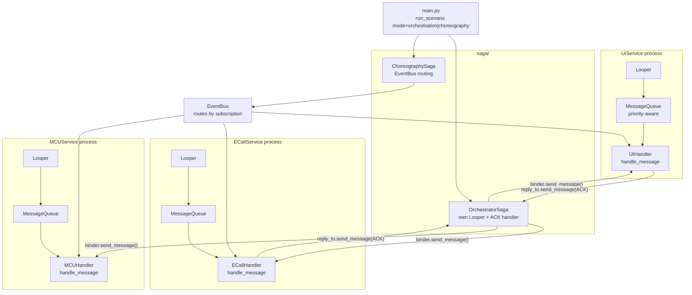
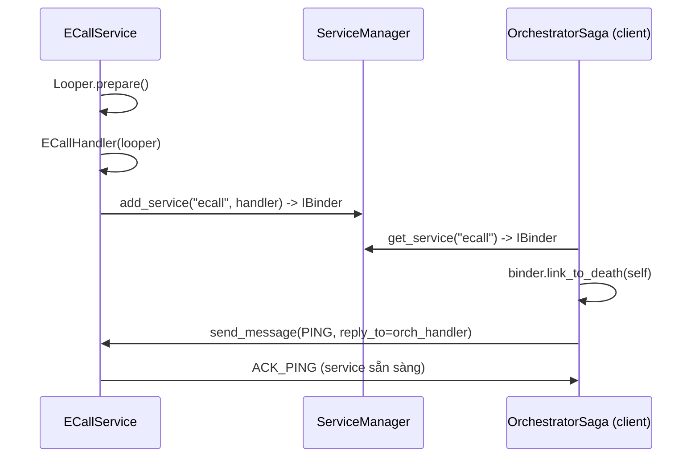
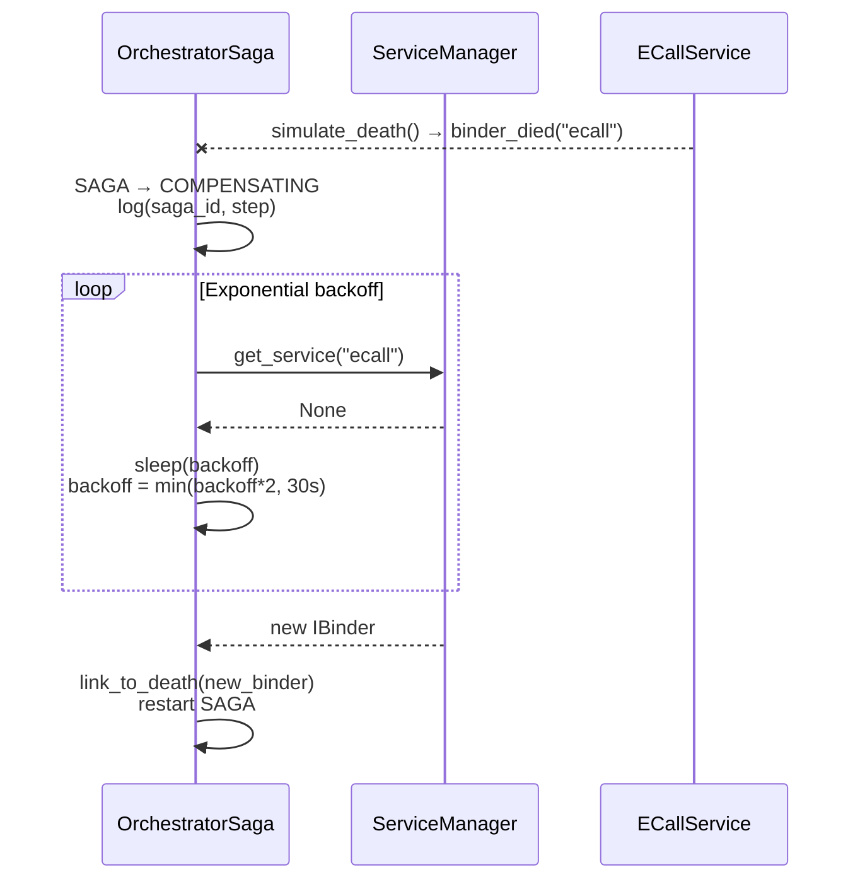
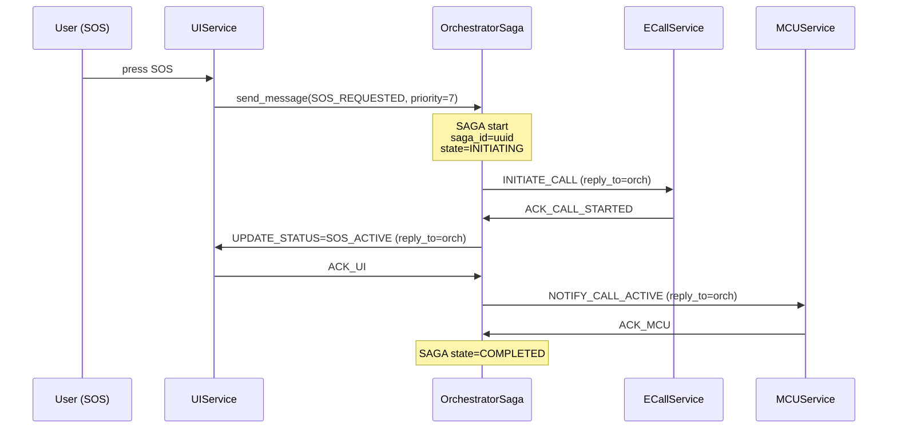
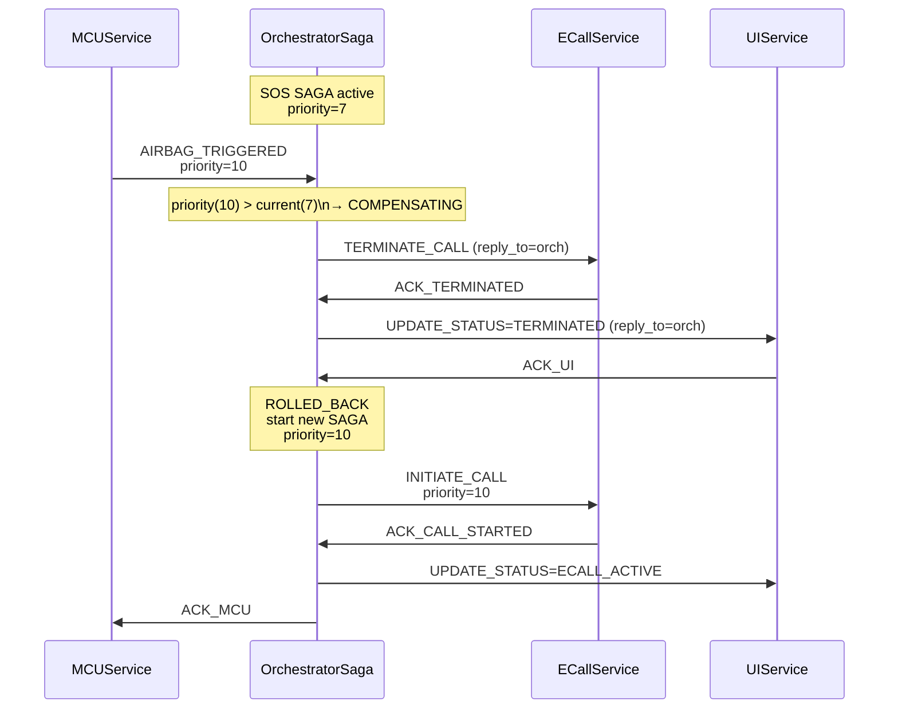
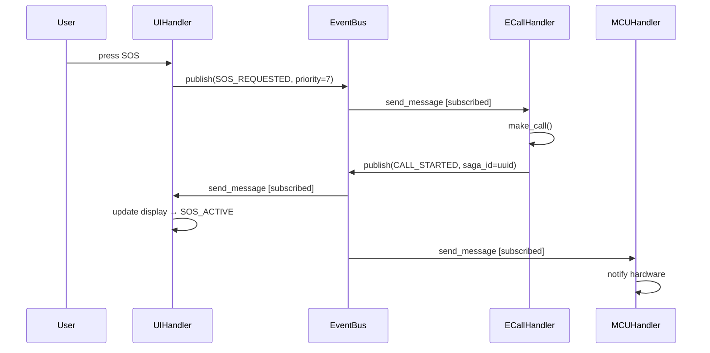
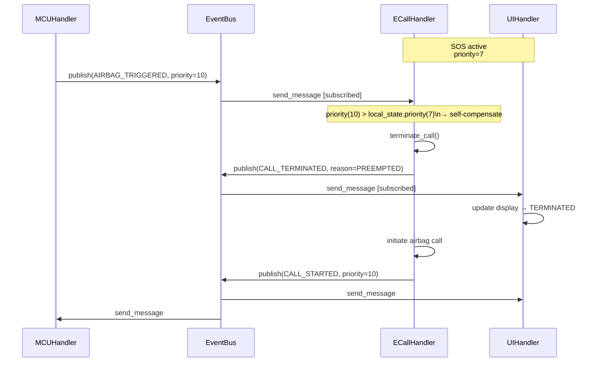
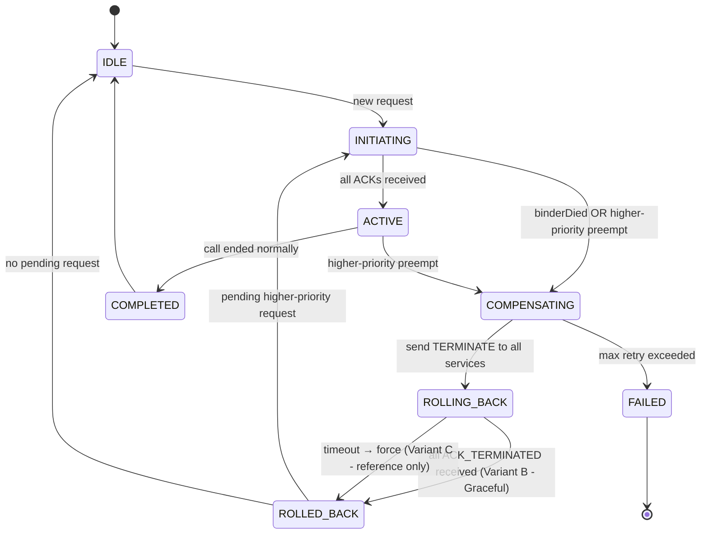

# Design: eCall SAGA Pattern Demo

**Ngày:** 2026-06-25
**Mục tiêu:** Code demo học SAGA pattern trong hệ thống telematics ô tô, sử dụng eCall/SOS flow làm ví dụ thực tế. Aligned với Android Binder/Looper concepts.

---

## 1. Bối cảnh & Yêu cầu

Hệ thống telematics gồm 3 services:

- **UIService** — người dùng bấm nút SOS, hiển thị trạng thái eCall
- **ECallService** — thực hiện/terminate emergency call tới PSAP
- **MCUService** — nhận tín hiệu airbag, điều khiển hardware

**Vấn đề cần giải quyết:**

1. Nhất quán state giữa UI / eCall-service / MCU trong suốt một SAGA transaction
2. Khi có request priority cao hơn (airbag=10 > SOS=7) interrupt call đang active → compensation (terminate graceful) → start new call
3. Service crash giữa chừng (`binderDied`) → recovery + retry

**Tech stack:** Python, class skeleton with mock/stubs (runnable nhưng không cần real IPC).

---

## 2. Approach: Shared Infrastructure + Strategy Pattern

Một bộ services và EventBus chung. `main.py` chạy cùng scenario với 2 strategy:

```
mode=orchestration  →  OrchestratorSaga điều phối tập trung
mode=choreography   →  Mỗi Handler tự react qua EventBus
```

---

## 3. Architecture Overview



---

## 4. Android Binder/Looper Mapping

| Android Concept  | Demo Implementation                                                 |
| ---------------- | ------------------------------------------------------------------- |
| `Looper`         | Mỗi service chạy trên thread riêng với message loop                 |
| `MessageQueue`   | Priority heap: `(-priority, timestamp)` → airbag chen hàng          |
| `Handler`        | `handle_message()` chạy trên Looper thread của service              |
| `Message`        | `what=EventType`, `priority`, `saga_id`, `obj`, `reply_to`          |
| `IBinder`        | Reference tới remote Handler; expose `send_message()`, `is_alive()` |
| `linkToDeath`    | `IBinder.link_to_death(recipient: DeathRecipient)`                  |
| `binderDied`     | `DeathRecipient.binder_died(service_name)` callback                 |
| `ServiceManager` | Singleton registry: `add_service()`, `get_service()`                |

---

## 5. Core Components

### 5.1 Message & Event Types

```python
@dataclass
class Message:
    what: EventType          # SOS_REQUESTED, AIRBAG_TRIGGERED, INITIATE_CALL,
                             # TERMINATE_CALL, CALL_STARTED, CALL_TERMINATED,
                             # UPDATE_STATUS, ACK_*, PING, SAGA_FAILED...
    priority: int            # 1=low … 10=critical (airbag=10, SOS=7)
    saga_id: str             # UUID — trace toàn bộ 1 SAGA transaction
    obj: dict                # flexible payload
    reply_to: Handler | None # ACK sẽ gửi về Handler này
    timestamp: float         # for FIFO ordering within same priority
```

### 5.2 Looper & MessageQueue

```python
class MessageQueue:
    # Thread-safe priority heap: key = (-priority, timestamp)
    def put(msg: Message) -> None
    def get() -> Message          # blocking
    def get_nowait() -> Message | None
    def peek_priority() -> int

class Looper:
    queue: MessageQueue
    def loop() -> None            # while True: handler.dispatch(queue.get())
    def quit() -> None
    def prepare() -> None         # bind Looper to current thread
```

### 5.3 Handler & IBinder

```python
class Handler:
    looper: Looper
    def send_message(msg: Message) -> None   # enqueue vào looper.queue
    def handle_message(msg: Message) -> None # abstract

class IBinder:
    _handler: Handler
    _death_recipients: list[DeathRecipient]
    def link_to_death(recipient: DeathRecipient) -> None
    def unlink_to_death(recipient: DeathRecipient) -> None
    def send_message(msg: Message) -> None
    def is_alive() -> bool
    def simulate_death() -> None  # notify tất cả recipients

class DeathRecipient(Protocol):
    def binder_died(service_name: str) -> None
```

### 5.4 ServiceManager

```python
class ServiceManager:  # Singleton
    def add_service(name: str, handler: Handler) -> IBinder
    def get_service(name: str) -> IBinder | None
    def remove_service(name: str) -> None
```

### 5.5 Base Service

```python
class BaseService(Handler):
    local_state: ECallState  # IDLE | SOS_ACTIVE | ECALL_ACTIVE | TERMINATED
    saga_id: str | None      # SAGA đang active
    priority: int            # priority của SAGA hiện tại

    def handle_message(msg: Message) -> None  # abstract
    def get_state() -> ECallState
    def _send_ack(msg: Message, success: bool) -> None
```

---

## 6. Service Lifecycle

### Startup



### binderDied + Recovery



---

## 7. SAGA Flows

### 7.1 Orchestration — Happy Path (SOS)



### 7.2 Orchestration — Airbag Interrupt + Compensation



### 7.3 Choreography — Happy Path (SOS)



### 7.4 Choreography — Airbag Interrupt



---

## 8. Priority & SAGA State Machine

### SAGA State Machine



### Compensation Variants

**Variant B — Graceful terminate with ACK (main demo):**

- Gửi `TERMINATE_CALL` tới tất cả active binders
- `await _wait_for_acks(expected=all_services, timeout=None)`
- Nhận đủ ACK → `ROLLED_BACK`

**Variant C — Timeout-based (reference only, không implement đầy đủ):**

- Giống B nhưng `timeout=COMPENSATION_TIMEOUT_SEC`
- Nếu timeout: force `ROLLED_BACK`, log missing ACKs

---

## 9. File Structure

```
ecall_saga_demo/
├── core/
│   ├── message.py          # Message, EventType enum, AckResult
│   ├── looper.py           # Looper, MessageQueue (priority heap)
│   ├── handler.py          # Handler base, IBinder, DeathRecipient protocol
│   ├── service_manager.py  # ServiceManager singleton
│   └── state.py            # ECallState, SagaState enums
├── services/
│   ├── base_service.py     # BaseService(Handler) + lifecycle helpers
│   ├── ui_service.py       # UIService: SOS input, display status
│   ├── ecall_service.py    # ECallService: make/terminate call (mock)
│   └── mcu_service.py      # MCUService: airbag trigger, hardware notify
├── saga/
│   ├── base_saga.py        # BaseSaga: state machine, compensation logic
│   ├── orchestration.py    # OrchestratorSaga: drives each step, owns ACK wait
│   └── choreography.py     # ChoreographySaga: EventBus routing setup
└── main.py                 # run_scenario(mode="orchestration"|"choreography")
```

---

## 10. Scenario được demo trong main.py

```
1. Khởi động 3 services (Looper threads)
2. Register với ServiceManager
3. Orchestrator/Choreography linkToDeath với mỗi service
4. [SOS Flow] User nhấn SOS → SAGA bắt đầu
5. [Interrupt] Airbag trigger giữa chừng → Compensation → New SAGA
6. [Recovery] Simulate ECallService crash → binderDied → retry → restart SAGA
7. In log toàn bộ state transitions
```
