# Raw Document Content

- Source file: 25 FA_trung.hoang_Improving performance of event notification in Power Manager/25 FA_Improving performance of event notification in Power Manager_Final.docx

['25 FA] Improving performance of event notification in Power Manager

About This Document

Document Information

## Table
| Document Title | SW Design |
| --- | --- |
| Project | 24DCM |
| Issuing Authority | Toyota |
| Author | Hoang Quang Trung (trung.hoang@lge.com) |
| Status of Document | Completed |

Revision History

## Table
| Version | Date | Content of Change | Author | Reviewer |
| --- | --- | --- | --- | --- |
| 01 | 2025.09.17 | Initial Release | trung.hoang | by.kim |
| 02 | 2025.09.22 | - Add measurement results for 1 core thread in Core pool size configuration. - Add configuration of Dynamic Thread Pool. - Add Scale up/scale down algorithm verification. | trung.hoang | by.kim |
| 03 | 2025.09.24 | - Fixed some minor spelling errors - Updated captions on some images. | trung.hoang | by.kim |

List of images

Figure 1: Overall system architecture	8

Figure 2: Software architectural design	9

Figure 3: Power Manager service component interaction diagram in 24DCM architecture	10

Figure 4: Power Manager service components	11

Figure 5: Power Manager event processing delay issue	13

Figure 6: Expected scenario for Stop Remote AC	14

Figure 7: Actual scenario for Stop Remote AC	14

Figure 8: Detailed sequence analysis of processing delays	15

Figure 9: Power Manager service notification mechanism for an event	16

Figure 10: Power notification mechanism proposal 1- Thread Cache Pool	19

Figure 11: Power notification mechanism proposal 2- Fixed Thread Pool	20

Figure 12: Power notification mechanism proposal 3- Dynamic Thread Pool	22

Figure 13: Design for Dynamic Thread Pool proposal 1 - Direct Integration	24

Figure 14: Design for Dynamic Thread Pool proposal 2 - Generic Interface	25

Figure 15: Power Manager service components after implementation	27

Figure 16: Dynamic Thread Pool class diagram	28

Figure 17: Dynamic Thread Pool flow	29

Figure 18: Dynamic Thread Pool scale up algorithm	30

Figure 19: Dynamic Thread Pool scale down algorithm	31

Figure 20: Resource usage monitoring with 1 core thread	33

Figure 21: Notification execution time per event with 1 core thread	33

Figure 22: Resource usage monitoring with 2 core threads	33

Figure 23: Notification execution time per event with 2 core threads	33

Figure 24: Resource usage monitoring with 4 core threads	34

Figure 25: Notification execution time per event with 4 core threads	34

Figure 26: Resource usage monitoring with 8 core thread	34

Figure 27: Notification execution time per event with 8 core threads	34

Figure 28: Log when issue occurs (On-Demand Thread)	37

Figure 29: Log after applying Dynamic Thread Pool	37

Figure 30: Dynamic Thread Pool - Scale up log	38

Figure 31: Dynamic Thread Pool - Scale down log	38

Figure 32: Resource usage monitoring On-Demand Thread	39

Figure 33: Notification execution time per event of On-Demand Thread	39

Figure 34: Resource usage monitoring Dynamic Thread Pool	39

Figure 35: Notification execution time per event of Dynamic Thread Pool	40

List of tables

Table 1: Quality Attributes	17

Table 2: Comparison of Power Manager service’s notification mechanism proposals	23

Table 3: Comparison of Dynamic Thread Pool’s design proposals	26

Table 4: Configuration Testing Results	35

Table 5: Performance and Resource usage Comparison Table	40

Table 6: Quality Attributes result	41

Introduction

Purpose

This document presents the detailed software design analysis for improving the performance of event notification in Power Manager service. The document identifies current system bottlenecks, analyzes performance requirements, evaluates multiple architectural approaches, and provides a comprehensive design solution to enhance notification processing efficiency in systems.

Audience

The readers of this article are as follows:

Software Architect

Developer

Project Leader

Project Manager

Test Engineer

Abbreviations / Terms

## Table
| Abbreviation | Description |
| --- | --- |
| DCM | Data Communication Module |
| SAD | Software Architectural Design |
| AP | Application Processor |
| CP | Communication Processor |
| MCU | Micro Controller Unit |
| IG | Ignition |
| BUB | Backup Battery |
| Remote AC | Remote AC, generic name for remote start (app) and Remote AC system. |

Related Documents

## Table
| Drawing Number | Title | Version |
| --- | --- | --- |
| 4-DCM-02-00 | 24DCM Common Requirement Specification | V.01.06.00 |
| 4-DCM-02-00 | 24DCM_Service List | V.01.06.00 |
| 4-DCM-03-00 | 24DCM Feature list | V.01.03.00 |
| 7-DPF-01-00 | 24DCM PF Specification | V 01.12.00 |
| 24RMT-SYS-08 | 24CY_Remote_AC_System_Requirement_Specification_Evaluation specification | V.01.13.00 |
| 24RMT-SYS-08 | 24CY_Remote_AC_System_Requirement_Specification | V.4.70 |

Project Context

Software Context

Toyota 24DCM is a telematics system that provides connectivity services through TSC and TSP connectivity via integrated modem and Wi-Fi MIMO (QCA6574U). The system features SA515M/SA415M processors with RF850F1K MCU, equipped with GNSS antennas and RF components for location services. It connects to other ECUs via Global CAN and Ethernet, including Zone ECU, C-ECU, ABG, and supports MM H/U, MET, and ADAS systems.

The system includes Audio DSP (WM8937), Class-D amplifier (SY18034), Ethernet PHY (BCM89364), and backup battery with Coulomb Counter for power management.

This overall architecture diagram shows both hardware components and software context, where the green-highlighted (MDM Software, Micom Software) areas represent the software components that will be explored in detail in the following sections.

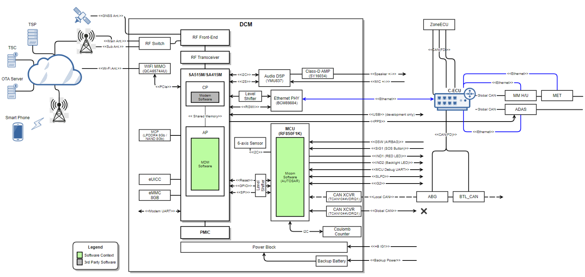
Image reference: doc_image_001.png

Figure : Overall system architecture

Software Architectural

Toyota 24DCM software has the layered architecture. Application Layer, Tiger Framework, TMC Specific Framework, Linux Libraries & Utilities and TMC software provided by OEM. (i.e. Toyota Common Software)

Application Layer has the Regional (destination) Applications that shall meet Toyota requirements by using LGE Tiger and TMC Framework.

Tiger Framework is LGE Telematics Framework. Some modules in this layer are added or updated to meet OEM requirements.

TMC Framework is for Toyota specific requirements.

Although one from an LGE software point of view, these two frameworks are conceptually considered as DCM PF and DCE PF by OEM.

DCM PF API and DCE PF API are the abstraction layers that provide functionalities of DCM to support TMC software.

The green software blocks (several binaries) are provided by TMC and uses the PF API.

DCE API in the green blocks is the layer that provide functionalities of DCE to support TMC software and Tier-1 software (i.e. Regional Application). This is software architecture design of the project.

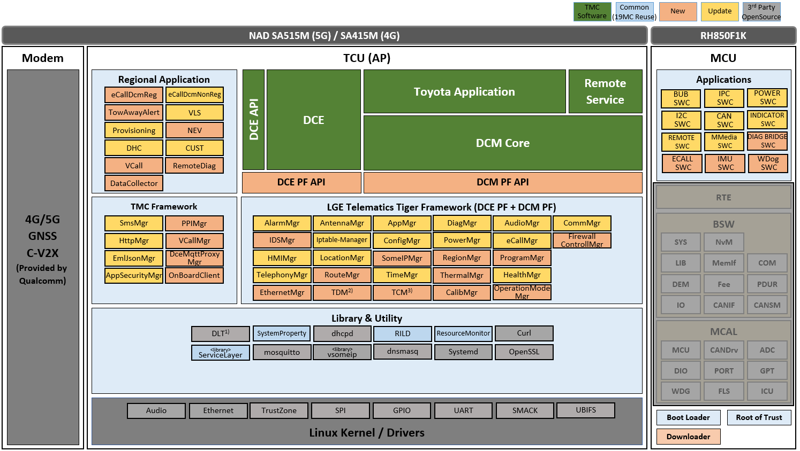
Image reference: doc_image_002.png

Figure : Software architectural design

Applications use provided service APIs to make the service request. Application can receives the response as return value or output parameters if it is a synchronous call. Otherwise, if service call is asynchronous, application can receive response inform of a callback.

Framework services provide other services and application API for making request and receive the response over Binder IPC.

AP communicates with MCU over SPI and UART interfaces.

Background

Power Manager service is one of the services in the telematics system. It is responsible for collecting and managing power-related information from various modules, and actively notifies other applications and services about changes in power state, power source, and battery status…

The main role of Power Manager service is to manage power-related information and provide this information to requested apps/services.

Power-related information is below:

Power state (sleep/wake-up)

Power mode state machine (IG ON, ECO, STANDBY, STOP)

Power source (B+/BUB)

DCE Power state (NORMAL, SLEEP_OK, RESTRICTION)

Power lock

IG status (ON, OFF)

Coulomb Counter state

BUB state

BUB charge level

Main battery voltage

ECU Sleep Diag

System shutdown, restart

These events could be divided into several categories depending on where they came from:

MCU-related information: Power source, BUB information, ACC, IG, CAN state, AP h/w wake-up

NAD/AP related information: Real-time clock, AP h/w wake-up, power lock.

Toyota Application information: Service status, DCE wake lock, Stop Mode permission.

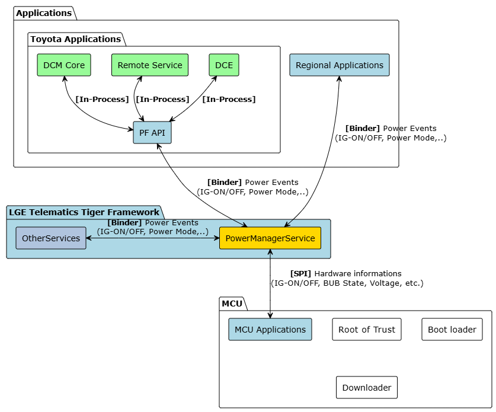
Image reference: doc_image_003.png

Figure : Power Manager service component interaction diagram in 24DCM architecture

Power Manager service includes the core and the variant parts. It describes components of the Power service and their relationship.

Image reference: doc_image_004.png
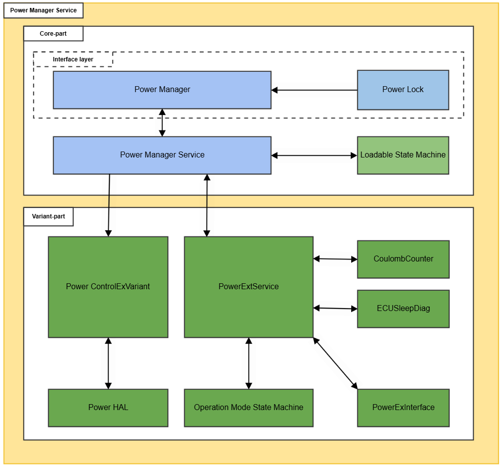
Image reference: doc_image_005.png

Figure : Power Manager service components

Problem Defined

Functional Requirements

Event Notification Requirements

Maintain sequential notification of power events (events must be processed in strict chronological order)

Notify IG ON Status

Pre-conditions: IG OFF and B+ ON.

Actions: User turns ON IG.

Expected: Power Manager service notifies IG ON status to all receivers.

Notify IG OFF Status

Pre-conditions: IG ON and B+ ON.

Actions: User turns OFF IG.

Expected: Power Manager service notifies IG OFF status to all receivers.

DCE Power State Management

Pre-conditions: Given IG OFF and B+ ON.

Actions: User turns ON IG.

Expected: Power Manager service notifies DCE Power State NORMAL to all receivers.

Power Mode Management

Pre-conditions: Given IG OFF and B+ ON.

Actions: User turns ON IG.

Expected:

Power mode changes to IG ON.

Power Manager service notifies IG ON pre power mode change to receivers.

Power Manager service receives results from all receivers and decides whether to switch to IG ON mode or not.

Power Manager service notifies IG ON post power mode change to all receivers.

Stop Remote AC

Pre-conditions: B+ on, ACC off, IG off.

Action:

IG ON.

IG OFF (during the period "2.5 seconds after IG=ON").

Wait 1.5 seconds.

Expected: The Remote AC must stop after step 3.

Problem Identification

Problem Description

The Power Manager service is experiencing a critical performance bottleneck that causes system-wide delays in power event notifications. This issue manifests specifically in DCM24MON-4575, where the Remote AC fails to turn off within the required timeframe after an ignition-off event.

Issue Details:

Expected Behavior: Remote AC should stop within 1.5 seconds after IG OFF.

Actual Behavior: Remote AC takes 4 seconds to turn off.

Test Scenario: IG ON → IG OFF (within 2.5 seconds from IG ON) → Wait 1.5 seconds → Remote AC should stop.

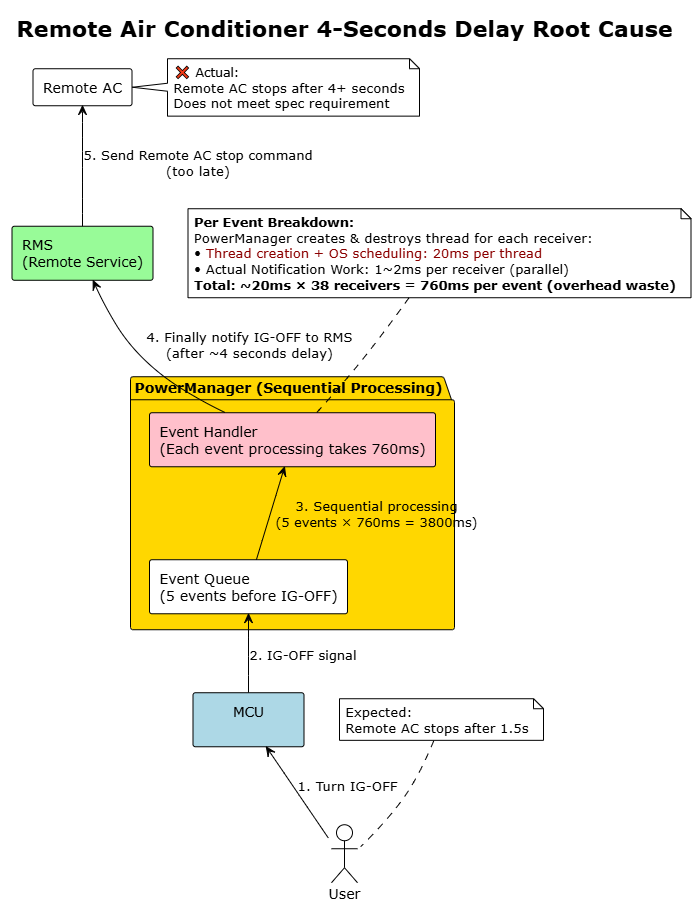
Image reference: doc_image_006.png

Figure : Power Manager event processing delay issue

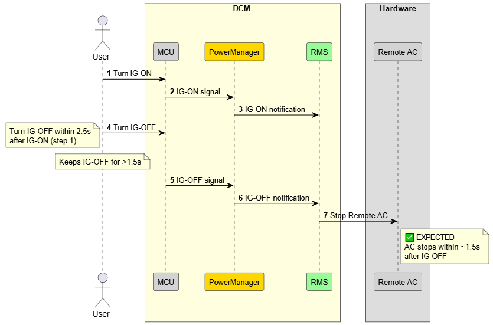
Image reference: doc_image_007.png

Figure : Expected scenario for Stop Remote AC

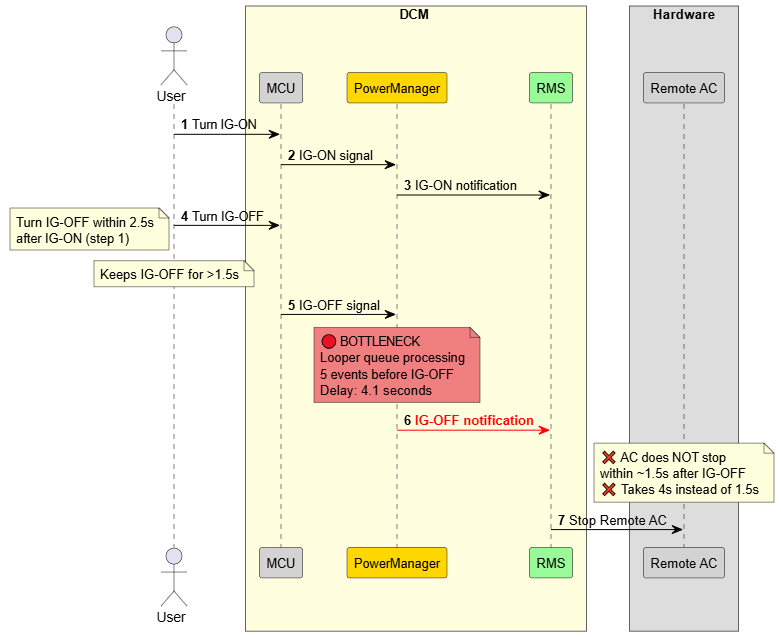
Image reference: doc_image_008.png

Figure : Actual scenario for Stop Remote AC

Impact Analysis:

The 4-second delay creates cascading problems across multiple system layers. From a customer perspective, this delayed response undermines system reliability and user confidence in the vehicle's telematics capabilities. This timing violation also represents non-compliance with Toyota 24DCM specifications, potentially escalating to higher priority issues.

Problem Analysis

Technical Flow Analysis:

Power Manager service processes events sequentially using FIFO ordering to maintain system consistency. When an IG ON event occurs, it triggers multiple power-related events that must be processed: IG Status notification, Power Mode changes, DCE Power State transitions, and other related notifications. Additionally, during this processing period, random events may arrive concurrently such as Voltage changes, BUB Operation Status changes, and other system events.

When the subsequent IG OFF event arrives right after IG ON, it typically queued behind approximately 5 pending events (both the triggered events from IG ON and the random concurrent events). Each event requires a complete notification cycle to all 38 registered receivers, consuming 760ms per cycle. The mathematical result: 5 events × 760ms = 3.8 seconds ≈ 4-seconds delay.

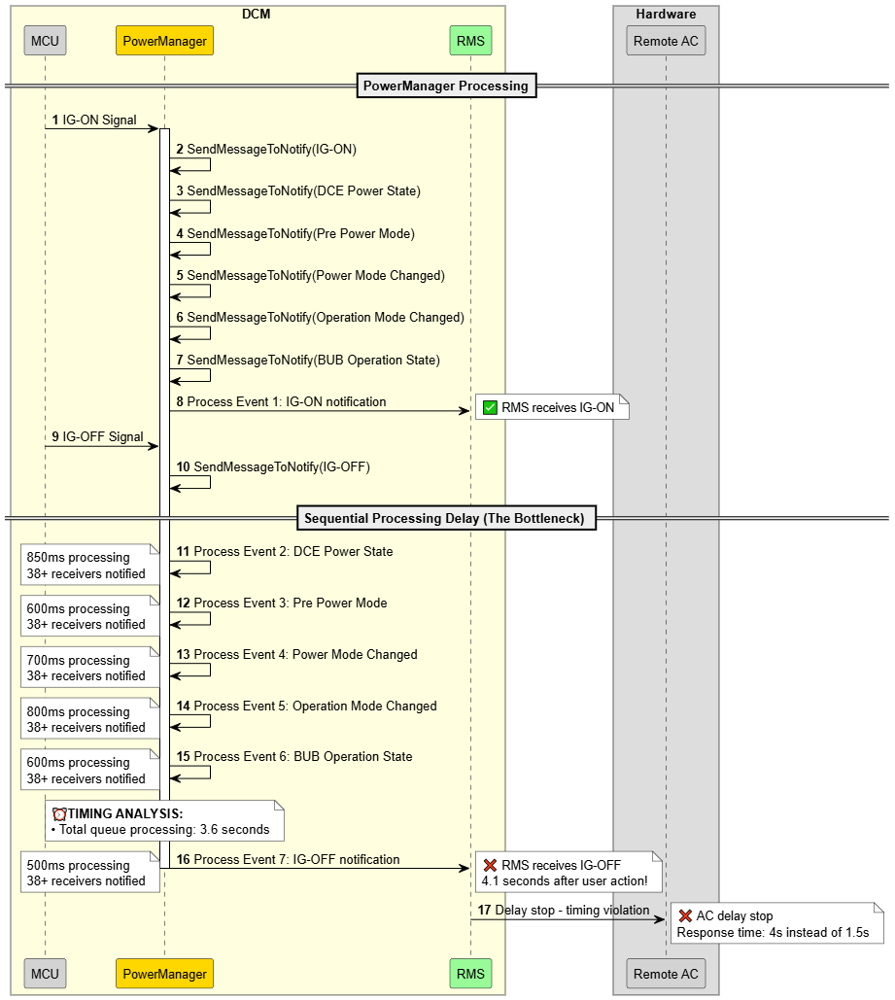
Image reference: doc_image_009.png

Figure : Detailed sequence analysis of processing delays

Current Implementation Problem:

The Power Manager uses an inefficient method that wastes resources for every power event. Here's how it works: for each event, it creates 38 new threads (one for each receiver), sends all notifications at the same time, and then immediately destroys all 38 threads. When the next event comes, this wasteful process repeats completely. This constant creation and destruction of many threads for every event creates serious performance problems:

Thread Creation Overhead:

Creates 38 new threads for each notification event (one per receiver).

Thread creation and system scheduling time: ~20ms per thread.

Total time wasted: 38 threads × 20ms = 760ms per event.

Thread Lifecycle Waste:

All threads are destroyed right after notifications finish.

No thread reuse - starts from scratch every time.

Constant create-destroy cycles waste memory and CPU power.

System Overload Problems:

Performance gets worse as the number of receivers increases (currently 38).

System becomes slow and unresponsive during busy notification periods.

Queue backlog increases when many power events happen at once.

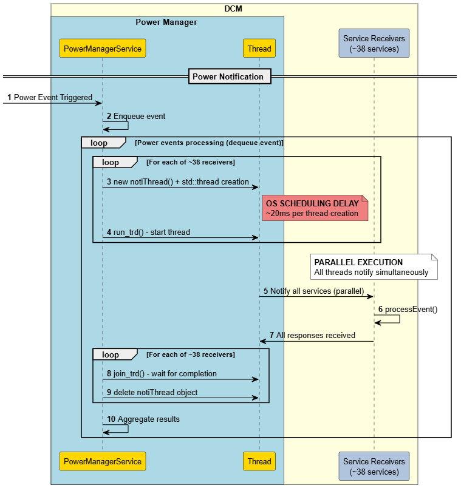
Image reference: doc_image_010.png

Figure : Power Manager service notification mechanism for an event

Conclude:

Delayed notifications are primarily a performance issue, but when they lead to functional errors, they also compromise system reliability, especially during critical power transitions.

→ Improving the power notification mechanism is essential for both performance and system reliability.

Quality Attributes

The following quality attributes were carefully considered and prioritized during the design of the new Power Manager’s notification mechanism. These attributes guided the architectural decisions and solution selection to ensure the new notification mechanism meets both functional requirements and non-functional expectations:

## Table
| Quality Attribute | Priority | Description |
| --- | --- | --- |
| Performance | High | System must meet timing requirements for critical operations with consistent response times. (From 760ms to under 250ms for 1 event → total time for 6 notifies < 1.5 seconds) |
| Reliability | High | Ensure all services/apps receive notifications even when other services/apps fail. |
| Resource Efficiency | Medium | Efficiently manage resources since power notifications occur infrequently, avoiding waste while ensuring rapid response when needed. |
| Maintainability | Medium | The new design must ensure that the system is able to support the changes in the future. |
| Reusability | Medium | New design would be beneficial if it can be reused for other services since all services utilize this notification mechanism |
| Simplicity | Low | Balance implementation complexity with operational reliability for mission-critical systems. |

Table : Quality Attributes

Architecture Alternatives

Notification mechanism for Power Manager service

Based on the problems identified in the previous sections, it is clear that the Power Manager service requires a fundamentally new notification mechanism to address the current performance bottleneck while maintaining system reliability. The existing approach of creating and destroying threads for each notification cycle has proven inadequate for automotive requirements, necessitating a redesigned architecture.

The new notification mechanism must achieve optimal performance while preserving reliability by ensuring that all services receive notification events even when other services encounter failures or processing delays. This fault isolation requirement is critical in automotive systems where one service's malfunction should not cascade to affect the entire power management ecosystem.

Based on these requirements, three alternative proposals were identified, each addressing the core thread performance issue through different strategies.

Proposal 1 – Thread Cache Pool

This proposal maintains a permanent cache of threads, with one dedicated thread for each receiver, eliminating thread creation and destruction overhead entirely. The architecture creates all necessary threads during service initialization and keeps them alive throughout the service lifecycle, with the total thread count matching the number of registered receivers.

Key Characteristics:

Power Manager will pre-allocate thread pool with fixed 1:1 thread-to-receiver mapping.

Threads remain idle between notification events, ready for immediate activation.

Notification processing eliminates the overhead of creating and destroying threads during runtime.

Each thread maintains a dedicated communication channel with its assigned receiver for direct notification delivery.

Sequence Diagram:

Image reference: doc_image_011.png

Figure : Power notification mechanism proposal 1- Thread Cache Pool

Advantages:

Maximum performance: Zero thread lifecycle overhead (estimated ~10ms).

Predictable behavior: Each receiver has guaranteed dedicated thread.

Simple implementation: Straightforward thread management logic.

Immediate notification: No waiting for thread availability.

Disadvantages:

High resource consumption: Permanent threads (equal to receiver count) consume constant memory and CPU resources.

Poor resource efficiency: Threads idle most of the time (automotive systems typically have infrequent power events)

Limited scalability: Adding receivers requires code changes and increased baseline resource usage

Proposal 2 – Fixed Thread Pool

This proposal maintains a small, fixed number of worker threads (typically 2-4) that sequentially process notification tasks from a shared queue. The architecture separates notification tasks from thread management, allowing efficient resource utilization.

Key Characteristics:

Small, fixed number of worker threads (e.g., 2-4 threads).

Task-based architecture where each receiver notification becomes a queued task.

Sequential task processing using available worker threads.

Sequence Diagram:

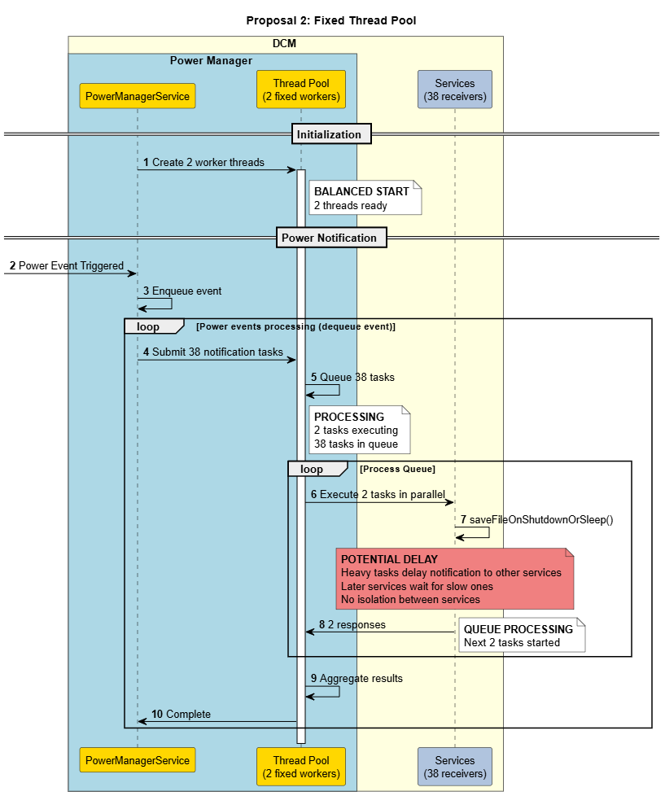
Image reference: doc_image_012.png

Figure : Power notification mechanism proposal 2- Fixed Thread Pool

Advantages:

High Performance: estimated ~20ms for 40 receives with 2 threads)

Resource efficient: Minimal thread overhead during idle periods.

Good CPU utilization: Threads stay busy processing queued tasks.

Simple scaling: Adding receivers only increases task count, not thread count.

Clean separation: Clear distinction between task creation and execution.

Disadvantage:

Thread blocking vulnerability: When all threads are blocked by heavy operations (e.g., sleep/reset events requiring file saves), the entire notification system becomes unresponsive.

Proposal 3 – Dynamic Thread Pool

This proposal implements an adaptive thread pool that automatically scales based on thread performance and processing time thresholds rather than workload volume. The architecture starts with a baseline thread count (e.g., 2 threads) and dynamically adjusts to handle varying processing complexities.

Scale up: Auto-create additional threads when individual thread processing time exceeds threshold.

Scale down: Automatically reduce thread count to baseline after a certain period of inactivity to optimize resource usage.

Key Characteristics:

Start with a fixed number of threads (e.g., 2 threads) as baseline thread pool

Performance-based scaling: Auto-create additional threads when individual thread processing time exceeds threshold

Automatic scale-down: Reduce thread count to baseline after a certain period of inactivity to optimize resource usage

Built-in hang detection and recovery mechanisms for fault tolerance

Threshold-based monitoring for thread performance degradation

Sequence Diagram:
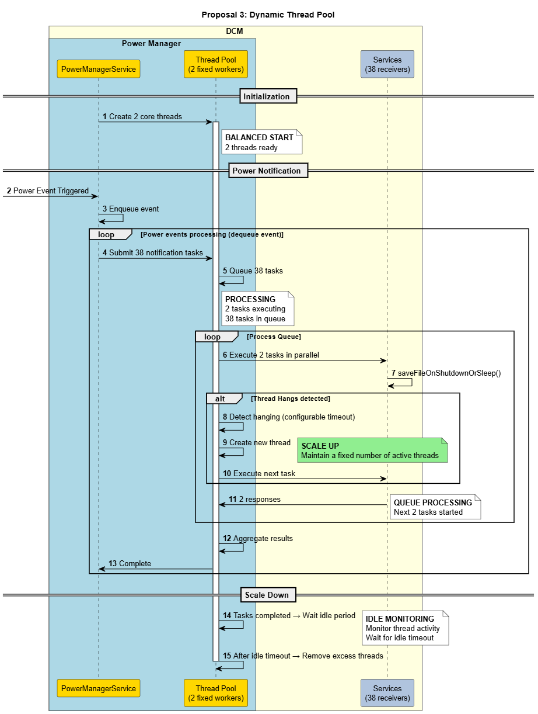
Image reference: doc_image_013.png

Advantages:

High Performance: estimated ~20ms for 40 receives with 2 threads).

Thread isolation: Heavy operations don't block the entire notification system.

Resource adaptive: Scales down during idle periods to minimize resource consumption.

Fault tolerant: Includes hang detection and recovery mechanisms for stuck threads.

Future-proof: Can adapt to changing system requirements and varying event complexities.

Balanced approach: Optimizes both performance and resource efficiency.

Disadvantage:

Implementation complexity: Requires sophisticated scaling algorithms and monitoring.

Comparison and decision

Consider the table to see the comparison of the designs:

## Table
| Criteria | Priority | On-Demand Thread (Current implementation) | Thread Cache (Proposal 1) | Fixed Pool (Proposal 2) | Dynamic Thread Pool (Proposal 3) |
| --- | --- | --- | --- | --- | --- |
| Performance | High | Low (~800ms) | High (<10ms) | High (~20ms) | High (~20ms) |
| Reliability | High | High | High | Low (Delay/fail risk) | High (Auto-scale when delay) |
| Resource Efficiency | Medium | Medium Clear threads when idle High CPU when notify | Low Keeps threads when idle High CPU when notify | Medium | Medium |
| Simplicity | Low | High | High | Medium | Low |

Table : Comparison of Power Manager service’s notification mechanism proposals

Key Decision Factors:

Performance vs. Resource: Dynamic Thread Pool fast enough (~20ms for 40 receives with 2 core threads), Thread Cache resource waste unacceptable for long-running system.

Simplicity: Complex implementation acceptable due to Power Manager's mission-critical nature where reliability outweighs simplicity.

Balanced Trade-offs: Good performance + reliability + adaptive efficiency outweigh complexity concerns.

Selected proposal 3: Dynamic Thread Pool

Design for Dynamic Thread Pool

Having evaluated all three architectural approaches, the Dynamic Thread Pool solution emerges as the optimal choice for addressing Power Manager's performance bottleneck while maintaining system reliability. This section presents two distinct design proposals for implementing the Dynamic Thread Pool architecture. Each proposal offers different integration strategies with varying trade-offs between implementation complexity, reusability, and long-term maintainability.

Proposal 1: Direct Integration (Power-Specific)

Dynamic Thread Pool directly handles Power Manager notifications

Thread pool contains power-specific logic and receiver handling

Simple integration but limited reusability

No abstraction layer - tightly coupled design

Image reference: doc_image_014.png
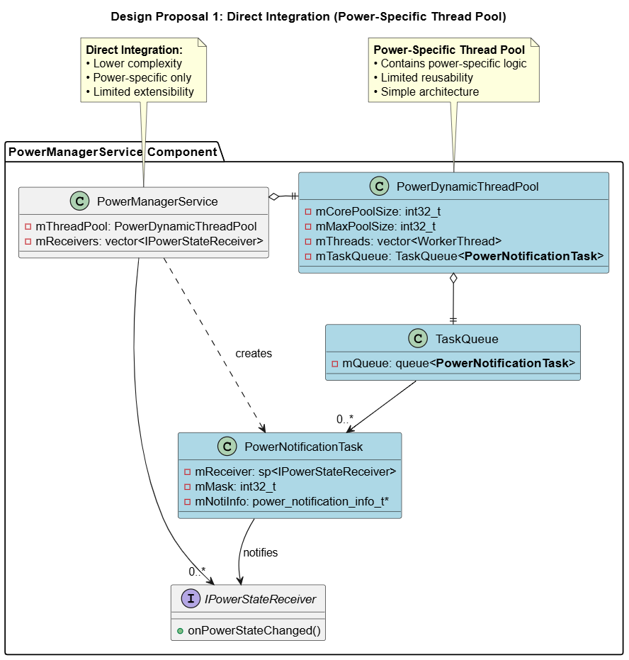
Image reference: doc_image_015.png

Figure : Design for Dynamic Thread Pool proposal 1 - Direct Integration

This proposal implements a specialized thread pool designed exclusively for Power Manager’s notifications. The PowerDynamicThreadPool class directly understands PowerNotificationTask objects and contains built-in logic for handling power-specific scenarios such as IG status changes, power mode transitions, and receiver management. While this design offers straightforward implementation and optimal performance for power notifications, it creates a tightly coupled architecture where the thread pool cannot be reused by other services in the system. The approach sacrifices long-term maintainability and extensibility for immediate implementation simplicity.

Proposal 2: Generic Interface Design

Dynamic Thread Pool remains generic through ITask interface

Generic Interface Design: PowerNotificationTask implements ITask interface

Power-specific logic encapsulated in concrete task implementation

Generic Thread Pool can execute any task implementing ITask interface

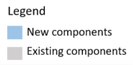
Image reference: doc_image_016.png
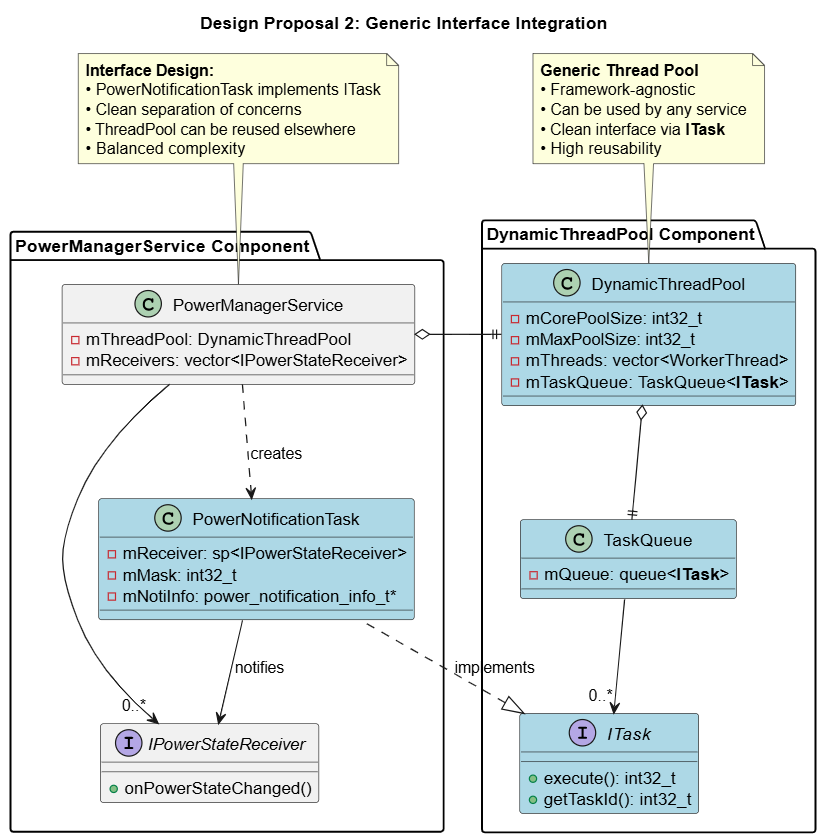
Image reference: doc_image_017.png

Figure : Design for Dynamic Thread Pool proposal 2 - Generic Interface

This approach implements a truly generic DynamicThreadPool that operates on ITask interface abstractions, enabling reusability across multiple services within the Toyota 24DCM telematics system. The PowerNotificationTask class implements the ITask interface, encapsulating all power-specific logic within the task implementation while keeping the thread pool completely agnostic to the task type.

This design promotes clean architecture principles by separating thread management concerns from business logic, allowing Power Manager to reuse it for handling various multitask operations through the same thread pool infrastructure.

The additional abstraction layer providing significant long-term benefits in maintainability, testability, and system-wide performance optimization.

Comparison and decision

## Table
| Criteria | Direct Integration (Proposal 1) | Generic Interface Integration (Proposal 2) |
| --- | --- | --- |
| Maintainability | Low (mixed concerns) | High (separated concerns) |
| Reusability | Low (power-specific only) | High (works across services) |
| Simplicity | High (simple integration) | Medium |

Table : Comparison of Dynamic Thread Pool’s design proposals

Decision Rationale:

While Direct Integration has lower complexity, Generic Interface Integration provides superior architectural benefits for long-term maintainability and reusability.

Key Decision Factors:

Reusability: Enable thread pool usage across multiple services

Clean Architecture: Separation of concerns for better maintainability

Selected Design: Generic Interface Integration (Proposal 2)

Implementation and Verification

Implementation

This section presents the detailed implementation of the Dynamic Thread Pool solution, including both static architecture views and dynamic behavior flows that demonstrate how the thread pool operates to resolve the Power Manager’s performance bottleneck.

Static view

The Dynamic Thread Pool solution integrates as a new component within the Power Manager service core part, which will stay unchanged between projects. It works alongside existing components like Power Manager, Power Lock, and Loadable State Machine. This integration maintains the existing Power Manager service architecture while adding high-performance notification capabilities.

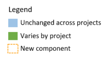
Image reference: doc_image_018.png
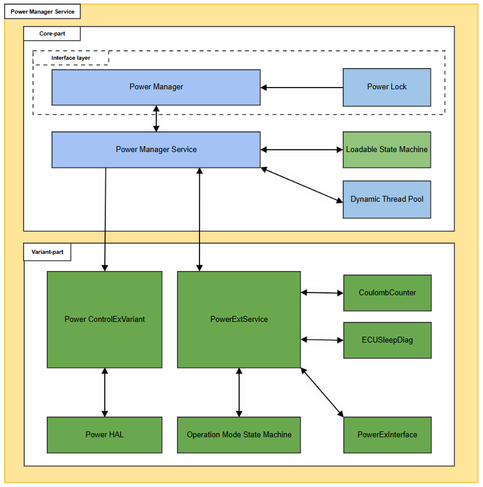
Image reference: doc_image_019.png

Figure : Power Manager service components after implementation

The Dynamic Thread Pool architecture implements a modular design with clear component separation. The central DynamicThreadPool class manages Worker Thread instances that process tasks from a shared Task Queue. Flexibility is achieved through the ITask interface, enabling PowerNotificationTask and other task types to execute uniformly. The ThreadPoolConfig component handles all configuration parameters (core/max pool sizes, timeouts, and thresholds) for runtime tuning. Each Worker Thread maintains independent state while accessing the thread-safe Task Queue through FIFO operations. This interface-based design promotes loose coupling and enables the thread pool to handle diverse task types beyond Power Manager’s notifications, making it a reusable framework component across the Toyota 24DCM system.

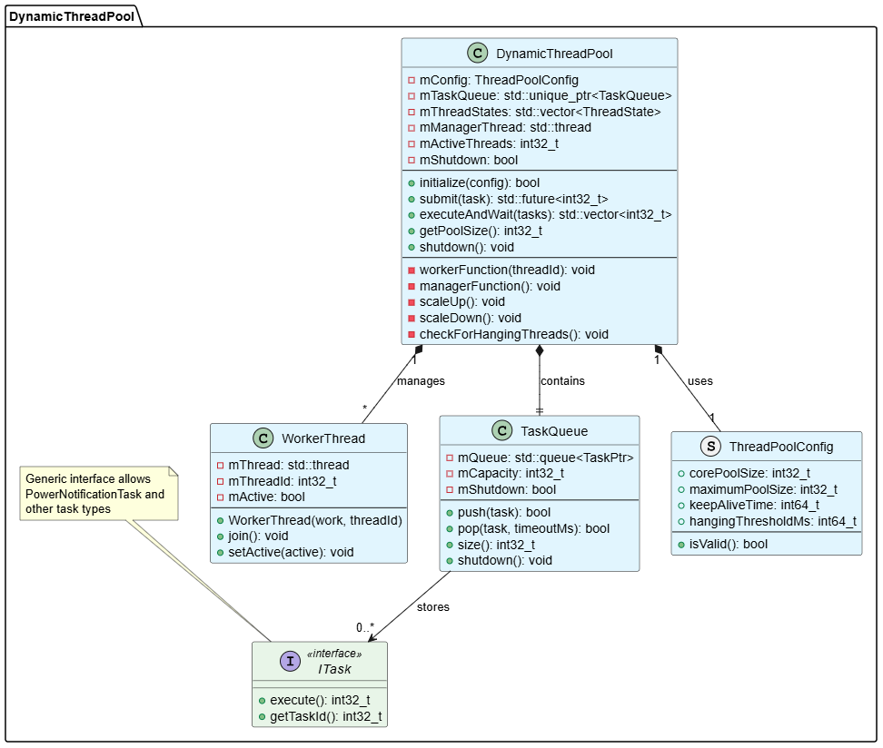
Image reference: doc_image_020.png

Figure : Dynamic Thread Pool class diagram

Dynamic view

Dynamic Thread Pool algorithm diagram:

The Dynamic Thread Pool operates as shown in the flowchart. Worker threads (left side) continuously wait for tasks, execute them when available, and return to an idle state. Management thread (right side) monitors system health by checking for hanging threads and cleaning up idle resources.

Key features include automatic scaling when threads exceed performance thresholds, hang detection with replacement thread creation, and resource cleanup during idle periods.
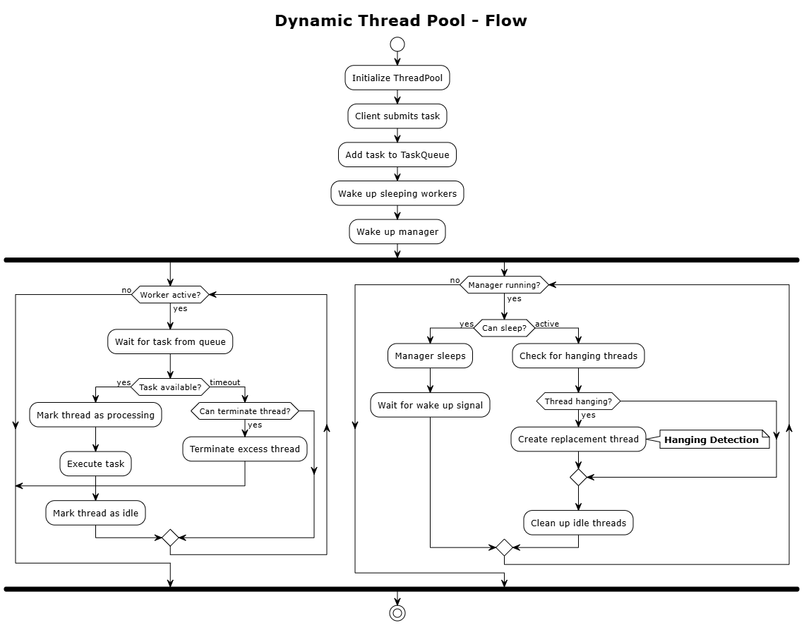
Image reference: doc_image_021.png

Figure : Dynamic Thread Pool flow

Scale-Up Algorithm (hanging detection):

The scale-up algorithm operates through continuous monitoring cycles. The management thread periodically scans all worker threads to check their execution status and processing times. When a thread exceeds the threshold, the system calculates required capacity by comparing pending tasks with available threads.

The algorithm makes intelligent scaling decisions based on 2 key factors: thread availability, maximum pool size limits. If scaling is needed, it creates new worker threads while enforcing safety limits to prevent resource exhaustion. The process includes hang detection - replacing unresponsive threads to maintain system reliability.

Image reference: doc_image_022.png

Figure : Dynamic Thread Pool scale up algorithm

Scale-Down Algorithm:

The Dynamic Thread Pool scale-down algorithm optimizes system resources by intelligently reducing thread count to baseline levels during idle periods. The algorithm operates through a conservative approach that monitors the pool state every threshold interval and only initiates scale-down when all work is finished. During the scale-down process, the algorithm scans each thread to identify idle candidates, checking if threads are not hanging, not processing tasks, and have exceeded the keepAliveTime threshold. Before removing any thread, it performs a double-check to ensure the remaining thread count maintains the minimum corePoolSize capacity.

The algorithm includes built-in protection mechanisms that never terminate busy or hanging threads, and implements adaptive monitoring where the manager can enter deep sleep mode when the pool reaches optimal baseline size, only waking up when new tasks arrive or shutdown is initiated. This design ensures efficient resource utilization while maintaining system responsiveness.

Image reference: doc_image_023.png

Figure : Dynamic Thread Pool scale down algorithm

Configuration

The Dynamic Thread Pool configuration parameters can be adjusted based on the actual requirements and characteristics of each specific project. The following measurements and analysis were conducted to determine the optimal configuration values for the Toyota 24DCM project.

Core pool size (Number of core thread)

Configuration Selection Testing Strategy:

To determine the optimal core thread count for the Dynamic Thread Pool baseline configuration, a systematic testing methodology was implemented to evaluate different thread configurations and identify the best balance between performance and resource efficiency.

Testing Objective:

The primary goal is to find the optimal number of core threads that provides sufficient performance while maintaining minimal resource footprint, before applying this configuration for performance verification in subsequent testing phases.

Test Configuration:

Notification Frequency: Power Manager service configured to send notifications continuously.

Test Duration: 3 minutes sustained load for each configuration.

Result Analysis: Average performance metrics calculated from continuous measurements during the 3 minutes test period.

Monitoring Tools and Commands:

DLT  Log Analysis: Continuous monitoring of Power Manager service logs for notification timing

Timestamp analysis to measure actual notification delivery times.

CPU and Memory Monitoring: top command executed continuously to monitor real-time CPU utilization. Process-specific resource tracking for Power Manager service’s PID

Detailed Process Analysis: cat /proc/[pid]/status executed periodically to capture detailed memory metrics.

Test Results:

1 core thread

Image reference: doc_image_024.png

Figure : Resource usage monitoring with 1 core thread

Image reference: doc_image_025.png

Figure : Notification execution time per event with 1 core thread

2 core threads

Image reference: doc_image_026.png

Figure : Resource usage monitoring with 2 core threads

Image reference: doc_image_027.png

Figure : Notification execution time per event with 2 core threads

4 core threads

Image reference: doc_image_028.png

Figure : Resource usage monitoring with 4 core threads

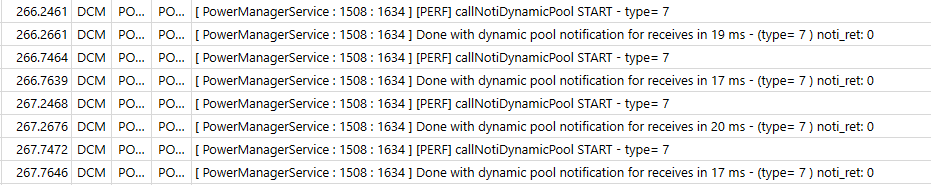
Image reference: doc_image_029.png

Figure : Notification execution time per event with 4 core threads

8 core threads

Image reference: doc_image_030.png

Figure : Resource usage monitoring with 8 core thread

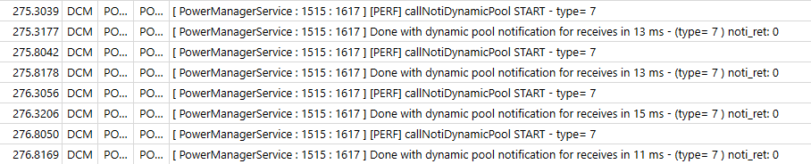
Image reference: doc_image_031.png

Figure : Notification execution time per event with 8 core threads

## Table
| Configuration | Notification Time per Event | CPU Utilization | VmRSS (Physical RAM) | VmSize (Virtual Memory) |
| --- | --- | --- | --- | --- |
| 1 Core Thread | 42ms | 3.7% | 5.72 MB | 134 MB |
| 2 Core Threads | 22ms | 3.7% | 5.76 MB | 142 MB |
| 4 Core Threads | 19ms | 4.3% | 5.86 MB | 158 MB |
| 8 Core Threads | 13ms | 5.0% | 6.03 MB | 190 MB |

Table : Configuration Testing Results

Analysis and Decision Factors:

All configurations satisfy the target of less than 250ms notification time. Since system stability is prioritized, the configuration with minimal resource usage is preferred. However, 1 core thread was not selected due to the following risk:

If a hang occurs, with 1 core thread the Thread Pool will be blocked during hang recovery (~20ms for new thread creation and scheduling). With 2 core threads, one thread continues working while the other thread recovers, minimizing blocking time in notification processing.

2 core threads provides the optimal balance between risk mitigation, resource efficiency, and performance.

Selected core pool size: 2 core threads

Hanging threshold (Scale up threshold)

The hanging threshold determines when the Dynamic Thread Pool creates additional threads to handle blocked threads. This parameter is critical for maintaining system responsiveness while avoiding unnecessary resource consumption.

Through measurement during testing, most services process notifications within 10ms under normal conditions. The hanging threshold of 500ms was selected to balance thread creation overhead with notification response time. Setting the threshold too low (e.g., 100ms) would cause excessive thread creation overhead due to normal processing variations, while setting it too high (e.g., 1000ms) would risk notification delays when genuine bottlenecks occur. The 500ms threshold provides sufficient buffer to avoid unnecessary scaling during normal operations while ensuring adequate response when heavy operations (such as file saves during sleep/reset sequences) genuinely require additional processing time.

Selected hanging threshold: 500 milliseconds

Keep alive time (Scale down threshold)

The keep alive time determines how long excess threads remain active before being terminated during idle periods. This parameter is critical for balancing system responsiveness for subsequent events against resource conservation during low activity periods.

The keep alive time of 30 seconds was selected based on typical automotive power event patterns observed during testing. Automotive power events generally occur in clusters (such as during sleep/wakeup or power mode transitions) followed by idle periods ranging from 30 seconds to several minutes. Setting the keep alive time too short (e.g., 10 seconds) would result in frequent thread creation/destruction cycles causing unnecessary overhead, while setting it too long (e.g., 120 seconds) would waste resources during extended idle periods. The 30-second duration provides optimal balance by maintaining thread availability for typical event intervals while ensuring efficient resource cleanup during longer idle periods.

Selected keep alive time: 30 seconds

Final Configuration Summary:

Core Pool Size: 2 threads (optimal performance with minimal resource footprint)

Hanging Threshold: 500 milliseconds (balanced scaling for automotive scenarios)

Keep Alive Time: 30 seconds (automotive usage pattern optimization)

Verification

Primary Issue Resolution Verification

DCM24MON-4575 Test Results:

Test Scenario:

IG ON

IG OFF (within 2.5 seconds after IG=ON)

Check timing of Remote Service receiving IG OFF signal based on DLT logs

Log Analysis Results:

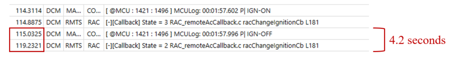
Image reference: doc_image_032.png

Figure : Log when issue occurs (On-Demand Thread)

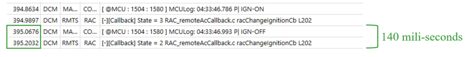
Image reference: doc_image_033.png

Figure : Log after applying Dynamic Thread Pool

Log explanation:

Ignition OFF: "IGN-OFF"

Remote Service received IG OFF status: "State = 2 RAC_remoteAcCallback.c racChangeIgnitionCb"

Measurement Results:

Before optimization (On-Demand Thread): 4.2 seconds

After optimization (Dynamic Thread Pool): 140 milliseconds

Compliance status: PASS - Well within 1.5-second requirement

Summary:

The log analysis clearly demonstrates that the Dynamic Thread Pool solution successfully resolves the DCM24MON-4575 issue, reducing notification time from 4.2 seconds to 140 milliseconds, which fully meets the 1.5-second requirement for Remote AC response.

Scale Up - Scale Down Algorithm Verification

The testing strategy for scale up and scale down algorithm verification focuses on scenarios where services need to perform heavy tasks, specifically during power mode transitions or system reset/shutdown sequences. These scenarios are selected because they represent real-world conditions where services must execute time-consuming operations such as saving state data, closing file handles, and performing cleanup procedures that can exceed the normal notification processing time, thereby triggering the dynamic scaling mechanisms of the thread pool.

Scale up:

Hanging detection triggered when thread 1 processing time reached threshold (500ms) during DiagMgr database save operation (1120ms total duration), successfully creating an additional thread. Pool automatically scaled from 2 to 3 threads (ID=2 created) to maintain system responsiveness during long-running tasks.

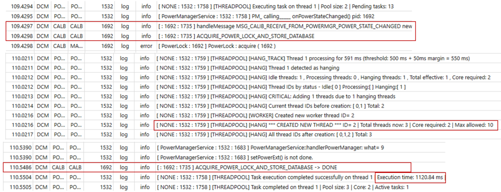
Image reference: doc_image_034.png

Figure : Dynamic Thread Pool - Scale up log

Scale down:

Scale down triggered after 30 seconds idle period with no queued tasks. Thread pool detected excess threads (3 active vs. 2 core required) and gracefully terminated thread ID=0, successfully scaling from 3 to 2 threads to optimize resources while maintaining baseline responsiveness.

Image reference: doc_image_035.png

Figure : Dynamic Thread Pool - Scale down log

System Resource Optimization Verification

Testing Methodology:

To comprehensively evaluate the performance improvements, a continuous stress testing approach was implemented:

Test Configuration:

Notification Frequency: Power Manager service configured to send notifications continuously.

Test Duration: Extended testing periods to capture steady-state performance.

Monitoring Approach: Real-time system resource monitoring using multiple data sources

Monitoring Tools and Commands:

DLT  Log Analysis: Continuous monitoring of Power Manager service logs for notification timing

Timestamp analysis to measure actual notification delivery times.

CPU and Memory Monitoring: top command executed continuously to monitor real-time CPU utilization. Process-specific resource tracking for Power Manager service’s PID

Detailed Process Analysis: cat /proc/[pid]/status executed periodically to capture detailed memory metrics.

Results:

On-Demand Thread
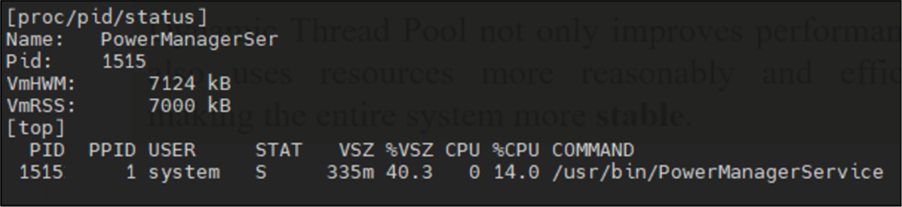
Image reference: doc_image_036.png

Figure : Resource usage monitoring On-Demand Thread

Image reference: doc_image_037.png

Figure : Notification execution time per event of On-Demand Thread

Dynamic Thread Pool

Image reference: doc_image_038.png

Figure : Resource usage monitoring Dynamic Thread Pool

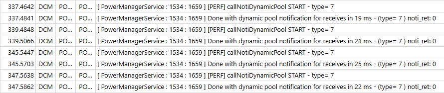
Image reference: doc_image_039.png

Figure : Notification execution time per event of Dynamic Thread Pool

## Table
| Criteria | On-Demand Thread | Dynamic Thread Pool | Improvement |
| --- | --- | --- | --- |
| Notification Time per Event | 750 ms | 22 ms | 97% reduction |
| CPU Utilization (during notifications) | 14% | 3.7% | 74% reduction |
| VmRSS (Physical RAM) | 6.8 MB | 5.7 MB | 12% reduction |
| VmSize (Virtual Memory) | 335 MB | 142 MB | 57% reduction |

Table : Performance and Resource usage Comparison Table

The verification results demonstrate that Dynamic Thread Pool not only improves performance but also uses resources more reasonably and efficiently, making the entire system more stable.

Conclusion

## Table
| Quality Attribute | Priority | Description | Result |
| --- | --- | --- | --- |
| Performance | High | Improved notification processing to ~22ms per event. IG OFF event notification time for Remote Service reduced from 4.2 second to 140ms. | ✅ |
| Reliability | High | Implemented fail-safe mechanism to prevent one service from affecting other services during notification processing. | ✅ |
| Resource Efficiency | Medium | Resource optimization mechanism when not in use in idle time. | ✅ |
| Maintainability | Medium | New design is modular and independent, making it easy to maintain. | ✅ |
| Reusability | Medium | New design can be reused for notification tasks or other operations requiring multi-threading capabilities. | ✅ |
| Simplicity | Low | New implementation is relatively complex but acceptable. | ❌ |

Table : Quality Attributes result

Plan to apply:

November 2025:

Apply the Dynamic Thread Pool to the Power Manager service (Core part) in the Toyota 24DCM (SU) project.

Apply the Dynamic Thread Pool for 26BEV project.

May 2026:

Apply the solution to Power Manager service of all projects (after the testing phase of 26BEV finished).

Move the Dynamic Thread Pool source code to the Tiger Framework Until to enable usage by other services.
