# Raw Slide Content

- Source file: 25 FA_trung.hoang_Improving performance of event notification in Power Manager/25 FA_Improving performance of event notification in Power Manager_Final.pptx
- Total slides: 29

## Slide 1

Improving performance of event notification in Power Manager

Candidate: Hoang Quang Trung (trung.hoang)
Supervisor: Mr. Byung Yong Kim
LGEDV – September 2025

1

## Slide 2

Table of contents

1

Solution Proposals

3

Design Proposals for Selected Solution

4

Overview

 Implementation and Verification

5

6

Problem Identification

2

Conclusion

6

2

Q&A

7

## Slide 3

Power Manager service’s characteristics :
High Fan-out: ~38 service receivers in 24DCM project.
Sequential Processing: Events must be processed in order.
High Reliability Required: Failures or delays in event notification can cause battery drain and system-wide issues.

1. Overview of Power Manager in Toyota 24DCM project

Power Manager service is one of the services in the telematics system. It is responsible for collecting and managing power-related information from various modules, and actively notifies other applications and services about changes in power state, power source, and battery status…

3

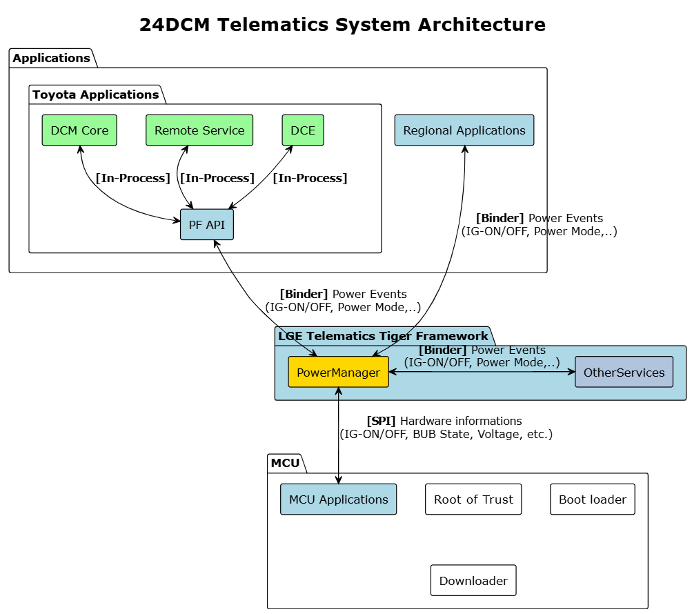
Image reference: slide_03_image_01.png

More details at Appendix 1

## Slide 4

Image reference: slide_04_image_01.png

2. Problem Identification

Starting point: issue DCM24MON-4575

Scenario:  User turns off Ignition (IG)
Expected: Remote Air Conditioner stops after 1.5s
Actual:     Remote Air Conditioner takes 4s to respond
Cause: The IG off status is delayed 4 seconds in Power Manager before notified to Remote Service.

Delayed notifications are primarily a performance issue, but when they lead to functional errors, they also compromise system reliability, especially during critical power transitions.

Target for improvement

→ Improving the power notification mechanism is essential for both performance and system reliability.

4

More details at Appendix 5, 6, 7

## Slide 5

2. Problem Identification

### Table
| Quality Attribute | Priority | Description |
| Performance | High | System must meet timing requirements for critical operations with consistent response times. (From 760ms to under 250ms for 1 event → total time for 6 notifies < 1.5 seconds) |
| Reliability | High | Ensure all services/apps receive notifications even when other services/apps fail. |
| Resource Efficiency | Medium | Efficiently manage resources since power notifications occur infrequently, avoiding waste while ensuring rapid response when needed. |
| Maintainability | Medium | The new design must ensure that the system is able to support the changes in the future. |
| Reusability | Medium | New design would be beneficial if it can be reused for other services since all services utilize this notification mechanism |
| Simplicity | Low | Balance implementation complexity with operational reliability for mission-critical systems. |

Key quality attributes while improving:

5

## Slide 6

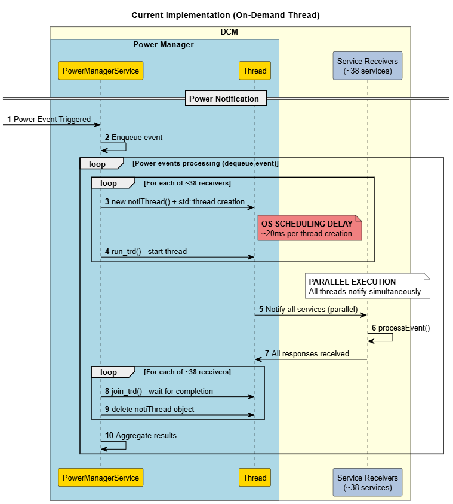
Image reference: slide_06_image_01.png

2. Problem Identification

✅ Advantages:
Reliability: High reliability - each receiver has dedicated thread, guarantees all receivers get notifications.
Simplicity: Straightforward implementation.
Resource Efficiency: No permanent threads when idle.
❌ Disadvantage:
Performance: Extremely poor due to OS scheduling overhead.

Current implementation (On-Demand Thread)

6

Create a new thread for each notification task, then destroy it immediately after completion.

## Slide 7

✅ Advantages:
Performance: Zero thread creation delay, instant response (estimated <10ms)
Reliability: Threads always available, ensures all receivers always receive notifications immediately.
Simplicity: Straightforward implementation, minimal code changes required.
❌ Disadvantage:
Resource Efficiency:
- Significant memory waste, threads remain idle most of the time.
- CPU usage spikes during notification.

Proposal 1 - Thread Cache Pool

Pre-create threads matching receiver count (~38), keep them alive permanently for instant response.

3. Solution Proposals

7

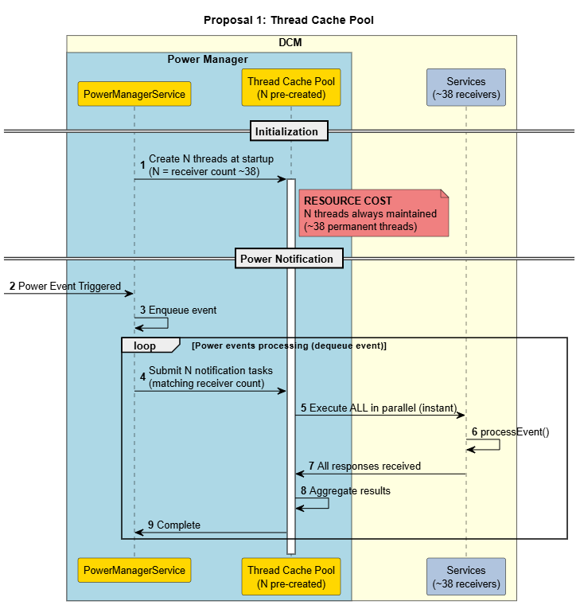
Image reference: slide_07_image_01.png

## Slide 8

Image reference: slide_08_image_01.png

✅ Advantages:
Performance: High (estimated ~20ms for 40 receives with 2 threads)
Resource Efficiency: Maintain only a fixed number of permanent threads.
❌ Disadvantages:
Reliability: When all threads delay, other receivers are delayed due to thread delays.
Simplicity: Moderate implementation complexity.

Proposal 2 - Fixed Thread Pool

Use a fixed thread pool (e.g., 2 permanent threads) to handle all notifications

3. Solution Proposals

8

## Slide 9

Image reference: slide_09_image_01.png

✅ Advantages:
Performance: High (estimated ~20ms for 40 receives with 2 threads)
Reliability: Self-healing with automatic delay thread replacement
Resource Efficiency: Adaptive memory usage based on actual demand
❌ Disadvantage:
Simplicity: Higher implementation complexity with scale algorithm.

Proposal 3 - Dynamic Thread Pool

Start with a fixed number of threads (e.g., 2 threads) as baseline thread pool.
Scale up: Auto-create additional threads when individual thread processing time exceeds threshold.
Scale down: Automatically reduce thread count to baseline after a certain period of inactivity to optimize resource usage.

3. Solution Proposals

9

## Slide 10

### Table
| Criteria | Priority | On-Demand Thread (Current implementation) | Thread Cache (Proposal 1) | Fixed Pool (Proposal 2) | Dynamic Thread Pool (Proposal 3) |
| Performance | High | Low (~800ms) | High (<10ms) | High (~20ms) | High (~20ms) |
| Reliability | High | High | High | Low (Delay/fail risk) | High (Auto-scale when delay) |
| Resource Efficiency | Medium | Medium Clear threads when idle High CPU when notify | Low Keep lots of threads when idle High CPU when notify | Medium | Medium |
| Simplicity | Low | High | High | Medium | Low |

Key Decision Factors:
Performance vs. Resource: Dynamic Pool fast enough (~20ms for 40 receives with 2 core threads), Thread Cache resource waste unacceptable for long-running system.
Simplicity: Complex implementation acceptable due to Power Manager's mission-critical nature where reliability outweighs simplicity.
Balanced Trade-offs: Good performance + reliability + adaptive efficiency outweigh complexity concerns.
🏆 Selected proposal 3: Dynamic Thread Pool

3. Solution Proposals

10

## Slide 11

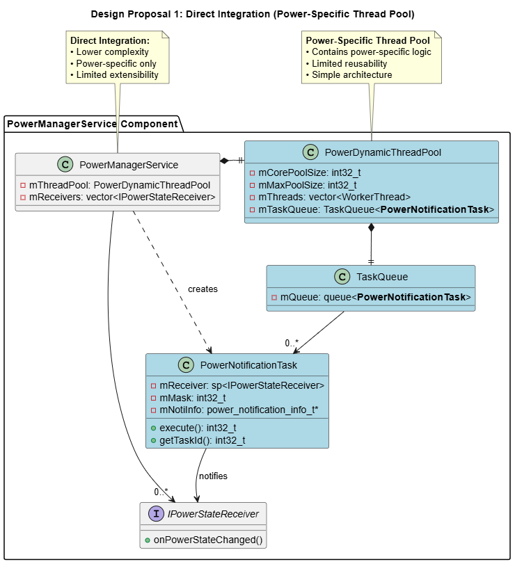
Image reference: slide_11_image_01.png

4. Design Proposals for Selected Solution

11

Proposal 1: Direct Integration (Power-Specific Thread Pool)

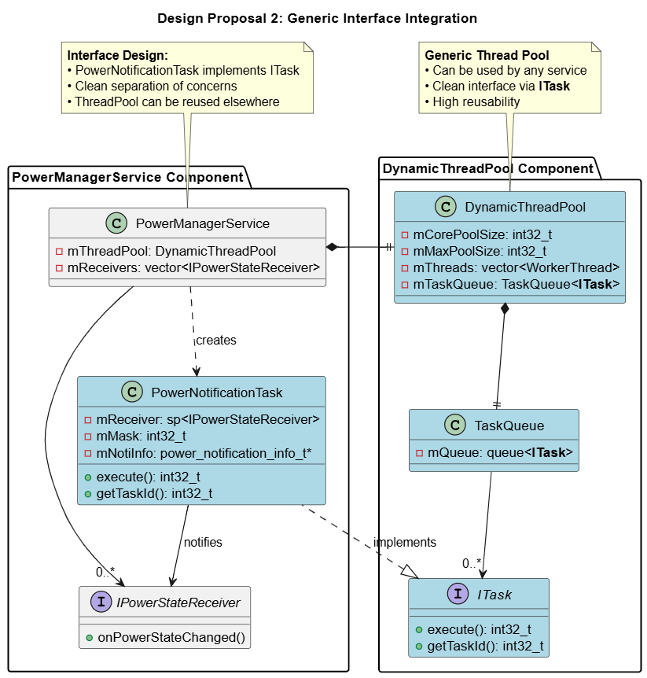
Image reference: slide_11_image_02.png

Proposal 2: Generic Interface Integration

New components

Existing components

Legend

## Slide 12

### Table
| Criteria | Priority | Direct Integration (Proposal 1) | Generic Interface Integration (Proposal 2) |
| Maintainability | Medium | Low (mixed concerns) | High (separated concerns) |
| Reusability | Medium | Low (power-specific only) | High (works across services) |
| Simplicity | Low | High (simple integration) | Medium |

Key Decision Factors:
Reusability: Enable thread pool usage across multiple services
Clean Architecture: Separation of concerns for better maintainability
Trade-off: Slightly higher complexity for significantly better long-term value

4. Design Proposals for Selected Solution

🏆 Selected Design: Generic Interface Integration (Proposal 2)

12

## Slide 13

13

DCM24MON-4575 test results
Configuration: 2 core threads.
Log explanation:
Ignition OFF: “IGN-OFF”
Remote Service received IG OFF status: “State = 2 RAC_remoteAcCallback.c racChangeIgnitionCb”

Image reference: slide_13_image_01.png

Image reference: slide_13_image_02.png

4.2 seconds

140 mili-seconds

On-Demand Thread

Dynamic Thread Pool

5. Implementation and Verification

## Slide 14

14

System Resource Verification

5. Implementation and Verification

### Table
| Criteria | On-Demand Thread | Dynamic Thread Pool |
| Notification time (for an event) | 750 ms | 22 ms (↓97%) |
| CPU utilization (during notifications) | 14% | 3.7% (↓74%) |
| VmRSS (Physical RAM) | 6.8 MB | 5.7 MB (↓12%) |
| VmSize (Virtual Memory) | 335 MB | 142 MB (↓58%) |

Dynamic Thread Pool

On-Demand Thread

Dynamic Thread Pool not only improves performance but also uses resources more reasonably and efficiently, making the entire system more stable.

Image reference: slide_14_image_01.png

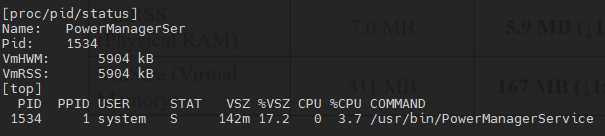
Image reference: slide_14_image_02.png

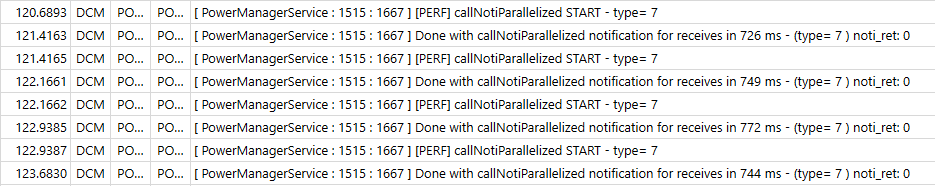
Image reference: slide_14_image_03.png

Image reference: slide_14_image_04.png

## Slide 15

6. Conclusion

15

### Table
| Quality Attribute | Priority | Description | Result |
| Performance | High | Improved notification processing to ~22ms per event. | ✅ |
| Reliability | High | Implemented fail-safe mechanism to prevent one service from affecting other services during notification processing. | ✅ |
| Resource Efficiency | Medium | Resource optimization mechanism when not in use in idle time. | ✅ |
| Maintainability | Medium | New design is modular and independent, making it easy to maintain. | ✅ |
| Reusability | Medium | New design can be reused for notification tasks or other operations requiring multi-threading capabilities. | ✅ |
| Simplicity | Low | New implementation is relatively complex but acceptable. | ❌ |

Plan to apply:
November 2025:
Apply the Dynamic Thread Pool to the Power Manager Service (Core part) in the Toyota 24DCM (SU) project.
Apply the Dynamic Thread Pool for 26BEV project
May 2026:
Apply the solution to Power Manager Service of all projects.
Move the Dynamic Thread Pool source code to the Tiger Framework Until to enable usage by other services.

## Slide 16

Q&A
Thank you for listening

16

## Slide 17

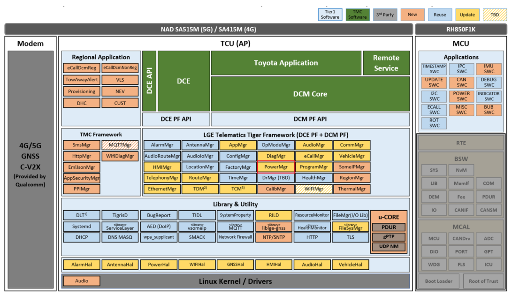
Image reference: slide_17_image_01.png

Appendix 1

17

## Slide 18

Appendix 2

18

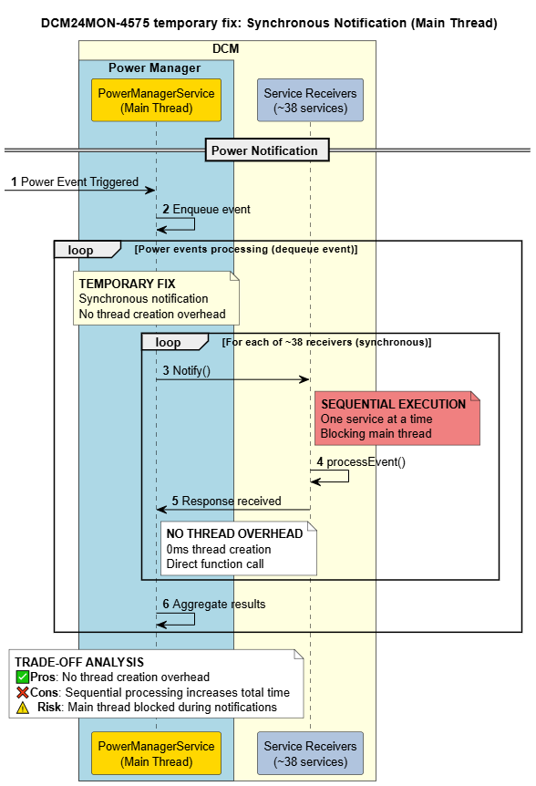
Image reference: slide_18_image_01.png

## Slide 19

19

Appendix 3 - Configuration

Dynamic Thread Pool – 2 core threads

Image reference: slide_19_image_01.png

Image reference: slide_19_image_02.png

Dynamic Thread Pool – 4 core threads

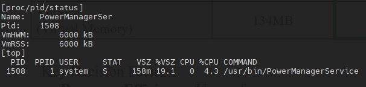
Image reference: slide_19_image_03.png

Image reference: slide_19_image_04.png

Dynamic Thread Pool – 8 core threads

Image reference: slide_19_image_05.png

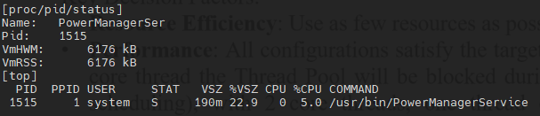
Image reference: slide_19_image_06.png

Dynamic Thread Pool – 1 core thread

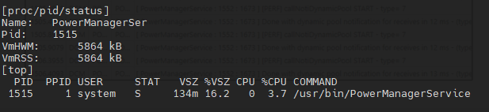
Image reference: slide_19_image_07.png

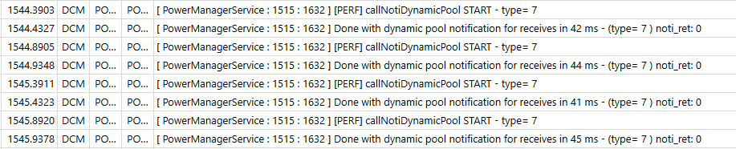
Image reference: slide_19_image_08.png

## Slide 20

20

Appendix 4 - Configuration

### Table
| Criteria | 1 core thread | 2 core threads | 4 core threads | 8 core threads |
| Notification time (for an event) | 42ms | 22ms | 19ms | 13ms |
| CPU utilization (during notifications) | 3.7% | 3.7% | 4.3% | 5.0% |
| VmRSS (Physical RAM) | 5.72 MB | 5.76MB | 5.86MB | 6.03 MB |
| VmSize (Virtual Memory) | 134MB | 142 MB | 158 MB | 190 MB |

Key Decision Factors:
Resource Efficiency: Use as few resources as possible to keep the system stable.
Performance: All configurations satisfy the target of less than 250ms. However, if a hang occurs, with 1 core thread the Thread Pool will be blocked during hang recovery (~20ms for new thread creation and scheduling), with 2 core threads, one thread continues working while the other thread recovers, minimizing blocking time in notification processing.
→ 2 core threads provides the optimal balance between risk mitigation, resource efficiency, and performance.

More details at Appendix 3

## Slide 21

Appendix 5 - Configuration

21

Hanging threshold (Scale up threshold)
Measurement Result: Most services process notifications within 10ms under normal conditions.
Reason: The 500ms threshold balances thread creation overhead with response time - avoiding excessive overhead from too low values (100ms) while preventing notification delays from too high values (1000ms), providing sufficient buffer for both normal operations and heavy tasks like file saves during sleep/reset sequences.
→ Selected Value: 500ms threshold
Keep alive time (Scale down threshold)
Reason: 30 seconds based on automotive power event patterns where events occur in clusters followed by 30 seconds to several minutes of idle time. This duration balances thread availability for subsequent events against resource conservation, avoiding frequent creation/destruction cycles (10s too short) while preventing resource waste during extended idle periods (120s too long).
→ Selected Value: 30 seconds

## Slide 22

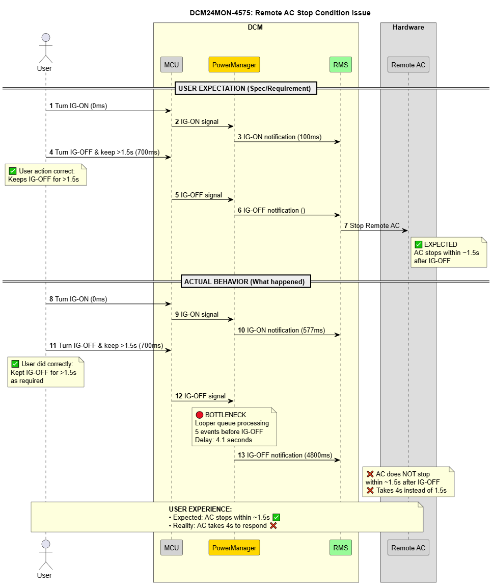
Image reference: slide_22_image_01.png

Appendix 6

Starting Point: issue DCM24MON-4575

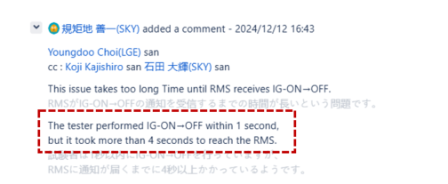
Image reference: slide_22_image_02.png

Why does IG OFF status is delayed 4 seconds in Power Manager?

Scenario:  User turns off Ignition (IG)
Expected: AC stops within ~1.5s
Actual:     AC takes 4s to respond
Cause: The IG off status is delayed 4 seconds in Power Manager before notified to Remote Service (AC controller)

22

## Slide 23

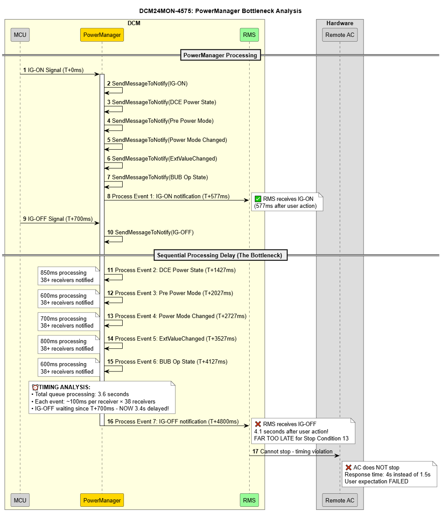
Image reference: slide_23_image_01.png

    Powerless Bottleneck:
    • 38 receivers per event × 6 events = massive delay
    • IG-OFF notification stuck behind other system events

Why does Power Manager take ~760ms per notify for ~38 receives?

4.1 seconds

Appendix 7

23

## Slide 24

Current Implementation : On-demand Thread Creation
Threads are created and destroyed dynamically for each receiver.
Thread creation:         30ms x 38 = 760ms
Actual notification:  1~2ms (parallel)
Total time:                  ~760ms
ROOT CAUSE: Sequential thread lifecycle management with OS scheduling overhead

Appendix 8

Why does Power Manager take ~760ms per notify for ~38 receives?

24

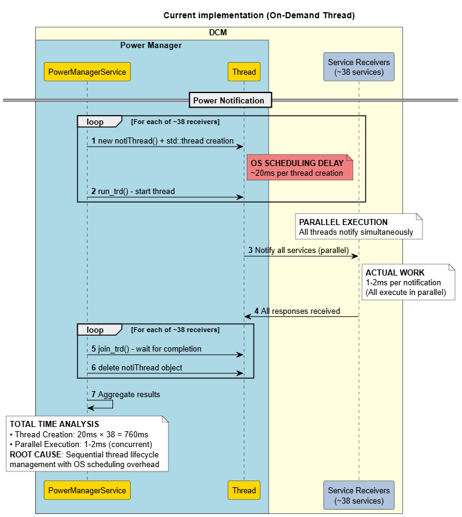
Image reference: slide_24_image_01.png

## Slide 25

Image reference: slide_25_image_01.png

Appendix 9

25

## Slide 26

Appendix 10

26

Image reference: slide_26_image_01.png

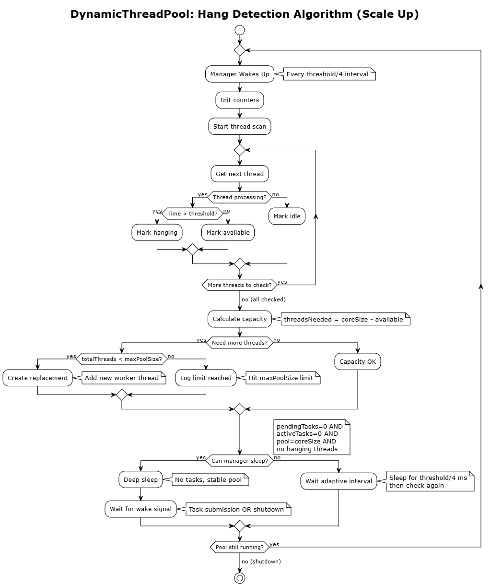
Image reference: slide_26_image_02.png

## Slide 27

Image reference: slide_27_image_01.png

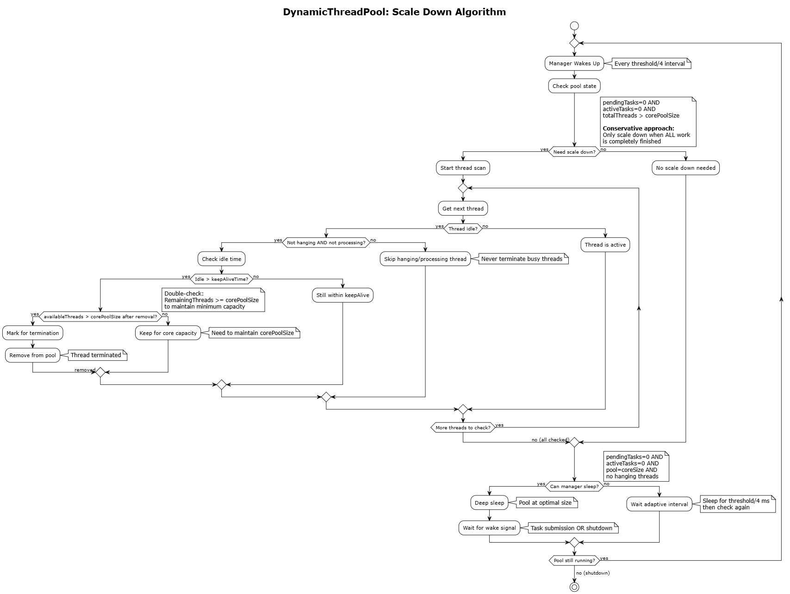
Image reference: slide_27_image_02.png

Appendix 11

27

## Slide 28

Appendix 12

28

Test result - Scale up:
Hanging detection triggered when thread 1 processing time reached threshold (500ms) during DiagMgr database save operation (1120ms total duration), successfully creating an additional thread. Pool automatically scaled from 2 to 3 threads (ID=2 created) to maintain system responsiveness during long-running tasks.

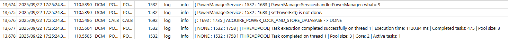
Image reference: slide_28_image_01.png

Image reference: slide_28_image_02.png

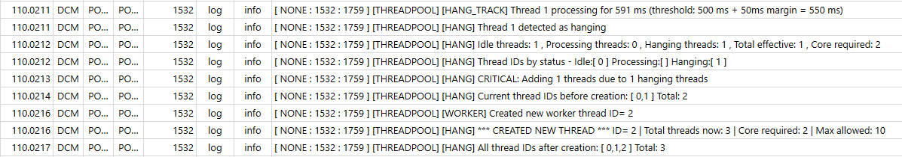
Image reference: slide_28_image_03.png

## Slide 29

Appendix 13

29

Test result - Scale down:

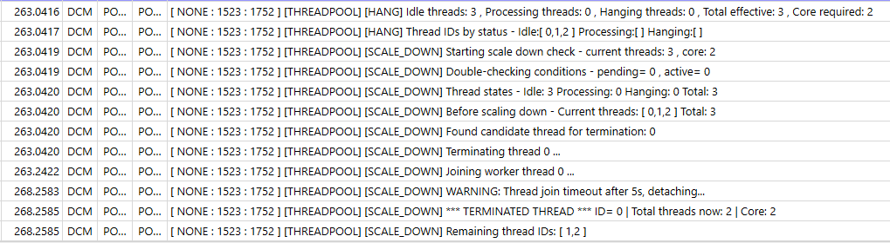
Image reference: slide_29_image_01.png

Scale down triggered after 30 seconds idle period with no queued tasks. Thread pool detected excess threads (3 active vs. 2 core required) and gracefully terminated thread ID=0, successfully scaling from 3 to 2 threads to optimize resources while maintaining baseline responsiveness.

