# Raw Document Content

- Source file: FA_AllianceCarVMSService_v1.4-final_Tran_The_Dan[1]/FA_AllianceCarVMSService_v1.4-final.docx

Function Architect Task

Alliance Car VMS Service in the Renault project

Author: Tran The Dan – Location Unit – LGE DV

Mentor: 신종혁/책임연구원/SW Architect Unit

Revision History

## Table
| Version | Date | Comment | Author | Approver |
| --- | --- | --- | --- | --- |
| 1.0 | 2024-07-26 | Initial Release | Tran The Dan |  |
| 1.1 | 2024-08-27 | Update based on the mentor’s feedback #1 Add component diagram | Tran The Dan |  |
| 1.2 | 2024-09-06 | Add the detail class diagram Add the sequence diagram Add the interface design | Tran The Dan |  |
| 1.3 | 2024-09-16 | Add the implementation and measurement Add the conclusion | Tran The Dan |  |
| 1.4 | 2024-09-25 | Update based on the feedback #3 |  |  |
|  |  |  |  |  |
|  |  |  |  |  |
|  |  |  |  |  |

Acronyms / Glossary

## Table
| Glossary | Meaning |
| --- | --- |
| A-IVI2 | Alliance In-vehicle Infotainment System |
| AAOS | Android Automotive Operating System |
| AOSP | Android Open Source Project |
| AASP | Alliance Android Software Platform |
| VMS | Vehicle Map Service |
| IVI | In-vehicle Infotainment (= Central Panel, Head Unit) |
| MLP | Most Likely Path |
| JVM | Java Virtual Machine |
| GAS | Google Automotive Service |

Table of figures

Figure 1: Renalt AIVI2 overview concept	5

Figure 2: The welcome sequence on IVI was delayed compared to Cluster	6

Figure 3: Function Allocation for displaying the welcome sequence in AIVI2	6

Figure 4: The welcome sequence synchronization method on IVI and Cluster	7

Figure 5: The delay of handling Welcome sequence state in the Alliane Car service	7

Figure 6: The memory occupation of VMS objects in the Alliance car service	8

Figure 7: AllianceCarVMSServices Context Diagram	8

Figure 8: Alliance Car Service architecture	10

Figure 9: Alliance Car Service initializing sequence	11

Figure 10: The object allocation in the Alliance Car service	11

Figure 11: Static view of lazy initialization architecture	12

Figure 12: Dynamic view of lazy initialization architecture	13

Figure 13: Static view of service separation architecture	14

Figure 14: Allocation view of service separation architecture	15

Figure 15: The interaction of components of Alliance Car VMS service	17

Figure 16: New componenent diagrams and external connect with Alliance Car VMS Service	18

Figure 17: Class Diagram of the new AllianceCarExternalVmsProvider component	20

Figure 18: The initialize of Alliance Car Vms Provider service	22

Figure 19: The sequence to provide the MLP object	22

Figure 20: The seqence to handle and provide the route data	23

Project Context

Introduction

The Renault AIVI2 project is an Android-based infotainment system, created by combining Google applications with the Android Automotive Operating System (AAOS). Where LGE is responsible for maintaining AASP (Alliance Android Software Platform) built on top of AOSP (Android Open Source Project). Besides, HAL or MICOM layer also under LGE responsible.

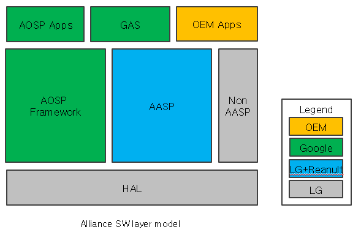
Image reference: doc_image_001.png

Figure 1: Renault AIVI2 overview concept

Situation

A-IVI2 is relatively stable with 3 software versions that have been SOP (Start of Production), however, there is a problem with Google VMS SDK causing Alliance Car service performance to decline. The most obvious symptom that can be observed is that the welcome animation on the IVI is delayed compared to the Meter (Cluster). The issue temporary fixed by Google thanks to update the new VMS SDK. However, in this project, I would like to fix this issue permanently and not depends on Google SDK.

The Google VMS SDK is located in the Alliance Car Service which is a part of AASP component in the above figure.

Problem Description

In the A-IVI2 project, IVI and Cluster should be available at the same time. However, in some cases, the welcome sequence on IVI is still ongoing while Cluster is already available. It leads to a bad user experience

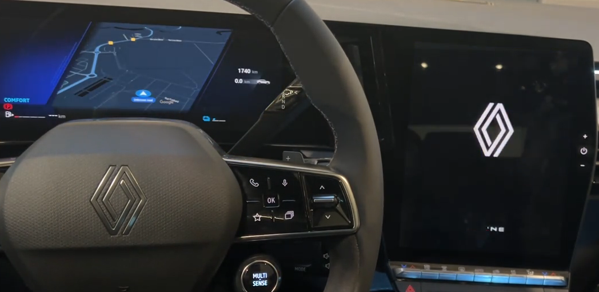
Image reference: doc_image_002.png

Figure 2: The welcome sequence on IVI was delayed compared to Cluster

The welcome sequence shall start accordingly to CAN information, in order to be consistent with the cluster behavior. A CAN parameter is responsible for the sound and animation display on A-IVI. This parameter is WelcomeSequenceStatus. The A-IVI shall compute the signal WelcomeFunctionAvailability to inform Cluster that he is ready. When the Cluster receives WelcomeFunctionAvailability= 0x11 (Video and sound available), it shall sends to A-IVI WelcomeSequenceStatus = 0x11 ( Sequence Done) . Then the sound and the welcome sequence animation should start on A-IVI. The below figure shows how the IVI and Cluster are interacting and synchronizing the welcome sequence:

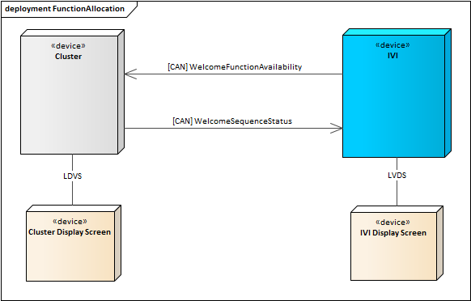
Image reference: doc_image_003.png

Figure 3: Function Allocation for displaying the welcome sequence in AIVI2

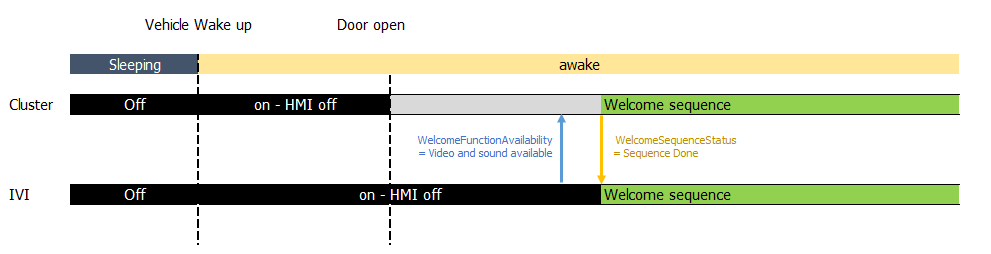
Image reference: doc_image_004.png

Figure : The welcome sequence synchronization method on IVI and Cluster

In the bad case, the WelcomeSequenceStatus = “"0gure 9dnklgfsdjnkl jiceayture while the project is continuesly with the new car generation
e sequence statusSequence Done” was not handled by the IVI in time.

There was something wrong with the Alliance Car service which was responsible for receiving and handling the message in IVI.

01-05 10:53:59.170   475  5115 D VUCS.BasePlugin: (uart) uplink: aa 00 08 83 50 13 01 1b 09 02 03

01-05 10:54:02.264   1938  2098 I AllianceCarPowerService: handleWelcomeSequenceStatus, state=3

It took almost 3 seconds from Cluster send the WelcomeSequenceStatus until Alliance Car Service handle the message.

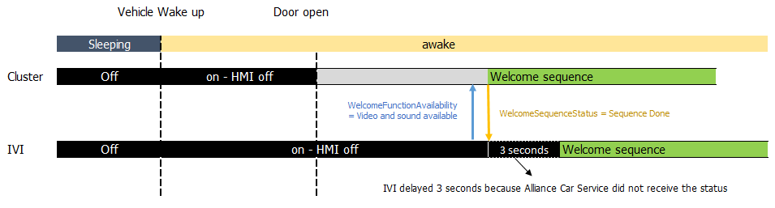
Image reference: doc_image_005.png

Figure : The delay of handling Welcome sequence state in the Alliance Car service

It is seen that the Alliance Car service was stuck a few seconds due to the Java Garbage Collection (GC). From the log file, we could see it took approximately 3 seconds to complete GC on Alliance Car service process. It impacts all plug-in services of com.alliance.car including AllianceCarPowerService which responsible for handling the welcome sequence status.

om.alliance.ca: Background young concurrent copying GC freed 476547(17MB) AllocSpace objects, 36(1612KB) LOS objects, 20% free, 68MB/86MB, paused 388us,444us total 3.143s

Java Garbage Collection (GC) is an automatic memory management process that identifies and discards objects no longer in use to free up memory resources. The GC process involves several algorithms, such as Mark-and-Sweep, Generational, and G1 (Garbage-First), each optimized for different performance needs. However, GC can introduce disadvantages such as unpredictable pause times, affecting application performance and responsiveness.

GC is triggered when the JVM determines that it needs to reclaim memory to allocate new objects or when the system is running low on memory. This can happen based on various heuristics, such as the amount of free memory, the allocation rate of new objects, and the specific GC algorithm in use.

Thanks to dumpsys log, we could see the VMS-related objects have occupied ~ 70% of the memory of the Alliance car service process. It leads to the big time necessary to finish the GC.

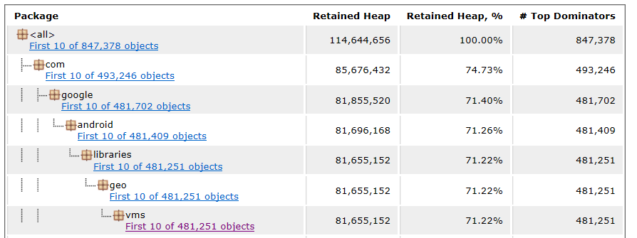
Image reference: doc_image_006.png

Figure : The memory occupation of VMS objects in the Alliance car service

So, to resolve the welcome sequence issue we need to find a proper architect to reduce the effect of VMS objects on the Alliance Car Service process. In the remaining part of this document, I will focus on designing the architecture of the AllianceCarVMSServices. The “AllianceCarVMSServices” term represents all Alliance Car Services related to the VMS including AllianceCarVMSHorizonHeadlessService which contains the VMS SDK and its consumers. The context of AllianceCarVMSServices is presented in the below figure.

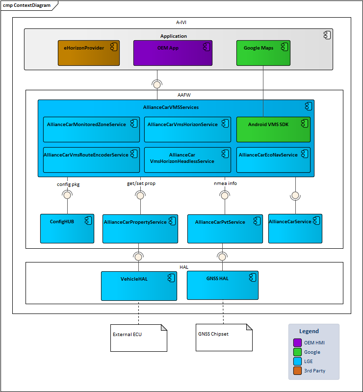
Image reference: doc_image_007.png

Figure : AllianceCarVMSServices Context Diagram

Solutions applied so far:

When talking about this issue with Google, they suggested using the latest VMS SDK. There have been performance and memory improvements made in the SDK. The latest SDK was applied and shows that the issue has been improved. However, a long-term solution needs to be considered because the VMS SDK is provided by Google and there is no guarantee that the issue will not occur in the future while the project continues with the new car generation.

Architecture Proposal

3.1 Functional Requirement

## Table
| Requirement ID | Description |
| --- | --- |
| REQ_SYS_A-IVI-WelcomeSequence-HMI_85 | When the Cluster receives WelcomeFunctionAvailability= 11 (Video and sound available), it shall sends to A-IVI WelcomeSequenceStatus = 11 ( Sequence Done), Then the sound and the welcome sequence animation should start on A-IVI. |
| SAR-AAFW-NAV-VMS-HOR-0001 | The AllianceCarServices shall implement the AllianceCarVmsServices. This service uses the VMS SDK to provide VMS Managers. |
| SAR-AAFW-NAV-VMS-HOR-0002 | The AllianceCarVmsServices shall offer an API to access the PathManager |
| SAR-AAFW-NAV-VMS-HOR-0003 | The AllianceCarVmsServices shall offer an API to access the RouteManager. |

3.2 Quality Attributes

## Table
| QA ID | QA | Description |
| --- | --- | --- |
| REQ_SYS_A-IVI-WelcomeSequence-HMI_87 | Performance | The time between receiving WelcomeSequenceStatus = 11 (Sequence Done) and starting the welcome sequence in A-IVI shall be less than 100 ms |
| SAR-AAFW-NAV-VMS-HOR-0004 | Performance | The Alliance Car VMS services should not affect the Alliance Car Service performance in the runtime including start-up and other life cycle. |
| SAR-AAFW-NAV-VMS-HOR-0005 | Stability | The Alliance Car VMS services shall be handled well the resource allocation and the system should be worked stable at any stages |
| SAR-AAFW-NAV-VMS-HOR-0006 | Maintainability | Must be clean and clear codebase, easy to maintain and update. |

3.3 Constraints

## Table
|  |  |
| --- | --- |
| SAR-AAFW-NAV-VMS-HOR-0006 | The I/F between clients (OEM Applications) and AllianceCarVmsServices should not be affected. It means the I/F must not be changed. |
| SAR-AAFW-NAV-VMS-HOR-0008 | VMS SDK will be initialized only once and used by multiple applications |

3.4 Current Architecture

3.4.1 Static Design

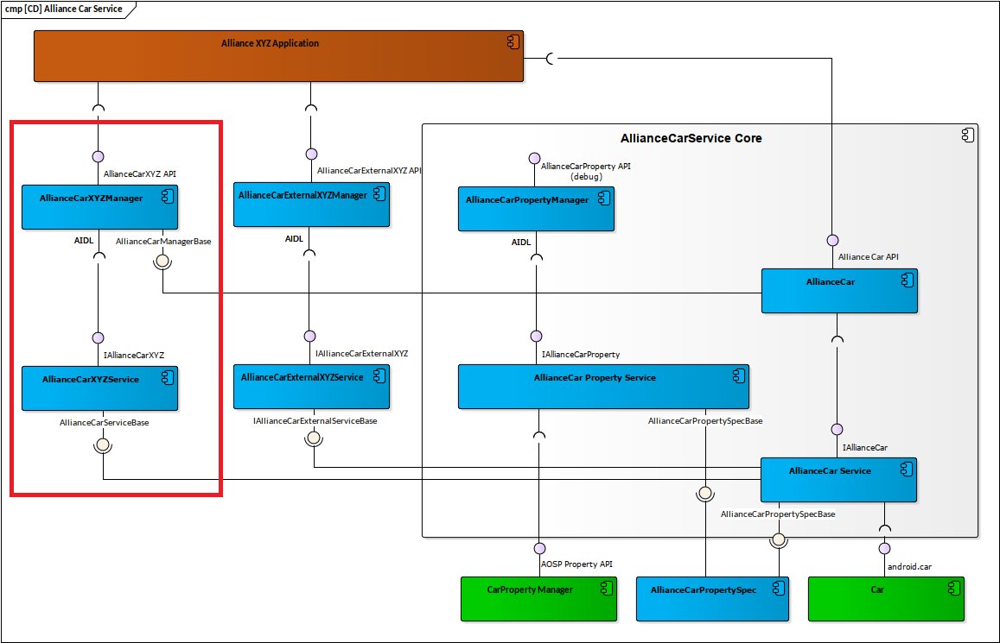
Image reference: doc_image_008.png

Figure : Alliance Car Service architecture

The AllianceCarXYZService represents all internal plugin services inside the Alliance Car service. As of now, the Alliance Car service contains more than 60 plug-in services including AllianceCarVMSServices and Alliance Car Power service which is mainly responsible for the display welcome sequence on the IVI (Central Panel). This architect is easy to manage but can lead to a plugin service affecting the whole core service.

3.4.2 Dynamic Architecture

Image reference: doc_image_009.png

Figure : Alliance Car Service initializing sequence

During the initializing time, all plugin services will be initialized concurrently and the memory will be allocated in the Alliance Car Service process. It is a burden for the Alliance Car service, especially during resume, the large memory that the VMS used in the previous booting is restored, and then the com.aliance.car service is executed and GC occurs while allocating the necessary memory as mentioned in the section 2.

The object allocation is represented in the below figure

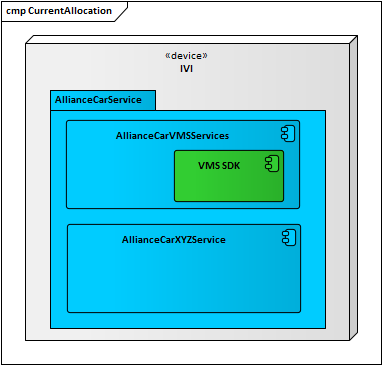
Image reference: doc_image_010.png

Figure : The object allocation in the Alliance Car service

3.5 Archiecture proposal

3.5.1 Lazy Initialization

This alternative architecture takes a less-changed approach to the current static view. It creates a new AIDL interface between the Power service and the VMS services called IPowerVmsListerner. This allows the VMS services to listen for the status of the welcome sequence, and once it finishes, the VMS services will start initializing its objects.

3.5.1.1 Static view

Image reference: doc_image_011.png

Figure : Static view of lazy initialization architecture

Detailed description of each module and its responsibilities:

## Table
| Module | Description |
| --- | --- |
| IPowerVMSListener | The AllianceCarPowerManage provide a new AIDL I/F called IPowerVMSListener which allow the AllianceCarVMSSevice listener the welcome sequence status |
| AllianceCar | The Alliance car-lib is a component for applications to interface with the Alliance car services. Jar library that provides Alliance Car APIs to applications. Provides APIs to get Alliance car specific services. |
| AllianceCarService | The component implements the AIDL interface IAllianceCar in order for Alliance car-lib to communicate with it. The component communicates with inner services over the AllianceCarServiceBase interface; all inner services implement this AllianceCarServiceBase interface. |
| AllianceCarPowerManager | The component exposes the new IPowerVMSListener API to AllianceCarVmsService communicates with it and use it service |
| AllianceCarPowerService | The componet handle the functionality of the power service especially the display welcome sequence |
| AllianceCarVmsManager | The AllianceCarVmsManager exposes APIs to client applications to use it's service's functionality. |
| AllianceCarVmsService | The component responsible for create VMS object and handle other service functionalities. |

3.5.1.2. Dynamic View

The below diagram was added the step 1.5 onAnimationFinish which will implemented in the IPowerVMSListener. This a new callback between AlliancCarPowerService and AllianceCarVmsService resposible for notify the welcome sequence has been successfully finish on the IVI. By listening this event, the AllianceCarVmsService will wait until receive the callback from Power service before initializing its object. In result, we can avoid the long delay of display welcome sequence because of Java GC.

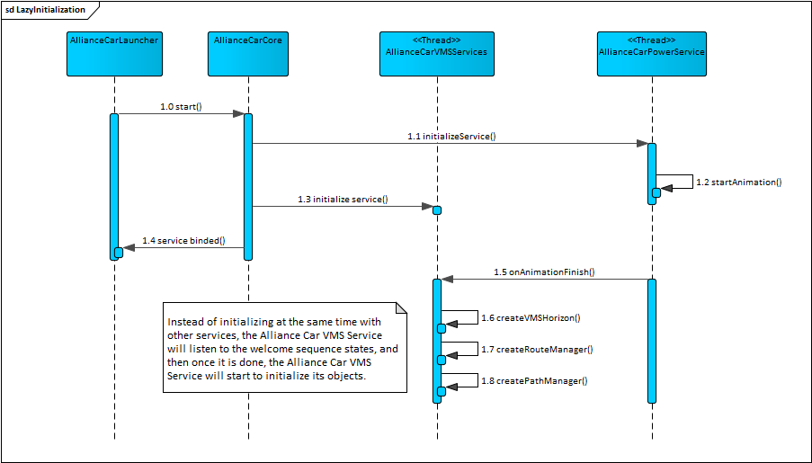
Image reference: doc_image_012.png

Figure : Dynamic view of lazy initialization architecture

3.5.2 Service separation

This alternative architecture takes a changing approach from the current static and allocation view. Which, VMS services will be separated into a separate process from the Alliance Car service. To ensure the stability of the current I/Fs, the VMS service will be deployed as an external service of the Alliance Car service. (An external plugin service runs in its own process)

3.5.2.1 Static view

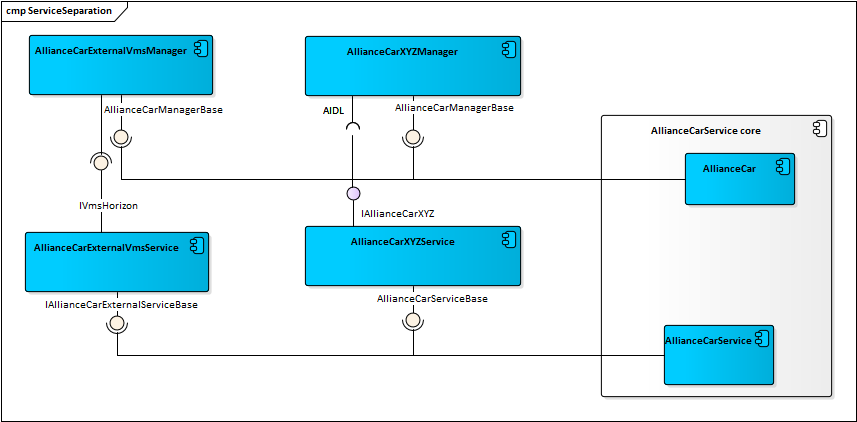
Image reference: doc_image_013.png

Figure : Static view of service separation architecture

Detailed description of each module and its responsibilities:

## Table
| Module | Description |
| --- | --- |
| AllianceCar | The Alliance car-lib is a component for applications to interface with the Alliance car services. Jar library that provides Alliance Car APIs to applications. Provides APIs to get Alliance car specific services. |
| AllianceCarService | The component implements the AIDL interface IAllianceCar in order for Alliance car-lib to communicate with it. The component communicates with inner services over the AllianceCarServiceBase interface; all inner services implement this AllianceCarServiceBase interface. |
| AllianceCarXYZManager | This is not a real S/W component. AllianceCarXYZManager represents the manager component of any other internal plugin service loaded by the Alliance car service. This component is used to distinguish from the AllianceCarExternalXYZManager. |
| AllianceCarXYZService | This is not a real S/W component. AllianceCarXYZService represents the service component of any other plugin service loaded by the Alliance car-service. |
| AllianceCarExternalVmsManager | The AllianceCarVmsManager exposes APIs to client applications to use its service functionality. |
| AllianceCarExternalVmsService | VMS service will be changed to the Alliance Car External Service instead of the internal service. By this way, the Alliance Car Vms service will run on a separate process from the Alliance Car Service and its internal plugin services. |

Internal service and External service comparison:

## Table
| Internal Service | External Service |
| --- | --- |
| Both to be considered and accessed from applications as a plugin service of Alliance Car Service. To ensure there is no change necessary from application | Both to be considered and accessed from applications as a plugin service of Alliance Car Service. To ensure there is no change necessary from application |
| An internal plugin service is loaded by AllianceCarServiceCore and also runs in the same process as AllianceCarService | An external plugin service runs in its own process. AllianceCarServiceCore binds this external service at startup and manages access to it through its AllianceCar APIs. |

3.5.2.2 Allocation view

By implementing the Alliance Car External service, the VMS Service will running on its own process. As the Java GC is running per process, there are for the large number of VMS object will not affect to the Alliance Car service anymore.

Image reference: doc_image_014.png

Figure : Allocation view of service separation architecture

3.5.3 Proposal Comparison Summary

## Table
| QAs | Lazy Initializing | Service Separation | Priority |
| --- | --- | --- | --- |
| Performance | Lazy Initialization can improve startup time because it delays the creation of objects. This means that the initial load is lighter, and the welcome sequence can proceed more quickly. There might be a slight delay when the objects are first accessed and the GC still might block Alliance Car Service at another time. | By separating services, it can distribute the load more evenly, improving the startup time because of GC running per process. Service Separation can lead to better performance during runtime as well, as each service can be optimized and scaled independently. | High |
| Performance | Don't require more RAM for the new service | RAM consumption may increase for the new process | Mid |
| Stability | Can lead to stability issues later in the app lifecycle (service needs to initial right time, other dependency services need to delay as well) | Service Separation provides better isolation, meaning that the VMS will not bring down the Alliance Car service. Each service can manage its resources, reducing the risk of resource contention and improving stability | High |
| Maintainability | The code might become harder to read and understand, especially for new developers, as the initialization logic is spread out rather than centralized. | It would take more effort for the implementation but would be better in the long run due to its modularity and scalability. | Mid |

In conclusion, lazy Initializing can reduce initial load times and RAM usage, but it may introduce complexity and potential stability challenges that could outweigh its benefits in this context.

On the other hand, the Service Separation is the more advantageous solution for this situation. This approach enhances performance by ensuring that the Alliance car service runs without interference from the service causing delays due to Java GC. It also improves stability by preventing issues in the isolated service from affecting the main service. Additionally, it increases maintainability by creating a more modular codebase and clear for the developer.

Although Service Separation has a negative impact on RAM consumption, it would be a worthwhile tradeoff of its benefit mentioned above for the overall Alliance car service and IVI.

Architecture Design of Service Separation

4.1 Static Design

	4.1.1 Component Diagram

AllianceCarVmsHorizonHeadlessService Object is directly used by other Services: AllianceCarMonitoredZoneService, AllianceCarVmsHorizonService, AllianceCarVmsRouteEncoderService and AllianceCarEcoNavService. Meaning that they don't go through the manager, they do a direct in-memory call.

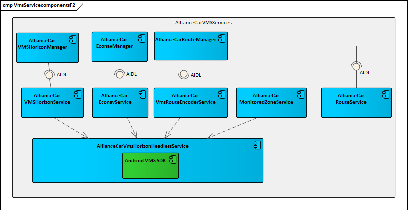
Image reference: doc_image_015.png

Figure : The interaction of components of Alliance Car VMS service

The dependency with AllianceCarEcoNavService and AllianceCarMonitoredZoneService is weak, these 2 services will be kept as internal services and we can move things to a new API, expose it via Manager as usual and those services will use it.

The dependency with AllianceCarVmsHorizonService and AllianceCarVmsRouteEncoderService is strong, so those things along with AllianceCarVmsHorizonHeadlessService will be moved together to a new External Service. The new component diagram will be shown as the below figure:

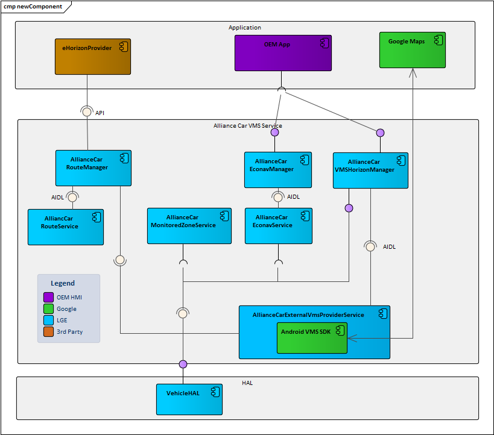
Image reference: doc_image_016.png

Figure : New component diagram and external connect with Alliance Car VMS Service

Components Description:

## Table
| Components | Description |
| --- | --- |
| Android VMS SDK | The VMS Android SDK provides a set of APIs that connect to Vehicle Map Service (VMS) to get ADAS-related map data to get insights about the road ahead. This component is provided by Google along with the GAS and LGE embedded in the AASP. The VMS Android SDK includes the following APIs: Horizon API, Path API, Tile API, Route API, and Signal API. |
| AllianceCarExternalVmsProviderService | This component responsible for providing the VMS data from which taken from VMS SDK. This service will be pre-process the provided data including Path API and Route API to Parcelable objects, convert the VMS Route to an Alliance proprietary route format. This component will including the current implementation of process the VMS data of other services. |
| AllianceCarVmsHorizonManager | This Manager provide the VMS Horizon (get from Path API) and VMS Route (get from Route API) data which processed in the AllianceCarExternalVmsProviderService to other client including Applications and services. |
| AllianceCarEconavService | This component will use the Route API data which provided by AllianceCarVmsHorizonManager through AIDL I/F and communicate with Vehicle HAL |
|  |  |
| AllianceCarEconavManager | This component to provide the interface to communicate between AllianceCarEconavService and Application layer. |
| AllianceCarRouteService | This service implements the overall logic of the AAFW Route interface by conveying route and the traffic info data from manager sender client to manager receiver clients. |
| AllianceCarRouteManager | This manager offers a simple API for AllianceCarExternalVmsProviderService to send the OpenLR encoded route and traffic info after convert |
| AllianceCarMonitoredZoneService | This service uses the Path API data which provided by AllianceCarVmsHorizonManager through AIDL I/F and communicate with Vehicle HAL |
| Google Maps | This component is a Google Navigation application, which provides route information to VMS SDK and receive the sensor from the vehicle through VMS |
| OEM App | This component represent for all OEM application which used the VMS API provided |
| eHorizon Provider | This component is 3rd party application which using encoded route data |
| eHorizon Provider | This component is 3rd party application which using encoded route data |

4.1.2 Class Diagram

Class Digram of AllianceCarExternalVmsProviderService:

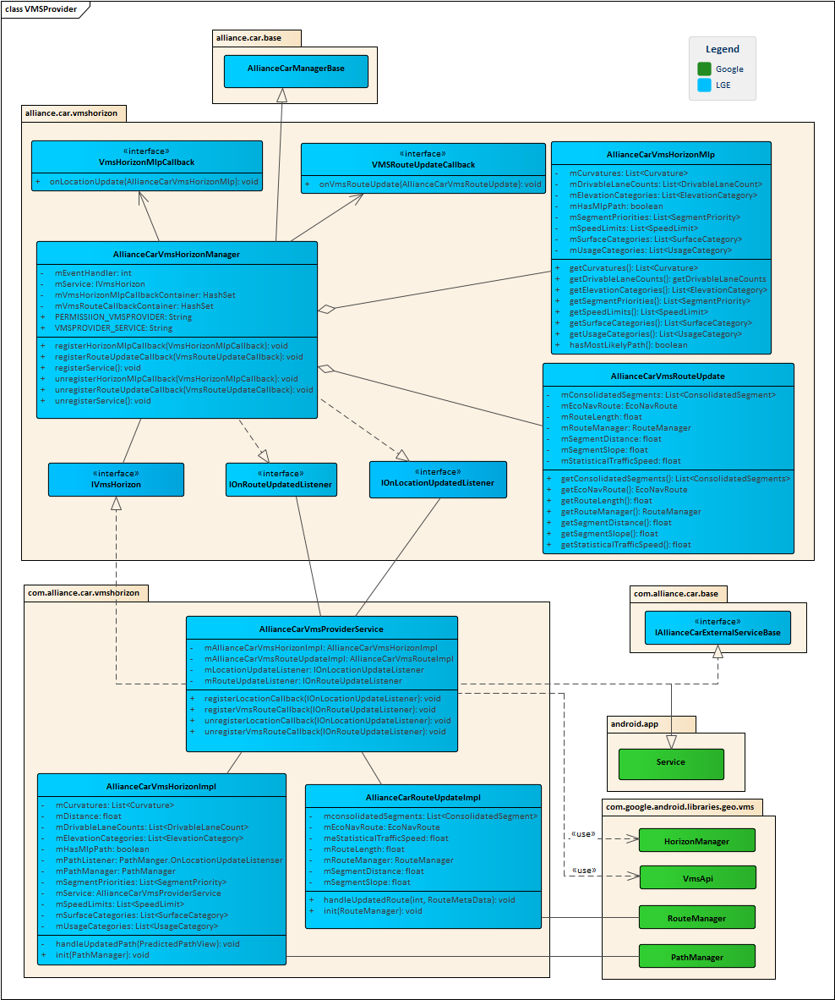
Image reference: doc_image_017.png

Figure : Class Diagram of the new AllianceCarExternalVmsProvider component

## Table
| Class / Interface | Description |
| --- | --- |
| AllianceCarVmsProviderService | The class implement IallianceCarExternalServiceBase and extents Android Service, responsible for loading initialize the VMS SDK and dispatch the handled object to the mannger. |
| AllianceCarVmsHorizonMlp | The class to handle the VMS Horizon data which received from VMS Path Manager and send back to the AllianceCarVmsProviderService |
| AllianceCarRouteUpdateImpl | The class to handle the VMS Route Horizon data which received from VMS Route Manager and send back to the AllianceCarVmsProviderService. Besides, it also responsible for encoding the route and set the encoded route to the Alliance Car Route Service |
| IAllianceCarExternalServiceBase | The base class for External Services to implement |
| Service | The Android Service provides the method to override and follow the service life cycle. |
| HorizonManager | HorizonManager is the entry point from VmsApi. Creating the HorizonManager subscribes the SDK client to the short horizon base map layers |
| VmsApi | Entry point to initialize and access Vehicle Map Service (VMS) SDK APIs |
| RouteManager | A RouteManager provides data along the polyline of an active navigation route, which vehicles can use to optimize use of resources like battery and fuel while traveling to the destination. |
| PathManager | Provides path-based access to map data around the car. The predicted path provides data for the most likely path (MLP) and potential subpaths the vehicle may travel. |
| IVmsHorizon | The AIDL interface between to communication between AllianceCarVmsProviderService and AllianceCarVmsHorizonManager allow manage register the callback to the service. |
| IOnRouteUpdateListener | The AIDL interface for the service to send the Mlp object to client which registered the callback listener. |
| IOnLocationUpdateListener | The AIDL interface for the service to send the Route object to client which registered the callback listener. |
| AllianceCarVmsHorizonManager | The class provide API for external clients can communicate with the service |
| VmsHorizonMlpCallback | Interface to be implemented by external client to be notified about MLP changes |
| VmsRouteUpdateCalback | Interface to be implemented by external client to be notified about VMS route changes |
| AllianceCarVmsHorizonMlp | The class reprsents for the MLP Object |
| AllianceCarVmsRouteUpdate | The class reprsents for the Route Object |
| AllianceCarManagerBase | The base manager for all alliance car plugins service. |

4.3 Dynamic Design

4.3.1 Initialize VmsProviderService sequence

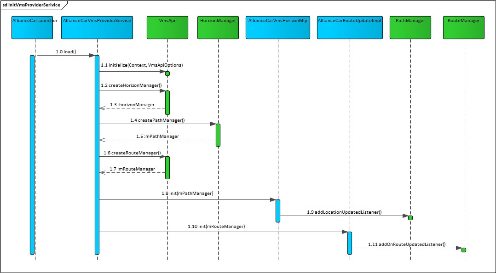
Image reference: doc_image_018.png

Figure : The initialize of Alliance Car Vms Provider service

4.3.2 Provide Mlp Object sequence

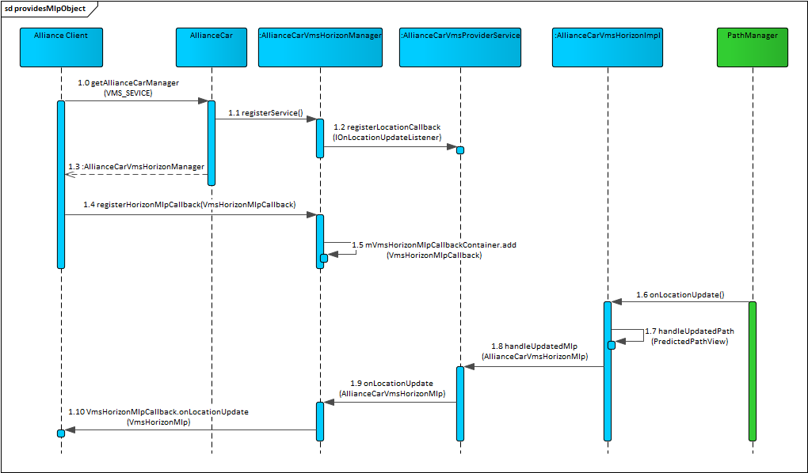
Image reference: doc_image_019.png

Figure : The sequence to provide the MLP object

4.3.3 Provide Route Update

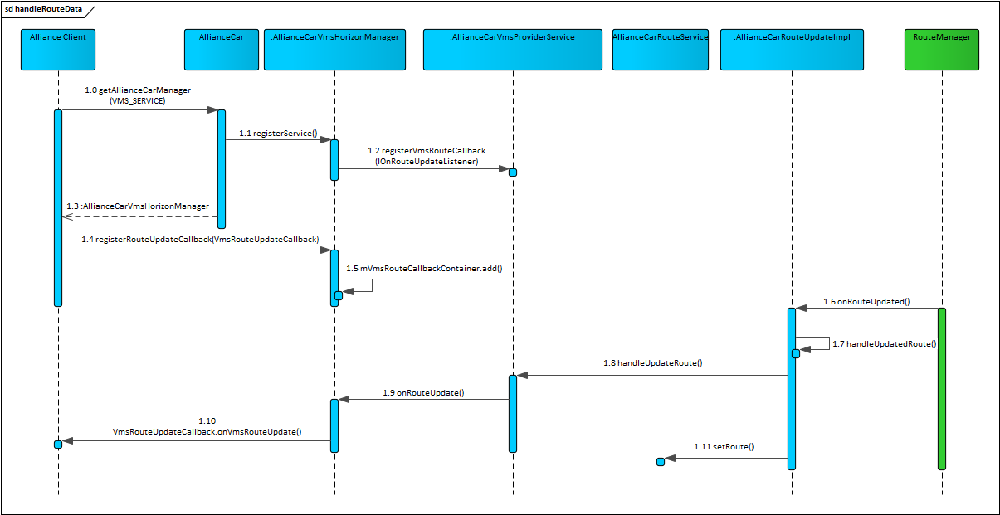
Image reference: doc_image_020.png

Figure : The seqence to handle and provide the route data

4.4 Interfaces Design

AllianceCarVmsHorizonManager Interface:

## Table
| registerService | registerService |
| --- | --- |
| Syntax | void registerService (IBinder iBinder) |
| Description | Register the AllianceCarVmsProvider service |
| Parameters | IBinder |
| Return | void |

## Table
| unregisterService | unregisterService |
| --- | --- |
| Syntax | void unregisterService() |
| Description | Unregister the AllianceCarVmsProvider service |
| Parameters | N/A |
| Return | void |

## Table
| registerHorizonMlpCallback | registerHorizonMlpCallback |
| --- | --- |
| Syntax | void registerHorizonMlpCallback(VmsHorizonMlpCallback listener) |
| Description | Register a VmsHorizonMlpCallback to be notified about MLP changes |
| Parameters | VmsHorizonMlpCallback |
| Return | void |
| unregisterHorizonMlpCallback | unregisterHorizonMlpCallback |
| Syntax | void unregisterHorizonMlpCallback (VmsHorizonMlpCallback listener) |
| Description | Unregister the previously registered VmsHorizonMlpCallback, to stop getting notifications about MLP changes |
| Parameters | VmsHorizonMlpCallback |
| Return | void |

## Table
| registerRouteUpdateCallback | registerRouteUpdateCallback |
| --- | --- |
| Syntax | void registerRouteUpdateCallback (VmsRouteUpdateCallback listener) |
| Description | Register a VmsRouteUpdateCallback to be notified about route changes |
| Parameters | VmsHorizonMlpCallback |
| Return | void |

## Table
| unregisterRouteUpdateCallback | unregisterRouteUpdateCallback |
| --- | --- |
| Syntax | void unregisterRouteUpdateCallback (VmsRouteUpdateCallback listener) |
| Description | Unregister the previously registered VmsRouteUpdateCallback, to stop getting notifications about route changes |
| Parameters | VmsRouteUpdateCallback |
| Return | void |

## Table
| IOnLocationUpdatedListener.onLocationUpdated | IOnLocationUpdatedListener.onLocationUpdated |
| --- | --- |
| Syntax | void onLocationUpdated(in AllianceCarVmsHorizonMlp horizon) |
| Description | Interface to be implemented by the AllianceCarVmsHorizonManager, to be called back from the AllianceCarVmsProviderService across the binder interface, when a new horizon generated for a new location AllianceCarVmsHorizonMlp occurs. |
| Parameters | AllianceCarVmsHorizonMlp |
| Return | void |

## Table
| IOnRouteUpdatedListener.onVmsRouteUpdate | IOnRouteUpdatedListener.onVmsRouteUpdate |
| --- | --- |
| Syntax | void onRouteUpdated(in AllianceCarVmsRouteUpdate route) |
| Description | Interface to be implemented by the AllianceCarVmsHorizonManager, to be called back from the AllianceCarVmsProviderService across the binder interface. |
| Parameters | AllianceCarVmsRouteUpdate |
| Return | void |

5. Implementation and Measurement

5.1 The source code implementation

1) Configure the Alliance Car VMS Service as an application

Android manifest:

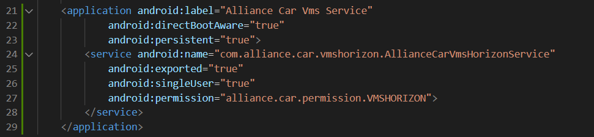
Image reference: doc_image_021.png

Android.bp:

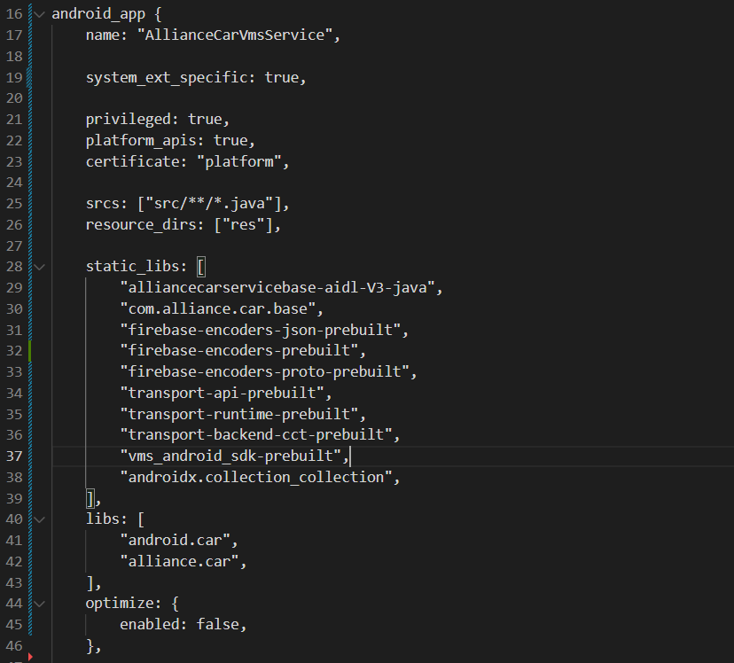
Image reference: doc_image_022.png

2) Configuration to let Alliance Car Core knows the VMS Service is external service:

Image reference: doc_image_023.png

5.2 Measurement the change

Because there is not enough time to make all the I/F available, the new external Alliance Car VMS service won't be fully implemented.

Test scenario:

Cold start the HU

Set route on Google Maps

Wait for 2 minutes

Run the command:

	Item 1) Run command:

		adb shell "dumpsys meminfo -d $(pgrep -u system -f com.alliance.car)"

Item 2) Check the log

Item 3) Run command: adb shell "dumpsys meminfo”

 (Do the test at least five times and get the average result.)

## Table
| No | Item | Before | After | Change |
| --- | --- | --- | --- | --- |
| 1 | Memory Usage (Alliance Car Service) | 109 MB | 36 MB | - 73 MB |
| 2 | GC execute (Alliance Car Service) | 2983.583 ms | 174.206 ms | - 2809.377 ms |
| 3 | Total used RAM (total memory usage by all user-space processes) | 2779.78 MB | 2781.83 MB | + 2.05 MB |

6. Conclusion

As we can see in the above table, the Memory usage and GC time execution of Alliance Car service have significantly decreased. So, creating a new external service as a service separation has improved the overall performance of the Alliance Car Service. It is also helpful for reducing the cost of service life cycle management and is easy to access from other services because it inherits the I/F from Alliance Car Base. Total RAM usage increased as expected but by a negligible amount. It primarily comes from the overhead of running the new service. It will not have much effect on the IVI system.

As mentioned, the new service is not fully implemented so the above number is for reference but the actual result will not be much different.

In the future, Memory usage will be monitored. In the case of an unexpected increase, it should be applied more optimized and improved. It can be combined with other solutions such as lazy initializing or forcibly executing the GC etc.. to reduce the unexpected effect of the GC on the system.

The end.

Thank you

Tran The Dan
