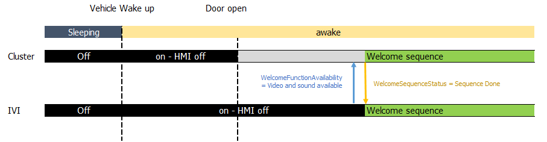
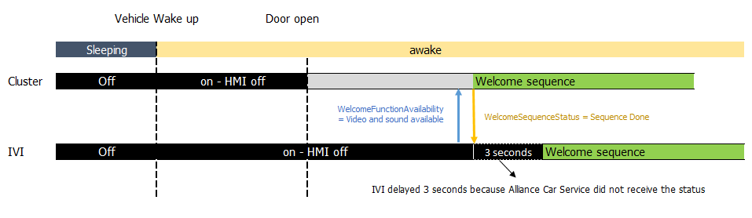
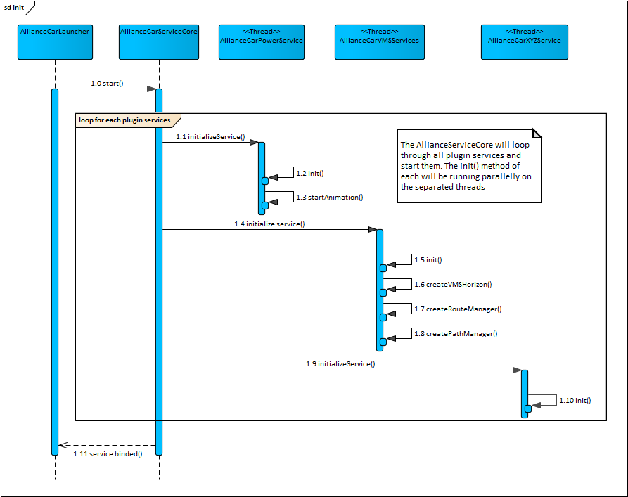
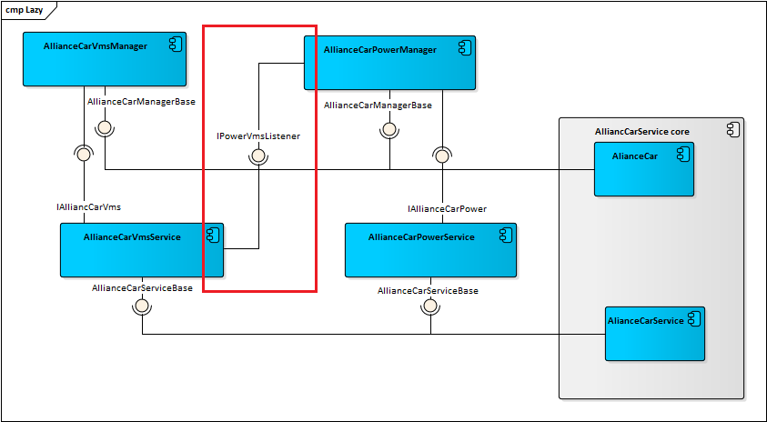
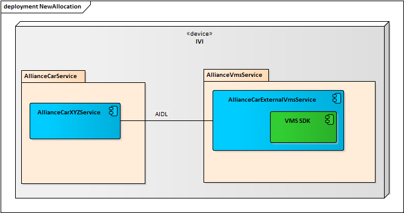

# Raw Slide Content

- Source file: FA_AllianceCarVMSService_v1.4-final_Tran_The_Dan[1]/FA_AllianceCarVMSService_v1.4-final.pptx
- Total slides: 20

## Slide 1

LGE Internal Use Only

Function Architect Task
Alliance Car VMS Service in the Renault project

Image reference: slide_01_image_01.png

Tran The Dan
Mentor: 신종혁/책임연구원
LG Electronics Inc.

## Slide 2

Contents

Background
Problem Description
Current Architecture
Proposals
Comparison
Architecture Design
Measure the final design

## Slide 3

1. Background

3

Image reference: slide_03_image_01.png

The Renault AIVI2 project:
Android-based infotainment system

## Slide 4

2. Probem description (1/5)

4

Image reference: slide_04_image_01.png

CLUSTER OK

IVI NG

The welcome sequence on IVI and Cluster is inconsistent:

## Slide 5

2. Probem description (2/5)

5

The welcome sequence synchronization principle:

Image reference: slide_05_image_01.png

## Slide 6

2. Probem description (3/5)

6

NG case:

Image reference: slide_06_image_01.png

OK case:

Image reference: slide_06_image_02.png

## Slide 7

2. Probem description (4/5)

7

What happened with the IVI?

Cluster

CAN BUS

IVI

Car Service
(IVI)

Process A

AllianceCarService process

Process B

Power service threads
(Display WS)

Other service threads

Other service threads

Garbage Collection threads

.
.
.

Garbage Collection threads

Garbage Collection threads

om.alliance.ca: Background young concurrent copying GC freed 476547(17MB) :total 3.143s

Signal

Signal

10:53:59.170  uplink: aa 00 08 83 50 13 01 1b 09 02 03

10:54:02.264 handleWelcomeSequenceStatus, state=3

3s

VMS: Vehicle Maps Service
WS: Welcome Sequence

## Slide 8

2. Probem description (5/5)

8

Memory analysis on Alliance Car Service process:

 need to find a proper architecture for VMS

Image reference: slide_08_image_01.png

## Slide 9

3. Current Architecture (1/2)

9

Image reference: slide_09_image_01.png

## Slide 10

3. Current Architecture (2/2)

10

Image reference: slide_10_image_01.png

Image reference: slide_10_image_02.png

## Slide 11

4. Proposals

Proposal 1:
Lazy Initializing
Proposal 2:
Service separation

11

## Slide 12

4.1 Proposal 1: Lazy Initializing

12

Image reference: slide_12_image_01.png

Pros:
Less modify
Easily in implementation

Cons
Hard to maintain
Statability problems

💡 Delay initialize VMS until Welcome Sequence finish:

* VMS: Vehicle Maps Service

## Slide 13

4.2 Proposal 2: Service separation

13

Image reference: slide_13_image_01.png

Pros:
Improves stability and performance
Cleaner and more maintainable codebase

Cons
More complicated to implement
RAM consumption may increase

💡 Separate the VMS service because of GC is running per process.

## Slide 14

5. Comparison

14

### Table
| QAs | Lazy Initializing | Service Separation | Priority |
| Performance | Improve the startup time GC still might be a block at another time. | Improve the startup time and lead to better performance during runtime | High |
| Performance | - Don't require more RAM for the new service | - RAM consumption may increase for the new process | Mid |
| Stability | Can lead to stability issues later in the app lifecycle | - Provides better isolation and improving stability | High |
| Maintainability | - The code might become harder to read and understand | - Better in the long run due to its modularity and scalability. | Mid |



 Service Separation would be a worthwhile tradeoff







## Slide 15

6. Architecture Design – Component Diagram

15

Image reference: slide_15_image_01.png

## Slide 16

6. Architecture Design – Class Diagram

16

Image reference: slide_16_image_01.png

## Slide 17

6. Architecture Design – Sequence Diagram (1/2)

17

Image reference: slide_17_image_01.png

New flow to provide the “Most Likely Path” Object from the new VMS Service

## Slide 18

6. Architecture Design – Sequence Diagram (2/2)

18

Image reference: slide_18_image_01.png

New flow to provide the Route Data Object from the new VMS Service

## Slide 19

7. Measurement of final design

19

### Table
| No | Item | Before | After | Change |
| 1 | Memory Usage (Alliance Car Service) | 109 MB | 36 MB | - 73 MB |
| 2 | GC execute (Alliance Car Service) | 2983.583 ms | 174.206 ms | - 2809.377 ms |
| 3 | Total used RAM (total memory usage by all user-space processes) | 2779.78 MB | 2781.83 MB | + 2.05 MB |

Test scenario:
- Cold start the HU
- Set route on Google Maps
- Wait for 2 minutes
Item 1) Run command:
adb shell "dumpsys meminfo -d $(pgrep -u system -f com.alliance.car)"
Item 2) Check the adb log
Item 3) Run command: adb shell "dumpsys meminfo”

## Slide 20

Thank you !

20

Q & A

