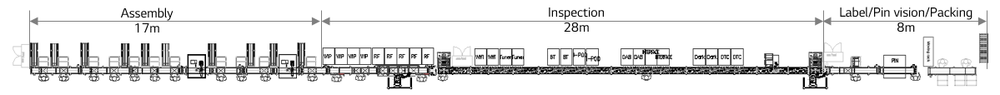
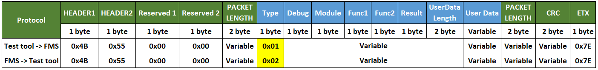
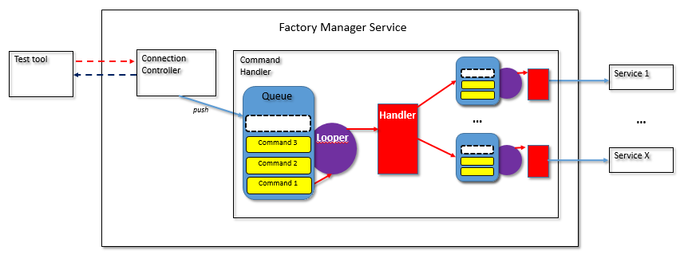
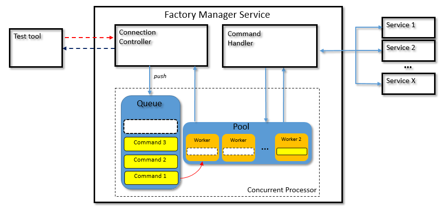
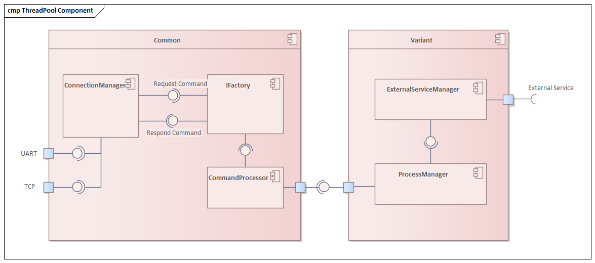
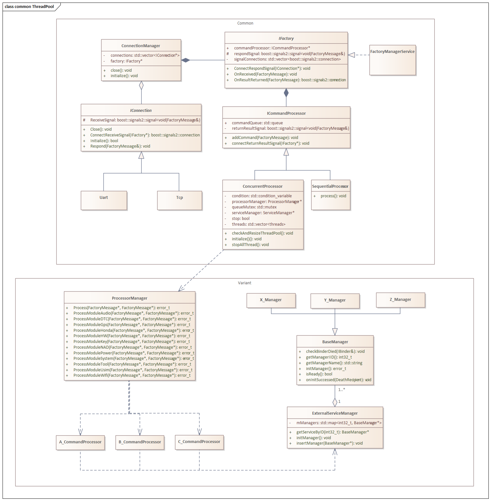
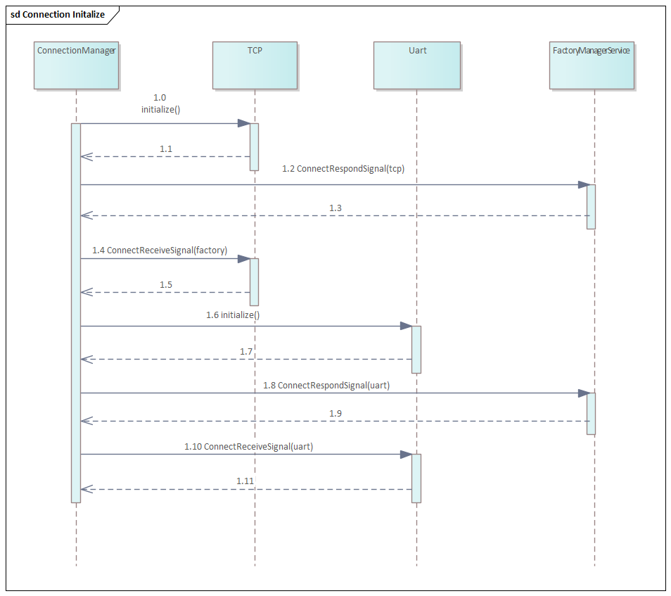
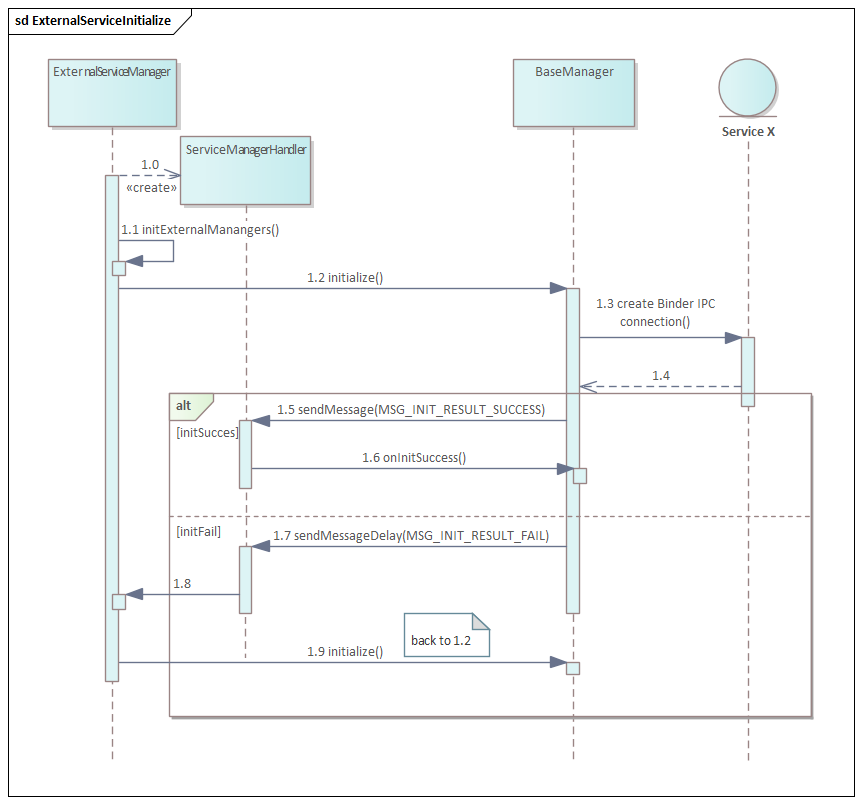
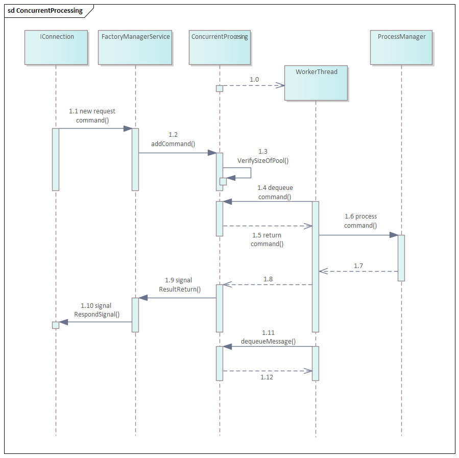

# Raw Document Content

- Source file: FA_bao_pham/Concurrent Processing For FactoryManager_v1.0_20230921.docx

FA Project: Concurrent Processing for Factory Manager

Revision History

## Table
| Version | Date | Notes | Author | Approval |
| --- | --- | --- | --- | --- |
| 0.1 | 2023.07.19 | Initial Release | bao.pham |  |
| 0.2 | 2023.08.07 | Add Architecture Design Proposal. | bao.pham |  |
| 0.3 | 2023.08.28 | Add Design Comparison and Thread Pool Approach Architecture Design | bao.pham |  |
| 0.4 | 2023.08.30 | Update sequence diagram | bao.pham |  |
| 0.5 | 2023.09.01 | Add sequence diagram for Initialize External Service | bao.pham |  |
| 0.6 | 2023.09.09 | - Restructure - Adding test environment description - Add trade off point for Handler Looper approach - Add detail for how to resolve the concurrent obstacles in Thread Pool approach. | bao.pham |  |
| 0.7 | 2023.09.15 | - Separate Technical constrain and Business constrain - Add section 2.4.1 Design tactic and experimental result - Update ID for table | bao.pham |  |
| 1.0 | 2023.09.21 | Update table of content and release 1st version | bao.pham |  |

Table of Contents

Purpose

This document specifies the software architectural design for Concurrent Processing for Factory Manager of Honda TSU MY23 project.

This design document also serves as a guideline on how each software component in the system should be implemented and how the internal components/external processes should interact with each other.

Background

Factory Manager Service (FMS) is the service made for line test in the factory. After being assembled, all products have to be inspected to ensure there is no defects before shipment

Image reference: doc_image_001.PNG

Figure 1. Layout of FA line (Final Assembly) with Inspection process.

The test environment consists of 3 main component:

The product: this refer to the device which being tested. FMS is a software component in the product.

Test PC with test tool installed: The PC serves as a control center for the testing activities. It contains a dedicated test tool software that orchestrates the test operations.

Peripheral devices: These are additional devices or emulators (in the figure 2 below, peripheral device is test bench) used in the testing process to simulate specific test conditions or evaluate the environment parameters. (power supply, voltage check, current check, …)

Image reference: doc_image_002.png

Figure 2. Configuration of test system in FA line

In this setup, the test tool installed on the PC plays a crucial role as the software responsible for coordinating the testing activities. It sends commands to the peripheral devices, configuring them to create desired test conditions. Additionally, the test tool sends test requests to FMS, initiating the actual testing process. The results of the tests are then captured and updated on a server (GMES) for further analysis and reporting.

Overall, the test tool on the PC acts as a control hub, enabling communication between the peripheral devices, the product under test, and the server, facilitating the execution and management of the testing process.

The principle of testing is that a PC will sends predefined test commands to the FMS. Then FMS will process the test request and response the result back to PC. Base on the test result, sample can be judged as OK or NG.

The existing design of FMS is only support for single-command-processing, which lead to increase the tact time to inspect. The longer time it takes to test, the less product will be completed in a unit of time (UPH – Unit per hour).

To address this problem, a new design has been considered to help FMS can handle multiple commands simultaneously.

Scope

This document describes the following about the Concurrent Processing of FMS

SW Architectural representation

External interface design

Sequence diagram for use case

Audience

The readers of this article are as follows:

Software architect who will evaluate the design of the software

Developer who will implement the design to actual code.

Test Application Engineer who made the test tool which sent the test commands to FMS.

Related Document

Standard Protocol: Factory_Develop_Tool_Ver_1.4.2_Telematics_forTSU_20230605.xslx

Acronyms / Glossary

## Table
| Acronyms | Description |
| --- | --- |
| FMS | Factory Manager Service |
| FA | Final Assembly |
| UART | Universal Asynchronous Receiver-Transmitter |
| API | Application Programming Interface |
| GMES | Global Manufacturing Execution System |
| DTC | Diagnostic Trouble Code |

## Table
| Glossary | Description |
| --- | --- |
| Test tool | Software that send factory commands to FMS. |
| FA line | The line where product was assembly and inspect before packing and shipping to customer. |
| GMES | Software system to monitor the production process. Test tool updates the test data of each product to this system. |

1. OVERVIEW

1.1 Overall Description

The main goal of FMS is control protocol command from Test Tool in the inspection process of FA line. Test commands can be sent to FMS via UART or Ethernet connection with predefined protocol. After receive test commands from test tool, FMS process the command with support from other services and response the result to the test tool.

The current implementation only support to handle command sequentially, one request at a time. As a result, potential delays and decreased responsiveness may happen. To address the limitation of the current implementation and achieve concurrent processing, the new design should be considered.

The benefits that can be achieved through the concurrent processing:

- Minimize test time, increase production output achieved.

- Reduce investment costs for equipment. With multiple items are able to execute at the same time, test stations can be grouped to optimize efficiency.

- Minimize labor cost. Combining test stations leads to reduction in the amount of manpower required to work.

1.2 Functional Requirement

The FMS communicates with test tool with 2 mandatory connection interface: UART and TCP. Once connection was established, test commands can be sent concurrently to the FMS. Test tool have to send the command to FMS with predefined protocol (refer to Factory_Develop_Tool_Ver_1.4.2_Telematics_forTSU_20230605.xslx). The test command must start with 2 header bytes (4B 55) and end with ETX byte (7E).

The following table below show the format of example command which used to communicate between FMS and test tool.

Image reference: doc_image_003.png

Figure 3. Packet structure of request command

After received the command, FMS established the connection to others software 	services and process the command.

1.3 Non-functional Requirement

The concurrent processing for FMS need to follow the non-functional requirement as below:

## Table
| # | QA Scenario | Quality Attribute | Priority |
| --- | --- | --- | --- |
| QA-1 | FMS must be available to handle incoming test command even if it is waiting for other test command to be processed. | Reliability | High |
| QA-2 | FMS must be able to process 10 commands concurrently. | Performance | High |
| QA-3 | Test commands must retain their content upon reception, and vice versa. | Integrity | Medium |
| QA-4 | FMS after apply concurrent processing should be available for new project using Tiger framework without re-implement concurrent processing. | Reusability | Low |

Table 1. Non-functional requirement for concurrent processing FMS

1.4 Constraints

## Table
| ID | Constraint | Type |
| --- | --- | --- |
| CO1 | FMS should follow LGEDV Coding Convention, defect 0 with 24 most violated issue. http://collab.lge.com/main/display/DCVCC/LGEDV+Coding+Convention | Technical Constrain |
| CO2 | FMS have to follow Tiger framework | Technical Constrain |
| CO3 | The standard protocol (refer to Related Document) for communication between test tool and FMS will not be modified after apply concurrent processing. | Business Constrain |

Table 2. Constraint for concurrent processing FMS

2. ARCHITECTURE DESIGN PROPOSAL

2.1 Obstacle with concurrent processing

By apply concurrent processing for FMS, there are some obstacle need to be addressed:

FMS need to call API from other service to execute the test command, and the target service may not support concurrent processing.

For a group of commands which request to the same hardware module, those commands should be processed sequentially.

For obstacle (2), let consider example about BUB test and DTC test below

## Table
| BUB test | DTC test | GPS test |
| --- | --- | --- |
| Set BUB Mode Enable Get BUB Mode Get BUB CCV* Set BUB Mode disable Get BUB Mode BUB current measurement | Set Red LED On Get Red LED ADC Get DTC Red LED (expect: 0) Relay LED Open Get Red LED ADC Get DTC Red LED (expect: 1) | GPS Cold Start Get TTFF (time to first fix) Get satellite count. |

Table 3. Example of test scenario

*CCV: Closed Circuit Voltage is the voltage across the terminals of a battery when it is on discharge. In CCV, a battery is under a load from external source.

The sequence of commands above is designed to check BUB mode and DTC test. Each step in the sequence has a specific purpose and dependency on the previous step, make it essential to execute them in order, one after the other, rather than concurrently.

Someone will have question: “then why do we need concurrent processing for FMS?” The answer is concurrent processing still helpful when we make concurrent for two or more sequence which have distinct objective and have no same resource. In the example above, even if Power test and GPS internally have to be executed sequentially, these two test is available to process concurrently.

2.2 Handler Looper Approach

This design resolve the blocking point above by making concurrent processing across the target service only. The command that request to same service will be process sequentially.

In this design, FMS will use Looper and Handler to provide concurrent processing. When a test command is received, it is initially sent to a central handler, which act as dispatcher. This central looper act as a hub, ensure that the main thread will not be blocked, and FMS can receive new command during processing other commands.

However, instead of get and process the command. Since each service operate its own handler, test command can be process concurrently across difference service.

Image reference: doc_image_004.png

Figure 4. Handler-Looper approach for FMS

2.2.1 Trade Off

This design work well if all commands request to FMS are processed by external services. However, in fact, there are non-target-service commands. The non-target-service commands are commands which FMS can process by itself (for example: write serial, MAC address ...). Those command may not be processed concurrently if Handler-Looper approach is applied.

If external service support for concurrent processing, this design will not be able to take the advantage of it. Those command which request to that external service will be process sequentially no matter it support concurrent processing or not.

Consider the ‘GPS test’ scenario in section 2.1, the ‘GPS Cold Start’ command are prerequisite for the next 2 commands (Get satellite count and Get TTFF). However, ‘Get TTFF’ and ‘Get satellite count’ have to process sequentially even they are not depend to each other.

2.3 Thread Pool Approach

To address the trade off point of Handler Looper approach, the new design using thread pool was introduced.

Image reference: doc_image_005.png

Figure 5. Current Design of FMS and new design with apply of thread pool

The thread pool will manage a group of pre-initialized threads, allowing them to be reused for executing multiple tasks concurrently. When new test command is received, FMS will enqueue the test command to a queue of command. This queue act as a buffer, holding the pending tasks until the work threads are ready to execute them.

The worker threads in the pool are in idle state and continuously check the queue for pending tasks. Once a worker thread becomes available and there's a task in the queue, the thread dequeues the task and starts executing it. The worker threads continuously repeat this process until the thread pool is shut down. The execution process happen concurrently, which means multiple test commands can be executed simultaneously by different worker threads.

By apply this design, the 2 trade off points from Handler Looper approach can be resolved:

The non-target-service commands can be processed concurrently since we don’t care about target service.

If external service support for concurrent processing, these command can be process concurrently also.

2.3.1 Resolve of concurrent obstacle

The idea of using Thread Pool to apply concurrent processing for FMS base on the fact that those blocking point in section 2.1 can and can only be resolved from test tool side.

FMS can resolve those issue by developing an algorithm to determine the sequence of each factory command it received. However, the issue is coming from those commands which test tool sent to peripheral devices also.

As test environment mentioned in section Background: the test tool on the PC acts as a control hub, enabling communication between the peripheral devices and the product under test. It is important to note that the commands are not only sent to FMS but also to the peripheral devices. Let’s consider the example about DTC test in section 2.1,

## Table
| # | Command | Target |
| --- | --- | --- |
| 1 | Set Red LED On | FMS |
| 2 | Get Red LED ADC | FMS |
| 3 | Get DTC Red LED (Expect: Normal) | FMS |
| 4 | Relay LED Open | Peripheral devices |
| 5 | Get Red LED ADC | FMS |
| 6 | Get DTC Red LED (Expect: Open) | FMS |

Table 4. DTC test and target of commands

The command number (4) need to be finished before (5) and (6) to check the Red LED DTC Open. However, command number (4) is not sent to FMS but peripheral devices, therefore FMS cannot determine if (4) was completed or not to start processing (5) and (6).

To fix this problem, the test designer will make a script which each command have Dependence ID. This Dependence ID will refer to the ID of command which it needs to wait for completion.

## Table
| ID | Command | Target | Dependence ID |
| --- | --- | --- | --- |
| 1 | Set BUB Mode Enable | FMS | 0 |
| 2 | Get BUB Mode | FMS | 1 |
| 3 | Get BUB CCV | FMS | 2 |
| 4 | Set BUB Mode disable | FMS | 3 |
| 5 | Get BUB Mode | FMS | 4 |
| 6 | BUB current measurement | Peripheral devices | 5 |
| 7 | Set Red LED On | FMS | 0 |
| 8 | Get Red LED ADC | FMS | 7 |
| 9 | Get DTC Red LED | FMS | 8 |
| 10 | Relay LED Open | Peripheral devices | 9 |
| 11 | Get Red LED ADC | FMS | 10 |
| 12 | Get DTC Red LED | FMS | 11 |
| 13 | GPS Cold Start | FMS | 0 |
| 14 | Get TTFF (time to first fix) | FMS | 13 |
| 15 | Get satellite count | FMS | 13 |

Table 5. Apply of Dependence ID to resolve concurrent obstacles.

The test tool will send a command which satisfy one of conditions: (1) command which has Dependence ID = 0; (2) command which has dependence command has been processed successfully. Below tables show how each commands was sent.

## Table
| ID | Command | Command | Dependence ID | Status | Status |
| --- | --- | --- | --- | --- | --- |
| 1 | Set BUB Mode Enable | Set BUB Mode Enable | 0 | Processing | Processing |
| 2 | Get BUB Mode | Get BUB Mode | 1 |  |  |
| 3 | Get BUB CCV | Get BUB CCV | 2 |  |  |
| 4 | Set BUB Mode disable | Set BUB Mode disable | 3 |  |  |
| 5 | Get BUB Mode | Get BUB Mode | 4 |  |  |
| 6 | BUB current measurement | BUB current measurement | 5 |  |  |
| 7 | Set Red LED On | Set Red LED On | 0 | Processing | Processing |
| 8 | Get Red LED ADC | Get Red LED ADC | 7 |  |  |
| 9 | Get DTC Red LED | Get DTC Red LED | 8 |  |  |
| 10 | Relay LED Open | Relay LED Open | 9 |  |  |
| 11 | Get Red LED ADC | Get Red LED ADC | 10 |  |  |
| 12 | Get DTC Red LED | Get DTC Red LED | 11 |  |  |
| 13 | GPS Cold Start | GPS Cold Start | 0 | Processing | Processing |
| 14 | Get TTFF (time to first fix) | Get TTFF (time to first fix) | 13 |  |  |
| 15 | Get satellite count | Get satellite count | 13 |  |  |
| ID | Command | Dependence ID | Dependence ID | Status |
| 1 | Set BUB Mode Enable | 0 | 0 | Done |
| 2 | Get BUB Mode | 1 | 1 | Processing |
| 3 | Get BUB CCV | 2 | 2 |  |
| 4 | Set BUB Mode disable | 3 | 3 |  |
| 5 | Get BUB Mode | 4 | 4 |  |
| 6 | BUB current measurement | 0 | 0 | Done |
| 7 | Set Red LED On | 6 | 6 | Processing |
| 8 | Get Red LED ADC | 7 | 7 |  |
| 9 | Get DTC Red LED | 8 | 8 |  |
| 10 | Relay LED Open | 9 | 9 |  |
| 11 | Get Red LED ADC | 10 | 10 |  |
| 12 | Get DTC Red LED | 11 | 11 |  |
| 13 | GPS Cold Start | 0 | 0 | Done |
| 14 | Get TTFF (time to first fix) | 13 | 13 | Processing |
| 15 | Get satellite count | 13 | 13 | Processing |

Table 6. How each command was sent base on its Dependence ID

2.4 Design comparison

The following table compare the design of Thread Pool approach and Handler-Looper approach

## Table
| QA Attribute | Thread Pool approach | Handler-Looper Approach | Remark |
| --- | --- | --- | --- |
| Performance | High. Size of pool can be resize based on actual demand. | Low. Depend on number of requesting service | FMS must be able to process 10 commands concurrently. |
| Reliability | High. All commands are queued and FMS Can accept new command while processing other commands. | High. All commands are queued and FMS can accept new command while processing other commands | FMS must be available to handle incoming test command even if it is waiting for other test command to be processed. |
| Integrity | High. Checksum applied. | High. Checksum applied | Test commands must retain their content upon reception, and vice versa |
| Reusability | High. The implementation is in Common part, so newly added projects are immediately inherited concurrent processing. | Low. New project need to re-implement concurrent processing. | FMS after apply concurrent processing should be available for new project using Tiger framework without re-implement concurrent processing. |
| Flexibility | High. Work with all kind of command. Available for support in case external services support concurrent. | Low. Mention in 2.2.1 Trade Off. |  |

Table 7. Thread Pool approach and Handler-Looper approach comparison.

Base on the comparison above, the design of Thread Pool approach will be used to apply Concurrent Processing for FMS.

2.4.1 Design tactic and experimental result

## Table
| QA Attribute | QA Scenario | Tactic | Validation Method | Experimental Result | Experimental Result |
| --- | --- | --- | --- | --- | --- |
| QA-1 Reliability | FMS must be available to handle incoming test command even if it is waiting for other test command to be processed. | Queueing all request. | Load test with 10 commands request simultaneously. Measuring quantity of loss commands. | Old FMS | Thread Pool FMS |
| QA-1 Reliability | FMS must be available to handle incoming test command even if it is waiting for other test command to be processed. | Queueing all request. | Load test with 10 commands request simultaneously. Measuring quantity of loss commands. | 9 | 0 |
| QA-2 Performance | FMS must be able to process 10 commands concurrently. | Introduce concurrency | Load test with 10 commands request simultaneously. Measuring time to complete 10 commands | Old FMS | Thread Pool FMS |
| QA-2 Performance | FMS must be able to process 10 commands concurrently. | Introduce concurrency | Load test with 10 commands request simultaneously. Measuring time to complete 10 commands | 23.315s | 2.85s |
| QA-3 Integrity | Test commands must retain their content upon reception, and vice versa. | Use checksum | Normal case: send command with CORRECT checksum to FMS and verify. | Processing normally | Processing normally |
| QA-3 Integrity | Test commands must retain their content upon reception, and vice versa. | Use checksum | Failure case: send command with INCORRECT checksum to FMS and verify | Reject command | Reject command |
| QA-4 Reusability | FMS after apply concurrent processing should be available for new project using Tiger framework without re-implement concurrent processing. | Separate of concern. The modification was made in Common part only. | Line of code modification in common part and variant part. | Common part: 818 insertions(+), 177 deletions (-) Variant part: 0 insertion(+), 0 deletion(-) | Common part: 818 insertions(+), 177 deletions (-) Variant part: 0 insertion(+), 0 deletion(-) |

Table 8. Design tactic and experimental result with Thread Pool design

3. THREAD POOL ARCHITECTURE DESIGN

3.1 Static Design

The FMS is a part of LG Tiger framework. It is divided into 2 part: the common part and the variant part.

The common part consist of features and elements that are universal across all projects, ensuring consistency and shared functionality. Specifically, the common part contains connection handling function and basic service behaviors of FMS.

On the other hand, the variant part is designed to be customizable for each individual project, allowing for unique modifications that cater to specific project requirements. For each project, there will be difference specification, led to difference test item. This necessitates the delegation of command processing to the variant component. This approach allows projects to benefit from a standardized foundation while still accommodating the distinct needs of each project through the variant component

Image reference: doc_image_006.png

Figure 6. Component Diagram for Factory Manager Service

Image reference: doc_image_007.png

Figure 7. Class diagram for Factory Manager Service

## Table
| Class | Description |
| --- | --- |
| IConnection | Abstract class for connection from test tool that FMS support. |
| ConnectionManager | Initialize/close connection. Connect connection signal with factory callback function. |
| IFactory | Abstract class for behavior of FMS. Accept factory command from IConnection and process it. |
| ICommandProcessor | Abstract class for how FMS process factory commands. |
| ConcurrentProcessor | Class for processing factory command concurrently. |
| ProcessorManager | Distribute the received factory commands to dedicated module. |
| ExternalServiceManager | Manage connection from FMS to external services (Power, Location, Antenna, Telephony, …) |
| BaseManager | Abstract class to manage connection to an external service. |

Table 9. Explanation for FMS class diagram

3.2 Dynamic Design

3.2.1 Interaction Design

3.2.1.1 External Interface Design

The following table describe the service interface of FMS

## Table
| Call Type | Return Type | Function Name | Parameters | Description |
| --- | --- | --- | --- | --- |
| Request to Factory Manager Service | error_t | startTool | NONE | This interface used by client to make FMS ready to accept test command. This is very first command that executed by FMS in every test sequence. Without this command, all other commands will return will result is FAIL. |
| Request to Factory Manager Service | std::vector<int8_t> | executeCommand | std::vector<int8_t> cmd | This interface is used by client to pass a factory command to FMS and execute it. The input command is a vector of int8_t with format of: 4B 55 00 00… 7E FMS will execute the command and respond a with same format. |

Table 10. Interface of FMS

Data type definition:

## Table
| Data struct | Description |
| --- | --- |
| error_t | E_OK = 0, /** No error */ E_ERROR = -1, /** Unknown error */ E_INVALID_PARAM = -2, /** Invalid parameter */ E_CAN_NOT_RESPONSE = -3, /** Cannot send response */ E_TIME_OUT = -4, /* time-out */ E_REJECTED = -5, /* Request is rejected due to some reason */ E_PENDING = -6, /* Request is pending due to some reason */ E_NOT_ENOUGH_MEMORY = -7, /* Not enough memory */ E_DATA_CORRUPTED = -8, /* Data corrupted */ E_BUFFER_EMPTY = -9, /* Buffer empty */ E_INPUT_EMPTY = -10, /* Input empty */ E_FRAME_NOTREADY = -11 /* Frame Not Ready */ |

Table 11. error_t data type definition

Sequence Diagram

3.2.1.2.1 Initialize Connection

Image reference: doc_image_008.png

Figure 8. Sequence diagram for connection initialize

## Table
| Step | Description |
| --- | --- |
| 1.0 – 1.1 | Initialize TCP connection. |
| 1.2 – 1.3 | Connect Respond signal of TCP with callback function of FactoryManagerService. |
| 1.4 – 1.5 | Connect Receive signal of FactoryManagerService with callback function in TCP. |
| 1.6 – 1.7 | Initialize UART connection. |
| 1.8 – 1.9 | Connect Respond signal of UART with callback function of FactoryManagerService. |
| 1.10 – 1.11 | Connect Receive signal of FactoryManagerService with callback function in UART. |

Table 12. Connection initialize sequence diagram explaination

3.2.1.2.2 External Service Initialize

Image reference: doc_image_009.png

Figure 9. Sequence diagram for initialize connection to external service.

## Table
| Step | Description |
| --- | --- |
| 1.0 | Create handler. |
| 1.1 | Create managers connect to external service. |
| 1.2 | Initialize managers. |
| 1.3 – 1.4 | Create Binder IPC connection to external service. |
| 1.5 | Send message to notify Binder IPC connection is successes. |
| 1.6 | Do some stuff when Binder IPC connection (link to death, …) |
| 1.7 | Send message to notify Binder IPC connection is fail. Message was send after 500ms. |
| 1.8 – 1.9 | Re-initialize managers, back to step 1.2 |

Table 13. Explanation for initialize connection to external service sequence diagram

3.2.1.2.3 Concurrent Processing

Image reference: doc_image_010.png

Figure 10. Sequence diagram for Thread Pool processing.

## Table
| Step | Description |
| --- | --- |
| 1.0 | Create worker thread to handler factory command. |
| 1.1 | Connection emits new command. |
| 1.2 | Add new command to command queue. |
| 1.3 | Check the number of pending commands to determine whether it is necessary to increase the number of worker threads. |
| 1.4 – 1.5 | Dequeue command from queue to execute. |
| 1.6 – 1.7 | Process commands. |
| 1.8 – 1.10 | Respond command result. |

Table 14. Thread Pool processing sequence diagram explaination
