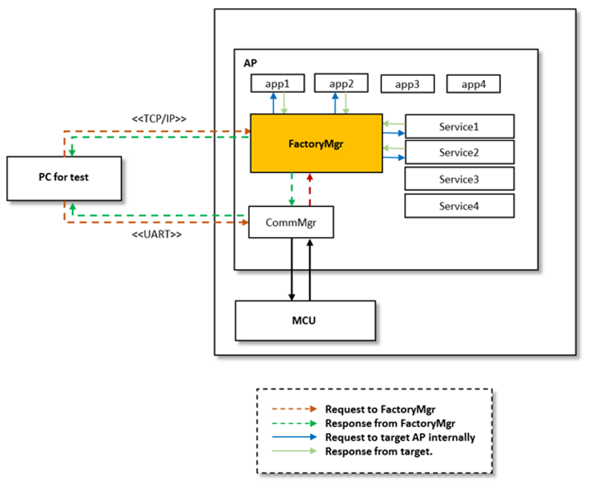
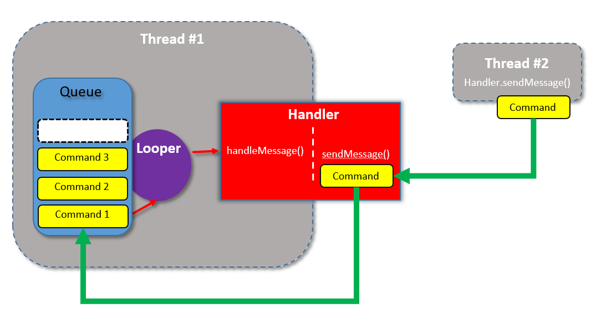
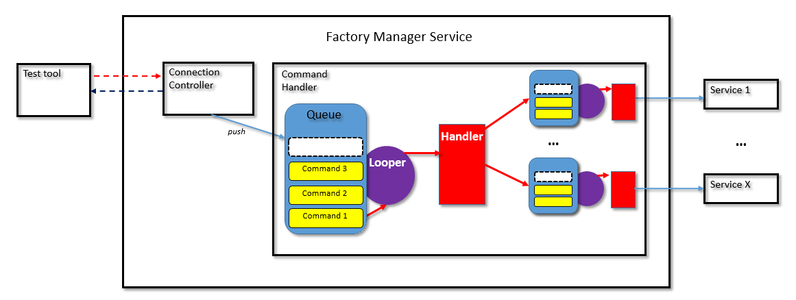
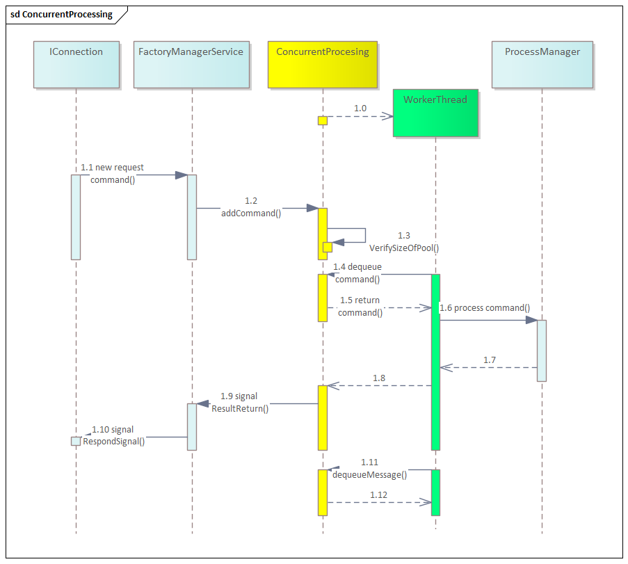
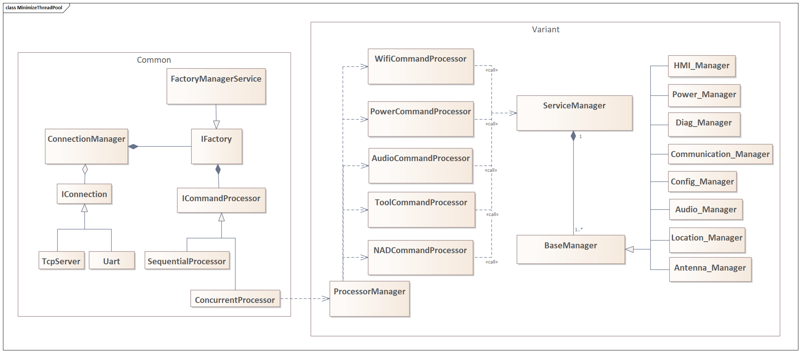
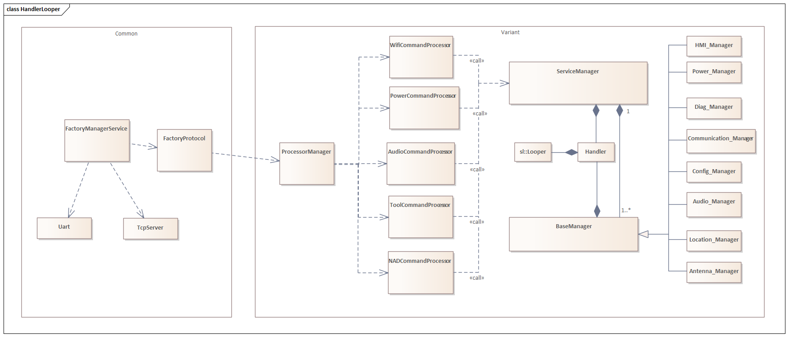

# Raw Slide Content

- Source file: FA_bao_pham/Concurrent Processing For FMS_v1.3_20230926.pptx
- Total slides: 19

## Slide 1

Image reference: slide_01_image_01.png

Concurrent Processing for Factory Manager

BAO DUC PHAM bao.pham
LGEDV Factory SW Team

## Slide 2

TABLE OF CONTENT

Problem Identification

Architecture Design Proposals

Design Comparison

Thread Pool FMS

1

2

3

4

Q&A

5

2

## Slide 3

Problem Identification

Factory Manager Service (FMS) is the service made for line test in the factory. After being assembled, all products have to be inspected to ensure there is no defects before shipment.

Image reference: slide_03_image_01.png

Basic Functions

Communicating with test tool with 2 mandatory connections interface: UART and TCP.
Receiving test command from test tool with a predefined protocol.
Communicating with others services to execute the test and respond the result to the test tool.

Image reference: slide_03_image_02.png

Image reference: slide_03_image_03.png

Image reference: slide_03_image_04.png

Assembly
17m

Inspection
28m

Label/Pin vision/Packing
8m

Image reference: slide_03_image_05.png

Image reference: slide_03_image_06.png

Problem

Only support single command processing.

3

## Slide 4

Problem Identification

Quality Attribute

Constraints

### Table
| # | QA Scenario | Quality Attribute | Priority |
| QA-1 | FMS must be available to handle incoming test command even if it is waiting for other test command to be processed. | Reliability | High |
| QA-2 | FMS must be able to process 10 commands concurrently. | Performance | High |
| QA-3 | Test commands must retain their content upon reception, and vice versa. | Integrity | Medium |
| QA-4 | FMS after applying concurrent processing should be available for new project that use Tiger framework without re-implement concurrent processing. | Reusability | Low |

### Table
| # | Constraints | Type |
| CO1 | FMS should follow LGEDV Coding Convention, defect 0 with 24 most violated issue. http://collab.lge.com/main/display/DCVCC/LGEDV+Coding+Convention. | Technical Constrain |
| CO2 | FMS have to follow Tiger framework. | Technical Constrain |
| CO3 | The standard protocol for communication between test tool and FMS will not be modified after applying concurrent processing. | Business Constrain |

4

## Slide 5

Architecture Design Proposals

FMS need to call API from other services to execute the test command, and the target service may not support concurrent processing.
For a group of commands which request to the same hardware module, those commands should be processed sequentially.

Image reference: slide_05_image_01.png

SET BUB MODE ENABLE

GET BUB MODE

GET BUB CCV*

SET BUB MODE DISABLE

GET BUB MODE

CURRENT MEASUREMENT

*CCV: Closed Circuit Voltage is the voltage across the terminals of a battery when it is on discharge. In CCV, a battery is under a load from external source.

SET RED LED ON

GET RED LED ADC

GET DTC RED LED
(expect: 0)

RELAY LED OPEN

GET RED LED ADC

GET DTC RED LED
(expect: 1)

sequentially

sequentially

CONCURRENT

Obstacles points

5

## Slide 6

Architecture Design Proposals

Handler Looper approach

Image reference: slide_06_image_01.png

Image reference: slide_06_image_02.png

Handler is used to scheduled tasks, while Looper is used to manages the message queue for a thread.
Handler allows us to send message to the worker thread for execution, ensure the task are executed asynchronously.

The central Handler forward the received commands to specific handler which associated with corresponding service.
Each external service class has its own Looper-Handler pair to handle the test command.
Since each service class operate its own Looper, test command can be processed concurrently across difference services.

Design 1: Handler Looper approach

6

## Slide 7

Architecture Design Proposals

Design 2: Thread Pool approach

Thread Pool approach

The thread pool will manage a group of pre-initialized threads, allow them to reused for executing multiple tasks concurrently. When new test command is received, FMS will enqueue the test command to a queue of command. This queue work as a buffer, hold the pending tasks until the work threads are ready to execute them.

Image reference: slide_07_image_01.png

7

## Slide 8

Design Comparison

### Table
| QA | Thread Pool Approach | Handler Looper Approach | Remark |
| Performance | High. Size of pool can be resized base on pending commands in the queue. | Low. Depend on number of requesting service | FMS must be able to process 10 commands concurrently. |
| Reliability | High. All commands are queued and FMS can accept new command while processing other commands. | High. All commands are queued and FMS can accept new command while processing other commands | FMS must be available to handle incoming test command even if it is waiting for other test commands to be processed. |
| Integrity | High. Checksum applied. | High. Checksum applied | Test commands must retain their content upon reception, and vice versa |
| Reusability | High. The implementation is in Common part, so newly added projects are immediately inherited concurrent processing. | Low. New project need to re-implement concurrent processing. | FMS after applying concurrent processing should be available for new project to use Tiger framework without modifying the common part. |
| Flexibility | High. Easy to change how command was processed by introducing new inherited class from IcommandProcessor class. | Low. This approach only work well if the fact mention in slide 5 is true. |  |

Final Decision: Thread Pool approach

8

## Slide 9

Thread Pool FMS

Image reference: slide_09_image_01.png

9

## Slide 10

Thread Pool FMS

Image reference: slide_10_image_01.png

10

## Slide 11

### Table
| QA | QA Scenario | Tactic | Validation Method | Experimental Result |  |
| QA-1 Reliability | FMS must be available to handle incoming test command even if it is waiting for other test commands to be processed. | Queueing all request. | Load test with 10 commands request simultaneously. Measuring quantity of loss commands. | Old FMS | Thread Pool FMS |
|  |  |  |  | 9 | 0 |
| QA-2 Performance | FMS must be able to process 10 commands concurrently in normal condition. | Introduce concurrency | Load test with 10 commands request simultaneously. Measuring time to complete 10 commands | Old FMS | Thread Pool FMS |
|  |  |  |  | 23.315s | 2.85s |
| QA-3 Integrity | Test commands must retain their content upon reception, and vice versa. | Use checksum | Normal case: send command with CORRECT checksum to FMS and verify. | Processing normally |  |
|  |  |  | Failure case: send command with INCORRECT checksum to FMS and verify | Reject command |  |
| QA-4 Reusability | FMS after applying concurrent processing should be available for new project using Tiger framework without re-implement concurrent processing. | Separate of concern. The modification was made in Common part only. | Line of code modification in common part and variant part. | Common part: 818 insertions(+), 177 deletions (-) Variant part: 0 insertion(+), 0 deletion(-) |  |

Thread Pool FMS

Design Tactic and Experimental Result

11

## Slide 12

Thread Pool FMS

Image reference: slide_12_image_01.png

Separate of concern

Use checksum

Queueing all request

Introduce concurrent

12

## Slide 13

Q&A

Thank you for listening

13

## Slide 14

Appendix

## Slide 15

Test time
Minimize test time, increase production output achieved

 The more commands execute in a unit of time, the less time it takes to inspect. Resulting increase UPH (unit per hour).

Investment cost
Reduce investment costs for equipment

With multiple items are able to execute at the same time, test stations can be grouped to optimize efficiency.

Labor cost
Minimize labor cost

Combining test stations leads to reduction in the amount of manpower required to work.

Why concurrent processing is needed?

Image reference: slide_15_image_01.png

Image reference: slide_15_image_02.png

Image reference: slide_15_image_03.png

## Slide 16

GPS Cold Start

Get TTFF

Get Satellite Count

Architecture Design Proposals

Handler Looper approach

Trade off

Non-target-commands (command which FMS can process by itself, no need external service) will not be process concurrently.

If external service support concurrent processing, then this approach will not benefit from that.

Write Serial Number

Read Main SW Version

Q-fusing check

16

## Slide 17

Architecture Design Proposals

Thread Pool approach

Resolve of concurrent obstacle

### Table
| # | Command | Target |
| 1 | Set Red LED On | FMS |
| 2 | Get Red LED ADC | FMS |
| 3 | Get DTC Red LED (Expect: Normal) | FMS |
| 4 | Relay LED Open | Peripheral devices |
| 5 | Get Red LED ADC | FMS |
| 6 | Get DTC Red LED (Expect: Open) | FMS |

The blocking point can and can only resolve from test tool side.

Image reference: slide_17_image_01.png

Command (4) is prerequisite for (5) and (6)
(4) are not sent to FMS but peripheral devices.
(5) and (6) was unable to know if (4) is completed or not.

17

## Slide 18

### Table
| ID | Command | Target | Dependence ID | Status |
| 1 | Set BUB Mode Enable | FMS | 0 |  |
| 2 | Get BUB Mode | FMS | 1 |  |
| 3 | Get BUB CCV | FMS | 2 |  |
| 4 | Set BUB Mode disable | FMS | 3 |  |
| 5 | Get BUB Mode | FMS | 4 |  |
| 6 | BUB current measurement | Peripheral devices | 5 |  |
| 7 | Set Red LED On | FMS | 0 |  |
| 8 | Get Red LED ADC | FMS | 7 |  |
| 9 | Get DTC Red LED | FMS | 8 |  |
| 10 | Relay LED Open | Peripheral devices | 9 |  |
| 11 | Get Red LED ADC | FMS | 10 |  |
| 12 | Get DTC Red LED | FMS | 11 |  |
| 13 | GPS Cold Start | FMS | 0 |  |
| 14 | Get TTFF (time to first fix) | FMS | 13 |  |
| 15 | Get satellite count | FMS | 13 |  |

Processing

Processing

Processing

Processing

Processing

Processing

Processing

Processing

Processing

Done

Done

Done

Done

Done

Done

Done

Done

Done

## Slide 19

Image reference: slide_19_image_01.png

Image reference: slide_19_image_02.png

Design Comparison

Scope of change

Legend

19

