# Raw Document Content

- Source file: FA_binh2.pham/FA_ICONICC_TimeManager_Design_1.5.docx

LGE ICONIC

Time Manager

Notice:

Information contained in this document is classified LG Confidential Proprietary. No person outside the LG Group shall have access to the information contained in this document unless business needs dictate, otherwise. It is the responsibility of the person knowing the information contained in this document to ensure confidentiality of information contained in it and securing unauthorized access to this document at all times

About This Document

Revision History

## Table
| Version | Date | Comment | Author | Approver |
| --- | --- | --- | --- | --- |
| 1.0 | 2024.06.05 | Initialize document template and overview | binh2.pham |  |
| 1.1 | 2024.08.16 | Update proposal and detailed design | binh2.pham |  |
| 1.2 | 2024.08.30 | Update proposal for static view | binh2.pham |  |
| 1.3 | 2024.09.03 | Update comparision and detailed sequence design | binh2.pham |  |
| 1.4 | 2024.09.19 | Update comparision and detailed algorithm design | binh2.pham |  |
| 1.5 | 2024.10.14 | Update table list, figure list and clean up document | binh2.pham |  |
|  |  |  |  |  |
|  |  |  |  |  |
|  |  |  |  |  |
|  |  |  |  |  |
|  |  |  |  |  |
|  |  |  |  |  |
|  |  |  |  |  |
|  |  |  |  |  |

Table of Contents

Revision History	1

Table of Contents	2

List Figures	4

Tables	5

1.	Introduction	6

1.1	Introduction	6

1.2	Purpose	6

1.3	Scope	6

1.4	Audience	6

1.5	Acronyms and Abbreviations	7

1.6	Related Documents	8

1.7	System Overview	9

1.7.1	Overview about supported connection in ICON system	9

1.7.2	TimeManager responsibility	10

2.	Project Architectural Driver	11

2.1	Functional Requirement	11

2.1.1	Get Secure Date and Time	11

2.1.2	Get time from Backend	11

2.1.3	Get current system time	11

2.2	Quality Attributes	12

2.3	Constraints	12

3.	Overview	13

3.1	Software Architect Design	13

3.2	External Interfaces	15

3.2.1	SOME/IP introduction	15

3.2.2	Protocol specification	15

3.2.3	External API	15

4.	Static View	16

4.1	Design Proposal	16

4.1.1	Proxy Design pattern	16

4.1.2	Facade Design pattern	17

4.1.3	Hybrid design pattern that combines Facade and Proxy	18

4.2	Proposal Comparision Summary	19

5.	Dynamic View	20

5.1	Design Proposal	20

5.1.1	Proposal 1: TimeManager service will request Proxies by period to connect to Timesource and get data directly.	20

5.1.2	Proposal 2: Proxy will request to time sources by period and notify data to TimeManagerService	21

5.1.3	Proposal 3: Proxy will request to time sources by period, but maintain it. TimeManager use maintained time to calculate.	22

5.2	Proposal Comparison Summary	24

6.	Architecture Design of Chosen Proposal	25

6.1	Class diagram	25

6.2	Sequence Diagram	27

6.2.1	GetBEBrokerSDaT	27

6.2.2	readBAMUTCTime	28

6.2.3	provideTimeTrusteeSDaT	29

6.3	Algorithm	30

6.3.1	processTimeSources	30

6.3.2	beTimeProxyCheck	31

6.3.3	gnssTimeProxyCheck	32

6.3.4	gnssGetTime	32

6.3.5	Validate GNSSTime	33

List Figures

Figure 1 Overview about ICON system connection	9

Figure 2 TimeManager responsibility	10

Figure 3 Use case diagram	11

Figure 4 Software Architect	13

Figure 5 TimeManager components are built by Proxy design partern	16

Figure 6 TimeManager components are built by Façade design partern	17

Figure 7 TimeManager components are built by Hybrid (Proxy and Façade) design pattern	18

Figure 8 TimeManager requests get time by period and sequence	20

Figure 9 Time Proxies use different peridod to request time and notify to TimeManagerService	21

Figure 10 Time Proxies use different period to request time, but maintain it for futher requests	22

Figure 11 Class diagram design	25

Figure 12 Get BETime through BEBrokerSDaT interface	27

Figure 13 Read UTC Time through Diagnostic	28

Figure 14 Sequence to provide system time through TimeTrusteeSDaT	29

Figure 15 Logic inside processTimeSources function to choose valid time	30

Figure 16 Logic to get, maintain and forward time of BETime Proxy	31

Figure 17 Process trigger request based on the reason	32

Figure 18 Logic to get GNSSTime and retry logic	32

Figure 19 Valid received GNSS Time to check it valid or not	33

Tables

Table 2 Abbreviation and Description	7

Table 3 Quality attributes	12

Table 4 Constraints list	12

Table 5 Component list	13

Table 6 external function API list	15

Table 7 Alternative class description	25

 Introduction

Introduction

In ICONICC project, TimeManager (BAM) collects data from different time sources to calculate a Systemtime as secure and accurate as possible.

TimeManager can provide each time source information and Systemtime data to other ECU and other services in the system.

Purpose

This document provide design information of TimeManager in BAM side of ICONICC project, about the overview, responsibility, the elements inside TimeManager and relationship among them, also the relationship with other services and ECU.

Scope

In ICONICC project, TimeManager includes two part in BAM side and NAD side. This document is focusing on the TimeManager in BAM side and its high-level design, also the interface to interact with other services and ECU.

Audience

Software architect who will evaluate the design of the software

Software developer who will implement software

Other developers who need to interact with this software

Acronyms and Abbreviations

Table 1 Abbreviation and Description

## Table
| Abbreviation | Description |
| --- | --- |
| ICONICC | Project name which include new requirement for TimeManager |
| BAM | Name of the chipset which TimeManager is running on |
| NAD | Name of the chipset which TimeManager is running on |
| ECU | Electronic Control Unit |

Related Documents

[1] https://confluence.cc.bmwgroup.net/display/icon10/AR-ICON-003%3A+Review+system+context+and+external+interfaces

[2] http://collab.lge.com/main/display/ICONICC/BAM+SW+Component+List

[3] http://vscb.lge.com:8080/cb/tracker/68847102?view_id=-2&subtreeRoot=20730458

[4] http://vscb.lge.com:8080/cb/tracker/68480844?view_id=-11&subtreeRoot=20576897

[5] http://vscb.lge.com:8080/cb/tracker/70772991?view_id=-11&subtreeRoot=21353372

[6] http://vscb.lge.com:8080/cb/tracker/70805109?view_id=-11&subtreeRoot=21530434

System Overview

Overview about supported connection in ICON system

ICON system connects to the time source to get time data, then decide system time base on priority for ICONICC System and related ECU for time synchronization.

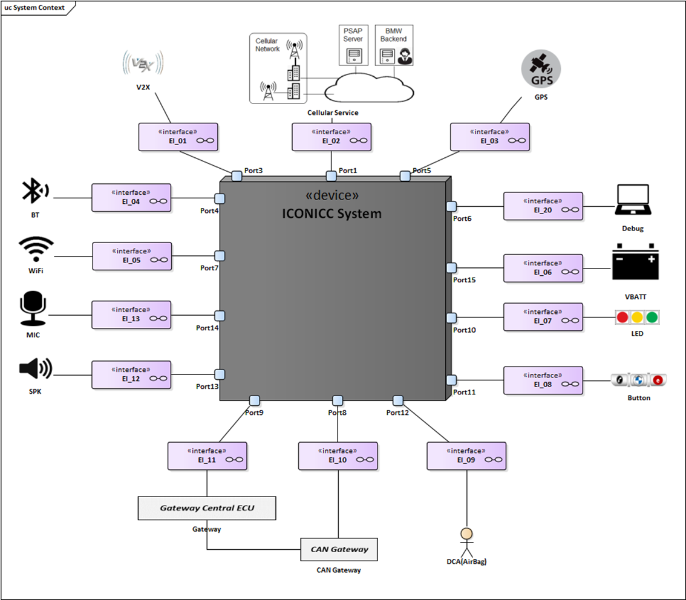
Image reference: doc_image_001.png

Figure 1 Overview about ICON system connection

TimeManager responsibility

TimeManager in BAM side is build based on NEO Framework. It is placed indise System Infrastructure (Node0 based)

TimeManager responsibility is collecting data from different time source as BMW Backend, GNSS, IPB, WUC, Persistent to decide the most realistic time based on accuracy and priority.

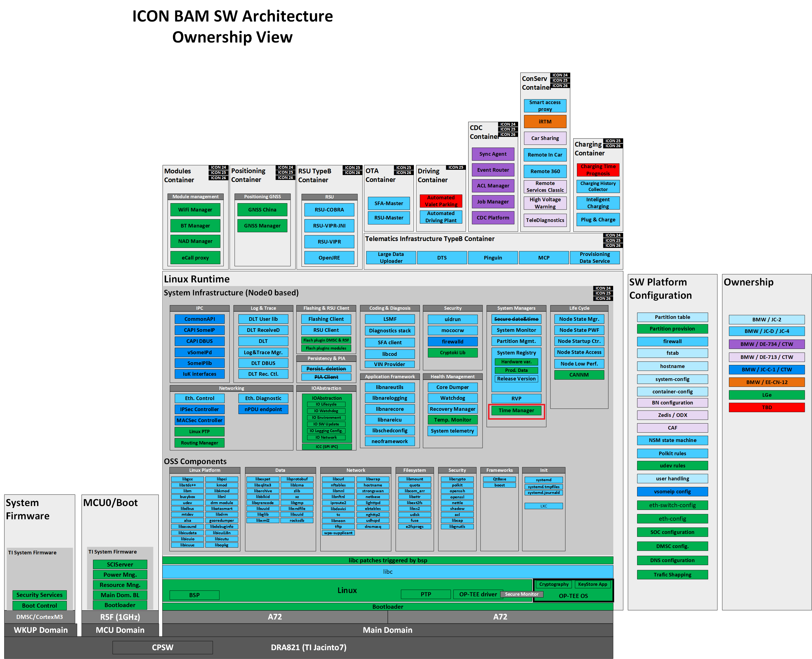
Image reference: doc_image_002.png

Figure 2 TimeManager responsibility

 Project Architectural Driver

Functional Requirement

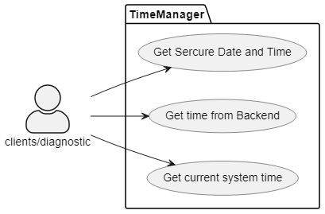
Image reference: doc_image_003.png

Figure 3 Use case diagram

Get Secure Date and Time

Precondition: Network connection is available, Backend, Antenna for GPS data, IPB are all connected successfully.

Action: Clients sends requests to get Sercure Date and Time

Expected: Sercure Date and Time will be returned successfully to the clients. Time trustee information need to be shown also.

Input data: Data from time sources, Backend connection is a must to ensure sercure time.

Output data: Sercure Date and Time returned with success/failure

Get time from Backend

Precondition: Connection to Backend is established successfully

Action: Clients sends request to get Backend Time

Expected: Backend time is sent to client successfully in case Backend is available. Otherwise, failed reason need to be shown

Input data: Data from Backend

Output data: BackendTime returned with success/failure

Get current system time

Precondition: Network connection is available, Backend, Antenna for GPS data, IPB are all connected successfully, but there is no must have time data.

Action: Clients and Diagnostic send request to get current systemtime

Expected: Current systemtim (without information about trustee) will be sent to clients or diagnostic

Input data: Data from time sources

Output data: Current system time returned with success/failure

Quality Attributes

Table 2 Quality attributes

## Table
| Number | QA Scenario | Quality Attribute | Priority (L/M/H) |
| --- | --- | --- | --- |
| 1 | System time will be kept available based on priority of valid time sources. If Backend Time available, system time needs to be secured to Backend Time to ensure certificate key working | Reliability | High |
| 2 | The system shall easy for expand if have new requirement | Extensibility | High |
| 3 | The different between system time and valid chosen time source need to be kept as small as posible | Performance | High |
| 4 | The system shall easy to maintain | Maintainability | Medium |

Constraints

Table 3 Constraints list

## Table
| Number | Description | Constraint Type |
| --- | --- | --- |
| 1 | Using SOME/IP to interactive with other module, API is generated follow template | Technical constraint |
| 2 | Using PTP device driver to get clock sync up information | Technical constraint |
| 3 | Using curl library to acces Backend | Technical constraint |
| 4 | The frequency to access Backend is limited to ensure security | Business Constraint |
| 5 | Using BMW Node0 framework | Business Constraint |

 Overview

Software Architect Design

Image reference: doc_image_004.png

Figure 4 Software Architect

Table 4 Component list

## Table
| Component | Description |
| --- | --- |
| APComm | Service to convert data to SPI format |
| Backend Time | Time source provided by Backend |
| BAM | System Functions (Coding, Flashing, Diagnosis, RSU, etc), V2X, GNSS, Provisioning, SIM Subscription Management, Crowd Data Collector, Real-Time Monitoring,WiFi/Bluetooth |
| Build Time | Linux file system that include Build Time version |
| DMCS | Driver or service to provide DMCS data |
| GNSS Manager | Provide GNSS Data to System Time Manager |
| ICC | Module to transfer data from Service to SPI driver |
| NAD | CPU that provides feature related to Network |
| NAD Manager | Manager to connect to NAD side through SOME/IP. Provide SOME/IP interface for TimeManager to get information through NAD side. |
| Node 0 | Provide System Service include System Time Manager |
| Proxy (Time Proxy) | Connect to SOME/IP to send data to NAD Manager in BAM side |
| SPI | SPI driver to send data to ICC |
| System Time Manager | Receive Time data from several source and process to decide final time to set to system |
| Telephony Manager | Manager to control Network connection and Network data |
| TimeManager | Manager to get Network Time from Telephony and provide to Time Manager in BAM |
| vsomeipd | SOME/IP daemon |
| WUC | Wake up Controller, provide and monitor system feature as Power, RTC |
| WUCTime | Monitor RTC Time to provide to System Time Manager in BAM |

External Interfaces

TimeManager communication with other module in ICONICC system SOME/IP

SOME/IP introduction

This protocol specification specifies the format, message sequences and semantics of the AUTOSAR Protocol "Scalable service-Oriented MiddlewarE over IP (SOME/IP)".

SOME/IP is an automotive/embedded communication protocol, which supports remote procedure calls, event notifications and the underlying serialization/wire format. The only valid abbreviation is SOME/IP. Other abbreviations (e.g. Some/IP) are wrong and shall not be used. [6]

Protocol specification

SOME/IP provides service oriented communication over a network. It is based on service definitions that list the functionality that the service provides. A service can consist of combinations of zero or multiple events, methods and fields.

Events provide data that are sent cyclically or on change from the provider to the subscriber.

Methods provide the possibility to the subscriber to issue remote procedure calls, which are executed on provider side.

Fields are combinations of one or more of the following three:

• The notifier, which sends data on change from the provider to the subscribers

• The getter, which can be called by the subscriber to explicitely query the provider for the value

• The setter, which can be called by the subscriber when it wants to change the value on provider side

The major difference between the notifier of a field and an event is that events are only sent on change, the notifier of a filed additionally sends the data directly after subscription.

External API

Table 5 external function API list

## Table
| Interface Name | Type | Parameters | Functionality |
| --- | --- | --- | --- |
| getSecureDateAndTime | SOME/IP method | In: - nonce: ID number to detect request Out: - trustedTime: UTCTag include UTC Date, UTC Time and Timezone - DmcsPTPTime: current PTP Timestamp - ttsQualifier: time trusty security - ttaQualifier: time trusty accuracy qualifier | - SOME/IP method that other services or ECU can use to get current system time and know status of the time is secured to BackEnd time or not. |
| readBAMUTCTime | SOME/IP method | In: - nonce: ID number to detect request Out: - outLocalTimeValue: current system time that converted to interger value | - SOME/IP method for Diagnostic job to get current system time |
| getBETime | SOME/IP method | In: - nonce: ID number to detect request Out: - beTime: UTCTag include UTC Date, UTC Time - DmcsPTPTime: current PTP Timestamp - betQualifier: available status of BETime | - SOME/IP method to get current Backend Time and available status |

Static View

Design Proposal

TimeManager for ICON is the new module, so the static view could be chosen from the well known design pattern to increase stability.

Proxy Design pattern

Image reference: doc_image_005.png

Image reference: doc_image_006.png

Figure 5 TimeManager components are built by Proxy design partern

Proxy design partern means each time source will have a corresponding proxy to collect time source.

Each proxy will collect time time data and save into cache. So instead of access the time source directly, TimManagerService can just access to the Proxy to get data faster through cache.

Below is the simple code to illustrate how the Proxy interface is provided to get data:

TimeManagerService::getAAAProxyTime() {
    AAATimeProxy::getTime();

}

TimeManagerService::getBBBProxyTime() {
    BBBTimeProxy::getTime();

}

…

Pros:

Because of getting data through cache, TimeManager can save the time to access time source directly.

It helps to increase performance when getting time.

Cons:

Whenever TimeManager trying to get time data, it needs to know exactly proxy that provide corresponding data. So in case more time sources are requested in requirements, more proxies will be created and TimeManagerSevice needs to know new created class for getting time. This action make the code become more complexity and hard to expand.

Facade Design pattern

Image reference: doc_image_007.png
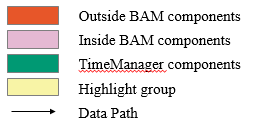
Image reference: doc_image_008.png

Figure 6 TimeManager components are built by Façade design partern

Façade design pattern means there is a common interface is created representing to every type of time source. TimeManager services doesn’t need to know which subsystems provide corresponding data, it just needs to send request to the interface with time type.

By this way, even in case new time source is provided, TimeManagerService just need to know the time type and send request to Façade interface, and can adapt change request very fast.

However this is just the interface, so TimeManager still needs to access the time sources directly through Façade subsystem. Then of course taking more time to get time data every time it request to the time source.

Below is the simple code to illustrate how the Façade interface is provided to get data:

TimeManagerService::getProxyTime(Type AAA) {
    Facade::getTime(Type AAA);

}

TimeManagerService::getProxyTime (Type BBB) {
    Facade ::getTime(Type BBB);

}

…

Pros:

Easy to expand

Simple interface between TimeManager and Facade

Cons:

No caching data mechanism, decrease performance to get source time data

Hybrid design pattern that combines Facade and Proxy

Image reference: doc_image_009.png

Image reference: doc_image_010.png

Figure 7 TimeManager components are built by Hybrid (Proxy and Façade) design pattern

Proxy design pattern and Façade design pattern both have advantages and disadvantages, so to combine them to make a better solution, we can think about Hybrid design pattern which combine Proxy and Façade.

There is one interface is built name EventManager that similar to a Facde interface, but under it are not the simple Façade subsystems. They are the proxies corresponding to the time sources.

By this way, TimeManagerService can still easy expand when request just time type through EventManager, but can still access time sources fast through Proxies.

Below is the simple code to illustrate how the Hybrid interface is provided to get data:

		TimeManagerService::getProxyTime(Type AAA) {
    		Event::getTime(Type AAA);

}

 Event::getTime(Type AAA) {

    		AAATimeProxy::getTime();

    		=> get data from cache

}

 TimeManagerService::getProxyTime (Type BBB) {
    		Event ::getTime(Type BBB);

}

…

Pros:

Because of combination of two design patterns, TimeManagerService can simple request to get data to time sources, and still keep the performance when accessing time source.

Cons:

The implementation will become more complicated because of the combination of two design pattern.

Proposal Comparision Summary

Table 6 Static View Proposal Comparision

## Table
| QA/Constrain | Measure value | Proposal 1: Proxy Design Pattern | Proposal 2: Facade Design Pattern | Proposal 3: Hybrid Design Pattern |
| --- | --- | --- | --- | --- |
| Reliability | Can get data from the source and can add more information to monitor | High | Low | High |
| Reliability | Can get data from the source and can add more information to monitor | (Data can be gotten from Cache fast) | (Take time to access source directly every request) | (Data can be gotten from Cache fast) |
| Extensibility | Easy to expand when new time source available (Optimize the change) | Low | High | High |
| Extensibility | Easy to expand when new time source available (Optimize the change) | (Need to modify more in both logic part and proxy part) | (Need to modify in Façade part mostly) | (Need to modify in Proxy part mostly) |
| Performance | Optimize the different between real sources data and gotten data | High | Low | High |
| Performance | Optimize the different between real sources data and gotten data | (Data is gotten fast then there is no gap) | (Data is gotten slowly and cause gap when request source directly) | (Data is gotten fast then there is no gap) |
| Maintainability | Source code is not complex | Low | High | Low |
| Maintainability | Source code is not complex | (Implement cache make logic more complicated) | (One design pattern is simple interface) | (Implement cache make logic more complicated) |

Design proposal 3 is chosen for Static View and will affect to Dynamic View Design

Dynamic View

Design Proposal

Proposal 1: TimeManager service will request Proxies by period to connect to Timesource and get data directly.

Firstly, there are some basic requirements need to be sastified:

Data from all time sources need to be possible to collect

Based on priority and logic requirement, valid time source will be chosen to set to system time

In case there is no time source available, DTC value will be raised. Otherwise, DTC will be released

This proposal is the first design to adapt basic requirement of TimeManager in BAM side. Based on this design, some problems can be identified, then other proposal can be defined to resolve the problems.

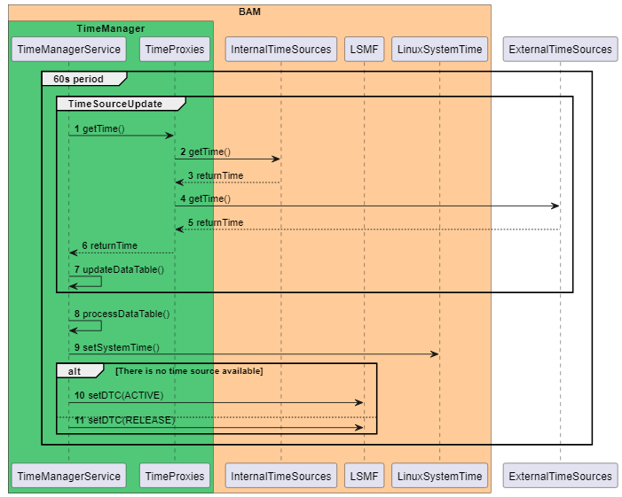
Image reference: doc_image_011.png

Figure 8 TimeManager requests get time by period and sequence

Below is the simple steps for TimeManager can get data from time sources and adapt basic requirement:

TimeManagerService will request TimeProxies each 60s to get data

TimeProxies just provides interface to access time sources

TimeManagerService will request time sources by sequence then update to a data table

After finished the sequence, TimeManager will calculate data in the table by defined logic and priority

Chosen time source will be set to system time to continue counting automatically

Also if within 60s (1 period) there is no time source available, the DTC will be raised through LSMF module

The problems can be identified with this design:

When the time in source is updated, but the period time is not reached, TimeManagerService doesn’t aware of it

TimeSources are gotten by sequence so it will have delay when source process and reduce the accuracy

Request many time to the time source (always one time per minute), BE doesn’t allow to access so frequently

TimeManager always depends on the time sources status

Proposal 2: Proxy will request to time sources by period and notify data to TimeManagerService

This proposal is the second design to change the way to get time. Each time proxies request data to the source by their own period.

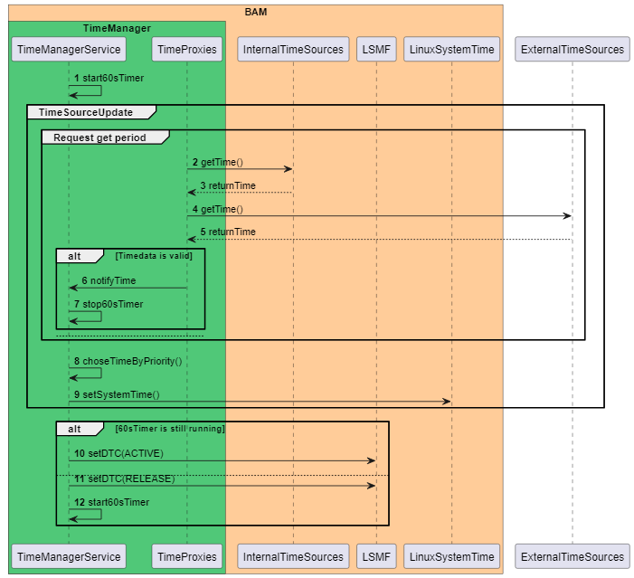
Image reference: doc_image_012.png

Figure 9 Time Proxies use different peridod to request time and notify to TimeManagerService

Below is the step to data notified from Proxy to TimeManagerService:

TimeProxies will request to the internal or external time sources to get data

When data available, TimeProxies notifies data to TimeManagerService

TimeManagerService will compare current system time to notified time based on priority

If notified time is valid, it will be set to LinuxSystemTime to continue counting.

Continue check whether 60s timer is counting, mean still there is no time source notified and DTC will be raised

If not, the DTC will be released.

Pros:

Optimize the frequency to access time sources

Time change will be notified soon to TimeManagerService

Cons:

Time jump will happen more frequently

The logic to choose time source is not good (Compare only notified time and the system time)

Always depend on time sources status

Proposal 3: Proxy will request to time sources by period, but maintain it. TimeManager use maintained time to calculate.

Because the disadvantage of second proposal, the reliability QA cannot be archive. So the proposal 3 is provided as an upgraded version.

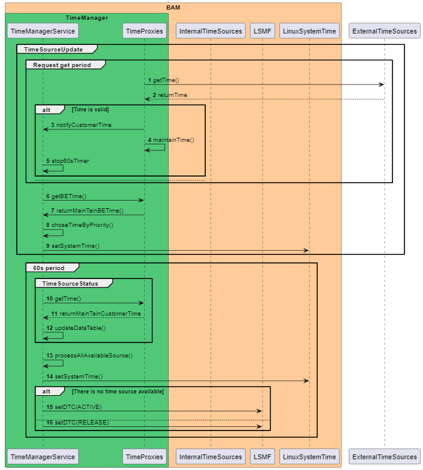
Image reference: doc_image_013.png

Figure 10 Time Proxies use different period to request time, but maintain it for futher requests

Below is the step to data notified from Proxy to TimeManagerService, and maintained:

TimeProxies will request to the internal or external time sources to get data

When data available, TimeProxies notifies data to TimeManagerService

TimeProxies will update the maintained time (continue counting)

TimeManagerService will continue collect data from other TimeProxies to get full data table

Based on priority, valid time source is chosen to set to the system time

Each 60s, TimeManagerService will collect data from all other TimeProxies

TimeProxies now will return their maintained time to TimeManagerService

If there is no time source available, DTC will be raised. Otherwise, DTC will be released.

Pros:

Reduces the frequency to access Backend

Avoid time jump

Ensure time is updated newly based on maintained time even in case time source is not really existed

Cons:

Depend on accuracy of maintained time

Design and implementation are more complicated

Proposal Comparison Summary

The defined QAs and Constrains are used to compare and decide the proposal

Table 7 Dynamic View Proposal Comparision

## Table
| QA/Constrain | Measure value | Proposal 1: get time by period and sequence | Proposal 2: notify time and use each proxy period | Proposal 3: notify time and use each proxy period with maintained time |
| --- | --- | --- | --- | --- |
| Reliability | Latency of updated time notify | Maximum is 60s | Maximum is proxy period (<60s) | Maximum is proxy period (<60s) |
| Reliability | Number of time updated to system time per minute (Time jump) | ~1 time/minute (if time source is updated) | ~3~5 time/minute (if time source is updated) | ~1 time/minute (if time source is updated) |
| Reliability | System time secured with Backend when the source is unstable | No | No | Yes |
| Reliability | Avoid unnecessary DTC raised when time sources are unavailable | No | No | Yes |
| Extensibility | Number of class added for each new time source | 1 | 1 | 1 |
| Performance | Different between system time and valid chosen time source | ~6s in worse case if take long time to get data from proxy | ~100ms | ~100ms |
| Accessing Backend frequency | Number of times to access Backend per minute | Always 1 time/minute | 1 time/minute (BETime is not available) | 1 time/minute (BETime is not available) |

Based on compared information based on QAs and Constrains, Proposal 3 is chosen.

Architecture Design of Chosen Proposal

Class diagram

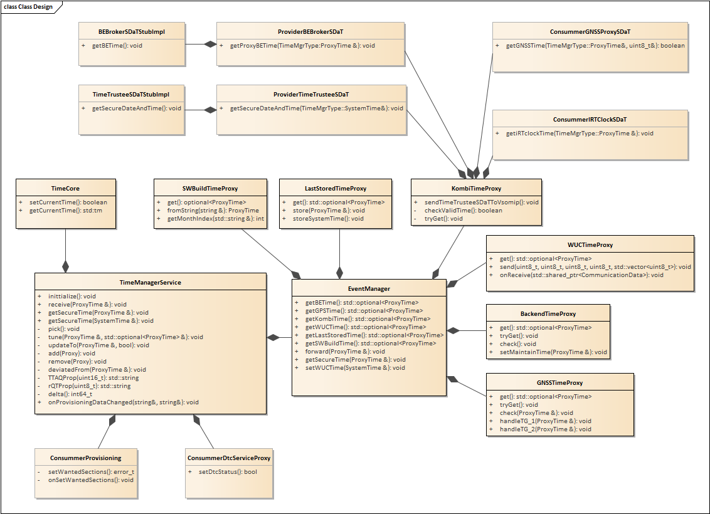
Image reference: doc_image_014.png

Figure 11 Class diagram design

Table 8 Alternative class description

## Table
| Class/File | Description |
| --- | --- |
| TimeManagerService | Main part to process logic of data input |
| EventManager | Forwarder to share the request and information between main service and proxies |
| TimeCore | Provide function to set and get time to linux system time |
| LastStoredTimeProxy | Provide function to store and load LastStoredTime at init time, by period and when TimeManagerService request |
| WUCTimeProxy | Provide function to store and load WUCTime at init time, by period and when TimeManagerService request |
| KombiTimeProxy | Provide function to store and load KombiTime at init time, by period and when TimeManagerService request |
| GNSSTimeProxy | Provide function to store and load GNSSTime at init time, by period and when TimeManagerService request |
| BackendTimeProxy | Provide function to store and load BETime at init time, by period and when TimeManagerService request |
| ConsummerIRTClockSDaT | Provide function to access UTCCustomerProxyTime SOME/IP interface to get insecureRTTime |
| ConsummerGNSSProxySDaT | Provide function to access GNSSProxySDaT to get GNSS Time |
| ProvideTimetrusteeSDaT | Create class to implement provider function for TimeTrusteeSDaT SOME/IP interface. Get information from TimeManagerService to provide to other ECU. |
| ProvideBEBrokerSDaT | Implement provider function for BEBrokerSDaT SOME/IP interface. Get information from TimeManagerService to provide to other ECU. |
| BEBrokerSDaTStubImpl | Provide real function to serve request from Consummer side of BEBrokerSDaT SOME/IP interface. |

Sequence Diagram

GetBEBrokerSDaT

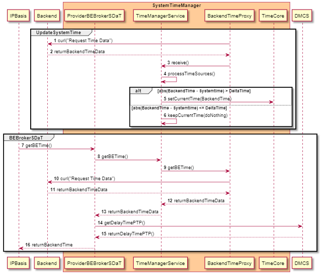
Image reference: doc_image_015.png

Figure 12 Get BETime through BEBrokerSDaT interface

Description:

1. BackendTimeProxy request BE through curl function

2. BE return time data to BackendTimeProxy

3. TimeManagerService receive() data from BackendTimeProxy

4. TimeManagerService processTimeSources()

5. Check if(|BackendTime - Systemtime| > DeltaTime) set BETime to current system time

6. If(|BackendTime - Systemtime| <= DeltaTime) keep current systemtime(do nothing)

7. IPBasis requests getBETime through SOME/IP interface BEBrokerSDaT

8. ProviderBEBrokerSDaT requests getBETime to TimeManagerService

9. TimeManagerService requests BETimeProxy to getBETime

10. BackendTimeProxy requests Backend through curl function to get time

11. BackendTimeProxy returnBackendTimeData to BETimeProxy

12. BETimeProxy returns BETime data to TimeManagerService

13. TimeManagerService return BETime data to ProviderBEBrokerSDaT

14. ProviderBEBrokerSDaTrequests DMCS to get DMCS data

15. DMCS returns Backend Time Data to ProviderBEBrokerSDaT

16. ProviderBEBrokerSDaT returns BETime data to IPBasis

readBAMUTCTime

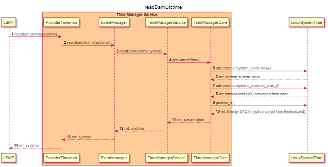
Image reference: doc_image_016.png

Figure 13 Read UTC Time through Diagnostic

Description:

1 : LSMF request readBAMUtcTime() through SOME/IP interface

2: ProviderTimeman is the SOME/IP stub that received the request, it forwards request to EventManager

3: EventManager forwards request to TimeManagerService through readBamUtctime()

4: TimeManagerService forwards request to TimeManagerCore through getCurrentTime()

5-6: TimeManagerCore gets current system clock by C++ standard function (system_clock::now())

7-8: TimeManagerCore uses C++ standard function to convert current system clock to time by second unit (system_clock::to_time_t())

9-10: TimeManagerCore uses linux function to convert time by second unit to time by UTC time structure gmtime_r()

11-14: Time data is returned and sent to LSMF.

provideTimeTrusteeSDaT

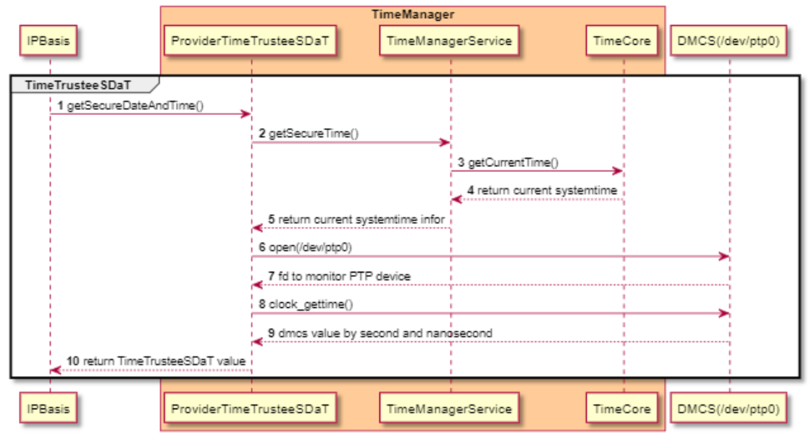
Image reference: doc_image_017.png

Figure 14 Sequence to provide system time through TimeTrusteeSDaT

Description:

1. IPBasis requests to ProviderTimeTrusteeSDaT through getSecureDateAndTime()

2. ProviderTimeTrusteeSDaT requests TimeManagerService to getSercureTime()

3. TimeManagerService requests TimeCore to getCurrentTime()

4. TimeCore returns current systemtime

5. TimeManagerService return current systemtime infor

6. ProviderTimeTrusteeSDaT open(/dev/ptp0)

7. DMCS(/dev/ptp0) return fd to monitor PTP device

8. ProviderTimeTrusteeSDaT requests DMCS(/dev/ptp0) through clock_gettime()

9. DMCS returns dmcs value by second and nanosecond

10. ProviderTimeTrusteeSDaT replies to IPBais the TimeTrusteeSDaT information

Algorithm

processTimeSources

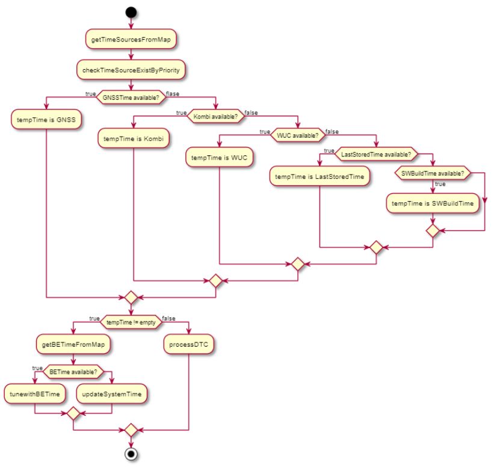
Image reference: doc_image_018.png

Figure 15 Logic inside processTimeSources function to choose valid time

beTimeProxyCheck

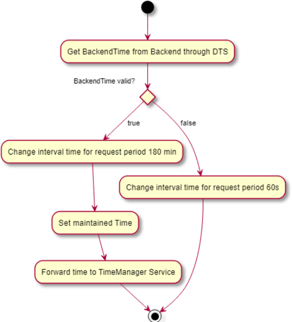
Image reference: doc_image_019.png

Figure 16 Logic to get, maintain and forward time of BETime Proxy

gnssTimeProxyCheck

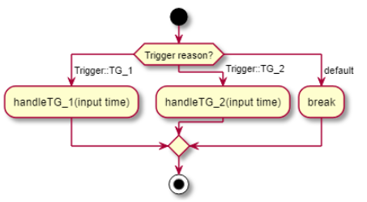
Image reference: doc_image_020.png

Figure 17 Process trigger request based on the reason

gnssGetTime

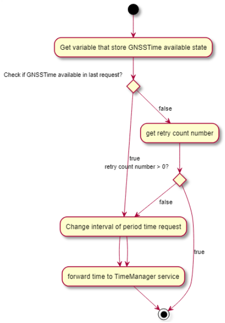
Image reference: doc_image_021.png

Figure 18 Logic to get GNSSTime and retry logic

Validate GNSSTime

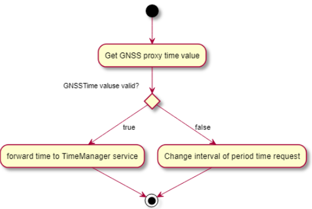
Image reference: doc_image_022.png

Figure 19 Valid received GNSS Time to check it valid or not
