# Raw Slide Content

- Source file: FA_binh2.pham/TimeManager_for_BAM_ECU_in_BMW_ICON_v1.7.pptx
- Total slides: 24

## Slide 1

FA Certificate
TimeManager for BAM in BMW ICON

Image reference: slide_01_image_01.png

By Pham Vu Binh
LGEDV - Connectivity Framework Team
Supervisor: Mr. Sang Hyup Lee

## Slide 2

Contents

Overview
Architecture drivers
Static view
Design proposal
Architecture Decision
Dynamic view
Design proposal
Architecture Decision
Detailed Design decision
Q&A

## Slide 3

Overview

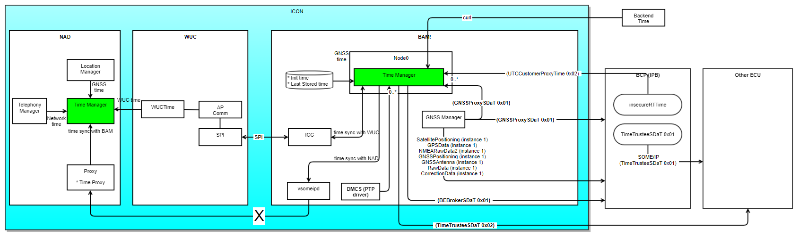
Image reference: slide_03_image_01.png

Software Architecture Design

TimeManager (BAM):
Collect data from time sources then calculate to decide valid time by requirement and priority
Monitor system time and provide time data to other services, and ECUs (IPB)
Time Sources:
Backend: provide BackendTime, use curl lib to access (curl: link)
GNSSManager: provide GNSSTime, use SOME/IP to access
IPB: provide CustomerTime, use SOME/IP to access
WUC: provide WUCTime, use ICC lib to access (ICC: link)

## Slide 4

Architecture Driver

Functional Requirement

Image reference: slide_04_image_01.png

## Slide 5

Architecture Driver

Quality Attributes

### Table
| Number | QA Scenario | Quality Attribute | Priority |
| 1 | System time will be kept available based on priority of valid time sources If Backend Time available, system time needs to be secured with Backend Time (to ensure certificate key working) Diagnostic Trouble Code (DTC) will be raised when there is no time source available within one minute | Reliability | High |
| 2 | The difference between system time and valid chosen time source need to be kept as small as possible (our target: 100ms) | Performance | High |
| 3 | Time manager will be easy to expand if there is any new requirement | Extensibility | Medium |
| 4 | The structure and logic inside service need to be simple to understand and modify | Maintainability | Medium |

## Slide 6

Architecture Driver

Constraints

### Table
| Number | Description | Constrain Type |
| 1 | Using SOME/IP to interactive with other modules, APIs are generated to follow template | Technical constraint |
| 2 | Using PTP device driver to get clock sync up information | Technical constraint |
| 3 | Using curl library to access Backend | Technical constraint |
| 4 | Accessing Backend frequency is limited due to security assurance | Business Constraint |
| 5 | Using BMW Node0 framework | Business Constraint |

## Slide 7

Static View

Proposal 1: Proxy Design pattern

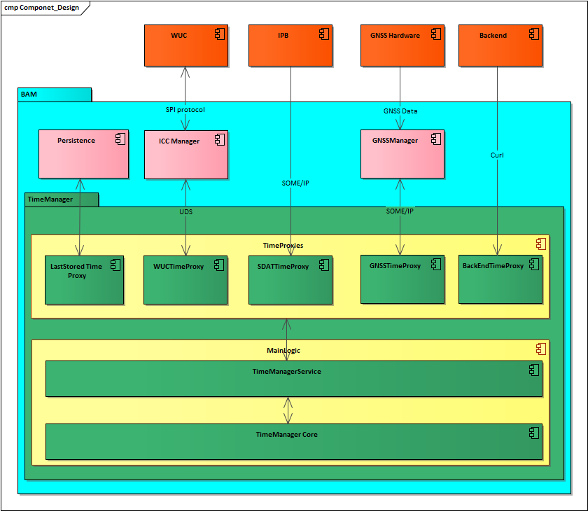
Image reference: slide_07_image_01.png

Outside BAM components

Inside BAM components

TimeManager components

Highlight group

Data Path

Pros:
Increase performance: caching data to reduce access resources time
Cons:
Complexity and need to update logic when having new time source

TimeManagerService::getAAAProxyTime() {
    AAATimeProxy::getTime();
}
AAATimeProxy::getTime() {
   => get data from Cache
}
TimeManagerService::getBBBProxyTime() {
    BBBTimeProxy::getTime();
}
…

Proxies represent for time sources

## Slide 8

Proposal 2: Facade Design pattern

Outside BAM components

Inside BAM components

TimeManager components

Highlight group

Data Path

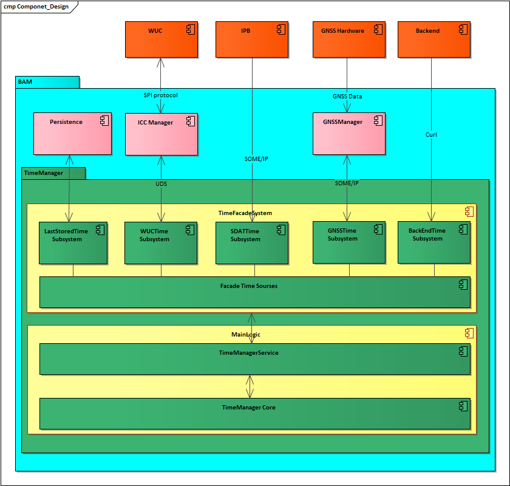
Image reference: slide_08_image_01.png

TimeManagerService::getProxyTime(Type AAA) {
    Facade::getTime(Type AAA);
}
TimeManagerService::getProxyTime (Type BBB) {
    Facade ::getTime(Type BBB);
}
…

Pros:
Easy to expand
Simple interface between TimeManager and Facade
Cons:
Spend more time to get data from source
Increase frequency to access source

Simple subsystem

Façade interface

Static View

## Slide 9

Proposal 3: Hybrid design pattern that combines Facade and Proxy

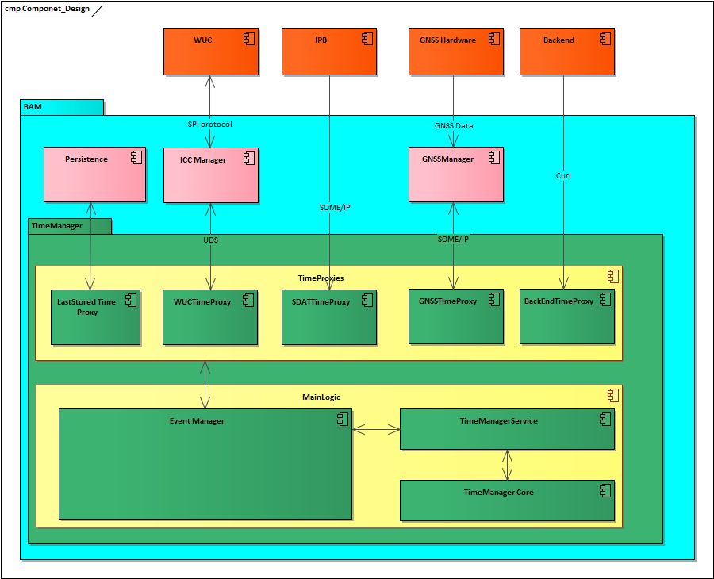
Image reference: slide_09_image_01.png

Outside BAM components

Inside BAM components

TimeManager components

Highlight group

Data Path

TimeManagerService::getProxyTime(Type AAA) {
    Event::getTime(Type AAA);
}
Event::getTime(Type AAA) {
    AAATimeProxy::getTime();
    => get data from cache (maintained time)
}
TimeManagerService::getProxyTime (Type BBB) {
    Event::getTime(Type BBB);
}
…

Pros:
Easy to expand and still keep performance
Cons:
Increase complexity

Façade interface

Proxies represent for time sources

Static View

## Slide 10

Static View: Architecture decisions

### Table
| QA/Constrain | Measure value | Proposal 1: Proxy Design Pattern | Proposal 2: Facade Design Pattern | Proposal 3: Hybrid Design Pattern |
| Reliability | Can get data from the source fast and can add more information to monitor | High (Data can be gotten from Cache <10ms) | Low (~5s in case BETime request) | High (Data can be gotten from Cache <100ms) |
| Performance | Optimize the different between real sources data and gotten data | High (Diff time < 100ms) | Low (Diff time around second unit because always take time to access source => Delay when calculating all source) | High (Diff time < 100ms) |
| Extensibility | Easy to expand when new time source available (Optimize the change) | Low (Need to modify more in both logic part and proxy part) | High (Need to modify in Façade part mostly) | High (Need to modify in Proxy part mostly) |
| Maintainability | Source code is not complex | Low (Complexity when process logic to caching data) | High (One design pattern is simple interface) | Low (Complexity when process logic to caching data) |
| Accessing Backend frequency | Number of times to access Backend per minute | Low Always 1 time/minute | High 1 time/minute (BETime is not available) 1 time/180minutes (BETime is available) | High 1 time/minute (BETime is not available) 1 time/180minutes (BETime is available) |

Design proposal 3 is chosen for Static View and will affect to Dynamic View Design

High or Low is level of adaptation

## Slide 11

Dynamic View

Proposal 1: TimeManagerService request sequentially to Proxies each period
Pros:
Easy to adapt logic about priority
Easy to get current status of time sources
Easy to implement and expand
Cons:
Doesn’t aware of time sources are updated
Reduce the accuracy
Request many time to the time sources
Always depend on time sources status

Image reference: slide_11_image_01.png

TimeProxies requests to time sources once requested by TimeManager

Data is returned and updated to table

All collected time source is calculated based on priority

## Slide 12

Dynamic View

Proposal 2: Proxies will request to time sources by their own period and notify data to TimeManagerService.
Pros:
Optimize the frequency to access time sources
Time change will be notified soon to TimeManagerService
Cons:
Time jump will happen more frequently
The logic to choose time source is not good (Compare only notified time and the system time)
Always depend on time sources status

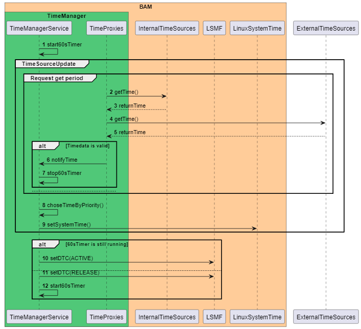
Image reference: slide_12_image_01.png

TimeProxies requests to time sources by their own period

Time  data is notified when it is valid

Compare received time with current system time and choose by priority

## Slide 13

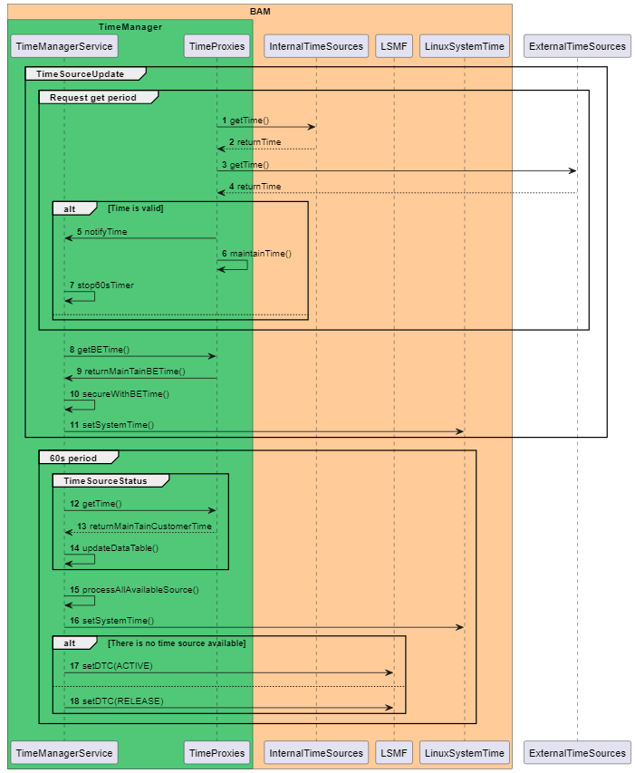
Image reference: slide_13_image_01.png

Dynamic View

Proposal 3: Proxies will request to time sources by period, but maintain it. Time sources are easier to monitor.
Pros:
Reduces the frequency to access Backend
Avoid time jump
Ensure time is updated newly based on maintained time even in case time source is not really existed
Cons:
Depend on accuracy of maintained time
Design and implementation are more complicated

TimeProxies requests to time sources by their own period then notify valid time

Notice point: the time now maintained so each proxies can represent for time source

BETime now can be gotten every time needed. Then secured time will be ensured.

## Slide 14

Dynamic View: Architecture decisions

### Table
| QA/Constrain | Measure value | Proposal 1: Get time by period and sequence | Proposal 2: Notify time and use each proxy period | Proposal 3: Notify time and use each proxy period with maintained time |
| Reliability | Latency of updated time notify | Low Maximum is 60s | High Maximum is proxy period (<60s) | High Maximum is proxy period (<60s) |
|  | Number of time updated to system time per minute (Time jump) | High ~1 time/minute (if time source is updated) | Low ~3-5 time/minute (if time source is updated) | High ~1 time/minute (if time source is updated) |
|  | System time secured with Backend when the source is unstable | Low Data will return 0 during unstable time | Low Data will return 0 during unstable time | High Maintained time will be returned |
|  | Avoid unnecessary DTC raised when time sources are unavailable | Low DTC will always be raised | Low DTC will always be raised | High DTC will not be raised if maintained time is valid |
| Extensibility | Number of class added for each new time source | High Structure pattern resolved | High Structure pattern resolved | High Structure pattern resolved |
| Performance | Different between system time and valid chosen time source | Low ~6s in worse case if take long time to get data from proxy | High ~100ms | High ~100ms |
| Maintainability | Source code is not complex | High Simple implementation | High Simple implementation | Low Complicated logic |
| Accessing Backend frequency | Number of times to access Backend per minute | Low Always 1 time/minute | High 1 time/minute (BETime is not available) 1 time/180minutes (BETime is available) | High 1 time/minute (BETime is not available) 1 time/180minutes (BETime is available) |

Proposal 3 is chosen because it have more pros and satisfied all Constrain and important QAs.

## Slide 15

Detailed Design decision

TimeProxies can get data through SOME/IP methods
There are 2 types of method: Synchronous and Asynchronous
Combine to using PTP (Precision Time Protocol) time, we have 2 proposals

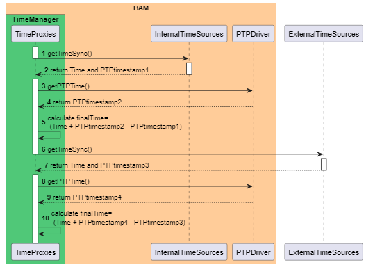
Image reference: slide_15_image_01.png

Proposal 1: Get time by Sync SOME/IP method with PTP
=> Has blocking time to wait response

Calculate time using PTP:
Final Time=Received Time + Transmission Time (delay)
Transmission Time = Current PTPTimestamp – Send PTPTimeStamp

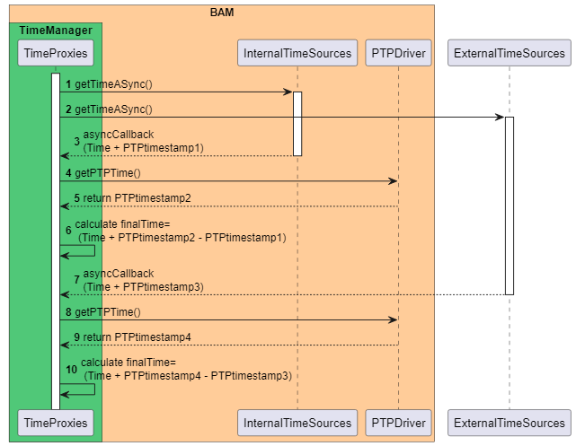
Image reference: slide_15_image_02.png

Proposal 4: Get time by Async SOME/IP method with PTP
=> No blocking time

Calculate time after
sync function return

Calculate time after
sync function return

Calculate time when
async callback

Calculate time when
async callback

## Slide 16

Detailed Design decision

### Table
| QA/Constrain | Measure value | Proposal 1: Sync SOME/IP with PTP | Proposal 2: Async SOME/IP with PTP |
| Reliability | Latency of updated time notify | Low Time Source updated event is not caught | High Time Source updated event is caught by notifying |
| Performance | Different between system time and valid chosen time source | High Delay is calculated by PTP, < 100ms | Very High Only delay when notify, < 100ms AND delay is calculated by PTP => Delay <10ms |
| Extensibility | Number of class added for each new time source | High Structure pattern resolved | High (Structure pattern resolved) |
| Maintainability | Source code is not complex | High Complex when combine with PTP but step is straightforward | Low SOMEIP callback + PTP make the code difficult to understand |

Proposal 2 is chosen because Very High performance, make other decision about using proxy is more reliable

## Slide 17

Q&A

Thank You

## Slide 18

Reference

http://collab.lge.com/main/display/ICONICC/4.3.5+Time
http://vscb.lge.com:8080/cb/tracker/68847102?view_id=-2&layout_name=document&subtreeRoot=20730458

## Slide 19

Problems Found Expaination

Problems found from first design:
TimeManagerService doesn’t aware when time source is updated
TimeSources are taken sequentially so it will cause delay and reduce the accuracy
TimeManager requests to the data sources many times (Backend doesn’t allow to access so frequently)
TimeManager always depends on the time sources status => Reduce Reliability of system when time sources are unstable

## Slide 20

Apendix

Proposal 1

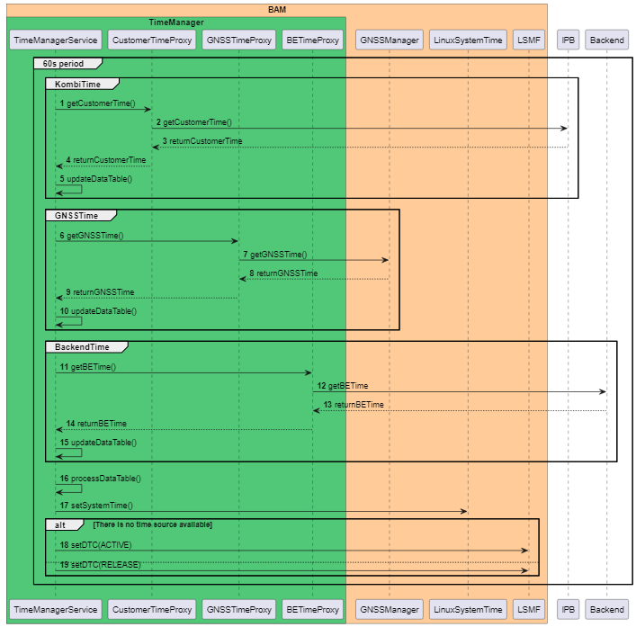
Image reference: slide_20_image_01.png

## Slide 21

Detailed design

Proposal 2

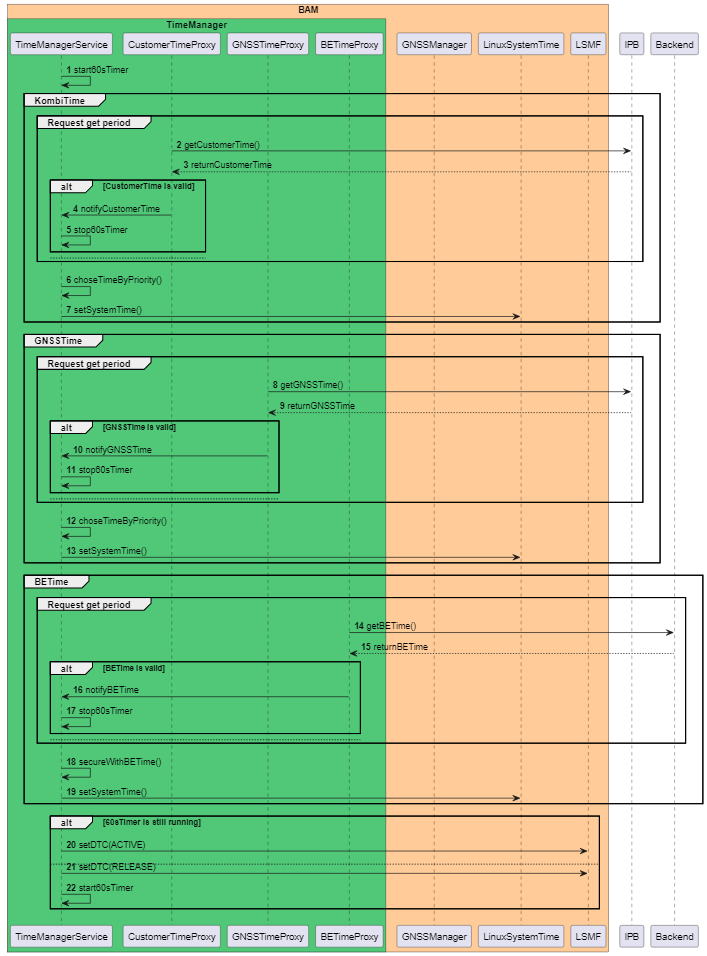
Image reference: slide_21_image_01.png

## Slide 22

Detailed design

Proposal 3

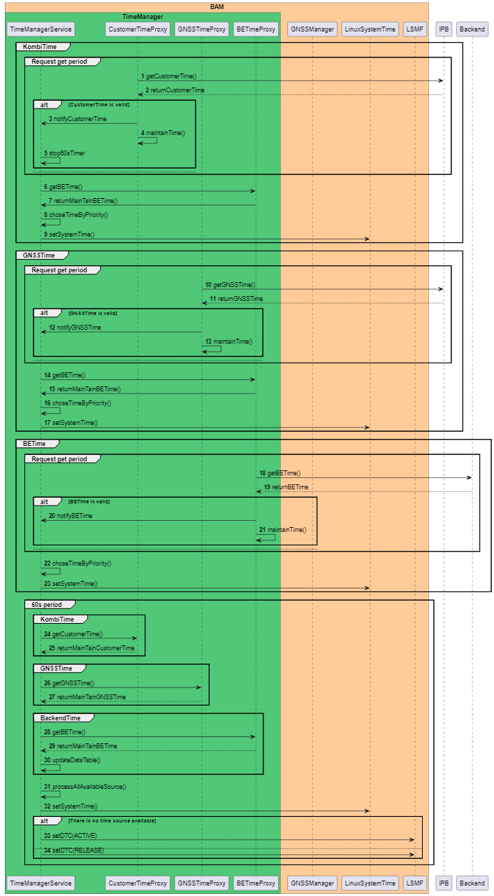
Image reference: slide_22_image_01.png

## Slide 23

OEM Requirement

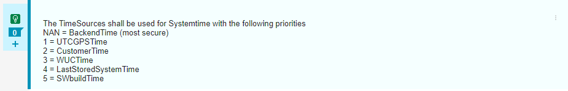
Image reference: slide_23_image_01.png

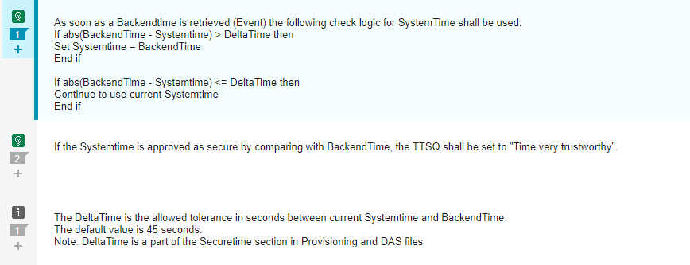
Image reference: slide_23_image_02.png

## Slide 24

OEM Requirement

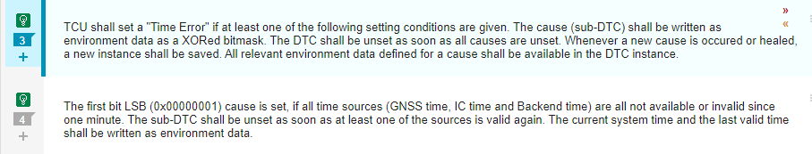
Image reference: slide_24_image_01.png

