# Raw Document Content

- Source file: FA_cong.dang/FA_cong.dang/FA_Project_Improve Design of Projection Player in Video projection project_final.docx

['25 FA] Improve Design of Projection Player in Video projection project

About This Document

Document Information

## Table
| Document Title | SW Design |
| --- | --- |
| Project | Cockpit 2022+ |
| Author | Dang Thanh Cong (cong.dang@lge.com) |
| Status of Document | In progress |

Revision History

## Table
| Version | Date | Content of Change | Author | Reviewer |
| --- | --- | --- | --- | --- |
| 01 | 2025.08.21 | Initial Release | Cong.dang | Sangkyu.hwangbo |
| 02 | 2025.09.17 | - Update 2.1 reason for quality attribute - Update 3.1.2 comparison for Improve 1 - Update 3.2.2 comparison for Improve 2 - Update 4.2 Verification | Cong.dang | Sangkyu.hwangbo |
| 03 | 2025.09.25 | Update content 4.2 Verification as mentor suggestion | Cong.dang | Sangkyu.hwangbo |

List of images

Figure 1: Architecture of ICAS3CHN Main Unit SW	5

Figure 2: Video projection architecture in IVI partition	6

Figure 3: Class diagram of ProjectionPlayer	14

Figure 4: Activity diagram handling message in ProjectionPlayer	16

Figure 5: Activity diagram handling message when adding a state in ProjectionPlayer	17

Figure 6: Sequence diagram when using Cinemo’s API in ProjectionPlayer	18

Figure 7: Class diagram when applying State pattern	19

Figure 8: Activity diagram when handling message for State pattern	20

Figure 9: Class diagram when applying State event mapping and Command pattern	21

Figure 10: Activity diagram when applying State event mapping and Command pattern	22

Figure 11: Class diagram when applying Façade pattern	25

Figure 12: Sequence diagram when applying Façade pattern	26

Figure 13: Class diagram when applying Strategy pattern	27

Figure 14: Sequence diagram when applying Strategy pattern	28

Figure 15: Class diagram for new design ProjectionPlayer after applying State and Strategy pattern	30

Figure 16: Overall design state of Projection player	31

Figure 17: Design state of Prepare to play	32

Figure 18: Design state of Projection video	32

Figure 19: Design state of End of Projection	33

Figure 20: Activity diagram for handling message	35

Figure 21: Sequence diagram for using Cinemo’s API in ProjectionPlayer	36

Figure 22: New design when system add a new library and new state	39

List of tables

Table 1: Components in ICAS3CHN Main Unit SW	6

Table 2: Description for components in Video projection	7

Table 3: Quality attribute	8

Table 4: Description about classes for applying State pattern	20

Table 5: Description about classes for applying State event mapping and Command pattern	22

Table 6: Comparision of 2 proposals for Improve 1	23

Table 7: Description about classes for applying Facade pattern	25

Table 8: Description about classes for applying Strategy pattern	27

Table 9: Comparison of two proposals for Improve 2	29

Table 10: Description about classes for new design	30

Table 11: Description of each state	33

Table 12: State transition of Projection Player state	34

Table 13: Comparison about line of code	38

Table 14: Comparison about cyclomatic complexity	38

Table 15: Comparison between current and new system scalability.	40

Introduction

Purpose

This document specifies the software detailed design for the Player component in the Video Projection module of the Cockpit project, including static design, dynamic design, and algorithm design.

This document identifies the most effective way to design the Player component and describes how to implement it to meet the project requirements.

Audience

The readers of this article are as follows:

Software Architect

Customer

Developer

Project Leader

Project Manager

Test Engineer

Abbreviations / Terms

## Table
| Abbreviation | Description |
| --- | --- |
| ICAS | In Car Application Server |
| IVI Partition | Virtual machine for In Vehicle Infotainment |
| SAFE Partition | Virtual machine for Cluster |
| HMI | Human Machine Interface |
| KIPC | Kernel Inter process communication |
| RSI | Restful Service Interface |
| TA | Traffic Announcement |
| TTS | Text To Speech |
| HU | Head Unit |
| API | Application Programming Interface |

1. Project Context

1.1 Overview

The VW Cockpit project is a strategic initiative by Volkswagen (VW) aimed at integrating advanced digital technologies into the cockpit (interior) of their vehicles. This project is part of Volkswagen's broader push towards digital transformation and enhancing the user experience through innovative in-car technologies.
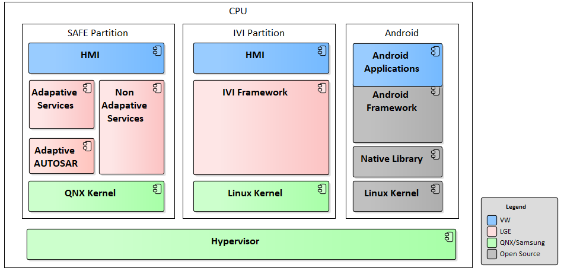
Image reference: doc_image_001.png

Figure 1: Architecture of ICAS3CHN Main Unit SW

The diagram illustrates the architecture of ICAS3CHN Main Unit SW. There are three main SW partitions: SAFE Partition, IVI Partition and Android and they run on the hypervisor VM. And Video projection service is a component in IVI Framework.

## Table
| VM | Component | Description |
| --- | --- | --- |
| SAFE Partition | HMI (SAFE) | - Safe partition HMI which is provided by VW. |
| SAFE Partition | Adaptive Services | - Adaptive AUTOSAR Runtime Environment for Adaptive Application. |
| SAFE Partition | Non-Adaptive Services | - Non-Adaptive AUTOSAR application. |
| SAFE Partition | Adaptive AUTOSAR Platform | - Adaptive AUTOSAR framework. - LARA (LG AUTOSAR Adaptive) is used in Cockpit2022+. |
| SAFE Partition | QNX Kernel | - QNX kernel stack. - It is support Hypervisor VM. |
| IVI Partition | HMI (IVI) | - IVI partition HMI which is provided by VW. |
| IVI Partition | IVI Framework | - Framework Services for IVI partition. - e.g., Media, Navigation etc. |
| IVI Partition | Linux Kernel | - IVI partition framework services run on the Linux kernel. |
| Android Partition | Application | - This partition is for running android apps which provided by VW. |

Table 1: Components in ICAS3CHN Main Unit SW

1.2 Video projection overview

Video projection is an application that allows users to play online videos on the HU (Head Unit). After connecting their phone to the HU's Wi-Fi and playing a video from one of the top 10 apps in China, users can show that video onto the HU. Instead of watching on the small phone screen, users can enjoy the video on the HU's larger display. At the same time, actions performed on either the phone or the HU are synchronized and convenient user experience.

This document will focus on Projection video service, which is being ran on IVI partition.

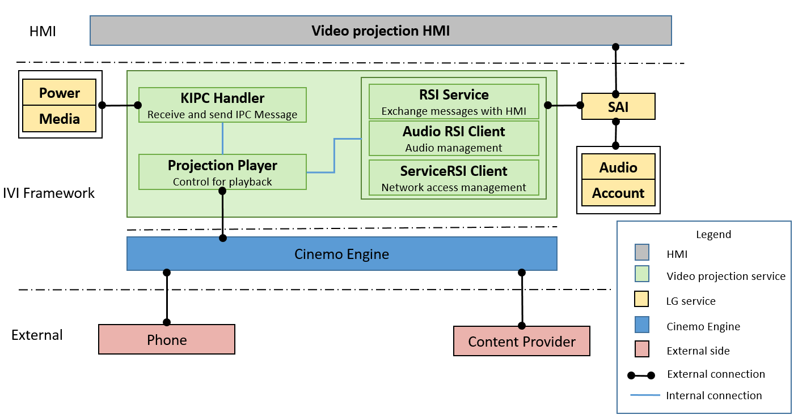
Image reference: doc_image_002.png

Figure 2: Video projection architecture in IVI partition

Projection service has five main components:

## Table
| Component | Description |
| --- | --- |
| KIPC Handler | Receives KIPC message from Power service, Media service. |
| RSI Service | Sends/receives all messages related to HMI as Connection, Player, Playback, Action, Error, Metadata, … |
| Audio | Sends/receives all messages related to Audio service. |
| ServiceRSI Client | Manages the network access. |
| Projection Player | Manages playback and exchanges the messages with Cinemo side. |

Table 2: Description for components in Video projection

1.3 Background

In Video projection project, a large number of messages are sent to the Player from various sources, requiring accurate state management to ensure correct and timely processing. Currently, state management is handled through independent variables, which may lead to potential issues in consistency and maintainability. Additionally, direct interaction between the Player and third-party APIs is not encouraged due to increased coupling and potential risks. The proposed idea is to introduce structured state management using design patterns and to decouple third-party interactions through well-defined interfaces. This approach helps minimize risks, improves extensibility, and makes the system easier to maintain in the long term.

2. Problem defined

2.1 Nonfunctional requirement

## Table
| Quality Attribute | Priority | Description |
| --- | --- | --- |
| Reliability | High | The system has to operate correctly based on the actions performed by the end user. |
| Maintainability | High | The system should be easy to read and understand, ability of the system to support changes. |
| Scalability | Medium | The system should be ability to extend without impacting to other parts of the program. |

Table 3: Quality attribute

- Reliability is crucial because the system needs to consistently respond to user actions without errors, ensuring stable and trustworthy operation.

- Besides that, high Maintainability allows the logic to be easily updated, refactored, and extended, which is important for ongoing bug fixes and feature improvements. This focus helps the system adapt smoothly to new requirements and changes over time.

- Scalability should still be supported so the architecture can handle future growth or increased demand. By balancing these attributes, the system remains robust and flexible, ready for both current needs and future expansion.

That is why I chose Reliability and Maintainability as high priorities, with Scalability at a medium level.

2.2 Functional requirement

- The service shall establish a projection connection with the new device:

## Table
| Description | Given | System is started, WiFi is available (User account type of the system is Primary or Secondary), display is on and the source device (mobile phone) is connected to the system through WiFi. |
| --- | --- | --- |
| Description | When | The system receives the projection start request from new source device. |
| Description | Then | The system shall show the prompt on display to ask confirmation for 27 seconds. |
| Input |  | Accept new projection request message through display touch. |
| Output |  | The video data which is shown on display. |

- The service ignores the projection request from the source device when the system is in call or TA:

## Table
| Description | Given | The system is started, WiFi is available (User account type of the system is Primary or Secondary), display is on and the source device (mobile phone) is connected to the system through WiFi. The projection is not started. The system is in call or TA. |
| --- | --- | --- |
| Description | When | The system receives the start projection request from the source device. |
| Description | Then | Nothing happens. The system ignores the request. |
| Input |  | Start projection message from the source device. |
| Output |  | None. |

- The service receives start projection request and shows the prompt:

## Table
| Description | Given | The system is started, WiFi is available (User account type of the system is Primary or Secondary), display is on and the source device (mobile phone) is connected to the system through WiFi. |
| --- | --- | --- |
| Description | When | The system receives the projection start request from the source device. |
| Description | Then | The system shall show the prompt on display to ask confirmation for 27 seconds. |
| Input |  | Start projection message from the source device. |
| Output |  | The prompt on the display. |

- The service stops projection by the request from the source device or displays touch:

## Table
| Description | Given | The system is started, WiFi is available (User account type of the system is Primary or Secondary), display is on and the source device is connected to the system through WiFi. The system is projecting video by the request from the source device (mobile phone). |
| --- | --- | --- |
| Description | When | The system receives the stop projection request from the source device or the stop projection request message (message that the entertainment source change from projection to the others such as Radio, Media, etc.) through display touch. |
| Description | Then | The system shall stop the projection. |
| Input |  | Stop projection request from the source device. |
| Output |  | Nothing - the video data would be unavailable (not displayed on display element). |

 - The service supports play from source device (mobile phone) or displays element (ABT)

## Table
| Description | Given | The system is started, WiFi is available, display is on and the source device (mobile phone) is connected to the system through WiFi. The system receives the start projection request and prompt is shown on display element (ABT). User presses "accept" in prompt on display element (ABT), a connection will be established between source device (mobile phone) and the display element (ABT). The user presses BTN_Pause in detail screen of source device (mobile phone), video stream will be paused state. |
| --- | --- | --- |
| Description | When | The system receives the play request message through user's action from source device (mobile phone) or display element (ABT). |
| Description | Then | The system shall play video stream. |
| Input |  | Press BTN_play on source device (mobile phone) or display element (ABT). |
| Output |  | Video stream is played on display element (ABT). |

- The service supports pause from source device (mobile phone) or displays element (ABT)

## Table
| Description | Given | The system is started, WiFi is available, display is on and the source device (mobile phone) is connected to the system through WiFi. The system receives the start projection request and prompt is shown on display element (ABT). User presses "accept" in prompt on display element (ABT), a connection will be established between source device (mobile phone) and the display element (ABT). The user presses BTN_Play in detail screen of source device (mobile phone), video stream will be playing state. |
| --- | --- | --- |
| Description | When | The system receives the pause request message through user's action from source device (mobile phone) or the pause request message through display touch. |
| Description | Then | The system shall pause video stream. |
| Input |  | Press BTN_Pause on source device (mobile phone) or display element (ABT). |
| Output |  | Video stream is paused on display element (ABT). |

- The service supports fast forward/rewind:

## Table
| Description | Given | The system is started, WiFi is available, display is on and the source device (mobile phone) is connected to the system through WiFi. In application on the source device (mobile phone) MUST show BTN_FFW. (Support fast forward feature). The system receives the start projection request and prompt is shown on display element (ABT). User presses "accept" in prompt on display element (ABT), a connection will be established between source device (mobile phone) and the display element (ABT). |
| --- | --- | --- |
| Description | When | The system receives the fast forward/fast rewind request message through user's action from source device (mobile phone) or the fast forward request message through display touch. |
| Description | Then | The system shall perform fast forward/fast rewind current video stream. |
| Input |  | Long press BTN_Next / BTN_Previous on the display element (ABT) or on mobile phone. |
| Output |  | Performing fast forward current video on display element (ABT). |

- The service supports seek to time

## Table
| Description | Given | The system is started, WiFi is available, display is on and the source device (mobile phone) is connected to the system through WiFi. The system receives the start projection request and prompt is shown on display element (ABT). User presses "accept" in prompt on display element (ABT), a connection will be established between source device (mobile phone) and the display element. |
| --- | --- | --- |
| Description | When | The system receives the seek request message through user's action from source device (mobile phone) or the seek request message through display touch. |
| Description | Then | The system shall seek to set position of current video stream. |
| Input |  | Drag the time bar to any position in detail screen of source device (mobile phone) or any position in detail screen of the display element (ABT). |
| Output |  | Seek to set position of current video stream on display element (ABT). |

- The service supports multiple speed (*0.5/*0.75/*1.0/*1.25/*1.5/*2.0)

## Table
| Description | Given | The system is started, WiFi is available, display is on and the source device (mobile phone) is connected to the system through WiFi. The system receives the start projection request and prompt is shown on display element (ABT). User presses "accept" in prompt on display element (ABT), a connection will be established between source device (mobile phone) and the display element. |
| --- | --- | --- |
| Description | When | The system receives the changing play speed (*0.5/*0.75/*1.0/*1.25/*1.5/*2.0) message through display touch. |
| Description | Then | The system shall play current video with set play speed (*0.5/*0.75/*1.0/*1.25/*1.5/*2.0). |
| Input |  | Select desired play speed (*0.5/*0.75/*1.0/*1.25/*1.5/*2.0) on display element (ABT). |
| Output |  | Play current video with set play speed (*0.5/*0.75/*1.0/*1.25/*1.5/*2.0) on display element (ABT). |

- The system should pause current streaming when interrupted by other procedure (higher priority than video projection service and resume when interrupt is over.

## Table
| Description | Given | The system is started, WiFi is available, display is on and the source device (mobile phone) is connected to the system through WiFi. The system allowed to start video projection (start playback video stream). |
| --- | --- | --- |
| Description | When | The system interrupted by other procedure (TA, E-Call, Phone Call, etc) which have higher priority than video projection service and then interrupt over. |
| Description | Then | The system should pause current video playback when interrupted by other procedure, and then continue to playback from where it paused when interrupt is over. |
| Input |  | An interrupt is occurred and then terminated. |
| Output |  | The video data continue to show on display after terminate interrupt. |

- The service displays error prompt on display

## Table
| Description | Given | The system is started, WiFi is available, display is on, and the source device (mobile phone) is connected to the system through WiFi. The system allowed to start video projection. |
| --- | --- | --- |
| Description | When | The system receives an error message from the video projection player or content provider (Application from mobile phone). |
| Description | Then | The system shall display error prompt on display. |
| Input |  | Accept error message. |
| Output |  | The error prompt is shown on display. |

2.3 Problem Identification

The ProjectionPlayer class is the central component in the media playback system of the projection application, responsible for managing the entire video playback process—from initialization, control, event handling, to updating status for related modules. It acts as a controller for the media playback process, ensuring smooth coordination between Cinemo library, the user interface, and system services. This class performs media control operations such as starting playback, pausing, resuming, fast forward/rewind, stopping, changing playback speed, seeking, and handling events related to playback.

This is class diagram of ProjectionPlayer class:

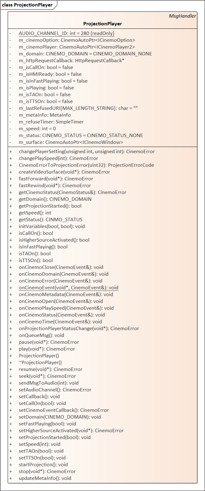
Image reference: doc_image_003.png

Figure 3: Class diagram of ProjectionPlayer

Below is a detailed analysis of the functions and responsibilities of this class:

Initialization and Configuration of Media Player: Upon initialization, ProjectionPlayer configures all necessary parameters for the media player, sets up video/audio settings, and establishes callbacks to receive events from the Cinemo library. This ensures the media player operates according to system requirements.

Managing Media Playback Flow: Providing methods to control the media playback process, such as Play with speed, Pause, Resume, Fast Forward, Fast Rewind, seek …These operations are performed by sending commands to the Cinemo library.

Message Handling: Receiving and processing messages from HMI, audio, Cinemo, etc. These messages are handled and forwarded to other modules (e.g., Queue, AudioRsiClient, ProjectionService) to synchronize system status.

Managing Video Surface and Audio Channel: The class is responsible for creating and configuring the video surface to display media content, as well as setting up the audio channel to meet system requirements.

Handling Higher Priority Sources: Managing the status of higher priority sources such as phone calls, TA, TTS, and user mute. When these sources are activated, the class adjusts media playback status (e.g., pauses playback during a call) to ensure user experience and comply with business logic.

Managing and Updating Metadata Information: It also reads and updates metadata information (title, URI, content type) from the media player, then sends this information to HMI.

Error and Exception Handling: When errors occur during media playback (e.g., connection errors, format errors, resource errors), ProjectionPlayer detects, handles, and updates error status to other modules for display or corrective actions.

Communication with Other Components: Sending messages to modules such as AudioRsiClient, ProjectionService, etc., to synchronize playback status, metadata information, connection status, and related events.

Overall: ProjectionPlayer is the bridge between the media player library (Cinemo) and the interface, services, and business logic components. It ensures media playback is continuous, stable, and can be flexibly controlled according to system and user requirements. This class plays an important role in maintaining system status, handling special situations (such as errors, higher priority sources), and providing media playback control APIs for other modules.

Problems arising from current design:

1. Using multiple flags to manage status when handling messages

Below is an example of an activity diagram.

Image reference: doc_image_004.png

Figure 4: Activity diagram handling message in ProjectionPlayer

After receiving a message from other components, the Projection class needs to check the current state by flags and then determines the appropriate handling. Using flags makes it easier for programmers to access and add to the system. However, this design has some restricts in structure and affect to scalability, reliability and maintenance.

- [Reliability] Managing state with multiple flags can seriously impact reliability if developers forget to check or update certain flags. Each flag contributes to the overall system state, so missing or incorrectly setting a flag can lead to undefined or inconsistent behavior.

- [Maintenance] When the number of flags increases, the checking condition needs to be done in multiple flags. This makes the logic complicated, difficult to read and understand. Besides that, the conditions appear many places and might repeat so it is very difficult for maintenance.

In addition, we have difficulty synchronizing flag states. With state management using multiple flags, each specific state needs to set for many flags. If you forget to set one flag or more flags or set them incorrectly, it can lead to an undefined state. This reduces the reliability of the service, difficult for early detect the problem and control quality.

- [Scalability] As the system grows in the size and functionality, the number of states also significantly increase. Adding new state in flag model, it may cause old conditions to be modified and state management becomes difficult. Only small change but we have to update in many places. It makes expansion risky and time consuming.

Some examples of scalability we can consider are:

• Speed Over: When the car is driving over the speed limit, user actions will not be processed. Users will not be able to fast forward, seek, next, changing playback speed, request play new video, etc. when driving too fast.

• Parental Control: Content is restricted by age. Each content will have an age requirement. Based on the account information provided when logging in, the system will decide whether to play the content, display a confirmation prompt, or play with a warning signal.

• Resume from last play position: The video will continue from the last play position instead of starting from the beginning, if the last play content and the requested content are the same.

This is the diagram with the current design when the system handles the feature: Over speed of vehicle. (Yellow components are the newly added)  We need to update multiple places.

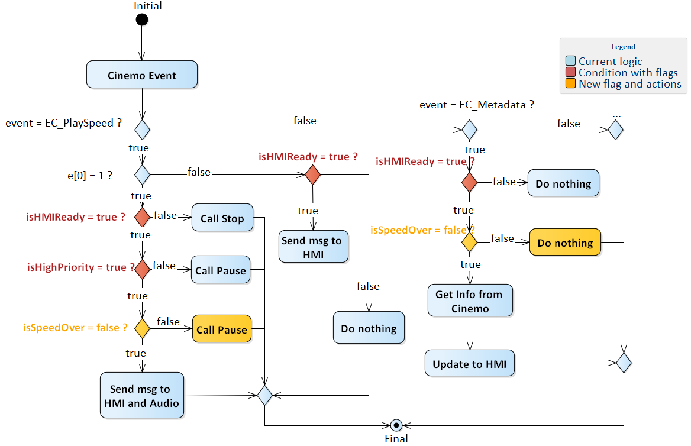
Image reference: doc_image_005.png

Figure 5: Activity diagram handling message when adding a state in ProjectionPlayer

2. Using directly 3rd- party APIs when providing methods to control playback

During the process of providing media player control methods, the system (ProjectionPlayer class) directly uses the library’s API. This is the sequence diagram when projection Player calls Cinemo API.

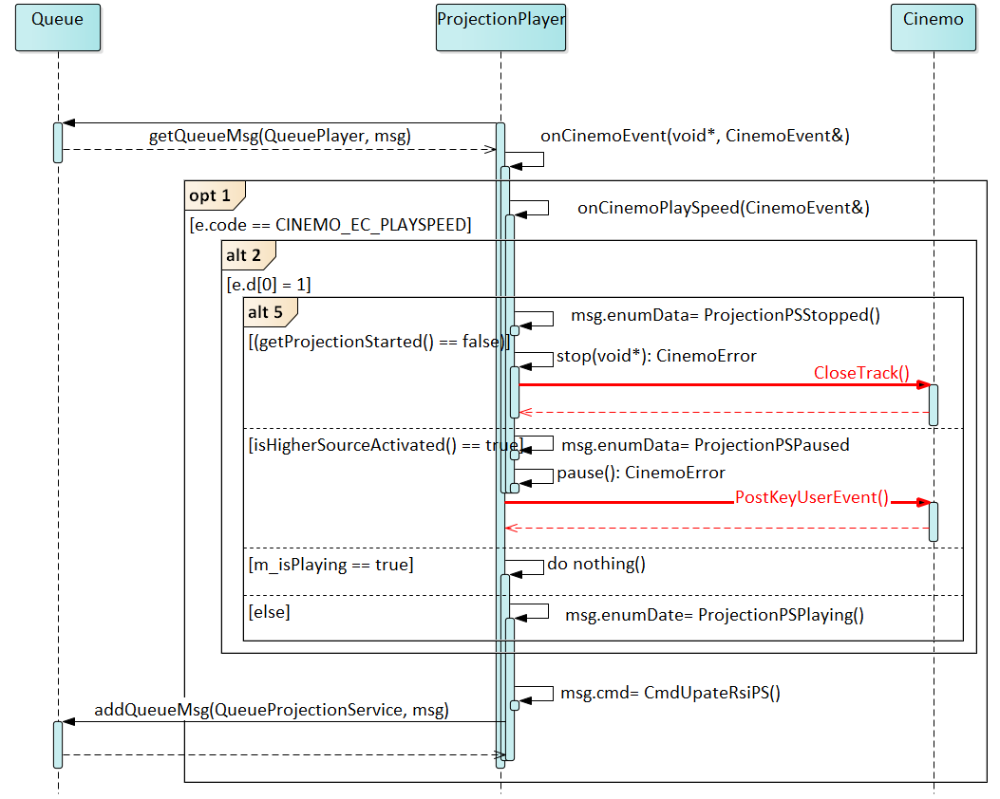
Image reference: doc_image_006.png

Figure 6: Sequence diagram when using Cinemo’s API in ProjectionPlayer

This approach offers a simple architecture, avoids introducing additional classes, and easy to integrate into the system during the early stages of the project.

However, this design has some restricts and affect to scalability and maintenance:

- [Maintainability] When player calls directly to 3rd party, it means Player contains the specific logic of them. As a result, every time they have any changes about API, we have to find each of those APIs in the Projection Player class and then update them to the new API. This is risky and difficult to control whether all the old APIs have been updated.

- [Scalability] The system wants to change to another library or use two libraries in parallel, the update becomes complicated and can take a lot of time.

- Violate the Dependency Inversion Principle (DIP): The high-level module (Player) should not depend on directly to the low-level module (3rd party). Instead, 2 levels should depend on an abstraction.

Conclude:

With this situation, a new design should be considered to improve the Reliability, Maintainability, and Scalability of ProjectionPlayer. To reach these points, the above problems have to be solved. They can be simplified by two solutions below:

Improve 1: Re-design ProjectionPlayer class for easier event handling.

Improve 2: Decouple Cinemo engine with ProjectionPlayer.

3. Architecture Alternatives

The way to fulfill solutions will be mentioned in this section.

According to the two above solutions listed:

3.1 Re-design ProjectionPlayer class for easier event handling

3.1.1. Architecture Design Proposals

Proposal 1: Using State pattern

With this approach, each state in the State Machine is specifically defined, representing a condition or situation the system can exist in at any given time. These states are not independent but are linked to specific events that act as triggers for transitions between states. This ensures that the system's behavior is tightly controlled and only occurs when the appropriate event is present. Instead of checking and handling multiple flags simultaneously, the State Machine provides a clear logic flow, reducing errors and increasing stability.

Below diagram will illustrate the new class diagram for Projection Player.

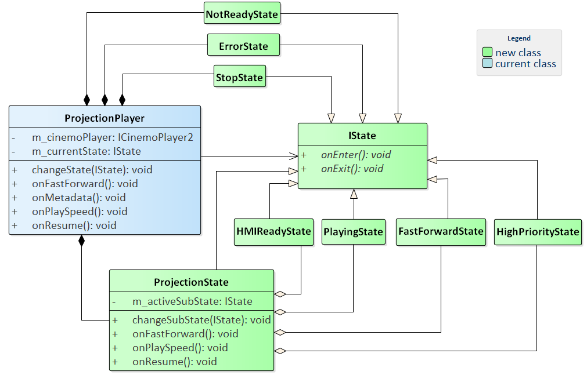
Image reference: doc_image_007.png

Figure 7: Class diagram when applying State pattern

The classes of Projection Player component are described as below:

## Table
| Classes | Description |
| --- | --- |
| ProjectionPlayer | Responsible for controlling playback and receiving messages from HMI, Cinemo, .. Then dispatcher it to corresponding State by managing a variable currentState. |
| IState | Provide interface to components for communicating with each other. |
| ProjectionState | Composite state for projection, manages sub-states (e.g., playing, waiting for audio, fast forward) and delegates event handling to them. |
| PlayingState, PauseState, … | Represent the specific state and when any message is received, it will have separate handling. |

Table 4: Description about classes for applying State pattern

And this is new Activity diagram, in each event handler function, there are no more if/else conditions.

Image reference: doc_image_008.png

Figure 8: Activity diagram when handling message for State pattern

Pros:

- [Maintainability] Events are handled within their respective state classes, eliminating the need for multiple variables or complex conditional statements in large functions. This significantly reduces the complexity of those functions.

- [Reliability]: Ensure each state is managed independently, reducing errors caused by handling complex logic with flags. This helps avoid invalid states and ensures the system operates as designed.

- [Scalability]: When adding a new state or modifying the logic of an existing state, you only need to update or create the relevant class, rather than changing all the conditional logic spread across event-handling functions.

- Clear state management: Each state is separated into its own class, making the control flow of ProjectionPlayer easy to understand and maintain.

- Consistent state transitions: State transitions are managed through dedicated methods (such as changeState and changeSubState), so you don't have to manually update various flags. This ensures transitions are handled in a consistent and reliable manner.

Cons:

- Implementation Complexity: Applying the state pattern requires creating multiple interfaces and classes for each state, which increases the initial development effort and makes it complicated.

Proposal 2: Using State-Event Mapping and Command Pattern

With this approach, each state in the system is mapped to a specific set of events that it can handle, while each event is encapsulated as a Command object that contains both the data and the execution logic. This State-Event Mapping ensures that only valid events are processed in each state, while the Command Pattern provides a uniform interface for event handling and enables features like undo/redo, event queuing, and macro operations. Instead of conditional logic checking multiple boolean flags, the system maintains a clear mapping table where each state knows exactly which commands it can execute and how to handle them.

Below diagram will illustrate the new class diagram for Projection Player.

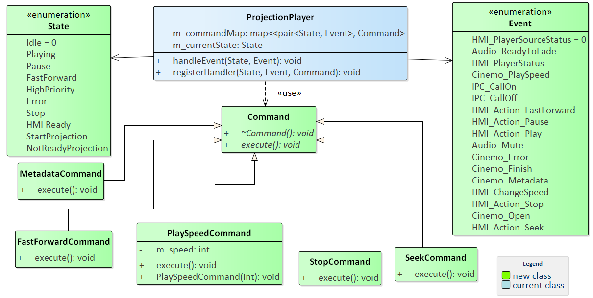
Image reference: doc_image_009.png

Figure 9: Class diagram when applying State event mapping and Command pattern

The classes of Projection Player component will be described as below:

## Table
| Class/Enum | Description |
| --- | --- |
| ProjectionPlayer | Receives messages from HMI, Cinemo, etc., and dispatches them to corresponding states using the ‘currentState’ variable. |
| State | Defines all the states in Projection Player module such as Idle, Playing, Pause, etc. |
| Event | Defines all the events that module Projection Player can receive from HMI, Cinemo, Audio, KIPC, … |
| Command | Encapsulates operations for specific events, ensuring atomic execution and separation of concerns. |
| PlaySpeedCommand, StopCommand, SeekCommand, … | Encapsulates specific actions or behaviors to be executed by the Projection Player, ensuring a clean separation of concerns. Each command focuses on handling a distinct event or operation. |

Table 5: Description about classes for applying State event mapping and Command pattern

And below is new Activity diagram, in each event handler function, there are no more if/else conditions.

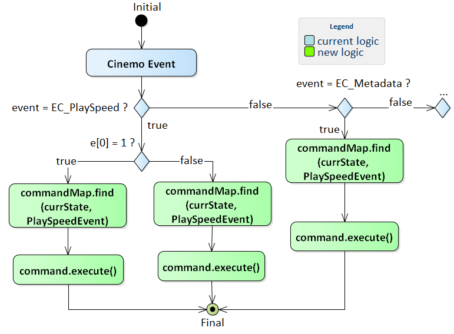
Image reference: doc_image_010.png

Figure 10: Activity diagram when applying State event mapping and Command pattern

Pros:

- [Maintainability]: Separating the logic for state handling, events, and actions makes the source code easier to read, understand, and maintain. When changes or expansions to the logic are needed, only relevant components need to be updated without affecting the entire system. Commands implemented in separate classes simplify modification or replacement processes.

- [Reliability]: Encapsulate event handling logic within specific states and commands, reducing the risk of errors from scattered flag-based conditions. This ensures clear, maintainable transitions and consistent behavior across different states.

Cons:

- Implementation Complexity: Applying the pattern requires creating class Command and enum data and managing the Map command, which increases the initial development effort and makes it more complex.

About, Scalability also supports well in adding new states, we just need to add more elements to the command map, and however it also has the disadvantage that the command map will be large when there are many states and events and it may affect to performance.

3.1.2. Compare Design Proposals.

Let's look at the comparison table of the two above proposals:

## Table
| How to measure | Quality Attribute | Proposal Design 1 Using State pattern | Proposal Design2 Using state-event Mapping and Command pattern |
| --- | --- | --- | --- |
| Properly handle all messages from other parties | Reliability | High, Ensure each state is managed independently, reducing errors caused by handling complex logic with flags. | High, Encapsulate event handling logic within specific states and commands, reducing the risk of errors from scattered flag-based conditions. |
| Easy to read and understand, with clearly defined components and encapsulated functionality. | Maintainability | High, Support maintainability because the processing logic is separated, do not use if/else. | High, Support maintainability because the processing logic is separated, do not use if/else. |
| Ability to extend without impacting to other parts of the program. | Scalability | High, Easily add a new state class without affecting the current logic. | Medium, Can be expanded by adding elements to the Map Command, however it will grow larger as state increases and may affect the performance. |

Table 6: Comparision of 2 proposals for Improve 1

Overall, the two proposal designs resolve issues of the current design.

Proposal #1 Using state patter: This approach allows each state to be encapsulated in a separate class, making state transitions clear and eliminating complex flag-checking branches.

Proposal #2 Using state-event mapping and command pattern: State-Event Mapping accurately determines the current state and the required action when an event occurs, ensuring consistent and easily extensible processing flows. The Command pattern helps encapsulate operations as command objects, separating execution logic from coordination logic, and making it easy to add, modify, or undo actions.

We can see both proposals resolve well with Reliability and Maintainability. But with Scalability, the difference between the two proposals is:

- Proposal #1, we can easily add or remove a new state without significantly affecting the existing code or the system's performance.

- Proposal #2, we can also add new states alongside the existing ones. However, the size of the map is a point to consider. The map stores combinations of (state, event), and its size increases linearly as the number of states and events grows. This could impact the system's performance whenever we need to find the corresponding command for the current state and the incoming event.

From the information in the comparison above, proposal #1: Using state pattern is selected as the better solution.

3.2 Decouple Cinemo engine with Projection player

3.2.1. Architecture Design Proposals

Proposal 1: Using Facade pattern

This improvement idea is to simplify interactions with complex systems by providing a unified, easy-to-use interface for the Player class. Rather than having the Player invoke multiple APIs directly, the Facade acts as a single entry point, hiding all internal logic and exposing only the necessary, developer-friendly methods. When the Player calls the Facade’s methods, the Facade is responsible for orchestrating calls, executing logic, or forwarding requests to the appropriate libraries in a coordinated manner. This approach significantly reduces the coupling between the Player and its supporting libraries.

Below diagram will illustrate the new class diagram.

Image reference: doc_image_011.png

Figure 11: Class diagram when applying Façade pattern

The following table provides a detailed description of the purpose of each class:

## Table
| Class | Description |
| --- | --- |
| ProjectionPlayer | Responsible for control playback and receives messages from HMI, Cinemo, etc., and call to library with corresponding message. |
| PlayerFacade | This class acts as the unified interface (facade) for all player-related operations. It manages both specific player as its internal members, and exposes high-level playback methods such as play(), pause(), seek(), and parameter settings. The facade decides which library to use and forwards the requests accordingly. |
| CinemoPlayer | Encapsulates all interactions with the library. It provides methods for playback control, metadata retrieval, and parameter settings specific to a library. It is only used internally by the PlayerFacade and is not exposed directly to the Player. |
| IPlayerEventCallback | An interface for register callback to receive event from library |

Table 7: Description about classes for applying Facade pattern

Below is the sequence diagram for the new design. Instead of using the library APIs directly, they are coordinated through a Facade.

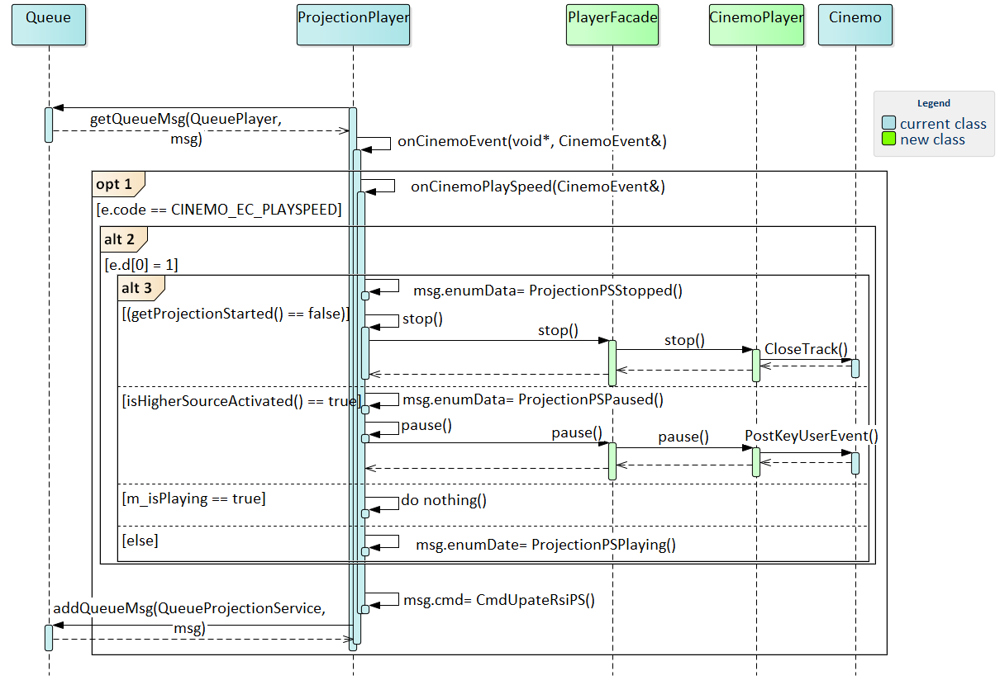
Image reference: doc_image_012.png

Figure 12: Sequence diagram when applying Façade pattern

Pros:

- [Maintainability]: The source code becomes easier to maintain because all interactions with complex player libraries are consolidated into a single class PlayerFacade. When you need to modify, update, or fix bugs related to a library, you only have to make changes in the PlayerFacade, without ProjectionPlayer, thus minimizing the risk of error propagation.

- Portability: Besides that, PlayerFacade increases the portability of ProjectionPlayer because it only depends on the Facade’s API, not on any specific library. When you need to switch the system to a new library, you only have to modify or replace the Facade, without changing ProjectionPlayer.

Cons:

- Increased number of classes: Applying the Facade pattern increases the number of classes in system, it needs to create additional Facade classes and possibly adapter classes for each library. This can make the project structure more complex and may require more effort to manage and understand the relationships between classes.

About Scalability, it has some cons such as: Expanding the system to add a new API becomes simple and consistent. When you need to integrate an additional API, you only need to extend the PlayerFacade without modifying ProjectionPlayer, making the system more flexible during development but it has a problem when the system uses multiple library and wants to switch between different libraries at runtime. The PlayerFacade must handle the logic for selecting and switching between libraries, which can complicate its implementation and increase the risk of errors if not managed carefully.

Proposal 2: Using strategy pattern

The idea is to separate all the logic for interacting with player libraries into individual classes, with each class acting as a specific “strategy.” Instead of having ProjectionPlayer call Cinemo API functions directly, we define a common interface called IPlayerStrategy with methods such as play, pause, stop, seek, etc. Then, we implement classes like CinemoPlayer that realize this interface, each wrapping and delegating commands to the corresponding player library’s API. As a result, ProjectionPlayer no longer depends directly on the Cinemo API, but only interacts with the common interface. When initializing ProjectionPlayer, we can inject an appropriate strategy (for example, CinemoPlayer) depending on configuration or runtime requirements.

New class diagram:

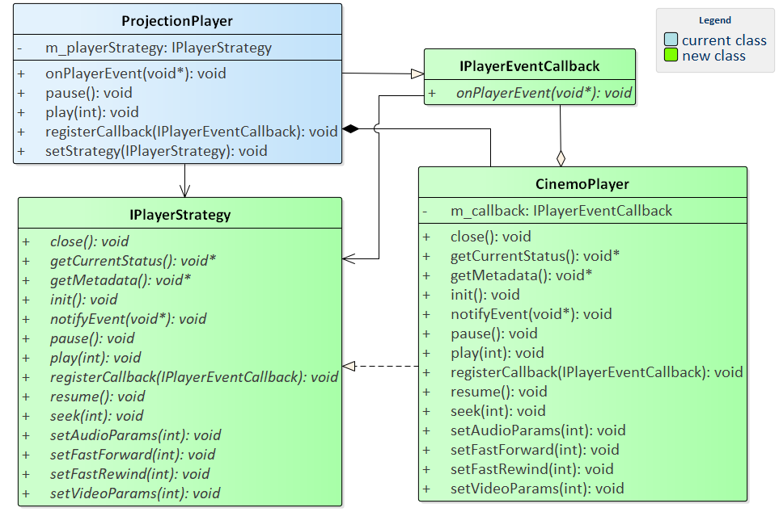
Image reference: doc_image_013.png

Figure 13: Class diagram when applying Strategy pattern

The following table provides a detailed description of the purpose of each class:

## Table
| Class | Description |
| --- | --- |
| ProjectionPlayer | Responsible for control playback and receives messages from HMI, Cinemo, etc., and use library with corresponding message. |
| IPlayerStrategy | An interface that defines common methods for all player, such as play, pause, stop, and seek. ProjectionPlayer can use any library that implements this interface. |
| CinemoPlayer | Implements IPlayerStrategy for the specific library, responsible for wrapping and delegating commands to the API. |
| IPlayerEventCallback | An interface for register callback to receive event from library |

Table 8: Description about classes for applying Strategy pattern

Below is the sequence diagram for the new design. Instead of using the library APIs directly, they are coordinated through a CinemoPlayer.

Image reference: doc_image_014.png

Figure 14: Sequence diagram when applying Strategy pattern

Pros:

- [Maintainability] All specific logic is separated into individual strategy classes. When you need to update, fix bugs, or change the implementation for a particular player library, you only need to modify the corresponding strategy class without affecting the main logic in ProjectionPlayer.

- [Scalability] Easy to add new APIs and flexible to use multiple libraries, can switch between libraries at runtime without changing too much source code. Besides that, it increases portability by decoupling the client (ProjectionPlayer) from any specific library implementation. If you need to switch to a different player library, you can provide a new strategy implementation and inject it at runtime, without modifying the client code.

Cons:

- Increase the number of classes: Each library will need a separate class to implement the common interface, leading to a significant increase in the number of classes in the system.

3.2.2. Compare Design Proposals.

## Table
| How to measure | Quality Attribute | Proposal Design 1 Using Façade pattern | Proposal Design2 Using Strategy pattern |
| --- | --- | --- | --- |
| Easy to read and understand, with clearly defined components and encapsulated functionality. | Maintainability | High, Support maintainability because all logic of Cinemo is in 1 class and complies with Single Responsibility Principle. | High, Support maintainability because all logic of Cinemo is in 1 class and complies with Single Responsibility Principle |
| Ability to extend without impacting to other parts of the program. | Scalability | Medium, Easy to expand when the library adds new APIs, changes to new libraries but the logic for changing libraries at runtime can be complicated. | High, Easy to expand when the library adds new APIs, changes to new libraries and can flexibly use multiple libraries at the same time. |

Table 9: Comparison of two proposals for Improve 2

Overall, the two proposal designs address the issues of the current design effectively.

Proposal #1: Using Façade pattern: This approach consolidates all logic into a single class, adhering to the Single Responsibility Principle. It simplifies the design, making it easier to maintain and understand. However, while it supports maintainability well, scalability is limited. The logic for switching between libraries at runtime can be complicated

Proposal #2: Using Strategy pattern: This approach also adheres to the Single Responsibility Principle, ensuring maintainability. Additionally, it offers high scalability by allowing flexible use of multiple libraries simultaneously. Changes of libraries or the addition of new APIs are handled seamlessly, making it a more adaptable solution.

From the information in the comparison above, proposal #2: Using strategy pattern is selected as the better solution.

4. Implementation and verification

4.1 Implementation

Static view

This is new class diagram for projection player after applying 2 proposals: State pattern and strategy pattern.

Image reference: doc_image_015.png

Figure 15: Class diagram for new design ProjectionPlayer after applying State and Strategy pattern

## Table
| Classes | Description |
| --- | --- |
| ProjectionPlayer | Responsible for control playback and receive messages from HMI, Cinemo,.. Then handle it and send the message to them to synchronize the status. |
| IState | Provide interface to components for communicating with each other. |
| ProjectionState | Composite state for projection. Manages sub-states (e.g., playing, waiting for audio, fast forward) and delegates event handling to them. |
| PlayingState, PauseState, ErrorState, … | Represents the specific state and when any message is received, it will have separate handling. |
| IPlayerStrategy | An interface that defines common methods for all player, such as play, pause, stop, and seek. |
| CinemoPlayer | Implements IPlayerStrategy for the specific library, responsible for wrapping and delegating commands to the API. |
| IPlayerEventCallback | An interface for register callback to receive event from library. |

Table 10: Description about classes for new design

Dynamic view

State design:

The projection player should work as the following states:

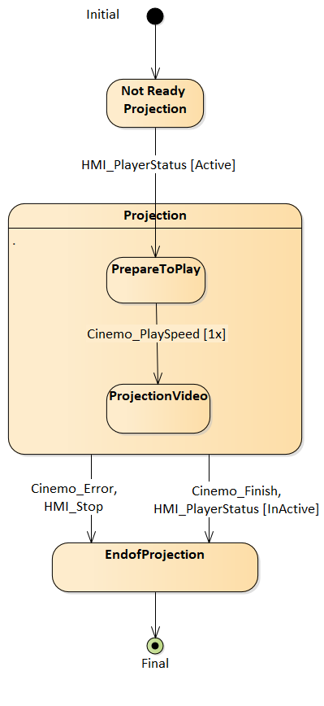
Image reference: doc_image_016.png

Figure 16: Overall design state of Projection player

Then, here are the details for each state group:

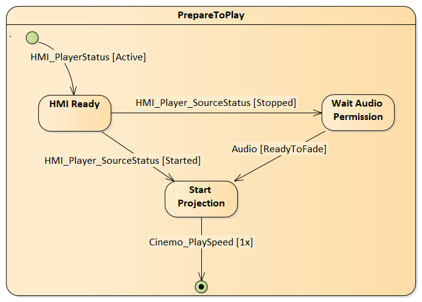
Image reference: doc_image_017.png

Figure 17: Design state of Prepare to play

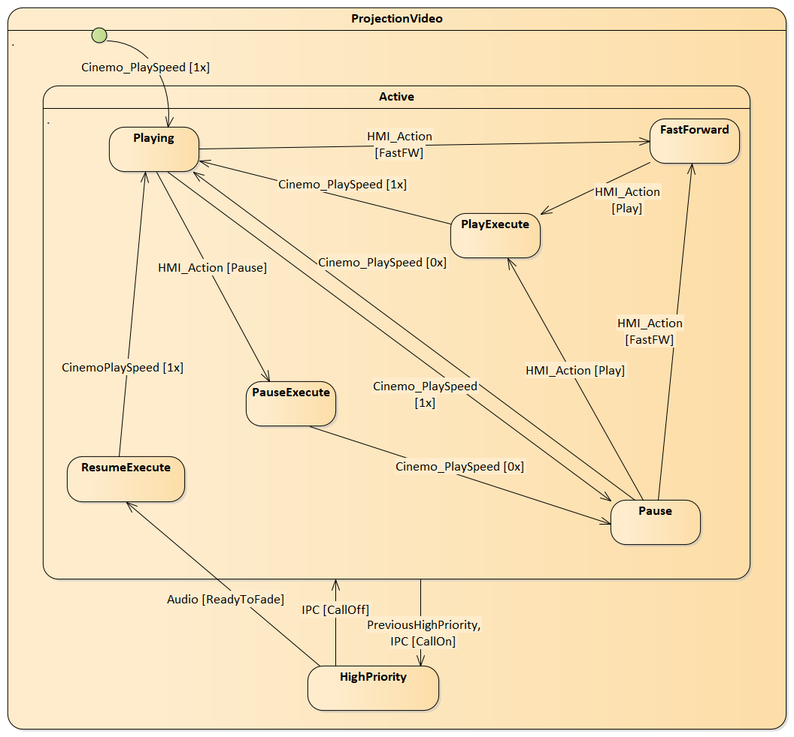
Image reference: doc_image_018.png

Figure 18: Design state of Projection video

Image reference: doc_image_019.png

Figure 19: Design state of End of Projection

## Table
| States | Descriptions |
| --- | --- |
| NotReadyProjection | This is the initial state. |
| HMIReadyState | HMI ready receive messages from our service. |
| WaitAudioPermissionState | User request projection video but service has not had audio permission yet. |
| StartProjectionState | Service request play video after it has all permissions. |
| PlayingState | Video is playing on HU. |
| PauseState | Video is pausing on HU. |
| FastForward | User is fast-forwarding the video on HU. |
| HighPriority | A service has higher priority than Video projection service. |
| Error | Display the error message on HU. |
| Stop | Stop video on HU. |

Table 11: Description of each state

The state transitions for the state diagram are as follows:

## Table
| Current State | Event/Action | Next State | Descriptions |
| --- | --- | --- | --- |
| NotReadyProjection | HMI_PlayerStatus [Active] | HMIReadyState | HMI_PlayerStatus[Active] event is triggered when user request projection |
| HMIReadyState | HMI_Player_SourceStatus [Stopped] | WaitAudioPermissionState | When users request projection but the service has not had audio permission yet. |
| HMIReadyState | HMI_Player_SourceStatus [Started] | StartProjectionState | When users request projection and the service had audio permission. |
| WaitAudioPermissionState | Audio [ReadyToFade] | StartProjectionState | Audio grant permission for our service. |
| StartProjectionState | Cinemo_PlaySpeed [1.x] | PlayingState | Cinemo notify for service video is playing. |
| PlayingState, PauseState | HMI_FastForward | FastForwardState | HMI sends event fast-forward to our service. |
| PlayingState | HMI_Action[Pause], Cinemo_PlaySpeed[0.x] | PauseState | Users press Pause button on HU or on Phone. |
| PauseState | HMI_Action[Play], Cinemo_PlaySpeed[0.x] | PlayingState | Users press Play button on HU or on Phone. |
| PlayingState, PauseState | IPC[Call_On] | HighPriorityState | We has a call while play video projection. |
| HighPriorityState | IPC[Call_Off] | PlayingState, PauseState | When the call ends, restore the previous state. |
| PlayingState | Error | ErrorState | During video playback, if there is any error, an error message should be displayed on HU. |
| PlayingState | HMI_PlayerStatus [InActive], Cinemo_Finish | StopState | User change to other source or end of the video, we change to Stop state. |

Table 12: State transition of Projection Player state

Activity diagram for handling message:

Event handling functions are no longer complicated by conditions, instead, the processing logic has been put into each corresponding state and will transition to the new state according to the state diagram.

Image reference: doc_image_020.png

Figure 20: Activity diagram for handling message

Sequence diagram for using 3rd- party APIs:

The player class does not use the library API directly, instead we use them through a strategy class. It encapsulates the entire library API.

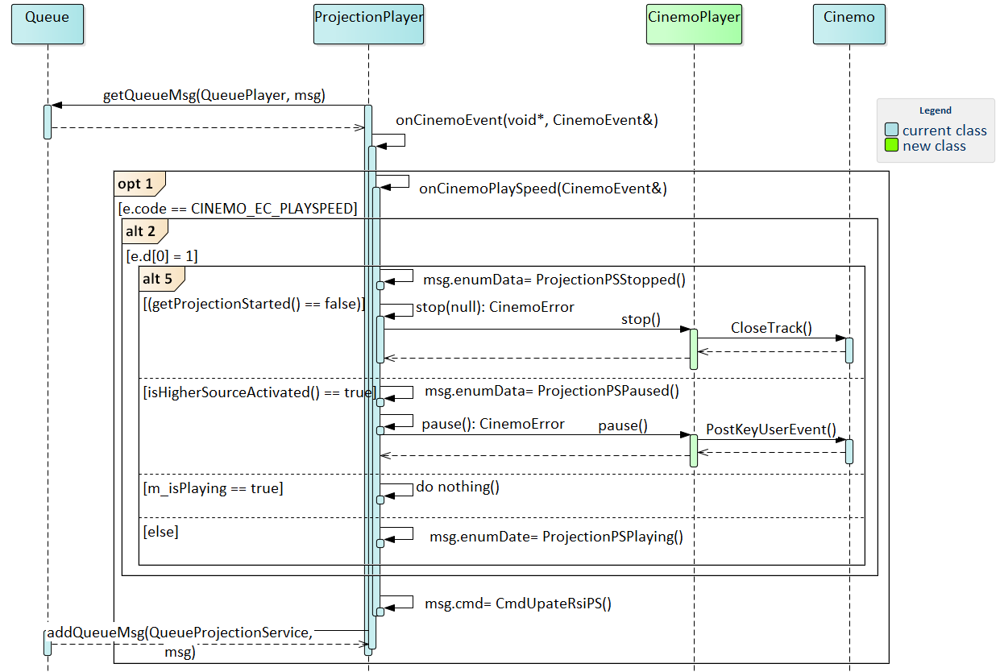
Image reference: doc_image_021.png

Figure 21: Sequence diagram for using Cinemo’s API in ProjectionPlayer

4.2 Verification

4.2.1. Reliability

After applying new design, all states and the logic for transitions between them have been designed and implemented comprehensively, ensuring consistency and clarity in managing the system's states.

Basic cases: The system was tested with basic cases. These tests included verifying the states and transitions between them, ensuring that the system operates as expected in typical scenarios. The test results showed that all basic cases worked without any errors.

Previous issues: Additionally, five issues that related to the previous use of boolean flags were reproduced in the testing environment. These issues include state synchronization or conflicts between flags, lack of condition checking, causing instability in the system. After applying the state pattern, these issues were completely resolved, demonstrating that the transition significantly improved the system's reliability.

This is log for a basic case: Phone request play video >> Video plays on Head Unit >> Users request stop >> Video is stopped on Head Unit.

## Table
| 00:10:45.587 NotReadyProjectionState.cpp onHMIPlayerStatus 67 [NotReadyProjectionState] onHMIPlayerStatus isActive: 1 00:10:45.587 NotReadyProjectionState.cpp onExit 13 [NotReadyProjectionState] Exiting state 00:10:45.587 HMIReadyState.cpp onEnter 9 [HMIReadyState] Entering state 00:10:45.587 ProjectionState.cpp onHMIPlayerSourceStatus 156 [ProjectionState] onHMIPlayerSourceStatus isStarted: 0 00:10:45.587 HMIReadyState.cpp onHMIPlayerSourceStatus 72 [HMIReadyState] Change to WaitAudioState 00:10:45.587 HMIReadyState.cpp onExit 15 [HMIReadyState] Exiting state 00:10:45.588 WaitAudioState.cpp onEnter 17 [WaitAudioState] Entering state 00:10:46.251 WaitAudioState.cpp onAudioReadyToFade 94 [WaitAudioState] onAudioReadyToFade 00:10:46.251 WaitAudioState.cpp onAudioReadyToFade 96 [WaitAudioState] Change to StartProjectionState 00:10:46.251 WaitAudioState.cpp onExit 22 [WaitAudioState] Exiting state 00:10:46.251 StartProjectionState.cpp onEnter 18 [StartProjectionState] Entering state 00:10:47.638 CinemoPlayer.cpp onCinemoEvent 364 [ProjectionPlayer] code 5 - CINEMO_EC_PLAYSPEED, speed 1000 00:10:47.639 StartProjectionState.cpp onCinemoPlay 48 [StartProjectionState] change to PlayingState 00:10:47.639 StartProjectionState.cpp onExit 25 [StartProjectionState] Exiting state 00:10:47.639 PlayingState.cpp onEnter 18 [PlayingState] Entering state 00:10:49.128 CinemoPlayer.cpp onCinemoEvent 368 [ProjectionPlayer] code 18 - CINEMO_EC_TIME 00:10:49.128 ProjectionPlayer.cpp onCinemoTime 512 [ProjectionPlayer] CINEMO_EC_TIME, E:854 // R:717689 00:10:49.378 CinemoPlayer.cpp onCinemoEvent 368 [ProjectionPlayer] code 18 - CINEMO_EC_TIME 00:10:49.378 ProjectionPlayer.cpp onCinemoTime 512 [ProjectionPlayer] CINEMO_EC_TIME, E:1104 // R:717689 00:10:58.998 ProjectionState.cpp onHMIStop 181 [ProjectionState] onHMIStop 00:10:59.034 ProjectionState.cpp onHMIStop 184 [ProjectionState] Change to StopState 00:10:59.034 PlayingState.cpp onExit 34 [PlayingState] Exiting state 00:10:59.035 StopState.cpp onEnter 17 [StopState] Entering state 00:10:59.035 StopState.cpp onEnter 25 [StopState] Change to NotReadyProjectionState 00:10:59.035 StopState.cpp onExit 30 [StopState] Exiting state 00:10:59.035 NotReadyProjectionState.cpp onEnter 8 [NotReadyProjectionState] Entering state |
| --- |

4.2.2. Maintainability

The original class has been refactored into smaller classes with clearer responsibilities. Additionally, the methods are now less complex. As a result, developers can maintain the code more easily.

This is a comparison table of changes to the components in the projection player.

Line of code:

## Table
| Class | Before | After |
| --- | --- | --- |
| ProjectionPlayer | 2000 | 1200 |
| CinemoPlayer | - | 650 |
| PlayingState | - | 65 |
| PauseState | - | 56 |
| FastForwardState | - | 47 |

Table 13: Comparison about line of code

Cyclomatic Complexity

## Table
| Method | Before | After |
| --- | --- | --- |
| onCinemoPlaySpeed | 12 | 5 |
| Resume | 9 | 4 |
| FastForward | 8 | 4 |
| Pause | 9 | 4 |

Table 14: Comparison about cyclomatic complexity

4.2.3. Scalability

The system has new requirements: Handling speed over and using two libraries in parallel.

* Speed Over

Requirement: When the vehicle is running over the speed limit, user actions will not be processed. For example, the user will not be able to fast forward, seek, etc. while driving too fast.

Analysis: When the vehicle exceeds the permitted speed, all user actions such as fast forward, seek, requesting a new track, changing playback speed, etc. will be ignored. The HMI or a dedicated service will send a message to the Video Projection Service to notify the overspeed status. This service will check the current status of the vehicle, and if a violation is detected, all user actions will be ignored.

* Using two libraries in parallel

Requirement: The system uses more than one library to better support different types of content.

Analysis: The system needs to add more libraries to the source code. After receiving information about the video to be played (codec), the service will decide which library is most suitable to use Cinemo or Visual On.

This is class diagram when system add new library: VisualOnPlayer and new state: OverSpeedState. The new logic is separated from the current implementation.

Image reference: doc_image_022.png

Figure 22: New design when system add a new library and new state

This is a comparison table of scalability between the current and new design.

## Table
| Criteria | Current Design | Current Design | New Design | New Design |
| --- | --- | --- | --- | --- |
|  | Speed Over | Using two libraries | Speed Over | Using two libraries |
| Implementation | - Directly modify the original file. - Add conditions to all message handling functions. - Ensure the correct order of condition checks. | - Directly modify the original file. - Add condition checks before using the library's API. | - Each state is handled in a separate class. - Eliminate if/else statements in message handling functions. | - Each library is implemented in a separate class. - Switch libraries flexibly using the strategy pattern. |
| Complexity of message handling functions and library usage functions. | Increase when adding new states. | Increase when adding new libraries. | Insignificant change. | Insignificant change. |
| Implementation and verification time | 3 days | 5 days | 2 days | 3 days |

Table 15: Comparison between current and new system scalability.

From the comparison table above, we can see that the new design provides good scalability.

Besides the example above, the system can also support features such as Parental Control and Resume Last Position.

* Parental Control

Requirement: Content is restricted by age group. Each piece of content will have an age requirement for viewing. Based on the account information provided at login, the system will decide whether to play the content, show a confirmation prompt, or play with a warning signal.

Analysis: Users need to log in to the system with age information. When there is a request to play content, the service will receive metadata containing the required age information for the video. Based on this, the system will decide one of three options:

- Play the video normally.

- Display a confirmation message (with a countdown timer), and receive the result from HMI.

- Play the video with a warning.

After that, the service will send the corresponding status to the HMI for display.

Current design: All logic for checking and handling Parental Control is contained within the ProjectionPlayer class, making maintenance difficult.

New design: Separate a "ParentalControl" state in the system, with all related logic handled centrally, making the system clearer and easier to expand.

* Resume Last Position

Requirement: The video will resume from the last played position instead of starting from the beginning, if the last played content and the currently requested content are the same.

Analysis: The Video Projection Service will proactively save the URL, total duration, and current playback position of the video. When a replay request is received, the service will check this information. If it matches the previous playback, the system will automatically seek to the saved position to continue playing.

Both current and new design follow these steps:

Step 1: Save the URL when receiving the EC_OPEN message from Cinemo.

Step 2: Save the total time when receiving the EC_TIME message from Cinemo.

Step 3: When starting playback (EC_PLAYSPEED = 1), check the URL and total time before automatically seeking to the desired position.

Applying the new design for this requirement, we can see that even without adding a new state, the system's needs are still met and the implementation remains as the original design.

5. Conclusion

Conclusion:

New design has made the system clearer and easier to maintain while reducing errors during operation. The improved design ensures consistency in management and processing, contributing to enhanced reliability and stability of the system. Additionally, the new solutions increase flexibility, making it easier to expand and adapt when necessary.

Overall, these improvements not only meet current requirements but also establish a solid foundation for the long-term development of the system.

Future plan:

Enhancing Testing: Add complex test cases to evaluate system reliability in multiple scenarios.

Apply the design for similar module in project.
