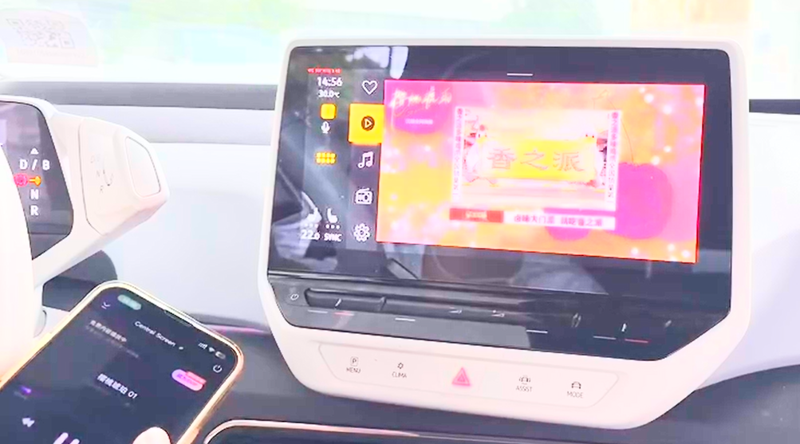
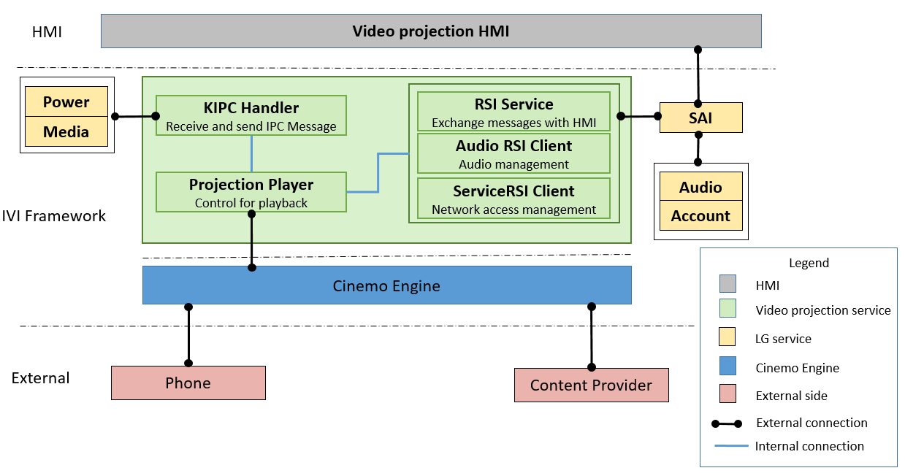
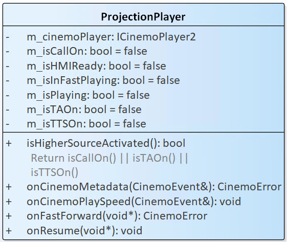
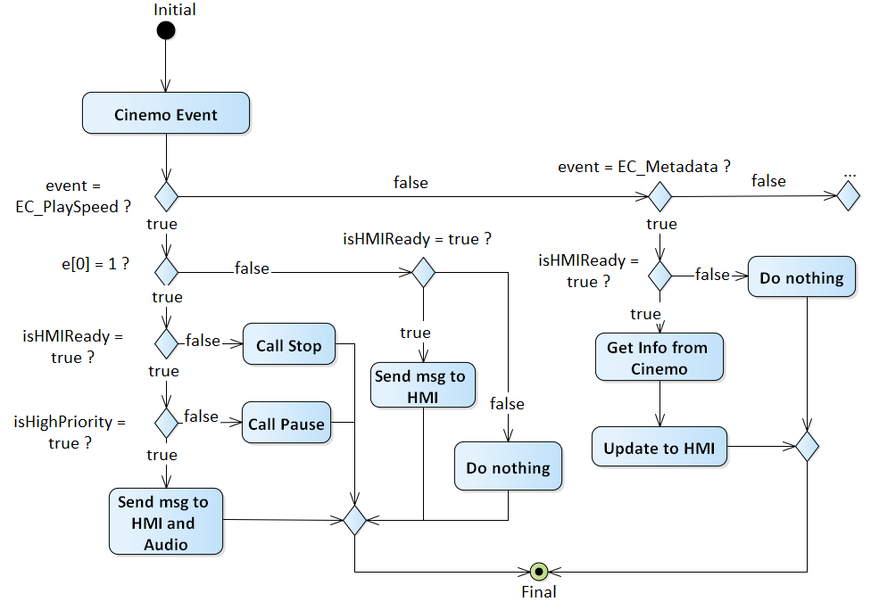
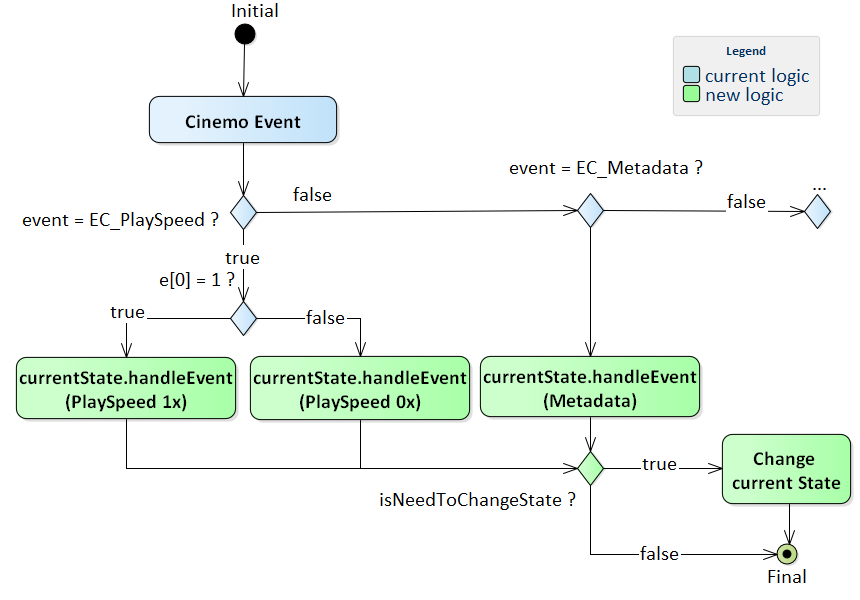
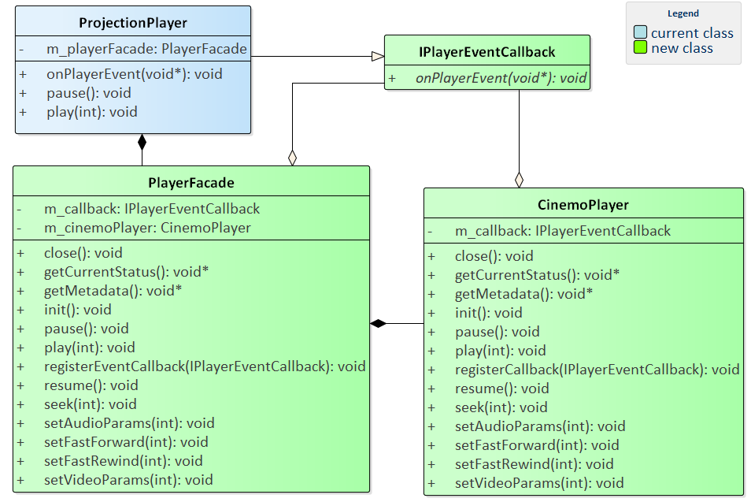
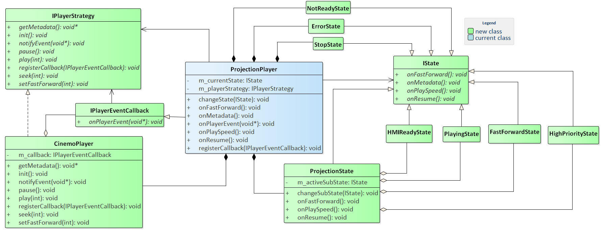
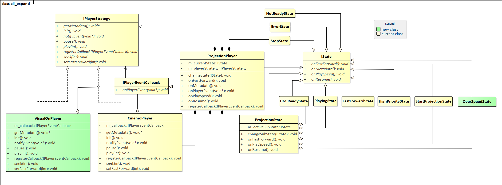
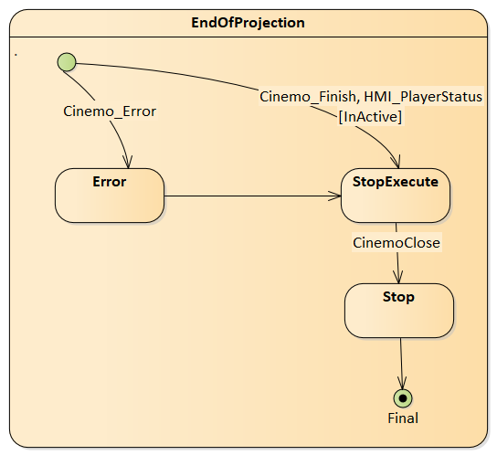

# Raw Slide Content

- Source file: FA_cong.dang/FA_cong.dang/FA_Project_Improve Design of Projection Player in Video projection project_final.pptx
- Total slides: 20

## Slide 1

Image reference: slide_01_image_01.png

Image reference: slide_01_image_02.png

Improve Design of Projection Player in Video projection project

Author: Dang Thanh Cong – cong.dang
Mentor: 황보상규 - sangkyu.hwangbo

1

## Slide 2

Image reference: slide_02_image_01.png

Image reference: slide_02_image_02.png

TABLE CONTENT

Video Projection Overview
Problem Identification
Architecture Design Proposals & Comparison
Architecture Decision
Q&A

2

## Slide 3

Image reference: slide_03_image_01.png

Image reference: slide_03_image_02.png

Image reference: slide_03_image_03.png

1. Video Projection Overview

Video projection is an application on Head Unit.
This application is a combination of:
HMI: User can interact with app easily (OEM).
Service: Handle all HMI’s requests and phone’s requests (LGE).
Requirement:
Videos and sounds from the phone are played smoothly on HU.
Support user control playback such as play, pause, fastforward, .. in both HU and phone.
Support video projection for the top 10 apps in China.

3

## Slide 4

Image reference: slide_04_image_01.png

1. Video Projection Overview (Cont)

Architecture of Video projection service:

Quality Attribute:

### Table
| QA ID | Quality Attribute | Priority | Description |
| QA.01 | Reliability | High | Operate correctly based on the actions performed by the end user. |
| QA.02 | Maintainability | High | Easy to read and understand, ability of the system to support changes. |
| QA.03 | Scalability | Medium | Ability to extend without impacting to other parts of the program. |

Image reference: slide_04_image_02.png

Image reference: slide_04_image_03.png

4

Video projection service

## Slide 5

Image reference: slide_05_image_01.png

Image reference: slide_05_image_02.png

Image reference: slide_05_image_03.png

2. Problem Identification

[Maintainability] All messages need to verify with multiple flags.
[Reliability] The problems can occur when logic checks are missing.
[Scalability] When adding a state, service needs to create a new flag and adds to all those messages.

Improve 1: Re-design ProjectionPlayer class for easier message handling.

5

Problem 1: Using multiple flags

New flag

Image reference: slide_05_image_04.png

## Slide 6

Image reference: slide_06_image_01.png

Image reference: slide_06_image_02.png

Image reference: slide_06_image_03.png

2. Problem Identification (Cont)

[Scalability], [Maintainability] Difficulty in expanding and maintaining.
Violate the Dependency Inversion Principle.

Improve 2: Decouple Cinemo engine with Projection player.

6

Problem 2: Using directly Cinemo’s API

Image reference: slide_06_image_04.png

## Slide 7

Image reference: slide_07_image_01.png

Image reference: slide_07_image_02.png

Proposal 1: Using State pattern

3. Architecture Design Proposals & Comparison

Improve 1: Re-design ProjectionPlayer class for easier message handling.

7

Image reference: slide_07_image_03.png

Image reference: slide_07_image_04.png

## Slide 8

Image reference: slide_08_image_01.png

Image reference: slide_08_image_02.png

Proposal 1: Using State pattern

Improve 1: Re-design ProjectionPlayer class for easier message handling. (Cont)

Pros:
- Reliability: Manage states independently to reduce errors..
- Maintainability: Separate logic, fewer if/else.
- Scalability: Add new state as a class, without affecting existing logic.

Cons:
- Complex: Require multiple classes.

3. Architecture Design Proposals & Comparison

8

Image reference: slide_08_image_03.png

Image reference: slide_08_image_04.png

## Slide 9

Image reference: slide_09_image_01.png

Image reference: slide_09_image_02.png

Proposal 2: Using state-event Mapping and Command pattern

Improve 1: Re-design ProjectionPlayer class for easier message handling. (Cont)

3. Architecture Design Proposals & Comparison

9

Image reference: slide_09_image_03.png

Image reference: slide_09_image_04.png

## Slide 10

Image reference: slide_10_image_01.png

Image reference: slide_10_image_02.png

Proposal 2: Using state-event Mapping and Command pattern

Improve 1: Re-design ProjectionPlayer class for easier message handling. (Cont)

Pros:
- Maintainability: Map replaces if/else logic.
- Reliability: Encapsulate event handling logic within states and commands

Cons
- Scalability: Map’s size grows with more states/events.

3. Architecture Design Proposals & Comparison

10

Image reference: slide_10_image_03.png

Image reference: slide_10_image_04.png

## Slide 11

Image reference: slide_11_image_01.png

Image reference: slide_11_image_02.png

Compare Design Proposals

Improve 1: Re-design ProjectionPlayer class for easier message handling. (Cont)

### Table
| How to measure | Quality Attribute | Proposal Design 1 Using State pattern | Proposal Design2 Using state-event Mapping and Command pattern |
| Properly handle all messages from other parties. | Reliability | High, Ensure each state is managed independently, reducing errors caused by handling complex logic with flags. | High, Encapsulate event handling logic within specific states and commands, reducing the risk of errors from scattered flag-based conditions. |
| Easy to read and understand, with clearly defined components and encapsulated functionality. | Maintainability | High, Support maintainability because the processing logic is separated, does not use if/else. | High, Support maintainability because the processing logic is separated, does not use if/else. |
| Ability to extend without impacting to other parts of the program. | Scalability | High, Easily add a new state class without affecting the current logic. | Medium, Can be expanded by adding elements to Map Command, however it will grow larger as state increases and may affect the performance. |

 Decided as Proposal 1: Using State pattern to Re-design ProjectionPlayer class for easier message handling.

3. Architecture Design Proposals & Comparison

11

## Slide 12

Image reference: slide_12_image_01.png

Image reference: slide_12_image_02.png

Proposal 1: Using Façade pattern

Improve 2: Decouple Cinemo with Projection player

Class diagram

Sequence diagram

Pros:
- Maintainability: Cinemo’s logic is separated.

Cons:
- Complex: Requires interfaces/classes per library.
- Scalability: Difficult to switch libraries at runtime.

3. Architecture Design Proposals & Comparison

12

Image reference: slide_12_image_03.png

Image reference: slide_12_image_04.png

## Slide 13

Image reference: slide_13_image_01.png

Image reference: slide_13_image_02.png

Proposal 2: Using Strategy pattern

Improve 2: Decouple Cinemo with Projection player (Cont)

Pros:
- Maintainable: Cinemo’s logic is separated.
- Scalable: Easy to add APIs and switch.

3. Architecture Design Proposals & Comparison

13

Cons:
- Complex: Requires interfaces/classes for each library.

Image reference: slide_13_image_03.png

Image reference: slide_13_image_04.png

## Slide 14

Image reference: slide_14_image_01.png

Image reference: slide_14_image_02.png

Compare Design Proposals

Improve 2: Decouple Cinemo with Projection player (Cont)

### Table
| How to measure | Quality Attribute | Proposal Design 1 Using Façade pattern | Proposal Design2 Using Strategy pattern |
| Easy to read and understand, with clearly defined components and encapsulated functionality. | Maintainability | High, Support maintainability because all logic of Cinemo is in 1 class and complies with Single Responsibility Principle. | High, Support maintainability because all logic of Cinemo is in 1 class and complies with Single Responsibility Principle |
| Ability to extend without impacting to other parts of the program. | Scalability | Medium, Easy to expand when the library adds new APIs, changes to new libraries but hard to handle when user want to switch library at runtime. | High, Easy to expand when the library adds new APIs, changes to new libraries and can flexibly use multiple libraries at the same time. |

 Decided as Proposal 2: Using Strategy pattern to decouple Cinemo with Projection player.

3. Architecture Design Proposals & Comparison

14

## Slide 15

Image reference: slide_15_image_01.png

Image reference: slide_15_image_02.png

4. Architecture Decision

New architecture after apply 2 proposals: State pattern and Strategy pattern

15

Image reference: slide_15_image_03.png

## Slide 16

Image reference: slide_16_image_01.png

Image reference: slide_16_image_02.png

4. Architecture Decision

Verification of chosen design:

16

- Reliability

Image reference: slide_16_image_03.jpg

Basic cases.

Image reference: slide_16_image_04.jpg

Verify with old tickets related to flags (5/5).

A basis case: Users request play video >> Video plays on Head Unit >> Users request stop >> Video is stopped on Head Unit

// Enter HMI Ready State
00:10:45.587 NotReadyProjectionState.cpp onHMIPlayerStatus 67 [NotReadyProjectionState] onHMIPlayerStatus isActive: 1
00:10:45.587 HMIReadyState.cpp onEnter 9    [HMIReadyState] Entering state
// Enter Wait Audio State
00:10:45.587 ProjectionState.cpp onHMIPlayerSourceStatus 156  [ProjectionState] onHMIPlayerSourceStatus isStarted: 0
00:10:45.588 WaitAudioState.cpp onEnter 17   [WaitAudioState] Entering state
// Enter Start Projection State
00:10:46.251 WaitAudioState.cpp onAudioReadyToFade 94   [WaitAudioState] onAudioReadyToFade
00:10:46.251 StartProjectionState.cpp onEnter 18   [StartProjectionState] Entering state
//Enter Playing State
00:10:47.638 CinemoPlayer.cpp onCinemoEvent 364  [ProjectionPlayer] code 5 - CINEMO_EC_PLAYSPEED, speed 1000
00:10:47.639 PlayingState.cpp onEnter 18   [PlayingState] Entering state
// EC_TIME
00:10:49.128 CinemoPlayer.cpp onCinemoEvent 368  [ProjectionPlayer] code 18 - CINEMO_EC_TIME
00:10:49.128 ProjectionPlayer.cpp onCinemoTime 512  [ProjectionPlayer] CINEMO_EC_TIME, E:854 // R:717689
// Enter Stop State
00:10:58.998 ProjeStopState.cpp ctionState.cpp onHMIStop 181  [ProjectionState] onHMIStop
00:10:59.035 StopState.cpp onEnter 17   [StopState] Entering state

State classes

Library class

## Slide 17

Image reference: slide_17_image_01.png

Image reference: slide_17_image_02.png

4. Architecture Decision

Verification of chosen design:

-  Maintainability

### Table
| Class | Before | After |
| ProjectionPlayer | 2000 | 1200 |
| CinemoPlayer | - | 650 |
| PlayingState | - | 65 |
| PauseState | - | 56 |
| FastForwardState | - | 47 |

### Table
| Method | Before | After |
| onCinemoPlaySpeed | 12 | 5 |
| Resume | 9 | 4 |
| FastForward | 8 | 4 |
| Pause | 9 | 4 |

Line of code

Cyclomatic Complexity

17

## Slide 18

Image reference: slide_18_image_01.png

Image reference: slide_18_image_02.png

4. Architecture Decision

Verification of chosen design:

Image reference: slide_18_image_03.png

18

- Scalability

Separate logic

Image reference: slide_18_image_04.jpg

Class diagram for adding VisualOn library and Over speed state

Save implementation time (~30%)

Image reference: slide_18_image_05.jpg

Complexity of message handling functions and library usage functions: Not change.

Image reference: slide_18_image_06.jpg

## Slide 19

Image reference: slide_19_image_01.png

Image reference: slide_19_image_02.png

Q&A
Thank you for listening!

19

## Slide 20

Image reference: slide_20_image_01.png

Image reference: slide_20_image_02.png

Appendix - Architecture Diagram

Static view of state pattern

Image reference: slide_20_image_03.png

Image reference: slide_20_image_04.png

Image reference: slide_20_image_05.png

Image reference: slide_20_image_06.png

20

