# Raw Document Content

- Source file: FA_dang.cao/FA_New_App_Design_for_Map_Download_feature in Honda TSU_final.docx1

LGE HONDA TSU

Software Detailed Design

New App Design for Map Download Feature in Honda TSU

About This Document

Document Information

## Table
| Issuing authority | LGEDV – Connectivity Service Team |
| --- | --- |
| Configuration ID | Honda-TSU26MY |
| Status of document | In Progress |

Revision History

## Table
| Version | Date | Comment | Author | Approver |
| --- | --- | --- | --- | --- |
| 1.0 | 2023-08-01 | Initial Release | Dang.cao |  |
| 2.0 | 2023-08-09 | Draft version, 50% main content | Dang.cao |  |
| 3.0 | 2023-08-21 | Update Architectural Driver | Dang.cao |  |
| 4.0 | 2023-08-30 | Add detail design | Dang.cao |  |
| 5.0 | 2023-09-14 | Add verification result chart | Dang.cao |  |
| 6.0 | 2023-09-26 | Add development plan | Dang.cao |  |

Introduction

Purpose

This document specifies the Software Detailed Design (SDD) for the Map Download app in the Honda26MY project.

Scope

This document describes the new app design (Map Download) and re-use of the Remote Interface Manager service.

Audience

The target audience of this document is:

Software architect who will evaluate the design of the software

Software developer who will implement software

Other developers who need to interact with this software

Conventions

NOTE

Acronyms / Glossary

## Table
| Acronym | Description |
| --- | --- |
| ADAS | Advanced Driver-Assistance System |
| ECU | Electronics Control Unit |
| FIFO | First In First Out |
| FR | Functional Requirement |
| HLD | High Level Design |
| HTTP | Hyper Text Transfer Protocol |
| HTTPS | Hyper Text Transfer Protocol Secure |
| LLD | Low Level Design |
| MPU | Map Position Unit |
| NR | Non-functional Requirement |
| QA | Quality Attribute |
| RIM | Remote Interface Manager |
| SDD | Software Detailed Design |
| TLS | Transport Layer Security |
| TSU | Telematics System Unit |

## Table
| Glossary | Description |
| --- | --- |
|  |  |
|  |  |

Related Documents

Documents related to this document include: TBD

Background and Overview

Map Download Overview

MPU unit and ADAS unit use map information and probe information for autonomous driving. This information is obtained by communicating with servers outside the vehicle. However, from the cyber security’s point of view, MPU unit and ADAS unit cannot directly communicate with the server outside the vehicle. Therefore, TSU replaces MPU unit and ADAS unit and communicates with the server.

The Map download feature is a new one in TSU, It required a new app in the application layer on the Honda TSU system

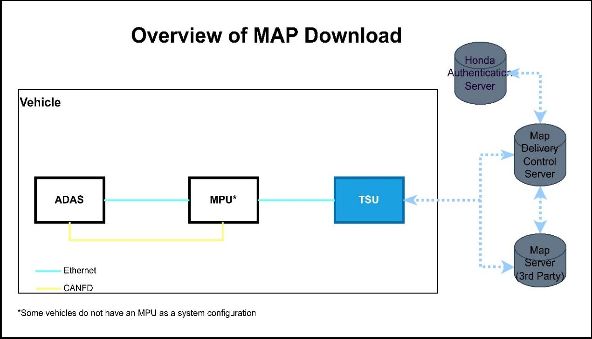
Image reference: doc_image_001.jpeg

Figure 1 Overview of MAP Download

System context Diagram

The following shows overall telematics system configuration. TSU communicates to some servers using different multiple APNs to sends/receives some data from/to server detecting some event and then transfer to ECUs. The main function of TSU is as below.

Wireless service

Emergency service

Remote vehicle service

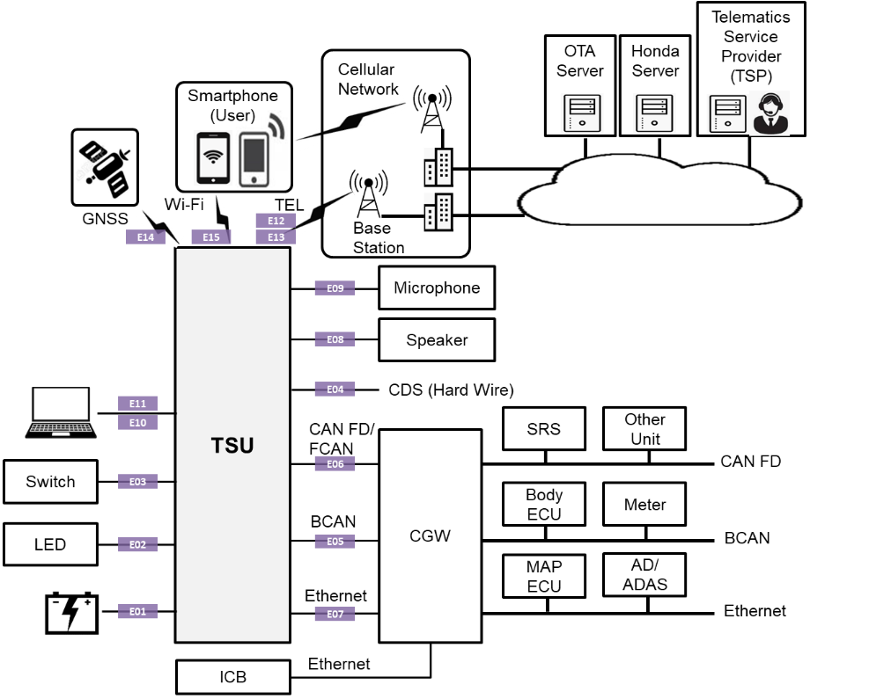
Image reference: doc_image_002.png

Figure 2 System Context

Layered Architecture

Honda TSU AP Part is Layered Architecture.

Tiger Framework is LGE Telematics Framework and it will extend its Common Functionality to satisfy Honda Requirement if needed.

Honda Framework is for Honda Specific Requirements.

Application Layer has the Most of Honda Requirement and it should satisfy Honda Requirement by using Tiger and Honda Framework.

This may be updated during clarifying the Requirement.

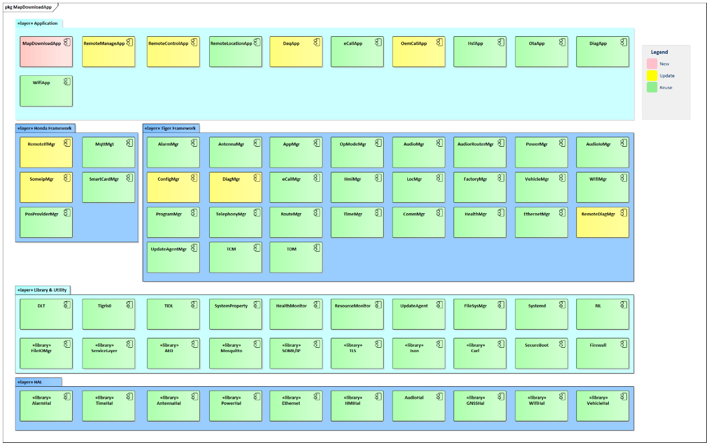
Image reference: doc_image_003.png

Figure 3 AP SW Layered Structure

Architectural Driver

Functional Requirement

Table 1 Functional Requirement of Map download feature

## Table
| # | Requirements |
| --- | --- |
| FR-1 | Use HTTP version 1.1 or higher |
| FR-2 | Use TLS version 1.2 or higher |
| FR-3 | Communicate according to the communication specifications set by Honda |
| FR-3-1 | Receiving HTTP communication from the ECU, encrypting it using TLS, and communicating with an external server located outside the vehicle by HTTPS communication. |
| FR-3-2 | Sending HTTP communications received from the ECU to the outside via FIFO. |
| FR-4 | Server authentication for the connected server is possible |
| FR-5 | Client authentication to the connected server is possible |
| FR-6 | Map data download |
| FR-6-1 | Request server for map data (list tiles and layer) around the vehicle ① |
| FR-6-2 | Download from server for each one of tile and layer on the list ② |
| FR-7 | Use multiple connections with the server while downloading (up to 5) |
| FR-8 | MPU will retry to send the request if the waiting timer timeout |

Non-functional requiments

Table 2 Non-functional Requirement of Map download feature

## Table
| # | Non-functional requirements |
| --- | --- |
| NR-1 | Frequency of downloading request ①, ② (rough estimate) |
| NR-2 | Download volume per communication in ① and ② (rough estimate) |

Table 3 Frequency of downloading request ①, ② (rough estimate)

## Table
|  | Travel speed | Frequency performed in ①(rough estimation) | Frequency of ② (rough estimation) | Target time for download completion |
| --- | --- | --- | --- | --- |
| Startup time | - | - | 1.80 times/sec | 60sec |
| Maximum speed(Target value) | 180km | Every 26.67 seconds | 12.60 times/sec | 26.67sec |
| Normal speed(highway) | 80km | Every 60.00 seconds | 5.60 times/sec | 60.00sec |
| Normal speed(ordinary road) | 60km | Every 80.00 seconds | 4.20 times/sec | 80.00sec |

Table 4 Download volume per communication in ① and ② (rough estimate)

## Table
| Type of map | Communication volume per one time in①※ | Communication volume per one time in②※ |
| --- | --- | --- |
| HD Map | Request: 9279byte - Body: 1000byte - Header: 8192byte - TLS：5byte - Header under TCP: 82byte Response: 9279byte - Body: 1000byte - Header: 8192byte - TLS：5byte - Header under TCP: 82byte | Request: 8579byte - Body: 300byte - Header: 8192byte - TLS：5byte - Header under TCP: 82byte Response: 38279byte - Body: 30000byte - Header: 8192byte - TLS：5byte - Header under TCP: 82byte |
| SD Map | Request: 9279byte - Body: 1000byte - Header: 8192byte - TLS：5byte - Header under TCP: 82byte Response: 9279byte - Body: 1000byte - Header: 8192byte - TLS：5byte - Header under TCP: 82byte | Request: 8579byte - Body: 300byte - Header: 8192byte - TLS：5byte - Header under TCP: 82byte Response: 38279byte - Body: 30000byte - Header: 8192byte - TLS：5byte - Header under TCP: 82byte |

Quality Attribute

Table 5 Quality attribute

## Table
| # | QA Scenarios | Quality Attribute | Priority |
| --- | --- | --- | --- |
| QA-1 | The TSU works stable even if using multiple connections while downloading | Reliability | High |
| QA-2 | The application should be modular, break down into smaller and independent modules that perform specific function | Modifiability, Reusability | High |
| QA-3 | Minimize latency and avoid unnecessary CPU usage | Performance | Medium |
| QA-4 | The module shall easy to maintain | Maintainability | Medium |

Constraint

Table 6 Constraint

## Table
| # | Description | Type |
| --- | --- | --- |
| 1 | Map Download app has a role as HTTP server to start and listen client request | Technical constraint |
| 2 | Use lib Curl to communicate with the Server via HTTPS | Technical constraint |

Architecture Design

Goal of the Design Proposal

The design proposal must be meet Honda requirement and meet target time for download completion

Proposal 1: Reuse Remote Interface Manager to communicate with the Server

Remote Interface Manager service is an existing service. In Honda project, RIM is responsible for communicating from the TSU with the server

Reason for proposing this design:

There is an existing service responsible for communicating with the server (RIM service), so I just added another app and re-used RemoteIF Mgr service.

High level Design

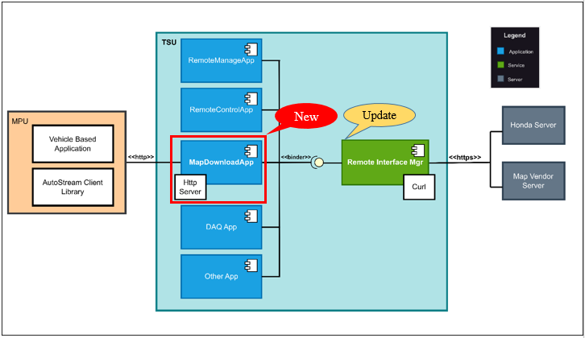
Image reference: doc_image_004.png

Figure 4 Proposal 1 (HLD)

RemoteIF Manager will be responsible for Map download and authentication with the server.

Map Download App will be responsible as an HTTP server to listen requests from MPU.

The Remote Interface Mgr communicates with the App (not only Map Download App but also other apps) via Binder, the binder buffer size is 1MB for all transactions in a process and frequent binder transactions with a large amount of data will be impacted.

Low Level Design

Component Diagram

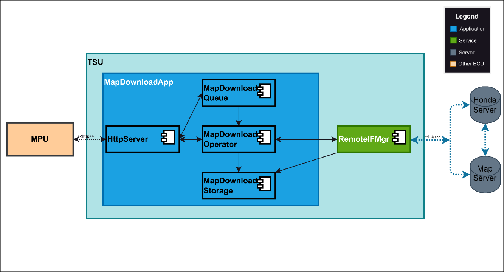
Image reference: doc_image_005.png

Figure 5 Component Diagram Proposal 1 (LLD)

Detail main components in Map Download app:

HttpServer: Start server and listen/accept client requests from MPU

MapDownloadQueue: Store pending tasks when the maximum number of connections is reached

MapDownloadOperator: Convert Http request, send request to RIM and receive the response

MapDownadloadStorage: Manage map repository

Sequence Diagram

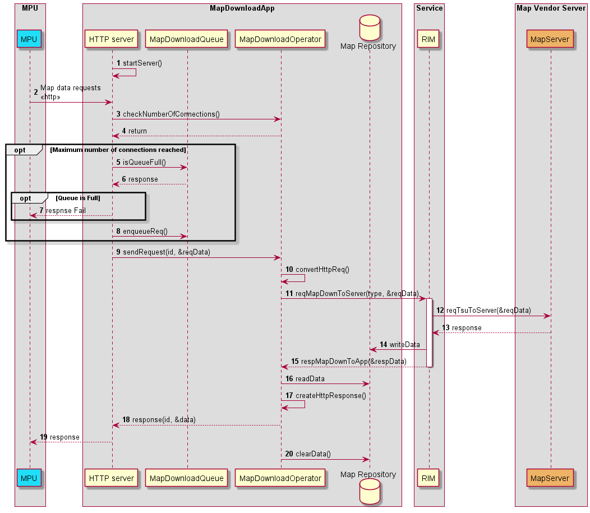
Image reference: doc_image_006.png

Figure 6 Process the Map download request - Proposal 1

Table 7 Process the Map Download request

## Table
| Step | Description |
| --- | --- |
| 1 | Start the server and listen to HTTP requests from MPU |
| 2 | Map data requests |
| 3 | Check the number of connections in progress |
| 4 | Return numOfConn (In case numOfConn reached to max (5), add the request in to Queue) |
| 5 | Check Queue size |
| 6 | Return state of Queue |
| 7 | Response to MPU (fail) in case Queue size is full |
| 8 | Store pending requests in Queue |
| 9 | Forward request |
| 10 | Convert to Https request |
| 11 | Send Map Download request to RemoteIF Mgr |
| 12 | RemoteIF Mgr send reques to the Server |
| 13 | Map data response |
| 14 | Write Map data to File |
| 15 | Response Map download from RemoteIF (Id, status) |
| 16 | Read Map Data |
| 17 | Create HTTP response |
| 18 | Response Map Data |
| 19 | Response Map Data |
| 20 | Clear Map data in the file (response success) |

Image reference: doc_image_007.png

Figure 7 Process remaining requests - Proposal 1

Figure 8 Failure/Resend request – Proposal 1

Image reference: doc_image_008.png

Class Diagram
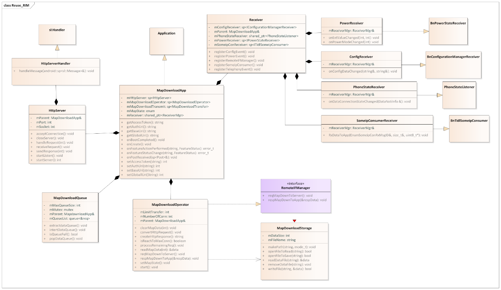
Image reference: doc_image_009.png

Figure 9 Class Diagram - Proposal 1

Table 8 Main Class description

## Table
| Class | Description |
| --- | --- |
| MapDownloadApp | Main class of Map Download App |
| Http Server | Manage HTTP server: start/stop server, listen request |
| MapDownloadQueue | Store pending tasks when the maximum number of connections is reached |
| MapDownloadOperator | Convert Http request, send request to RIM and receive the response |
| MapDownadloadStorage | Manage map repository |
| Receiver | Register, receive event changes from other services |

Proposal 2: Map Download App communicates directly with the Server

Reason for proposing this design:

In the first proposal, shared memory was used to transmit map data from the service to the app, which raised concerns about latency.
To meet the non-functional requirements (NR-1, NR-2) regarding high frequency and large download volumes, I propose using the MapDownload App to communicate directly with the server.

High Level Design
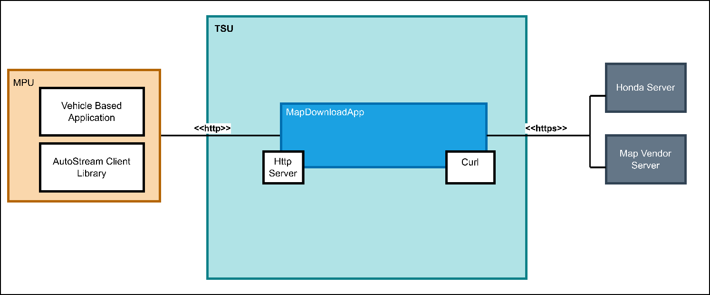
Image reference: doc_image_010.png

Figure 10 Proposal 2 (HLD)

Map Download App will be responsible for communicating with both CPU and Server.

Map Download App will use lib Curl to communicate with the Server.

Low Level Design

Component Diagram
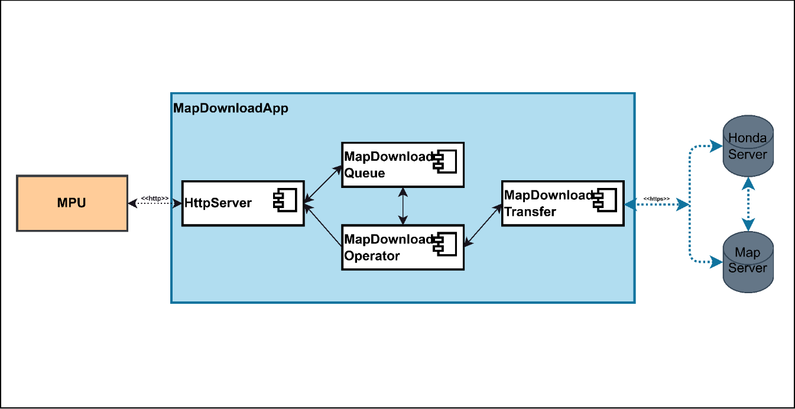
Image reference: doc_image_011.png

Figure 11 Component Diagram Proposal 1 (LLD)

Detail main components in Map Download app:

HttpServer: Start server and listen/accept client requests from MPU.

MapDownloadQueue: Store pending tasks until the worker threads is available.

MapDownloadOperator: Pre-initial and manage worker threads (It can be reused).

MapDownadloadTransfer: Convert from Http to Https then send the request to the server (use lib Curl), receive Map data response.

Sequence Diagram
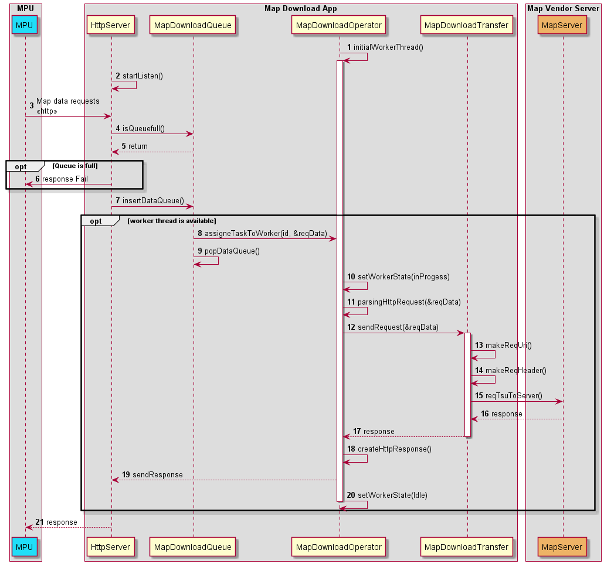
Image reference: doc_image_012.png

Figure 12 Process the Map download request - Proposal 2

Table 9 Process the Map Download request

## Table
| Step | Description |
| --- | --- |
| 1 | Initial worker threads (5 worker threads) |
| 2 | Start the server and listen to HTTP requests from MPU |
| 3 | Map data requests |
| 4 | Check Queue size |
| 5 | Return state of Queue |
| 6 | Response to MPU (fail) in case Queue size is full |
| 7 | Insert request to Queue |
| 8 | Assigne task to woker thread (in case of worker thread is available) |
| 9 | Pop request from Queue |
| 10 | Set state of worker (in progress) |
| 11 | Passing HTTP request |
| 12 | Forward the request |
| 13 | Create HTTPS request (make ReqUri) |
| 14 | Create HTTPS request (make header) |
| 15 | Send Map download request to the Server |
| 16 | Map Data response |
| 17 | Response |
| 18 | Create HTTP response |
| 19 | Response |
| 20 | Set state of worker (Idle) |
| 21 | Resposne to MPU |

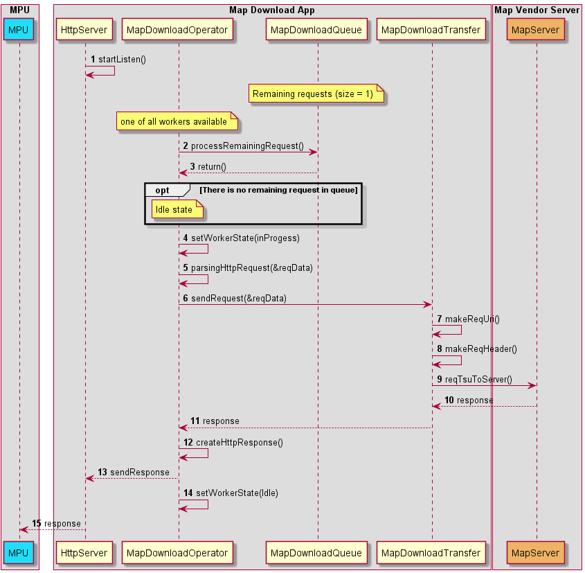
Image reference: doc_image_013.png

Figure 13 Process remaining requests - Proposal 2

Class Diagram
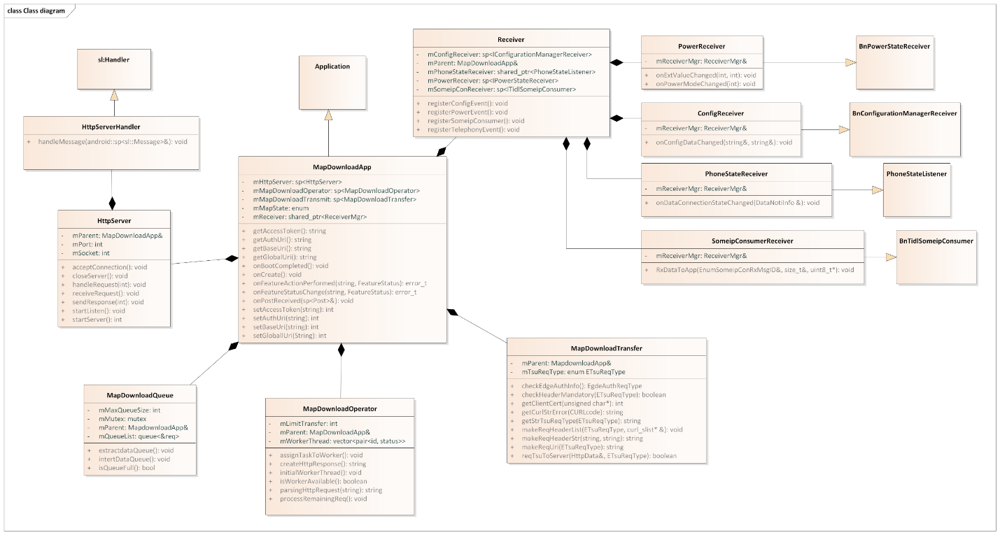
Image reference: doc_image_014.png

Figure 14 Class Diagram - Proposal 2

Table 10 Main Class description

## Table
| Class | Description |
| --- | --- |
| MapDownloadApp | Main class of Map Download App |
| Http Server | Manage HTTP server: start/stop server, listen request |
| MapDownloadQueue | Store pending tasks until the worker threads is available |
| MapDownloadOperator | Pre-initial and manage worker threads |
| MapDownadloadTransfer | Convert from Http to Https then send the request to the server (use lib Curl), receive Map data response |
| Receiver | Register, receive event changes from other services |

Architectural Decision

Proposal Comparison

Based on the quality attributes and tactics, we have a comparison table below.

Table 11 Proposal Comparison

## Table
| Quality attributes | Priority | Proposal 1 Reuse Remote Interface Manager | Proposal 2 MapDownloadApp communicate directly with the server |
| --- | --- | --- | --- |
| Reliability | High | High - Able to handle multiple connections at the same time and remaining requests are queued | High - Able to handle multiple connections at the same time and remaining requests are queued |
| Modifiability, Reusability | High | High - This is a common design, the newly added will be reused on this | Low - Can’t reuse, need to re-implement |
| Performance | Medium | Medium - Concern about latency when using map repository | High - Send the map data directly after receiving response from the server |
| Maintainability | Medium | High - Easy to maintain because the role of each module is separated | Medium - Manage multiple threads in the app side - Duplicate logic when communicating with the server |

Therefore, we use Proposal 1: Reuse Remote Interface Manager, It is familiar to us and better than reusability modifiability, and maintainability

Evaluation Results and Development Plan

Evaluation Results

This is a result of simulating testing with the test server (Currently, we can’t access the Honda Map server without the certificate => will request Honda)

Figure 15 Map Download completion chart

Based on the test result, both two proposals meet the target time for download completion

Development Plan

Currently, this is the development plan, it can be applied in the Honda MY26 project soon
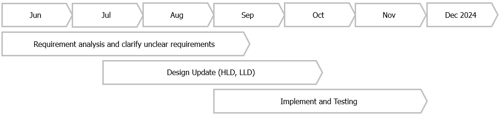
Image reference: doc_image_015.png

Figure 16 Development Plan

Appendix

Authentication Diagram

Image reference: doc_image_016.png

Figure 17 Authenticaion Diagram
