# Raw Slide Content

- Source file: FA_dang.cao/FA_Certification_New_App_Design_for_Map_Download_feature_final.pptx1
- Total slides: 23

## Slide 1

FA Project Certification
New App Design for Map Download Feature in Honda TSU

Candidate: Cao Hai Dang
Supervisor: Mr. BY Kim
2024, Oct

Image reference: slide_01_image_01.png

## Slide 2

TABLE CONTENT

Architecture Design Proposals

Comparison & Verification

Module Overview

 Q&A

Requirement

1

3

4

5

2

## Slide 3

1. Overview of Map Download

The MPU unit and ADAS unit use map information and probe data for autonomous driving. In the vehicle, the TSU communicates with the MPU unit and ADAS unit via Ethernet. The MPU requests to download map data from the Map server through the TSU

TSU: Telematics System Unit
MPU: Map Position Unit
ADAS: Advanced driver-assistance system

Main actor: TSU
Input: Map request
Output: Map data

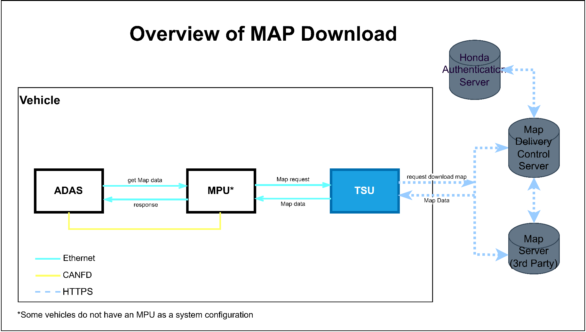
Image reference: slide_03_image_01.png

## Slide 4

1.2 Overview about Honda TSU system

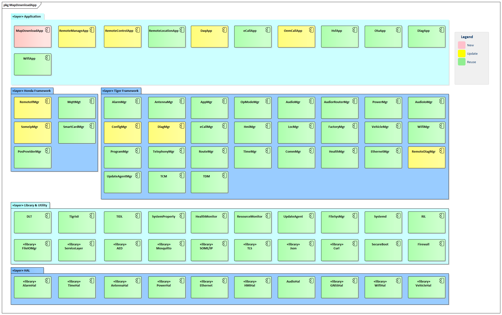
Image reference: slide_04_image_01.png

## Slide 5

2. Requirement of Map Download

2.1 Functional Requirement
FR-1: MPU requests TSU to download the map data list(tiles and layer) around the vehicle ①
FR-2: MPU requests TSU to download from the server for each tile on the list ②
FR-3: TSU communicate with MPU through HTTP and communicate with the Map server using HTTPS
FR-4: Use multiple connections with the server while downloading (up to 5)
FR-5: MPU will retry to send the request if the waiting timer timeout

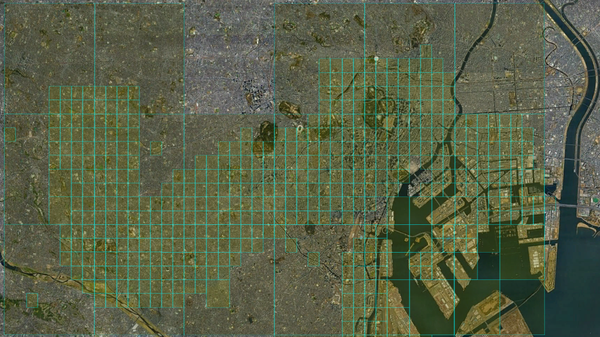
Image reference: slide_05_image_01.png

TSU

MPU

Image reference: slide_05_image_02.png

Map Server

Telematics System Unit

Map Position Unit

①

②

## Slide 6

2. Requirement of Map Download

2.2 Non Functional Requirement
NR1: Frequency of downloading request ①, ② (rough estimate)
NR2: Download volume per communication in ① and ② (rough estimate)

### Table
| Type of map | Communication volume per one time in①※ | Communication volume per one time in②※ |
| HD Map | Request: 9279byte - Body: 1000byte - Header: 8192byte - TLS：5byte - Header under TCP: 82byte Response: 9279byte - Body: 1000byte - Header: 8192byte - TLS：5byte - Header under TCP: 82byte | Request: 8579byte - Body: 300byte - Header: 8192byte - TLS：5byte - Header under TCP: 82byte Response: 38279byte - Body: 30000byte - Header: 8192byte - TLS：5byte - Header under TCP: 82byte |
| SD Map |  |  |

① Download the list tiles around vehicle
② Download each tile on the list

### Table
|  | Travel speed | Frequency performed in ① (rough estimation) | Frequency of ② (rough estimation) | Target time for download completion |
| Startup time | - | - | 1.80 times/sec | 60sec |
| Maximum speed(Target value) | 180km | Every 26.67 seconds | 12.60 times/sec | 26.67sec |
| Normal speed(highway) | 80km | Every 60.00 seconds | 5.60 times/sec | 60.00sec |
| Normal speed(ordinary road) | 60km | Every 80.00 seconds | 4.20 times/sec | 80.00sec |

## Slide 7

### Table
| # | QA Scenarios | Quality Attribute | Priority |
| 1 | The TSU works stable even if using multiple connections while downloading | Reliability | High |
| 2 | The application should be modular, break down into smaller and independent modules that perform specific function. | Modifiability, Reusability | High |
| 3 | Minimize latency and avoid unnecessary CPU usage. | Performance | Medium |
| 4 | The module shall easy to maintain | Maintainability | Medium |

Quality Attribute

2. Requirement

2.2 Non Functional Requirement

Constrains

### Table
|  | Constrains | Type |
| 1 | Map Download app has a role as HTTP server to start and listen client request | Technical constraint |
| 2 | Use lib Curl to communicate with the Server via HTTPS | Technical constraint |

## Slide 8

3. Architecture Design Proposals

3.1 Proposal 1: Reuse Remote Interface Manager to communicate with the Server
3.1.1 High level design

Pros:
Compliance Single responsibility principle
Easy to modify if there is a spec change
Easy to implement and maintain
Cons:
Performance: Need to use shared memory (concern about latency)

Remote Interface Manager (RIM) is an existing service.
In the Honda project, RIM is responsible for communication between the TSU and the server.
Roles of the Remote Interface Manager (RIM):
- Add new API to support the MapDownload app
- Handle authentication
- Download map data
Roles of the MapDownload App:
- Act as an HTTP server (listens to client requests from the MPU)
- Manage the map repository

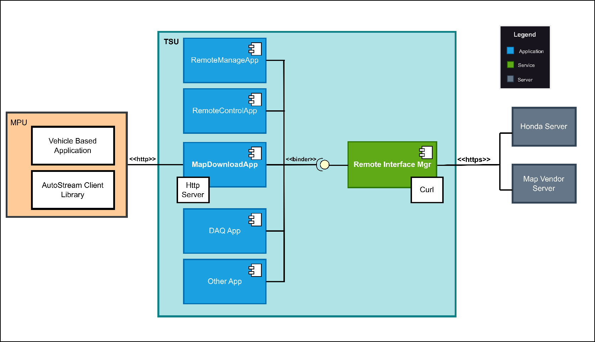
Image reference: slide_08_image_01.png

New

Update

## Slide 9

3. Architecture Design Proposals

3.1.2 LLD - Component Diagram

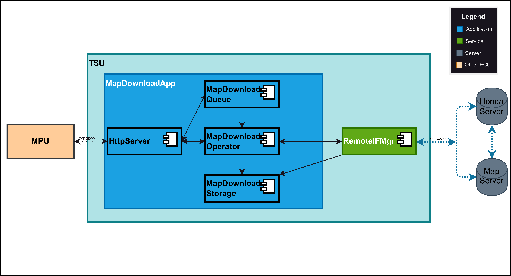
Image reference: slide_09_image_01.png

HttpServer: Start server and listen/accept client requests from MPU
MapDownloadQueue: Store pending tasks when the maximum number of connections is reached
MapDownloadOperator: Convert Http request, send request to RIM and receive the response
MapDownadloadStorage: Manage map repository

3.1 Proposal 1: RIM service will be updated

## Slide 10

3. Architecture Design Proposals

Proposal 2: MapDownloadApp communicate directly with the server
3.2.1 High level design

Pros:
- Performance: There is no latency during data transferring.
Cons:
- Manage multiple threads
- Duplicate responsibility with RIM (Single responsibility principle)

MapDownloadApp Role:
Http server (listen client request from the MPU)
Convert Http <-> Https
Authentication
Manage multi threads
Download Map data (use lib Curl)

Image reference: slide_10_image_01.png

## Slide 11

3. Architecture Design Proposals

Proposal 2: MapDownloadApp communicate directly with the server (Using threads pool to support multiple requests)

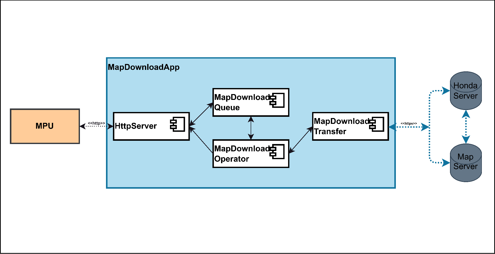
Image reference: slide_11_image_01.png

HttpServer: Start server and listen/accept client requests from MPU
MapDownloadQueue: Store pending tasks until the worker threads is available
MapDownloadOperator: Pre-initial and manage worker threads (It can be reused)
MapDownadloadTransfer: Convert from Http to Https then send the request to the server (use lib Curl), receive response

3.1.2 LLD - Component Diagram

## Slide 12

4.1 Comparison

### Table
| Quality attributes | Priority | Proposal 1 Reuse Remote Interface Manager | Proposal 2 MapDownloadApp communicate directly with the server |
| Reliability | High | High - Able to handle multiple connections at the same time and remaining requests are queued | High - Able to handle multiple connections at the same time and remaining requests are queued |
| Modifiability, Reusability | High | High - This is a common design, the newly added will be reused on this | Low - Can’t reuse, need to re-implement |
| Performance | Medium | Medium - Concern about latency when using map repository | High - Send the map data directly after receiving response from the server |
| Maintainability | Medium | High - Easy to maintain because the role of each module is separated | Medium - Manage multiple threads in the app side - Duplicate logic when communicating with the server |

I decide to choose the proposal 1: Reused Remote Interface Manager

## Slide 13

4.2. Detailed design for the selected proposal

Proposal 1: Remote Interface Manager service update (LLD)

Image reference: slide_13_image_01.png

Limit numOfConn at the same time (5)

## Slide 14

4.3. Verification result

Simulate testing uses the cellular network (4G)
-> Both two proposals meet the target time for download completion

### Table
|  | Travel speed | Frequency performed in ① (rough estimation) | Frequency of ② (rough estimation) | Target time for download completion |
| Startup time | - | - | 1.80 times/sec | 60sec |
| Maximum speed(Target value) | 180km | Every 26.67 seconds | 12.60 times/sec | 26.67sec |
| Normal speed(highway) | 80km | Every 60.00 seconds | 5.60 times/sec | 60.00sec |
| Normal speed(ordinary road) | 60km | Every 80.00 seconds | 4.20 times/sec | 80.00sec |

## Slide 15

4.4. Development Plan

Jun

Requirement analysis and clarify unclear requirements

Design Update (HLD, LLD)

Implement and Testing

Jul

Aug

Sep

Oct

Nov

Dec 2024

## Slide 16

5. Q&A

Q&A

Thank you for listening!

## Slide 17

Appendix

1. Process remaining requests (proposal 1)

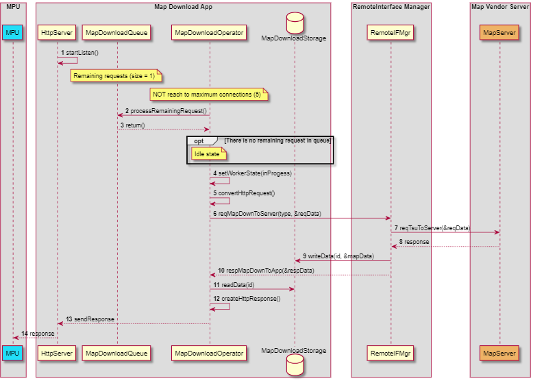
Image reference: slide_17_image_01.png

## Slide 18

Appendix

Image reference: slide_18_image_01.png

1. Process remaining requests (proposal 2)

## Slide 19

Appendix

2. Map Download Class Diagram (proposal 1)

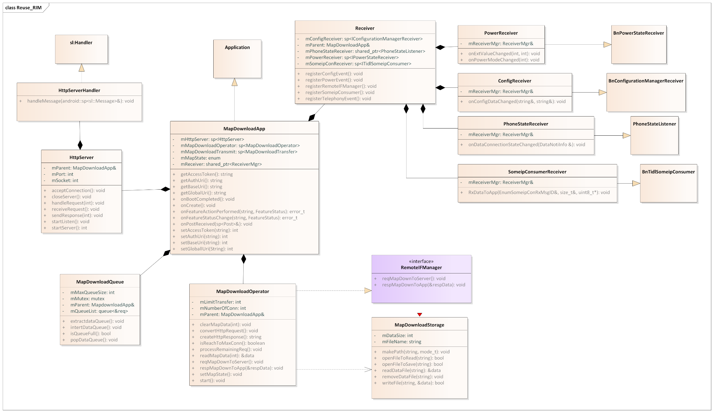
Image reference: slide_19_image_01.png

## Slide 20

Appendix

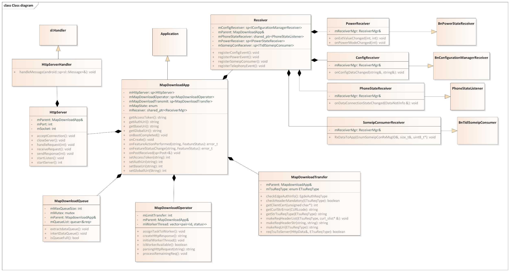
Image reference: slide_20_image_01.png

2. Map Download Class Diagram (proposal 2)

## Slide 21

Appendix

3. Authentication sequence

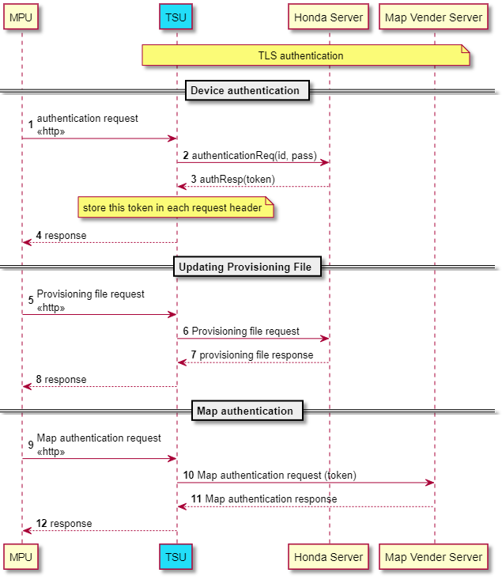
Image reference: slide_21_image_01.png

## Slide 22

Appendix

4. Failure/resend sequence (proposal 1)

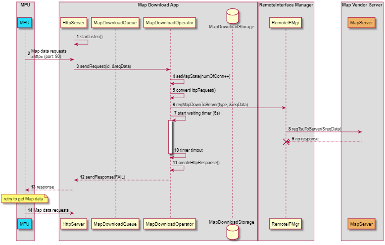
Image reference: slide_22_image_01.png

## Slide 23

Appendix

Image reference: slide_23_image_01.png

Proposal 2: MapDownloadApp communicate directly with the server
LLD–Sequence Diagram

Limit numOfWorker at the same time (5)

