# Raw Slide Content

- Source file: FA_Dao Viet Phuong/Hierarchical state machine pattern for PM_phuong2.dao.1.0final.pptx
- Total slides: 29

## Slide 1

LGE Internal Use Only

Hierarchical State Machine Pattern
for Power Manager in GEN12

Image reference: slide_01_image_01.png

FT5 - LG Vehicle Solution DCV
Oct 4th, 2022

Presenter: Phuong DAO
Mentor: Mr. Joon Namkoong

## Slide 2

Contents

Problem Identification
Architectural Alternatives
Architectural Decision
Q&A

2

## Slide 3

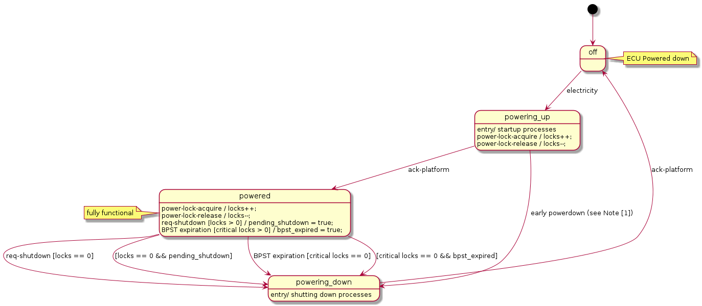
Image reference: slide_03_image_01.png

Problem Identification

3

System Constrain of booting time: < 2 seconds from cold boot.
Power state requirements for GMS:
GM power states: off, powering_up, powering_down, powered

GM Power state machine

## Slide 4

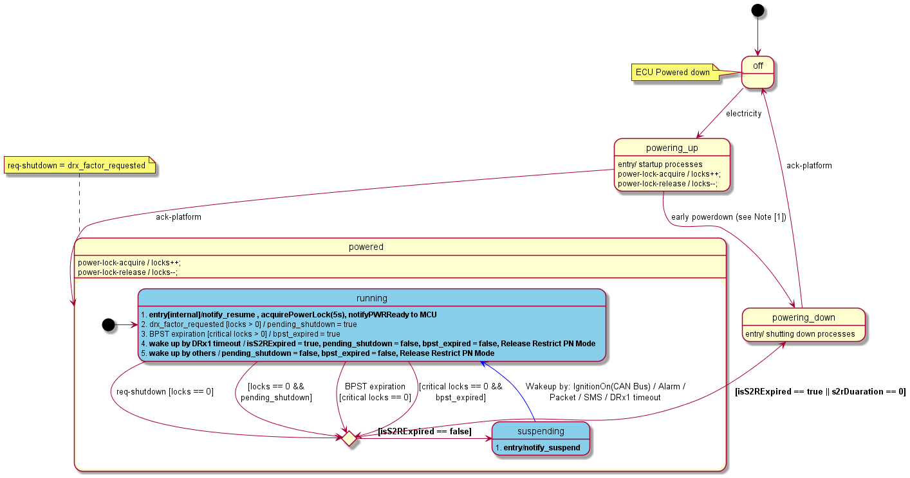
Image reference: slide_04_image_01.png

GM power state change request(CR)

Using suspend to ram instead of shutdown the system.
The system ready after 5 seconds from waking up.
Adding running and suspending sub-states

4

Power state machine after CR

Problem: How to implement the state machine and support change requests effectively.

## Slide 5

Power Service components diagram

5

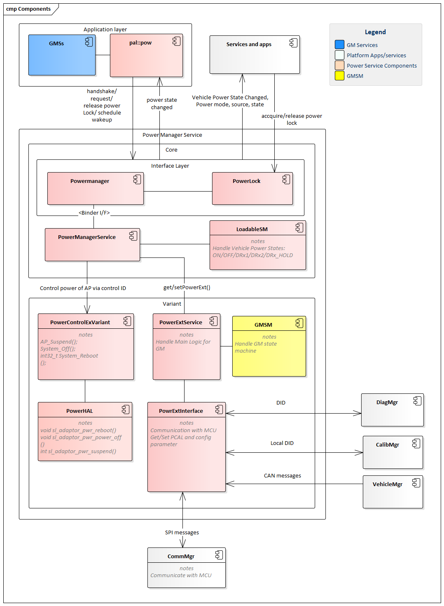
Image reference: slide_05_image_01.png

## Slide 6

Contents

Problem Identification
Architectural Alternatives
Finite State Machine
Hierarchical State Machine
Architectural Decision
Q&A

6

## Slide 7

Proposal 1: Finite State Machine(FSM)

There are many ways to implement an FSM in the Power manager service (loadable state machine, simple FSM, etc.)
FSM using a function pointers table is a dominant way to implement an FSM.

7

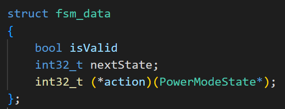
Image reference: slide_07_image_01.png

FSM usually is implemented as a class.
Duplicate code to handle events in sub-states and super state, the exit, and the entry actions.
It may not well satisfy maintainability, modifiability, and reusability.

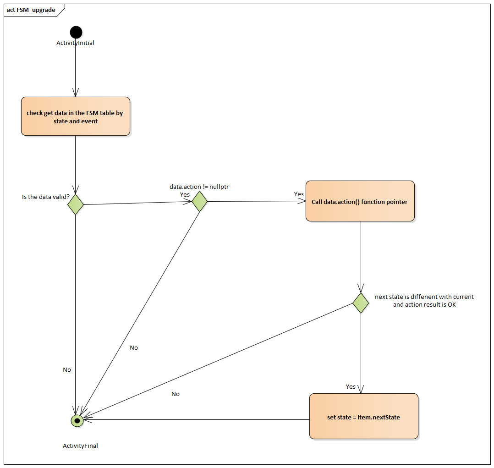
Image reference: slide_07_image_02.png

## Slide 8

Proposal 2: Hierarchical state machine(HSM)

8

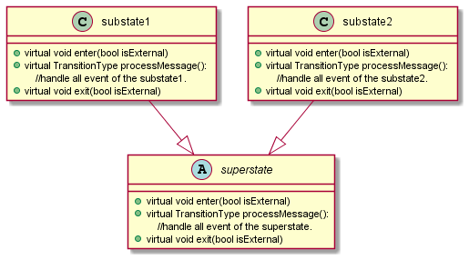
Image reference: slide_08_image_01.png

To satisfy quality attributes, we apply some tactics as follows:
Reduce size of modules:
Dividing GMSM into sub-modules including a state machine and states
Increase cohesion:
GMSM will only process the logic of the state machine. The states only handle events that are related to the state.
Reduce coupling:
Abstracting the state machine and states
Using the interface injection technique to reduce the coupling rate for the GMSM

Super-state and sub-state idea

(1) Event

(2) Unhandled event

## Slide 9

GMSM Static view before CR

9

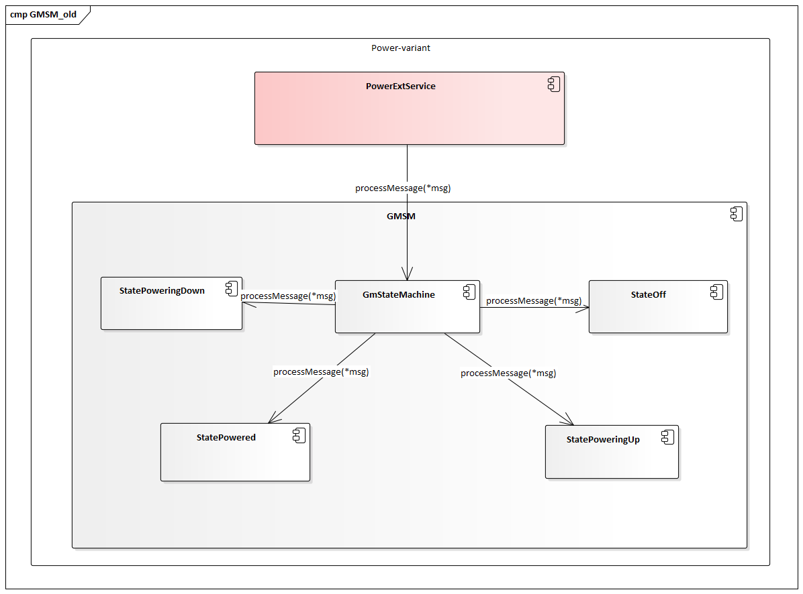
Image reference: slide_09_image_01.png

## Slide 10

GMSM Static view after CR

10

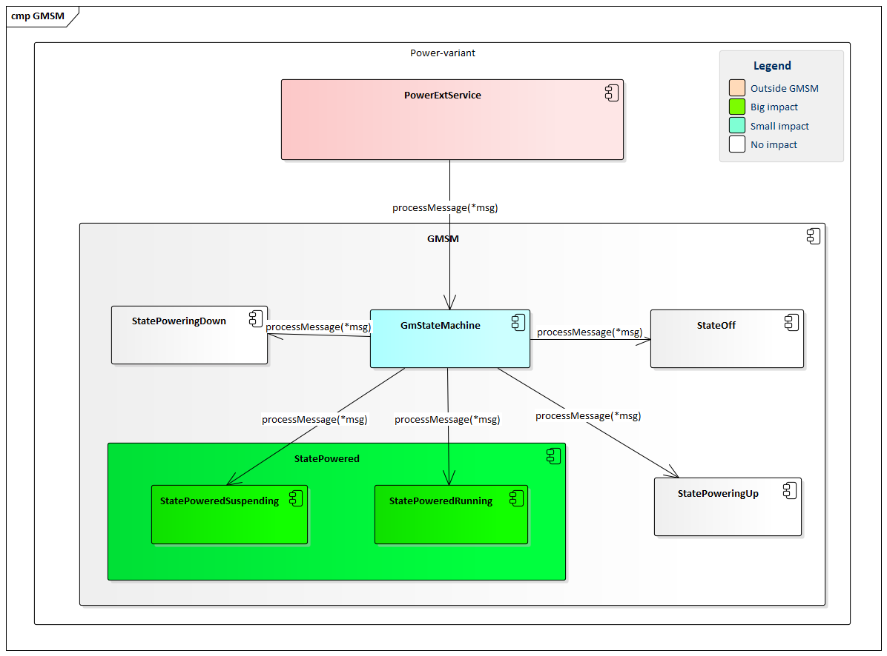
Image reference: slide_10_image_01.png

## Slide 11

Class Diagram before CR

11

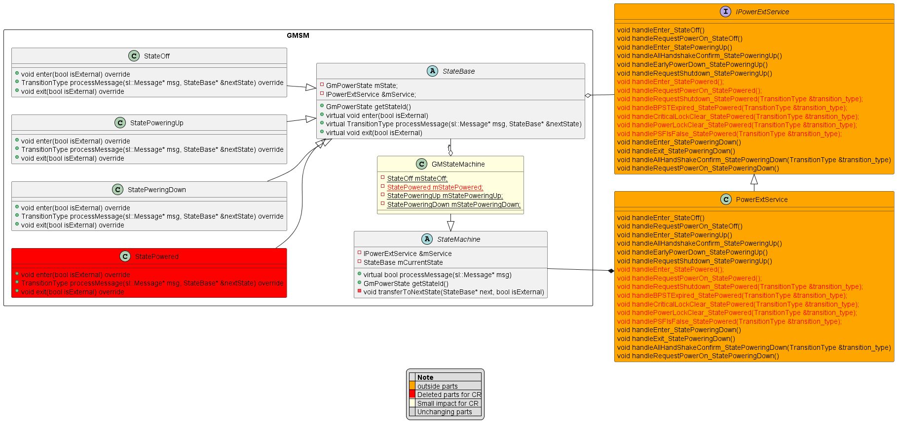
Image reference: slide_11_image_01.png

## Slide 12

Class Diagram after CR

12

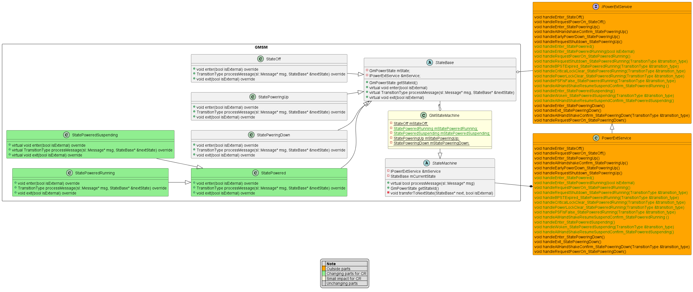
Image reference: slide_12_image_01.png

## Slide 13

Enter and Exit method of states

Enter() method

13

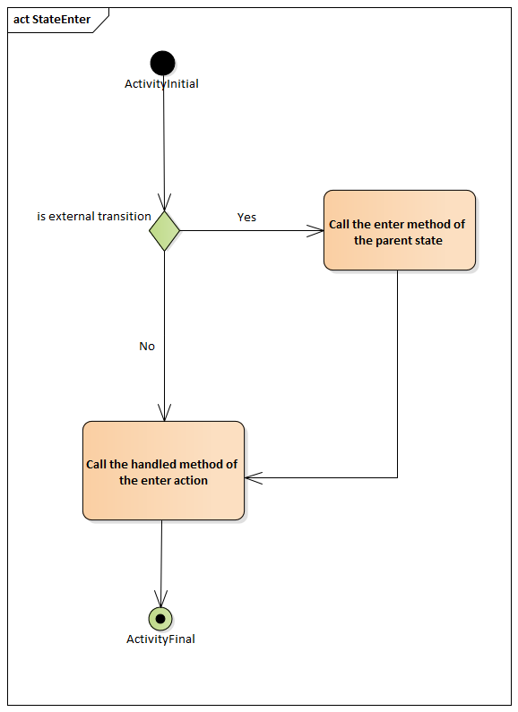
Image reference: slide_13_image_01.png

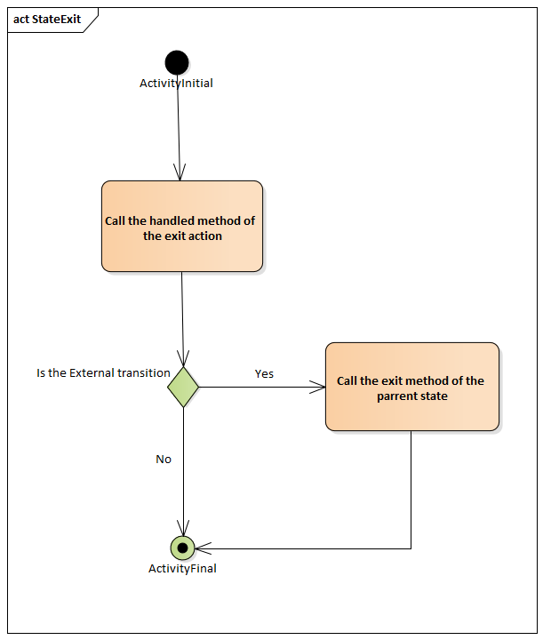
Image reference: slide_13_image_02.png

Exit() method

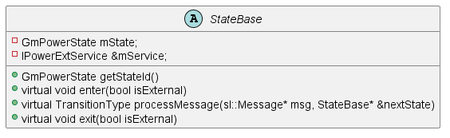
Image reference: slide_13_image_03.png

## Slide 14

State machine main algorithms

14

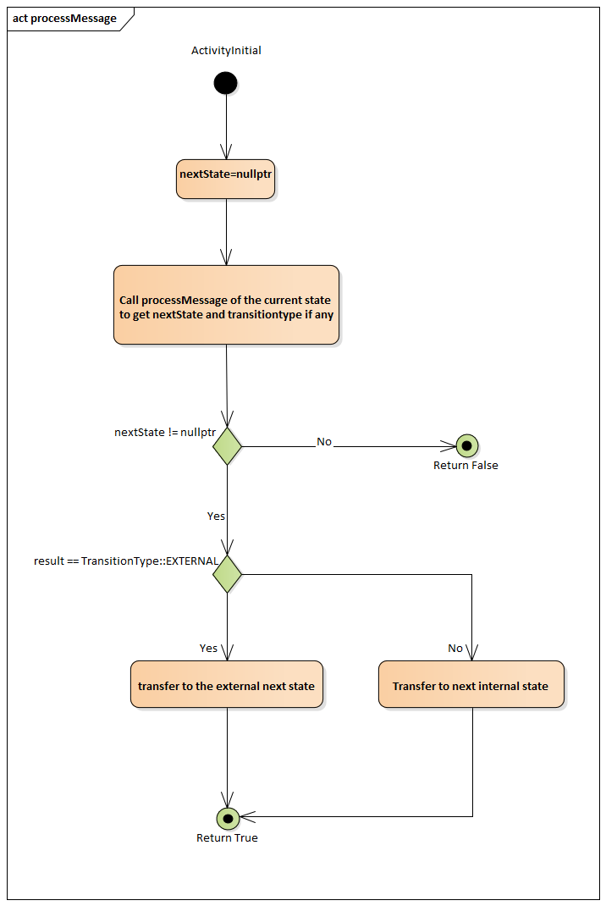
Image reference: slide_14_image_01.png

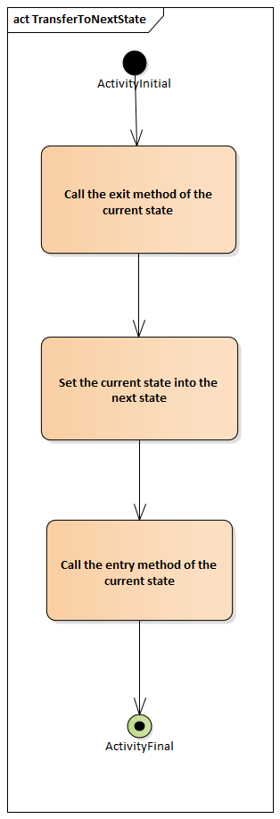
Image reference: slide_14_image_02.png

transferToNextState()

processMessage()

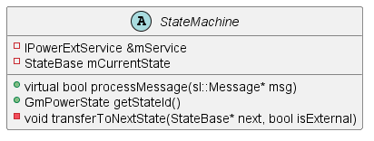
Image reference: slide_14_image_03.png

## Slide 15

Contents

Problem Identification
Architectural Alternatives
Architectural Decision
Q&A

15

## Slide 16

Proposal Comparison

16

### Table
| ID | Quality Attribute | Quality Attribute Scenario | FSM | HSM |
| QA-01 | Maintainability | The power manager service should support change requests of the power state design from OEM. | Mid | High |
| QA-02 | Modifiability | The power manager service should change only elements related to the change request. | Mid | High |
| QA-03 | Reusability | The state machine logic should be able to reuse in other designs or systems with a small change. | Low | Mid |

## Slide 17

HSM Pros and Cons

17

Pros:
We can easy to see some advantages as follows:
Using Object-oriented language based on the state pattern.
Easier to read, maintain
Supporting parallel state machines.
Reducing the effort to apply CR.
Lower coupling between components and higher cohesion.
Cons:
The current design only supports 2-layers state machine designs. It needs to be upgraded to support 3 or more layers state machine designs.

HSM is a suitable solution to implement GMSM in the GEN12 project.

## Slide 18

HSM Achievements

Successfully applied the power mode CR in the Gen12 project.
The code is readable and maintainable.
Significantly reduced the effort when applying CR
Reused the state machine for the power manager service in the TOY 24DCM project.

18

HSM has been applied for the Gen12 project and achieved significant success.

## Slide 19

Q&A

19

Image reference: slide_19_image_01.png

## Slide 20

Appendix

20

## Slide 21

Proposal 1.0: Using Loadable State Machine

21

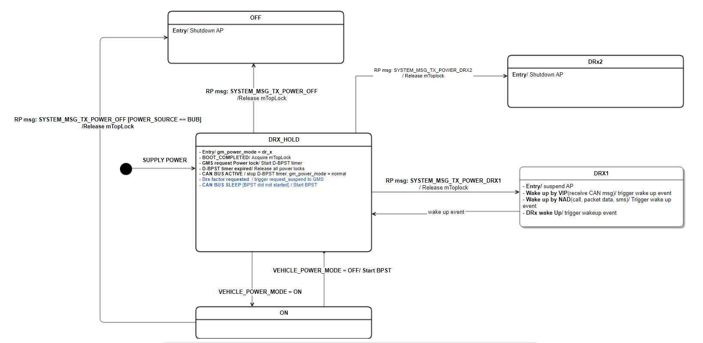
Image reference: slide_21_image_01.png

It cannot satisfy the maintainability, modifiability, and reusability attributes.

GM Power states are powered, off, powering_up, and powering_down.

## Slide 22

Proposal 1.1: Finite state machine

22

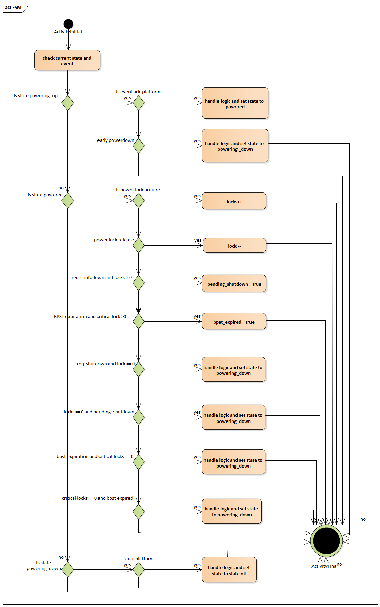
Image reference: slide_22_image_01.png

 We can enhance the FSM using the function pointers table.

## Slide 23

http://collab.lge.com/main/display/GENXII/GM+Gen12+Power+Cycle+Measurement
http://vlm.lge.com/issue/browse/GENXII-3366?attachmentSortBy=dateTime&attachmentOrder=asc

23

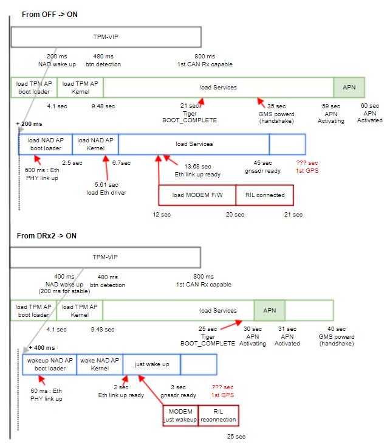
Image reference: slide_23_image_01.png

GM Gen12 Power Cycle Measurement Before CR

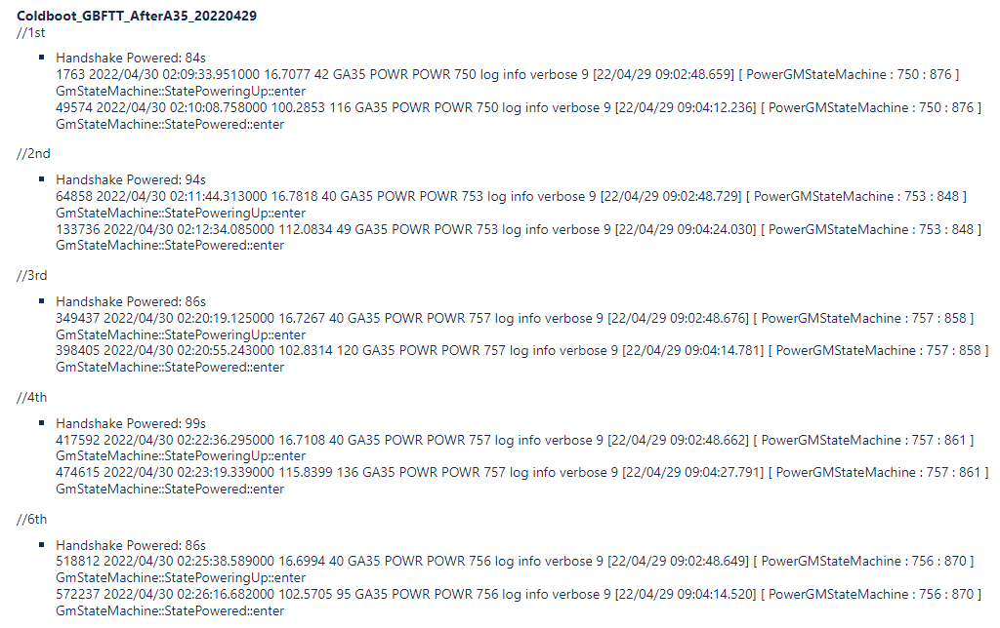
Image reference: slide_23_image_02.png

## Slide 24

http://vlm.lge.com/issue/browse/TIGER-12760?attachmentSortBy=dateTime&attachmentOrder=asc

24

GM Gen12 Power Cycle Measurement After CR

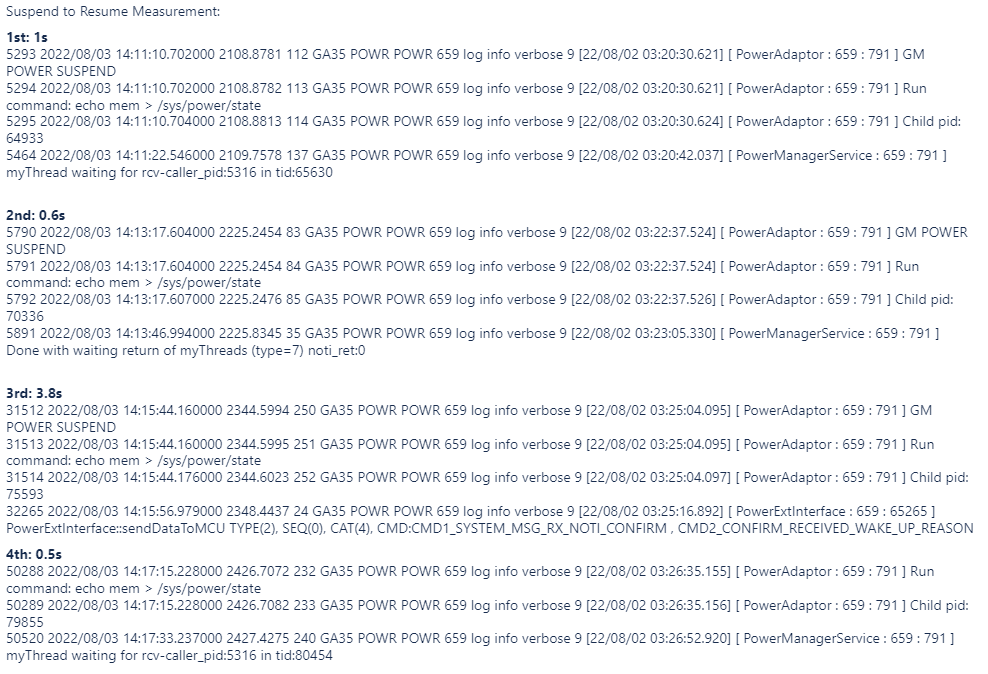
Image reference: slide_24_image_01.png

## Slide 25

Toy 24DCM operation mode

Operation mode for eAS version(HW test):

25

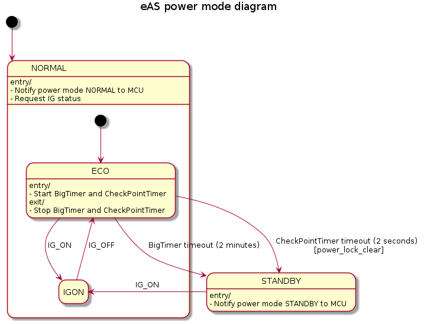
Image reference: slide_25_image_01.png

## Slide 26

Toy 24DCM operation mode

OpModeSM class diagram for eAS version(HW test):

26

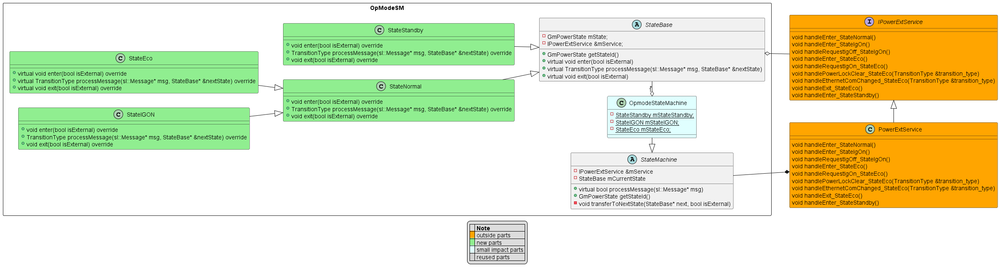
Image reference: slide_26_image_01.png

## Slide 27

Toy 24DCM operation mode (cont.)

27

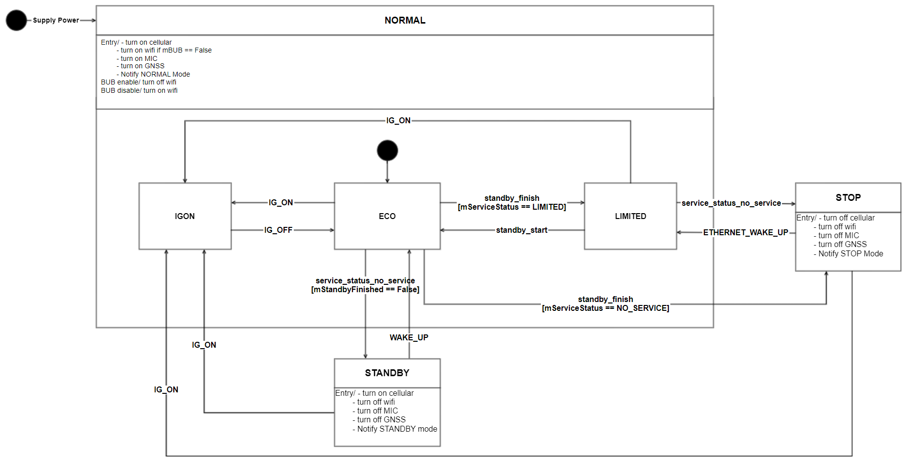
Image reference: slide_27_image_01.png

Operation mode for main version:

## Slide 28

24 DCM Platform Power Modes

28

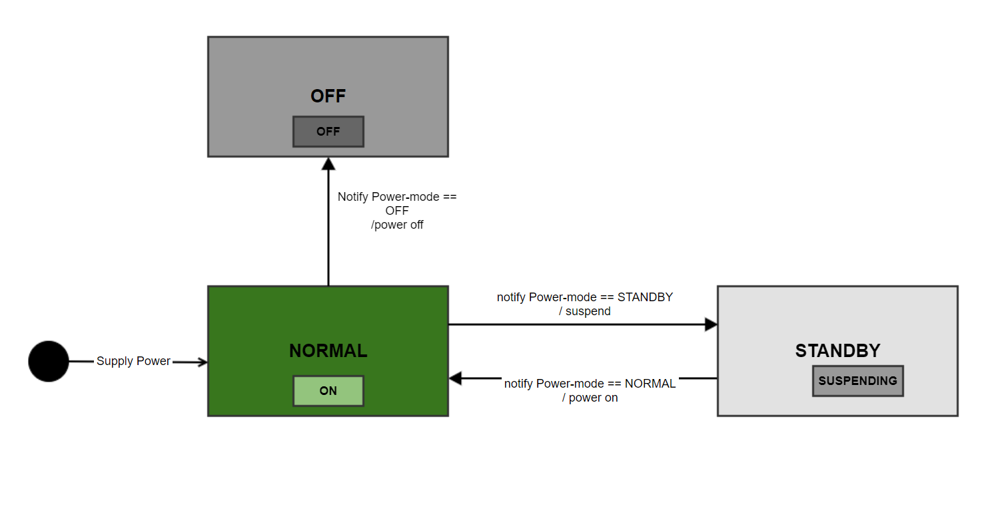
Image reference: slide_28_image_01.png

Power mode design to control platform power:

## Slide 29

End of Document

29

