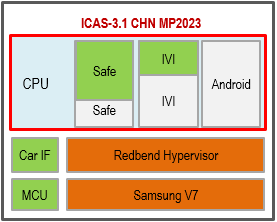
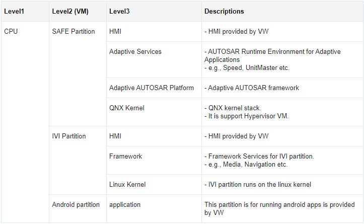
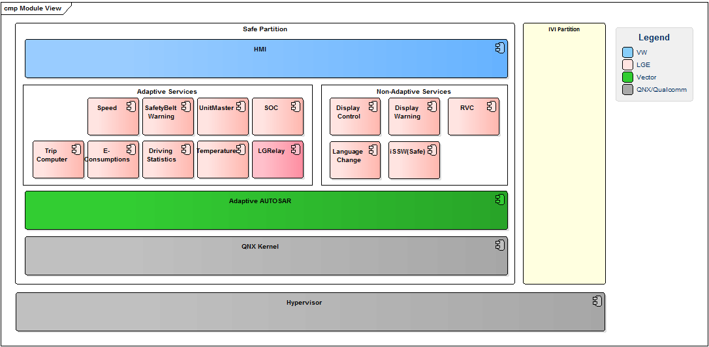
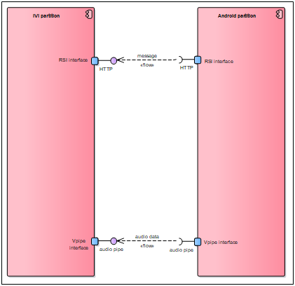
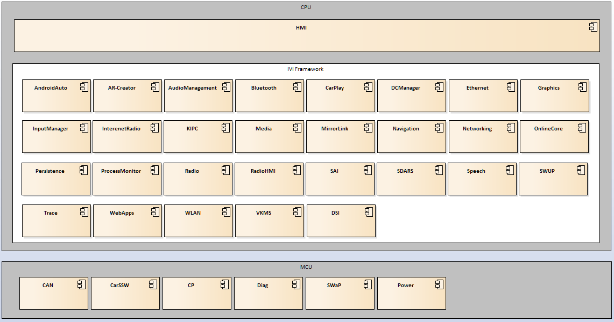
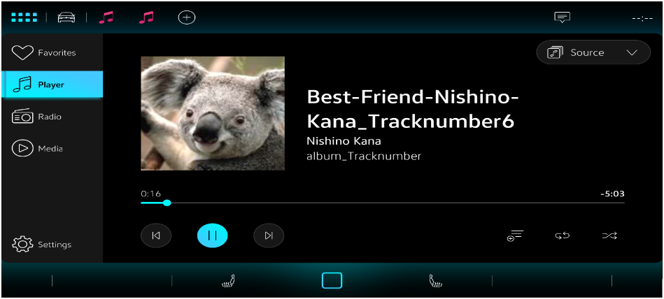
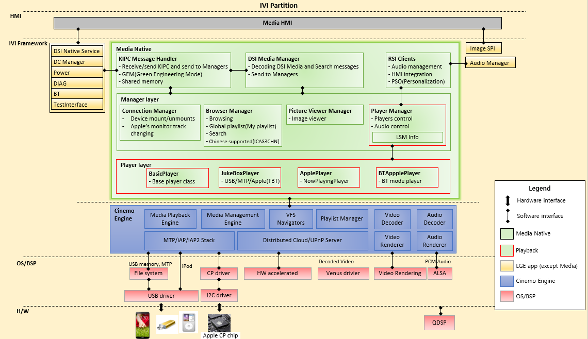

# Raw Document Content

- Source file: FA_Docs_bang.dinh/Handle Cinemo Event in media service_V2.1.1.docx

FA Certification Task – Handling the Cinemo Event in Media service.

By Bang.dinh

Supervised by Mr 황보상규

About this document.

Revision History.

## Table
| Document Version | Date | Content of Change | Author | Reviewer | Approver |
| --- | --- | --- | --- | --- | --- |
| 0.1 | 2023-08-04 | Initial Release | Bang.dinh |  |  |
| 1.0 | 2023-08-23 | - Analyze structure and behavior problems. | Bang.dinh | 황보상규 |  |
| 2.0 | 2023-08-31 | - Change document’s format. - Re-structure document to show the architectural information in a top-down and well-organized manner. - Focus on structure problem to analyze and opt solution. | Bang.dinh | 황보상규 |  |
| 2.1 | 2023-09-12 | - Add function and QA requirement - Judge criteria base on requirement - Add chapter 8 for verification | Bang.dinh | 황보상규 |  |

Table of contents.

Abbreviations / Terms.

## Table
| Abbreviation | Description |
| --- | --- |
| ARA | AUTOSAR Runtime for Adaptive Application |
| AUTOSAR | AUTomotive Open System Architecture |
| CAN | Controller Area Network |
| DSI | Device Service Interface |
| ICAS | In Car Application Server |
| IVI Partition | Virtual machine for In Vehicle Infotainment |
| RSI | Restful Service Interface |
| SAFE Partition | Virtual machine for Cluster |
| SOME/IP | Scalable service-Oriented Middleware over IP |
| ViWi | Volkswagen infotainment Web interface |
| RVC | Rear View Camera |
| SOC | State Of Charge |
| BT | Bluetooth |
| TBT | Track by Track |
| HMI | Human Machine Interface |
| DCM | Device Connection Manager |
| KIPC | Kernel Inter process communication |
| DIAG | Diagnose |

Architectural Drivers.

ICAS3.1 CHN SW architecture has three SW partition.

Image reference: doc_image_001.png

SAFE partition.

IVI partition.

Android partition.

Run on the hypervisor VM.

     Figure 1: ICAS3.1 CHN MP23 partitions

Image reference: doc_image_002.png

SW Architectural Representations.

SAFE Partition.

Image reference: doc_image_003.png

Figure 2: SAFE Partition architecture.

This is the software architectural design of Safe Partition which currently consists of Speed, UnitMaster, Sate of Charging(SOC), TripComputer, E-Consumptions, DrivingStatistics ,Temperature, RVC (Rear View Camera), Language Change, DisplayControl, SafetyBeltWarning, DisplayWarning, iSSW(Safe) and LGRelay modules

Android Partition.

Image reference: doc_image_004.png

ICAS3.1 system provides two interface to Android partition. One interface is RSI interface to communicate with IVI, ICAS1 and OCU. This interface is secured, so Android use this interface for message to communicate with other ECU. The other interface is v-pipe, this interface is only permitted audio streaming date to send IVI partition.

Figure 3: Android Partition interfaces

IVI Partition.

Image reference: doc_image_005.png

Figure 4: IVI partition architecture.

This diagram mainly represents components consisting the ICAS3 (IVI) architecture

HMI and native applications in IVI Framework (Such as Media Native) use DSI and RSI interface for communication.

MCU applications and native applications in IVI Framework use mi-com interface to communicate.

Media Project Overview.

Information.

Image reference: doc_image_006.png

Figure 5: Media HMI Application.

Media application is a most important app on the Head Unit. It gives to user ability to play music, video from different devices such as USB, Apple, Android devices in the following sources:

My Media source

BT source

Media application plays a role as HMI to interact with user and Media native plays a role as a service to perform requests from Media app.

This document will focus on Media native (Media service), which is being ran on IVI partition as shown earlier.

Media Native Architecture.

Image reference: doc_image_007.png

Figure 6: Media Native architecture in IVI partition.

## Table
| Component | Description |
| --- | --- |
| KIPC Message Handler | - Receive/send KIPC and send to Managers - GEM(Green Engineering Mode) - Shared memory |
| DSI Media Manager | - Decoding DSI Media and Search messages - Send to Managers |
| RSI Clients | - Audio management - HMI integration - PSO(Personalization) |
| Connection Manager | - Device mount/unmount. - Apple’s monitoring track’s change |
| Browser Manager | - Browsing - Global playlist (My Playlist) - Search - Chinese Supported |
| Picture Viewer Manager | - Image viewer |
| Player Manager | - Players control for playback feature - Audio control |
| BasicPlayer | - Based player class |
| JukeBoxPlayer | - Control playback for USB/MTP/Apple(TBT player) via Player Manager in My Media source |
| ApplePlayer | - Control playback for Apple Now Playing Player via JukeboxPlayer in My Media source |
| BTAppplePlayer | - Control playback for Bluetooth Apple both TBT and Now Playing Player via Player Manager in BT source |
| Cinemo Engine | - Cinemo Engine (Cinemo SDK) is high-quality and ultra-fast infotainment solutions allow car makers to deliver a PC and home entertainment like concept to the car. |
| DSI Native Service | - The service play a role to transport DSI messages between HMI and services |
| DC Manager | - Provide device’s information when plugging/unplugging to HU |
| Power | - Provide system’s power states (Power on/off/Idle …) |
| DIAG | - Provide information to enable/disable features in media native |
| BT | - Bluetooth service, provide information when connecting/disconnecting Apple device via Bluetooth |
| TestInterface | - Provide information for testing tool |
| Audio Manager | - Control Audio’s rights |

Feature.

Connection Feature.

Handling connection’s events which are provided by DCM for USB, Apple USB, MTP devices. Then mounting them into Cinemo Management Manager service to manage and use. It also detects errors from inserted devices and inform to Media HMI to notify to user via Pop-Ups.

Browser Feature.

Handling requests that related to browser from Media HMI app such as browsing, managing user playlist (such as Global Playlist), searching local songs, Chinese support.

Playback Feature.

The following components:  PlayerManager, BasicPlayer, JukeboxPlayer, ApplePlayer, BTApplePlayer. They are responsible for Playback feature.

PlayerManager: Play a role of Manager to handle requests from Media HMI app as:

Playback control : Play/Pause/FastForward/FastRewind/Next/Prev.

Playback mode control as Shuffle, Repeat One, Repeat All, Shuffle Repeat Off.

Source change.

Playback error handling.

BasicPlayer: A based player class, it is interface to PlayerManager interact with Player’s objects and contain common methods which are used in Player classes.

JukeBoxPlayer:

In case source is My Media and device is USB/MTP/Apple (TBT player), JukeboxPlayer will be called by PlayerManager to perform playback control, playback mode requests via Cinemo’s APIs.

After performing requests, Cinemo will return events to inform current player and playlist status. JukeboxPlayer will handle those events.

ApplePlayer:

In case source is My Media and device is Apple but track is being played from Apple device (Now Playing Player), ApplePlayer will be called by JukeboxPlayer to perform playback control, playback mode requests via Cinemo’s APIs.

Cinemo also will return events to inform current player and playlist status. ApplePlayer will handle those events.

BTApplePlayer:

In case source is BT and device is Apple and track could be played either from Head Unit or Apple device, BTApplePlayer will be called by PlayerManager to perform playback control, playback mode requests via Cinemo’s APIs.

BTApplePlayer also handle events that Cinemo return to know current player and playlist status.

End to End System.

Media Native receives HMI’s requests via DSI interface and re-act again also via DSI.

The requests is dispatched to PlayerManager via message queue.

PlayerManager calls corresponding player base on current active source to handle request via interface is BasicPlayer.

Player calls Cinemo APIs to perform the request.

Cinemo returns events via ICinemoEventQueue to Player to continue to handle.

Project’s Scope.

Media Native is a part of middleware component in IVI Partition SW.

It is a pair with Media HMI application to handle multimedia’s works on Head Unit.

PlayerManager is a manager to control players: JukeboxPlayer, ApplePlayer, BTApplePlayer to perform playback control, playback mode feature via interface is BasicPlayer.

JukeboxPlayer, ApplePlayer, BTApplePlayer interact with Cinemo via CinemoEventQueue to know actual status after performing Cinemo APIs.

Project Architectural Driver.

Function requirement.

## Table
| ICAS3CHN_RQ_MHD_1 | FEAT_MHD_PLAYTIME_INFORMATION |
| --- | --- |
| ICAS3CHN_RQ_MHD_2 | The system shall present the current playtime of the currently playing audio file/track from each media source (if it is supported). |
| ICAS3CHN_RQ_MHD_3 | The system shall present the current playtime of the currently playing video content from each media source. |
| ICAS3CHN_RQ_MHD_4 | The system shall present the total playtime of the currently playing audio file from each media source. |
| ICAS3CHN_RQ_MHD_5 | The system shall present the total playtime of the currently playing video file from each media source. |
| ICAS3CHN_RQ_MHD_6 | FEAT_MHD_MEDIA_CONTROL_GENERAL |
| ICAS3CHN_RQ_MHD_7 | The system shall be able to read out the play mode status (including e.g. mix and repeat mode) of any connected media device. ) |
| ICAS3CHN_RQ_MHD_8 | The system shall always be in sync with the activated play mode (including e.g. mix and repeat mode) and list status at the corresponding device. |
| ICAS3CHN_RQ_MHD_9 | FEAT_MHD_MEDIA_CONTROL_REPEAT |
| ICAS3CHN_RQ_MHD_10 | The system shall support de-/activating the repeat mode be the end-user. |
| ICAS3CHN_RQ_MHD_11 | Starting the playback in repeat mode shall not abort the playback of the current file. |
| ICAS3CHN_RQ_MHD_12 | The system shall always be in sync with the activated repeat mode at the corresponding device. |
| ICAS3CHN_RQ_MHD_13 | FEAT_MHD_MEDIA_CONTROL_MIX |
| ICAS3CHN_RQ_MHD_14 | The system shall support de-/activating the mix mode by the end-user. |
| ICAS3CHN_RQ_MHD_15 | Starting the playback in mix mode shall not abort the playback of the current file. |
| ICAS3CHN_RQ_MHD_16 | The system shall always be in sync with the activated mix mode at the corresponding device. |
| ICAS3CHN_RQ_MHD_17 | FEAT_MHD_MEDIA_CONTROL_MULTIPLE_CONNECTIONS |
| ICAS3CHN_RQ_MHD_18 | The system shall detect and handle devices which are connected via A2DP/AVRCP and USB cable simultaneously. |
| ICAS3CHN_RQ_MHD_19 | The system should support to switch to playing on Apple device and stop current playing track (Select track from Apple device) |
| ICAS3CHN_RQ_MHD_20 | The system should support to switch to stop current playing track on Apple device and play track on the system(Select track from the system) |
| ICAS3CHN_RQ_MHD_21 | FEAT_MHD_META_INFORMATION_GENERAL |
| ICAS3CHN_RQ_MHD_22 | The system shall present information about the title, which can be include in meta data of the selected file. |
| ICAS3CHN_RQ_MHD_23 | The system shall present information about the artist, which can be include in meta data of the selected file. |
| ICAS3CHN_RQ_MHD_24 | The system shall present information about the album, which can be include in meta data of the selected file. |
| ICAS3CHN_RQ_MHD_25 | The system shall present information about the genre, which can be include in meta data of the selected file. |
| ICAS3CHN_RQ_MHD_26 | The system shall present information about the composer, which can be include in meta data of the selected file. |
| ICAS3CHN_RQ_MHD_27 | The system shall present information about the year, which can be include in meta data of the selected file. |
| ICAS3CHN_RQ_MHD_28 | The system shall present information about the track number, which can be include in meta data of the selected file. |
| ICAS3CHN_RQ_MHD_29 | The system shall present information about the disc number, which can be include in meta data of the selected file. |
| ICAS3CHN_RQ_MHD_30 | The system shall present information about the comment, which can be include in meta data of the selected file. |
| ICAS3CHN_RQ_MHD_31 | FEAT_MHD_META_INFORMATION_COVER_ART |
| ICAS3CHN_RQ_MHD_32 | The system shall support cover art. |

QA requirement.

## Table
| QA ID | Quality attribute | Priority |
| --- | --- | --- |
| ICAS3CHN_QA_1 | Extensibility : The system can be easily extended without impacting other parts of the program. | Medium |
| ICAS3CHN_QA_2 | Resource Utilization : The system should use less than 12 threads, and use system’s resource in an effective way. | Medium |
| ICAS3CHN_QA_3 | Reliability : The system should handle all events from 3rd SDK properly and effectively. | Medium |
| ICAS3CHN_QA_4 | Maintainability : The system should have readability and understandability, with well-defined components and encapsulated functionality. | High |
| ICAS3CHN_QA_5 | Reusability, Modifiability : The system should be modular, break down into smaller, independent modules that perform specific function. | High |

Architectural Analysis.

Current static view of Playback Feature.

Image reference: doc_image_008.emf

Figure 7: Playback Static view

## Table
| Class | Description |
| --- | --- |
| PlayerManager | - Play a role of Manager to handle requests that related to playback from Media HMI. |
| Observer | - An interface to PlayerManager can control enabling/disabling audio to Cinemo via Player classes |
| MakePlaylistThread | - Responsibility for players can make playlist in background. |
| BasicPlayer | - An interface between PlayerManager <-> Player classes. |
| BTApplePlayer | - This player is served for BT source. - Config Now player, Now playlist, TBT Player, TBT Playlist to Cinemo to can control playback and get Cinemo events. - Control playback functions |
| JukeboxPlayer | - This player is served for My Media source. - Config TBT Player, TBT Playlist to Cinemo to can control playback and get Cinemo events. - Initializing for Apple player’s objects ( Apple player will be responsible for Now player in My Media source - Control playback functions for TBT player (play from HU) |
| ApplePlayer | - This player is served for My Media source. - Config Now Player, Now Playlist to Cinemo to can control playback and get Cinemo events. - Control playback functions for Now player (play from Apple device) |
| ICinemoPlayer2 | - Cinemo interface support for all playback features. |
| ICinemoPlaylist | - Cinemo interface support for managing playlist. |
| ICinemoEventQueue | - Cinemo interface allows the calling application to receive events via a thread-safe method |

What problems were considered for current Architectural Driver?

Player Each player plays role of both playback and handle Cinemo events inside.

Difficult for feature maintenance because of complex source code.(QA_04)

Logic to handle Cinemo events is almost the same, but it was implemented independently inside Player’s classes.

 Can not re-use source code, hard to modify when issue happens the same on players.(QA_05)

Let’s check the following sequences of BT source as example:

Image reference: doc_image_009.emf

Figure 9: Control playback in BT source from phone.

Image reference: doc_image_010.emf

Figure 10: Control playback mode in BT source from HeadUnit.

Image reference: doc_image_011.emf

Figure 11: Control playback mode in BT source from phone.

Each player class has been owned one more thread(m_pPlayerThread) to read events from ICinemoEvent, so with 2 sources are My Media and BT source, there will total 2 threads for this task.

 Wasting system’s resource (QA_02)

Because of these problems, Player classes are violating the following principles in designing:

+ “Open Closed Principle”: Player class not only handle playback logic but also handle Cinemo events, so any modification/adding/removing that related to Cinemo event also affect to Player class. Logic for handling Cinemo events was not re-used among classes.

+ “Single Responsibility Principle”: Player class should only handle for playback’s logic, other business should be separated to other sub classes. It makes source code easy for managing and maintaining.

Which Architectural Alternative was considered?

At the moment, there will only one Cinemo event need to handle, so we don’t need multi threads to handle events separately. Only one thread is enough.

Logic business for handling Cinemo Event is almost the same for players, so it will be better if developing a module to handle those events for all players in general way.

Architectural View

Show Architecture and Design in several.

Design 1: Using Chain of Responsibility pattern to handle Cinemo Event outside of player classes.

Image reference: doc_image_012.emf

 Figure 12: Static view new Design 1 for handling Cinemo Event.

## Table
| Class | Description |
| --- | --- |
| PlayerManager | - Play a role of Manager to handle requests that related to playback from Media HMI. |
| Observer | - An interface to PlayerManager can control enabling/disabling audio to Cinemo via Player classes |
| MakePlaylistThread | - Responsibility for players can make playlist in background. |
| BasicPlayer | - An interface between PlayerManager <-> Player classes. |
| BTApplePlayer | - This player is served for BT source. - Config Now player, Now playlist, TBT Player, TBT Playlist to Cinemo to can control playback and get Cinemo events. - Control playback functions |
| JukeboxPlayer | - This player is served for My Media source. - Config TBT Player, TBT Playlist to Cinemo to can control playback and get Cinemo events. - Initializing for Apple player’s objects ( Apple player will be responsible for Now player in My Media source - Control playback functions for TBT player (play from HU) |
| ApplePlayer | - This player is served for My Media source. - Config Now Player, Now Playlist to Cinemo to can control playback and get Cinemo events. - Control playback functions for Now player (play from Apple device) |
| ICinemoEventQueue | - Cinemo interface allows the calling application to receive events via a thread-safe method |
| CinemoEventQueue | - This is singleton class. It will provide a CinemoAutoPtr<ICinemoEventQueue> object to all player, then Players will config to this object to get events from Cinemo. - It has a method is controlHandler(EventSources, bool, PlayerInterface*) to enable/disable handlers in dealing with events. - It also contains a std::thread to responsible for reading event from Cinemo event queue. - Then with Chain of responsibility pattern, it will dispatch events to handler to deal with. |
| Handler | - This is an interface to CinemoEventQueue interact with event’s handlers. |
| BaseEventHandler | - Abstract class to setup common methods for event’s Handlers |
| NowEventHandler | - This handler will handle events of Now player and Now playlist when Apple device interact back to HU |
| TBTEventHandler | - This handler will handle event of TBT player and TBT playlist when use |
| PlayerInterface | - This is an interface to Handlers interact back to player classes. |
| EventSources | - Source ID to recognize where Cinemo event come |

Design 2: Using Observer pattern to handle Cinemo Event outside of player classes.

Image reference: doc_image_013.emf

Figure 13: Static view new Design 2 for handling Cinemo Event.

## Table
| Class | Description |
| --- | --- |
| PlayerManager | - Play a role of Manager to handle requests that related to playback from Media HMI. |
| Observer | - An interface to PlayerManager can control enabling/disabling audio to Cinemo via Player classes |
| MakePlaylistThread | - Responsibility for players can make playlist in background. |
| BasicPlayer | - An interface between PlayerManager <-> Player classes. |
| BTApplePlayer | - This player is served for BT source. - Config Now player, Now playlist, TBT Player, TBT Playlist to Cinemo to can control playback and get Cinemo events. - Control playback functions |
| JukeboxPlayer | - This player is served for My Media source. - Config TBT Player, TBT Playlist to Cinemo to can control playback and get Cinemo events. - Initializing for Apple player’s objects ( Apple player will be responsible for Now player in My Media source - Control playback functions for TBT player (play from HU) |
| ApplePlayer | - This player is served for My Media source. - Config Now Player, Now Playlist to Cinemo to can control playback and get Cinemo events. - Control playback functions for Now player (play from Apple device) |
| ICinemoEventQueue | - Cinemo interface allows the calling application to receive events via a thread-safe method |
| EventPublisher | - This is singleton class. It will provide an CinemoAutoPtr<ICinemoEventQueue> object to all player, then Players will config to this object to get events from Cinemo. - It has a method is subscribe(EventSources, EventSubscriber*) to add a handler to deal with events. - It has a method is unSubscribe(EventSources) to remove a handler. - It also contains a std::thread to responsible for reading event from Cinemo event queue. - Then with Observer pattern, it will dispatch events to handler to deal with via method handle(CinemoEvent). |
| EventSubscriber | - This is an interface to EventPublisher interact with event’s handlers. |
| NowEventHandler | - This handler will handle events of Now player and Now playlist when Apple device interact back to HU |
| TBTEventHandler | - This handler will handle event of TBT player and TBT playlist when use |
| PlayerInterface | - This is an interface to Handlers interact back to player classes. |
| EventSources | - Source ID to recognize where Cinemo event come |

Design comparison.

## Table
| QA | Verification | Current design | Design 1 | Design 2 |
| --- | --- | --- | --- | --- |
| Resource Utilization | Assessing how many threads are used in media native in case connect device to USB port 1, port 2 and via Bluetooth at the same time. | Medium (12 in total, include 2 for handling Cinemo event) | High (11 in total, include 1 for handling Cinemo event) | High (11 in total, include 1 for handling Cinemo event) |
| Reliability | Assessing are event processed for correct player? Is it effective? | High (The event directly handles in each player, not take time to dispatch) | Medium (The event will be processed at correct handler in the chain and stop afterward) | Low (The event will be notified to all handlers) |
| Reusability | Can Cinemo event handling logic reuse among players? Is it possible to reuse in other projects? | Low | High | High |
| Modifiability | Assessing modularization level in playback component (break down into smaller, independent modules that perform specific function). | Low | High | High |
| Maintainability | Assesing complexilty of code, is source code easy to read and understand when need to hand over to new developer? | Low | High | High |

Architecture Decision.

Factors affecting Design Decisions.

Using system’s resource effectively.

Reducing the dependency of handling Cinemo event in the players.

Reducing effort when adding further new Cinemo Event or new Player class.

Design Decision.

Decided as Design 1:

Satifying the function requirement:

## Table
| ICAS3CHN_RQ_MHD_1 | Handled by TBTEventHandler::handleECTime and NowEventHandler::handleECTime and PlayerInterface::updateTime |
| --- | --- |
| ICAS3CHN_RQ_MHD_2 | Handled by TBTEventHandler::handleECTime and NowEventHandler::handleECTime and PlayerInterface::updateTime |
| ICAS3CHN_RQ_MHD_3 | Handled by TBTEventHandler::handleECTime and NowEventHandler::handleECTime and PlayerInterface::updateTime |
| ICAS3CHN_RQ_MHD_4 | Handled by TBTEventHandler::handleECTime and NowEventHandler::handleECTime and PlayerInterface::updateTime |
| ICAS3CHN_RQ_MHD_5 | Handled by TBTEventHandler::handleECTime and NowEventHandler::handleECTime and PlayerInterface::updateTime |
| ICAS3CHN_RQ_MHD_6 | Handled by NowEventHandler::handleECRepeatOrder and PlayerInterface::syncPlaybackMode |
| ICAS3CHN_RQ_MHD_7 | Handled by NowEventHandler::handleECRepeatOrder and PlayerInterface::syncPlaybackMode |
| ICAS3CHN_RQ_MHD_8 | Handled by NowEventHandler::handleECRepeatOrder and PlayerInterface::syncPlaybackMode |
| ICAS3CHN_RQ_MHD_9 | Handled by NowEventHandler::handleECRepeatOrder and PlayerInterface::syncPlaybackMode |
| ICAS3CHN_RQ_MHD_10 | Handled by NowEventHandler::handleECRepeatOrder and PlayerInterface::syncPlaybackMode |
| ICAS3CHN_RQ_MHD_11 | Handled by NowEventHandler::handleECRepeatOrder and PlayerInterface::syncPlaybackMode |
| ICAS3CHN_RQ_MHD_12 | Handled by NowEventHandler::handleECRepeatOrder and PlayerInterface::syncPlaybackMode |
| ICAS3CHN_RQ_MHD_13 | Handled by NowEventHandler::handleECRepeatOrder and PlayerInterface::syncPlaybackMode |
| ICAS3CHN_RQ_MHD_14 | Handled by NowEventHandler::handleECRepeatOrder and PlayerInterface::syncPlaybackMode |
| ICAS3CHN_RQ_MHD_15 | Handled by NowEventHandler::handleECRepeatOrder and PlayerInterface::syncPlaybackMode |
| ICAS3CHN_RQ_MHD_16 | Handled by NowEventHandler::handleECRepeatOrder and PlayerInterface::syncPlaybackMode |
| ICAS3CHN_RQ_MHD_17 | Handled by TBTEventHandler::handleECError and NowEventHandler::handleECMetadata and PlayerInterface::changeToNowPlayer and PlayerInterface::checkChangeToTBTPlayer |
| ICAS3CHN_RQ_MHD_18 | Handled by TBTEventHandler::handleECError and NowEventHandler::handleECMetadata and PlayerInterface::changeToNowPlayer and PlayerInterface::checkChangeToTBTPlayer |
| ICAS3CHN_RQ_MHD_19 | Handled by TBTEventHandler::handleECError and NowEventHandler::handleECMetadata and PlayerInterface::changeToNowPlayer and PlayerInterface::checkChangeToTBTPlayer |
| ICAS3CHN_RQ_MHD_20 | Handled by TBTEventHandler::handleECError and NowEventHandler::handleECMetadata and PlayerInterface::changeToNowPlayer and PlayerInterface::checkChangeToTBTPlayer |
| ICAS3CHN_RQ_MHD_21 | Handled by NowEventHandler::handleECMetaData and PlayerInterface::updateTrackMetaData |
| ICAS3CHN_RQ_MHD_22 | Handled by NowEventHandler::handleECMetaData and PlayerInterface::updateTrackMetaData |
| ICAS3CHN_RQ_MHD_23 | Handled by NowEventHandler::handleECMetaData and PlayerInterface::updateTrackMetaData |
| ICAS3CHN_RQ_MHD_24 | Handled by NowEventHandler::handleECMetaData and PlayerInterface::updateTrackMetaData |
| ICAS3CHN_RQ_MHD_25 | Handled by NowEventHandler::handleECMetaData and PlayerInterface::updateTrackMetaData |
| ICAS3CHN_RQ_MHD_26 | Handled by NowEventHandler::handleECMetaData and PlayerInterface::updateTrackMetaData |
| ICAS3CHN_RQ_MHD_27 | Handled by NowEventHandler::handleECMetaData and PlayerInterface::updateTrackMetaData |
| ICAS3CHN_RQ_MHD_28 | Handled by NowEventHandler::handleECMetaData and PlayerInterface::updateTrackMetaData |
| ICAS3CHN_RQ_MHD_29 | Handled by NowEventHandler::handleECMetaData and PlayerInterface::updateTrackMetaData |
| ICAS3CHN_RQ_MHD_30 | Handled by NowEventHandler::handleECMetaData and PlayerInterface::updateTrackMetaData |
| ICAS3CHN_RQ_MHD_31 | Handled by NowEventHandler::handleECMetaData and PlayerInterface::updateCoverArt |
| ICAS3CHN_RQ_MHD_32 | Handled by NowEventHandler::handleECMetaData and PlayerInterface::updateCoverArt |

Satisfying the QA requirement

## Table
| QA ID | Quality attribute | Priority |
| --- | --- | --- |
| ICAS3CHN_QA_1 | Extensibility : The system can be easily extended without impacting other parts of the program. | Medium |
| ICAS3CHN_QA_2 | Resource Utilization : The system should use less than 12 threads, and use system’s resource in an effective way. | Medium |
| ICAS3CHN_QA_3 | Reliability : The system should handle all events from 3rd SDK properly and effectively. | Medium |
| ICAS3CHN_QA_4 | Maintainability : The system should have readability and understandability, with well-defined components and encapsulated functionality. | High |
| ICAS3CHN_QA_5 | Reusability, Modifiability : The system should be modular, break down into smaller, independent modules that perform specific function. | High |

Internal design.

Setup Cinemo event in each Player class.

Source My Media.

Need to setup for JukeboxPlayer and ApplePlayer

Image reference: doc_image_014.emf

Figure 14: Setup and enable process Cinemo Event for JukeboxPlayer.

Image reference: doc_image_015.emf

Figure 15: Setup and enable process Cinemo Event for ApplePlayer.

Source BT.

Image reference: doc_image_016.emf

Figure 16: Setup and enable process Cinemo Event for BTApplePlayer.

Setup CinemoEventQueue object.

Image reference: doc_image_017.emf

Figure 17: Setup CinemoEventQueue.

Start reading Cinemo Event.

Image reference: doc_image_018.emf

Figure 18: Start reading Cinemo event.

Disable handling Cinemo event when changing source.

Image reference: doc_image_019.emf

Figure 19: Disable handling Cinemo event when changing source.

Handling Cinemo Event in TBTEventHandler.

Image reference: doc_image_020.emf

Figure 20: Handling TBTEventHandler.

Handling Cinemo Event in NowEventHandler.

Image reference: doc_image_021.emf

Figure 21: Handling NowEventHandler.

Verification.

## Table
| Function Requirement | Test case and verification with design. |
| --- | --- |
| ICAS3CHN_RQ_MHD_1 | Precondition: - HU is on - Plug USB storage to HU - Plug Apple device to HU via USB port Test step: 1. Select a track in USB from Head Unit 2. Observer detail screen 3. Select a track from Apple device 4. Observer detail screen Expectation: 2,4 : Show current time and total time of playing track [Analysis design] - When playing a track from Head Unit, Cinemo Event will give feedback about time to TBTEventHandle::handleECTime via CINEMO_EC_TIME, then via PlayerInterface::updateTime(e) will be processed to send to HMI in player class. - When playing a track from apple, Cinemo Event will give feedback about time to NowEventHandle::handleECTime via CINEMO_EC_TIME, then via PlayerInterface::updateTime(e) will be processed to send to HMI in player class. |
| ICAS3CHN_RQ_MHD_2 | Precondition: - HU is on - Plug USB storage to HU - Plug Apple device to HU via USB port Test step: 1. Select a track in USB from Head Unit 2. Observer detail screen 3. Select a track from Apple device 4. Observer detail screen Expectation: 2,4 : Show current time and total time of playing track [Analysis design] - When playing a track from Head Unit, Cinemo Event will give feedback about time to TBTEventHandle::handleECTime via CINEMO_EC_TIME, then via PlayerInterface::updateTime(e) will be processed to send to HMI in player class. - When playing a track from apple, Cinemo Event will give feedback about time to NowEventHandle::handleECTime via CINEMO_EC_TIME, then via PlayerInterface::updateTime(e) will be processed to send to HMI in player class. |
| ICAS3CHN_RQ_MHD_3 | Precondition: - HU is on - Plug USB storage to HU - Plug Apple device to HU via USB port Test step: 1. Select a track in USB from Head Unit 2. Observer detail screen 3. Select a track from Apple device 4. Observer detail screen Expectation: 2,4 : Show current time and total time of playing track [Analysis design] - When playing a track from Head Unit, Cinemo Event will give feedback about time to TBTEventHandle::handleECTime via CINEMO_EC_TIME, then via PlayerInterface::updateTime(e) will be processed to send to HMI in player class. - When playing a track from apple, Cinemo Event will give feedback about time to NowEventHandle::handleECTime via CINEMO_EC_TIME, then via PlayerInterface::updateTime(e) will be processed to send to HMI in player class. |
| ICAS3CHN_RQ_MHD_4 | Precondition: - HU is on - Plug USB storage to HU - Plug Apple device to HU via USB port Test step: 1. Select a track in USB from Head Unit 2. Observer detail screen 3. Select a track from Apple device 4. Observer detail screen Expectation: 2,4 : Show current time and total time of playing track [Analysis design] - When playing a track from Head Unit, Cinemo Event will give feedback about time to TBTEventHandle::handleECTime via CINEMO_EC_TIME, then via PlayerInterface::updateTime(e) will be processed to send to HMI in player class. - When playing a track from apple, Cinemo Event will give feedback about time to NowEventHandle::handleECTime via CINEMO_EC_TIME, then via PlayerInterface::updateTime(e) will be processed to send to HMI in player class. |
| ICAS3CHN_RQ_MHD_5 | Precondition: - HU is on - Plug USB storage to HU - Plug Apple device to HU via USB port Test step: 1. Select a track in USB from Head Unit 2. Observer detail screen 3. Select a track from Apple device 4. Observer detail screen Expectation: 2,4 : Show current time and total time of playing track [Analysis design] - When playing a track from Head Unit, Cinemo Event will give feedback about time to TBTEventHandle::handleECTime via CINEMO_EC_TIME, then via PlayerInterface::updateTime(e) will be processed to send to HMI in player class. - When playing a track from apple, Cinemo Event will give feedback about time to NowEventHandle::handleECTime via CINEMO_EC_TIME, then via PlayerInterface::updateTime(e) will be processed to send to HMI in player class. |
| ICAS3CHN_RQ_MHD_6 | Precondition: - HU is on - Plug Apple device to HU via USB port Test step: 1. Select a track from Head Unit 2. Change playback mode to repeat one/repeat all/shuffle/repeat shuffle off Expectation: 2 : HU and apple device display the same playback mode [Analysis design] - When changing playback mode of Apple device from Head Unit, then Aple device will update actual playback mode on device to Cinemo via CINEMO_EC_PLAYLIST_REPEAT and CINEMO_EC_PLAYLIST_ORDER, NowEventHandler::handleRepeatOrder(e) will catch these event and call to PlayerInterface::syncPlaybackMode(e) of corresponding Player class to sync playback mode with HMI. |
| ICAS3CHN_RQ_MHD_7 | Precondition: - HU is on - Plug Apple device to HU via USB port Test step: 1. Select a track from Head Unit 2. Change playback mode to repeat one/repeat all/shuffle/repeat shuffle off Expectation: 2 : HU and apple device display the same playback mode [Analysis design] - When changing playback mode of Apple device from Head Unit, then Aple device will update actual playback mode on device to Cinemo via CINEMO_EC_PLAYLIST_REPEAT and CINEMO_EC_PLAYLIST_ORDER, NowEventHandler::handleRepeatOrder(e) will catch these event and call to PlayerInterface::syncPlaybackMode(e) of corresponding Player class to sync playback mode with HMI. |
| ICAS3CHN_RQ_MHD_8 | Precondition: - HU is on - Plug Apple device to HU via USB port Test step: 1. Select a track from Head Unit 2. Change playback mode to repeat one/repeat all/shuffle/repeat shuffle off Expectation: 2 : HU and apple device display the same playback mode [Analysis design] - When changing playback mode of Apple device from Head Unit, then Aple device will update actual playback mode on device to Cinemo via CINEMO_EC_PLAYLIST_REPEAT and CINEMO_EC_PLAYLIST_ORDER, NowEventHandler::handleRepeatOrder(e) will catch these event and call to PlayerInterface::syncPlaybackMode(e) of corresponding Player class to sync playback mode with HMI. |
| ICAS3CHN_RQ_MHD_9 | Precondition: - HU is on - Plug Apple device to HU via USB port Test step: 1. Select a track from Apple device 2. Change playback mode to repeat one/repeat all/repeat shuffle off Expectation: 2 : HU and apple device display the same playback mode. [Analysis design] - When changing playback mode Repeat One/Repeat All/Repeat Off from Apple device, then Aple device will notify playback mode on device to Cinemo via CINEMO_EC_PLAYLIST_REPEAT, NowEventHandler::handleRepeatOrder(e) will catch these event and call to PlayerInterface::syncPlaybackMode(e) of corresponding Player class to sync playback mode with HMI. |
| ICAS3CHN_RQ_MHD_10 | Precondition: - HU is on - Plug Apple device to HU via USB port Test step: 1. Select a track from Apple device 2. Change playback mode to repeat one/repeat all/repeat shuffle off Expectation: 2 : HU and apple device display the same playback mode. [Analysis design] - When changing playback mode Repeat One/Repeat All/Repeat Off from Apple device, then Aple device will notify playback mode on device to Cinemo via CINEMO_EC_PLAYLIST_REPEAT, NowEventHandler::handleRepeatOrder(e) will catch these event and call to PlayerInterface::syncPlaybackMode(e) of corresponding Player class to sync playback mode with HMI. |
| ICAS3CHN_RQ_MHD_11 | Precondition: - HU is on - Plug Apple device to HU via USB port Test step: 1. Select a track from Apple device 2. Change playback mode to repeat one/repeat all/repeat shuffle off Expectation: 2 : HU and apple device display the same playback mode. [Analysis design] - When changing playback mode Repeat One/Repeat All/Repeat Off from Apple device, then Aple device will notify playback mode on device to Cinemo via CINEMO_EC_PLAYLIST_REPEAT, NowEventHandler::handleRepeatOrder(e) will catch these event and call to PlayerInterface::syncPlaybackMode(e) of corresponding Player class to sync playback mode with HMI. |
| ICAS3CHN_RQ_MHD_12 | Precondition: - HU is on - Plug Apple device to HU via USB port Test step: 1. Select a track from Apple device 2. Change playback mode to repeat one/repeat all/repeat shuffle off Expectation: 2 : HU and apple device display the same playback mode. [Analysis design] - When changing playback mode Repeat One/Repeat All/Repeat Off from Apple device, then Aple device will notify playback mode on device to Cinemo via CINEMO_EC_PLAYLIST_REPEAT, NowEventHandler::handleRepeatOrder(e) will catch these event and call to PlayerInterface::syncPlaybackMode(e) of corresponding Player class to sync playback mode with HMI. |
| ICAS3CHN_RQ_MHD_13 | Precondition: - HU is on - Plug Apple device to HU via USB port Test step: 1. Select a track from Apple device 2. Change playback mode to Shuffle/Shuffle off Expectation: 2 : HU and apple device display the same playback mode. [Analysis design] - When changing playback mode Shuffle/shuffle off from Apple device, then Aple device will notify playback mode on device to Cinemo via CINEMO_EC_PLAYLIST_ORDER NowEventHandler::handleRepeatOrder(e) will catch these event and call to PlayerInterface::syncPlaybackMode(e) of corresponding Player class to sync playback mode with HMI. |
| ICAS3CHN_RQ_MHD_14 | Precondition: - HU is on - Plug Apple device to HU via USB port Test step: 1. Select a track from Apple device 2. Change playback mode to Shuffle/Shuffle off Expectation: 2 : HU and apple device display the same playback mode. [Analysis design] - When changing playback mode Shuffle/shuffle off from Apple device, then Aple device will notify playback mode on device to Cinemo via CINEMO_EC_PLAYLIST_ORDER NowEventHandler::handleRepeatOrder(e) will catch these event and call to PlayerInterface::syncPlaybackMode(e) of corresponding Player class to sync playback mode with HMI. |
| ICAS3CHN_RQ_MHD_15 | Precondition: - HU is on - Plug Apple device to HU via USB port Test step: 1. Select a track from Apple device 2. Change playback mode to Shuffle/Shuffle off Expectation: 2 : HU and apple device display the same playback mode. [Analysis design] - When changing playback mode Shuffle/shuffle off from Apple device, then Aple device will notify playback mode on device to Cinemo via CINEMO_EC_PLAYLIST_ORDER NowEventHandler::handleRepeatOrder(e) will catch these event and call to PlayerInterface::syncPlaybackMode(e) of corresponding Player class to sync playback mode with HMI. |
| ICAS3CHN_RQ_MHD_16 | Precondition: - HU is on - Plug Apple device to HU via USB port Test step: 1. Select a track from Apple device 2. Change playback mode to Shuffle/Shuffle off Expectation: 2 : HU and apple device display the same playback mode. [Analysis design] - When changing playback mode Shuffle/shuffle off from Apple device, then Aple device will notify playback mode on device to Cinemo via CINEMO_EC_PLAYLIST_ORDER NowEventHandler::handleRepeatOrder(e) will catch these event and call to PlayerInterface::syncPlaybackMode(e) of corresponding Player class to sync playback mode with HMI. |
| ICAS3CHN_RQ_MHD_17 | Precondition: - HU is on - Plug USB storage to HU - Plug Apple device to HU via USB port Test step: 1. Select a track in USB from Head Unit 2. Select a track from Apple device 3. Observer detail screen Expectation: 3 : Apple device and HU play and show the same track [Analysis design] - When changing from TBT to Now playing player (play from Apple device), Cinemo will deliver CINEMO_EC_METADATA to NowEventHandler::handleECMetadata(e) with e.source_id of corresponding player and CINEMO_EC_ERROR with value CinemoErrorTrackChanged to TBTEventHandler::handleECError(e). Based on these events and values, Now playing player will be switched by PlayerInterface::changeToNowPlayer() |
| ICAS3CHN_RQ_MHD_18 | Precondition: - HU is on - Plug USB storage to HU - Plug Apple device to HU via USB port Test step: 1. Select a track in USB from Head Unit 2. Select a track from Apple device 3. Observer detail screen Expectation: 3 : Apple device and HU play and show the same track [Analysis design] - When changing from TBT to Now playing player (play from Apple device), Cinemo will deliver CINEMO_EC_METADATA to NowEventHandler::handleECMetadata(e) with e.source_id of corresponding player and CINEMO_EC_ERROR with value CinemoErrorTrackChanged to TBTEventHandler::handleECError(e). Based on these events and values, Now playing player will be switched by PlayerInterface::changeToNowPlayer() |
| ICAS3CHN_RQ_MHD_19 | Precondition: - HU is on - Plug USB storage to HU - Plug Apple device to HU via USB port Test step: 1. Select a track in USB from Head Unit 2. Select a track from Apple device 3. Observer detail screen Expectation: 3 : Apple device and HU play and show the same track [Analysis design] - When changing from TBT to Now playing player (play from Apple device), Cinemo will deliver CINEMO_EC_METADATA to NowEventHandler::handleECMetadata(e) with e.source_id of corresponding player and CINEMO_EC_ERROR with value CinemoErrorTrackChanged to TBTEventHandler::handleECError(e). Based on these events and values, Now playing player will be switched by PlayerInterface::changeToNowPlayer() |

## Table
| ICAS3CHN_RQ_MHD_20 | Precondition: - HU is on - Plug USB storage to HU - Plug Apple device to HU via USB port Test step: 1. Select a track from Apple device 2. Waiting track finish to play Expectation: 1. Track is played and on HU it will be highlighted in folder Tracks on HU 2. After finishing to play, next track in Tracks folder will be played continuously. [Analysis design] - After finishing play now playing track, Cinemo will deliver CINEMO_EC_TIME with e.d[0] < 1000 (current time position), it will be catched by NowEventHandler::handleECTime(e), then via PlayerInterface::checkChangeToTBTPlayer(e) to judge whether need to change to TBT and find next track in Tracks folder to play or not, that logic will be handled totally in player class. |
| --- | --- |
| ICAS3CHN_RQ_MHD_21 | Precondition: - HU is on - Plug USB storage to HU - Plug Apple device to HU via USB port Test step: 1. Select a track in USB from Head Unit 2. Observer detail screen 3. Select a track from Apple device 4. Observer detail screen Expectation: 2,4 : Show title, album, artist of playing track on the HU [Analysis design] - With apple’s track, after playing track, Apple device will notify when track’s metadata is updated via CINEMO_EC_METADATA, NowEventHandler::handleECMetadata() will call PlayerInterface::updateMetadata() to player know that now is right time to read track’s metadata from now playing player and update them to HMI |
| ICAS3CHN_RQ_MHD_22 | Precondition: - HU is on - Plug USB storage to HU - Plug Apple device to HU via USB port Test step: 1. Select a track in USB from Head Unit 2. Observer detail screen 3. Select a track from Apple device 4. Observer detail screen Expectation: 2,4 : Show title, album, artist of playing track on the HU [Analysis design] - With apple’s track, after playing track, Apple device will notify when track’s metadata is updated via CINEMO_EC_METADATA, NowEventHandler::handleECMetadata() will call PlayerInterface::updateMetadata() to player know that now is right time to read track’s metadata from now playing player and update them to HMI |
| ICAS3CHN_RQ_MHD_23 | Precondition: - HU is on - Plug USB storage to HU - Plug Apple device to HU via USB port Test step: 1. Select a track in USB from Head Unit 2. Observer detail screen 3. Select a track from Apple device 4. Observer detail screen Expectation: 2,4 : Show title, album, artist of playing track on the HU [Analysis design] - With apple’s track, after playing track, Apple device will notify when track’s metadata is updated via CINEMO_EC_METADATA, NowEventHandler::handleECMetadata() will call PlayerInterface::updateMetadata() to player know that now is right time to read track’s metadata from now playing player and update them to HMI |
| ICAS3CHN_RQ_MHD_24 | Precondition: - HU is on - Plug USB storage to HU - Plug Apple device to HU via USB port Test step: 1. Select a track in USB from Head Unit 2. Observer detail screen 3. Select a track from Apple device 4. Observer detail screen Expectation: 2,4 : Show title, album, artist of playing track on the HU [Analysis design] - With apple’s track, after playing track, Apple device will notify when track’s metadata is updated via CINEMO_EC_METADATA, NowEventHandler::handleECMetadata() will call PlayerInterface::updateMetadata() to player know that now is right time to read track’s metadata from now playing player and update them to HMI |
| ICAS3CHN_RQ_MHD_25 | Precondition: - HU is on - Plug USB storage to HU - Plug Apple device to HU via USB port Test step: 1. Select a track in USB from Head Unit 2. Observer detail screen 3. Select a track from Apple device 4. Observer detail screen Expectation: 2,4 : Show title, album, artist of playing track on the HU [Analysis design] - With apple’s track, after playing track, Apple device will notify when track’s metadata is updated via CINEMO_EC_METADATA, NowEventHandler::handleECMetadata() will call PlayerInterface::updateMetadata() to player know that now is right time to read track’s metadata from now playing player and update them to HMI |
| ICAS3CHN_RQ_MHD_26 | Precondition: - HU is on - Plug USB storage to HU - Plug Apple device to HU via USB port Test step: 1. Select a track in USB from Head Unit 2. Observer detail screen 3. Select a track from Apple device 4. Observer detail screen Expectation: 2,4 : Show title, album, artist of playing track on the HU [Analysis design] - With apple’s track, after playing track, Apple device will notify when track’s metadata is updated via CINEMO_EC_METADATA, NowEventHandler::handleECMetadata() will call PlayerInterface::updateMetadata() to player know that now is right time to read track’s metadata from now playing player and update them to HMI |
| ICAS3CHN_RQ_MHD_27 | Precondition: - HU is on - Plug USB storage to HU - Plug Apple device to HU via USB port Test step: 1. Select a track in USB from Head Unit 2. Observer detail screen 3. Select a track from Apple device 4. Observer detail screen Expectation: 2,4 : Show title, album, artist of playing track on the HU [Analysis design] - With apple’s track, after playing track, Apple device will notify when track’s metadata is updated via CINEMO_EC_METADATA, NowEventHandler::handleECMetadata() will call PlayerInterface::updateMetadata() to player know that now is right time to read track’s metadata from now playing player and update them to HMI |
| ICAS3CHN_RQ_MHD_28 | Precondition: - HU is on - Plug USB storage to HU - Plug Apple device to HU via USB port Test step: 1. Select a track in USB from Head Unit 2. Observer detail screen 3. Select a track from Apple device 4. Observer detail screen Expectation: 2,4 : Show title, album, artist of playing track on the HU [Analysis design] - With apple’s track, after playing track, Apple device will notify when track’s metadata is updated via CINEMO_EC_METADATA, NowEventHandler::handleECMetadata() will call PlayerInterface::updateMetadata() to player know that now is right time to read track’s metadata from now playing player and update them to HMI |
| ICAS3CHN_RQ_MHD_29 | Precondition: - HU is on - Plug USB storage to HU - Plug Apple device to HU via USB port Test step: 1. Select a track in USB from Head Unit 2. Observer detail screen 3. Select a track from Apple device 4. Observer detail screen Expectation: 2,4 : Show title, album, artist of playing track on the HU [Analysis design] - With apple’s track, after playing track, Apple device will notify when track’s metadata is updated via CINEMO_EC_METADATA, NowEventHandler::handleECMetadata() will call PlayerInterface::updateMetadata() to player know that now is right time to read track’s metadata from now playing player and update them to HMI |
| ICAS3CHN_RQ_MHD_30 | Precondition: - HU is on - Plug USB storage to HU - Plug Apple device to HU via USB port Test step: 1. Select a track in USB from Head Unit 2. Observer detail screen 3. Select a track from Apple device 4. Observer detail screen Expectation: 2,4 : Show title, album, artist of playing track on the HU [Analysis design] - With apple’s track, after playing track, Apple device will notify when track’s metadata is updated via CINEMO_EC_METADATA, NowEventHandler::handleECMetadata() will call PlayerInterface::updateMetadata() to player know that now is right time to read track’s metadata from now playing player and update them to HMI |
| ICAS3CHN_RQ_MHD_31 | Precondition: - HU is on - Plug Apple device to HU via USB port Test step: 1. Select a track from Apple device 2. Observer detail screen Expectation: 2 : HU and apple device display the same cover art [Analysis design] - With apple’s track, after playing track, Apple device will notify when track’s metadata is updated via CINEMO_EC_METADATA, NowEventHandler::handleECMetadata() will call PlayerInterface::updateCoverArt() to player know that now is right time to read track’s cover art from now playing player and update it to HMI. |
| ICAS3CHN_RQ_MHD_32 | Precondition: - HU is on - Plug Apple device to HU via USB port Test step: 1. Select a track from Apple device 2. Observer detail screen Expectation: 2 : HU and apple device display the same cover art [Analysis design] - With apple’s track, after playing track, Apple device will notify when track’s metadata is updated via CINEMO_EC_METADATA, NowEventHandler::handleECMetadata() will call PlayerInterface::updateCoverArt() to player know that now is right time to read track’s cover art from now playing player and update it to HMI. |

Lessons learned.

This FA project helped me a lot in software development process.

I learned skills such as:

Analyzing function requirement.

Analyzing quality attribute requirement.

Judging problems base on criterials of QA.

…

One most important things I learned, that is always consider the problem on many aspects even though is smallest. This will save development time when the software can complete without lacking or mismatching any requirement.

Current status / Plan.

10.1 Current Status.

Architecture Design Document is done

10.2 Plan.

HLD --> end of AUG

LLD --> mid of SEP

Presentation Document --> end of SEP
