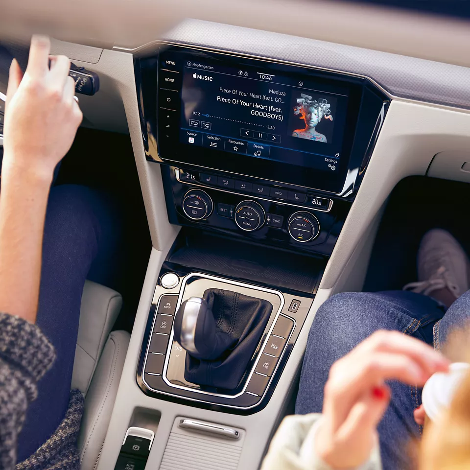
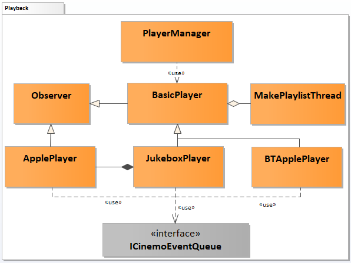

# Raw Slide Content

- Source file: FA_Docs_bang.dinh/Handling_Cinemo_Event_in_media_service_FA.pptx
- Total slides: 20

## Slide 1

FA Project
Handling Cinemo events in Media service

Candidate: Dinh Cong Bang
HQ Mentor: Mr 황보상규
LGEDV CORE FRAMEWORK 1 TEAM
2023.06.10

## Slide 2

Table Of Contents
 Media Overview
 Problem Identification
 Proposals & Comparisons
 Solution Decision
 Verification
 Q&A

## Slide 3

1. Media Overview

Media application is the most important app on the Head Unit.
This app is a combination of:
Media HMI with the UI, user can interact with Media app quickly and easily.
Media native service, which will handle all HMI’s requests and process rapidly and exactly.
Function Requirement:
Support USB connection, Bluetooth connection.
Support to manage multi devices as USB storage, Apple device, Android device.
Support to control the widening of audio and video codecs.
Support to display fully metadata information.

Image reference: slide_03_image_01.png

## Slide 4

1. Media Overview (Cont)

Quality Attribute Requirement

### Table
| ID | Description | Quality Attribute | Priority |
| QA_01 | The system can be easily extended without impacting other parts of the program. | Extensibility | Medium |
| QA_02 | The system should use system’s resource in an effective way. | Resource Utilization | Medium |
| QA_03 | The system should handle all events from 3rd SDK properly and effectively. | Efficiency | Medium |
| QA_04 | The system should have readability and understandability, with well-defined components and encapsulated functionality. | Maintainability | High |
| QA_05 | The system should be modular, break down into smaller, independent modules that perform specific function. | Reusability, Modifiability | High |

## Slide 5

2. Problem Identification

Media Native’s Architecture

Cinemo Engine

Media Native

IVI Framework

Media HMI

Image SPI

KIPC Message Handler

DSI Media Manager

Audio Manager

DSI Native Service

RSI Clients

Browser Manager

Picture Viewer Manager

Connection Manager

Playback

HMI

IVI Partition

Player layer

BasicPlayer

Legend

Software interface

Media service

Cinemo Engine

LGE app (except Media)

Playback

Player Manager

DC Manager

Power

DIAG

BT

TestInterface

JukeBoxPlayer

ApplePlayer

BTAppplePlayer

Playback

Handle
Cinemo
Event

Playback

Handle
Cinemo
Event

Playback

Handle
Cinemo
Event

Problem:

Each player plays role in both playback and handle Cinemo events inside.
Difficult for feature maintenance because of complex source code.(QA_04)
 Duplicated the logic for handle Cinemo event in each Player.
Can not re-use source code, hard to modify when issue happens the same on players.(QA_05)
Each player owns a thread to poll Cinemo event (Jukebox has one and BTApple has one)
 Wasting system’s resource (QA_02)

## Slide 6

3. Proposals & Comparisons

How to resolve problems?

1: Decouple Players with Cinemo event’s logic
     The player will focus on only one responsibility is Playback control, so it decreases Player’s complexity.
2: Commonizing Cinemo event’s handling logic, and creating interface with players to exchange information.
    Avoid duplicating same logic in Players, increase maintainability, reusability and modifiability .
3: Polling cinemo events by only one thread, using event source ID to handle properly for each player.
    Save the system’s resource.

Legend

Software interface

Media service

Cinemo Engine

New component

Playback

Modified component

Cinemo Engine

Media

Playback

Player layer

JukeBoxPlayer

ApplePlayer

BTAppplePlayer

BasicPlayer

Player Manager

Playback

Handle
Cinemo
Event

Playback

Handle
Cinemo
Event

Playback

Handle
Cinemo
Event

Cinemo Engine

Media

Playback

Player layer

JukeBoxPlayer

ApplePlayer

BTAppplePlayer

BasicPlayer

Player Manager

Playback

Handle Cinemo Event

Playback

Playback

As Is

To Be

PlayerInterface

## Slide 7

Image reference: slide_07_image_01.wmf

3. Proposals & Comparisons

Proposal 1: Using Singleton and Chain of Responsibility pattern.

Pros:
New handler can be added without affecting to existed handlers.
Comply Open/Closed and Single Responsibility Principle.
Saving system’s resource by using CinemoEventQueue singleton class with only one thread to poll events.
The event will be processed at correct handler in the chain and stop afterward.
Cons:
There is an increase in complexity in the code, and an increase in the number of classes required for the code.

Proposal 1

Image reference: slide_07_image_02.png

Current Playback static view

## Slide 8

Image reference: slide_08_image_01.wmf

3. Proposal & Comparison

Proposal 2: Using Singleton and Observer pattern.

Pros:
New handler can be added without affecting to existed handlers.
Comply Open/Closed and Single Responsibility Principle.
Saving system’s resource by using EventPublisher singleton class with only one thread to poll events.
Cons:
There is an increase in complexity in the code, and an increase in the number of classes required for the code.
Unexpected notification.
Potential memory leaks.

Proposal 2

Image reference: slide_08_image_02.png

Current Playback static view

## Slide 9

3. Proposals & Comparisons

### Table
| Quality Attribute | Current Architecture | Proposal 1 Singleton and Chain of Responsibility | Proposal 2 Singleton and Observer |
| Resource Utilization | Medium (2 threads) | High (1 thread) | Medium (1 thread. Potential memory leaks) |
| Efficiency | High(The event directly handles in each player, not take time to dispatch) | Medium (The event will be processed at correct handler in the chain and stop the chain traversal) | Low (The event will be notified to all handlers, this is unnecessary) |
| Reusability | Low | High (Event handler is reused between player classes) | High (Event handler is reused between player classes) |
| Modifiability | Low | High (Decouples senders and receivers, so makes modification without affecting other handlers) | High (loose coupling between objects, so makes modification without affecting other handlers) |
| Maintainability | Low | High (Each handler in the chain has a single responsibility) | High (Separates the concerns of the subject and observers) |

## Slide 10

4. Solution Decision

Factors affecting Design Decision:
Using system’s resource effectively.
Handling Cinemo events properly and effectively.
Choosing the design:
Using Singleton class in both also helped Playback component decrease one thread for polling Cinemo events.
The main goals are improving Playback component to have Maintainability, Reusability, Modifiability. Both proposals improved these things by breaking down Players to smaller module and using design patterns to poll and handle Cinemo Events.
However, with Proposal 1, it had mechanism to process events more effectively than Proposal 2 and don’t have potential memory leak as shown in the comparison table.
 So I decided to choose Proposal 1: Using Singleton and Chain of Responsibility pattern.

## Slide 11

5. Verification

### Table
| Quality Attribute | Use-case | QA Scenario | Chosen Design Verification |
| Resource Utilization | A request to services use thread as less as possible because of context switching overhead. | - Source of stimulus: Performance Engineers - Stimulus: The request to minimize the usage of threads due to the overhead of context switching. - Environment: Media service - Artifact: Any class that is using thread in media service - Response: Making changes to the code or implementation to decrease the usage of threads and minimize the context switching overhead. - Response measure: Evaluating the overall performance and resource utilization of the services to assess of minimizing thread usage. | - Using CinemoEventQueue singleton class with a thread object to poll Cinemo event for all players. With this way, media native service decreased from 2 threads to 1 thread for this task. - In one moment, just only one player need to interact with Cinemo Event, so it also does not affect to media native service’s operation. - So It saved system’s resource without affecting to overall performance. |
| Efficiency | Assessing are event processed for correct player? Is it effective? | - Source of stimulus: FO’s requirement for efficient event dispatch mechanism. - Stimulus: The need to dispatch Cinemo events to handlers using only one thread. - Environment: All players in media native service - Artifact: BTApplePlayer, JukeboxPlayer, ApplePlayer implementation - Response: Implementing a mechanism that allows the dispatch of Cinemo events to handlers using only one thread. - Response measure: Monitoring the efficiency of the event dispatch mechanism. | - Implementation for chain of responsibility pattern is not complex, so any developer in team can implement based on provided design. - Handlers are linked to each other in the chain, so it always ensure corresponding handler will be called to process the event. - There are always 6 objects of handler in the chain, when event arrives in correct handler, it will process and stop traversal. So it is more effective than notifying to all objects handler. |

## Slide 12

5. Verification

### Table
| Quality Attribute | Use-case | QA Scenario | Chosen Design Verification |
| Reusability, Modifiability | A request to add internetRadio feature into Media application | - Source of stimulus: OEM’s request - Stimulus: Add more internet radio feature - Environment: design time - Artifact: Change the functionality of media application - Response: In case of handling cinemo event for new InternetRadio player, there is no impact to other handlers - Response measure: It should take less than 4h | Need the following steps to add InternetRadio player: - Implement InternetRadioPlayer class, which is responsible for playback control. (Not belong to scope of this topic) - Define a handler class OnlineEventHandler, this class will handle event related to control playback online music by Cinemo SDK, recognize event’s meaning and give information to interact back to InternetRadioPlayer class. - Insert pointer object of this handler to the existed chain.  So estimated time to do this is around 3-4h for developer. |
| Maintainability | A request to handover BTApplePlayer to new developer | - Source of stimulus: Software handover process - Stimulus: The need to hand over the BTApplePlayer code to a new developer due to current developer change job. - Environment: BTApplePlayer code, which is currently difficult to maintain. - Artifact: BTApplePlayer codebase. - Response: Taking actions to improve the maintainability of the BTApplePlayer codebase before handing it over to the new developer. - Response measure: The new developer's ability to understand and work with the codebase efficiently, reduced development time for future enhancements or bug fixes. Hand-over time should take less than 5 working days. | - With chosen design, playback control and handling cinemo event parts were separated, this made BTApplePlayer’s codebase is smaller and just focus on only playback  New developer will be easy to read and understand the source code. - BTApplePlayer use both TBTEventHandler and NowEventHandler, so new developer need to continue investigate into 2 these handler classes.  With studied knowledge of these handlers, new developer is not only apply to BTApplePlayer but also understand for JukeboxPlayer and ApplePlayer. He will familiar with players in media service and involke to maintain media native quickly .  5 working day is suitable to handover this player. |

## Slide 13

5. Q&A

Q&A
Thank you for listening!

## Slide 14

Lessons learned.

I learned skills such as:
Analyzing function requirement.
Analyzing quality attribute requirement.
Judging problems base on criterial of QA.
One the most important thing I learned, that is always consider the problem on many aspects even though is smallest. This will save development time when the software can complete without lacking or mismatching any requirement.

## Slide 15

Appendix

Image reference: slide_15_image_01.wmf

Detailed Static View Diagram

## Slide 16

Appendix

Setup Cinemo event in each Player class

Image reference: slide_16_image_01.wmf

Image reference: slide_16_image_02.wmf

## Slide 17

Setup Cinemo event in each Player class (Cont)

Image reference: slide_17_image_01.wmf

## Slide 18

Setup CinemoEventQueue object

Image reference: slide_18_image_01.wmf

## Slide 19

Start reading Cinemo Event

Image reference: slide_19_image_01.wmf

## Slide 20

Handlers

Image reference: slide_20_image_01.wmf

Image reference: slide_20_image_02.wmf

