# Raw Document Content

- Source file: FA_Document_tuyen.dang/Provisioning_doc_FA.docx

FA 인증과제 (Internal Design of Provisioning App supports expanding features)

About This Document

Document Information

## Table
| Issuing authority | BMW WAVE |
| --- | --- |
| Status of document | In Progress |

Revision History

## Table
| Version | Date | Content of Change | Author | Approver |
| --- | --- | --- | --- | --- |
| 0.1 | 2023.08.08 | Initial Release | Tuyen.dang |  |
| 0.2 | 2023.09.09 | Static Design added Dynamic Design added | Tuyen.dang |  |
| 0.3 | 2023.19.16 | Modifying and adding information about SDD | Tuyen.dang |  |

Purpose

This document specifies the software detailed design for the Provisioning application on WAVE project. Including the static design, dynamic design, and algorithm design.

This document identifies the class consisting of Provisioning Application, and describes the behaviors of those classes to accomplish the requirements upon them.

Background

Provisioning Application is one of the features of the WAVE project. With Configuration Service, the Provisioning App is one of the modules that make up Configuration/Provisioning in WAVE project. Its main purpose is to make sure the WAVE board is always provisioned with valid data from either the BMW Backend side or BMW tools (EDIABAS and FAT tool).

Image reference: doc_image_001.htm

Due to this importance, the Provisioning App is also developed in ICON, TMP4G, etc... Besides with new requirements from customers, more and more things will be added. So the Provisioning App should highly support modifying and reusing.

However it doesn't appear in the current architecture. There's a lot of duplicated and non-reusable implementation in the application. Therefore, a new design of the Provisioning App should be introduced to make it more Modifiability, Maintainability, and Reusability.

Audience

The readers of this article are as follows:

Software Architect

Customer

Developer

Project Leader

Project Manager

Test Engineer

Related Documents

## Table
| Document / Spec. Title | Version | Spec. Number | Issuing Division |
| --- | --- | --- | --- |
| WAVE SRS (Software Requirement Specifications) | v2.3 | SRS | BMW WAVE Telematics Developement Team |
| WAVE SAD (Software Architectural Design) | v2.2 | v2.2 | BMW WAVE Telematics Developement Team |

Abbreviations / Terms

## Table
| Abbreviation | Description |
| --- | --- |
| DAS | Default Asset Set |
| OTA | Over The Air |
| SRS | Software Requirements Specifications |
| HSM | Hardware Security Module |
| DTC | Diagnostic Trouble Codes |
| SAD | Software Architectural Design |
| SDD | Software Detailed Design |
| ConfigManager | Configuration Manage |
| MGU | Media Graphic Unit |

List of images

Figure 1: Current Architecture Design (left) and a new Architecture (right) Context Diagram.	5

Figure 2: Requirements of Provisioning app.	6

Figure 3: Current design of the Provisioning app.	6

Figure 4: Current Architecture Design (left) and a new Architecture (right) with Façade approach.	7

Figure 5: The change of Current Architecture Design (left) and a new Architecture (right) when adding a new Service.	8

Figure 6: Current Architecture Design (left) and a new Architecture (right) with Communicator approach.	9

Figure 7: The change of Current Architecture Design (left) and a new Architecture (right) when adding a new Service.	10

Figure 8: Current Architecture Design (left) and a new Architecture (right) with Chain of Responsibility approach.	11

Figure 9: The change of Current Architecture Design (left) and a new Architecture (right) when adding a new request/notification.	12

Figure 10: Current Architecture Design (left) and a new Architecture (right) with Command approach.	13

Figure 11: The change of Current Architecture Design (left) and a new Architecture (right) when adding a new request/notification.	13

Figure 12: Current Architecture Design (left) and a new Architecture (right) with two changes.	15

Figure 13: Static design of the Provisioning App.	16

Figure 14: State diagram of the Provisioning App.	17

Figure 15: Consequence onCreate diagram of the Provisioning App.	18

Figure 16: Consequence onBootComplete diagram of the Provisioning App.	19

Figure 17: Consequence of the Provisioning App when the user trigger Provisioning via MGU.	20

Figure 18: Consequence of the Provisioning App when Checking Provisioning condition.	21

Figure 19: Consequence of the Provisioning App when Checking Provisioning condition.	22

Figure 20: Consequence of the Provisioning App when Security Checking	23

Figure 21: Consequence of the Provisioning App when doing Perform Provisioning.	24

Figure 22: Consequence of the Provisioning App when the user trigger Provisioning via EDIABAS tool.	25

Figure 23: Consequence of the Provisioning App when a Provisioning trigger is made by Backend Serve.	26

Figure 24: Consequence of the Provisioning App when resetting the current OTA file via EDIABAS.	27

Figure 25: Consequence of the Provisioning App when getting a disconnection from Joynr Service.	28

Figure 26: Consequence of the Provisioning App when getting a disconnection from Joynr Service.	28

Figure 27: Consequence onDestroy diagram of the Provisioning App.	29

List of tables

Table 1: Non-functional Requirement of Provisioning app.	6

Table 2: Compare Design Proposals about Decouple Provisioning App with its dependencies.	10

Table 3: Compare Design Proposals about Design new Handler class.	14

Table 4: The list class of the Provisioning App.	17

Table 5: Description of each Provisioning App’s state.	17

Table 6: State transition of the Provisioning App’s state.	17

1: Overview

1.1: Overall Descriptions.

Provisioning Application is one of the components in the Application layer of BMW WAVE project which resides in A35 core of i.MX8. Its feature is helping WAVE board get the latest OTA file from the Backend or from the user via EDIABAS tool. The idea of the new internal design comes from the limitation of the current architecture of the Provisioning App, in which we put everything that involves a service in only one class (ProvisioningApp class) like: proxy, receiver class and handler. According to the development of the project, updating is inevitable. With the current design, the whole code base will be impacted when a new Service is introduced. Therefore, a new design is required to reduce the effort of extension, modification and improve reusability of the Provisioning App.

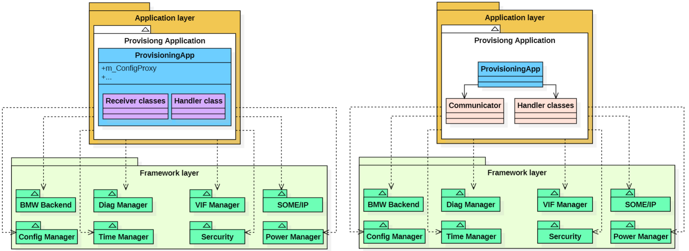
Image reference: doc_image_002.png

Figure 1: Current Architecture Design (left) and a new Architecture (right) Context Diagram.

1.2: Functional Requirement of Provisioning app.

On one hand, Provisioning Application downloads a configuration file from BMW backend server. This app performs security and validation check on the file. This application also supports BMW diagnostics job to handle the configuration files.

Image reference: doc_image_003.htm

Figure 2: Requirements of Provisioning app.

This component supports the following features:

Downloading OTA database file from BMW backend server.

Unzip support on downloaded file.

Performing security check on downloaded file.

Support diagnostics jobs

Delete the current OTA file.

1.3: Non-functional Requirement of Provisioning app.

On the other hand, as a component in application layer, Provisioning Application must follow non-functional requirements described as:

## Table
| Scenario # | QA Scenario | Quality Attribute | Priority |
| --- | --- | --- | --- |
| 1 | A new OTA file needs to be checked and forwarded to Configuration Manager within 2s. | Performance | High |
| 2 | After getting a list of OTA files, Provisioning App has to handle them in an order. | Reliability | High |
| 3 | Provisioning App is applied for WAVE, Gen12 and ICON project. | Reusability | Mid |

Table 1: Non-functional Requirement of Provisioning app.

2:  Architectural Analysis.

2.1: Problem Identification.

Consider Figure 3, it's the current layout of the Provisioning App.
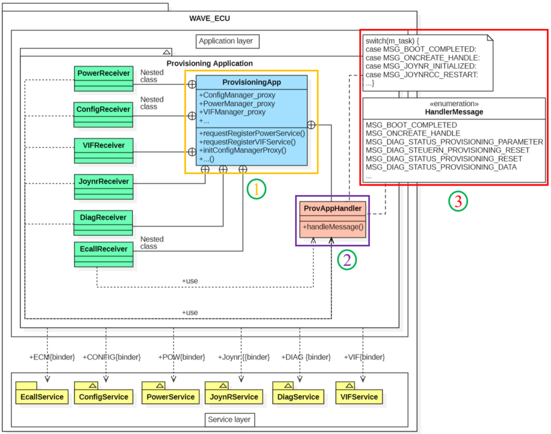
Image reference: doc_image_004.png

Figure 3: Current design of the Provisioning app.

From the Figure, we can see now the Provisioning has two problems:

Services’ proxy, and Receiver classes are nested in ProvisioningApp class. Therefore, ProvisioningApp class has to take care of how to create a proxy, when and how to subscribe/unsubscribe to Services. Lead source code difficult for feature expansion.

The ProvAppHandler class has to handle many notifications/requests from outside, which goes against single responsibility principle.

 Lead source code difficult for feature maintenance.

Besides using switch-case logic and the Enum table to identify tasks, it makes its logic more and more difficult to understand when updating.

 Lead source code duplicated & Non-reusable.

With this situation, a new design should be considered to improve the Modifiability, Maintainability, and Reusability of the Provisioning App. To reach these points, the three above problems have to be solved. They can be simplified by two solutions below:

Decouple Provisioning App with its dependencies.

Design new Handler class that won't be impacted when updating a new request/notification.

In the next section, they shall be gone through one by one.

2.2: Architecture Design Proposals.

The way to fulfill solutions will be mentioned in this section.

According to the two above solutions listed:

2.2.1: Decouple Provisioning App with its dependencies.

2.2.1.1: Architecture Design Proposals.

Proposal 1: Using Façade pattern.

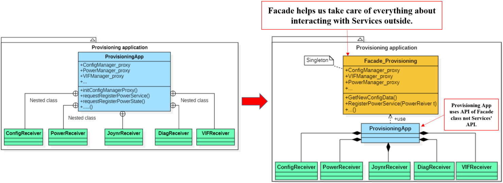
Image reference: doc_image_005.png

Figure 4: Current Architecture Design (left) and a new Architecture (right) with Façade approach.

* Steps implementing:

Relocate Receiver class nested class to another place to reduce the complexity of Provisioning App class.

In the new Facade class, declare and implement interfaces that make using Services’ API simpler. Instead of using proxies to call Services' API, we just use the Facade's API.

Make all Provisioning codes communicate with Services only via the Facade. From now on, Provisioning App codes are protected from any changes on the Services side.

To guarantee there'll be only one Facade, the Singleton pattern will be applied in the Facade class.

* Pros and Cons of the proposal:

Pros:

One of the major benefits is that it reduces the coupling between different parts of a structural system.

Isolate Provisioning App code from the rest of the system and avoid unwanted dependencies.

Improves the readability of Provisioning app.

Cons:

By adding an extra layer of abstraction and communication between Provisioning App and Services, leads to increase the latency and the resource consumption of the system.

The Facade can become a god object coupled to all Services of Provisioning App.

* Benefit illustration of Using Façade pattern.

We can see how this approach helps me decouple the Provisioning App from its dependencies by adding a new Service to the Provisioning App.

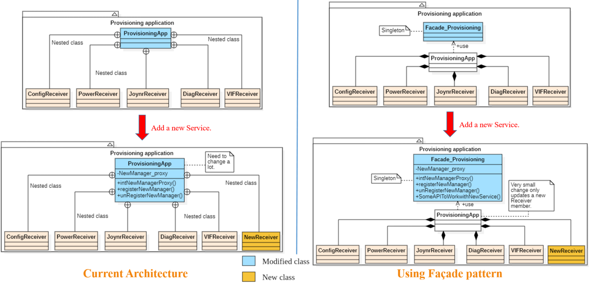
Image reference: doc_image_006.png

Figure 5: The change of Current Architecture Design (left) and a new Architecture (right) when adding a new Service.

In the current architecture, whenever a new Service is introduced, ProvisioningApp class has to:

Update a new Receiver class.

A proxy of the new Service.

Parallelly, the logic to initialize the proxy, and subscribe/unsubscribe to the Service to get its notification.

With the Facade approach, those changes are moved to the Facade class, all thing ProvisioningApp class needs to do is update a new Receiver object in its property. Besides, to follow Facade's principle, we have to introduce some APIs that wrap up the Service's API.

Proposal 2: Using Communicator.

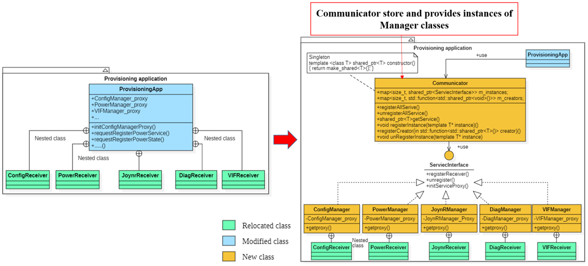
Image reference: doc_image_007.png

Figure 6: Current Architecture Design (left) and a new Architecture (right) with Communicator approach.

* Steps implementing:

Relocate all nested Receiver classes outside, each of them is contained in its Manager class. In the Manager class, everything that is needed to interact with Service outside will be defined (proxy, subscribe /unsubscribe).

Communicator works like a cache. Via it, the Provisioning App can add or remove its dependencies (manager instances). Applying Reflection pattern in Communicator (registerCreator), allows us to create a Receiver only needed (lazy initialization).

The Provisioning App can either use the proxy in the Manager class to call the Service's API or the Manager class can introduce an abstraction API to hide the proxy.

To make sure there's only one Communicator, Singleton will be applied here.

* Pros and Cons of the solution:

Pros:

Reduce coupling between components.

Open/Closed Principle: A new Service can be introduced into the app without breaking existing logic.

Single Responsibility Principle: All a Service's matters are brought into one place in the program, making the code easier to support.

Cons:

Source code can be complicated due to the separation of responsibilities.

* Benefit illustration of Using Communicator.

Same as upper, now see how this approach helps me decouple the Provisioning App from its dependencies by adding a new Service to the Provisioning App.

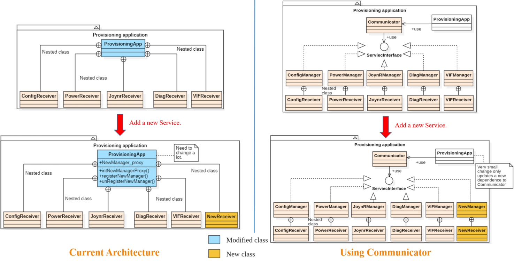
Image reference: doc_image_008.png

Figure 7: The change of Current Architecture Design (left) and a new Architecture (right) when adding a new Service.

The changes in the current architecture were described before.

With the Communicator approach, only a tiny change in ProvisioningApp when it needs to update a new dependency to the Communicator.

2.2.1.2: Compare Design Proposals.

Consider the table to see the comparison of the two above solutions:

## Table
| Proposal | Modifiability | Reusability | Maintainability |
| --- | --- | --- | --- |
| Proposal 1: Using Façade | High: Service changes can't effect to Provisioning App logic due to Facade restricts it interact with Services directly. | Medium: With the Facade approach, we tend to make it can deal with our own application logic. Each project has different requirements so not easy to apply one Facade structure to another project. | High: Support maintainability because of reducing the coupling between components and simplifying the interactions between them. |
| Proposal 2: Using Communicator | High: Every Service is encapsulated in its own class. When something changes, only it needs to be modified. | High: All of Application has a pub-sub model and proxy-client model can utilize this one. So easy to apply it to other projects. | High: Support maintainability because of reducing the coupling between components. |

Table 2: Compare Design Proposals about Decouple Provisioning App with its dependencies.

Besides this table, in the Provisioning app, at a specific time usually need only a Service Proxy, so we rather to use the Proxy to call directly instead of making an abstraction API and working through it (Performance issue). When really needed, Communicator still can work like a Facade because it has all Service instances.

 For these above reasons, I'll go with Proposal 2: Using Communicator.

2.2.2: Design new Handler class that won't be impacted when updating a new request/ notification.

2.2.2.1: Architecture Design Proposals.

Proposal 1: Using Chain of Responsibility pattern.

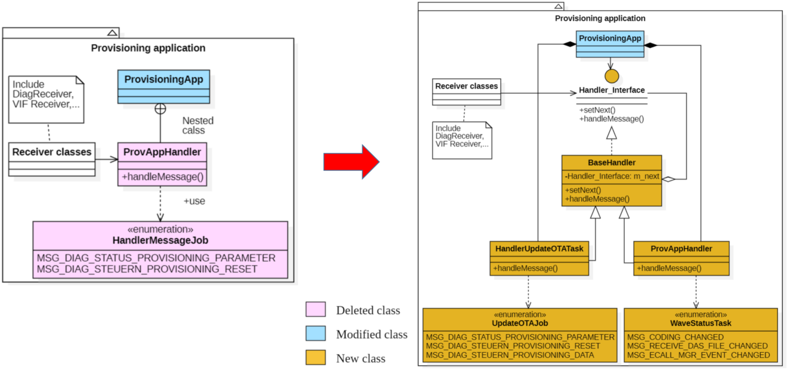
Image reference: doc_image_009.png

Figure 8: Current Architecture Design (left) and a new Architecture (right) with Chain of Responsibility approach.

* Steps implementing:

Separate the big Handler class into two or more smaller classes which have tasks that tend to relate to each other.

Declare the handler interface and describe the signature of a method for handling requests.

To eliminate duplicate boilerplate code in concrete handlers, it might be worth creating an abstract base handler class, derived from the handler interface.

Each concrete handler subclasses have its own handling logic to decide:

Whether it’ll process the request.

Whether it’ll pass the request along the chain.

* Pros and Cons of the solution:

Pros:

Open/Closed Principle: New handlers can be introduced into the app without breaking the existing logic.

Single Responsibility Principle: Decouple classes that invoke operations from classes that perform operations.

It comes in handy when wanting to control the flow of request handling.

Cons:

Can increase the maintenance sometimes, because of the occurring of duplicate code across handlers.

Sometimes, this design pattern can get broken lead some requests may end up unhandled or handled incorrectly.

* Benefit illustration of Using Chain of Responsibility pattern.

We can see how this approach helps me make a new Handler class that won't be impacted when updating a new request/notification.

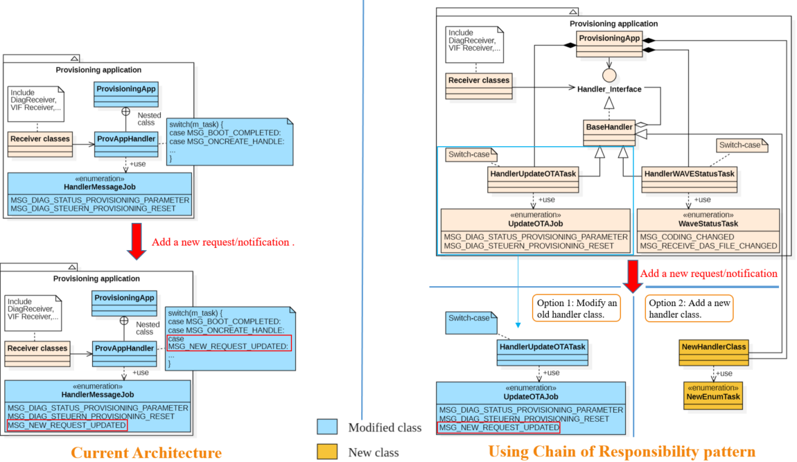
Image reference: doc_image_010.png

Figure 9: The change of Current Architecture Design (left) and a new Architecture (right) when adding a new request/notification.

In the current architecture, whenever a new request/notification is introduced, ProvAppHandler class has to:

Update its Switch-case logic.

Update its Enum table.

With the Chain of Responsibility approach, I have two options: either modify an old Handler class like the current architecture or bring a new Handler class that won't affect existing logic.

Proposal 2: Using Command pattern

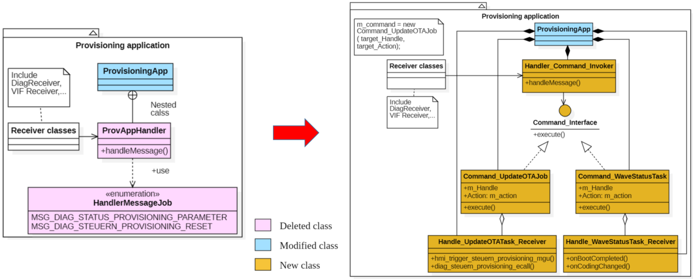
Image reference: doc_image_011.png

Figure 10: Current Architecture Design (left) and a new Architecture (right) with Command approach.

* Steps implementing:

Divide the big Handler class into two or more smaller classes.

Define a Command interface with a method signature like execute.

Create one or more derived classes that encapsulate some subset of the following: a “Handle" object, the method to invoke, arguments to pass.

The client should initialize objects in the following order:

Create a receiver.

Create a command, and parameters if needed.

* Pros and Cons of the solution:

Pros:

Open/Closed Principle: A new command can be introduced into the app without breaking existing logic.

Single Responsibility Principle: Decouple classes that invoke operations from classes that perform these operations.

Can assemble a set of simple commands into a complex one and implement undo/redo.

Cons:

Source code can be complicated which introduces a whole new layer between Sender and Receiver.

* Benefit illustration of Using Command pattern.

Same as upper, now see how this approach helps me make a new Handler class that won't be impacted when updating a new request/notification.

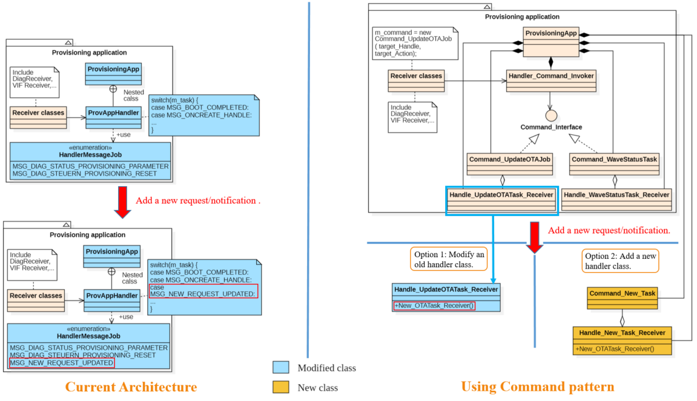
Image reference: doc_image_012.png

Figure 11: The change of Current Architecture Design (left) and a new Architecture (right) when adding a new request/notification.

The changes in the current architecture were described before.

With the Command approach, I have two options: either add a new function to an old Handler class or bring a new Handler class that won't affect existing logic.

2.2.2.2: Compare Design Proposals.

Consider the table to see the comparison of the two above proposals:

## Table
| Proposal | Modifiability | Reusability | Maintainability |
| --- | --- | --- | --- |
| Proposal 1: Using Chain of Responsibility | Medium: The occurrence of duplicate code across handlers sometimes happens. So more than one place needs to change if updated. | High: Any application, service has to work with a chain of objects such as filters, event chains can apply this approach. | Medium: If we want to add a new task to an old class, switch-case logic of that class needs to be modified. |
| Proposal 2: Using Command | High: Handle classes work independently, once one class is changed no impact on others. | High: It’s used as an alternative for callbacks to parameterize User or Services elements with actions. So can apply for almost of project has pub-sub model. | High: We can introduce a new Handle class or a new task that is included by an old class without breaking existing logic. |

Table 3: Compare Design Proposals about Design new Handler class.

Besides this table, in the Provisioning app, most of the requests can be handled by one handler. Using Chain of Responsibility is unnecessary, and can make deep stack traces, which can affect performance.

 For these above reasons, I'll go with Proposal 2: Using Command.

2.2: Architecture Decision.

Gather what I have until now, two solutions:

Decouple Provisioning App with its dependencies.

Design new Handler class that won't be impacted when updating a new request/notification.

With two final decisions to fulfill:

Proposal 1: Using Communicator.

Proposal 1: Using Command Pattern.

I chose them not only based on these below criteria:

Reduce cost when updating new features or modifying old logic.

Able to be used in many different projects.

But also if they're fit with the App's logic or not.

At a specific time usually need only a Service Proxy, so we would rather use the Proxy to call directly instead of making an abstraction API and working through it (Performance issue). ==> Façade pattern is not good.

Most of the requests can be handled by one handler. Using Chain of Responsibility is unnecessary, and can make deep stack traces, which can affect performance. ==> Chain of Responsibility pattern is not good.

2.3: Architecture Results.

With the two changes, the Provisioning App will be like below:

(*Note: Provisioning App uses more than 5 services but for the sake of simplicity, only they are presented in the diagram)

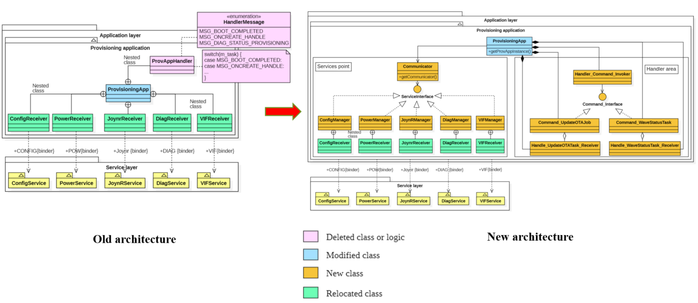
Image reference: doc_image_013.png

Figure 12: Current Architecture Design (left) and a new Architecture (right) with two changes.

Experimental result.

Test the stability of Provisioning App.

After applying changes, Provisioning App works well.

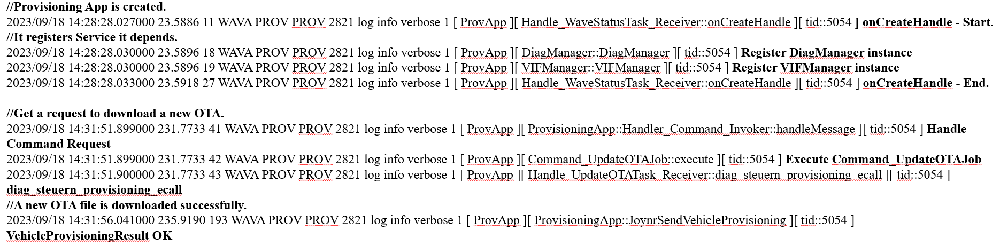
Image reference: doc_image_014.png

By the way, with the support of lazy initialization, OnCreate times are reduced 0,1s. (Improve performance).

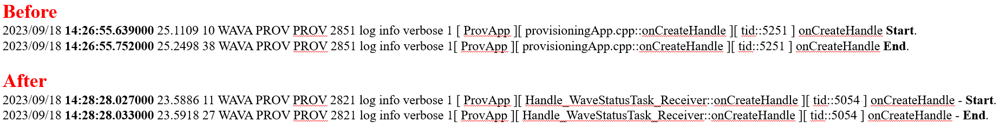
Image reference: doc_image_015.png

Test the modifiability of Provisioning App.

When Provisioning App needs to include a new Service (Audio Service).

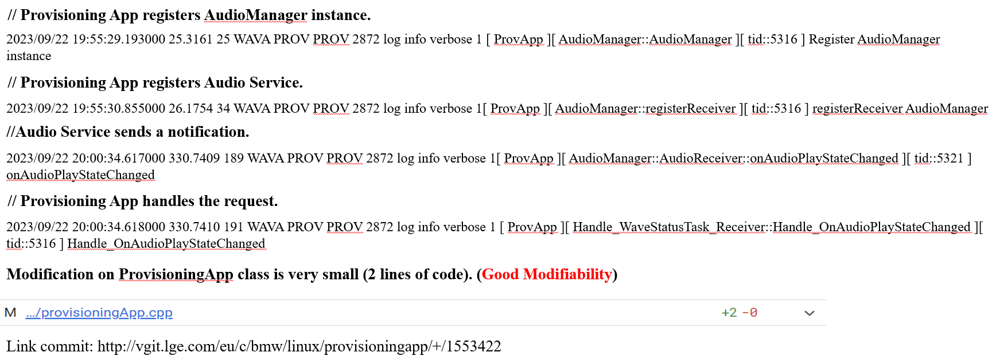
Image reference: doc_image_016.png

My plan.

My solution can apply not only to Provisioning App but also to any app that flows proxy-client and pub-sub model. (Very popular in LG). So even though WAVE project is nearly done and applying the changes to the event branch is impossible. But I can do that on another project in the future.

3: Architecture Diagrams of Provisioning Application.

3.1: Static Design

The static design of the Provisioning App is described in Figure 9 with its descriptions in Table 4.

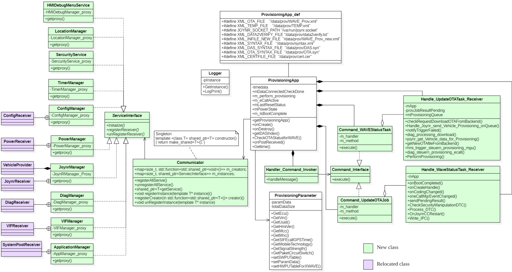
Image reference: doc_image_017.png

Figure 13: Static design of the Provisioning App.

## Table
| Classes | Descriptions |
| --- | --- |
| ProvisioningApp | The main class of this module. |
| ProvisioningParameter | This class gathers provisioning parameters. |
| ProvisioningApp_def | Put all definitions or Enum of the class. |
| Handle_UpdateOTATask_Receiver | Take care handle job related to update/delete OTA file. |
| Handle_WaveStatusTask_Receiver | Take care handle job related to WAVE status |
| Logger | To print log information. |
| Communicator | Provide Manager classes' instance. |
| SecurityService | Help interact with Security Service. |
| TimerManager | Help interact with Timer Service. |
| ConfigManager | Help interact with Configuration Service. |
| PowerManager | Help interact with Power Service. |
| JoynrManager | Help interact with Joynr Service. |
| DiagManager | Help interact with Diagnostic Service. |
| VIFManager | Help interact with VIF Service. |
| ApplicationManager | Help interact with Application Service. |
| LocationManage | Help interact with Location Service. |
| HMIDebugMenuService | Help interact with HMI Debug Menu Service. |
| ConfigReceiver | Receives data from the Configuration Service. |
| PowerReceiver | Receives data from the Power Service. |
| VehicleProvider | Receives vehicle information from the Backend. |
| JoynrReceiver | Receives data from the Joynr Service. |
| DiagReceiver | Receives data from the Diagnostic Service. |
| VIFReceiver | Receives data from the VIF Service. |
| SystemPostReceiver | Receives data from the System. |
| Command_WAVEStatusTask | Forward task to Handle_WaveStatusTask_Receiver |
| Command_UpdateOTAJob | Forward task to Handle_UpdateOTATask_Receiver |

Table 4: The list class of the Provisioning App.

3.2: Dynamic Design.

3.2.1: State Design.

The Provisioning App shall work as the following states:

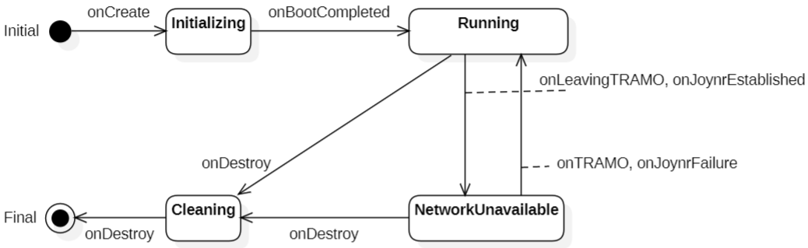
Image reference: doc_image_018.png

Figure 14: State diagram of the Provisioning App.

## Table
| States | Descriptions |
| --- | --- |
| Initial | This is the initial state. Application Service runs the Provisioning App. |
| Initializing | This is the Initializing state. The Provisioning App initializes members. |
| Running | This is the Running state. Ready for provisioning. |
| NetworkUnavailable | By TRAMO or Joynr failure, the cellular network cannot be used. |
| Cleaning | Releases resources and monitors current status. |
| Final | This is the Final state. The ProvisioningApp object is destroyed. |

Table 5: Description of each Provisioning App’s state.

The state transitions for the state diagram are as follows:

## Table
| Current State | Event/Action | Next State | Descriptions |
| --- | --- | --- | --- |
| Initial | onCreate | Initializing | onCreate event is triggered when Application Service launches Provisioning application in boot time. |
| Initializing | onBootCompleted | Running | WAVE is booted complete, the Provisioning App subscribes to other Services. |
| Running | onTRAMO, onJoynrFailure | NetworkUnavailable | If Joynr fails, or if the vehicle is in TRAMO, the state goes to "NetworkUnavailable" state. |
| NetworkUnavailable | onLeavingTRAMO, onJoynrEstablished | Running | If Joynr works again, or if the vehicle leaves TRAMO, the state goes to "Running" state. |
| NetworkUnavailable | onDestroy | Cleaning | Application Service sends onDestroy, the object will be removed from memory. |
| Running | onDestroy | Cleaning | Application Service sends onDestroy, the object will be removed from memory. |
| Cleaning | onDestroy | Final | The Provisioning App is terminated. |

Table 6: State transition of the Provisioning App’s state.

3.2.2: Interaction Design

onCreate.

When Provisioning App gets onCreate() from Application Service. (*Note: The orange area is new classes)

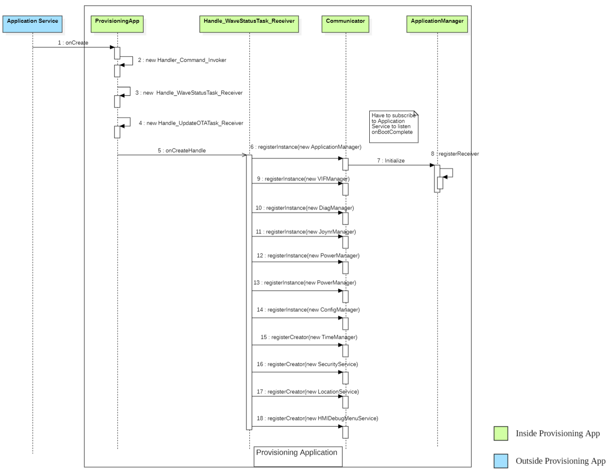
Image reference: doc_image_019.png

Figure 15: Consequence onCreate diagram of the Provisioning App.

onBootComplete.

When Provisioning App gets onBootComplete() from Application Service. (*Note: The orange area is new classes)

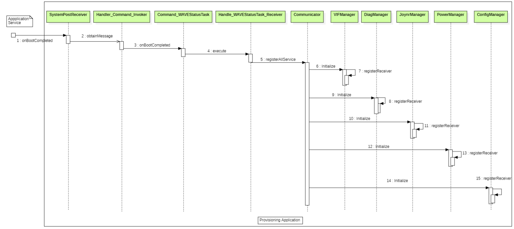
Image reference: doc_image_020.png

Figure 16: Consequence onBootComplete diagram of the Provisioning App.

Provisioning trigger by MGU.

When Provisioning App in Running state and the user wants to update a new OTA via HMI screen.

(*Note: The orange area is new classes)

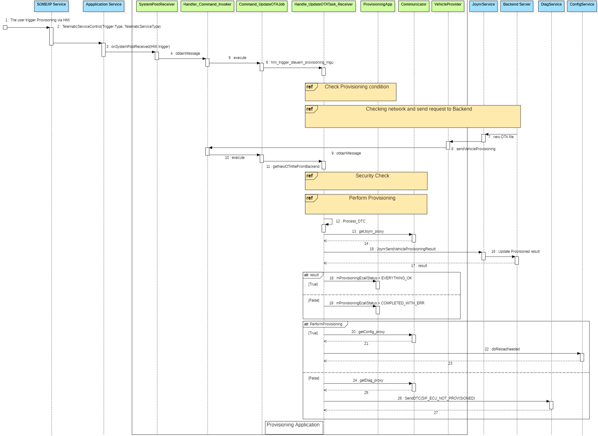
Image reference: doc_image_021.png

Image reference: doc_image_022.png

Figure 17: Consequence of the Provisioning App when the user trigger Provisioning via MGU.

(*Note: 4 references will be explained below.)

Check Provisioning condition.

When the Provisioning App gets a trigger, it will check if that request can be handled or not.

(*Note: The orange area is new classes)

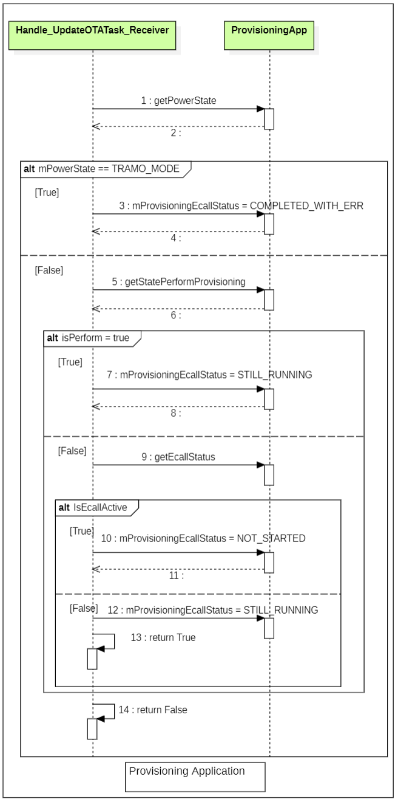
Image reference: doc_image_023.png

Image reference: doc_image_024.png

Figure 18: Consequence of the Provisioning App when Checking Provisioning condition.

Checking network and send request to Backend.

The Provisioning App checks network status, if network is available, forward the request to the Backend via Joynr.

(*Note: The orange area is new classes)

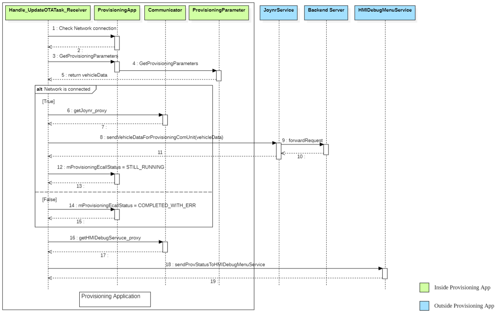
Image reference: doc_image_025.png

Figure 19: Consequence of the Provisioning App when Checking Provisioning condition.

Security Check.

After getting a new OTA file, the Provisioning App checks its validity by these below steps:

(*Note: The orange area is new classes)

Check the file can be opened.

Check if the file's type is DAS or OTA.

Check Syntax information.

Check Certificate information.

Check Signature Date information.

Check Secure Time information.

Check Timestamp.

Check Signature is valid.

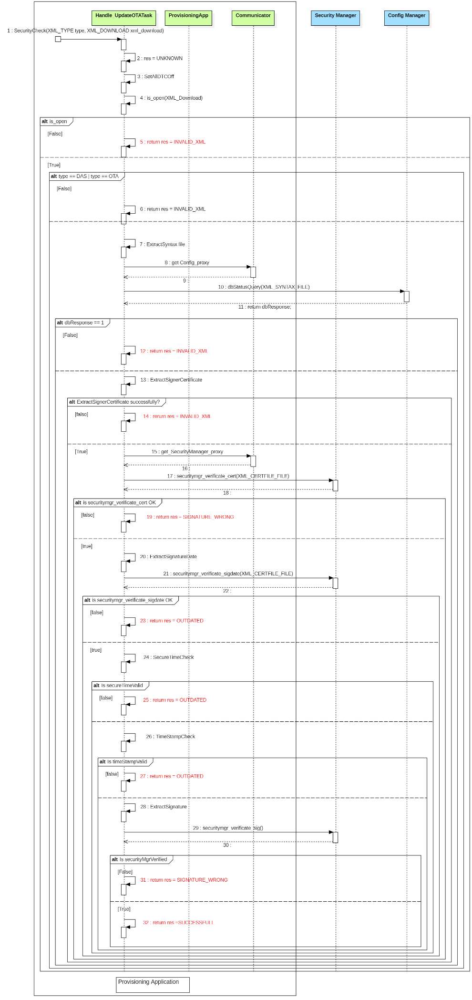
Image reference: doc_image_026.png

Perform Provisioning.

After SecurityCheck successfully, the Provisioning App do some final checking before notification to ConfigService about a new OTA file.

(*Note: The orange area is new classes)

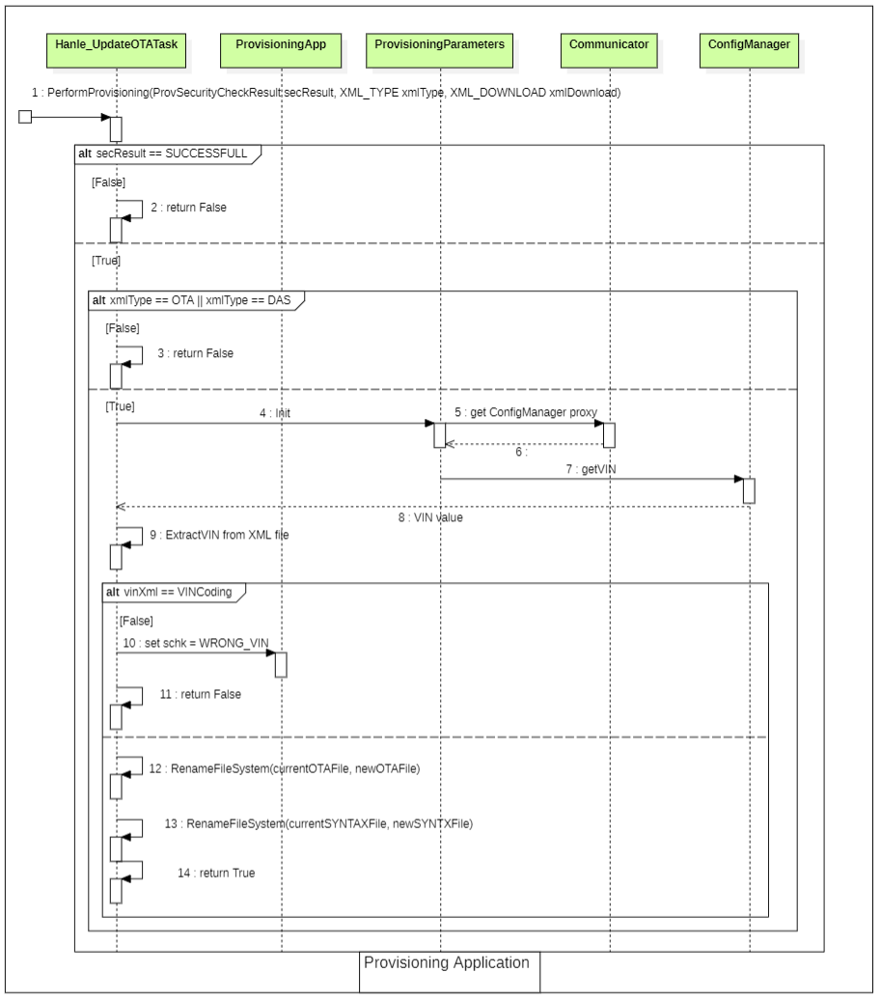
Image reference: doc_image_027.png

Image reference: doc_image_028.png

Figure 21: Consequence of the Provisioning App when doing Perform Provisioning.

Provisioning trigger by EDIABAS.

Similar as HMI screen, the user can use EDIABAS tool to trigger provisioning. (*Note: The orange area is new classes)
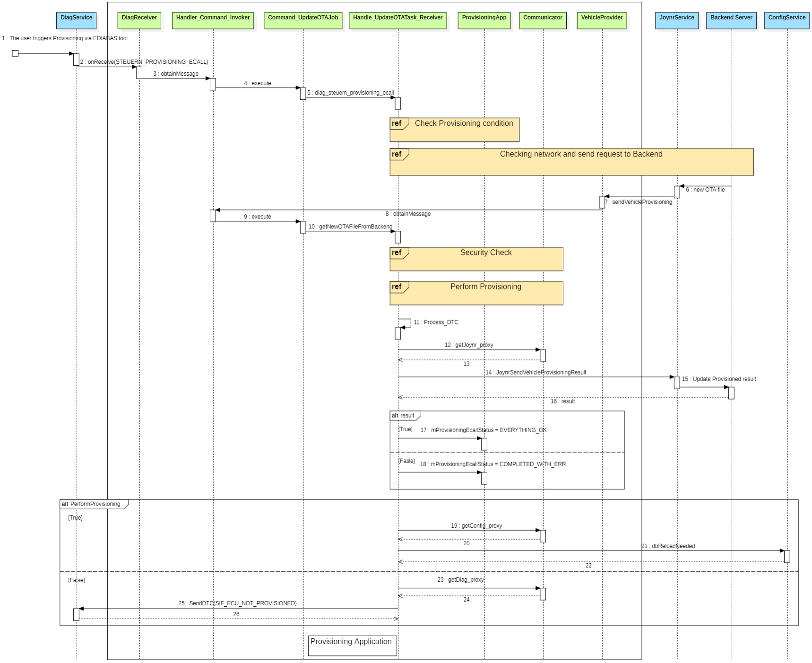
Image reference: doc_image_029.png

Image reference: doc_image_030.png

Figure 22: Consequence of the Provisioning App when the user trigger Provisioning via EDIABAS tool.

Provisioning trigger by Backend Server.

Similar to the ways HMI screen and EDIABAS tool, a Provisioning trigger can be made by Backend Serve.

(*Note: The orange area is new classes)

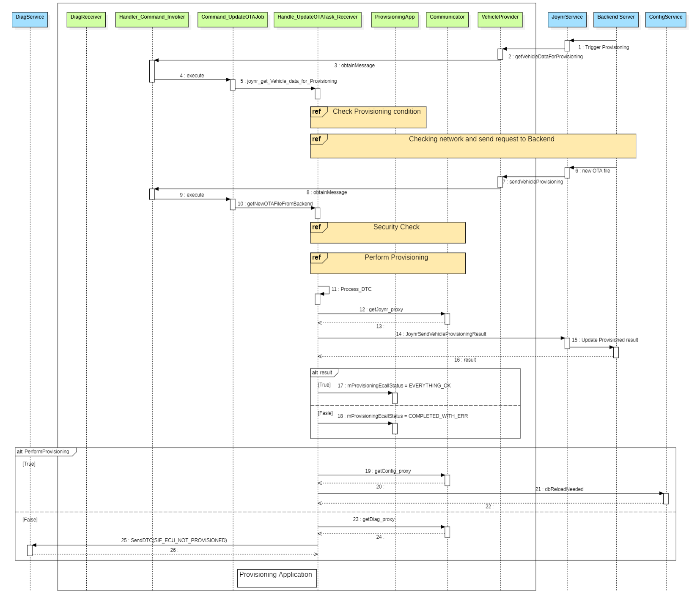
Image reference: doc_image_031.png

Image reference: doc_image_032.png

Figure 23: Consequence of the Provisioning App when a Provisioning trigger is made by Backend Serve.

Reset Provisioning via EDIABAS.

Besides, updating a new OTA file, the Provisioning also support delete the current OTA file via EDIABAS.

(*Note: The orange area is new classes)

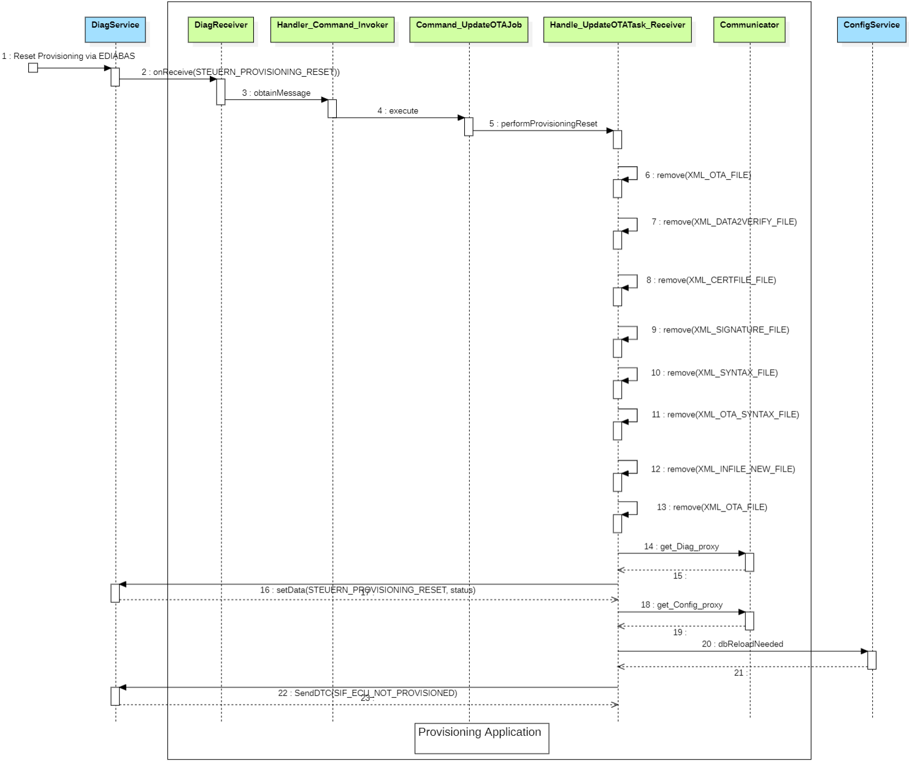
Image reference: doc_image_033.png

Image reference: doc_image_034.png

Figure 24: Consequence of the Provisioning App when resetting the current OTA file via EDIABAS.

 Getting a disconnection from Joynr Service.

If the Provisioning app gets the disconnection from Joynr Service, it will go to NetworkUnavailable state.

(*Note: The orange area is new classes)
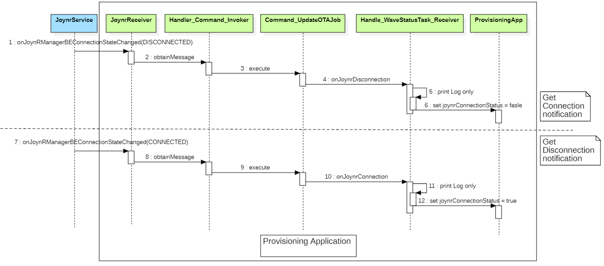
Image reference: doc_image_035.png

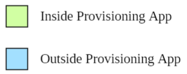
Image reference: doc_image_036.png

Figure 25: Consequence of the Provisioning App when getting a disconnection from Joynr Service.

Go TRAMO mode (Transport mode).

The same thing happens when the Provisioning gets TRAMO mode notification from Power Service, it will go to NetworkUnavailable state.

(*Note: The orange area is new classes)
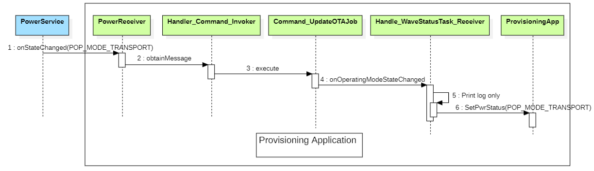
Image reference: doc_image_037.png

Image reference: doc_image_038.png

Figure 26: Consequence of the Provisioning App when getting a disconnection from Joynr Service.

onDestroy.

When Provisioning App gets onDestroy() from Application Service, it will un-register to Services.

(*Note: The orange area is new classes)

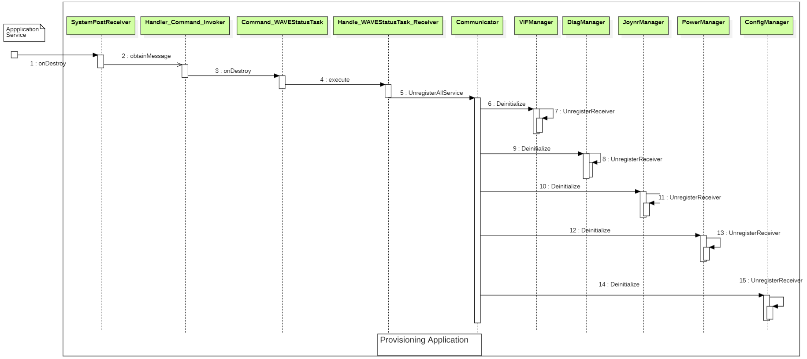
Image reference: doc_image_039.png

Figure 27: Consequence onDestroy diagram of the Provisioning App.
