# Raw Slide Content

- Source file: FA_Document_tuyen.dang/Internal_Design_of_Provisioning_App_supports_expanding_features_FA.pptx
- Total slides: 24

## Slide 1

Image reference: slide_01_image_01.png

Image reference: slide_01_image_02.png

FA 인증과제
Internal Design of Provisioning App supports expanding features
By Tuyen.dang
Supervise by 김병용
LGEDV CORE FRAMEWORK 1 TEAM
October 8th 2023

## Slide 2

Image reference: slide_02_image_01.png

Image reference: slide_02_image_02.png

TABLE CONTENT

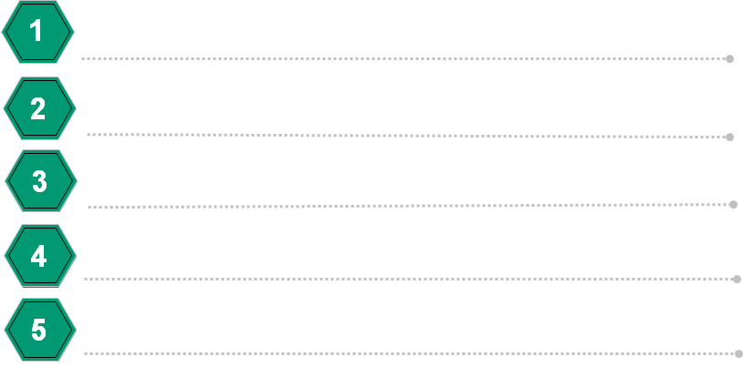
Image reference: slide_02_image_03.png

Problem Identification

Architecture Design Proposals & Comparison

Architecture Decision

Design Results

Q&A

## Slide 3

Image reference: slide_03_image_01.png

Image reference: slide_03_image_02.png

1. Problem Identification

[Unresolved image on slide 3, picture 3]

Provisioning Application

Provisioning App: always makes sure the WAVE board is using a valid Provisioning file.

Functional Requirement of Provisioning App:

Downloading a Provisioning file from BMW backend server.
Unzip support on the downloaded file.
Performing security check on the downloaded file.
Support diagnostics jobs.
Delete the current Provisioning file in WAVE.

Overview of Provisioning App.

  VIF
Service

 Joynr
Service

  Diag
Service

  Config
Service

  Security
Service

 Power
Service

  Telephony
   Service

*Note: Provisioning file or OTA file is a config data file that decides how WAVE board works.

## Slide 4

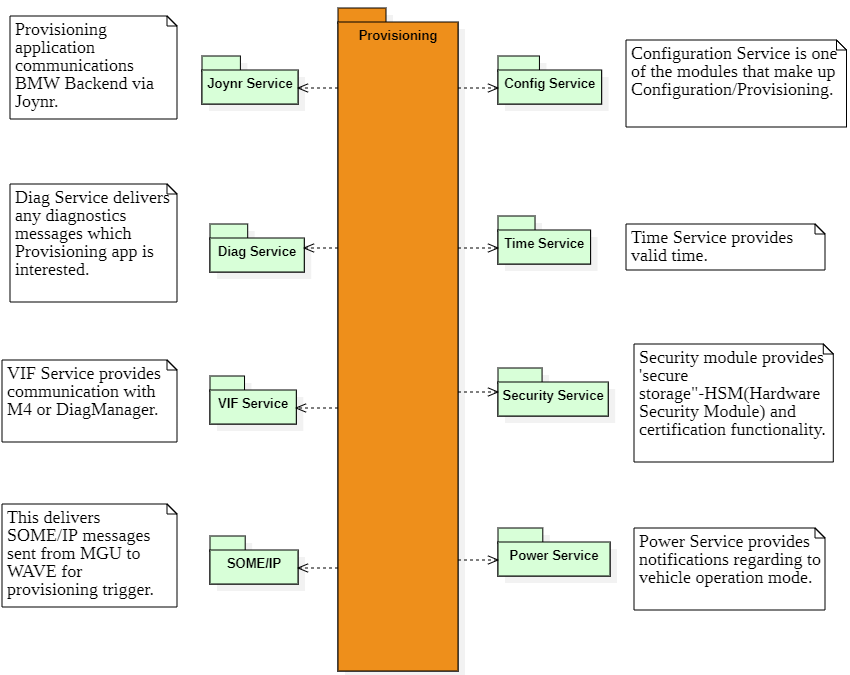
Image reference: slide_04_image_01.png

Image reference: slide_04_image_02.png

Image reference: slide_04_image_03.png

1. Problem Identification

Context Diagram of Provisioning App.

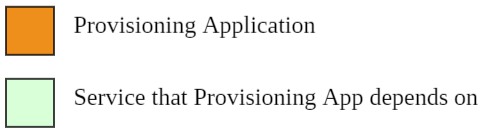
Image reference: slide_04_image_04.png

## Slide 5

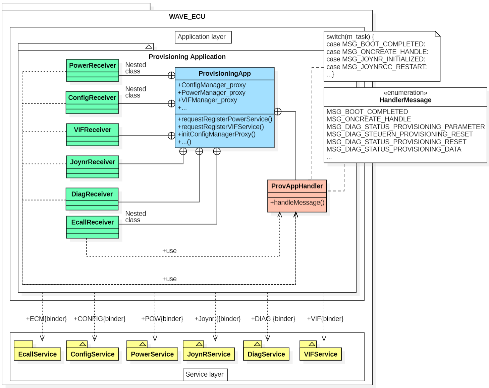
Image reference: slide_05_image_01.png

Image reference: slide_05_image_02.png

Image reference: slide_05_image_03.png

1. Problem Identification

Current Architecture Design Problems

Problems:

ProvisioningApp class has to take care of all Services' proxies and Receiver classes.
Have only one Handler to solve all notifications and requests from outside Services.
A big Enum and switch-case logic is being used to identify the notifications/requests.

Difficult for feature expansion.

Duplicated & Non-reusable.

Difficult for feature maintenance.

*Note: A Service's proxy is a pointer that allows you to interact with the Service.

## Slide 6

Image reference: slide_06_image_01.png

Image reference: slide_06_image_02.png

1. Problem Identification

Why make Architectural Decision?

1: Reduce the effort extension and modification of Provisioning Application.
Modifiability. (Most important)
Maintainability.
2: Make Provisioning App can be easy to apply to another project
Reusability.

Improve 1: Decouple Provisioning App with its dependencies.

Improve 2: Design new Handler class that won't be impacted when updating a new request/notification.

Need to improve two things:

*Note: With each Improve, I'll prepare two proposals and choose the best one.

## Slide 7

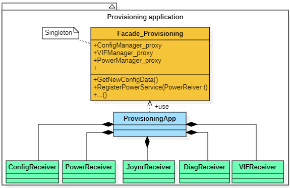
Image reference: slide_07_image_01.png

Image reference: slide_07_image_02.png

Image reference: slide_07_image_03.png

Improve 1 : Decouple Provisioning App with its dependencies.

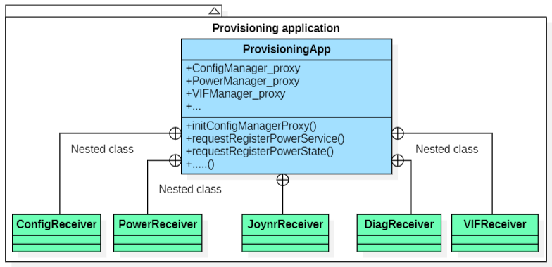
Image reference: slide_07_image_04.png

Architecture proposal 1: Using Façade pattern.

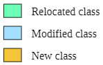
Image reference: slide_07_image_05.png

Pros:
Most important: Reduce coupling between Provisioning App with its dependencies. (Illustrate in the next slide)
Protect Single Responsibility Principle.
Improves the readability of Provisioning app.
Cons:
  Adding an extra layer of abstraction can increase the latency and the resource consumption of the system.
The Facade can become a god object.

Facade helps us take care of everything about interacting with Services outside.

2.1: Architecture Design Proposals

Provisioning App uses API of Facade class not Services' API.

As-is

To-be

## Slide 8

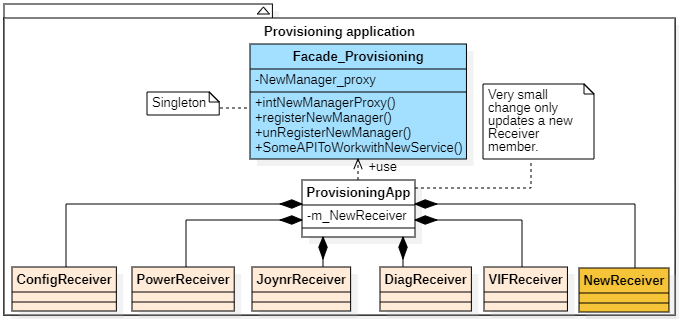
Image reference: slide_08_image_01.png

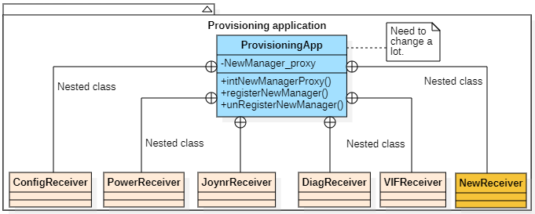
Image reference: slide_08_image_02.png

Benefit illustration (When a new Service needs to be added to Provisioning App).

Add a new Service.

Current Architecture

Using Façade pattern

Add a new Service.

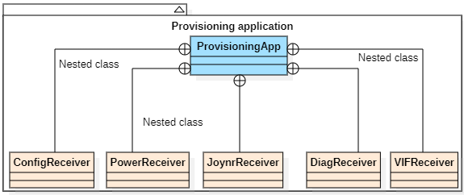
Image reference: slide_08_image_03.png

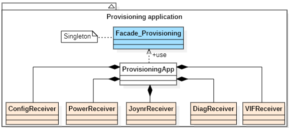
Image reference: slide_08_image_04.png

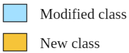
Image reference: slide_08_image_05.png

Modifiability: Low, ProvisioningApp class gets a big change to adapt the update.

Modifiability: Medium, ProvisioningApp class is protected but the Facade class still has to get impact to adapt the update.

Architecture proposal 1: Using Façade pattern.

As-is

To-be

## Slide 9

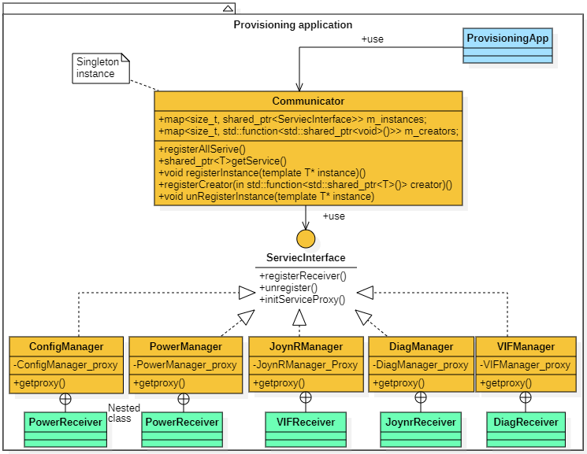
Image reference: slide_09_image_01.png

Image reference: slide_09_image_02.png

Image reference: slide_09_image_03.png

2.1: Architecture Design Proposals

Improve 1 : Decouple Provisioning App with its dependencies.

Architecture proposal 2: Using Communicator.

Image reference: slide_09_image_04.png

Pros:
Most important: Reduce coupling between Provisioning App with its dependencies. (Illustrate in the next slide)
Protect Open/Closed and Single Responsibility Principle.
Allow lazy initialization that can improve performance.
Cons:
Source code can be complicated.

Image reference: slide_09_image_05.png

Communicator store and provides instances of Manager classes

As-is

To-be

## Slide 10

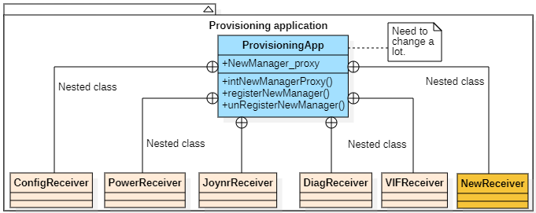
Image reference: slide_10_image_01.png

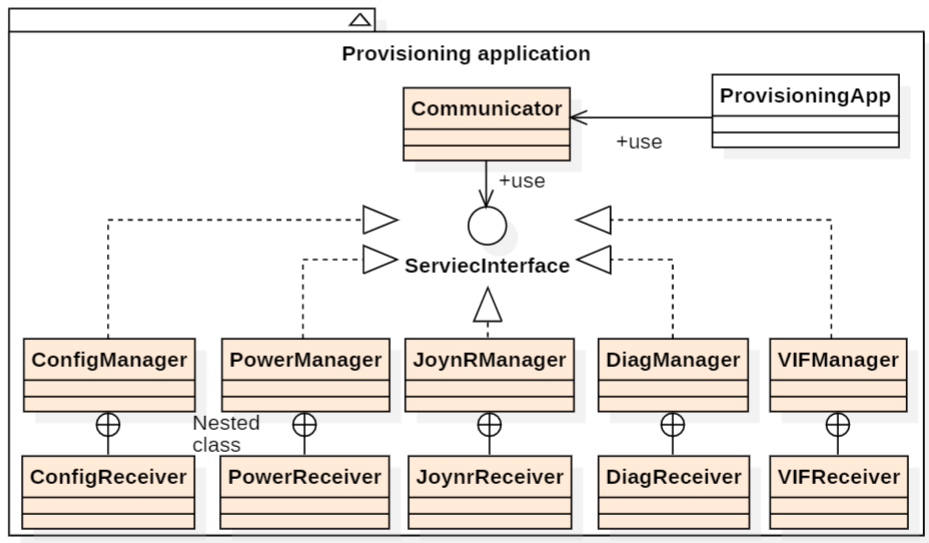
Image reference: slide_10_image_02.png

Benefit illustration (When a new Service needs to be added to Provisioning App).

Add a new Service.

Current Architecture

Using Communicator

Add a new Service.

Image reference: slide_10_image_03.png

Image reference: slide_10_image_04.png

Modifiability: Low, ProvisioningApp class gets a big change to adapt the update.

Modifiability: High, the impact of the change on existing logic is very small.

As-is

To-be

Architecture proposal 2: Using Communicator.

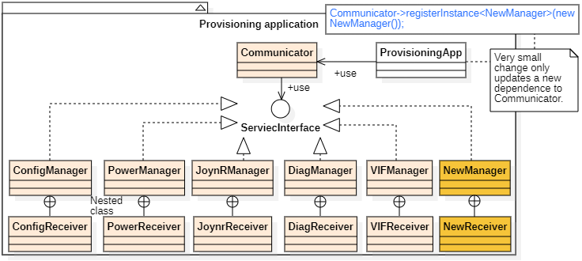
Image reference: slide_10_image_05.png

## Slide 11

Image reference: slide_11_image_01.png

Image reference: slide_11_image_02.png

2.2: Compare Design Proposals

### Table
| Proposal | Modifiability(Most important) | Reusability | Maintainability |
| Proposal 1: Using Façade | Medium: Service changes can't effect to Provisioning App logic due to Facade restricts it interact with Services directly. | Medium: With the Facade approach, we tend to make it can deal with our own application logic. Each project has different requirements so not easy to apply one Facade structure to another project. | High: Support maintainability because of reducing the coupling between components and simplifying the interactions between them. |
| Proposal 2: Using Communicator | High: Every Service is encapsulated in its own class. When something changes, only it needs to be modified. | High: All of Application has a pub-sub model and proxy-client model can utilize this one. So easy to apply it to other projects. | High: Support maintainability because of reducing the coupling between components. |

Asset each proposal to the listed criteria.

 Decided as Proposal 2: Using Communicator to decouple Provisioning App with its dependencies.

## Slide 12

Image reference: slide_12_image_01.png

Image reference: slide_12_image_02.png

Proposal 1: Using Chain of Responsibility pattern.

2.1: Architecture Design Proposals

Improve 2: Design new Handler class that won't be impacted when updating a new request/notification.

Pros:
   Most important: A new Handler class can be introduced without breaking existing code. (Illustrate in the next slide)
   Protect Single Responsibility, Open/Closed Principle.
Handy when wanting to control the flow of request handling.
Cons:
   Can increase the maintenance sometimes.
   Can get broken lead some requests may end up unhandled or handled incorrectly.

Image reference: slide_12_image_03.png

Image reference: slide_12_image_04.png

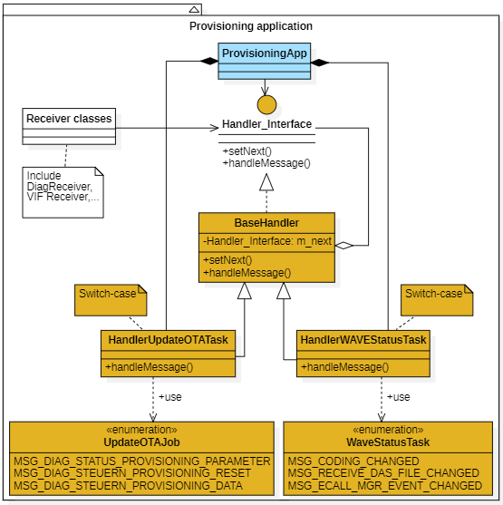
Image reference: slide_12_image_05.png

As-is

To-be

## Slide 13

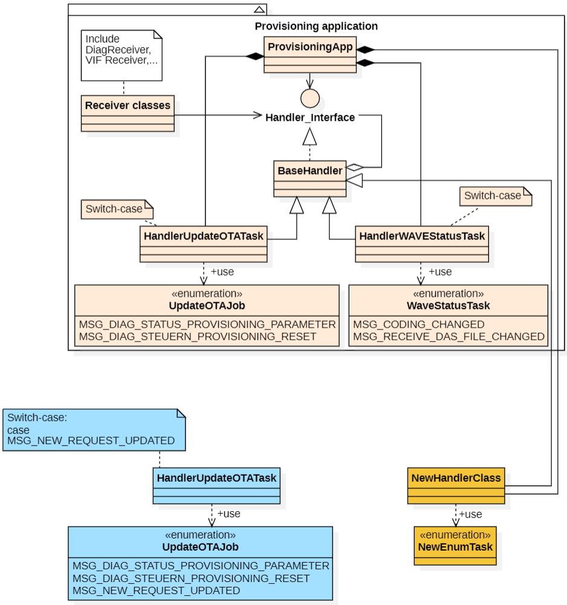
Image reference: slide_13_image_01.png

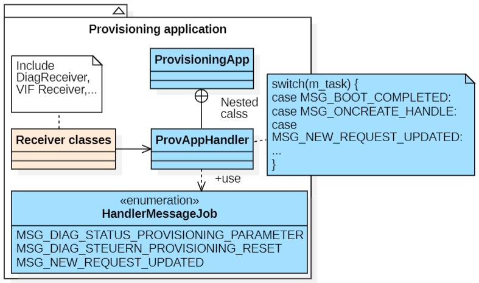
Image reference: slide_13_image_02.png

Benefit illustration (When a new request/notification needs to be added).

Add a new request/notification .

Current Architecture

Using Chain of Responsibility pattern

Add a new request
/notification

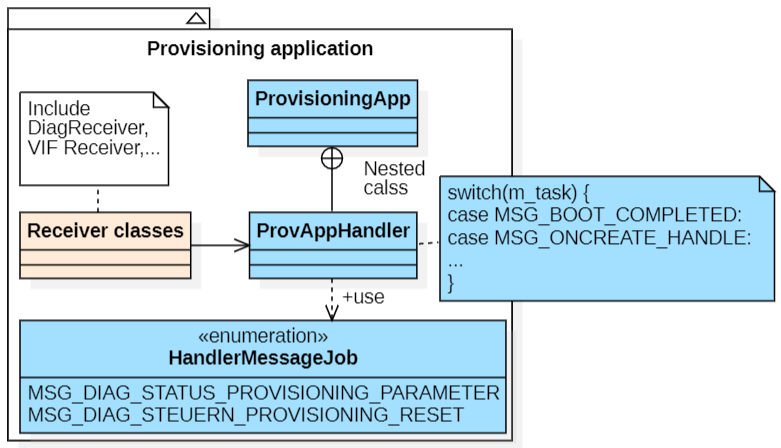
Image reference: slide_13_image_03.png

Option 1: Modify an
old handler class.

Option 2: Add a new
handler class.

Image reference: slide_13_image_04.png

Modifiability: Low, ProvisioningApp class gets a big change to adapt the update.

Modifiability: Medium, with the option 1, the switch-case and Eum table of the old class has to modified.

As-is

To-be

Proposal 1: Using Chain of Responsibility pattern.

## Slide 14

Image reference: slide_14_image_01.png

Image reference: slide_14_image_02.png

2.1: Architecture Design Proposals

Improve 2: Design new Handler class that won't be impacted when updating a new request/notification.

Proposal 2: Using Command pattern.

Pros:
 Most important: A new Handler class or new request can be introduced without breaking existing logic. (Illustrate in the next slide)
Can assemble a set of simple commands into a complex one.
Protect Single Responsibility, Open/Closed Principle.
Easy to implement undo/redo.
Cons:
  Source code can be complicated.

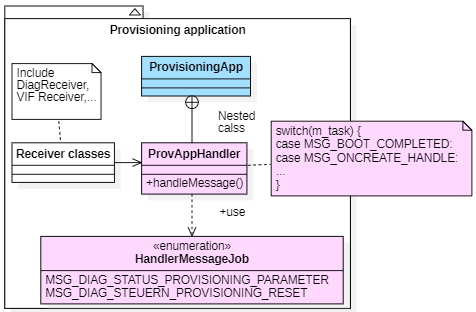
Image reference: slide_14_image_03.png

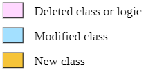
Image reference: slide_14_image_04.png

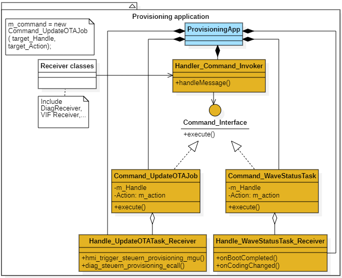
Image reference: slide_14_image_05.png

As-is

To-be

## Slide 15

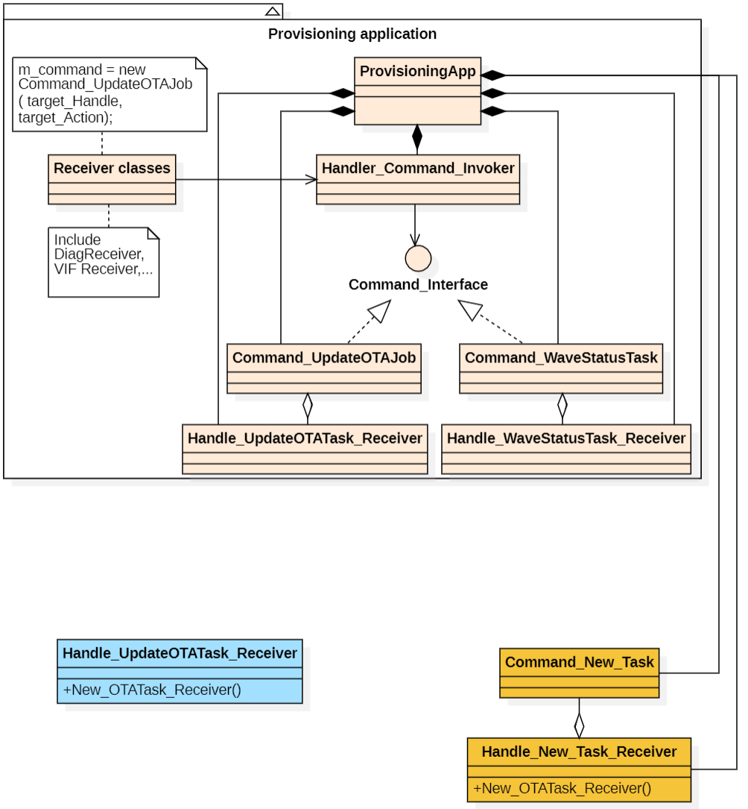
Image reference: slide_15_image_01.png

Current Architecture

Using Command pattern

Add a new request/notification.

Image reference: slide_15_image_02.png

Add a new request/notification .

Image reference: slide_15_image_03.png

Option 1: Modify an
old handler class.

Option 2: Add a new
handler class.

Image reference: slide_15_image_04.png

Modifiability: Low, ProvisioningApp class gets a big change to adapt the update.

Modifiability: High, both the impact of option 1 or option 2 on existing logic is very small.

As-is

To-be

Benefit illustration (When a new request/notification needs to be added).

Proposal 2: Using Command pattern.

## Slide 16

Image reference: slide_16_image_01.png

Image reference: slide_16_image_02.png

2.2: Compare Design Proposals

### Table
| Proposal | Modifiability(Most important) | Reusability | Maintainability |
| Proposal 1: Using Chain of Responsibility | Medium: The occurrence of duplicate code across handlers sometimes happens. So more than one place needs to change if updated. | High: Any application, service has to work with a chain of objects such as filters, event chains can apply this approach. | Medium: If we want to add a new task to an old class, switch-case logic of that class needs to be modified. |
| Proposal 2: Using Command | High: Handle classes work independently, once one class is changed no impact on others. | High: It’s used as an alternative for callbacks to parameterize User or Services elements with actions. So can apply for almost of project has pub-sub model. | High: We can introduce a new Handle class or a new task that is included by an old class without breaking existing logic. |

Asset each proposal to the listed criteria.

Decided as Proposal 2: Using Command pattern to design new Handler class that won't be impacted when updating a new request/notification.

## Slide 17

Image reference: slide_17_image_01.png

Image reference: slide_17_image_02.png

3. Architecture Decision

Factors affecting Design Decisions:
Reduce cost when updating new features or modifying old logic. (Most important)
Able to be used in many different projects.

Improve 1: Decouple Provisioning App with its dependencies.
Decided as Proposal 2. (Using Communicator)
     In the Provisioning app, at a specific time usually need only a Service Proxy, so we rather to use the Proxy to call directly instead of making an abstraction API and working through it (Performance issue). When really needed, Communicator still can work like a Facade because it has all Service instances.
Improve 2: Design new Handler class that won't be impacted when updating a new request/notification.
Decided as Proposal 2. (Using Command pattern)
     In the Provisioning app, most of the requests can be handled by one handler. Using Chain of Responsibility is unnecessary, and can make deep stack traces, which can affect performance.

## Slide 18

Image reference: slide_18_image_01.png

Image reference: slide_18_image_02.png

Increase Modifiability & Maintainability.
Maintain Semantic Coherence:
Each dependency is separated into its own class, following Single Responsibility. (A)
Tasks are divided according to their purpose. Updating OTA file or about new Configdata changing. No overlap between them. (B)
Abstract Common Services:
Common tasks of all Services are declared in the interface class. (A)
Use an Intermediary:
Dependencies are saved in Communicator and be get when needed via it. (A)
Use runtime Registration:
Dependencies can be registered/unregistered during Runtime. (A)
Use encapsulation:
All information of a task is encapsulated inside an object before being sent to Handler. (B)
Traceability:
From the sender's side, all information about action that will be taken after sending can be seen via the task object. (B)
Readability:
All changes are based on popular patterns that make the app more understandability since every developer should be familiar with the patterns. (A & B)
Increase Reusability.
All of Application has a pub-sub model and proxy-client model can utilize those changes. (A & B)

Value of architectures.

A: Using Communicator.
B: Using Command.

3. Architecture Decision

## Slide 19

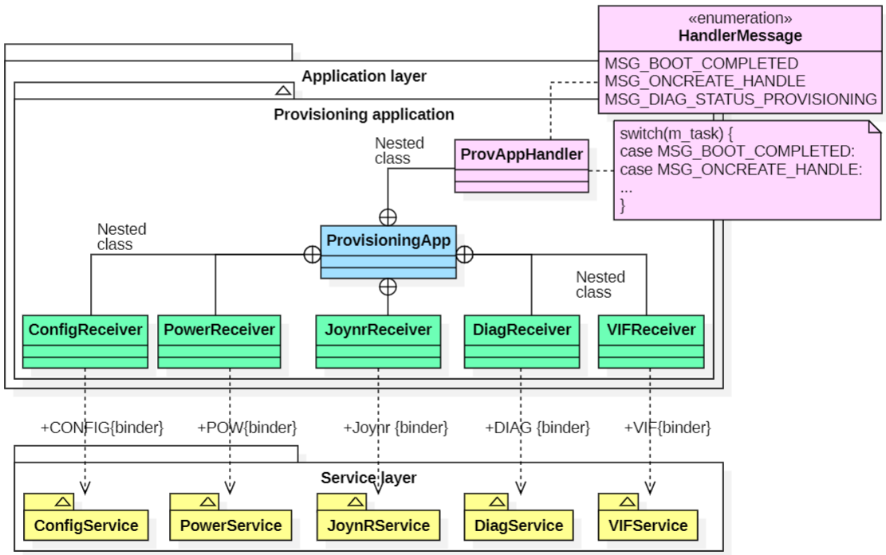
Image reference: slide_19_image_01.png

Image reference: slide_19_image_02.png

Image reference: slide_19_image_03.png

4. Design Results

Context Diagram of Provisioning Application

Old architecture

New architecture

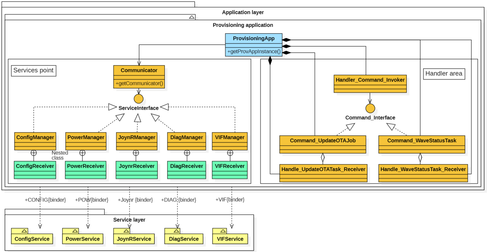
Image reference: slide_19_image_04.png

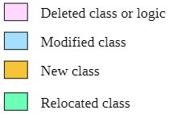
Image reference: slide_19_image_05.png

## Slide 20

Image reference: slide_20_image_01.png

Image reference: slide_20_image_02.png

Experimental result

//Provisioning App is created.
2023/09/18 14:28:28.027000 23.5886 11 WAVA PROV PROV 2821 log info verbose 1 [ ProvApp ][ Handle_WaveStatusTask_Receiver::onCreateHandle ][ tid::5054 ] onCreateHandle - Start.
//It registers Service it depends.
2023/09/18 14:28:28.030000 23.5896 18 WAVA PROV PROV 2821 log info verbose 1 [ ProvApp ][ DiagManager::DiagManager ][ tid::5054 ] Register DiagManager instance
2023/09/18 14:28:28.030000 23.5896 19 WAVA PROV PROV 2821 log info verbose 1 [ ProvApp ][ VIFManager::VIFManager ][ tid::5054 ] Register VIFManager instance
2023/09/18 14:28:28.033000 23.5918 27 WAVA PROV PROV 2821 log info verbose 1 [ ProvApp ][ Handle_WaveStatusTask_Receiver::onCreateHandle ][ tid::5054 ] onCreateHandle - End.
//Get a request to download a new OTA.
2023/09/18 14:31:51.899000 231.7733 41 WAVA PROV PROV 2821 log info verbose 1 [ ProvApp ][ ProvisioningApp::Handler_Command_Invoker::handleMessage ][ tid::5054 ] Handle Command Request
2023/09/18 14:31:51.899000 231.7733 42 WAVA PROV PROV 2821 log info verbose 1 [ ProvApp ][ Command_UpdateOTAJob::execute ][ tid::5054 ] Execute Command_UpdateOTAJob
2023/09/18 14:31:51.900000 231.7733 43 WAVA PROV PROV 2821 log info verbose 1 [ ProvApp ][ Handle_UpdateOTATask_Receiver::diag_steuern_provisioning_ecall ][ tid::5054 ] diag_steuern_provisioning_ecall
//A new OTA file is downloaded successfully.
2023/09/18 14:31:56.041000 235.9190 193 WAVA PROV PROV 2821 log info verbose 1 [ ProvApp ][ ProvisioningApp::JoynrSendVehicleProvisioning ][ tid::5054 ] VehicleProvisioningResult OK

By the way, with the support of lazy initialization, OnCreate times are reduced 0,1s. (Improve performance)

Before
2023/09/18 14:26:55.639000 25.1109 10 WAVA PROV PROV 2851 log info verbose 1 [ ProvApp ][ provisioningApp.cpp::onCreateHandle ][ tid::5251 ] onCreateHandle Start.
2023/09/18 14:26:55.752000 25.2498 38 WAVA PROV PROV 2851 log info verbose 1[ ProvApp ][ provisioningApp.cpp::onCreateHandle ][ tid::5251 ] onCreateHandle End.
After
2023/09/18 14:28:28.027000 23.5886 11 WAVA PROV PROV 2821 log info verbose 1 [ ProvApp ][ Handle_WaveStatusTask_Receiver::onCreateHandle ][ tid::5054 ] onCreateHandle - Start.
2023/09/18 14:28:28.033000 23.5918 27 WAVA PROV PROV 2821 log info verbose 1[ ProvApp ][ Handle_WaveStatusTask_Receiver::onCreateHandle ][ tid::5054 ] onCreateHandle - End.

Test the stability of Provisioning App: After applying changes, Provisioning App works well.

## Slide 21

Image reference: slide_21_image_01.png

Image reference: slide_21_image_02.png

Experimental result

Test the modifiability of Provisioning App: When Provisioning App needs to include a new Service (Audio Service).

Link commit: http://vgit.lge.com/eu/c/bmw/linux/provisioningapp/+/1553422

Image reference: slide_21_image_03.png

Modification on ProvisioningApp class is very small (2 lines of code). (Good Modifiability)

2023/09/22 19:55:29.193000 25.3161 25 WAVA PROV PROV 2872 log info verbose 1 [ ProvApp ][ AudioManager::AudioManager ][ tid::5316 ] Register AudioManager instance

2023/09/22 19:55:30.855000 26.1754 34 WAVA PROV PROV 2872 log info verbose 1[ ProvApp ][ AudioManager::registerReceiver ][ tid::5316 ] registerReceiver AudioManager

2023/09/22 20:00:34.617000 330.7409 189 WAVA PROV PROV 2872 log info verbose 1[ ProvApp ][ AudioManager::AudioReceiver::onAudioPlayStateChanged ][ tid::5321 ] onAudioPlayStateChanged

2023/09/22 20:00:34.618000 330.7410 191 WAVA PROV PROV 2872 log info verbose 1 [ ProvApp ][ Handle_WaveStatusTask_Receiver::Handle_OnAudioPlayStateChanged ][ tid::5316 ] Handle_OnAudioPlayStateChanged

// Provisioning App handles the request.

// Provisioning App registers Audio Service.

//Audio Service sends a notification.

// Provisioning App registers AudioManager instance.

My plan

My solution can apply not only to Provisioning App but also to any app that flows proxy-client and pub-sub model. (Very popular in LG)

So even WAVE project is nearly done and applying the changes to the event branch is impossible. But I can do that on another project in the future.

## Slide 22

Image reference: slide_22_image_01.png

Image reference: slide_22_image_02.png

5. Q&A

Q&A
Thank you for listening!

## Slide 23

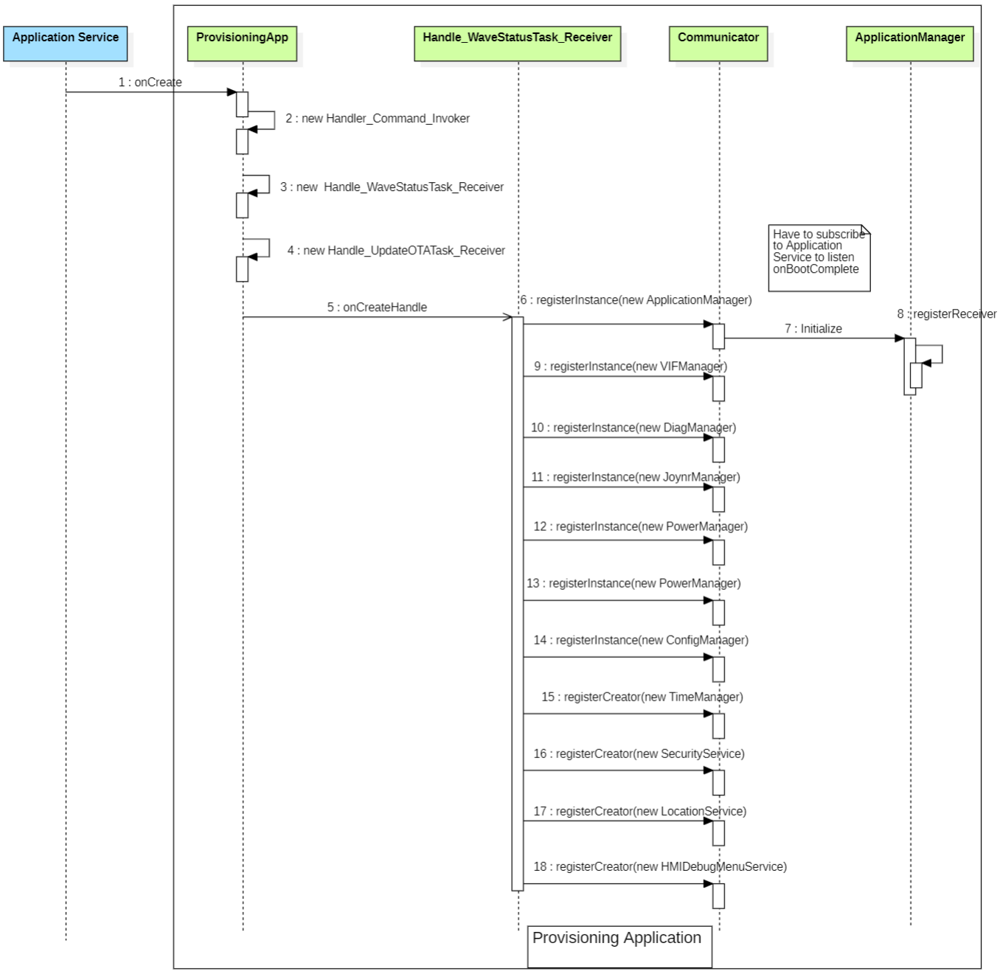
Image reference: slide_23_image_01.png

Image reference: slide_23_image_02.png

Image reference: slide_23_image_03.png

5. Appendix

OnCreate

## Slide 24

Image reference: slide_24_image_01.png

Image reference: slide_24_image_02.png

OnBootComplete

Image reference: slide_24_image_03.png

