# Raw Document Content

- Source file: FA_Documents_minh1.nguyen/FA - Improve LPA design for easy application on new  projects_v0.4.docx

FA Certificate (Improve LPA design for easy application on new projects)

About This Document

Document Information

## Table
| Issuing authority | LGE-VS-BMW-WAVE |
| --- | --- |
| Status of document | In Progress |

Revision History

## Table
| Version | Date | Notes | Author | Approval |
| --- | --- | --- | --- | --- |
| 0.1 | 2021.09.06 | Initial Release | minh1.nguyen |  |
| 0.2 | 2021.09.13 | Update Quality Attribute | minh1.nguyen |  |
| 0.3 | 2021.09.20 | Add Algorithm Design | minh1.nguyen |  |
| 0.4 | 2021.09.26 | Update Sequence Diagram | minh1.nguyen |  |

Acronyms / Glossary

## Table
| Acronyms | Description |
| --- | --- |
| LPA | Local Profile Assistant |
| SIM | Subscriber Identity Module |
| eSIM | embedded SIM |
| M2M SIM | Machine to Machine embedded SIM |
| CSIM | Consumer embedded SIM |
| SM-DS | Subscription Management Discovery Server |
| SM-DP+ | Subscription Manager Data Preparation |
| eUICC | The Embedded Universal Integrated Circuit Card |
| MNO | Mobile Network Operator |
| IMEI | International Mobile Equipment Identity |
|  |  |
|  |  |
|  |  |

## Table
| Glossary | Description |
| --- | --- |
| Tiger Platform | Telematic platform developed by LGe |
| Service | A process working in background providing a solution |
| SIM Subscription Management | A standardized architecture which is to manage SIM profiles over the air, is offered by GSMA. |

Figures

Figure 1: Remote SIM Provisioning System, LPA in the Device	5

Figure 2: LPA architecture in ICON project	6

Figure 3: Local Profile Assistant use cases	8

Figure 4: Software Component diagram:	9

Figure 5: Current Architecture Design Context Diagram	10

Figure 6: Context Diagram of LPA with Modularization Approach	12

Figure 7: LPA Modularization Detailed Design	15

Figure 8: Classes Description For LPA Modularization Design	16

Figure 9: SIM Manager Factory using Factory Pattern	17

Figure 10: Service Adapter Design	18

Figure 11: Setup communication adapter	23

Figure 12: Create SIM Manager	24

Figure 13: LPA Standard component is designed with Command Pattern	25

Figure 16: Sequence diagram of a M2M SIM job	26

Figure 17: Sequence diagram of a Consumer SIM job	27

Table

Table 1: Quality Attributes	11

Table 2: Roles and Relation of components in the context diagram	13

Table 3: Proposal Comparison Summary	14

Table 4: SIM Manager Interfaces	19

Table 5: Service Manager Interfaces	20

Table 6: Structure Design	20

Table 7: How to use SIM Manager Factory	21

Table 8: Setup Communication Adapter	22

Purpose

This document specifies the software architectural design to enhance some quality attributes of LPA, to make it more modifiable, reusable and more flexible when integrating with new systems.

This design document also serves as a guideline on how software developers can integrate LPA module in other projects.

Background

LPA stands for Local Profile Assistant that provides the features of download and install new profile in the SIM card, enable/disable/delete SIM profile, synchronize the notifications in the SIM card to the servers of SIM Subscription Management.

In automotive domain, LPA is now poplarly developed in Telematic Unit to support OEM business on managing global manufacturing process when their product is deployed in the field. LPA also provides convenient functions to enhance users experience like the way eSIM is being used in smartphones.

The below figure describes the roles and interfaces associated with LPA, eUICC, SIM Subscription Management.

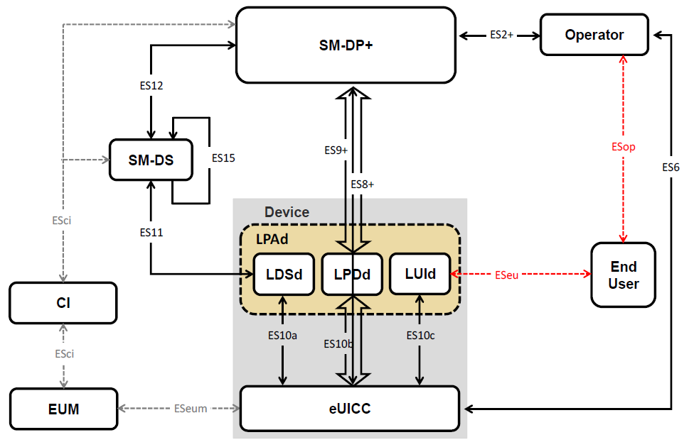
Image reference: doc_image_001.png

Figure 1: Remote SIM Provisioning System, LPA in the Device

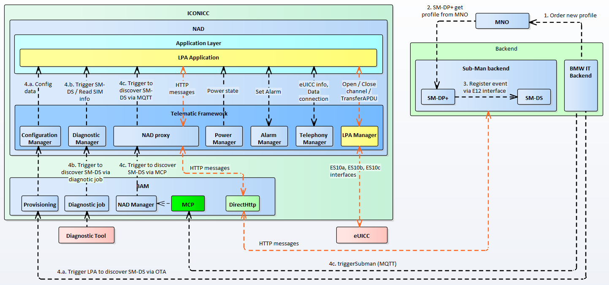
Image reference: doc_image_002.png

Figure 2: LPA architecture in ICON project

Currently, there are some disadvantages in LPA design where the OEM requirements and GSMA standard requirements are not separated into different components. There the LPA standard that implement GMSA requirements directly call the services in Telematic framework without any adapter. Because of the current design, developers will take a lot of effort to modify, integrate LPA application in new projects with different system architecture.

To avoid this situation, a new design of LPA should be considered to enhance the modifiability, reusability, modularity.

Scope

This document describes the following about new design for LPA application.

SW Architectural representation.

External interface design.

Sequence diagram for use case.

Audience

The readers of this article are as follows.

Software architect who will evaluate the design of the software.

Software engineers who want to develop LPA in new projects.

Related Documents

The project documentation associated with this document is:

SGP.02 - Remote Provisioning Architecture for Embedded UICC Technical Specification

SGP.22 - RSP Technical Specification version 2.2 published by GSM Association.

Overview

Use Cases

There are 2 types of embedded SIM card when considering the 2 purposes as below:

M2M eSIM: it is an eSIM that is used for the remote provisioning and management of machine to machine (M2M) connections, allowing the “over the air” provisioning of an initial operator subscription, and the subsequent change of subscription from one operator to another. And these features are managed by OEM backend and MNO (Mobile Network Operator).

Consumer eSIM: it is also an eSIM like M2M eSIM but the use cases are different. Consumer eSIM is only used by customer, for example: vehicle owner, mobile phone owner. The features like SIM profile download, installation, enablement, disablement, deletion … are triggered by users.

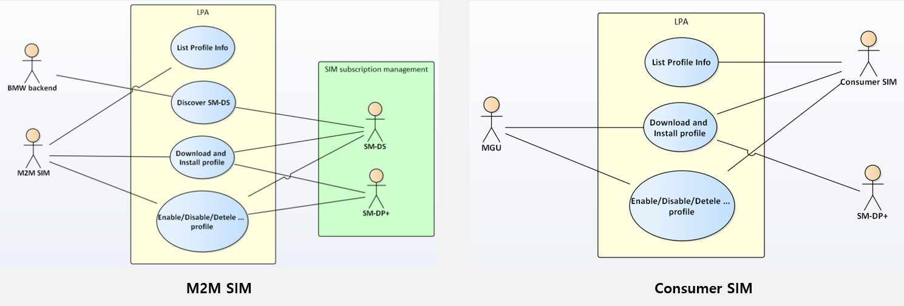
Image reference: doc_image_003.png

Figure 3: Local Profile Assistant use cases

Software Components

Where is LPA located in a telematic unit? Please see below component diagram. This diagram refers to the architecture of BMW ICON project. There are 2 big component in this design: NAD and BAM. NAD is deveploped by LG Electronics based on LG telematic framework, it is called Tiger Platform. BAM is developed by BMW based on NEO framework but some modules on BAM are implemented by LG engineers. LPA is located in application layer, it communicates with SIM card via Telephony Manager service and connects to HTTP server via DirrectHttp module in BAM

Image reference: doc_image_004.png

Figure 4: Software Component diagram:

Problem Descriptions

As described in above session, the goal of LPA design improvement to enhance the abilities of modification, reusability when migrating LPA to new projects.

The below is current design of LPA:

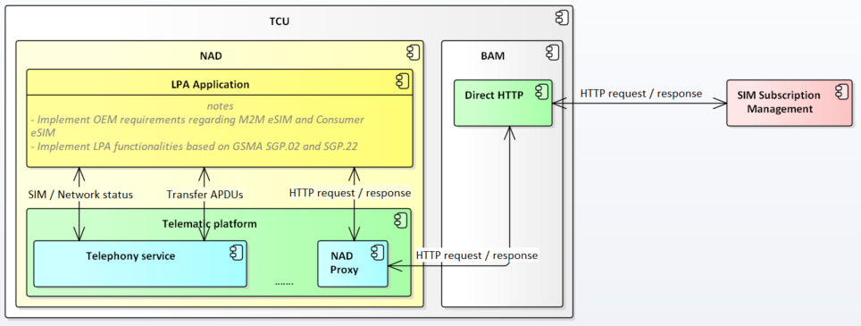
Image reference: doc_image_005.png

Figure 5: Current Architecture Design Context Diagram

The OEM specific requirements and the GSMA standard are not implemented separately. When applying LPA on other OEM projects, engineers will meet some difficulty to modify the LPA based on new OEM requirements.

The LPA is using Telephony service and HTTP client (Direct HTTP module) directly without an adapter. The Telephony service and HTTP client can be implemented in different ways in other projects. Therefore, engineers will take a lot of time to integrate the LPA with new systems.

Architecture Design Proposal

As described in the beginning of this document, LPA complies with GSMA standard, it is getting more popular by time in automotive domain. Many OEMs are applying this module in their vehicles. BMW WAVE project was very first project of LG where LPA was included. To reduce the effort for migrating LPA to other projects in future and increase the possibility of updating implementation according to new OEM requirements. Based on that, an idea of modularizing LPA is proposed in this thesis.

In below sections, the basic concept of my proposal design will be introduced with context diagrams. The criteria that is considered as advantages of new design to address the new quality attributes.

2.1 Quality Attributes

Because the purpose of this FA topic is to apply LPA in other OEM projects, the below quality attributes should be addressed. In this section, a new design will be proposed that can replace current one to enhance the quality attributes as below:

Modifiability

Reusability

Modularity

## Table
| No. | QA Scenarios | Quality Attributes | Priority |
| --- | --- | --- | --- |
| 1 | The LPA application can be easily modified when applying in other OEM projects with specific requirements. | Modifiability | High |
| 2 | The LPA standard part can be easily integrated with new systems without any modification. | Reusability | High |
| 3 | The LPA should be designed as modularity. When changing one of its components, the other ones will not be affected. | Modularity | Medium |

Table 1: Quality Attributes

2.2 LPA Modularization Design

A new proposal design as following is considered to address the quality attributes that were offered in session 2.1. The LPA will be divided into smaller components, each component will take care specific requirements, tasks. The 3 components should be present in LPA application: LPA OEM part, LPA Standard, Communication Adapter.

LPA OEM part: this component will implement OEM related requirements.

LPA Standard: the GMSA standard requirements (defined in SGP.02 and SGP.22) will be totally implemented in this component.

Communication Adapter: this component is an adapter to help LPA OEM part and LPA Standard components can connect to services in Telematic framework.

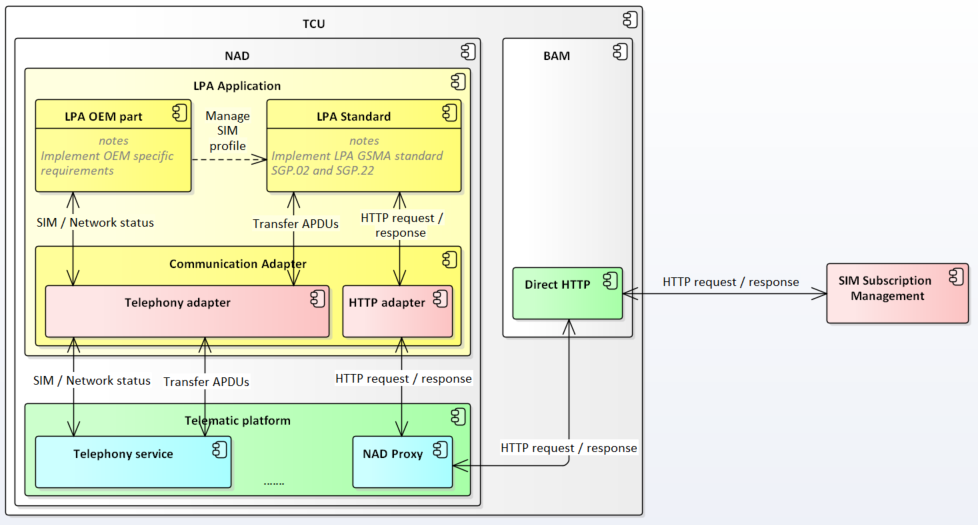
Image reference: doc_image_006.png

Figure 6: Context Diagram of LPA with Modularization Approach

Table 1 describes roles of each component of LPA when approaching modularization concept, the relationship between the components.

## Table
| No. | Component | Description | Relationship |
| --- | --- | --- | --- |
| 1 | LPA OEM part | Implementing OEM requirements. It answers following questions: - When LPA needs to send HTTP request to SIM Subscription Management to process remote events? - When LPA need to enable/disable/delete SIM profiles? - How to synchronize SIM profiles status in the SIM card with SIM Subscription Management? | - LPA OEM part manages SIM profiles by interacting with LPA Standard component. - LPA OEM part manages and listens the vehicle status by using interfaces with Telematic services that are wrapper by Communication Adapter. |
| 2 | LPA Standard | Implementing the requirements defined in GMSA SGP.02 and SGP.22 - SIM profile handling. - Communicate with servers SIM Subscription Management platform. | - LPA Standard provides LPA OEM part with interfaces of SIM profile management. - LPA Standard interface with the SIM card and SIM Subscription Management via Communication Adapter component. |
| 3 | Communication Adapter | Converting Telephony and HTTP interfaces offered by Telematic platform to help LPA standard can communicate with these services. Additionally, this component also wraps interfaces of the services in Telematic platform to adapt with LPA OEM part: Power Manager, Configuration Manager, Diagnostic Manager, … | - Help LPA Standard component can communicate with Telematic platform. - Adapter between LPA OEM part and Telematic platform. |

Table 2: Roles and Relation of components in the context diagram

2.3 Proposal Comparison Summary

To compare the pros and cons of LPA modularization design and current design, please refer to below table:

## Table
| Quality Attributes | Situation | Current Design | LPA Modularization Design |
| --- | --- | --- | --- |
| Modifiability | OEM requirements change. | Have to modify OEM related implementation and a part of LPA standard source code and Telematic services integration parts as well. | Only LPA OEM part is affected. |
| Modifiability | GMSA standard upgrades. | LPA standard implementation needs to be updated and a part of OEM requirements and Telematic services integration implementation need to be updated as well. | Only LPA Standard part is affected. |
| Modifiability | Telematic services update. | Telematic services integration implementation needs to be updated and a part of OEM requirements and a part of LPA standard implementation need to be updated as well. | Only Communication Adapter part is affected. |
| Reusability | Migrating LPA on new OEM projects. | The LPA standard can be reused but needs to be modified. | LPA Standard part can be used without any modification. |
| Modularization | Change request from OEM | Whole source code will be affected. | LPA Standard part will stay the same, only LPA OEM part needs to be updated. The Communication Adapter may need to be updated in this case, it depends on OEM change request. |
| Modularization | Telematic platform updates | Whole source code will be affected. | LPA Standard part and LPA OEM part will stay the same. Only Communication Adapter part needs to be updated |

Table 3: Proposal Comparison Summary

As described in the table above, the new design of LPA Modularization has more advantages than the current design. It can be easily adapted with any changes from OEM requirements, Telematic framework or even with the changes of GMSA standards.

Architecture Diagrams of LPA Modularization Architecture

3.1 Static Design

In session 2, the LPA Modularization design shows that it can address the quality attributes that this thesis targets. In this session, a detailed design will be described.

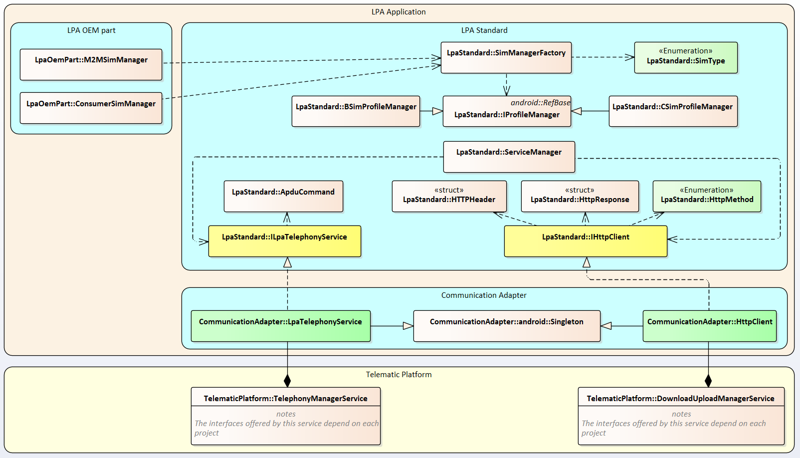
Image reference: doc_image_007.png

Figure 7: LPA Modularization Detailed Design

There are 3 main components:

LPA OEM part: The main business in LPA OEM part is implemented by M2MSimManager and ConsumerSimManager.

LPA Standard: LPA OEM part can create SIM Manager by using SimManagerFactory offered by LPA Standard.

Communication Adapter: it inherits interfaces ILpaTelephonyService and IHttpClient and implements some conversion to adapt with the interfaces offered Telematic Platform.

## Table
| Components | Classes | Descriptions |
| --- | --- | --- |
| LPA OEM part | M2MSimManager | Implement OEM requirements related to M2M eSIM. |
| LPA OEM part | ConsumerSimManager | Implement OEM requirements related to Consumer eSIM. |
| LPA Standard | SimManagerFactory | Provide method to create instances of SIM Manager by SIM type. |
| LPA Standard | IProfileManager | Define methods have to be supported by LPA for M2M eSIM and Consumer eSIM. |
| LPA Standard | BSimProfileManager | Inherit IProfileManager class, implement methods for M2M eSIM. |
| LPA Standard | CSimProfileManager | Inherit IProfileManager class, implement methods for Consumer eSIM. |
| LPA Standard | ServiceManager | Singleton class that provide accesses to Telephony service and HTTP client. LPA Standard will use these services to do its own business (GSMA standards). |
| LPA Standard | ApduCommand | Provide APDU format that is used to transfer data between LPA and eSIM. |
| LPA Standard | ILpaTelephonyService | Define methods that LPA Standard must use when communicating with eSIM. |
| LPA Standard | IHttpClient | Define methods that LPA Standard must use when communicating with SIM Subscription Management. |
| LPA Standard | HTTPHeader | Define format when LPA sends HTTP POST to servers of SIM Subscription Management. |
| LPA Standard | HttpResponse | Define format when LPA receives HTTP responses from servers. |
| LPA Standard | SimType | Defines SIM type that LPA supports, including 2 types: M2M_SIM, CONSUMER_SIM. |
| LPA Standard | HttpMethod | Define types of HTTP methods. |
| Communication Adapter | LpaTelephonyService | Inherit ILpaTelephonyService class from LPA Standard component. Convert Telephony interfaces in Telematic Platform to adapt with the interfaces that LPA Standard needs. |
| Communication Adapter | HttpClient | Inherit HttpClient class from LPA Standard component. Convert DownloadUploadManagerService interfaces in Telematic Platform to adapt with the interfaces that LPA Standard needs. |

Figure 8: Classes Description For LPA Modularization Design

3.1.1 SIM Manager Proxy Design

The below figure describes a design that uses Factory pattern. This design is used to create SIM manager by input SIM types. There are 2 SIM types are currently support by LPA, including: M2M eSIM and Consumer eSIM.

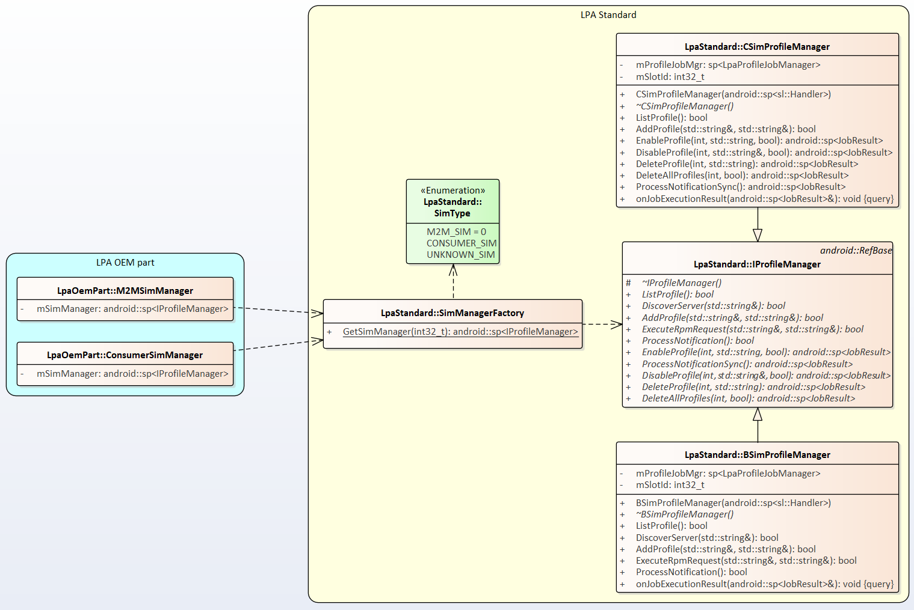
Image reference: doc_image_008.png

Figure 9: SIM Manager Factory using Factory Pattern

3.1.2 Services Adapter Design

The below figure describes a design that uses Adapter pattern. This design is used to convert interfaces in Telematic Platform to interfaces that are required by LPA Standard. This design helps LPA Standard can be easily adapted with different system without any customization.

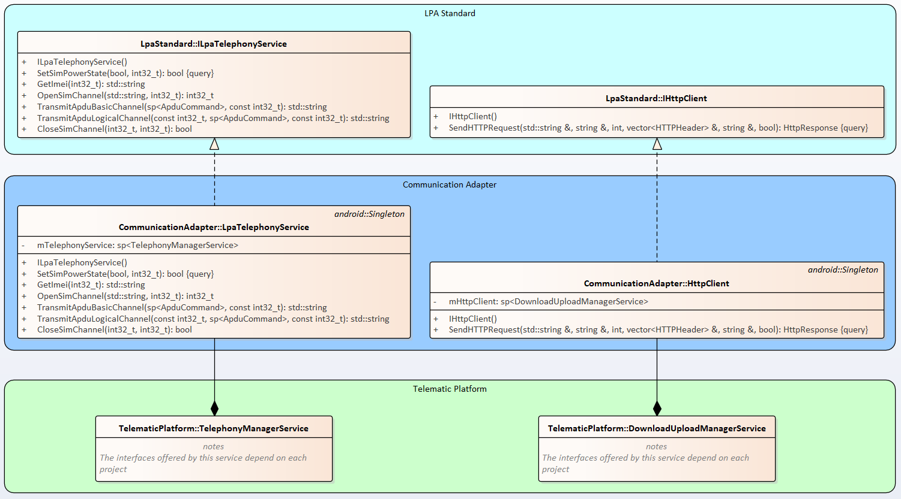
Image reference: doc_image_009.png

Figure 10: Service Adapter Design

3.2 Dynamic Design

3.2.1 Interaction Design

3.2.2.1 External Interface Design

The following tables show the proposal interfaces for communication between components in LPA application.

SIM manager interfaces: definition of interfaces between LPA OEM part and LPA Standard for SIM profile management.

Service manager interfaces: definition of interfaces between LPA Standard and Communication Adapter.

## Table
| No. | Function Name | Returned value | Parameters | Description |
| --- | --- | --- | --- | --- |
| 1 | ListProfile | bool |  | Read SIM profiles information. |
| 2 | DiscoverServer | bool | const std::string& smdsFqdn | Send HTTP request to SM-DS server to get events list. (To manage SIM profiles remotely, OEM server will interact with SM-DS to register some events on it). |
| 3 | AddProfile | bool | const std::string& eventId, const std::string& smdpFqdn | To download and install new SIM profile in the SIM card. |
| 4 | ExecuteRpmRequest | bool | const std::string& eventId, const std::string& mgdpFqdn | To process RPM events that returned by SM-DS server. These RPM events can be RPM_Enable, RPM_Delete, RPM_ListProfileInfo. OEM server registers these event on SM-DS server to enable new profile, delete a profile or just sync up SIM profiles information between eSIM in vehicle with SIM Subscription Platform (SM-DS, SM-DP+). |
| 5 | EnableProfile | android::sp<JobResult> | int identifierType, const std::string& profileId, const bool refreshFlag | To enable a SIM profile locally.s This interface is usually used for Consumer eSIM when vehicle owners want to enable their profiles. |
| 6 | DisableProfile | android::sp<JobResult> | int identifierType, const std::string& profileId, const bool refreshFlag | To disable a SIM profile locally. This interface is usually used for Consumer eSIM when vehicle owners want to disable their profiles. |
| 7 | DeleteProfile | android::sp<JobResult> | int identifierType, const std::string& profileId | To delete a SIM profile locally. This interface is usually used for Consumer eSIM when vehicle owners want to delete their profiles. |
| 8 | DeleteAllProfiles | android::sp<JobResult> | int profileCriteria, const bool resetDefaultDpAddress | To do a factory reset on an eSIM locally. This interface is usually used for Consumer eSIM when vehicle owners want to delete all SIM profiles. |
| 9 | ProcessNotification | android::sp<JobResult> |  | To synchronize the notifications in the eSIM with SIM Subscription Management servers. |

Table 4: SIM Manager Interfaces

## Table
| No. | Service | Returned Value | Function Name | Parameters | Description |
| --- | --- | --- | --- | --- | --- |
| 1 | IHttpClient | HttpResponse | SendHTTPRequest | const std::string & proxy, const string & URL, const int httpMethod, vector<HTTPHeader> & headerParams, const: string & bodyContent, bool limitHttpTimeout | Send HTTP request and receive HTTP response when communicating with SIM Subscription Management. |
| 2 | ILpaTelephonyService | Bool | SetSimPowerState | const bool powerState, const int32_t slotId | Set power SIM state when LPA needs change SIM operating mode or reset the SIM card. |
| 3 | ILpaTelephonyService | std::string | GetImei | const int32_t slotId | To get IMEI of the SIM card |
| 4 | ILpaTelephonyService | Int32_t | OpenSimChannel | Const std::string aid, const int32_t slotId | To open a channel to communicate with the SIM card. |
| 5 | ILpaTelephonyService | std::string | TransmitApduBasicChannel | sp<ApduCommand> apdu, const int32_t slotId | To transmit data to the SIM card with default channel and receive the response from it. |
| 6 | ILpaTelephonyService | std::string | TransmitApduLogicalChannel | const int32_t channel, sp<ApduCommand> apdu, const int32_t slotId | To transmit data to the SIM card with a specific channel and receive the response from it. |
| 7 | ILpaTelephonyService | bool | CloseSimChannel | const int32_t channel, const int32_t simSlot | To close the channel after finishing transaction. |

Table 5: Service Manager Interfaces

## Table
| Data struct | Description | Enum | Description |
| --- | --- | --- | --- |
| HTTPHeader | struct HTTPHeader { std::string name; std::string value; HTTPHeader(const std::string& name,const std::string& value): name(name), value(value) { } }; | SimType | enum SimType: int32_t { M2M_SIM = 0, CONSUMER_SIM, UNKNOWN_SIM }; |
| HttpResponse | struct HttpResponse { HttpResponse(): transferCode(TelematicTypes::TransferError::NO_ERROR), responseCode(ProfileConstants::RESP_DEFAULT_FAILED), responseBody(""), ipAddress("") { } int transferCode; int responseCode; vector< HTTPHeader> headerData; string responseBody; string ipAddress; }; | HttpMethod | enum HttpMethod: uint8_t { HEAD = 0, GET, POST, PUT }; |

Table 6: Structure Design

3.2.2.2 Sequence Diagram

SIM Manager Factory: below sequence diagram describes how to create a SIM Manager and use its functionalities by using SIM Manager Factory.

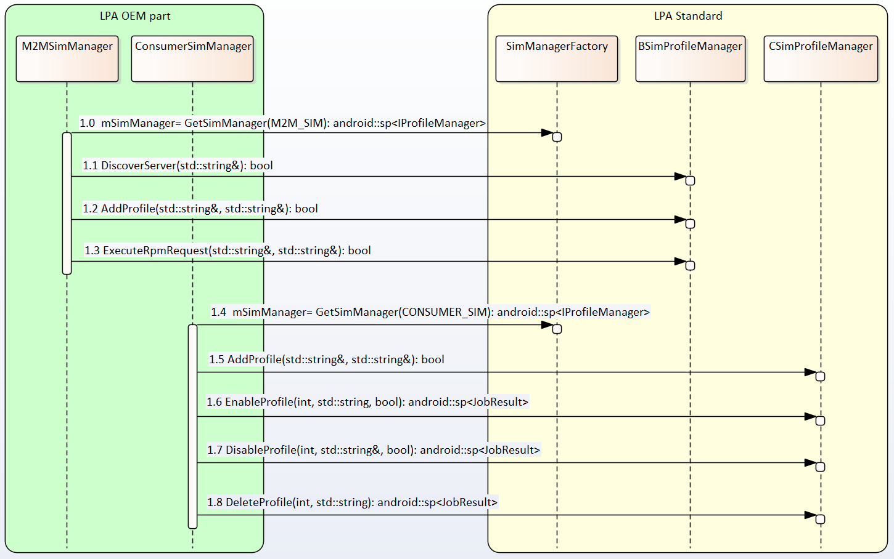
Image reference: doc_image_010.png

Table 7: How to use SIM Manager Factory

Setup communication adapter: below sequence diagram describes how to connection LPA standard with Telematic services via Communication Adapter.

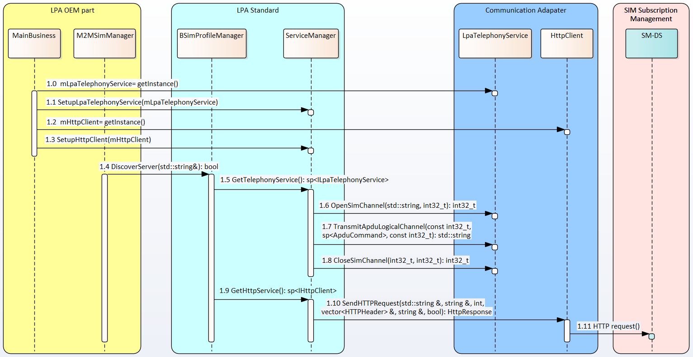
Image reference: doc_image_011.png

Table 8: Setup Communication Adapter

3.3. Algorithm Design

In LPA Modularization solution, we can separate LPA’s operation into below steps:

## Table
| Steps | Descriptions |
| --- | --- |
| Setup communication adapter | In this step, LPA OEM part needs to setup telephony service and HTTP client to support LPA Standard connect to SIM card and SIM Subscription Management. |
| Create SIM Manager | Create SIM manager based on SIM type to use LPA functionalities. |

3.3.1 Setup communication adapter

## Table
| Communication Adapter component provides Telephony service and HTTP client. These services are designed based Singleton pattern. In LPA OEM part, the main business should get the instances of the services and install them in LPA Standard via static methods. Please see the figure on right side: | Figure 11: Setup communication adapter |
| --- | --- |

Create SIM Manager

## Table
| LPA OEM part can create SIM Manager based on SIM type via SIM Manager Factory provided by SIM Standard component. After creating SIM Manager, LPA’s functionalities can be performed by calling interfaces exposed by LPA Standard. Please see the picture in the right side. | Figure 12: Create SIM Manager |
| --- | --- |

Appendix

LPA Standard component is designed with Command Patterns

Image reference: doc_image_012.png

Figure 13: LPA Standard component is designed with Command Pattern

General flow of LPA jobs

M2M SIM job:

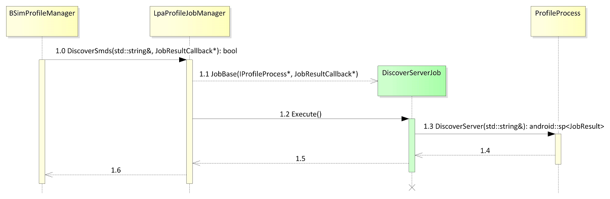
Image reference: doc_image_013.png

Figure 16: Sequence diagram of a M2M SIM job

Consumer SIM job:

Image reference: doc_image_014.png

Figure 17: Sequence diagram of a Consumer SIM job
