# Raw Slide Content

- Source file: FA_Documents_minh1.nguyen/LGE_VS_FA_minh1.nguyen_v0.7.pptx
- Total slides: 18

## Slide 1

Image reference: slide_01_image_01.png

Function Architect
Improve LPA design for easy application on new projects

LGE Internal Use Only

10th October 2023

By Nguyen Truong Minh – LGEDV
HQ mentor: Mr. Sanghyup.Lee

## Slide 2

Improve LPA design for easy application on new projects

Contents

Overview
Problems & Quality attributes
Solution
Detailed design
Q&A

## Slide 3

2

1. Overview

Use cases

The LPA’s use cases:

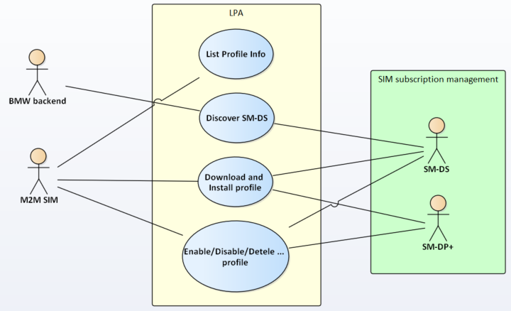
Image reference: slide_03_image_01.png

M2M SIM

Consumer SIM

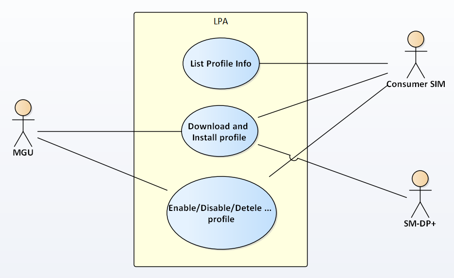
Image reference: slide_03_image_02.png

## Slide 4

3

1. Overview

SW Component

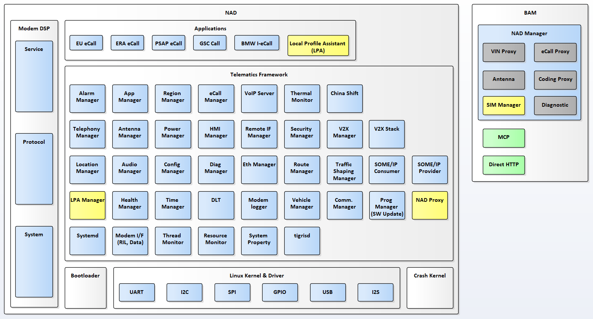
Image reference: slide_04_image_01.png

## Slide 5

4

1. Overview

General flows

<----> : Communication lines used by GSMA standard
<----> : Not related to GSMA standard

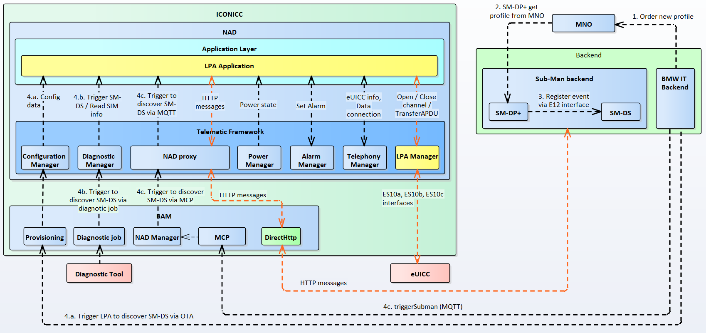
Image reference: slide_05_image_01.png

## Slide 6

5

Problems:
How to minimize efforts and modifications when applying LPA in other projects ?
Quality attributes:
This FA is considered to address the quality attributes of Modifiability, Reusability, Modularity.

### Table
| # | QA Scenarios | Quality Attributes | Priority |
| 1 | The LPA application can be easily modified when applying in other OEM projects with specific requirements. | Modifiability | High |
| 2 | The LPA standard part can be easily integrated with new systems without any modification. | Reusability | High |
| 3 | The LPA should be designed as modularity. When changing one of its components, the other ones will not be affected. | Modularity | Medium |

2. Problems & Quality attributes

## Slide 7

6

Solution 1

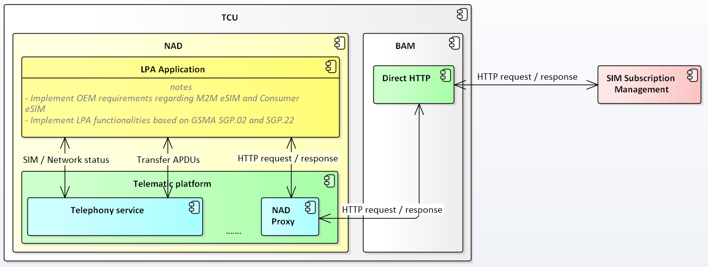
Image reference: slide_07_image_01.png

3. Solution

Solution 1

- The implementation of OEM requirements and GSMA standards are not separated.
- The GSMA implementation currently depends on some services in telematics platform.

## Slide 8

7

3. Solution

Solution 2

Solution 2

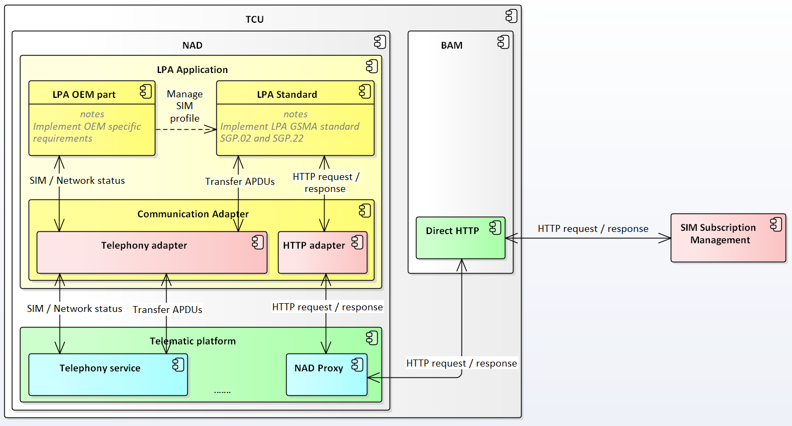
Image reference: slide_08_image_01.png

## Slide 9

8

### Table
| Quality Attribute | Solution 1 | Solution 2 |
| Modifiability | Medium | High |
| Reusability | Medium | High |
| Modularity | Low | High |

3. Problem and Solution

Comparison

Decide Solution 2:
The LPA OEM part is separated with the LPA standard, it is easier to update the LPA OEM part when applying it on other OEM projects => Modifiability
The LPA Standard only focus on GMSA standard, it is NOT related to OEM specific requirements. So it can be reused for other projects. => Reusability
The LPA is separated into 3 components: LPA OEM part, LPA standard part and Communication Adapter. Each component can be updated separately. => Modularity

## Slide 10

9

4. Detailed design

LPA OEM part can create SIM Manager by using SimManagerFactory interfaces exposed by LPA Standard.
Communication Adapter inherits ILpaTelephonyService and IHttpClient interfaces then makes some conversions to adapt with the interfaces offered by Telematic Platform.

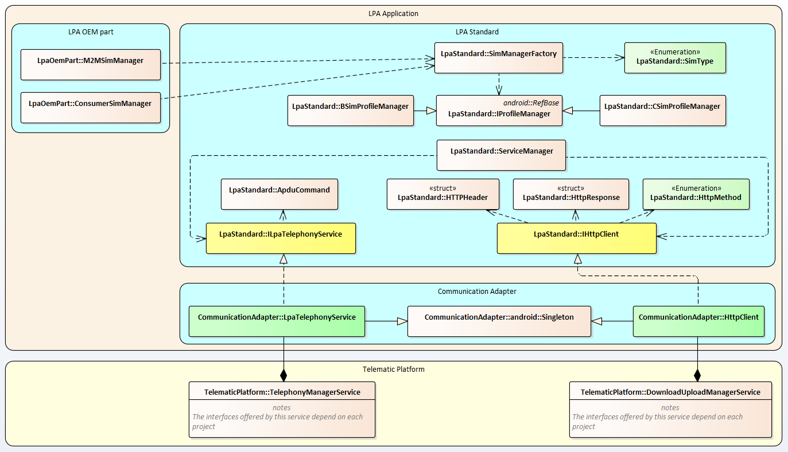
Image reference: slide_10_image_01.png

Class diagram

## Slide 11

10

4. Detailed design

The below sequence diagram describes how to create a SIM Manager and use its functionalities by using SIM Manager Factory.

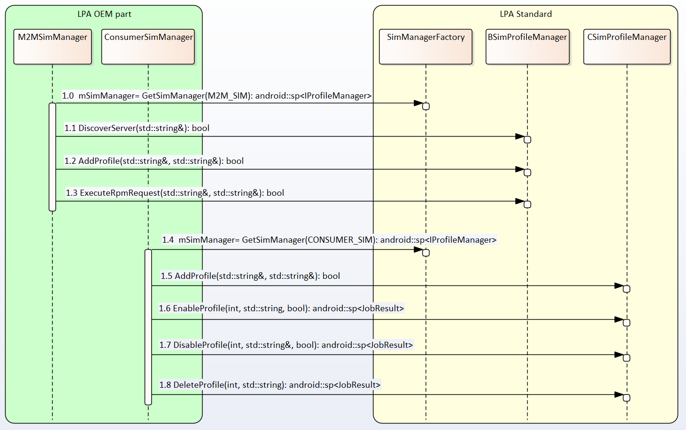
Image reference: slide_11_image_01.png

Using SIM Manager Factory

## Slide 12

11

4. Detailed design

The below sequence diagram describes how to connect LPA standard with Telematic services via Communication Adapter.

Communication Adapter

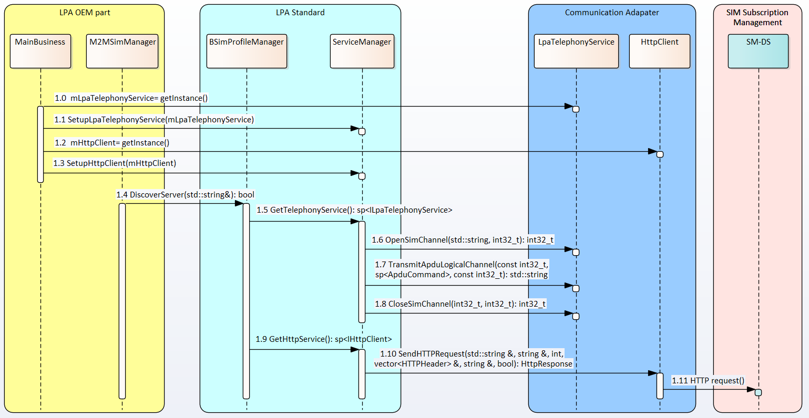
Image reference: slide_12_image_01.png

## Slide 13

Q&A
Thank you for listening!

## Slide 14

Appendix

LPA standard is designed with Command Pattern
General flow of LPA jobs.

## Slide 15

14

Appendix

1. LPA standard is designed with Command Pattern

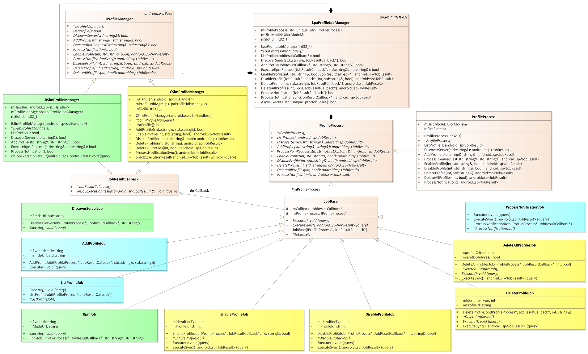
Image reference: slide_15_image_01.png

Command: JobBase
ConcreteCommand: DiscoverServerJob, AddProfileJob, ListProfileJob, RpmJob, EnableProfileJob, DisableProfileJob, DeleteProfileJob,DeleteAllProfileJob, ProcessNotificationJob.
Receiver: ProfileProcess
Client and Invoker: LpaProfileJobManager

## Slide 16

15

How developers can create SIM manager by using SIM Manager Proxy in LPA Standard:
From LPA OEM part, we can call the static function GetSimManager of class SimManagerFactory to create a SIM manager.
A SIM manager (M2M SIM Manager or Consumer SIM manager) can be created according to SIM type.

4. Detailed design

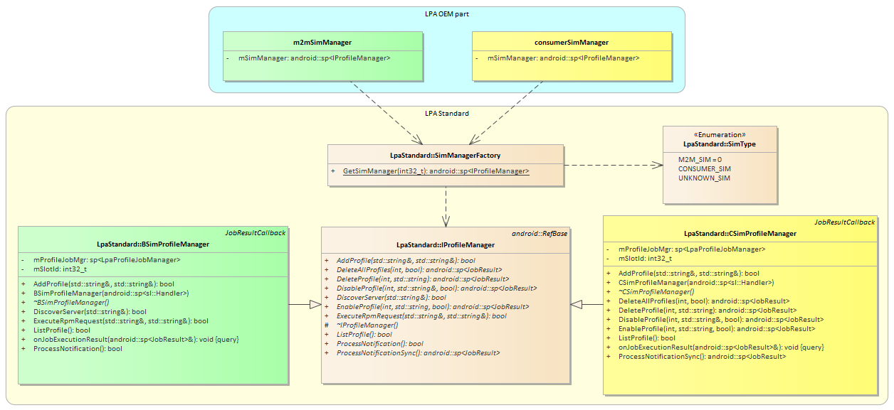
Image reference: slide_16_image_01.png

## Slide 17

16

4. Detailed design

How developers can create Communication Adapter to help LPA Standard can connect with eSIM and servers:

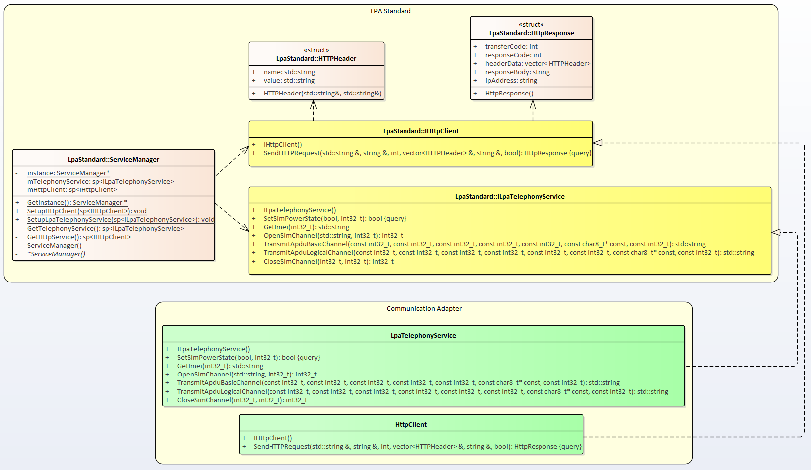
Image reference: slide_17_image_01.png

## Slide 18

17

Appendix

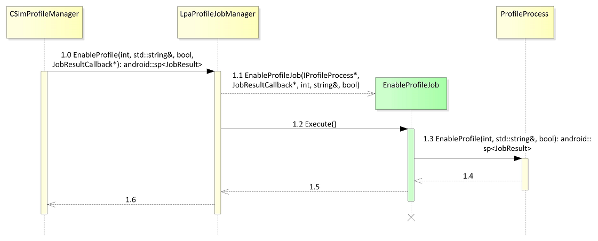
Image reference: slide_18_image_01.png

2. Sequence diagram of a Consumer SIM job:

Image reference: slide_18_image_02.png

1. Sequence diagram of a M2M SIM job:

2. General flow of LPA jobs:

