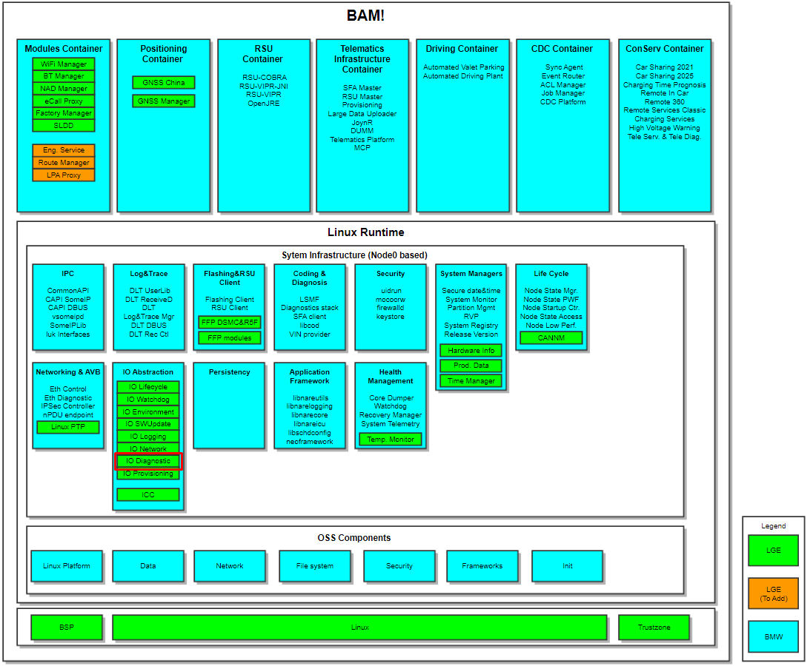
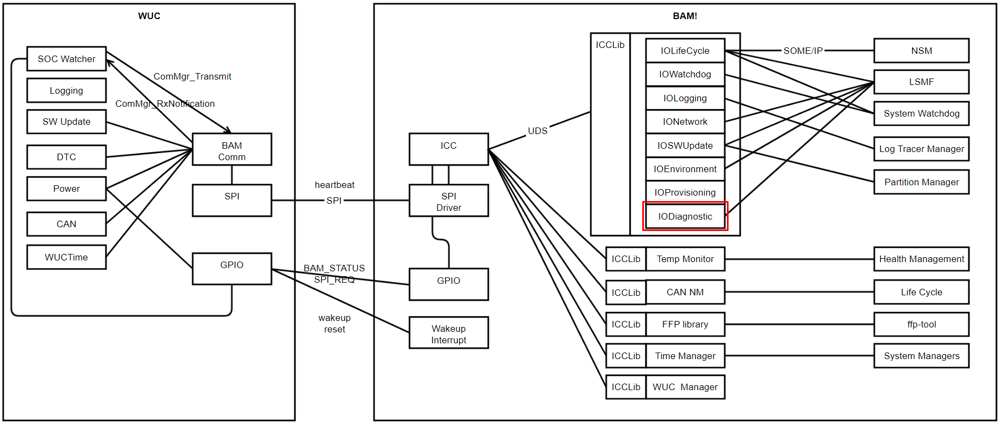
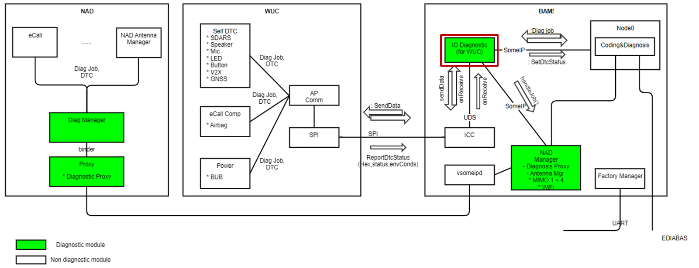
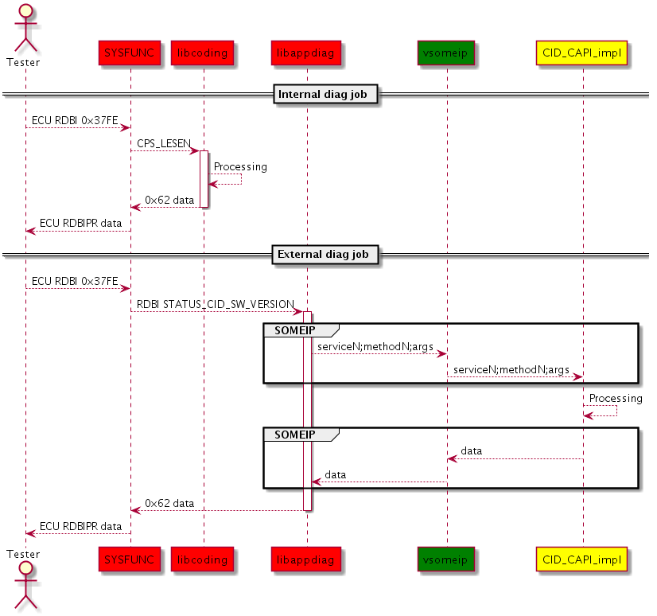
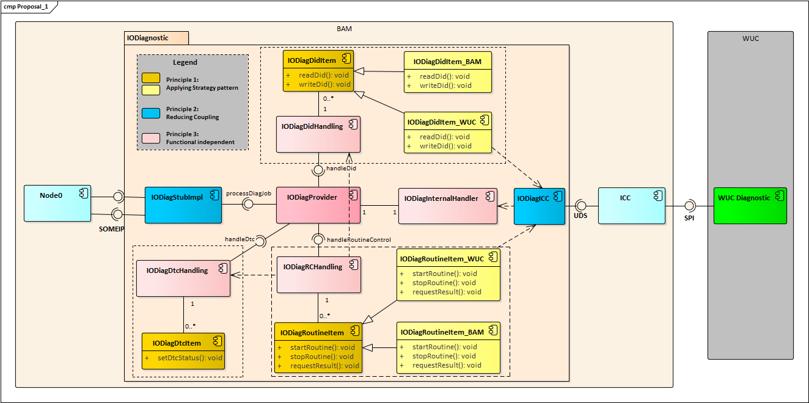
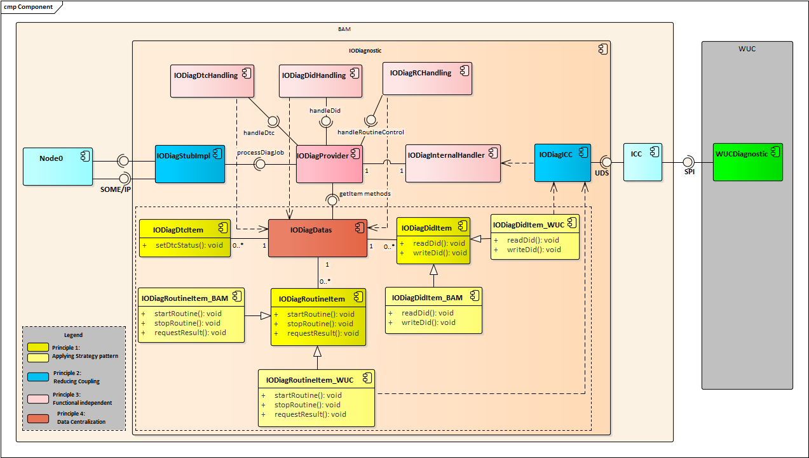
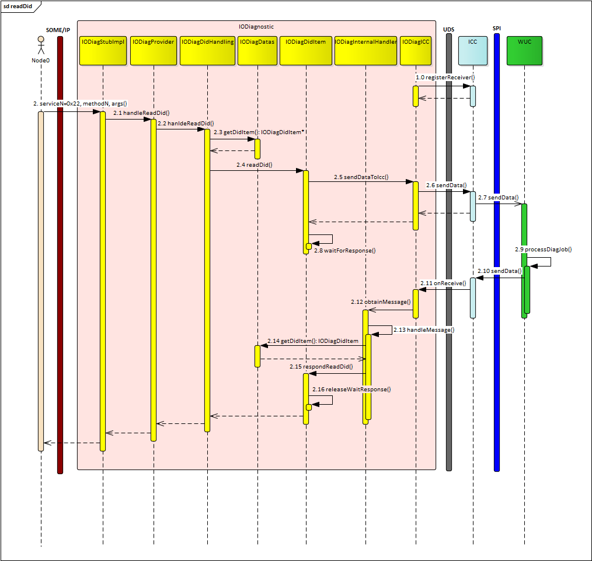
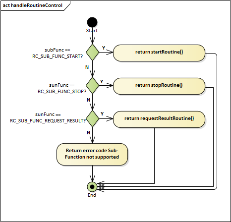
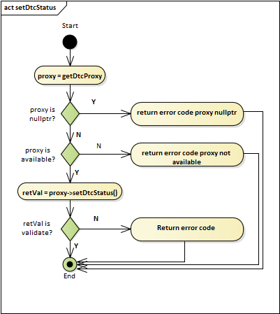
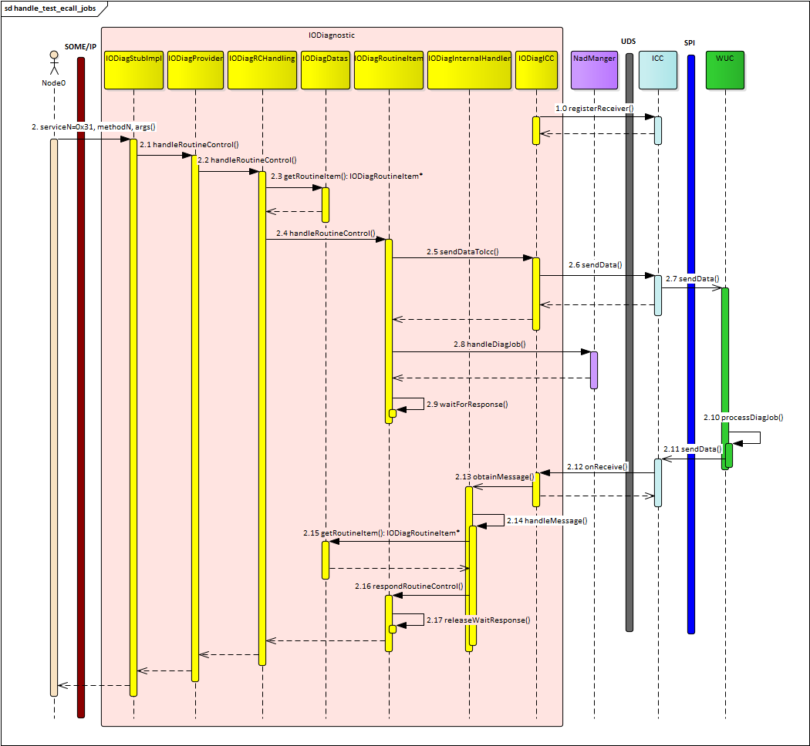

# Raw Document Content

- Source file: FA_DoMinhKhang/FA_Thesis_Design_Architecture_For_IODiagnostic_DoMinhKhang_v0.6.docx

FA Task: IODiagnostic Architecture Design

About This Document

Document Information

## Table
| Issuing authority | OTA & Diagnostic Unit |
| --- | --- |
| Status of document | In Progress |

Revision History

## Table
| Version | Date | Notes | Author | Approval |
| --- | --- | --- | --- | --- |
| 0.1 | 2022/07/10 | Create the document skeleton based on Best Practices on VSFA-142 | khang2.do |  |
| 0.2 | 2022/07/17 | Update Session 2: Overview | khang2.do |  |
| 0.3 | 2022/08/05 | Add Session 3: Architectural Proposals | khang2.do |  |
| 0.4 | 2022/08/12 | Add Session 4: Software Detailed Design | khang2.do |  |
| 0.5 | 2022/08/15 | Add description for Figures: 3.1, 3.2, 4.3, 4.4, 4.5 | khang2.do |  |
| 0.6 | 2022/09/12 | Update document based on comments after first review on ticket VSFA-156 | khang2.do |  |
|  |  |  |  |  |
|  |  |  |  |  |
|  |  |  |  |  |
|  |  |  |  |  |
|  |  |  |  |  |

Introduction

Diagnostic in vehicle is the method to determine problems with vehicle before they require expensive repairs. The diagnostic job help to save time and cost of problem identifying, and also helps the driver to monitor the car health long time before a small problem can cause a breakdown.

Purpose

This document describes the software architectural design for IO Diagnostic, which is mainly responsible for receiving and processing the diagnostic function between Wake Up Controller (WUC) core and BMW Node0-Diagnostic module on BAM core in ICONICC project.

This design document is such as a guideline on how each software component in the system should be implemented and how the internal components/external modules interact with each other.

Scope

This document describes the following about the IO Diagnostic.

SW Architectural representation

Software Architecture Proposals

External / Internal interface design

Sequence diagram / Algorithm design for use-cases

Audience

The target audiences of this document are:

Software architect who will evaluate the design of the software.

Component developer who will implement the design in actual implementation.

Native application developers who need to interact with IO Diagnostic.

BMW ICON project participants who want to understand the low level design of the IO Diagnostic.

Test engineers who verify this design and others related.

Related Documents

The documents, which related to this document, include:

ICON_MAIN SRS (Software Requirement Specifications)

ICON_MAIN SAD (Software Architectural Design)

Guideline for DTC interface: https://asc.bmw.com/wiki/display/NODE0/How+to+set+DTCs

Guideline for Diagnostic job interface: https://asc.bmw.com/wiki/display/NODE0/Diagnostic+jobs

Acronyms / Glossary

## Table
| Acronyms | Description |
| --- | --- |
| SAD | Software Architecture Design |
| SDD | Software Detailed Design |
| SRS | Software Requirement Specifications |
| SOME/IP | Scalable service-Oriented MiddlewarE over IP |
| UDS | Undefined Diagnostic Service |
| DTC | Diagnostic Trouble Code |
| DID | Data By Identifier |
| RID | Routine control Identifier |
| UDS | Unix Domain Socket |
| WUC | Wake Up Controller, one of 3 cores in ICON board |
| LSMF | Lightweight SysteM Functions |
|  |  |
|  |  |

## Table
| Glossary | Description |
| --- | --- |
|  |  |
|  |  |

Table of Contents

About This Document	1

Document Information	1

Revision History	1

Introduction	2

Purpose	2

Scope	2

Audience	2

Related Documents	2

Acronyms / Glossary	3

Table of Contents	4

List of Figures	7

List of Tables	8

1. Overview	9

1.1. Overview Description	9

1.2. Functional Requirement	10

1.3. Quality attributes	11

1.4. Constraints	11

1.4.1. Constraint on how to set DTC to Node0	11

1.4.2. Constraint on how to process diagnostic jobs from external diagnostic application.	12

2. Architectural Design Proposals	13

2.1. Proposal #1: Functional Approach	14

2.2. Proposal #2: Data Centralized Approach	15

2.3. Proposal comparison	17

3. Software Detailed Architecture of IO Diagnostic	17

3.1. External Design	17

3.2. Internal Design	18

3.2.1. Static Design	18

3.2.2. Dynamic Design	19

3.2.2.1. State Design	19

3.2.2.2. Interaction Design	20

3.2.2.2.1. setDtcStatus	20

3.2.2.2.2. handleRoutineControl	21

3.2.2.2.3. handleReadDid	23

3.2.2.2.4. handleWriteDid	25

3.2.3. Algorithm Design	26

3.2.3.1. IODiagProvider	28

3.2.3.1.1. handleReadDid	28

3.2.3.1.2. handleWriteDid	28

3.2.3.1.3. handleRoutineControl	29

3.2.3.2. IODiagRCHandling	29

3.2.3.2.1. handleRoutineControl	29

3.2.3.3. IODiagDidHandling	29

3.2.3.3.1. handleReadDid	29

3.2.3.3.2. handleWriteDid	29

3.2.3.4. IODiagInternalHandler	29

3.2.3.4.1. handleMessage	30

3.2.3.4.2. handleMsgFromIcc	30

3.2.3.5. IODiagDatas	30

3.2.3.5.1. getDidItem	30

3.2.3.5.2. getDtcItem	30

3.2.3.5.3. getRoutineItem	30

3.2.3.6. IODiagRoutineItem	30

3.2.3.6.1. handleRoutineControl	31

3.2.3.6.2. respondRoutineControl	31

3.2.3.6.3. waitForResponse	31

3.2.3.6.4. releaseWaitResponse	31

3.2.3.7. IODiagDidItem	31

3.2.3.7.1. readDid	32

3.2.3.7.2. respondReadDid	32

3.2.3.7.3. writeDid	32

3.2.3.7.4. respondWriteDid	32

3.2.3.7.5. waitForResponse	32

3.2.3.7.6. releaseWaitResponse	32

3.2.3.8. IODiagDtcItem	32

3.2.3.8.1. setDtcStatus	33

3.2.3.9. IODiagICC	33

3.2.3.9.1. getIntance	33

3.2.3.9.2. sendDataToIcc	34

3.2.3.9.3. onReceive	34

3.2.3.9.4. setInternalHandler	34

4. Appendix	34

4.1. List of Diag jobs handled by IODiagnostic	34

4.2. Sequence diagram for handling Diag job: 0x22D108	34

4.3. Sequence diagram for Diag job Test_***_Ecall	35

List of Figures

Figure 1.1. BAM components	9

Figure 1.2. Communication between WUC and BAM	10

Figure 1.3. Communication between IODiagnostic and other modules	11

Figure 1.4. DTC interface with Node0	12

Figure 1.5. Diagnostic job interface with Node0	13

Figure 2.1. Component diagram of proposal #1	14

Figure 2.2. Component diagram of proposal #2	16

Figure 3.1. Component diagram of IODiagnostic	19

Figure 3.2. Sequence diagram for setDtcStatus	20

Figure 3.3 Sequence diagram for jobs RoutineControl (0x31)	21

Figure 3.4. Sequece diagram for jobs readDid (0x22)	23

Figure 3.5. Sequence diagram for write DID (0x2E)	25

Figure 3.6. IODiagnostic class diagram	27

Figure 3.7. Algorithm for handle routine control request	31

Figure 4.1. List of diagnostic jobs handled by IODiagnostic	34

Figure 4.2. Sequence diagram for diag job 0x22D108	35

Figure 4.3. Sequence for diag jobs Test_***_Ecall	36

List of Tables

Table 1.1. Quality Attributes	11

Table 2.1. Component description for Proposal #1	15

Table 2.2. Pros and Cons of proposal #1	15

Table 2.3. Components description of Proposal #2	17

Table 2.4. Pros and Cons of proposal #2	17

Table 2.5. Comparison between two proposals	17

Table 3.1. External interface description	18

Table 3.2. Description of proposal classes using in IODiagnostic	28

Table 3.3. Methods of clas IODiagProvider	28

Table 3.4. Methods of clas IODiagRCHandling	29

Table 3.5. Methods of clas IODiagDidHandling	29

Table 3.6. Methods of clas IODiagInternalHanlder	29

Table 3.7. Methods of class IODiagDatas	30

Table 3.8. Methods of clas IODiagRoutineItem	30

Table 3.9. Methods of clas IODiagDidItem	32

Table 3.10. Methods of class IODiagDtcItem	32

Table 3.11. Methods of class IODiagICC	33

Overview

Overview Description

BMW ICONICC is the next telematics generation of BMW WAVE that was developed with BMW. In this project, the telematics board has 3 cores NAD, BAM, and WUC. Among them, BAM is the new core that was developed by both LGE and BMW based on the BMW’s development environment. Figure 1.1 below describes all components on BAM and also indicates which component is developed by BMW/LGE.

Image reference: doc_image_001.png

Figure 1.1. BAM components

With LGE, Almost modules on BAM core are new. So, designing an architecture for each one is necessary. And IODiagnostic is not an exception.

As showed in the Figure 1.1, IODiagnostic is one of the modules inside IO Abstraction. It is mainly responsible for communicating with WUC to process the diagnostic function with Node0-Diagnostic (LSMF) module on BMW side.

Figure 1.2 describes the communication between WUC and BAM modules.

Image reference: doc_image_002.png

Figure 1.2. Communication between WUC and BAM

These below are the communication method between IODiagnostic and other modules

IODiagnostic communicates with LSMF via SOME/IP protocol.

IODiagnostic communicates with WUC core via ICC module, and the communication between IODiagnostic and ICC is UDS (Unix Domain Socket) protocol.

Functional Requirement

IODiagnostic is mainly responsible for:

Use-case 1: Receive DTC event from WUC and report to Node0 via API setDTCstatus

Use-case 2: Receive diag job from Node0 and directly handle on BAM (job: 0x22D108 -  STATUS_TELEMATIK_VARIANTE)

Use-case 3: Receive WUC diag jobs from Node0  send Diag jobs to WUC via ICC  receive WUC response from ICC  send diag response to Node0.

The software architecture proposal has to ensure the handling of the functionality above. On the other hand, it also should archive KPI for Diag job / DTC from BMW.

Figure 1.3 shows the connection and functionality of IODiagnostic module on BAM.

Image reference: doc_image_003.png

Figure 1.3. Communication between IODiagnostic and other modules

Diagnostic KPIs

Execution of all diagnostic jobs shall be supported 10 seconds after startup.

Quality attributes

Beside functional requirement, the quality attributes in the table 1.1 will be used to evaluate the software architecture proposal for IODiagnostic module

## Table
| No | Criteria | Evaluation | Evaluation Description |
| --- | --- | --- | --- |
| 1 | Maintainability | Low/Medium/High | How many components need to changes when maintain. |
| 2 | Modifiability | Low/Medium/High | How many components need to changes in order to no side effect with a change request (new requirement / updated requirements |
| 3 | Reusability | Low/Medium/High | How many changes to reuse in NadManager-Diagnostic. |

Table 1.1. Quality Attributes

Constraints

Constraint on how to set DTC to Node0

The standard for DTC (in ISO14229_1) will be developed by BMW. Other applications will set the DTC information to Node0 via API “setDtcStatus” on SOME/IP.

In Node0, DTCs are represented by 64-bit UUIDs in the headers definition instead of 32-bit DTC code as in the UDS standard. So, IODiagnostic will have to map the DTC code sent by WUC and the DTC UUIDs defined in header files.

Image reference: doc_image_004.png

Figure 1.4. DTC interface with Node0

Constraint on how to process diagnostic jobs from external diagnostic application.

In ICON project, Diagnostic master modules will be developed by BMW on LSMF module.

LSMF splits diagnostic jobs into 2 major categories:

Internal – jobs: implemented directly by an internal LSMF library by calling a Linux API, another component or simply using an internal state.

External – jobs:  which are terminated by the UDS stack of LSMF but are implemented via an API generated by LSMF

LSMF will call SomeIP interface (include: service ID & method/attribute ID) for external diag job to external diagnostic application.

Zedis system will generate the FDEPLs and FIDLS for all application to create diag jobs automatically.

External diagnostic job included:

0x22 RDBI (Read Data By Identifier)

0x2E WDBI (Write Data By Identifier)

0x31 RoutineControl

RAW

Image reference: doc_image_005.png

Figure 1.5. Diagnostic job interface with Node0

In this case, IODiagnostic is as one diagnostic application that will handle external diagnostic jobs following the BMW information above.

Architectural Design Proposals

In this session, two architectures for IODiagnostic presented in the two first parts were proposed. In the each part, the principles used in the making design, the component diagram, and the description for each proposed component and pros, cons of each will be shown.

The comparison between two architectures and the decision will be presented in session 2.3.

Proposal #1: Functional Approach

According to the UDS standard, the processing of each diagnostic service is complete independence. Each service has its own requirement. Besides, the main functionality of IODiagnostic is such a communication module between WUC and Node0. So, the main idea in the first proposal will be based on functional approach with following principles:

Apply the Strategy pattern to create diagnostic data items for DTC, DID, and Routine control.

Reduce coupling with external modules.

Functional Independence to create handling class for each function (include data items corresponding to)

With the principles above, the component of the first proposal is described in Figure 2.1 below:

Image reference: doc_image_006.png

Figure 2.1. Component diagram of proposal #1

## Table
| Class name | Description |
| --- | --- |
| IODiagProvider | Main controller class provides methods working with IODiagnostic |
| IODiagStubImpl | Class mainly communicates with Node0 via Some/Ip protocol |
| IODiagICC | Class mainly communicates with ICC module via UDS protocol |
| IODiagInternalHandler | Class provides message queue to handle internal jobs |
| IODiagRCHandling | Class provides methods working for routine control service (0x31) |
| IODiagDidHandling | Class provides methods working for DID (0x22/0x2E) |
| IODiagDtcHandling | Class provides methods working for DTC |
| IODiagDidItem | Base class provides general methods working with DID. |
| IODiagDidItem_BAM | An inherited class sample from IODiagDidItem works on BAM core |
| IODiagDidItem_WUC | An inherited class sample from IODiagDidItem works with WUC core |
| IODiagRoutineItem | Base class provides general methods working with RID. |
| IODiagRoutineItem_BAM | An inherited class sample of IODiagRoutineItem works on BAM core |
| IODiagRoutineItem_WUC | An inherited class sample of IODiagRoutineItem works on BAM core |
| IODiagDtcItem | Base class provides methods working with DTC. |

Table 2.1. Component description for Proposal #1

Pros and Cons of this proposal.

## Table
| Pros | Cons |
| --- | --- |
| Dividing components based on functionality When need to maintain, small components need to be changed. | Handling classes depend on each other It is difficult (much components need changed) to modify when new requirements and reuse in other component. |

Table 2.2. Pros and Cons of proposal #1

Proposal #2: Data Centralized Approach

This proposal is quite similar to proposal #1 in using Strategy pattern and reduce coupling with external module. However, handling class will not include diagnostic data items. Instead of that, a data centralization object is be created that is mainly responsible to manage all diagnostic data items and provide methods to get items when necessary.

In conclusion, the principles that used for proposal #2 are:

Apply the Strategy pattern to create diagnostic data items for DTC, DID, and Routine control.

Reduce coupling with external modules.

Functional Independence to create handling class for each function but NOT includes the corresponding diagnostic data items.

Data centralization to manage all diagnostic items and provide methods to get each.

The component diagram with these principles is showed in Figure 2.2 below:

Image reference: doc_image_007.png

Figure 2.2. Component diagram of proposal #2

## Table
| Class name | Description |
| --- | --- |
| IODiagProvider | Main controller class provides methods working with IODiagnostic |
| IODiagStubImpl | Class mainly communicates with Node0 via Some/Ip protocol |
| IODiagICC | Class mainly communicates with ICC module via UDS protocol |
| IODiagInternalHandler | Class provides message queue to handle internal jobs |
| IODiagRCHandling | Class provides methods working for routine control service (0x31) |
| IODiagDidHandling | Class provides methods working for DID (0x22/0x2E) |
| IODiagDtcHandling | Class provides methods working for DTC |
| IODiagDatas | Class manages all items created, provides methods to get the specified item |
| IODiagDidItem | Base class provides general methods working with DID. |
| IODiagDidItem_BAM | An inherited class sample from IODiagDidItem works on BAM core |
| IODiagDidItem_WUC | An inherited class sample from IODiagDidItem works with WUC core |
| IODiagRoutineItem | Base class provides general methods working with RID. |
| IODiagRoutineItem_BAM | An inherited class sample of IODiagRoutineItem works on BAM core |
| IODiagRoutineItem_WUC | An inherited class sample of IODiagRoutineItem works on BAM core |
| IODiagDtcItem | Base class provides methods working with DTC. |

Table 2.3. Components description of Proposal #2

Pros and Cons of this proposal.

## Table
| Pros | Cons |
| --- | --- |
| Handling classes are independent and exist data centralized object Small change to modify when having new requirement and reuse for other component. | Handling classes are independent and exist data centralized object Need to change on much more components when maintain |

Table 2.4. Pros and Cons of proposal #2

Proposal comparison

Basically, Both 2 proposals solve the functional requirement for IODiagnostic:

Use-case 1: Receiving WUC DTC information and set to Node0

Use-case 2: Receive Diag job from Node0  send request to WUC  wait response from WUC  send response to Node0.

Diagnostic KPI: diagnostic jobs will be supported after startup 10 seconds.

However, in term of quality attributes, there are some difference between these proposals.

## Table
| Quality Attributes | Proposal #1 (Functional Approach) | Proposal #2 (Data Centralized Approach) |
| --- | --- | --- |
| Maintainability | High | Medium |
| Modifiability | Medium | High |
| Reusability | Medium | High |

Table 2.5. Comparison between two proposals

 Based on the comparison evaluated above, the proposal #2 is better architecture for IODiagnostic in ICON project and chosen to make the software detailed design in the next session.

Software Detailed Architecture of IO Diagnostic

External Design

Table interfaces use to communicate with other external module

## Table
| Interface name | Source | Destination | Inputs/Outputs | Description |
| --- | --- | --- | --- | --- |
| registerReceiver | IODiagnostic | ICC | Input: - ICCClientReceiver* receiver, - std::vector<uint8_t> categoryId Output: void | Register listening message with ICC related each categoryId |
| sendData | IODiagnostic | ICC | Input: - uint8_t type, - uint8_t category, - uint8_t cmd, - uint8_t cmd2, - const std::vector<uint8_t> payload Output: void | Send data message to WUC via ICC |
| onReceive | ICC | IODiagnostic | Input: - shared_ptr<CommunicationData> commData Output: void | This interface is provided by ICC to receive ICC message |
| setDtcStatus | IODiagnostic | Node0 | Input: - UInt64 dtcuuid, - DtcOperation dtcOperation, - UInt32 envCondCount, - ArrayOfEnvCond envCondList Output: ReturnValue | Set DTC to Node0 |
| serviceN,method,args | Node0 | IODiagnostic |  | This interface will be generated by BMW as constraint #2. |

Table 3.1. External interface description

Internal Design

Static Design

According to Proposal #2, Figure 3.1 shows the component diagram for IODiagnostic.

Image reference: doc_image_008.png

Figure 3.1. Component diagram of IODiagnostic

I introduced the description of each component in Proposal #2 (Session 2.2).

The detail information will be presented in the class diagram (Session 3.2.3).

Dynamic Design

State Design

IODiagnostic will not use state machine.

Interaction Design

setDtcStatus

Image reference: doc_image_009.png

Figure 3.2. Sequence diagram for setDtcStatus

The sequence description:

1.0, 1.1: IODiagICC call API registerReceiver() of ICC to listen WUC message when IODiagnostic was started.

1.2: WUC uses algorithms to detect DTC event.

1.3: WUC sends DTC information to ICC module via SPI.

1.4: ICC notify the WUC message to IODiagnostic. IODiagICC is the class receiving this message.

1.5: IODiagICC send the message into the queue of IODiagInternalHandler.

1.7, 1.8: In the thread handleMessage, IODiagInternalHandler call setDtcStatus of IODiagDtcHandling

1.9: IODiagDtcHandling get the DTC item corresponding to WUC request from IODiagDatas.

1.11: Call API setDtcStatus() of IODiagDtcItem got from step 2.5.

1.12: setDtcStatus to Node0 via Some/IP

handleRoutineControl

Image reference: doc_image_010.png

Figure 3.3 Sequence diagram for jobs RoutineControl (0x31)

The sequence description:

1.0: IODiagICC calls registerReceiver to ICC module to listen WUC’s message when started.

2.0: Node0 request diag job Routine Control to IODiagStubImpl. ServiceN is 0x31.

2.1: Call API handleRoutineControl on IODiagProvider

2.3: Call API handleRoutineControl on IODiagRCHandling.

2.4: Get Routine item from IODiagDatas

2.5: IODiagRCHandling check pre-condition, handle general logic and call API handleRoutineControl

2.6: IODiagRoutineItem send request information to ICC via API sendDataToIcc of IODiagICC.

2.7: Send data to ICC.

2.8: ICC send request data to WUC.

2.9: IODiagRoutine will run waitForResponse to wait for WUC response.

2.10: WUC performs the Diag job request.

2.11: WUC sendData to ICC

2.12: ICC notify the receiver via onReceive.

2.13: IODiagICC receive the notification and send message to queue of IODiagInternalHandler.

2.14: Handle message in handleMessage

2.15: get routine item from IODiagDatas.

2.16: Call respondRoutineControl to routineItem got from 2.14.

2.17: Update response and release wait response in Step 2.9 and then return the response of the request

handleReadDid

Image reference: doc_image_011.png

Figure 3.4. Sequece diagram for jobs readDid (0x22)

The sequence description:

1.0: IODiagICC calls registerReceiver to ICC module to listen WUC’s message since started.

2.0: Node0 request diag job Routine Control to IODiagStubImpl. ServiceN is 0x22.

2.1: IODiagStubImpl  calls API handleReadDid on IODiagProvider

2.2: IODiagProvider calls API handleReadDid on IODiagDidHandling.

2.3: IODiagDidHandling gets did item from IODiagDatas

2.4: IODiagDidHandling check pre-condition, handle general logic and call API handleReadDid.

2.5: IODiagDidItem send request to ICC via API sendDataToIcc of IODiagICC.

2.6: IODiagICC send data to ICC.

2.7: ICC send request data to WUC.

2.8: IODiagRoutine will run waitForResponse to wait for WUC response.

2.9: WUC performs the Diag job request.

2.10: WUC sendData to ICC

2.11: ICC notify the message to the receiver via onReceive.

2.12: IODiagICC receive the notification and send message to queue of IODiagInternalHandler.

2.13: IODiagInternalHandler handle messages in handleMessage

2.14: IODiagInternalHandler get did item from IODiagDatas.

2.15: IODiagInternalHandler calls respondReadDid to the did item got from 2.14.

2.16: IODiagDidItem Update response and release wait response in Step 2.9 and then return the response of the request

handleWriteDid

Image reference: doc_image_012.png

Figure 3.5. Sequence diagram for write DID (0x2E)

The sequence description:

1.0: IODiagICC calls registerReceiver to ICC module to listen WUC’s message since started.

2.0: Node0 request diag job Routine Control to IODiagStubImpl. ServiceN is 0x2E.

2.1: IODiagStubImpl  calls API handleWriteDid on IODiagProvider

2.2: IODiagProvider calls API handleWriteDid on IODiagDidHandling.

2.3: IODiagDidHandling gets did item from IODiagDatas

2.4: IODiagDidHandling check pre-condition, handle general logic and call API handleWriteDid.

2.5: IODiagDidItem send request to ICC via API sendDataToIcc of IODiagICC.

2.6: IODiagICC send data to ICC.

2.7: ICC send request data to WUC.

2.8: IODiagRoutine will run waitForResponse to wait for WUC response.

2.9: WUC performs the Diag job request.

2.10: WUC sendData to ICC

2.11: ICC notify the message to the receiver via onReceive.

2.12: IODiagICC receive the notification and send message to queue of IODiagInternalHandler.

2.13: IODiagInternalHandler handle messages in handleMessage

2.14: IODiagInternalHandler get did item from IODiagDatas.

2.15: IODiagInternalHandler calls respondReadDid to the did item got from 2.14.

2.16: IODiagDidItem updates response and release wait response in Step 2.9 and then return the response of the request

Algorithm Design

The following Figure 4.6 and table 4.1 show the proposal classes and their attributes, methods used.

Image reference: doc_image_013.png

Figure 3.6. IODiagnostic class diagram

## Table
| Class name | Description |
| --- | --- |
| IODiagProvider | Class is such as main controller class. |
| IODiagStubImpl | Class communicates with LSMF via SOME/IP. |
| IODiagICC | Class communicates with ICC module via UDS (Unix Domain Socket). |
| IODiagRCHandling | Class processes the diag jobs Routine control (Service Id 0x31). |
| IODiagDidHandling | Class processes the diag jobs with DID (Service Id 0x22/0x2E). |
| IODiagInternalHandler | Class works as message-queue mechanism to handle internal job.. |
| IODiagDatas | Class works as a data manager that manages all items (dtc, did, routine). |
| IODiagDtcItem | Base class provide methods working with DTC. |
| IODiagDidItem | Base class provides methods working with DID item. |
| IODiagDidItem _BAM | The classes is inherited from IODiagDidItem to implement the logic for BAM diag jobs |
| IODiagDidItem _WUC | The classes is inherited from IODiagDidItem to implement the logic for WUC diag jobs |
| IODiagRoutineItem | Base class provides methods working with Routine item. |
| IODiagRoutineItem_BAM | The classes is inherited from IODiagRoutineItem to implement the logic for job on BAM |
| IODiagRoutineItem_WUC | The classes is inherited from IODiagRoutineItem to implement the logic with WUC |
| ICCClientReceiver | Interface used to receive message from ICC module |

Table 3.2. Description of proposal classes using in IODiagnostic

The next part will describe the detailed for methods in each class.

IODiagProvider

## Table
| Method | Description | Inputs | Outputs |
| --- | --- | --- | --- |
| handleReadDid | Method is called by IODiagStubImpl when receive LSMF’s request with service 0x22 | uint16_t did ByteBuffer &outUdsData | error_t |
| handleWriteDid | Method is called by IODiagStubImpl when receive LSMF’s request with service 0x2E | uint16_t did const ByteBuffer &inUdsData | error_t |
| handleRoutineControl | Method is called by IODiagStubImpl when receive LSMF’s request with service 0x31 | uint16_t rid uint8_t subFunc const ByteBuffer &inUdsData ByteBuffer &outUdsData | error_t |

Table 3.3. Methods of clas IODiagProvider

handleReadDid

Call function “handleReadDid” from object IODiagDidHandling

handleWriteDid

Call function “handleWriteDid” from object IODiagDidHandling

handleRoutineControl

Call function “handleRoutineControl” from object IODiagRCHandling

IODiagRCHandling

## Table
| Method | Description | Inputs | Outputs |
| --- | --- | --- | --- |
| handleRoutineControl | Process routine request | uint16_t rid uint8_t subFunc const ByteBuffer &inUdsData ByteBuffer &outUdsData | error_t |

Table 3.4. Methods of clas IODiagRCHandling

handleRoutineControl

Receive request from provider, check pre-condition for service routine control (0x31) and then call function handleRoutineControl from routine item corresponding to routine identifier.

IODiagDidHandling

## Table
| Method | Description | Inputs | Outputs |
| --- | --- | --- | --- |
| handleReadDid | Process read DID request | uint16_t did ByteBuffer &outUdsData | error_t |
| handleWriteDid | Process write DID request | uint16_t did const ByteBuffer &inUdsData | error_t |

Table 3.5. Methods of clas IODiagDidHandling

handleReadDid

Check pre-condition, get did item from IODiagDatas and call readDid of did item corresponded

handleWriteDid

Check pre-condition, get did item from IODiagDatas and call readDid of did item corresponded

IODiagInternalHandler

## Table
| Method | Description | Inputs | Outputs |
| --- | --- | --- | --- |
| handleMessage | Inherited from handler to process internal job | const std::shared_ptr<ivn::Message> &message | void |
| handleMsgFromIcc | Handle message from ICC | std::shared_ptr<void> obj | void |

Table 3.6. Methods of clas IODiagInternalHanlder

handleMessage

Process messages that was request internally

handleMsgFromIcc

Process message that is sent from ICC

IODiagDatas

## Table
| Method | Description | Inputs | Outputs |
| --- | --- | --- | --- |
| getDidItem | Return did item in m_mapDidItems | uint16_t did | shared_ptr<IODiagDidItem> |
| getDtcItem | Return dtc item in m_mapDtcItems | uint32_t dtcCode | shared_ptr<IODiagDtcItem> |
| getRoutineItem | Return routine item in m_mapRoutineItems | uint16_t rid | shared_ptr<IODiagRoutineItem> |

Table 3.7. Methods of class IODiagDatas

getDidItem

Return the IODiagDidItem in m_mapDidItems corresponding to parameter “did”. If there is no matching item, return nullptr pointer.

getDtcItem

Return the IODiagDtcItem in m_mapDtcItems corresponding to parameter “dtcCode”. If there is no matching item, return nullptr pointer.

getRoutineItem

Return the IODiagRoutineItem in m_mapRoutineItems corresponding to parameter “rid”. If there is no matching item, return nullptr pointer.

IODiagRoutineItem

## Table
| Method | Description | Inputs | Outputs |
| --- | --- | --- | --- |
| handleRoutineControl | Handle routine control job | uint16_t rid uint8_t subFunc const ByteBuffer &inUdsData ByteBuffer &outUdsData | error_t |
| respondRoutineControl | Receive response from WUC for request routine control | uint8_t subFunc const ByteBuffer &data | void |
| waitForResponse | Wait for condition released | void | void |
| releaseWaitResponse | Release condition | void | void |

Table 3.8. Methods of clas IODiagRoutineItem

handleRoutineControl

Image reference: doc_image_014.png

Figure 3.7. Algorithm for handle routine control request

respondRoutineControl

This method is called when received the reponse from WUC. It will update the response and then call releaseWaitResponse to continue current request.

waitForResponse

Wait for releasing condition_variable that is set in function releaseWaitResponse with a timeout value specified for each RID.

releaseWaitResponse

Performed when WUC send response for diag job routine control. This method call notify with  condition_variable used in function waitForResponse

IODiagDidItem

## Table
| Method | Description | Inputs | Outputs |
| --- | --- | --- | --- |
| readDid | Handle read Did job | ByteBuffer &data | int |
| respondReadDid | Receive response from WUC | const ByteBuffer &data | void |
| writeDid | Handle write Did job | const ByteBuffer &data | Int |
| respondWriteDid | Receive reponse from WUC | uint8_t return_code | void |
| waitForResponse | Wait for condition released | void | void |
| releaseWaitResponse | Release condition | void | void |

Table 3.9. Methods of clas IODiagDidItem

readDid

Receive and handle request service Read DID

respondReadDid

WUC send response for job readDid

writeDid

Receive and handle request service Write DID

respondWriteDid

WUC response for job writeDid

waitForResponse

Wait for releasing condition_variable that is set in function releaseWaitResponse with a timeout value specified for each DID.

releaseWaitResponse

Performed when WUC send response for diag job read/write did. This method call notify with  condition_variable used in function waitForResponse

IODiagDtcItem

## Table
| Method | Description | Inputs | Outputs |
| --- | --- | --- | --- |
| setDtcStatus | Report DTC to LSMF | uint32_t dtcCode uint8_t dtcOperation uint32_t envCount const ErrorMemoryTypes::ArrayOfEnvCond & envCondList | error_t |

Table 3.10. Methods of class IODiagDtcItem

setDtcStatus

Image reference: doc_image_015.png

IODiagICC

## Table
| Method | Description | Inputs | Outputs |
| --- | --- | --- | --- |
| getIntance | Return the instance of IODiagICC | void | void |
| sendDataToIcc | Send request information to IODiagICC | uint8_t type uint8_t cmd uint8_t cmd2 const std::vector<uint8_t> payload | void |
| onReceive | Receive data from ICC module | shared_ptr<CommunicationData> commData | void |
| setInternalHandler | Send pointer of IODiagInteralHandler | shared_ptr<IODiagInternalHandler> handler | void |

Table 3.11. Methods of class IODiagICC

getIntance

This method returns the instance of IODiagICC.

sendDataToIcc

This method is called by other modules on IODiagnostic that want to send the request to WUC via ICC module.

onReceive

This method is inherited from Interface ICCClientReceiver that is provided by ICC module.

setInternalHandler

This method is called by IODiagProvider in init step to send the pointer of IODiagInternalHandler to IODiagICC.

Appendix

List of Diag jobs handled by IODiagnostic

## Table
| Diag job | Hex value | Description |
| --- | --- | --- |
| RDBI_SOS_BUTTON | 22D09B | Indicates if the SOS button is pressed or not |
| RDBI_BACKUP_BATTERY | 22D029 | Read Backup-Battery status |
| WDBI_BACKUP_BATTERY_INIT | 2EAA3F |  |
| RC_STR_TEST_TELEMATIC_ANTENNA | 3101A05E | Start the test of a certain antenna. |
| RC_RRR_TEST_TELEMATIC_ANTENNA | 3103A05E | Read status of test Antenna diag job. |
| RC_STR_TEST_VERBAU | 3101A05F | Start basic test for Ecall components. |
| RC_RRR_TEST_VERBAU | 3103A05F | Read status of test Verbau diag job. |
| RDBI_TELEMATIC_VARIANT | 22D108 | Read the version of the telematic ECU. |

Figure 4.1. List of diagnostic jobs handled by IODiagnostic

Sequence diagram for handling Diag job: 0x22D108

This diagnostic job is used to read hardware information such as Location, Network technology, Bluetooth installed, Country variant or variant of ICON board.

This diag job is only handled by IODiagnostic on BAM core directly.

Image reference: doc_image_016.png

Figure 4.2. Sequence diagram for diag job 0x22D108

Sequence diagram for Diag job Test_***_Ecall

These diagnostic jobs include:

## Table
| No | SID | SubFunc | RID | Job name | Description |
| --- | --- | --- | --- | --- | --- |
| 1 | 0x31 | 0x01 | 0xA05F | STEUERN_TEST_VERBAU_ECALL | Assembly test CECALL |
| 2 | 0x31 | 0x03 | 0xA05F | STATUS_TEST_VERBAU_ECALL | Assembly test CECALL |
| 3 | 0x31 | 0x01 | 0xA05E | STEUERN_TEST_ANTENNA_ECALL | Starts and evaluates the test of a certain antenna |
| 4 | 0x31 | 0x03 | 0xA05E | STATUS _TEST_ANTENNA_ECALL | Starts and evaluates the test of a certain antenna |

These diag jobs will be handle on both BAM (IODiagnostic, NadManager) and WUC core.

Image reference: doc_image_017.png

Figure 4.3. Sequence for diag jobs Test_***_Ecall
