# Raw Slide Content

- Source file: FA_DoMinhKhang/FA_Presentation_khang2.do_v1.0_20220916.pptx
- Total slides: 18

## Slide 1

Image reference: slide_01_image_01.png

FA Task
IODiagnostic Architecture Design
(BMW – ICONICC)

By khang2.do
Supervise by Mr Sanghyup.Lee
Functional Technology 6 – OTA & Diag Unit
LG Vehicle Solution Development Center Vietnam
October 4th 2022

## Slide 2

TABLE CONTENT

1

Software Detailed Design

3

Q&A

4

Problem Identification

Appendix

5

6

Architecture Design Proposals

2

## Slide 3

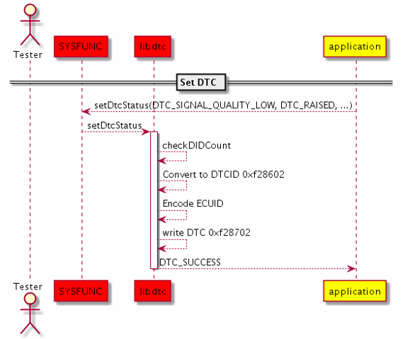
Image reference: slide_03_image_01.png

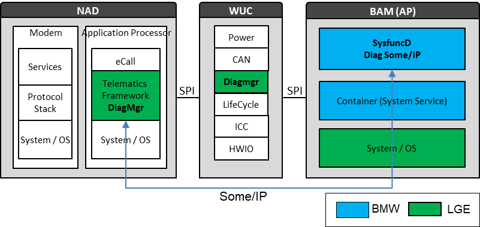
Image reference: slide_03_image_02.png

1. Problem Identification: Diagnostic concept and Constraints

BAM receives Diagnostic from other ECU via Ethernet.
BAM SysfuncD provide/collect Diagnostic via Some/IP.
BAM interfaces with NAD and WUC (included DTC and Diagnostic job).

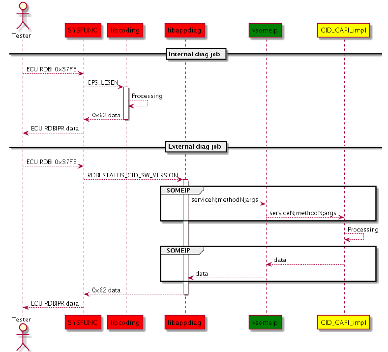
Image reference: slide_03_image_03.png

Diagnostic Concept

DTC Interface

Diagnostic job interface

3

 Others

BMW

## Slide 4

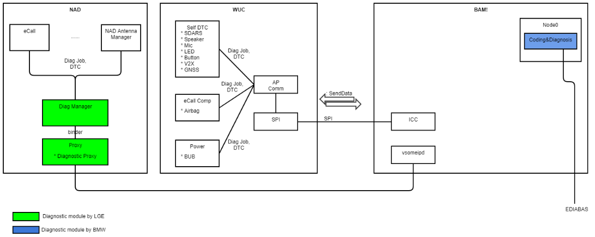
Image reference: slide_04_image_01.png

Communcation via Some/IP

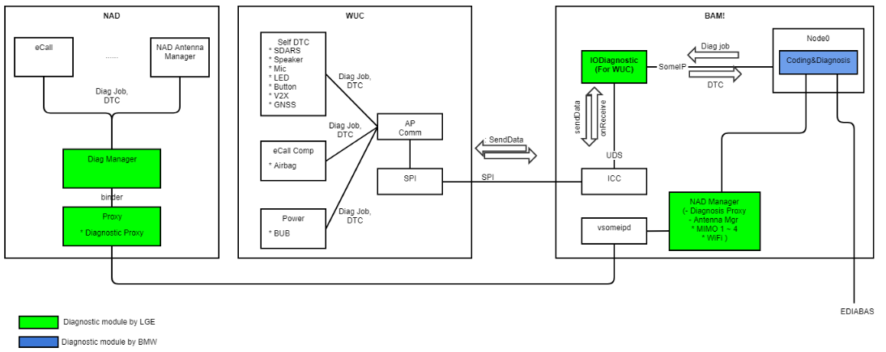
Image reference: slide_04_image_02.png

- Diag jobs Test_Verbau_Ecall and Test_Antenna_Ecall perform testing Antennas.
- Antennas located on WUC (GNSS, V2X) and BAM (Telematic antennas)

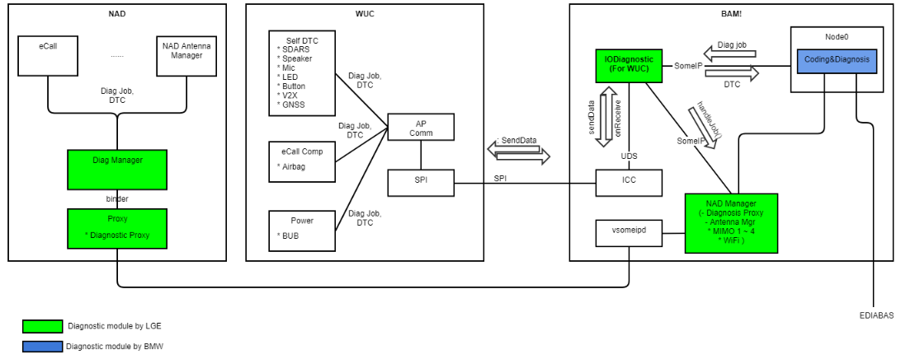
Image reference: slide_04_image_03.png

1. Problem Identification – IODiagnostic

Use-case 1: Report WUC’s DTC to Node0 via SomeIp
Use-case 2: Process External Diagnostic jobs for WUC core
Receive and response WUC’s diag job from/to Node0
Process specific BAM diag job (RDBI_TELEMATIK_VARIANTE – read hardware informations)

Diag jobs included:
Read/Write DID: 0x22/0x2E
RoutineControl: 0x31

4

## Slide 5

1. Problem Identification – Task Objectives

Design architecture for IODiagnostic to cover BMW requirements
Report DTC
Handle external diagnostic jobs.
Diagnostic KPI
Execution of all diagnostic jobs shall be supported 10 seconds after startup.
Architecture design satisfies quality attributes below
Maintainability: How many components need to changes when maintain.
Modifiability: How many components need to changes in order to no side effect.
Reusability: Can be reuse in NadManager-Diagnostic with small changes.

5

## Slide 6

2. Architecture Proposals

Proposal #1: Functional Approach

Image reference: slide_06_image_01.png

6

Pros: Divided based on functionality  maintain in 1 function.
Cons: The handling classes depend on each other  difficult to modify and reuse in another component

## Slide 7

2. Architecture Proposals

Proposal #2: Data Centralized Approach

Image reference: slide_07_image_01.png

7

Pros: create new/change diagnostic data items for updated requirements  modify and reuse easier.
Cons: Can change in more items when maintain.

## Slide 8

2. Architecture Proposals

Comparison between proposals

8

### Table
| Quality Attributes | Proposal #1 (Functional Approach) | Proposal #2 (Data Centralized Approach) |
| Maintainability | High | Medium |
| Modifiability | Medium | High |
| Reusability | Medium | High |

Functional requirements: Both designs cover BMW requirements and Diagnostic KPI.
Quality Attributes:

Decision: Decision: Proposal #2 is chosen for IODiagnostic Architecture Design.

## Slide 9

Class Diagram

3. Software detailed design

9

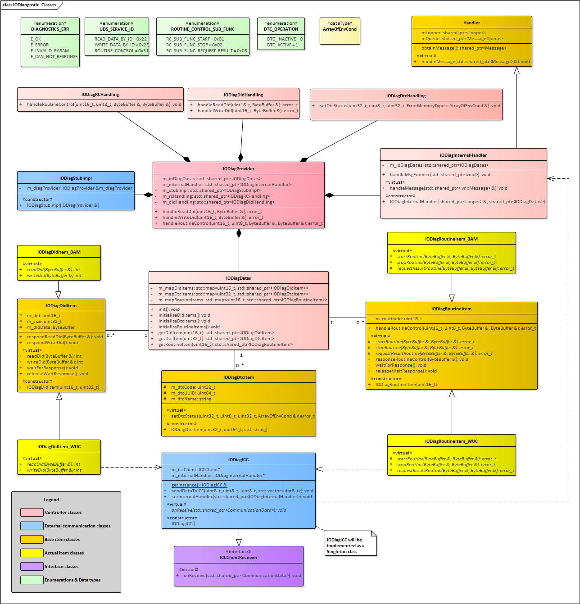
Image reference: slide_09_image_01.png

## Slide 10

Sequence Diagram: Report DTC to Node0

3. Software detailed design

10

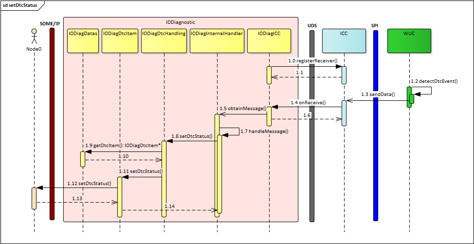
Image reference: slide_10_image_01.png

## Slide 11

Sequence Diagram: jobs Routine control

3. Software detailed design

11

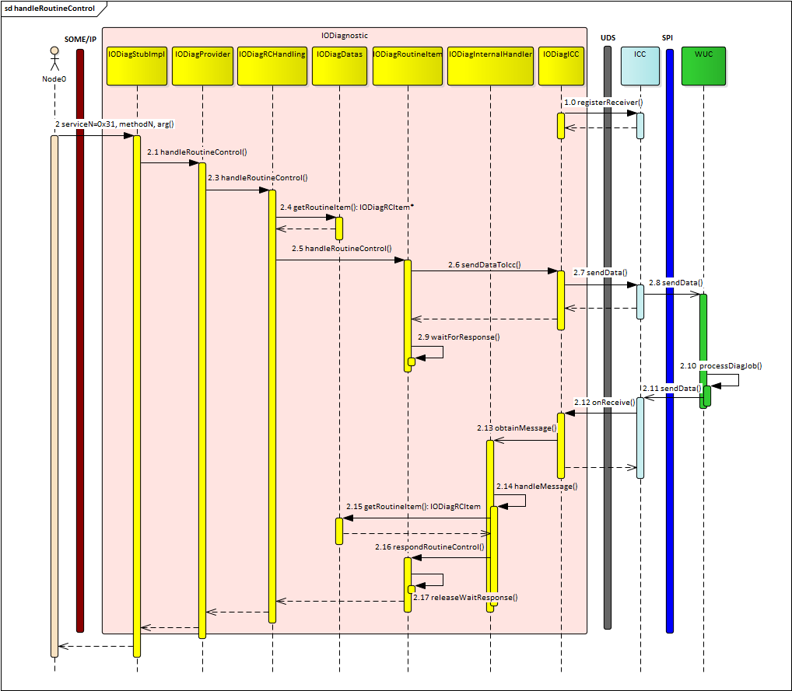
Image reference: slide_11_image_01.png

## Slide 12

4. Q&A

Q & A

12

## Slide 13

5. Appendix – BAM component

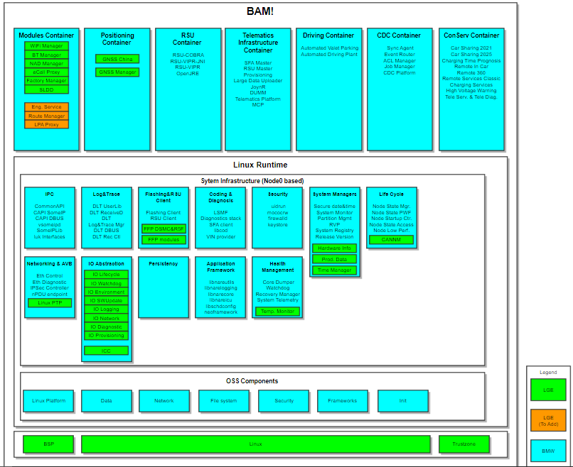
Image reference: slide_13_image_01.png

13

## Slide 14

5. Appendix

Diagnostic job interface

14

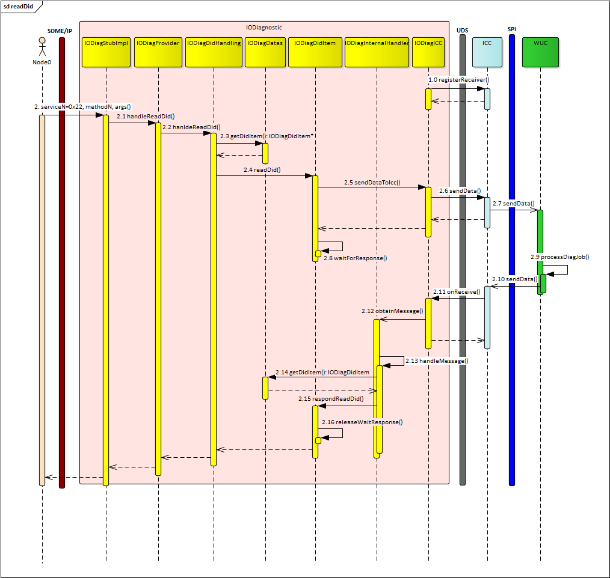
Image reference: slide_14_image_01.png

Sequence Diagram: jobs Read DID

## Slide 15

5. Appendix

Diagnostic job interface

15

Sequence Diagram: jobs Write DID

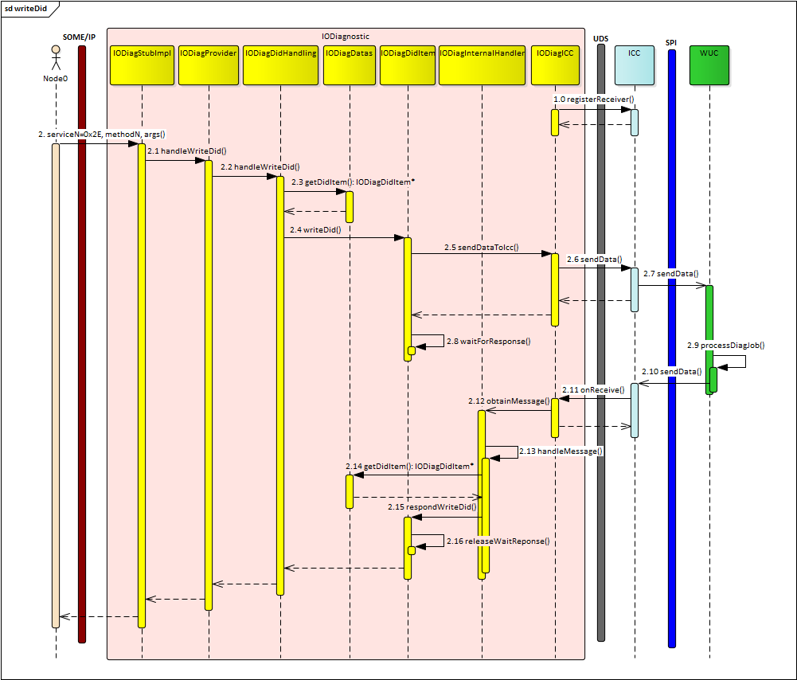
Image reference: slide_15_image_01.png

## Slide 16

5. Appendix

Diagnostic job interface

16

Sequence Diagram: job RDBI_TELEMATIK_VARIANTE

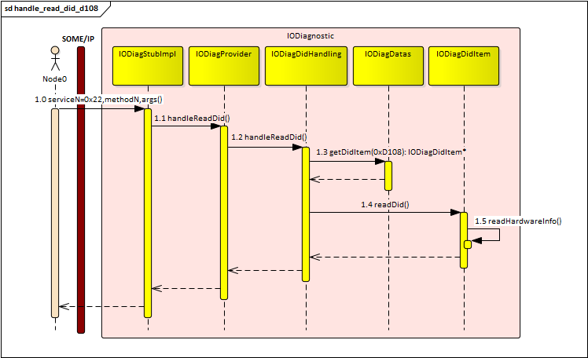
Image reference: slide_16_image_01.png

## Slide 17

5. Appendix

Diagnostic job interface

17

Sequence Diagram: Jobs Test_***_Ecall

Image reference: slide_17_image_01.png

## Slide 18

Thank you!

18

