# Raw Document Content

- Source file: FA_Hieu4_Nguyen/FA_Project_New design for Handwriting Recognition in VW ICAS3CHN/FA_Project_New design for Handwriting Recognition in VW ICAS3CHN.docx

FA Certification Task – New design for Handwriting Recognition in VW ICAS3CHN project.

By Hieu4.nguyen

Supervised by Ms. 정은희

About Document

Terms

## Table
| Abbreviation | Description |
| --- | --- |
| CAN | Controller Area Network |
| DSI | Device Service Interface |
| ICAS | In Car Application Server |
| IVI Partition | Virtual machine for In Vehicle Infotainment |
| RSI | Restful Service Interface |
| SAFE Partition | Virtual machine for Cluster |
| HMI | Human Machine Interface |
| KIPC | Kernel Inter process communication |
| HWR | Handwriting Recognition |

Revision History

## Table
| Version | Date | Content of Change | Author | Reviewer |
| --- | --- | --- | --- | --- |
| 0.1 | 2024.09.03 | Initial Release | Hieu4.nguyen |  |
| 0.2 | 2024.09.08 | Update context diagram and overview description for each proposal. | Hieu4.nguyen |  |
| 1.0 | 2024.09.30 | First Release | Hieu4.nguyen |  |

Purpose

This document specifies the software architectural design for the new design for Handwriting Recognition in VW ICAS3CHN project.

This design document also serves as a guideline on how each software component in the system should be implemented and how the internal components/external processes should interact with each other.

Background

VW ICAS3CHN module platform (main unit) are using Hand Writing Recognition (HWR) for recognition of hand written text content for China, Taiwan and Hong Kong.

The HWR software modules for VW ICAS3CHN platform are located on ABT (Human Interface Device) and communicate with main unit via CAN interface. The communication between HMI and HWR function runs through DSIKeyPanel & DSIKeyPanelListener.

When the user selects HWR recognition, the HMI shall communicate with Input Service via DSIKeyPanel & DSIKeyPanelListener interface.

Input Service shall take responsibility to communicate with the HWR software modules located on ABT via MIB-CAN protocol.
For HWR system distinguishes between drawing and recognition.

Regarding drawing: HMI, Navigation and Android shall draw the user-input (HWR characters) regarding to the touch-data provided by Input service via RSI.
Regarding recognition: The proposed communication of Input Service (HWR) with Navigation and Android modules works via RSI.
The concept description belonging to this document are only valid for China variant.

1. Project Overview

1.1 Overall Descriptions

The integration of HWR software to ABT require additional chipset. As a result of the chip shortage from the chip vendor and the poor performance of HWR on ABT, the OEM requests an alternative design of HWR to solve the problem.

A change request has been published to disable the HWR button on HMI to block the HWR function to reuse the ABT doesn’t support HWR. However, this is just the workaround solution and still need to find another way to resolve problem.

Moving HWR software module from ABT to Main Unit was considered as feasible and potentially resolve the chip shortage as well as handwriting recognition performance. Therefore, the new design is required to reduce the overhead task of ABT and help to reuse the ABT with non-HWR chip but still keep HWR functionality.

## Table
|  |  |
| --- | --- |

Figure 1: Context Diagram Current Architecture Design (left) and New Architecture Design-Integrate HWR Manager into InputService (right)

1.2 Design Goal

-Moving HWR software module from ABT to Main Unit to improve the system performance

-The new architecture design must adapt with all current use case with high reliability.

-The HWR core engine may not be available at very beginning of the project, all functional requirements need to be testable with the design.

1.5 Stakeholders

SVW (Shanghai Volkswagen Automotive) HWR FO: Leading the project.

LGE Input Service FO: Take responsibility to provide the architectural design to adapt the HWR engine.

Hanwang SWFO: Provide HWR core engine SDK and guidance.

2. Architectural Drivers

2.1 Use Cases View

The infotainment user is able to perform actions using a hand writing recognition device.

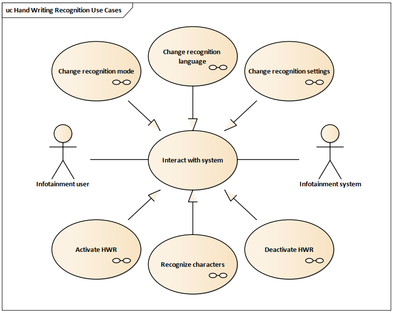
Image reference: doc_image_001.png

Figure 2: Handwriting Recognition Use Cases

## Table
| Use case | Description |
| --- | --- |
| Change recognition mode | Allow client to set the recognition mode. There are two recognition modes, one mode is single character recognition and the other is sentence-based recognition. The default mode is sentence-based recognition. |
| Change recognition language | Allow client to set the recognition language. Currently, only Chinese and Latin are supported. Numeric character is supported by default. |
| Change recognition settings | Allow client to set the recognition settings including maximum character number and stroke timer. The maximum character number supported is up to 10 character. The stroke timer start counting when user stop drawing and stop if user keep drawing again within interval time. |
| Activate HWR | Before using the HWR, client must setup the recognition mode, recognition language, recognition settings and recognition area. After the recognition area is set, the user can start using the HWR feature. |
| Recognize character | HWR software module will trace the stroke drawn by user and response with list of recognized characters. The list is sorted by estimated accuracy, from highest to lowest. |
| Deactivate HWR | Client can deactivate the HWR feature by setting the mode to off and all value of recognition area to zero. |

2.2 Functional Requirements

2.2.1: The HWR software module shall be available for China variant only.

## Table
| Description | Given | System boot up and HWR software module start successfully. |
| --- | --- | --- |
| Description | When | HWR software module shall detect the variant. |
| Description | Then | Software will be disabled if the variant is not China. |
| Description | Exception | None |
| Input | None | None |
| Output | If the variant is not ICAS3CHN then the software will not work. | If the variant is not ICAS3CHN then the software will not work. |
| Reference |  |  |

2.2.2: The client shall be able to change recognition mode.

## Table
| Description | Given | System boot up and HWR software module start successfully. |
| --- | --- | --- |
| Description | When | Client change the recognition mode. |
| Description | Then | Software will change the recognition mode regarding to client request. |
| Description | Exception | None |
| Input | Recognition mode from HWR Client. | Recognition mode from HWR Client. |
| Output | The recognition mode is set successfully. | The recognition mode is set successfully. |
| Reference |  |  |

2.2.3: The client shall be able to change the recognition language

## Table
| Description | Given | System boot up and HWR software module start successfully. |
| --- | --- | --- |
| Description | When | Client change the recognition language. |
| Description | Then | Software will change the recognition language regarding to client request. |
| Description | Exception | None |
| Input | Recognition language from HWR Client | Recognition language from HWR Client |
| Output | The recognition mode is set successfully. | The recognition mode is set successfully. |
| Reference |  |  |

2.2.4: The client shall be able to change the recognition settings

## Table
| Description | Given | System boot up and HWR software module start successfully. |
| --- | --- | --- |
| Description | When | Client change the recognition settings. |
| Description | Then | Software will change the recognition settings regarding to client request. |
| Description | Exception | None |
| Input | Generic settings from HWR Client. | Generic settings from HWR Client. |
| Output | The generic settings is set successfully. | The generic settings is set successfully. |
| Reference |  |  |

2.2.5: Client shall be able to set the recognition area.

## Table
| Description | Given | System boot up and HWR software module start successfully. |
| --- | --- | --- |
| Description | When | Client request to set the recognition area. |
| Description | Then | Software will update the recognition area according to the x, y, width, height provided by client. |
| Description | Exception | None |
| Input | The HWR area indicated by HWR client with 4 elements: -startX, startY: top left point of the area. -width: Width size of the area. -height: Height size of the area. | The HWR area indicated by HWR client with 4 elements: -startX, startY: top left point of the area. -width: Width size of the area. -height: Height size of the area. |
| Output | The HWR Area is set successfully. | The HWR Area is set successfully. |
| Reference |  |  |

2.2.6: The HWR software module shall be able to distinguish between drawing and recognition

## Table
| Description | Given | System boot up and HWR software module start successfully. |
| --- | --- | --- |
| Description | When | HWR function is activated. Client draw stroke within HWR recognition area. |
| Description | Then | After client stop drawing, the stroke timer will be started with a threshold. Exceeding the threshold leads to start recognition. |
| Description | Exception | None |
| Input | None | None |
| Output | The software will not start recognizing as long as the stroke timer doesn’t exceed the threshold. | The software will not start recognizing as long as the stroke timer doesn’t exceed the threshold. |
| Reference |  |  |

2.2.7: The HWR software module shall be able to recognize the character drawn by client inside the recognition area.

## Table
| Description | Given | System boot up and HWR software module start successfully. |
| --- | --- | --- |
| Description | When | HWR function is activated. Client drew stroke within HWR recognition area. |
| Description | Then | Software will provide the recognized after the stroke timer was fired. |
| Description | Exception | None |
| Input | None | None |
| Output | The software will start recognizing after the stroke timer exceeds the threshold. | The software will start recognizing after the stroke timer exceeds the threshold. |
| Reference |  |  |

2.2.8: Client shall be able to deactivate the HWR function.

## Table
| Description | Given | System boot up and HWR software module start successfully. |
| --- | --- | --- |
| Description | When | HWR function is activated. Client request to deactivate HWR Function. |
| Description | Then | The HWR function will be deactivated. |
| Description | Exception | None |
| Input | None. | None. |
| Output | The client can deactivate the HWR function. | The client can deactivate the HWR function. |
| Reference |  |  |

2.2 Non-functional Requirements

## Table
| Scenario# | QA Scenario | Quality attribute | Priority | PIC |
| --- | --- | --- | --- | --- |
| QA.001 | The HWR engine must be compatible to the system. | Portability | High | Hanwang |
| QA.002 | Touch data must be delivered to HWR software module within 40ms | Performance | High | LGE |
| QA.003 | The touch data delivered to HWR software module must be the same as the touch data received by Input Service. Touch lost is not acceptable. | Reliability | High | LGE |
| QA.004 | New software update for HWR engine must not take longer than 2 weeks | Maintainability | Medium | LGE |
| QA.005 | All functional requirements should be testable | Testability | Medium | LGE |

2.3 Technical Constraints

- HWR core engine is released and provided by Hanwang.

- LGE shall provide the architecture design to integrate the HWR core engine.

System requirement:

Supported compiler tool: Linux arm-none-eabi-gcc.

- Linux kernel 5.4.

3. Architectural  Designs

3.1 System Context Diagram

The following diagram shows ICAS3CHN system and its external entity. The navigation of arrows means direction of data or control flow.
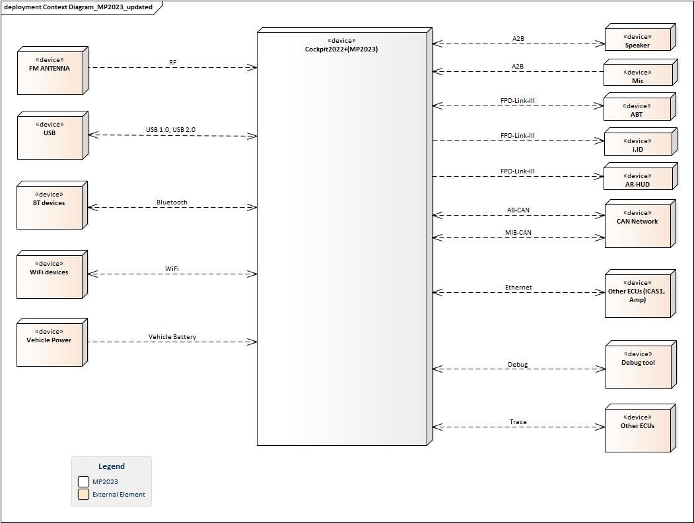
Image reference: doc_image_002.jpeg

Figure 3: ICAS3CHN system context diagram

3.2 System Overview

The following diagram is the drawing of the architecture of ICAS3CHN Main Unit SW.

The new architecture design of HWR software module will be integrated in the IVI Framework.

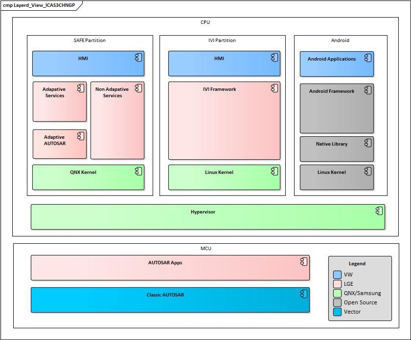
Image reference: doc_image_003.jpeg

Figure 4: ICAS3CHN Architecture

In next section, I will propose two architecture design are:

Integrate HWR software module in to IVI Framework as a micro service.

Integrate HWR software module in to Input Service.

In each section, the basic concept of my proposal will be introduced with the context diagram. The most advantages and disadvantages of each proposal are highlighted in the corresponding section. Finally, the summary will be concluded.

3.3 Architecture Driven Designs

3.3.1 Architecture design 1: Integrate HWR software module in to IVI Framework as a micro service.

Overall description

My first idea was to create a new micro service that would handle the HWR functionality. This idea was based on creating a standalone process that would reduce the impact on other components.

The new service will take responsibility to handle the configuration and touch data from Input service to start recognizing characters. The recognized characters shall be sent back to InputService before being delivered to all registered clients via RSI (Restful Service Interface). The clients will then display the recognized characters so that the end user can chose the character or sentence which they want.

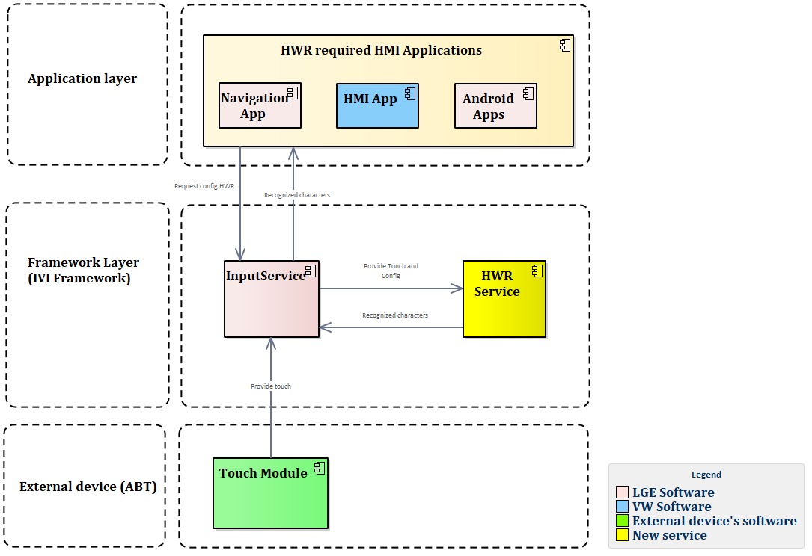
Image reference: doc_image_004.png

Figure 5: System Context Diagram of Integrate HWR software module in to IVI Framework

Component view

InputService and HWRService will communicate with each other via KIPC (Kernel Inter-process Communication). Below figure will illustrate the components of HWRService and how InputService communicate with HWRService.

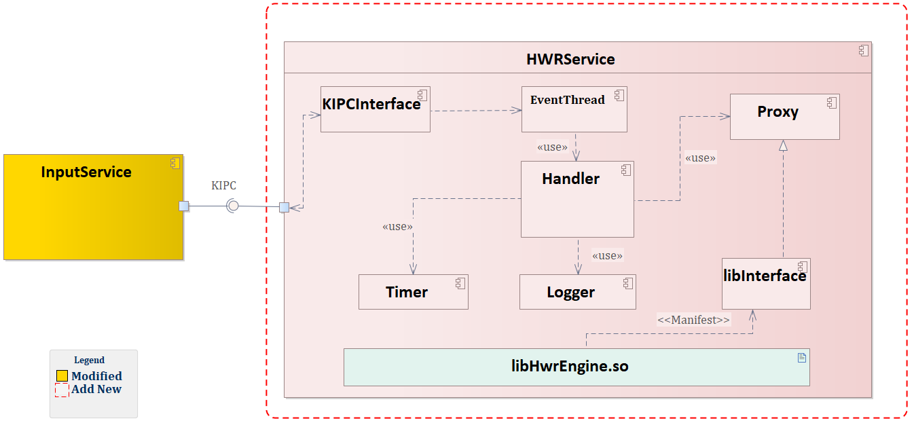
Image reference: doc_image_005.png

Figure 6: HWR Service component diagram.

## Table
| Component | Description |
| --- | --- |
| KIPCInterface | Receive/send KIPC message from/to InputService. |
| EventThread | Queue up all KIPC message before being handled by Handler. |
| Handler | Main logic of HWRService. It is responsible for handling configuration from the client, storing touch data for recognition, starting the timer, and recognizing characters. |
| Proxy | Acting as a wrapper, it wraps the interface to access the HwrEngine library. If the lib has not been delivered by 3rd party, it will work as a fake object to test the functional requirement. |
| Timer | Count down from a set time. It is used for triggering the start of recognition. |
| Logger | The logging module supports debugging when issues occur. |
| libHwrEngine | Handwrite recognition core engine provided by 3rd party. |

The most advantage to consider this approach is the minor impact on the implementation of both applications and Input Service.

Input Service: Only need to update the new KIPC format to communicate with HWRService.

Applications: There is no change required.

However, there are several shortcomings for this approach as my experience from the current IVI system.

Performance: In most case, KIPC works well with low delay when sending/receiving IPC message. However, in worst case (CPU usage > 80%) the latency can go up to 100ms.

Adding new micro service to the system might be complicated and involve many parties.

If the software handles KIPC message in multithreading scenario badly, touch lost will happen.

3.3.2 Alternative design: Integrate HWR software module into Input Service

Overall Description

The main idea of this design is taking advantage of Input service which currently handle both Touch and HWR data from ABT. Instead of creating a new service and use KIPC to communicate, the HWR software module is now integrated into Input service as HWRManager which will run as a thread of Input service.

Image reference: doc_image_006.png

Figure 7: System Context Diagram of Integrate HWR software module in to Input Service

Component view

InputService and HWRManager will communicate with each other via interface which implemented based on Mediator design pattern. Below figure will illustrate the components of HWRService and how InputService communicate with HWRManager.

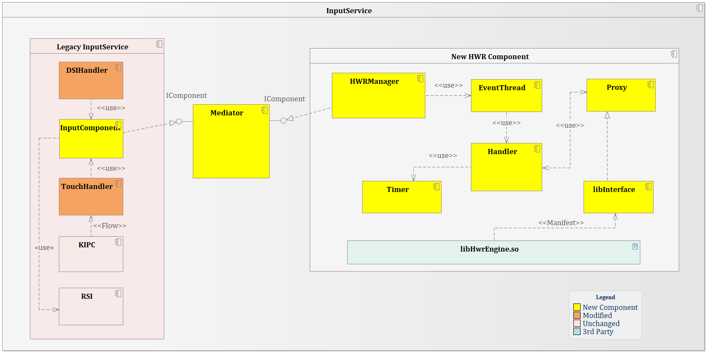
Image reference: doc_image_007.png

Figure 8: InputService component diagram with HWRManager.

## Table
| Component | Description |
| --- | --- |
| Legacy InputService | Group of components related to HWR currently implemented in Input Service |
| KIPC | The component take responsibility to handle touch events from ABT via KIPC |
| DSIHandler | The component takes responsibility for handling the requests related to HWR from the HMI client via DSI. |
| RSI | Implement an RSI server to communicate with clients. Recognized characters will be delivered to all clients via this server. |
| InputComponent | Implement the interface IComponent exposed by the Mediator. It will then take responsibility for communicating with HWManager. |
| HWRManager | Implement the interface IComponent exposed by the Mediator. It will then take responsibility for communicating with InputComponent. |
| Mediator | The component take responsibility for transferring data between InputComponent and HWRManager |
| EventThread | Queue up all requests before being handled by Handler. |
| Handler | Main logic of HWRManager. It is responsible for handling configuration from the client, storing touch data for recognition, starting the timer, and recognizing characters. |
| Proxy | Acting as a wrapper, it wraps the interface to access the HwrEngine library. If the lib has not been delivered by 3rd party, it will work as a fake object to test the functional requirement. |
| Timer | Count down from a set time. It is used for triggering the start of recognition. |
| libHwrEngine | Handwrite recognition core engine provided by 3rd party. |

The advantages of this approach:

Implementing is easier than making a new service as we do not need to involve other parties. It help saving development cost.

InputService has the highest priority when using KIPC to receive touch data from MCU. It guarantee the touch from ABT will reach InputService within 20ms. When HWRManager is integrated in Input service, there will be no latency in receiving touch.

By using Proxy, the software can run without the HWR core engine. Most functional requirement is testable.

But it also has some drawbacks:

-Because the HWRManager is integrated in Input service, when issue such as crash occur it also impacts Input Service.

-CPU usage of Input Service might increase.

3.3.3 Proposal Comparison Summary

To compare the pros and cons of two designs, I recall the main problems of current design. Both design show that they can solve the problems effectively.

## Table
| Problem | Design 1 | Design2 |
| --- | --- | --- |
| Shortage chip resource causing the HWR feature are unavailable | The new design support HWR without the need of additional hardware. | The new design support HWR without the need of additional hardware. |
| Reduce the overhead task of ABT and help to reuse the ABT with non-HWR chip but still keep HWR functionality | The HWR software module on ABT can now be removed. HWR feature can use with any kind of ABT | The HWR software module on ABT can now be removed. HWR feature can use with any kind of ABT |

The following table shows the pros and cons of each design in resolving the non-functional requirement.

## Table
| Items | Quality Attribute | Design 1 | Design2 |
| --- | --- | --- | --- |
| Touch data must be delivered to HWR software module within 40ms | Performance | Mid, In most case, KIPC works well with low delay when sending/receiving IPC message. However, in worst case (CPU usage > 80%) the latency can go up to 100ms. | High, HWRManager and InputService share the same resource, so there will be no latency in transmitting touch event. |
| The touch data delivered to HWR software module must be the same as the touch data received by Input Service. Touch lost is not acceptable. | Reliability | Mid, If the software handles KIPC message in multithreading scenario badly, touch lost will happen. | High, HWRManager will use the same touch data as Input service, so it guarantee touch lost will not occur. |
| New software update for HWR engine must not take longer than 2 weeks | Maintainability | High, The software in Head Unit is released every week. | High, The software in Head Unit is released every week. |
| All functional requirements should be testable | Testability | Mid, Most functional requirement can be test without HWR core engine by using proxy. | Mid, Most functional requirement can be test without HWR core engine by using proxy. |

Based on the analysis and result, I propose to choose the design 2-Integrate HWR software module in to Input Service as better option for current situation of VW ICAS3CHN. Although both design are feasible to implement and can resolve the problems, integrating HWR software module to Input Service proves that it is more trustworthy with better performance and reliability.

3.4 Architectural representation

3.4.1 Static view

3.4.1.1 Context Diagram

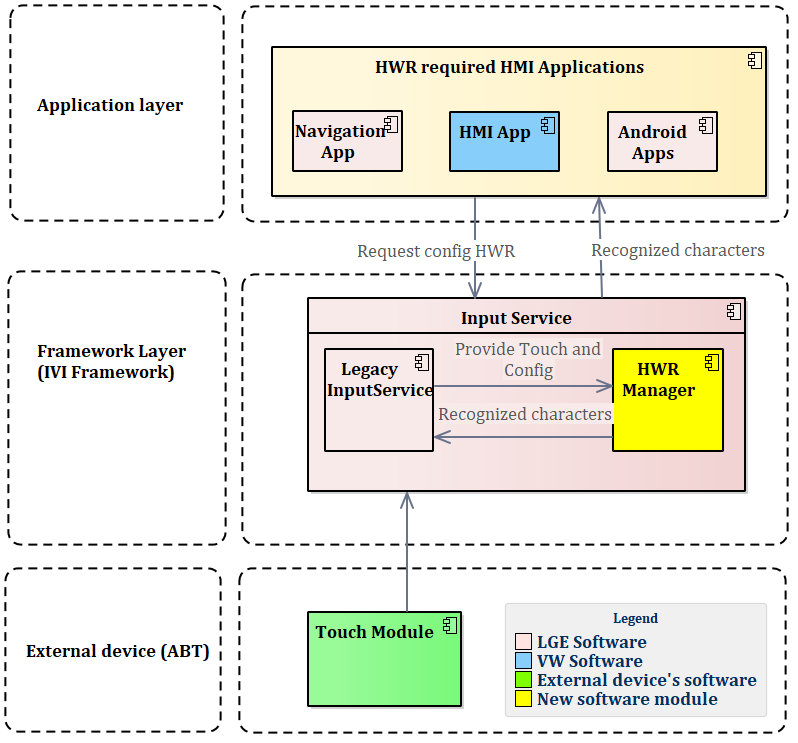
Image reference: doc_image_008.png

Figure 9: Input Service (HWR) Context Diagram.

3.4.1.2 Internal design

I will re-call the component diagram that shown in last section.

Image reference: doc_image_009.png

Figure 10: Component view.

Below diagram will illustrate the class diagram of Mediator.

Image reference: doc_image_010.png

Figure 11: Class view of Mediator and Components.

The classes of Mediator component will be described as below:

## Table
| Classes | Description |
| --- | --- |
| IMediator | Provide interface to components for communicating with each other. |
| HWRMediator | Concrete class of IMediator helping connect InputComponent and HWManager component. |
| IComponent | Provide interface to each component for receiving and parsing data. |
| InputComponent | Implement Input Service’s end to communicate with HWRManager. InputComponent is responsible for delivering the configurations from client and touch data from ABT to HWRManager. |
| HWRManager | Implement HWRManager’s end to communicate with InputComponent. It is responsible for receiving configurations and touch data from InputComponent and handle recognition logic. |

3.4.1.3 Interface design

In this section, I will list all interfaces that the software will use to communicate with external modules.

KIPCInterface

-event_handler:

## Table
| SW Component Name | Input service |
| --- | --- |
| Interface name | void event_handler([IN] uint64_t src, [IN] uint32_t len, [IN] char* str) override; |
| Type | API |
| Parameter | IN [IN] uint64_t src [IN]uint32_t len [IN] char* str OUT none Return none |
| Description | Handle the touch events from MCU before sending to HWRManager. |

DSI (DSIKeyPanel)

- DSIKeyPanelSetRecognizerMode

## Table
| SW Component Name | Input Service |
| --- | --- |
| Interface name | void DSIKeyPanelSetRecognizerMode([IN] char* data, [IN] unsigned int len); |
| Type | API |
| Parameter | IN [IN] char* str [IN] unsigned int len OUT none Return none |
| Description | Request to change the recognition mode |

- DSIKeyPanelSetTouchSensitiveArea

## Table
| SW Component Name | Input Service |
| --- | --- |
| Interface name | void DSIKeyPanelSetTouchSensitiveArea ([IN] char* data, [IN] unsigned int len); |
| Type | API |
| Parameter | IN [IN] char* str [IN] unsigned int len OUT none Return none |
| Description | Request to update the recognition area. |

- DSIKeyPanelLanguage2

## Table
| SW Component Name | Input Service |
| --- | --- |
| Interface name | void DSIKeyPanelLanguage2([IN] char* data, [IN] unsigned int len); |
| Type | API |
| Parameter | IN [IN] char* str [key_id, value] OUT none Return none |
| Description | Request to update the recognition language. |

- DSIKeyPanelSetGenericSetting

## Table
| SW Component Name | Input Service |
| --- | --- |
| Interface name | void DSIKeyPanelSetGenericSetting ([IN] char* data, [IN] unsigned int len); |
| Type | API |
| Parameter | IN [IN] char* str [key_id, value] OUT none Return none |
| Description | Request to change the recognition settings. |

LibHwrEngine.so

- HWRC_SetWorkSpace

## Table
| SW Component Name | HWR service |
| --- | --- |
| Interface name | Int HWRC_SetWorkSpace ([IN] unsigned int* pHandle, [IN] char* pcRam, [IN] int iRamSize); |
| Type | API |
| Parameter | IN [IN] unsigned int* pHandle : recognition handle [IN] char* pcRam : recognition space [IN] int iRamSize : recognition space size OUT success or not Return HWERR_SUCCESS HWERR_INVALID_REC_HANDLE When pHandle is NULL HWERR_INVALID_PARAMETER When pcRam is NULL HWERR_NOT_ENOUGH_MEMORY When lRamSize less than 36KB |
| Description | HWRC_SetWorkSpace loads the processing space. This function allocates corresponding Ram space and saves in handle. The space is allocated by developers and released after the Input Method was canceled. |

- HWRC_SetRecogDic

## Table
| SW Component Name | HWR service |
| --- | --- |
| Interface name | Int HWRC_SetRecogDic ([IN] unsigned int* pHandle, [IN] unsigned char* pbDic, [IN] int iLanguage); |
| Type | API |
| Parameter | IN [IN] unsigned int* pHandle : recognition handle [IN] unsigned char* pbDic: recognition dictionary pointer [IN] int iLanguage: language recognition OUT success or not Return HWERR_SUCCESS HWERR_INVALID_REC_HANDLE When pHandle is NULL HWERR_INVALID_PARAMETER When pbDic is NULL is NULL HWERR_POINTER_NOT_4BYTES_ALGN When the address of the dictionary is not 4Bytealigned HWERR_INVALID_LANGUAGE When the Dictionary was not matched the language |
| Description | Configuration Items include: the settings of recognition dictionary, recognition mode and character set range. HWRC_SetRecogDic() sets the recognition dictionary when dictionary is separated from the engine. The address of recognition dictionary must be 4 bytes aligned. |

-HWRC_SetRecogMode

## Table
| SW Component Name | HWR service |
| --- | --- |
| Interface name | int HWRC_SetRecogMode ([IN] unsigned int* pHandle, [IN] int iType); |
| Type | API |
| Parameter | IN [IN] unsigned int* pHandle : recognition handle [IN] int iType: recognition mode OUT success or not Return HWERR_SUCCESS HWERR_INVALID_REC_HANDLE: When pHandle is NULL HWERR_INVALID_MODE: When mode is not supported by engine |
| Description | HWRC_SetRecogMode() sets the recognition mode. The engine supports two modes, one mode is single character recognition and the other is sentence-based recognition. The default recognition mode is sentence-based recognition. |

-HWRC_Recognize

## Table
| SW Component Name | HWR service |
| --- | --- |
| Interface name | int HWRC_Recognize ([IN] unsigned int* pHandle, [IN] short* pnPoints); |
| Type | API |
| Parameter | IN [IN] unsigned int* pHandle : recognition handle [IN] short* pnPoints: The trace which is touch points drawn by user. OUT success or not Return HWERR_SUCCESS HWERR_INVALID_PARAMETE: When the handle is NULL or the engineoperationRom is NULL or the trace buffer is NULL HWERR_NOT_ENOUGH_MEMORY: When the size of workspace is 0 or sizeof memoryis not match mode HWERR_INVALID_MODE: When the mode is not supported by the engine HWERR_INVALID_DATA: When the address of the dictionary is destoried HWERR_INVALID_WRITING_TRACE: When the trace is invalid, such as the coordinate value is less than 0, except for the stroke mark, or x-y pair is mismatch, or number of hand writing points is more than 2048. |
| Description | After recognition attributes are set, handwriting trace can be recognized by the HWRC_Recognize() function |

- HWRC_GetResult

## Table
| SW Component Name | HWR service |
| --- | --- |
| Interface name | int HWRC_GetResult ([IN] unsigned int* pHandle, [IN] int iMaxCandNum, [OUT]int* pResult); |
| Type | API |
| Parameter | IN [IN] unsigned int* pHandle : recognition handle [IN] int iMaxCandNum: recognition mode [OUT] int* pResult: result OUT success or not Return Greater than 0: Number of candidates 0: Error. |
| Description | HWRC_GetResult() can get the recognition candidates after Recognizing successfully. pResult output default is Unicode. Each candidate ends with 0, and all candidates end with 0. |

3.4.2 Dynamic View

3.4.2.1 State design

The HWRManager shall work as the following states:

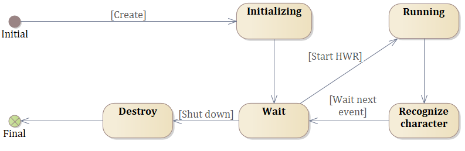
Image reference: doc_image_011.png

Figure 12: State design of HWRManager

3.4.2.2 C&C View

The diagram below shows how the new software design communicate with external module.

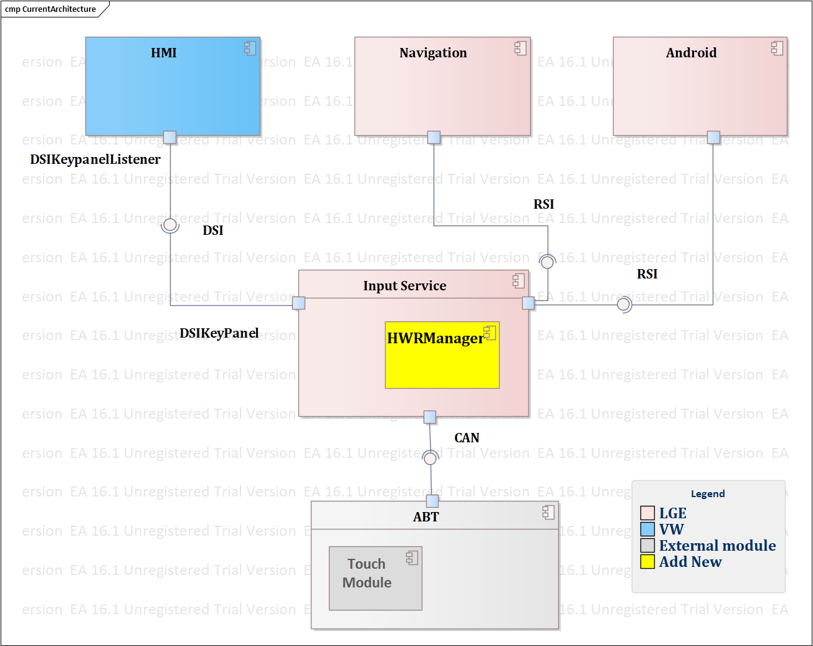
Image reference: doc_image_012.png

Figure 13: C&C view of integrating HWRManager into Input Service.

3.4.2.2 Interaction design

The sequence diagrams below will illustrate the interaction of all components with each functional requirement.

1. Initialization

The HWR software module shall be available for China variant only.

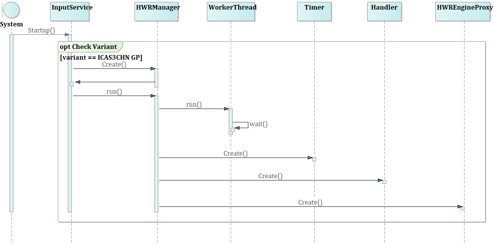
Image reference: doc_image_013.png

Figure 14: Sequence Initialization

2. Activate HWR

Image reference: doc_image_014.png

Figure 15: Sequence activate HWR

3. Draw Character

The HWR software module shall be able to distinguish between drawing and recognition

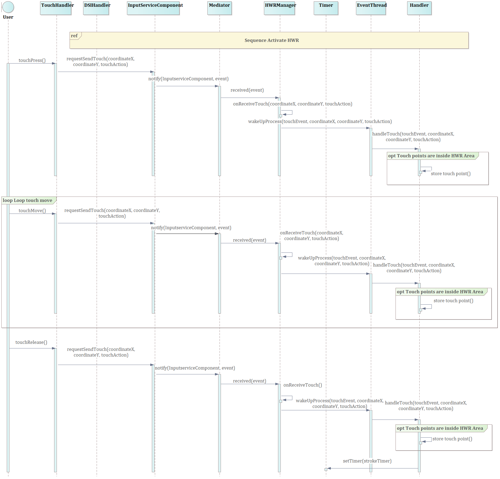
Image reference: doc_image_015.png

Figure 16: Sequence Draw Character

4. Change Recognize Language

The client shall be able to change the recognition language

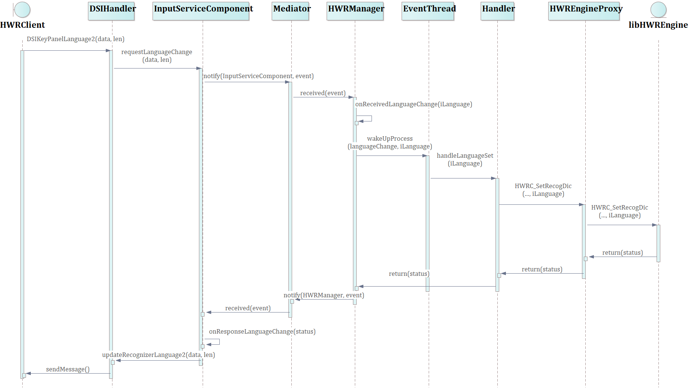
Image reference: doc_image_016.png

Figure 17: Sequence change Recognize Language

5. Deactivate HWR

Client shall be able to deactivate the HWR function.

Image reference: doc_image_017.png

Figure 31: Sequence Deactivate HWR

6. Recognize Character

The HWR software module shall be able to recognize the character drawn by client inside the recognition area.

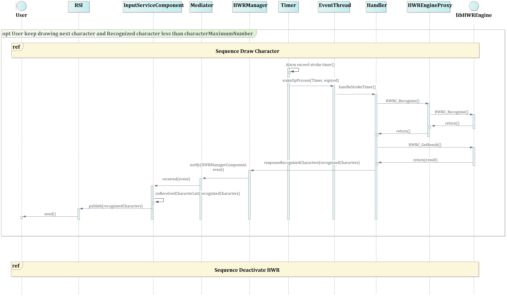
Image reference: doc_image_018.png

Figure 18: Sequence Recognize Character

7. Change Recognition Mode

The client shall be able to change recognition mode.

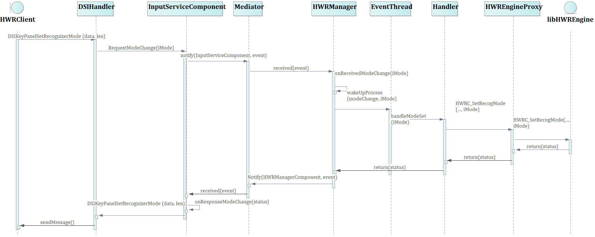
Image reference: doc_image_019.png

Figure 19: Sequence Change Recognition Mode

8. Change Recognition settings

The client shall be able to change the recognition settings

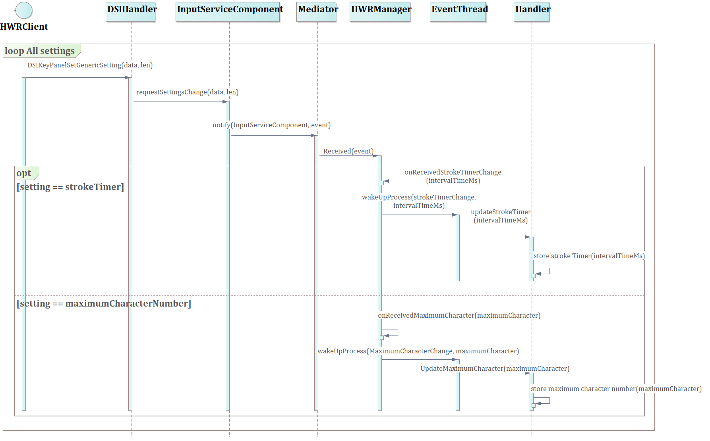
Image reference: doc_image_020.png

Figure 20: Sequence Change Recognition settings

9. Change HWR Area settings

Client shall be able to set the recognition area.

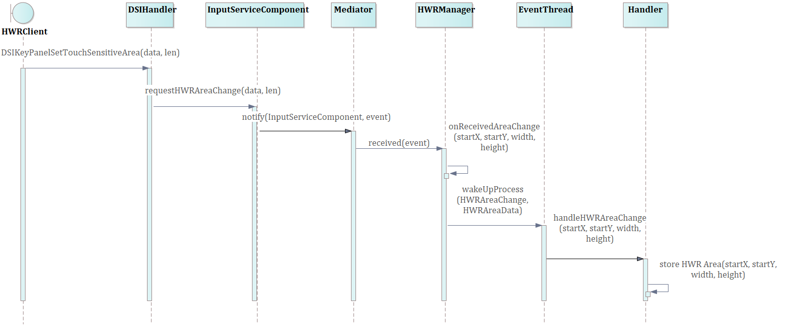
Image reference: doc_image_021.png

Figure 21: Sequence Change HWR Area settings
