# Raw Slide Content

- Source file: FA_Hieu4_Nguyen/FA_Project_New design for Handwriting Recognition in VW ICAS3CHN/FA_Project_New_design_for_Handwriting_Recognition_in_VW_ICAS3CHN.pptx
- Total slides: 24

## Slide 1

FA Project
New design for Handwriting Recognition in VW ICAS3CHN

Candidate: Nguyen Trung Hieu
Supervisor: Ms 정은희
LGEDV CORE FRAMEWORK TEAM
2024.09.25

## Slide 2

Table of contents

1

Architecture design proposals

3

Architecture diagram

4

Overview of Handwriting Recognition

Q&A

5

6

Problem Identification

2

## Slide 3

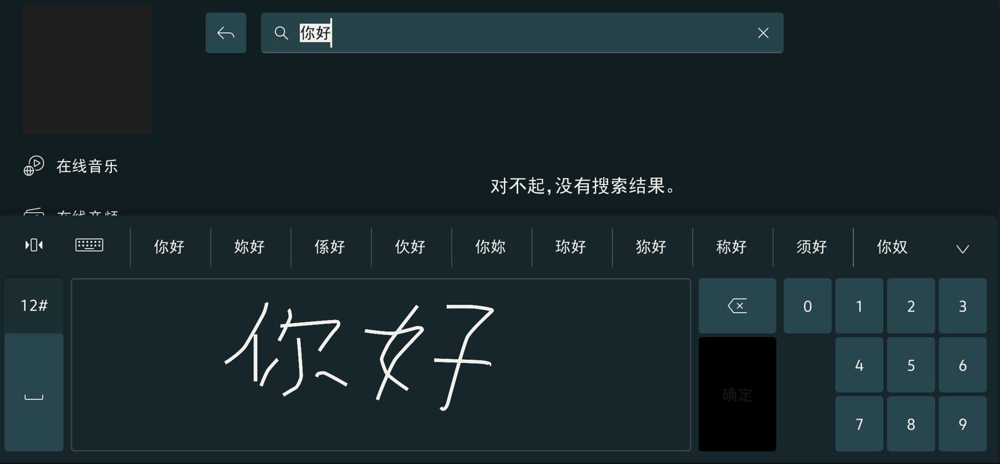
Image reference: slide_03_image_01.png

Interprets the user’s handwritten character or words into a format that computer understand.
Supports multiple recognition languages
Offers the flexibility to switch between typing and handwriting, catering to different user preferences and scenarios.

1. Overview of Handwriting Recognition

Image reference: slide_03_image_02.png

## Slide 4

Image reference: slide_04_image_01.png

Functional requirements:

1. Overview

1. Overview of Handwriting Recognition

Support clients to set configuration before using the feature.
-Change recognition mode, language
-Change recognition settings (recognition area, stroke timer, maximum character number)
Support user activate/deactivate function on demand.
Recognize characters based on the stroke drawn by user.

## Slide 5

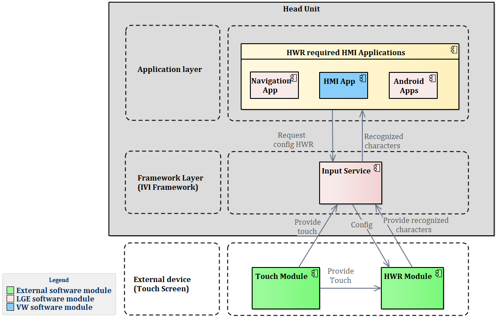
Image reference: slide_05_image_01.png

2. Problem Identification

Requiring additional chip, increasing development cost. The shortage chip resource from chip vendor causing lack of  Touch screen for the project.
Increasing overhead task to Touch screen, reducing system performance.
→OEM requests an alternative design to adapt with the HWR core engine provided by Hanwang (3rd party company), to move HWR Module to Head Unit.

Current Architecture Design Problems

## Slide 6

Task Objectives

To release the dependency of HWR feature with hardware for:
	-Reducing the development cost.
	-Reuse the Touch screen which doesn’t integrate HWR.
2.   To reduce the overhead task of Touch screen for enhancing system performance.
3.   To improve software quality (500+ issues were created because tester used wrong screen to test).

## Slide 7

### Table
| Scenario# | How to measure | Quality attribute | Priority |
| QA.001 | The software module shall work normally without additional hardware. | Availability | High |
| QA.002 | Touch data should be delivered to HWR software module within 40ms | Performance | High |
| QA.003 | Current interfaces used by HMI applications must not be changed so that all HMI apps can be reused. | Reusability | High |

Non-Functional requirements

## Slide 8

3. Architecture Design Proposals

Proposal 1: Integrate HWR software module into IVI Framework as HWRService

Pros:
Release the dependency of HWR module with hardware.
→Availability (Meet QA.001).
Low impact of change to both applications and Input Service
Input Service: Only need to update the new IPC format to communicate with HWRService.
HMI Applications: There is no change required.
      →Reusability (Meet QA.003).
In normal condition, touch data delivered from Input Service to HWRService less than 10ms.
→Performance (Meet QA.002).
Cons:
Introduce new service to system is complex making overhead operational in term of deployment.
IPC communication can introduce latency. Testing with high CPU usage condition, the delay can go up to 100ms.

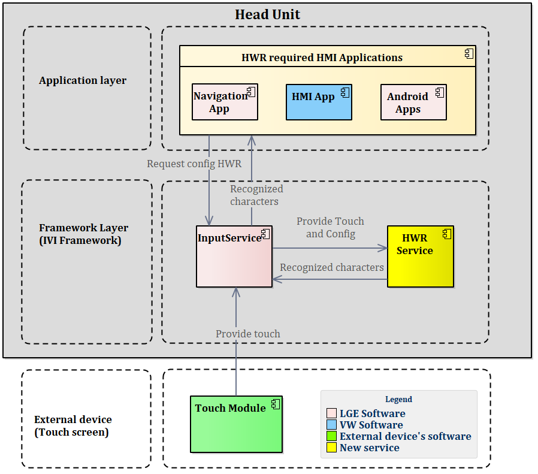
Image reference: slide_08_image_01.png

## Slide 9

3. Architecture Design Proposals

Proposal 2: Integrate HWR software module into Input Service

Pros:
Release the dependency of HWR module with hardware.
→Availability (Meet QA.001).
Keep all HMI application’s interface.
→Reusability (Meet QA.003).
Guarantee no latency in communication between Legacy InputService and HWRManager.
→Performance (Meet QA.002).
Cons:
Additional work for Input Service.
In case of failure, it will impact Input service.
(Possible to be resolved by detailed architecture design)

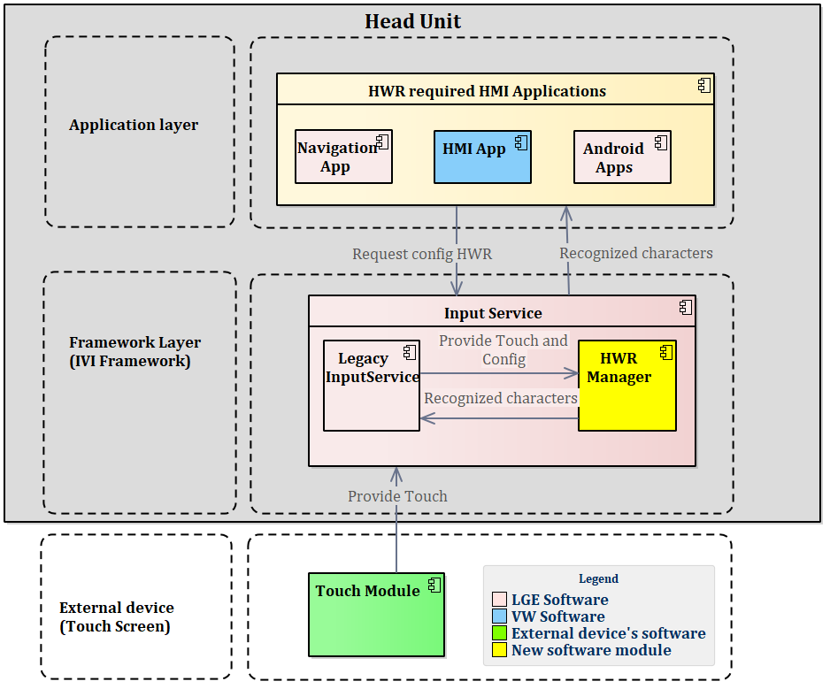
Image reference: slide_09_image_01.png

## Slide 10

00:08:52.000 Info ApplicationProcessor.Application.HMI.General Info  TouchMgr.cpp TouchCoordinateParser 121  [HWR TEST]Send touch via KIPC touchx[885], touchY[638], action[254] time[1719812528:495]
00:08:52.005 Info ApplicationProcessor.Application.Unknown.Unspecified Info  HWRHandler.cpp handleTouch 31   [HWR TEST]handle touchx[885], touchY[638], action[254] time[1719812528:500]
00:08:52.010 Info ApplicationProcessor.Application.HMI.General Info  TouchMgr.cpp TouchCoordinateParser 121  [HWR TEST]Send touch via KIPC touchx[816], touchY[620], action[254] time[1719812528:505]
00:08:52.113 Info ApplicationProcessor.Application.Unknown.Unspecified Info  HWRHandler.cpp handleTouch 31   [HWR TEST]handle touchx[816], touchY[620], action[254] time[1719812528:608]
00:08:52.121 Info ApplicationProcessor.Application.HMI.General Info  TouchMgr.cpp TouchCoordinateParser 121  [HWR TEST]Send touch via KIPC touchx[336], touchY[656], action[254] time[1719812528:616]
00:08:52.123 Info ApplicationProcessor.Application.Unknown.Unspecified Info  HWRHandler.cpp handleTouch 31   [HWR TEST]handle touchx[336], touchY[656], action[254] time[1719812528:618]

00:11:23.505 Info ApplicationProcessor.Application.HMI.General Info  TouchMgr.cpp TouchCoordinateParser 121  [HWR TEST]Send touchx[1428], touchY[664], action[254] time[1719812679:945]
00:11:23.505 Info ApplicationProcessor.Application.HMI.General Info  HWRManager.cpp onReceivedTouch 89   [HWR TEST]onReceivedTouch
00:11:23.506 Info ApplicationProcessor.Application.HMI.General Info  Handler.cpp handleTouch 48   [HWR TEST]handle touchx[1428], touchY[664], action[254] time[1719812679:946]
00:11:23.515 Info ApplicationProcessor.Application.HMI.General Info  TouchMgr.cpp TouchCoordinateParser 121  [HWR TEST]Send touchx[1476], touchY[670], action[254] time[1719812679:955]
00:11:23.515 Info ApplicationProcessor.Application.HMI.General Info  HWRManager.cpp onReceivedTouch 89   [HWR TEST]onReceivedTouch
00:11:23.516 Info ApplicationProcessor.Application.HMI.General Info  Handler.cpp handleTouch 48   [HWR TEST]handle touchx[1476], touchY[670], action[254] time[1719812679:956]

Experimental result

Proposal 1: Integrate HWR software module into IVI Framework as HWRService

Proposal 2: Integrate HWR software module into Input Service

103ms

InputService send touch data

HWRService receive touch data

InputService send touch data

HWRManager receive touch data

1ms

## Slide 11

Experimental result

## Slide 12

### Table
| How to measure | Quality Attribute | Proposal Design 1 Integrate HWR software module into IVI Framework as HWRService | Proposal Design2 Integrate HWR software module into Input Service |
| The software module shall work normally without additional hardware. | Availability | High, The new HWRService doesn’t require additional hardware to work. | High, The new HWRManager doesn’t require additional hardware to work. |
| Touch data must be delivered to HWR software module within 40ms | Performance | Mid, In most case, the IPC works well with low delay when sending/receiving IPC message. However, in worst case (CPU usage > 80%) the latency can go up to 100ms. | High, HWRManager and InputService share the same resource, so there will be no latency in transmitting touch event. |
| Current interfaces used by HMI applications must not be changed so that all HMI apps can be reused. | Reusability | High, Keep current interfaces used by HMI applications unchanged. InputService only need to update the new IPC format to communicate with HWRService. | Mid, Keep current interfaces used by HMI applications unchanged. However, InputService need to update much. |

Comparison and decision

→ Decide to use Proposal 2: Integrate HWR software module into Input Service

## Slide 13

4. Architecture diagram

To meet the Functional Requirements:
-The DSIHandler (handler request from client) and TouchHandler need to be modified to communicate with new module.
-Used Mediator design pattern to create connection between Legacy code of Input Service and new HWRManager component.
-EventThread: Touch data and clients request come from different threads so they need to be queued up.
-Proxy: Wrap API from 3rd party library.
-Handler: Main logic which will handle all events.
-Timer: Counting time to start recognize after user stop drawing.

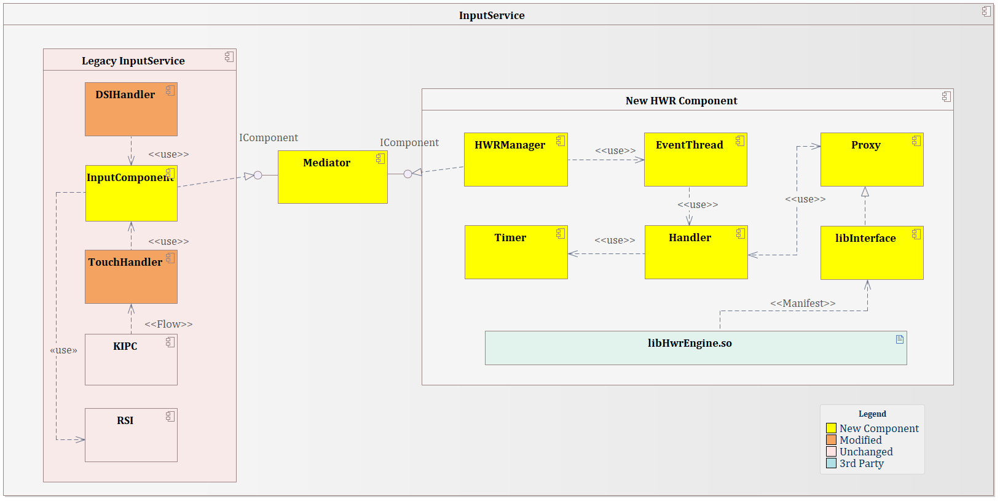
Image reference: slide_13_image_01.png

## Slide 14

4. Architecture diagram

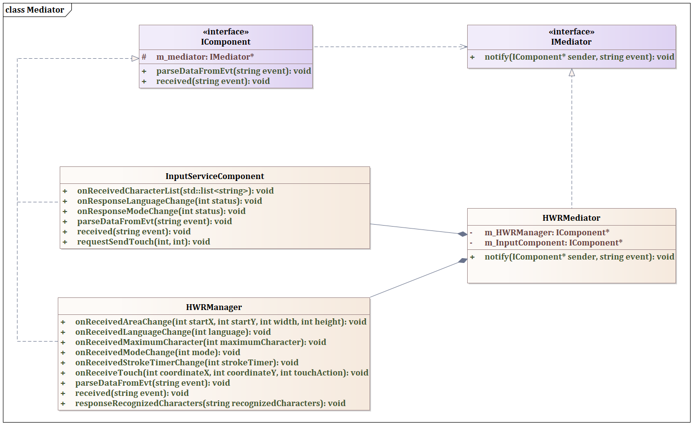
Image reference: slide_14_image_01.png

## Slide 15

Q&A
Thank you for listening

5. Q&A

## Slide 16

Appendix

Image reference: slide_16_image_01.png

Sequence initialization

## Slide 17

Image reference: slide_17_image_01.png

Sequence change Recognition Mode

## Slide 18

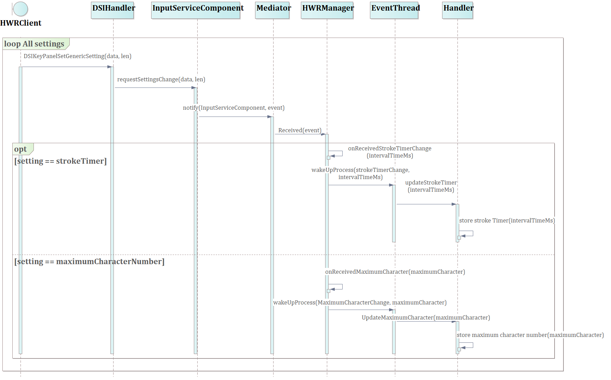
Image reference: slide_18_image_01.png

Sequence Change Recognition Setting

## Slide 19

Image reference: slide_19_image_01.png

Sequence Change Language

## Slide 20

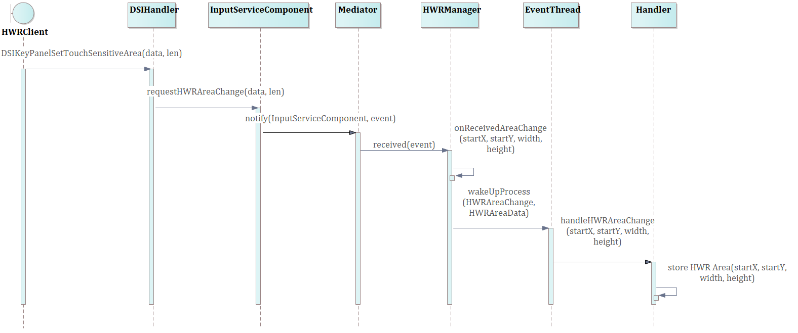
Image reference: slide_20_image_01.png

Sequence Change HWR Area Setting

## Slide 21

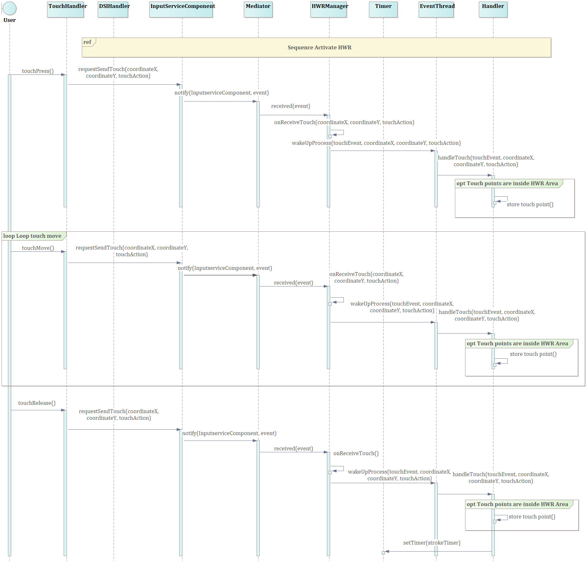
Image reference: slide_21_image_01.png

Sequence Draw Character

## Slide 22

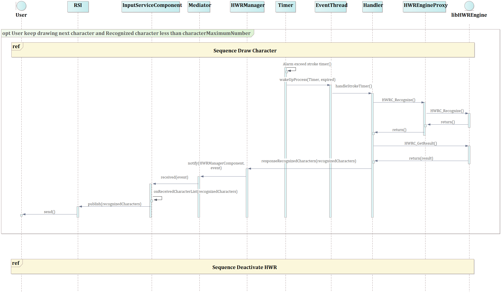
Image reference: slide_22_image_01.png

Sequence Recognize Character

## Slide 23

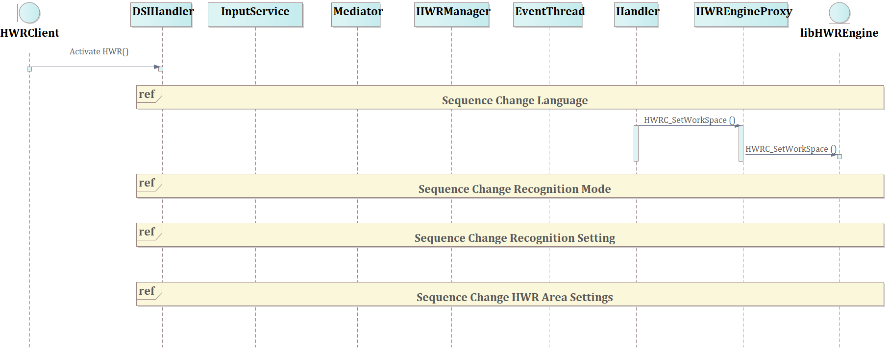
Image reference: slide_23_image_01.png

Sequence Activate HWR

## Slide 24

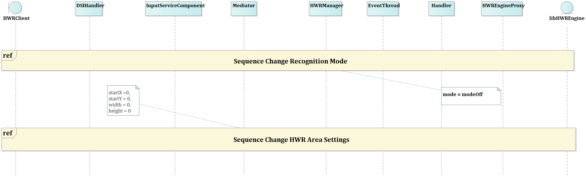
Image reference: slide_24_image_01.png

Sequence Activate HWR

