# Raw Document Content

- Source file: FA_hieu5.nguyen/DD_COM_monitoring_commonization_v3.2.docx

['24 FA] Design of commonization for Communication Monitoring function

About This Document

Document Information

## Table
| Document Title | SW Design |
| --- | --- |
| Project | MB_BR167M2_ICD |
| Issuing Authority | Mercedes-Benz |
| Author | Nguyen Trung Hieu (hieu5.nguyen@lge.com) |
| Status of Document | Completed |

Revision History

## Table
| Version | Date | Content of Change | Author | Reviewer |
| --- | --- | --- | --- | --- |
| 01 | 2024.07.31 | Initial Release | Hieu5.nguyen | Sangkyu.hwangbo |
| 02 | 2024.08.16 | Update two proposals of solution and compare reasonable of them | Hieu5.nguyen | Sangkyu.hwangbo |
| 03 | 2024.09.25 | Update problems identification Update content as mentor suggestion | Hieu5.nguyen | Sangkyu.hwangbo |

List of images

Figure 1: Classic AUTOSAR architecture of MCU in BR167 project	5

Figure 2: Components in communication monitoring function	8

Figure 3: Component and connecter view of current design	10

Figure 4: Operations and processing flow of classic AUTOSAR system	11

Figure 5: Sequence diagram of current design	12

Figure 6: Performance measurement of current monitoring runnables	13

Figure 7: Current design activity scenarios	14

Figure 8: Measurement log of SWC processing times in current design	15

Figure 9: Common solution diagram	17

Figure 10: Component and connecter view of proposal 1	18

Figure 11: Component and connecter view of proposal 2	19

Figure 12: Static view of solution design	23

Figure 13: Dynamic view of solution design	24

Figure 14: Sequence diagram of solution design	25

Figure 15: CPU usage of solution design	25

Figure 16: Measurement log of SWC processing times in solution design	26

Figure 17: Sequence diagram of unpredicted case in solution design	27

List of tables

Table 1: Key quality attributes of BR167 project	7

Table 2: Role of software components	9

Table 3: Architecture designs comparison	22

Table 4: Quantitative logic matrix to compare 2 proposals	22

Introduction

Purpose

This document specifies the software detailed design for communication monitoring component on BR167M2 project. Including static design, dynamic design, and algorithm design.

This document identifies the most effective way to design the monitoring component and describes how to implement it to satisfy project requirements.

Audience

The readers of this article are as follows:

Software Architect

Customer

Developer

Project Leader

Project Manager

Test Engineer

Related Documents

## Table
| Document / Spec. Title | Version | Issuing Division |
| --- | --- | --- |
| BR167 SAD (Software Architectural Design) | v6.0 | BR167M2 Development Team |

Abbreviations / Terms

## Table
| Abbreviation | Description |
| --- | --- |
| SAD | Software Architectural Design |
| NM | Network message |
| RTE | AUTOSAR Runtime environment |
| MCU | Micro Controller Unit |
| SWC | Software component |
| BSW | Basic software |

1: Project context

This section presents project overview and background explanation.

1.1: Overview

In M.Benz BR167M2 project, MCU processor has Classic AUTOSAR 4.4 architecture. It manages:

ICD: Instrument Cluster Display

CID: Center information Display

CDD: Co-Driver Display

and controls power, display, radiator fan, driver camera, touch, diagnostic and more.

This is software architecture design of the project:

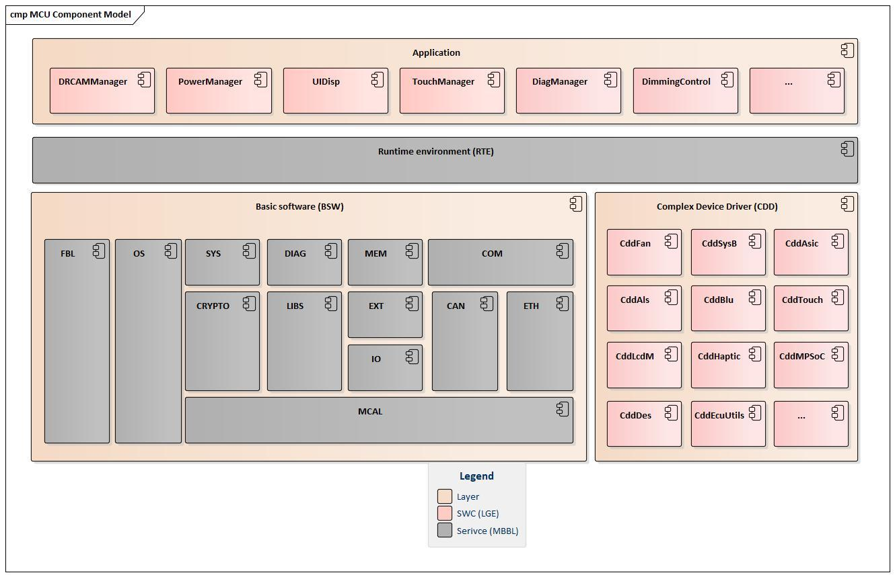
Image reference: doc_image_001.jpg

Figure 1: Classic AUTOSAR architecture of MCU in BR167 project

Layer: all layers are described exactly so that the application software can be implemented independent of the hardware and without knowledge of how the other layers behave. This is the most distinctive advantage of AUTOSAR architecture.

Application: responsible for executing specific vehicle functions, largely hardware-independent, promoting reusability and portability across different ECU platforms

Runtime environment (RTE): As middleware, it integrates different applications with the basic software. It also organizes the communication which takes place via ports defined beforehand and data exchange between the two layers and manages the running of the runnable.

Complex Device Driver (CDD): controls special sensors and actuators via direct access to the microcontroller. This involves sensors with special time conditions.

Basic software (BSW): provide fundamental services and functionalities that are essential for the operation of MCU. It acts as a bridge between the hardware and the application software, ensuring efficient communication and resource management.

Software component (SWC): is the building block of automotive software applications. They encapsulate a specific set of functionalities or data, and they interact with other components through well-defined interfaces. This modular approach promotes reusability, maintainability, and scalability.

Application Software: These components implement the specific functionalities required by the automotive application, such as engine control (PowerManager, ...), transmission control (DiagManager, …), or driver assistance systems (DRCAMManager, …).

Complex Device Drivers: These components encapsulate the functionality of complex hardware devices, such as sensors or actuators (CddFan, CddSysB, …)

Runnable: is a unit of executable code that can be scheduled and executed independently. It's a fundamental building block for software components. It is like functions in programming language.

Timing runnable: Activated at predefined time intervals. It works like a repeating timer.

Event runnable: Activated in response to specific events, such as at MCU initialize or server trigger by client calling.

1.2: Background

In BR167 Classic AUTOSAR project, many software components (DRCAMManager, PowerManager, CddFan, CddSysB and more) need to monitor communication status continuously and take immediate actions when status changed. So, each SWC use a timing runnable to take turns reading communication status from communication service and execute its logic. The idea is centralizing the monitoring function of system. It's more effective when we analyze the similarities when monitoring and process communize it in a component.

1.3: Expected results

Fully and accurately meet project requirements.

Improve ECU performance.

Commonization to easy developing and porting.

This architecture can also be applied to monitor other signals or trigger multiple SWC tasks which are in the same condition by a component.

2: Problem defined

This section presents functional requirements, quality attributes and the problem to be solved.

2.1: Nonfunctional requirement

Key quality attribute requirements that the project software must satisfy:

## Table
| Quality Attribute | Priority | Description |
| --- | --- | --- |
| Performance | High | Response of the system to performing certain actions for a certain period. |
| Modularity | High | Divide functions and software into feasible unit modules (components), each component has its own function to manage a device. |
| Reliability | High | Ability to continue to operate under predefined conditions. |
| Maintainability | Medium | Ability of the system to support changes. Also, it affects the time needed to restore the system after a failure. |
| Scalability | Medium | Ability of the system to handle load increases without decreasing performance, or the possibility to rapidly increase the load. |
| Reusability | Low | A chance of using a component or system in other components/systems with small or no change. |
| Simplicity | Low | Developing the simplest design to realize a given requirement. |

Table : Key quality attributes of BR167 project

Those priorities are set by software architecture drivers of BR167 project (mentioned in the project SAD) and Classic AUTOSAR characteristic.

2.2: Functional requirement

MCU has below functional requirement about Communication:

MCU needs to ensure the devices operate correctly, avoiding unintended control deviations caused by miscommunication, it includes tasks such as status monitoring of the network message (NM status), fault detection and device recovery.

That means the system need monitor communication-mode (com-mode) and perform corresponding actions to control devices when com-mode changes. Below are the components involved in the feature:

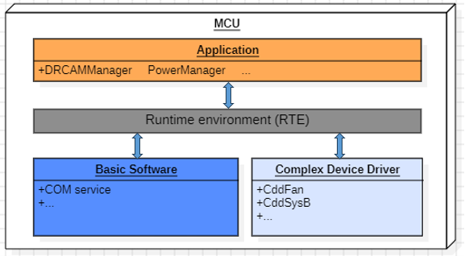
Image reference: doc_image_002.png

Figure 2: Components in communication monitoring function

The functional responsibilities between BSW COM service and the Software Components is delineated as follows.

BSW COM service:

Network Initialization and Shutdown: responsible for initializing and shutting down the network communication stack.

Error Handling: manages communication errors, including detection, reporting, and recovery mechanisms.

Information: provides a GetCurrentComMode interface for using of other component, the interface returns current communication mode which includes possible values:

COMM_NO_COMMUNICATION: The vehicle bus status is idle.

COMM_SILENT_COMMUNICATION: The vehicle bus status is active without Tx/Rx.

COMM_FULL_COMMUNICATION: The vehicle bus status is active with Tx/Rx.

Application & CDD software components:

Monitoring: determine whether the communication is currently active or inactive.

Application Logic: implements application-specific logic for its functionality.

Event Handling: handles events triggered by changing of network communication status, such as communication errors, and takes appropriate actions.

Triggering conditions of events which need to be monitored and handled

Full communication:

Ignition On and vehicle bus is active.

Communication mode changes from another mode to COMM_FULL_COMMUNICATION after recovering.

No communication:

Ignition Off.

Communication mode change from other mode to COMM_NO_COMMUNICATION due to communication error causing by CAN signal loss, data error, signal wire break… and cannot recovery.

SWCs immediately perform different actions when the communication mode changes (meaning events occur).

## Table
| SWC | Role | Actions of events | Actions of events |
| --- | --- | --- | --- |
| SWC | Role | Full communication | No communication |
| DRCAMManager | Manage for driver camera, IR LED and switch on/off MPSoC. | Turn on camera (MPSoC). | Turn off camera (MPSoC). |
| PowerManager | Provides power management which control MCU/AP on/off state, handles Wake Up sequence, standby mode / stop (sleep) mode. | Change Power Mode to Display by wake-up sequence | Change Power Mode to Sleep by shutdown sequence |
| CddFan | Control fan according to temperature's value. | Turn on all fans. | Turn off all fans. |
| CddSysB | Monitor power fault and battery voltage. | N/A | Write Bus Active to NvM Block. |

Table : Role of software components

As the above table, although performing different actions, SWCs have the same conditions to trigger execution.

2.3: Problem Identification.

This is component and connecter diagram of current architecture design for communication monitoring function:

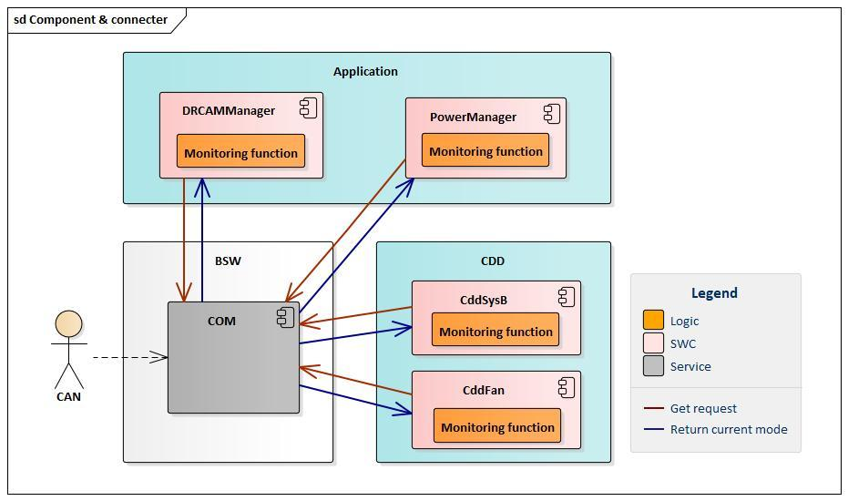
Image reference: doc_image_003.jpg

Figure 3: Component and connecter view of current design

To implement the functional requirement, with current architecture design, each SWC performs its monitoring function themselves with its own features. They request and get communication mode from COM service directly. All requests use a same interface, so an API will be called many times continuously during a very short time.

In Classic AUTOSAR system, activities are performed through “Tasks”, a task can contain one or more runnables and is managed by the AUTOSAR Operating System (RTOS). Tasks are similar to processes in general-purpose operating systems. With the current system, all SWC tasks are allocated into one chipset core, so they are executed one after another. This is scheduled by the operating system and the execution unit is the runtime environment. Simply put, the operation of all software components is performed by a single thread.

This below sequence diagram demonstrates how the OS perform runnables (tasks):

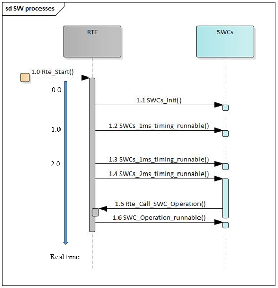
Image reference: doc_image_004.png

Figure : Operations and processing flow of classic AUTOSAR system

1.0: System on / RTE start.

1.1: At 0ms in real time, RTE call all initialize runnable of all SWCs in turn.

1.2: At 1ms of real time, RTE call 1ms timing runnables of software components.

1.3 & 1.4: RTE call timing runnables which have predefined time interval meet system real time. In this 2ms system time case, RTE trigger 1ms and 2ms runnables of software components in scheduled order, scheduling based on task priority. This diagram show 1ms runnable is called before 2ms runnable, but in other time it can be completely the opposite.

1.5: In some SWC runnable, they call RTE interfaces to trigger server runnable of other SWCs.

1.6: RTE trigger server runnable immediately.

The monitoring of SWCs is executed sequentially and in succession, each component uses a 10ms runnable to perform. That means we want to perform monitoring function every 10 milliseconds of real time.

Image reference: doc_image_005.jpg

Figure 5: Sequence diagram of current design

With each monitoring SWC, RTE must perform below action for monitoring function every 10ms:

Trigger monitoring runnable of the SWC.

Get current communication mode from COM service.

Handle logic of the SWC with communication mode.

Perform actions of controlling device or sensor with current mode.

After completion of monitoring function of first SWC, RTE continues to perform monitoring function of other SWCs, or different tasks based on OS scheduling.

When monitoring in each SWC, OS needs to execute many 10ms runnables continuously with a lot of similar actions. So, it will take a long handling time and reduce MCU performance.

Problems arising from current design:

Waste of system resources (Performance, Scalability)

Scenario: To execute timing runnables, the CPU spends resources on scheduling and execution. In a system with a high number of runnables, the scheduling overhead can become significant. Currently, we use 4 timing runnables of 4 SWC to monitoring, they perform repetitive actions like getting the communication mode from the COM service, this wastes CPU usage. If the system scales, the waste is further increasingly when addition SWCs want to monitor in the future.

Measurement: Using TRACE32 tool to measure CPU performance and showing the result as below:

The current design uses 4 runnables for monitoring, the average CPU usage of runnables over a long-specified period is represented by the “ratio” parameter.

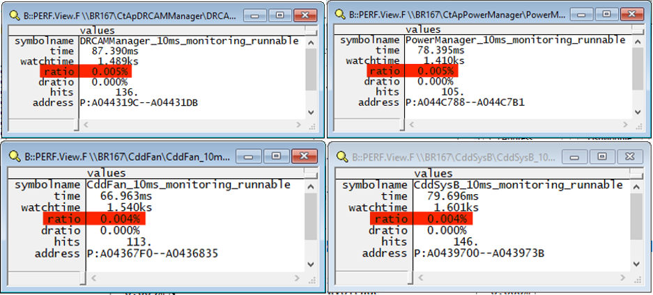
Image reference: doc_image_006.png

Figure : Performance measurement of current monitoring runnables

DRCAMManager: 0.005%

PowerManager: 0.005%

CddFan: 0.004%

CddSysB: 0.004%

Average CPU usage of a monitoring runnable: 0.0045%

Total CPU usage of monitoring function: 0.018%

Success criteria: CPU performance usage for monitoring function does not exceed 0.01% and is not significantly increased by adding monitoring feature for more SWCs.

Execution Time Variability (Functional requirement, Reliability)

Scenario: Monitoring runnables with varying execution times can cause unpredictable system behavior. In the current design, monitoring runnables execute spaced out, interleaved with other runnables, so monitoring and issuing corresponding actions can be interrupted by higher priority tasks. If a critical runnable that processes sensor data takes longer than expected or suspends the system, it can delay or cancel the execution of the remaining monitoring runnable, resulting in a large total monitoring time or device operating incorrectly. This causes subsequent runnables to miss their deadlines, leading to failure to meet functional requirement and system instability. The following figure shows the system cases to indicate the unstable operation of monitoring function.

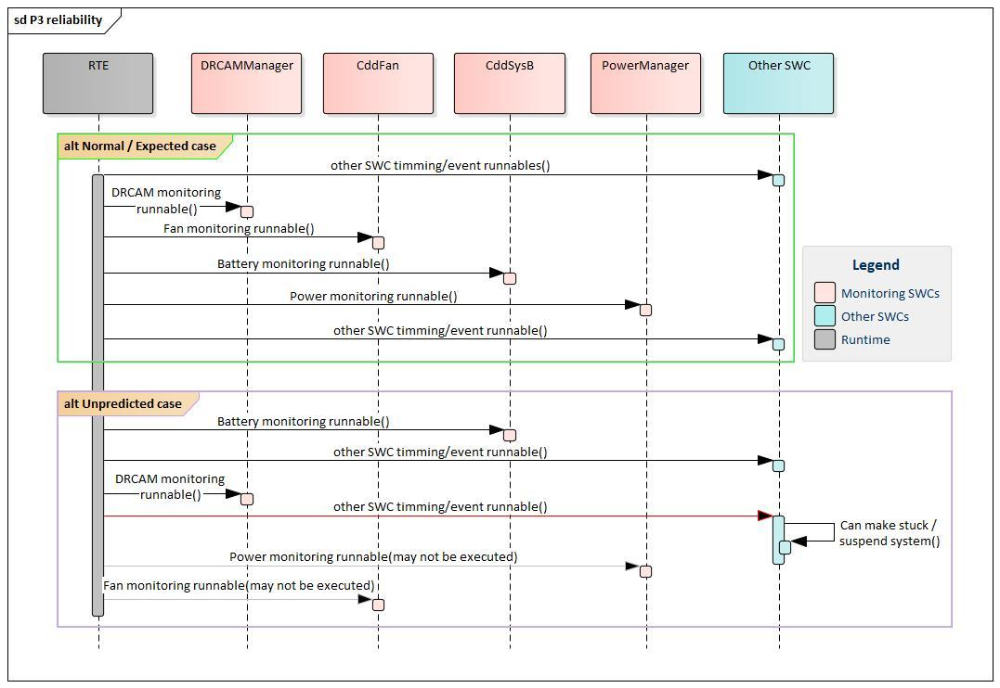
Image reference: doc_image_007.jpg

Figure : Current design activity scenarios

In unpredicted case, suppose when the communication mode is “no communication” and the system needs to shut down all devices, the system schedules the runnables as the line below. After running the CddFan runnable, all the cooling fans are turned off, but then the operation of the "Suspend runnable" takes a long time or make the system stuck, the runnables of PowerM and DRCAM are not activated to turn off the monitor and the driver's camera. It would be very dangerous if those high-power devices were to operate without cooling fans, they would quickly heat up and cause damage.

Measurement: Notice logs are put into each runnable when communication mode changes from “full communication” to “no communication”. Capture log of 2-time event are show as below:

Image reference: doc_image_008.png

Figure : Measurement log of SWC processing times in current design

The total execution time of the monitoring feature in the sampling times has a large deviation.

The execution order of SWCs to control the devices is different between measurements.

This means that communication monitoring feature do not work reliably because they are fragmented, other runnables can interfere with the monitoring process.

Success criteria: The communication monitoring feature is guaranteed to operate reliably by keeping the total monitoring and processing time almost stable across situations.

Ineffective implementation (Maintainability, Reusability)

Scenario: When a new component wants to monitor communication status, it must implement its own monitoring function itself.

If getting communication mode interface is changed, it must be updated in all monitoring software components.

Measurement: Here are the steps to implement monitoring with a software component, they are performed repeatedly with many software components.

	Step 1: Study about communication mode and how to monitor it. (3 days)

Step 2: Create a port and connect with COM interface to get communication mode. (1 days)

Step 3: Create a timing runnable for monitoring SWC to monitor the mode continuously. (1 days)

Step 4: Implement monitoring logic. (2 days)

Step 5: Implement corresponding action logic. (3 days)

If an engineer performs all steps repeatedly, there will be no problem because they are familiar, it only takes within 1 week for each SWC, but each software component has different implementation and operations, and is often in charge of separate engineers, so it can take each engineer 2 weeks to develop this function. Especially, in step 2 and 3, we must use Davinci Configuration Tool to config and generate source code, engineers will not be able to perform in an unlicensed environment.

Success criteria: Implement effectively without repeating the same steps. Easy and saving costs on maintenance.

Conclude:

These specific scenarios and measurements demonstrate the current design can lead to significant issues that violate quality attributes and functional requirement. Especially important quality attribute with classic AUTOSAR systems such as performance and reliability. To effectively address the technical constraints associated with the current design of the communication monitoring function, a new design should be considered to meet functional requirement and improve performance and reliability. Besides, the design needs to keep modularity and reusability attribute.

3: Architecture Alternatives

This section provides proposals to solve the problem and two architecture alternatives for it.

3.1: Common solution

The previous section has identified three major issues with the current design:

Resource wastage due to the excessive use of timing runnables.

Unreliable functionality resulting from varying processing times of devices within a monitoring cycle.

High deployment costs.

Recognizing that the monitoring and processing steps are identical, with only the device-specific logic differing. A common solution is to commonization for communication monitoring functionality for all SWCs, centralize the monitoring and execute device control actions within a single process.

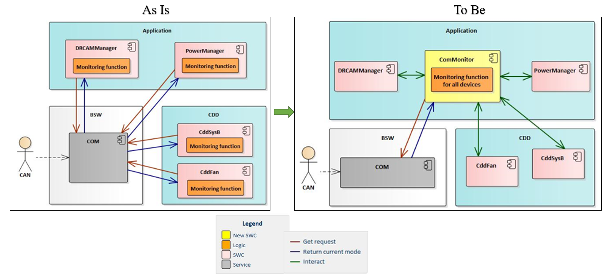
Image reference: doc_image_009.png

Figure : Common solution diagram

This will cause benifits:

Reduction in the number of timing runnables, thereby improving overall system performance.

The processing actions will be executed sequentially without interruption from other running functions, resulting in stable system operation and avoiding unpredictable scenarios.

Standardization will also reduce deployment costs.

Based on that solution idea, alternative designs will be outlined below along with their pros and cons.

3.2: Proposal 1 – Directly Processing within ComMonitor

In this approach, a single Software Component (SWC) is responsible for handling all the processing tasks. This SWC contains one runnable that directly processes all the required functionalities.

This architecture design proposes to add a new component, ComMonitor, it monitors communication mode from COM service and performs all control logic and corresponding actions when status changed.

All logic for monitoring and controlling devices will be implemented within ComMonitor.

With some device’s requirement, more conditions are considered for control than just the communication mode, so interfaces with functional components are needed to get other conditions.

Image reference: doc_image_010.jpg

Figure 10: Component and connecter view of proposal 1

Sequence of operations:

ComMonitor requests and receives communication mode from COM service.

If the status changed:

ComMonitor requests and receives information data from DRCAMManager.

ComMonitor handles logic with DRCAM data and current communication status

ComMonitor controls device.

Continue to perform similar steps from 2.1 to 2.3 for remaining components.

Advantages:

Reduced Scheduling Overhead: With only one timing runnable, the scheduling overhead is minimized, leading to more efficient use of CPU cycles.

Reduce Processing Time: Using only single runnable to monitoring and do not repeat the same operation so it improves performance than current design.

Maintainability: Managing a single runnable is simpler and reduces the complexity of the system.

Improved Predictability: The execution flow is more predictable as all tasks are handled within a single context.

Disadvantages:

Error Propagation: Errors in one task can propagate and affect the execution of other tasks within the same runnable and the system's functionality.

Modularity: ComMonitor owner needs to know logic of all other components to control device. Hard to maintain and reuse because the logic relates to many components.

Testability: Handling errors within a single runnable can be more complex, as it needs to manage multiple tasks. Difficult to test an individual feature or device.

Resource Contention: ComMonitor needs to access data of other components to handle multiple tasks within a single runnable. It can lead to resource contention, especially if tasks require access to shared resources.

3.3: Proposal 2 – Delegating Tasks to Individual SWC

In this approach, a single SWC contains one runnable that delegates specific tasks to individual SWC. Each task is handled by a separate runnable, which is invoked by the main runnable.

This architecture design proposes to add a new component, ComMonitor, it monitors communication mode from COM service. When status changed, ComMonitor call RTE interfaces to trigger server runnables of functional components to handle event.

The handling server runnables will perform logic and corresponding actions to control devices. Port interface between ComMonitor and another component is client (ComMonitor) - server (other component).

Image reference: doc_image_011.jpg

Figure 11: Component and connecter view of proposal 2

Sequence of operations:

ComMonitor requests and receives communication mode from COM service.

If the status changed:

ComMonitor calls DRCAMManager handling runnable with current communication status via RTE.

DRCAMManager handling runnable trigger to perform logic and control device.

Continue to perform similar steps from 2.1 to 2.2 for remaining components.

Advantages:

Reduced Scheduling Overhead: With only one timing runnable, the scheduling overhead is minimized, leading to more efficient use of CPU cycles.

Reduce Processing Time: Using only single runnable to monitoring and do not repeat the same operation so it improves performance than current design.

Modularity: Each task is handled by a separate runnable, promoting modularity and easier maintenance.

Fault Isolation: Convenient to test an individual feature or device. Issues in one runnable do not necessarily affect the others, improving fault tolerance.

Scalability: The system can scale more easily by adding or modifying individual runnables without affecting the entire SWC and performance.

Disadvantages:

Complex Management: Managing multiple runnables can be more complex and requires careful coordination. The main runnable needs to invoke and manage multiple runnables, the delegation process can potentially be faulty or latency.

Complex implementation: Needing to create many interfaces with other components to trigger runnables. Another component implementation depends on ComMonitor.

4: Comparison and decision

This section compares current design architecture with two proposal designs according to quality attribute criteria. From that, understanding the differences and potential issues associated with these two approaches, we can make an informed decision based on the specific requirements and constraints of system.

Consider the table to see the comparison of the designs:

## Table
| Problem | Related QA | Current design | Proposal 1: Directly Processing within ComMonitor | Proposal 2: Delegating Tasks to Individual SWC |
| --- | --- | --- | --- | --- |
| Problem #1: CPU workload for scheduling and operating timing runnables of monitoring function. | Performance, Scalability | Low: High CPU workload due to use of many timing runnables, number of runnables corresponds to number of SWCs monitored (currently 4), CPU usage also increases as features expand. | High: Low CPU workload due to use only 1 timing runnable even when feature is extended. | High: Low CPU workload due to use only 1 timing runnable even when feature is extended. |
| Problem #2: Monitoring function is not interrupted or potentially faulty, ensure real-time system. | Reliability | Low: Unstable function, monitoring runnables with varying execution times may cause unpredictable system behavior. | Medium: Perform all actions at the same time when event is detected but error propagation and resource contention may affect functionality. | High: Perform all actions at the same time when event is detected. |
| Problem #3: Ability of the system to support changes and apply features to new scenarios and new projects. | Maintainability, Reusability | Low: Need to reimplement monitoring function for new components. The changes will affect many places. | High: Just implement the device control logic in ComMonitor, changes are simple because the code is centralized in one place. | High: Just implement the device handling runnable inside each functional SWC. Easy monitoring changes. |
| Classic AUTOSAR and project QA: Each component has its own function to manage a device | Modularity | High: Each component manages a function and device. | Low: ComMonitor handles all logic and controls many devices. | High: Each component manages a function and device. |
| Project QA: Simplicity of deploying the feature across the entire SWC | Simplicity (Convenience for understanding, learning the function) | Medium: Monitoring functions are implemented in many SWCs. | High: All monitoring function of all SWCs are implemented in a ComMonitor component. | Low: monitoring part is implemented in ComMonitor and actions are deployed in separate SWCs. |

Table : Architecture designs comparison

Comparison summary:

Overall, the two proposal designs resolve issues of the current design.

Proposal #1 Directly Processing within ComMonitor: This approach is more efficient in terms of management and implementation but may face reliability and modularity.

Proposal #2 Delegating Tasks to Individual SWC: This approach promotes modularity and reliability but may incur complexity of implementation and management.

To provide a more objective comparison between the two proposals, we will utilize a quantitative logic matrix as shown below. The criteria will be ranked and assigned a priority level. Each proposal's ability to meet these criteria will be scored from 1 to 5, and finally, the total score of each proposal will evaluate its overall fulfillment of the problem and requirements.

## Table
| Criteria | Priority | Satisfaction (Proposal 1) | Score (Proposal 1) | Satisfaction (Proposal 2) | Score (Proposal 2) |
| --- | --- | --- | --- | --- | --- |
| Problem 2 | 5 | 3 | 15 | 5 | 25 |
| Problem 1 | 4 | 5 | 20 | 4 | 16 |
| QA Modularity | 3 | 1 | 3 | 5 | 15 |
| Problem 3 | 2 | 5 | 10 | 4 | 8 |
| QA Simplicity | 1 | 5 | 5 | 1 | 1 |
| Total Score |  |  | 53 |  | 65 |

Table : Quantitative logic matrix to compare 2 proposals

Decision:

Proposal #2 (65/75) has a higher score than proposal #1 (53/75). This demonstrates the ability to better meet all requirements.

So, proposal #2 is selected as the better solution.

Addition, there are little hardware dependencies and scope change when modify system functions in proposal #2, this is characteristic of classic AUTOSAR architecture.

5: Implementation and verification

This section shows implementation and defines verification criteria that can determine success and failure of the proposed solutions and ensure that they meet the specified requirements.

5.1: Implementation

Static view:

A new software component is added in application layer.

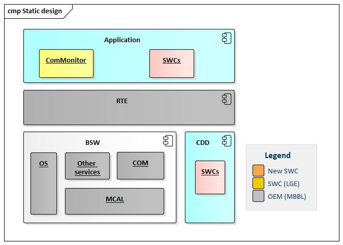
Image reference: doc_image_012.jpg

Figure : Static view of solution design

Dynamic view:

ComMoniter interface with COM service to getting status and with other component to call handling runnable

Image reference: doc_image_013.jpg

Figure : Dynamic view of solution design

Sequence diagram:

All activities of ComMonitor component work in 10ms timing runnable (loop every 10ms).

First, Commonitor request get current communication mode from COM service via RTE.

If the status changes, ComMonitor call interface to trigger handling runnable of other functional components.

Image reference: doc_image_014.jpg

Figure : Sequence diagram of solution design

5.2: Verification

Reduce Scheduling Overhead and workload of CPU

Proposed solutions use 1 runnable to monitoring

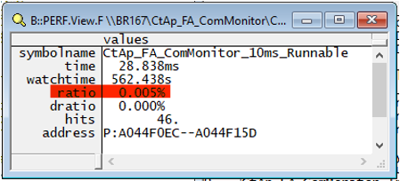
Image reference: doc_image_015.png

Figure : CPU usage of solution design

Total CPU usage of monitoring function: 0.005%

The proposed solution reduces 0.013% CPU usage (3.6x reduction) and improves 72.22% performance over current design.

Although performs control logic of many devices in a runnable, it doesn’t take CPU usage increase too much (0.005% compared to 0.004%). So, if more components are to be monitored, CPU performance is not affected, ensuring scalability.

The proposed solution only takes 0.005% CPU usage, doesn’t exceed 0.01%, so it passes criteria of problem 1.

Resolve varying execution times, ensue reliability

The logs are put in monitoring timing runnable of ComMonitor when communication mode changed events are detected and put in handler runnables of each monitoring SWC. The execution time of the SWCs' device control actions in the two events is shown below.

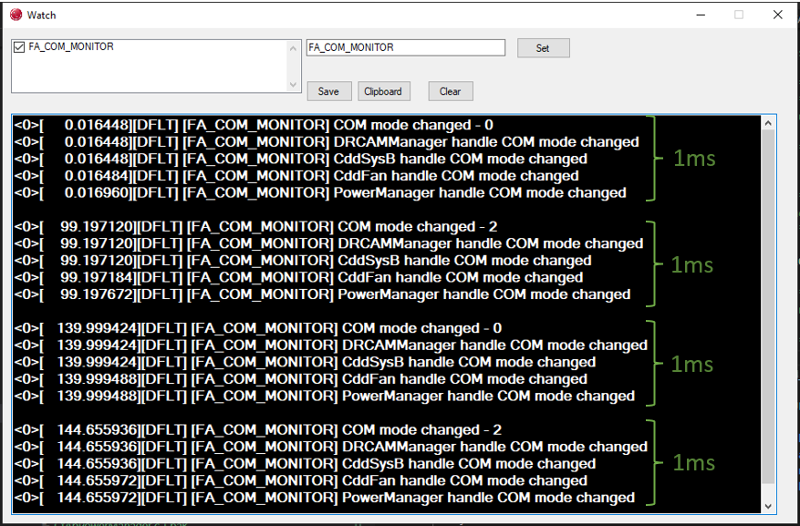
Image reference: doc_image_016.png

Figure : Measurement log of SWC processing times in solution design

In the proposed solution, processing times are very close together, it only takes approximately 1 millisecond for monitoring and handling, this time and processing device order are stable across scenarios. The actions are performed immediately when COM mode changes.

In unpredicted cases, suspend (stuck, delay) runnable can only take place before or after the monitoring process.

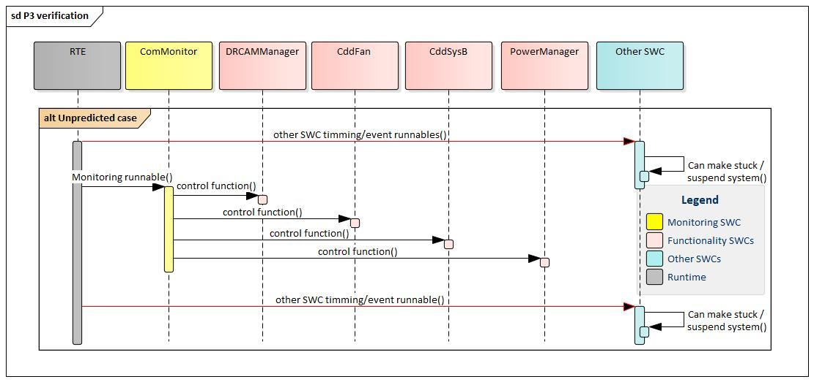
Image reference: doc_image_017.jpg

Figure : Sequence diagram of unpredicted case in solution design

There will be no more asynchronous situations between devices like turning off the fan but not turning off the camera and so on. Thereby ensuring system operating in all cases

The varying execution times problem has been resolved because device control actions are performed consecutively, so it passes criteria of problem 2.

Low-cost for feature expansion and maintenance

With the proposed solution, new monitoring components only need to implement their control logic in its source, no need to implement monitoring features. Especially, no need for additional timing runnable. Reducing the implementation of steps 1 to 4.

When maintaining, Changes in the monitoring part, such as the communication mode-getting interface, are made quickly in the ComMonitor component, while changes in the action logic are made in the functional components themselves. Debugging capabilities are also improved because individual components can be tested.

Proposed solution improves implementation and maintenance effort, so it passes criteria of problem 3.

6: Conclusion

Conclusion:

The commonization of communication monitoring functions has resolved 3 problems of current design, successfully achieved implementation cost savings and improved performance, reliability efficiency. The standardized components have streamlined processes and reduced redundancy.

Reflections:

While the project has achieved some performance improvements by reducing the number of timing runnables for the system, there are still more obvious improvements such as increasing the number of CPU cores, in which case a high number of timing runnables is not an issue.

Areas for Improvement:

Similar classic AUTOSAR systems suffer from the problem of executing too many timing runnables.

Similar features are implemented in multiple SWCs and can be commonized or centralized.

Can also be applied to monitor other signals or trigger multiple SWC tasks which are in the same condition by a component.

Functional requirements are event triggered.

Future Plans:

Expand the commonization scope for other features.
