# Raw Slide Content

- Source file: FA_hieu5.nguyen/CRP_COM_monitoring_commonization_v2.2.pptx
- Total slides: 17

## Slide 1

Design of commonization for
Communication Monitoring function

Author: Nguyen Trung Hieu – hieu5.nguyen
Mentor: 황보상규 - sangkyu.hwangbo

## Slide 2

Table of Contents

Overview
Problem Identification
Architecture Design Proposals
Comparison and decision
Q&A
Appendix

## Slide 3

1. Overview

MB_BR167M2_ICD project has Classic AUTOSAR architecture. It manages displays and controls many devices: driver camera, radiator fan, power, battery,…

Nonfunctional requirements - Key quality attributes:

### Table
| QA ID | Quality Attribute | Priority | Description |
| QA.01 | Performance | High | Response of the system to performing certain actions for a certain period. |
| QA.02 | Modularity | High | Divide functions and software into feasible unit modules (components). |
| QA.03 | Reliability | High | Ability to continue to operate under predefined conditions. |
| QA.04 | Maintainability | Medium | Ability of the system to support changes. |
| QA.05 | Scalability | Medium | Ability to handle load increases without decreasing performance. |
| QA.06 | Reusability | Low | A chance of using a component or system in other components/systems with small or no change. |
| QA.07 | Simplicity | Low | Developing the simplest design to realize a given requirement. |

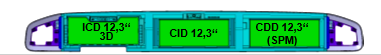
Image reference: slide_03_image_01.png

Image reference: slide_03_image_02.png

ICD: Instrument Cluster Display
CID: Center Information Display
CDD: Co-Driver Display

## Slide 4

1. Overview (continue)

Functional requirement:
The system need monitor communication-mode (com-mode) and perform corresponding actions to control devices when com-mode changes.

### Table
| Software component (SWC) | Action when mode changes to |  |
|  | FULL communication | NO communication |
| DRCAMManager | Turn on driver camera. | Turn off driver camera. |
| PowerManager | Perform Power Mode wake-up sequence | Perform Power Mode shutdown (Sleep) sequence |
| CddFan | Turn on all fans. | Turn off all fans. |
| CddSysB | N/A | Write Bus Active to NvM Block. |

Com-mode type:
Full communication: The vehicle bus status is active with Tx/Rx.
No communication: The vehicle bus status is idle.

Currently, there are 4 SWC perform monitoring feature as below:

Image reference: slide_04_image_01.png

## Slide 5

2. Problem Identification

1. Ineffective implementation (Reusability, Maintainability)
When a new component needs to monitor communication status, it must implement its own monitoring function, which takes approximately two weeks and duplicates part of the work of previous monitoring components.
Additionally, if the getting communication mode interface is changed, all monitoring components will need to be updated.

Problems arising from current design:

Image reference: slide_05_image_01.jpg

Monitoring function includes:
Monitor communication mode
Control the functional device

## Slide 6

2. Problem Identification (continue)

2. Waste of system resources
(Performance, Scalability)
CPU spends resources on scheduling and executing timing runnables.
Currently, 4 timing runnables used for monitoring consume 0.018% of CPU usage.
As the system scales, this resource waste will continue to increase.

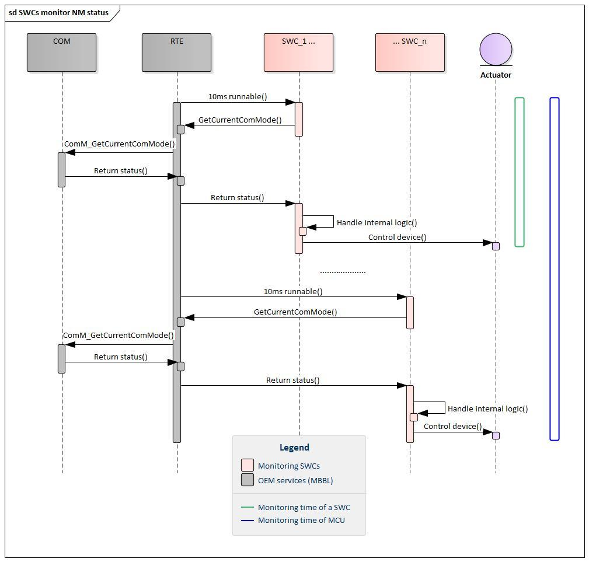
Image reference: slide_06_image_01.jpg

X-ms runnable:
Works like a timer ⏰
Trigger every X milliseconds of real time to execute a piece of code

## Slide 7

3. Execution Time Variability (Functional requirement, Reliability)
Monitoring runnables with varying execution times can lead to unpredictable system behavior.
Currently, monitoring runnables execute spaced out, interleaved with other runnables. As a result, monitoring and taking corresponding actions can be interrupted by higher priority tasks.

→ Improve Performance, Maintainability, Reusability, Scalability and Reliability.
→ Keep Modularity.

2. Problem Identification (continue)

In unpredicted cases, monitoring feature maybe suspend by any runnable, leading to failure to meet functional requirement and system instability.

Image reference: slide_07_image_01.jpg

## Slide 8

How to resolve the problem

3. Architecture Design Proposals

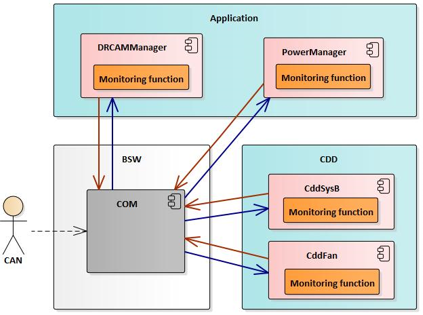
Image reference: slide_08_image_01.png

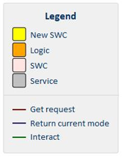
Image reference: slide_08_image_02.png

Image reference: slide_08_image_03.png

Monitoring and processing steps are identical, with only the device-specific logic differing.

As Is

To Be

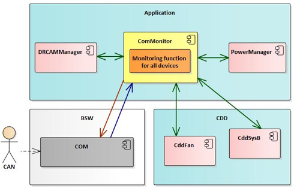
Image reference: slide_08_image_04.png

→ A common solution is to commonization for communication monitoring functionality for all SWCs, centralize the monitoring and execute device control actions within a single process.

## Slide 9

3. Architecture Design Proposals (continue)

Proposal 1 – Directly Processing within ComMonitor
A single Software Component, ComMonitor, is responsible for handling all the processing tasks. This SWC contains one runnable that directly processes all the required functionalities.

Advantages:
Reduced Scheduling Overhead of OS: one timing runnable
Reduce Total Processing Time: don’t repeat the same operation
Maintainability: a single runnable reduces the complexity of the system, improved Predictability
Disadvantages:
Error Propagation: one task can propagate and affect the execution of other tasks
Modularity: logic relates to many components

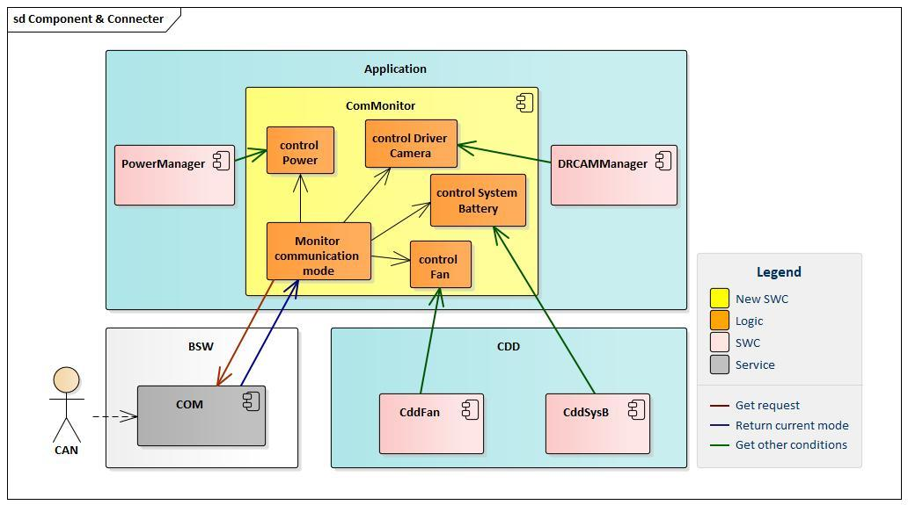
Image reference: slide_09_image_01.jpg

## Slide 10

3. Architecture Design Proposals (continue)

Proposal 2: Delegating Tasks to Individual SWC
A single SWC contains one timing runnable that monitors com-mode and delegates specific tasks to individual SWC. Each task is handled by a separate handling function in each functional SWC, which is invoked by the main runnable.

Advantages:
Reduced Scheduling Overhead of OS: one timing runnable
Reduce Processing Time: don’t repeat the same operation
Modularity: each task is handled by a separate runnable of functional components.
Scalability: easily by adding or modifying individual monitoring SWC without affecting the entire SWC
Disadvantages:
Complex Management: multiple handling runnables, interfaces, requires careful coordination.

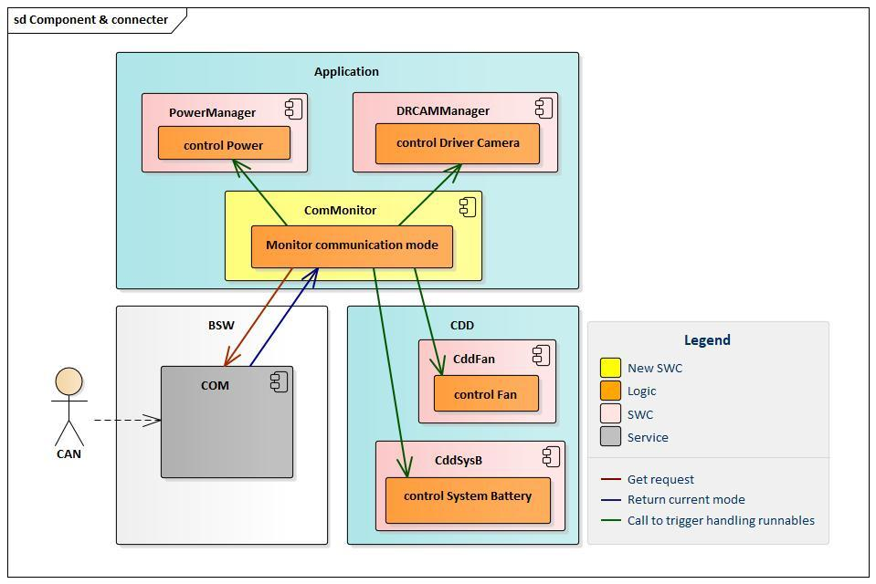
Image reference: slide_10_image_01.jpg

## Slide 11

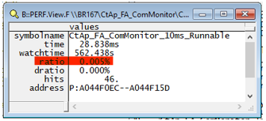
Image reference: slide_11_image_01.png

Image reference: slide_11_image_02.png

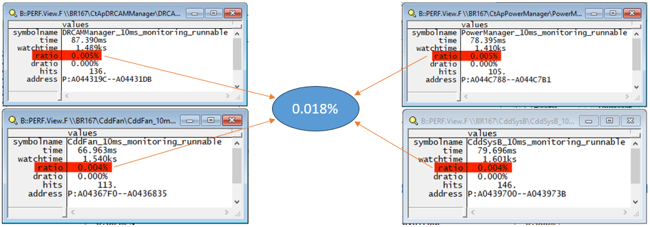
Image reference: slide_11_image_03.png

Image reference: slide_11_image_04.png

4. Comparison and decision

Proposal #2 Delegating Tasks to Individual SWC is selected as the better solution

2 proposals solve the current problems.
Proposal 1 has advantage of simplicity while proposal 2 has modularity, but modularity QA has higher priority.

### Table
| Problem | Related QA | Verification criteria | Current design | Proposal 1: Directly Processing within ComMonitor | Proposal 2: Delegating Tasks to Individual SWC |

### Table
| P2: CPU workload for scheduling and operating timing runnables. | QA.01 Performance QA.05 Scalability | Optimize the number of timing runnable running within 10ms | Low: currently 4, ~0.018% CPU usage and still increasing | High: always 1, ~0.005% CPU usage, 3.6x reduction | High: always 1, ~0.005% CPU usage, 3.6x reduction |

### Table
| P1: Ability to support changes and apply features to new scenarios and new projects | QA.04 Maintainability QA.06 Reusability | Effort when performing | Low: ~2 weeks | High: ~1 weeks | High: ~1 weeks |

### Table
| Each component has its own function to manage a device | QA.02 Modularity | Is each device controlled by a single component? | High: Yes | Low: No | High: Yes |

### Table
| Simplicity of deploying the feature across the entire SWC | QA.07 Simplicity | Convenience for understanding, learning the function | Medium | High | Low |

### Table
| P3: Monitoring function is not interrupted or potentially faulty, ensure real-time system | QA.03 Reliability | Total monitoring and handling time | Low: Not fixed, unstable | Medium: stable but potential error propagation | High: stable |

## Slide 12

4. Comparison and decision (continue)

Verification of chosen design:

Ineffective implementation (Reusability, Maintainability)
Eliminate code duplication with monitoring

2. Waste of system resources (Performance, Scalability)
Always use only 1 timing runnable

3. Execution Time Variability (Functional requirement, Reliability)
Total execution time and device control order are always fixed.
Because all device control actions are performed in the main runnable, no other runnable can intervene.

Image reference: slide_12_image_01.jpg

In unpredicted case, suspend (stuck, delay) runnable can only take place before or after the monitoring process.
There will be no more asynchronous situations between devices like turning off the fan but not turning off the camera and so on.
Thereby ensuring system operating in all cases

## Slide 13

Q&A
Thank you for listening!

## Slide 14

Appendix - Architecture Diagram

Static view

Dynamic view

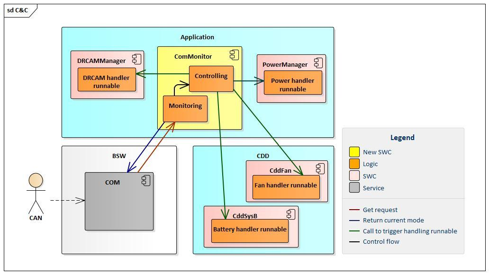
Image reference: slide_14_image_01.jpg

Image reference: slide_14_image_02.jpg

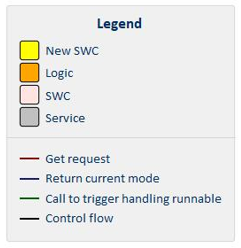
Image reference: slide_14_image_03.png

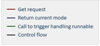
Image reference: slide_14_image_04.png

## Slide 15

Appendix - Architecture Diagram (continue)

Sequence diagram - Loop every 10ms:
1. Commonitor request get current communication mode from COM service via RTE.
2. If the status changes, ComMonitor call interface to trigger handling runnable of other functional components.

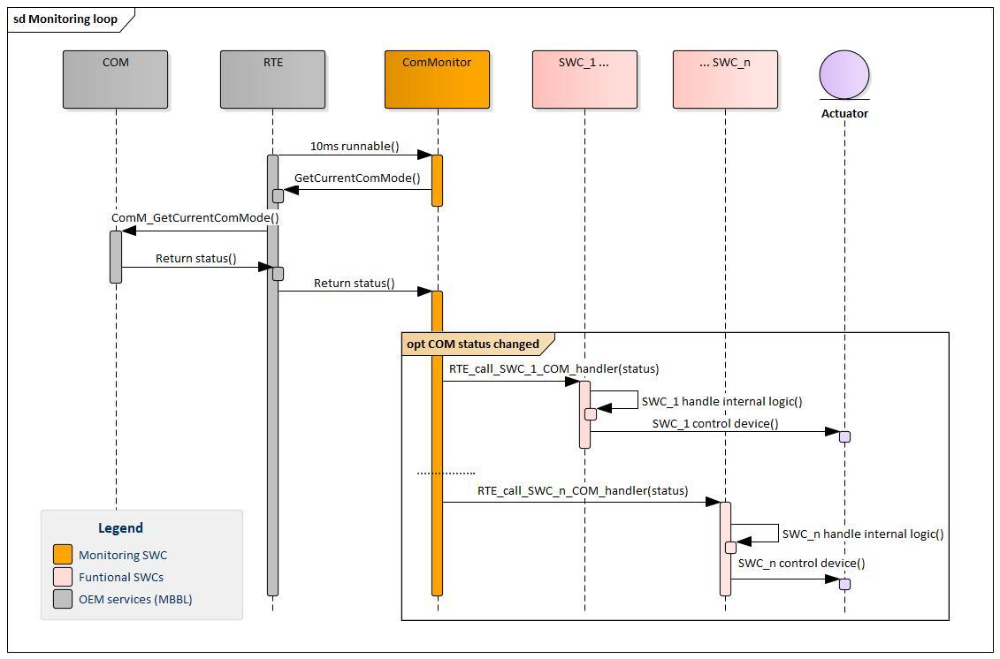
Image reference: slide_15_image_01.jpg

## Slide 16

Appendix - Verification

Total CPU usage of monitoring function: 0.005%

Total CPU usage of monitoring function: 0.018%

Proposal design

Image reference: slide_16_image_01.png

Current design

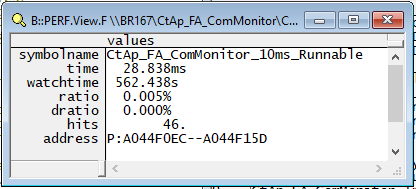
Image reference: slide_16_image_02.png

Reduce CPU usage by 3.6 times

## Slide 17

Appendix - Verification

Current design - Vary Execution Time

Proposal design - Stable Execution Time

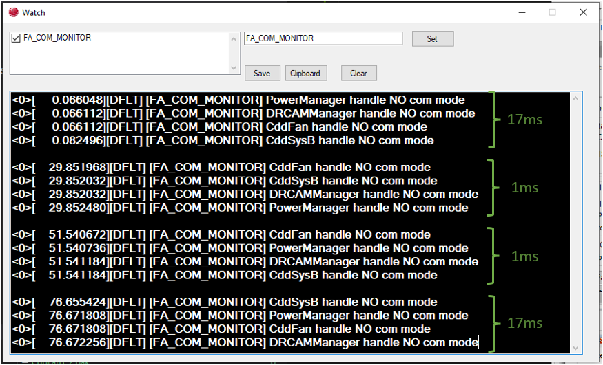
Image reference: slide_17_image_01.png

Image reference: slide_17_image_02.png

Total execution time is unstable.
The order of execution is not fixed.

Total time and execution order are stable

