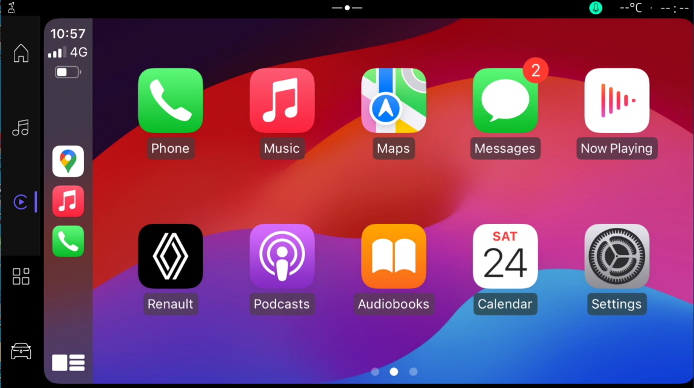
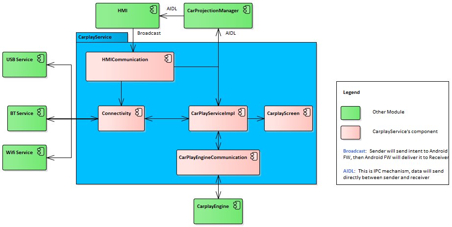
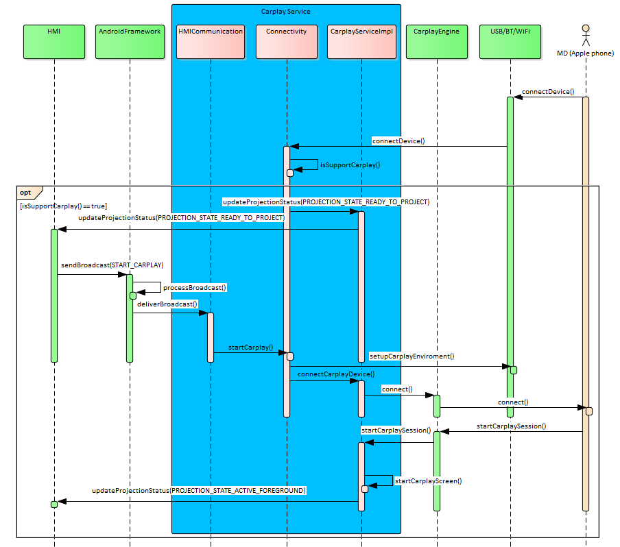
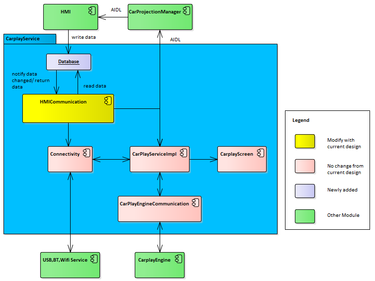
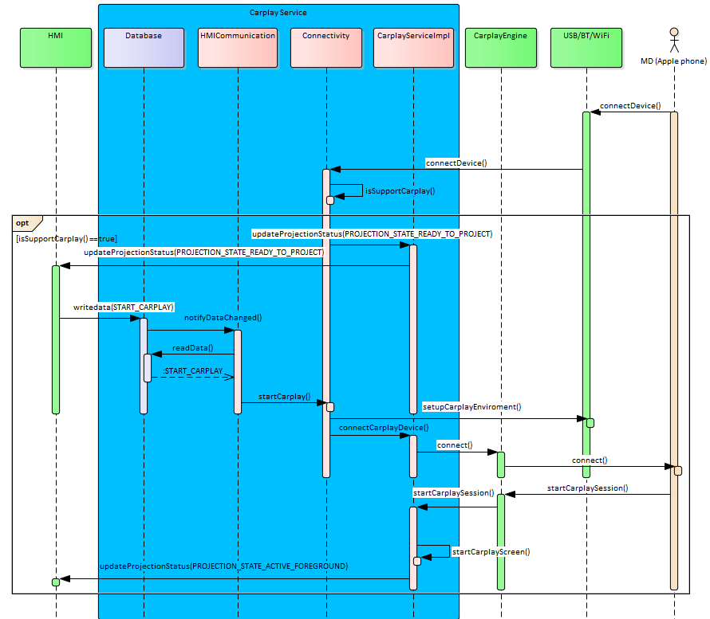
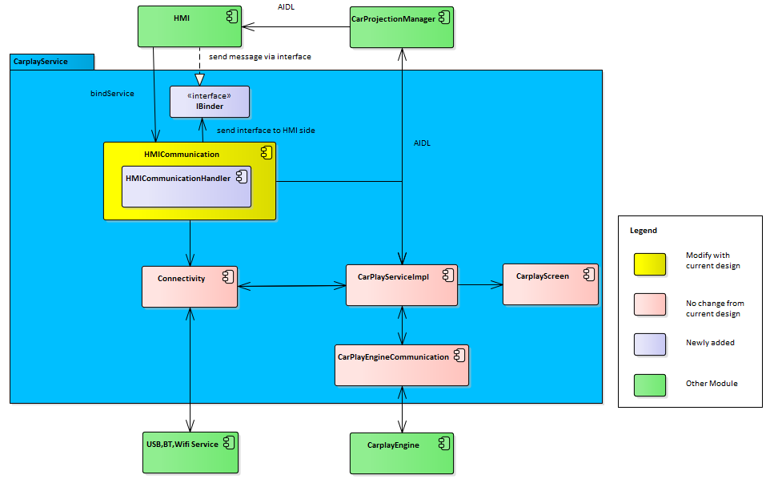
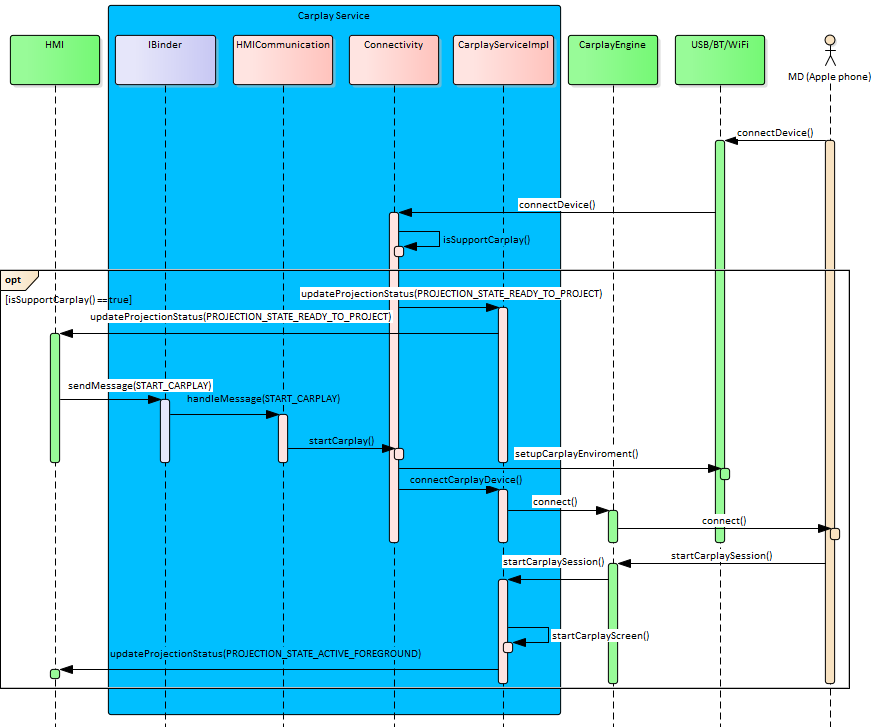
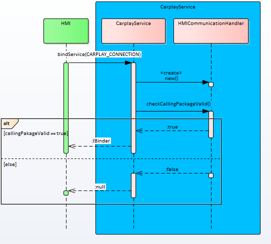
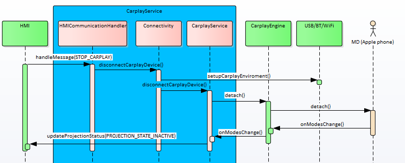
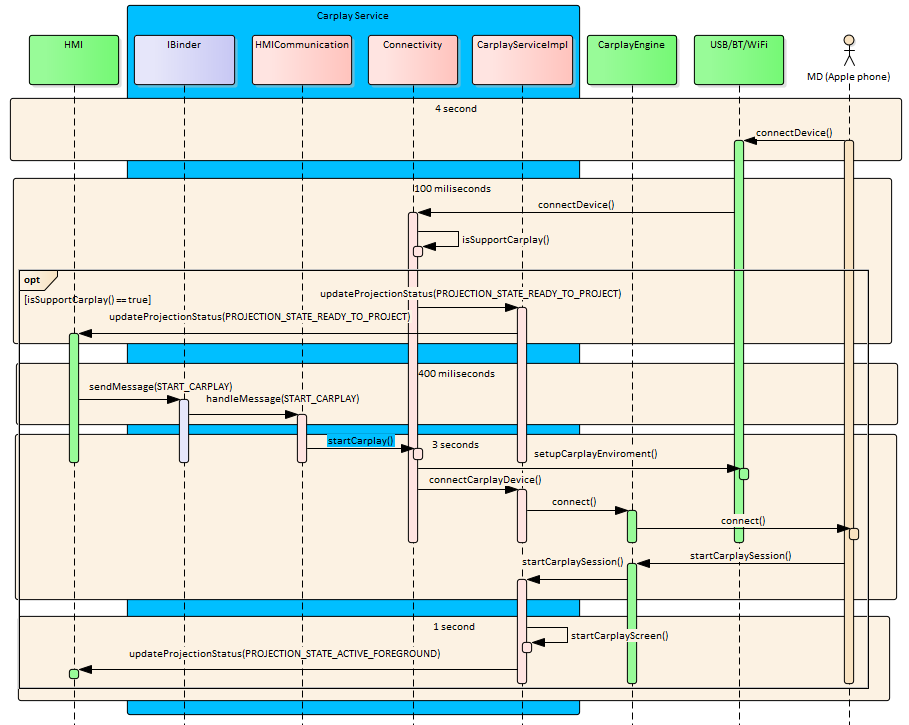

# Raw Document Content

- Source file: FA_hoan.tran/FA_hoan.tran/Carplay service design document v0.7.docx

About This Document

Document Information

## Table
| Issuing authority | Phone Projection Unit |
| --- | --- |
| Configuration ID | Carplay |
| Status of document | In-progress |

s

Revision History

## Table
| Version | Date | Notes | Author | Approval |
| --- | --- | --- | --- | --- |
| 0.1 | 2024.08.1 | Initial Release | Hoan Ngoc Tran |  |
| 0.2 | 2024.08.16 | Update exist section, add design proposal, static design. | Hoan Ngoc Tran |  |
| 0.3 | 2024.08.30 | Update exist section, add dynamic design. | Hoan Ngoc Tran |  |
| 0.4 | 2024.09.23 | Update exist section, add verification results | Hoan Ngoc Tran |  |
| 0.5 | 2024.09.24 | Check typo error and update exist section | Hoan Ngoc Tran |  |
| 0.6 | 2024.09.25 | Update exist section, add architectural drivers | Hoan Ngoc Tran |  |
| 0.7 | 2024.09.27 | Update architectural drivers section | Hoan Ngoc Tran |  |

Purpose

This document specifies the software architectural design for the Carplay service.

This design document also serves as a guideline on how each software component in the system should be implemented and how the internal components/external processes should interact with each other.

Scope

This document provides information on connection handlers and outlines the functionalities of these classes to meet the requirements. It includes the following aspects:

SW Architectural representation

Sequence diagram for use case

Audience

The software architect responsible for assessing the software design.

Developers within the NISSAN DA2 Carplay team who will identify any inconsistencies between the design and the requirements.

Participants of the NISSAN DA2 project who want to understand the Carplay service’s architecture.

Related Documents

Abbreviations/Terms

## Table
| Abbreviation | Description |
| --- | --- |
| OEM | Original Equipment Manufacturer |
| HMI | Human-Machine Interface |
| PP | Phone Projection |
| CP | Carplay/Apple Carplay |
| BT | Bluetooth |
| AVN | Audio-Video Navigation |
| FR | Functional Requirement |
| QA | Quality Attribute |
| HU | Head Unit |
| OS | Operating System |
| AAOS | Android Automotive OS |
| SW | Software |
| Android FW | Android framework |
| HW | Hardware |

## Table
| Terms | Description |
| --- | --- |
| Technology | Can be understand as “technology in car”. In this document, it only refers to any applications and features that are compatible with car’s infotainment system |

Figures

Figure 1 Example of Carplay screen.	4

Figure 2 Overview of Carplay Service in AVN overall architecture	4

Figure 3 Context diagram of current design	5

Figure 4 Current start/reconnection Carplay	6

Figure 5 Current start/reconnection Carplay time	7

Figure 6 Dumpsys broadcast delay	8

Figure 7 Broadcast Mechanism	8

Figure 8 Proposal 1 – Communicate via Database Architecture	11

Figure 9 Start/reconnection Carplay sequence with communicate via database	12

Figure 10 Proposal 2 – Communicate via Binder Architecture	13

Figure 11 Start/reconnection Carplay sequence with communicate via Binder	14

Figure 12 Static Design of Carplay Service after apply Communicate via Binder design	16

Figure 13 Sequence Diagram of Handler Initialization	18

Figure 14 Sequence Diagram of start Carplay	19

Figure 15Sequence Diagram of stop Carplay	19

Figure 16 Carplay Reconnect Time after apply Coomunicate via Binder design	20

Tables

Table 1 Functional Requirement	9

Table 2 Quality Attributes	10

Table 3 Comparison between architectural designs	15

Table 4 Class descriptions in Communicate via Binder design	16

Project Overview

Image reference: doc_image_001.png

Figure 1 Example of Carplay screen.

Nowadays, automotive industry is a fast-growing and Phone projection application is played an important role in that development. The most typical is the Carplay application. It allowing the Iphone’s screen and functionalities to be mirrored or projected onto the car’s display projection is developed. Iphone is most popular smart phone in the world so Carplay also is a popular application. This is reason why it usually is mandatory feature of OEM.

Image reference: doc_image_002.PNG

Figure 2 Overview of Carplay Service in AVN overall architecture

To satisfy this feature with each OEM, Carplay Service is developed. This module will combine with Carplay Engine module to make a Carplay application. While Carplay Engine will wrapper Apple library and give common API, Carplay Service will communicate with HMI and implement specific requirement from OEM. Carplay Service not only satisfy all function but also performance of Carplay.

With Renault and Nissan project which is developed based on Android OS, we will see clearly performance problem. In Android OS, when device just boot up, all setup many thing and it also impact and make some function of Carplay Service will be slow operation. This is software problem and it occur with all HW of Renault and Nissan project. It will make poor user experiences and also can’t performance requirement of Carplay. So design of Carplay service should resolve this performance problem without high impact with exist function of Carplay.

Project Description

Basic Software Structure

In the context diagram in Figure 2, the Carplay Service box illustrates the major components that will involves in the process of start/disconnect Carplay with both wired and wireless case by user actions.

Image reference: doc_image_003.png

Figure 3 Context diagram of current design

Each component is explained as follows:

CarplayServiceImpl is main component of Carplay service. This component receive event from other then process and assign task to appropriate component. It trigger start CarplayScreen, assign communicate task with CarplayEngine via CarPlayEngineCommunication, is an intermediary object that helps transfer requests between Connectivity and CarplayEngine, communicate task with CarProjectionManager to update Carplay status or receive KeyEvent from Android framework and send it to Iphone via Carplay Engine.

Connectivity acts as a main class for Carplay connection (both wired and wireless case). It communicate with USB Service for start Carlpay wired and BTService, Wifi Service in Carplay wireless case. It prepare environment when device connect to HU then update state to CarplayServiceImpl. It will start/disconnect Carplay when receive request from HMI.

CarPlayEngineCommunication is used to communicate with Carplay Engine. It send request to from CarplayServiceImpl to Phone. In the other hand, it have responsible register callback to Engine to receive request/response from phone.

HMICommunication is used request from HMI side via broadcast.

CarplayScreen is used to display Carplay video data which is streamed from Phone.

Current start/reconnection Carplay sequence:

Image reference: doc_image_004.png

Figure 4 Current start/reconnection Carplay

Problems Identification

Carplay reconnection time after cold boot is too long

Now we will check current status of reconnect Carplay after cold boot.

Image reference: doc_image_005.png

Figure 5 Current start/reconnection Carplay time

We can see reconnection time after cold boot is 61 second. This is first problem with current design “Carplay reconnection time after cold boot is too long”

During reconnect Carplay process, Android framework take 53 seconds to process broadcast before send it to Carplay service. This step take longest time and it is root cause why Carplay reconnection time take long time.

Image reference: doc_image_006.PNG

Figure 6 Dumpsys broadcast delay

Additional, after checked dumpsys broadcast log. We can see broadcast is delay 53s414ms in AndroidFramework. We will clarify this issue more in the next section.

Carplay Service using broadcast mechanism which have perform poorly to receive message from HMI

Understand about Broadcast mechanism

Firstly, we need understand broadcast mechanism and its strengths, weaknesses.

Image reference: doc_image_007.png

Figure 7 Broadcast Mechanism

Step of send broadcast mechanism:

Step 1: Receiver will register to Android framework then Android FW will add it to receiver list in Android FW side.

Step 2: Application (Sender) will send broadcast by send intent to Android Framework.

Step 3: Intent will add to Broadcast queue in Android FW and will delivery in turn for receiver.

We can see broadcast is process with queue mechanism. Broadcast only sent to receiver when previous broadcast is sent to receiver. This mechanism is simple to use and understand. Now, I will show strengths and weaknesses.

Strength:

Simple for used. Sender only need send intent to Android FW and receiver only need register to Android FW

High flexibility: sender and receiver communicate by Intent so they won’t be impact if other have problem. If we need more receiver, sender don’t need change anything, receiver only register to Android FW

Weakness:

Almost process is handled by Android FW so Application can’t control if Android FW have any problem.

Android FW process broadcast for all application and broadcast is process with queue mechanism so it can be effected by other application. If previous broadcast or previous receiver process broadcast with long time, next broadcast need wait previous broadcast done and it will be delayed.

Impact of Broadcast mechanism to current design

From the Figure 5 and Figure 6 above, we will take a closer look at how the Carplay is reconnected. With Broadcast mechanism knowledge in 2.2.2.1 Understand about Broadcast mechanism section, we can understand why broadcast take 53 seconds in Android framework before it is sent to Carplay service.

When HU cold boot, many application will receive Boot_Complete broadcast to setup and some application take long time in this step. It will impact to subsequent broadcast including broadcast which is sent from HMI to Carplay service.

So this is why broadcast is sent from HMI to Carplay service is delayed. But this is limitation of Android Broadcast mechanism. This process is handled by Android Framework and we can’t do anything to improve it if we still using broadcast to send message from HMI to Carplay Service.

This is second problem with current design “Carplay Service using broadcast mechanism which have perform poorly to receive message from HMI”

Problem Summary

In conclusion, the issues identified in this section can be summarized as follows:

Carplay reconnection time after cold boot is too long

Carplay Service using broadcast mechanism which have perform poorly to receive message from HMI.

To tackle these difficulties, it need other communicate way between Carplay Service and HMI with better performance. The alternative solutions should improve the period Carplay session is started when HU is wake up.  It will help me easier to get Carplay certificate. It also improve user experience and product quality.

Architectural drivers

Functional Requirement

After we see performance problem of Carplay reconnection time after cold boot in previous section, we need improve it so I make some functional requirement for this project.

The requirement summary is described as below:

Table 1 Functional Requirement

## Table
| ID | Title | Description |
| --- | --- | --- |
| FR.001 | Start Carplay via wired (USB)/ wireless (BT/WiFi) | Carplay service should able to start Carplay via USB or wireless (BT/Wifi) then display Carplay screen |
| FR.002 | Communicate with HMI | Carplay Service should able to communicate with HMI to sync projection state to HMI and receive request from HMI. |
| FR.003 | Reconnect Carplay | If the device is available, the device shall be reconnected depending on OEM scenarios (USB re-attach, system boot, link-loss, …) |

Quality Attributes

Quality attributes, also known as non-functional requirements, are essential characteristics that focus on how well the system should perform its functions.

Table 2 Quality Attributes

## Table
| ID | Scenario | Quality Attribute | Priority |
| --- | --- | --- | --- |
| QA.001 | Carplay must be able to reconnect and display Carplay screen on the device within 10 seconds after system wake-up. | Performance | High |
| QA.002 | Carplay service must have ability prevent access and unwanted action from 3rd party application. | Security | Medium |
| QA.003 | Carplay service must have communication standard to communicate with other module without error or delay problem. | Interoperability | Low |

To release Carplay to produce in market, Carplay need receive Carplay certificate from Apple. They has very high requirements for product quality and one of most difficult quality is reconnection time from system wake-up. Carplay need meet this period not exceed 10 second. This period with current design seem difficult to meet this requirement so enhancement this quality attribute is necessary. With better performance, it will easier to get certificate, underscoring QA.001 also as the highest priorities.

Because Carplay service need communicate with HMI application during operation so it need provide API to HMI application can send request or message to Carplay service. So other 3rd party application also do like that. To avoid this problem occur, Carplay service need have ability prevent other 3rd party application can send request or message to Carplay then lead to unwanted actions happened. With current design, we already meet this quality attributes but we need consider it if design is changed for meet QA.001. Consequently, QA.002 can reasonably be assigned a medium priority level.

As mention is previous section, this problem occur because of limitation of broadcast mechanism which is a communication standard of Android. So if we change it, it should be replace by other communication standard. But this project we are focus to improve performance of Carplay reconnection time so QA.003 can be considered is low priority.

Constraints

We are make design for Carplay Serivce in Nissan DA2 project so design need suitable with current HW and OS (Android)s

Nissan DA2 HeadUnit HW

Android Platform

Architecture Design Proposal

The objective of this project is not only resolving the problems identified in the previous section but also aims to enhance the system to meet its requirements and quality attributes. Let's revisit two problems from section 2.2 Problems Identification and the highest-priority Quality Attribute (QA) in section 2.3 Architectural drivers

Problem:

Problem 1: Carplay reconnection time after cold boot is too long.

Problem 2: Carplay Service using broadcast mechanism which have perform poorlys to receive message from HMI.

Quality Attributes:

QA.001: Carplay must be able to reconnect and display Carplay screen on the device within ten seconds after system wake-up.

As previously analyzed, the current design with the HMICommunication using Broadcast to communicate between HMI and Carplay services so it isn’t stable and delay problem occur after HU wake-up. To improve this problem, we need use other communicate mechanism in Android OS and modify design to use it.

To improve this problem, the first solution is send message via database which will avoid impact by other application like broadcast so delay by other application problem can be resolved.

Communicate via Database Architecture

To HMI can send request or message to Carplay via database to avoid impact by other application. The first, we need create database then register observer to this database. We can add permission to this database to restrict other application only those application that have registered this permission can write to database. Then HMI will write request/ message to database whenever they want send them to Carplay service. After that, Carplay service will receive notification about database changed so we can access and read database to get request/message from HMI.

Image reference: doc_image_008.png

Figure 8 Proposal 1 – Communicate via Database Architecture

Start/reconnection Carplay sequence with proposal 1:

Image reference: doc_image_009.png

Figure 9 Start/reconnection Carplay sequence with communicate via database

In this design, we need a few hundred milliseconds to write and read data from database instead of 53 seconds with broadcast to receive message from HMI to Carplay service to delay problem when cold boot can be resolved.

Some advantage of the proposal 1:

Performance: With this design, HMI can send message to Carplay same with message in broadcast by send message to database. It will avoid impact by other application so performance when reconnect Carplay after cold boot will be improved.

However, there are some drawbacks to this approach:

Security: This design will export ContentProvider to HMI application for they can write data to data base. So other application also can write data to database if they know permission and database name then likelihood of malicious or unwanted action can be happened. This is difficult to detect message is sent by HMI or unwanted application to prevent malicious or unwanted action then operation of Carplay won’t stable. So this design have low security level.

Interoperability: send and receive message via database also isn’t communication standard. Message is send and receive base on feature of database management in Android platform. So it is not optimized for communicate. It require memory to store database. On other hand, it also require time to write and read data from database whenever HMI need send request/message to Carplay Service.

Communicate via Binder Architecture

As we mention in previous section, performance is improved but it have low security level. On other hand, it also isn’t Android communication standard so it isn’t optimized for communicate. So we can use other communication standard in Android is communicate via Binder. This is IPC mechanism in Android. It help 2 process can send and receive data directly. It will reduce write/read database time in proposal 1. Furthermore, it also support to get callingPackage to know which application is call to Carplay service to avoid malicious or unwanted action from unwanted application.

With Communicate via Binder, Android have 2 ways to implement.

Message Queue Handler: using IMessage interface of Android. Which can convert to IBinder to send to other process. This ways is simpler but it have limit about data is transferred and API is communicate between 2 processes.

AIDL: using custom interface which is write by AIDL which can convert to IBinder to send to other process. This ways more complicated but it can send more data and have custom API is communicate between 2 processes.

With current design, HMI only need send message to Carplay service so using Message Queue Handler will be better choice.

Image reference: doc_image_010.png

Figure 10 Proposal 2 – Communicate via Binder Architecture

Start/reconnection Carplay sequence with proposal 2:

Image reference: doc_image_011.png

Figure 11 Start/reconnection Carplay sequence with communicate via Binder

Some advantage of the proposal 2:

Performance: Carlay will receive data directly from HMI and it will improve current performance problem and it also have better performance than proposal 1 because it don’t need time to write/read data from database.

Security: Binder support to get callingPackage to know which application is call to Carplay service to avoid malicious or unwanted action from unwanted application. So this design have higher security level than proposal 1

Interoperability: This design using Binder which is support by Android for communicate between 2 processes so it is optimized and easy to communicate between HMI and Carplay service.

However, there are some drawbacks to this approach:

Design proposal 2 will make code more complicated than current design.

This design provide API for other application can request/send message so it also make also vulnerabilities that malware can access and perform unwanted actions if we implement not carefully.

Comparison and Architecture Decision

In this section, all designs are evaluated and compared using certain criteria. The analysis and advantages and disadvantages discussed in sections 3.1 and 3.2 are summarized in the table below. Based on these findings, the architecture decision was made to align the constraints and requirements at the beginning of this project.

Table 3 Comparison between architectural designs

## Table
| Criteria | Related QA | How to verify | Current Architecture | Communicate via Database Architecture | Communicate via Binder Architecture |
| --- | --- | --- | --- | --- | --- |
| Reconnection time | Performance | Evaluated by the period of time when the system perform certain action. | Low performance | Medium performance | High performance |
| Likelihood of malicious or accidental actions | Security | Measure the likelihood of malicious or unwanted action caused by 3rd party side. | High | Low | High |
| Communicate Standard | Interoperability | Measure the transmission ability of data with other external systems to integrate with third-party system. | Android Communication standard (via Broadcast) | Not communication standard | Android Communication standard (via Binder) |

The table clearly illustrates that there is no the best architectural design for every situation. Each design approach comes with its strengths and weaknesses, making its suitability dependent on specific project requirements. For instance, current design have high security and easy to communicate between HMI and Carplay service but it have low performance especially immediately after cold boot.

However, design proposal 2 have best performance but it make code more complicated. Ultimately, the architectural decision should be driven by the project's goals and requirements, with a clear understanding of the trade-offs associated with each design approach. Finally, "Communicate via Binder Architecture" aligns well with the objectives and fulfills the requirements effectively.

Detailed Architectural Design

Static Design

Below is the static diagram of the "Communicate via Binder Architecture" design. It involves the introduction of the IBinder and HMICommunicationHandler. IBinder is using to send data between 2 processes. We can send to HMI interface which can convert to IBinder to HMI. HMI will send message via this interface. Then HMICommunicationHandler will receive and handle this message.

Image reference: doc_image_012.png

Figure 12 Static Design of Carplay Service after apply Communicate via Binder design

The descriptions of each class are as following:

Table 4 Class descriptions in Communicate via Binder design

## Table
| Package | Name | Description | Notes |
| --- | --- | --- | --- |
| HMICommunicate (OEM depend) | HMICommunication Handler | Handler HMI message as Start_Carplay, Stop_Carplay,… | Newly added |
| HMICommunicate (OEM depend) | IBinder | It is used to make interface which declare the method need to communicate with HMI and it will be share to HMI side. It will implement by HMICommunicationHandler | Newly added |
| Connectivity(OEM depend) | Connector | Act as an adapter for Carplay connection, after receive start/stop Carplay request, this component will check it is Carplay wired/wireless then assign to appropriate component. Carplay wired will be assing to WiredConnector and Carplay wireless will be assign to BluetoothHandleService and WifiHandleService. | No change from current design |
| Connectivity(OEM depend) | WiredConnector | This class handler for Carplay wired tasks. It communicate with USB service to start/stop Carplay wired | No change from current design |
| Connectivity(OEM depend) | BluetoothHandlerService | This class handler for Carplay wireless tasks. It communicate with Bluetooth service to start Bluetooth Service via Rfcomm service. It is used to send Wifi information to phone before wifi is connected between phone and HU. | No change from current design |
| Connectivity(OEM depend) | WiFiHandlerService | This class handler for Carplay wireless tasks. It communicate with Wifi service to start/stop Carplay wired | No change from current design |
| Carplay service (can be shared to other OEM) | CarplayServiceImpl | This class receive event from other then process and assign task to appropriate component. It trigger start CarplayScreen, assign communicate task with CarplayEngine via CarPlayEngineCommunication | No change from current design |
| Carplay service (can be shared to other OEM) | ProjectionStatusUpdater | This class handle communicate with CarProjectionManager. This component will receive status from CarplayServiceImpl then send update projection to HMI side via CarProjectionManager | No change from current design |
| CarPlayEngine Communication (can be shared to other OEM) | iAP2Client | This class is used to communicate with iAP2 component in Carplay Engine | No change from current design |
| CarPlayEngine Communication (can be shared to other OEM) | CarplayClient | This class is used to communicate with Carplay framework component in Carplay Engine | No change from current design |
| CarplayScreen (can be shared to other OEM) | CarplayActivity | This class is used to display Carplay video data which is streamed from Phone. | No change from current design |

Dynamic Design

Sequence Diagram

Initialize Handler to Communication with HMI

Image reference: doc_image_013.PNG

Figure 13 Sequence Diagram of Handler Initialization

Start Carplay

Image reference: doc_image_014.PNG

Figure 14 Sequence Diagram of start Carplay

Disconnect Carplay by request from HMI.

Image reference: doc_image_015.PNG

Figure 15Sequence Diagram of stop Carplay

Verification Results

In this chapter, I take an evaluation of the “Communicate via Binder Architecture” design, using timer (can use timer in the CarPlay Tests App) to calculate Carplay reconnection time. They serve as reference points for evaluating the design's effectiveness in addressing the issues highlighted in 2.2.3 Problems Summary, and its ability to fulfill the highest-priority requirement outlined in 2.3.2 Quality Attributes

How to calculate Carplay reconnection time after cold boot

Precondition:

Step1: Connect Carplay

Step2: Turn off HU

Reproduce:

Step1: Turn on HU

Step2: When Home screen appear, start the timer.

Result:

Time when Carplay screen displayed.

Result after apply Communicate via Binder Architecture

Image reference: doc_image_016.png

Figure 16 Carplay Reconnect Time after apply Coomunicate via Binder design

We can see total Carplay reconnect time after cold boot is only about 9 second. It can meet QA.001 which require this period within 10 seconds. This result is achieved because we remove delay time of broadcast by replace Broadcast mechanism with Binder (IPC) mechanism in Android. In Figure 13, we also check CallingPackage when HMI application request bind to Carplay Service to ensure that haven't unwanted application can send request/message to Carplay Service so QA.002 also is achieved. This mechanism is supported by Android for communicate between 2 processes so I can conclude that we already meet all quality attributes which is mention in 2.3.2 Quality Attributes.

Lessons Learned

In this chapter, I sum up the valuable insights I've gained from my project. It’s like looking back on a journey and thinking about the important moments, the challenges I faced, and the things that went well. These lessons help me get better and make smarter choices in future projects, especially on the architectural point of view. So, here is what I’ve learned from my project’s experiences:

Recognizing the Value of Design Phase: Understanding the significance of the design phase and how it contributes to long-term project success.

Importance of Communication standard: Using suitable communication standard, it will help module communicate with other module easier and more effective.

Thoughtful Analysis: Critical thinking involves questioning assumptions, avoid jumping to conclusions, and considering various viewpoints. Relying on evidence and data for decision-making has significantly improved my problem-solving abilities.

Effective Collaboration and Communication: Collaborating effectively and maintaining open, constructive communication with my mentor have been invaluable. One of the key lessons learned is the value of being open to feedback and willing to accept constructive criticism. This helps in refining ideas and making continuous improvements.
