# Raw Slide Content

- Source file: FA_hoan.tran/FA_hoan.tran/Carplay service design presentation v0_7.pptx
- Total slides: 20

## Slide 1

Improve Carplay reconnection time after cold boot in Nissan project

By Hoan Ngoc Tran
Mentor: Jonghyuck Shin (신종혁)
LGEDV

## Slide 2

Table Content

Overview
Problem Identification
Architecture Design Proposals
Verification
Q&A

## Slide 3

1. Overview

The Carplay(CP) is an application which streaming application from Iphone to HU. It help driver focus and safety when driving.

Image reference: slide_03_image_01.png

The Carplay Service implement specific requirement from OEM.

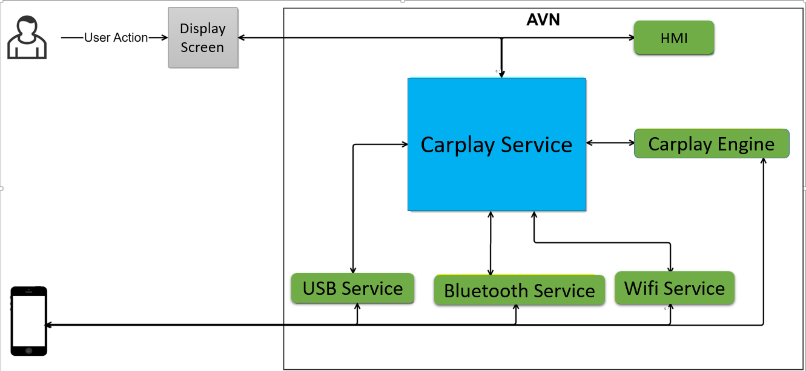
Image reference: slide_03_image_02.png

## Slide 4

2. Current Architecture & Problems

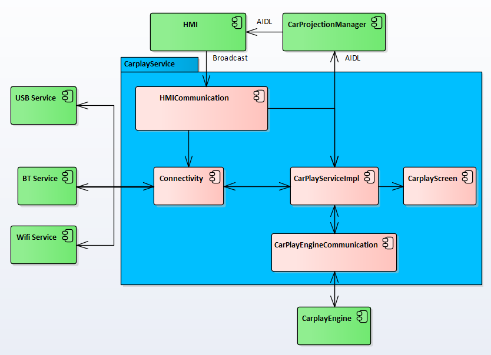
Image reference: slide_04_image_01.png

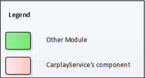
Image reference: slide_04_image_02.png

### Table
| Broadcast: Sender will send intent to Android FW, then Android FW will deliver it to Receiver AIDL: This is IPC mechanism, data will send directly between sender and receiver |

## Slide 5

2. Current Architecture & Problems

Current Carplay reconnection time after cold boot:
Total time : 61 second
Broadcast is delay in Android Framework: 53 second
This is process take too long time.

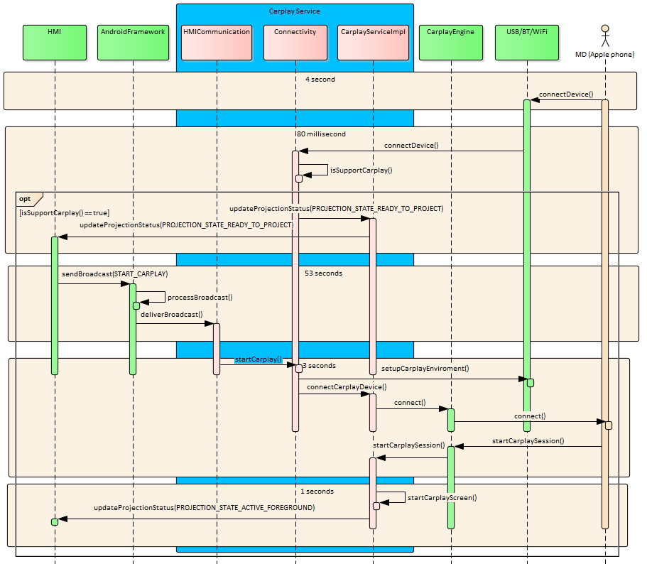
Image reference: slide_05_image_01.png

## Slide 6

2. Current Architecture & Problems

Why Broadcast take long time :
Android Framework handle broadcast for all apps in the system
It handle with queue mechanism so if one broadcast takes time, it affects the next one.
After cold boot, many apps receive boot broadcasts to set up so it impact to Carplay broadcast.
This is limitation of the Android platform

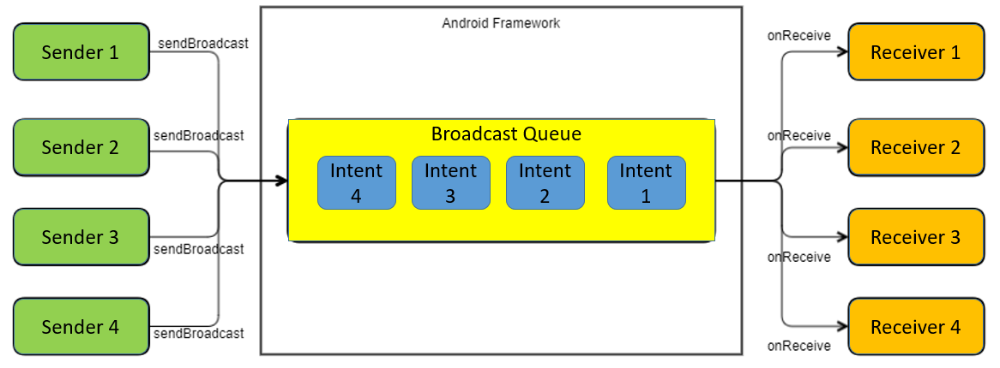
Image reference: slide_06_image_01.png

## Slide 7

2. Current Architecture & Problems

### Table
| Scenario | Quality Attribute |
| Carplay must be able to reconnect and display Carplay screen on the device within 10 seconds after system wake-up. | Performance |
| Carplay service must have ability prevent access and unwanted action from 3rd party application. | Security |
| Carplay service must have able to communication with other modules without any problem. | Interoperability |

Quality Attribute

## Slide 8

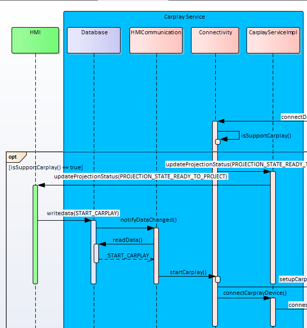
Image reference: slide_08_image_01.png

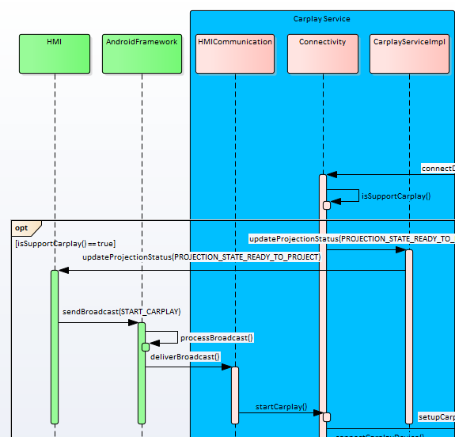
Image reference: slide_08_image_02.png

3. Architecture Design Proposals

Proposal 1: Communicate via Database Architecture

Current

Proposal 1

## Slide 9

3. Architecture Design Proposals

Proposal 1: Communicate via Database Architecture

Pros:
Performance: It will avoid impact by other application so it will have higher performance than current design

Cons:
Security: This design will export ContentProvider to HMI application  so it has low security level
Interoperability: have limitation when communicate with other module (HMI)

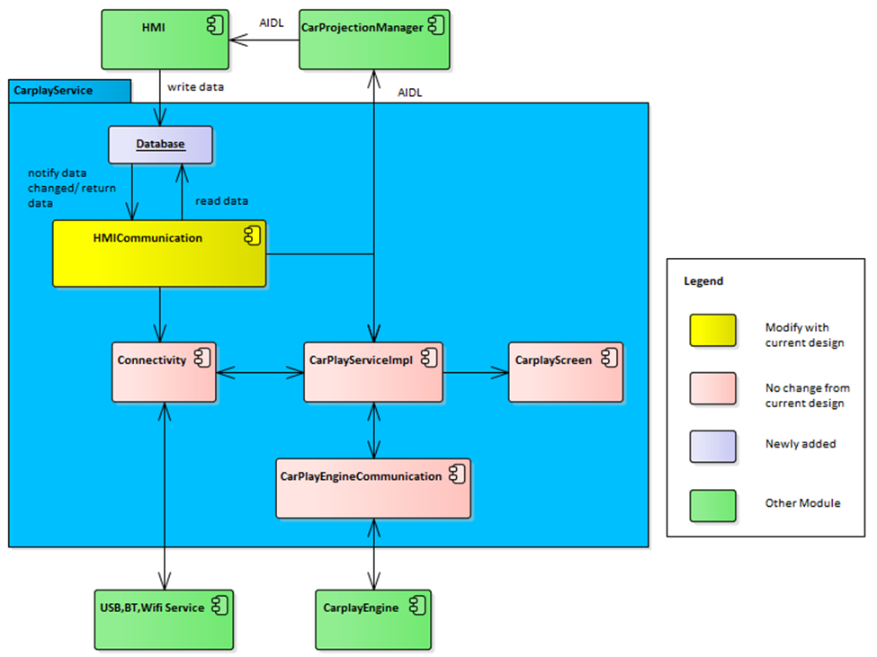
Image reference: slide_09_image_01.png

## Slide 10

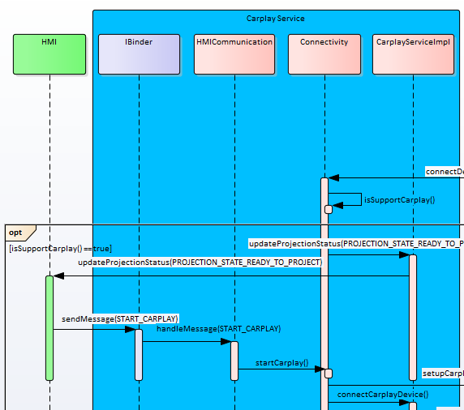
Image reference: slide_10_image_01.png

Image reference: slide_10_image_02.png

3. Architecture Design Proposals

Proposal 2: Communicate via Binder Architecture

Current

Proposal 2

## Slide 11

3. Architecture Design Proposals

Proposal 2:Communicate via Binder Architectures

Pros:
Performance: Carplay will receive data directly from HMI so it have higher performance than proposal 1
Security: Can know which app is communicating so it has higher security level
Interoperability: communicate with other module is optimized and easy to use

Cons:
Make code more complicated than current design.

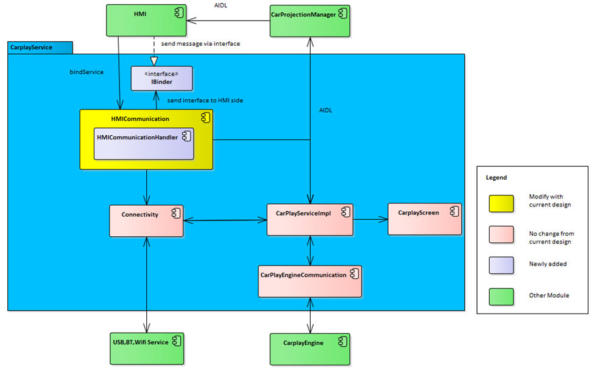
Image reference: slide_11_image_01.png

## Slide 12

3. Architecture Design Proposals

→ Architecture decision: Communicate via Binder Architecture

### Table
| Criteria | Related QA | How to verify | Current Architecture | Communicate via Database Architecture | Communicate via Binder Architecture |
| Reconnection time | Performance | Evaluated by the period of time when the system perform certain action. | Low performance | Medium performance | High performance |
| Likelihood of malicious or accidental actions | Security | Measure the likelihood of malicious or unwanted action caused by 3rd party side. | High | Low | High |
| Communicate Standard | Interoperability | Measure the transmission ability of data with other external systems to integrate with third-party system. | Simple to use and communicate well in normal condition | Have communication limitation | Communication is optimized and easy to use |

Comparison:

## Slide 13

3. Architecture Design Proposals

Detailed Architecture Design (Static Diagram) :

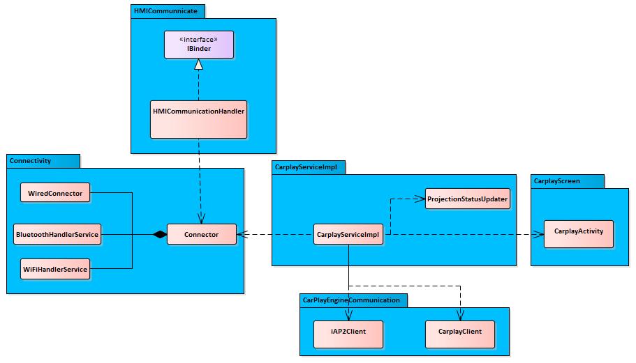
Image reference: slide_13_image_01.png

## Slide 14

4. Verification

After apply new design, period from HU wake up to Carplay is started:
Total time : 9 second
Almost haven’t delay time from update status is sent to message is received from HMI
Meet QA: Carplay must be able to reconnect and display Carplay screen on the device within 10 seconds after system wake-up.

Image reference: slide_14_image_01.png

## Slide 15

Q&A
Thank you for listening!

## Slide 16

Appendix

Initialize Handler to Communication with HMI

Image reference: slide_16_image_01.png

## Slide 17

Appendix

Start Carplay

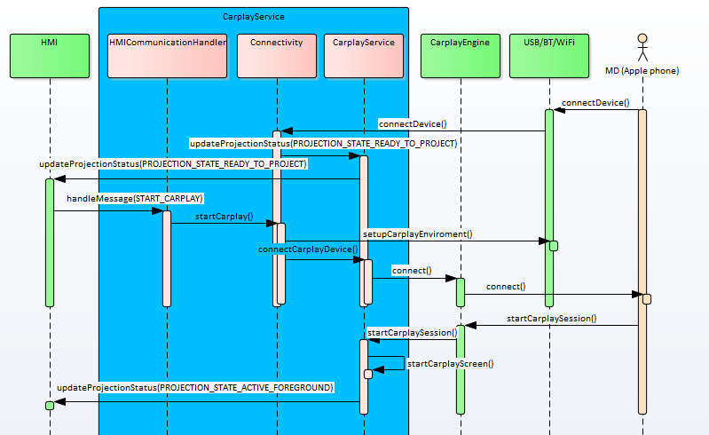
Image reference: slide_17_image_01.png

## Slide 18

Appendix

Disconnect Carplay by request from HMI

Image reference: slide_18_image_01.png

## Slide 19

Appendix

Broadcast dumpstate

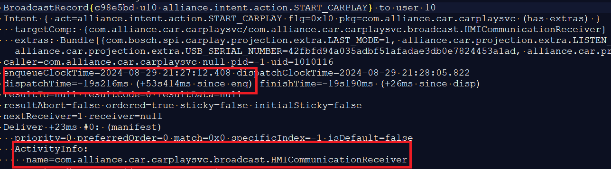
Image reference: slide_19_image_01.png

## Slide 20

Appendix

Refer other Android project

ER with Renault https://mficertificationhub.apple.com/product-plans/100826-877221/exception-requests/14A8962C-EBEE-4D02-99BE-36DBB0520CDA

Geely: HMI of Carplay is handle by LGE Carplay team so it have same process with Carplay so this problem not occur.

