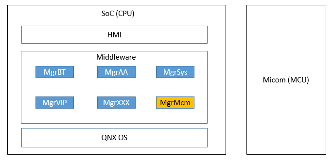
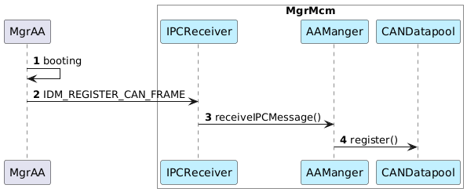
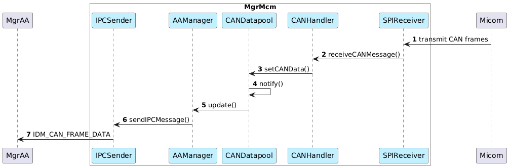

# Raw Document Content

- Source file: FA_hoang.cao/Architecture improvement for CAN dispatching function of Micom Manager.docx

Architecture improvement for CAN dispatching function of Micom Manager

Project overview

GM Info3.5 is an AVN project. The SW architecture is as below.

Image reference: doc_image_001.png

Figure 1 GM Info3.5 SW architecture

The Micom Manager (MgrMcm) is a module on the SoC side that provide the communication between SoC’s managers and Micom (CAN dispatching, Diagnostic, Calibration, …)

MgrMcm communicates with Micom via SPI, communicates with other managers using IPC messages.

This project will focus on CAN dispatching function where MgrMcm receive the CAN data from Micom and dispatch the data to other managers on SoC side.

Image reference: doc_image_002.png

Figure 2 CAN dispatching function

Problem identification

The current design of CAN dispatching function is very simple.

Image reference: doc_image_003.png

Figure 3 Current design

SPIReceiver reads SPI messages sent from Micom.

If it is the CAN data message, it is passed to CANHandler.

CANHandler maintains a fixed register list for each CAN frame based on request from other managers. It will send the CAN data to the managers which is in the register list.

But this design has some problems:

All the logic to handle CAN frames are included in 1 class CANHandler. With any change request, we need to modify CANHandler class and break the current logic. This makes it hard to modify/extend the function.

CANHandler class uses switch-case to handle CAN frames. Each CAN frame is handled and dispatched to different managers. So, CANHandler class need to work with many managers and the source code become more complicated. This makes it hard to understand and maintain.

So, the project’s goal is improve the current design to:

Separate the handle logic for each managers (maintainability).

Make it easy and clear when modify/extend the function (modifiability/extensibility).

Consider reuse capacity for future projects (reuseability).

Design proposals

To resolve the current design’s problems, 2 design proposal are proposed as below.

Proposal 1: Using Observer pattern

This design proposal is based on Observer pattern.

Image reference: doc_image_004.png

Figure 4 Observer proposal

The current handler logic inside CANHandler will be separated and moved to the manager classes. Instead, it will set the CAN data to CANDatapool when receiving from Micom.

CANDatapool class plays the role of a Subject. It manages the list of observers (manager classes). When the CAN data changed, it will call the update() function of each registered manager.

Each manager class will implement its own update() function to parse the signals and do other logic before send the data to the corresponding manager via IPCSender.

This proposal has pros and cons and below.

Pros:

Open/close principle: new manager can be added without breaking current logic.

Single responsibility principle: all the logic related to a manager is moved into a separated class.

The managers can register/unregister the frame id to be received dynamically, don’t need to request changes to MgrMcm.

Cons:

Need to modify other managers’s source code (beside MgrMcm) to implement the register process.

Proposal 2: Using Chain of responsibility pattern

This design proposal is based on chain of responsibility pattern.

Image reference: doc_image_005.png

Figure 5 Chain of responsibility proposal

The handler code will be separated to the handler classes. CANHandler will init and manage the order of handler classes in the chain. Once receiving the CAN frame from Micom, it will pass the frame to the chain for handling.

Each handler class will implement handleFrame() function to parse the signals and do other logic before send the data to the corresponding manager via IPCSender. Handler classes also need to maintain a fixed frame id list which the corresponding manager registered.

Because a frame id can be need by many managers, a handle class always call the handleFrame() of the next class in the chain. This is the different point compared to origin pattern.

This proposal has pros and cons and below.

Pros:

Open/close principle: handle class of new manager can be added without breaking current logic.

Single responsibility principle: all the logic related to a manager is moved into a separated handle class.

Less-modification: to implement this proposal, we don’t need to modify other managers, just need to modify MgrMcm.

Cons:

The handle code of the handle class can be duplicated if a frame id is received by many managers.

Although separated the logic to each handle class, each CAN frame need to be passed through all the handle classes sequentially.

Design comparison

## Table
| QA | Current design | Proposal 1 | Proposal 2 |
| --- | --- | --- | --- |
| Modifiability/ Extensibility | LOW Need to modify the switch-case handler of CANHandler class => break the current logic. Need to maintain a fixed register list. | HIGH Each manager has its own class to implement the logic. The managers can register/unregister dynamically without MgrMcm’s changes Easy to modify/add new manager classes. | MEDIUM Separated logic into handle classes. Easy to modify/add new handle classes. But still need to maintain a fixed register lists. |
| Maintainability | LOW Hard to understand and maintain because of complicated switch-case. | HIGH Use common design pattern. Easy to understand and maintain. | HIGH Use common design pattern. Easy to understand and maintain. |
| Reuseability | LOW Cannot reuse because of specific implementation. | HIGH Can be reused in other projects. | HIGH Can be reused in other projects. |

Design decision

From above comparison, Proposal 1 is better.

Sequence diagrams:

Image reference: doc_image_006.png

Figure 6 Register sequence (MgrAA example)

Image reference: doc_image_007.png

Figure 7 Notify sequence (MgrAA example)

Conclusion

Proposal 1 is selected and resolved the problems.

It seems hard to apply the solution to the Infor3.5 project since it’s in production phase.

But this solution can be considered for upcoming GM AVN project will similar architecture.
