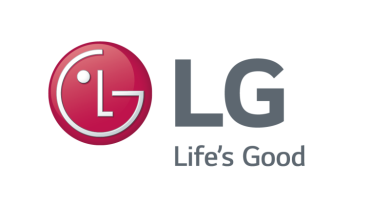
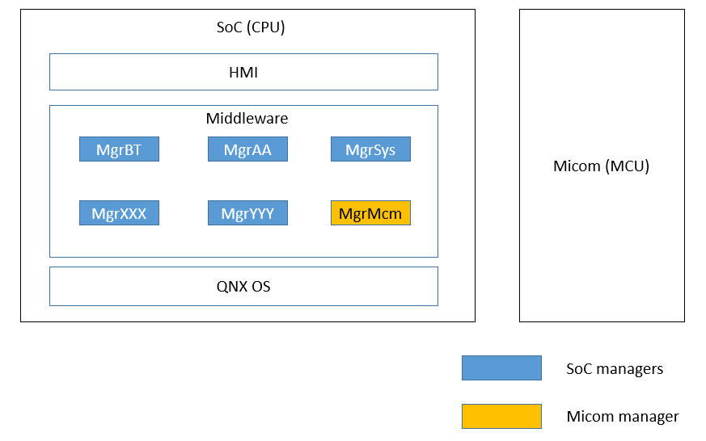
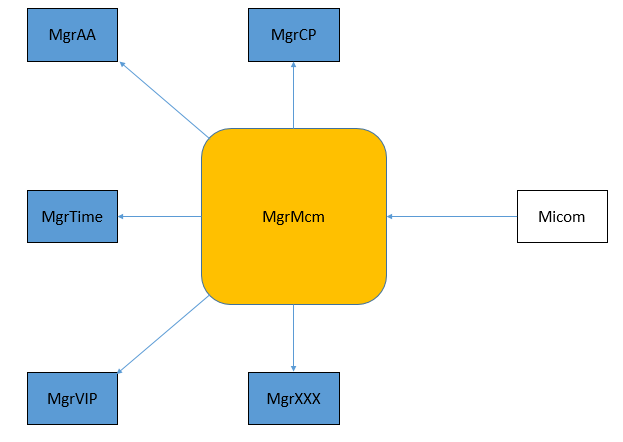
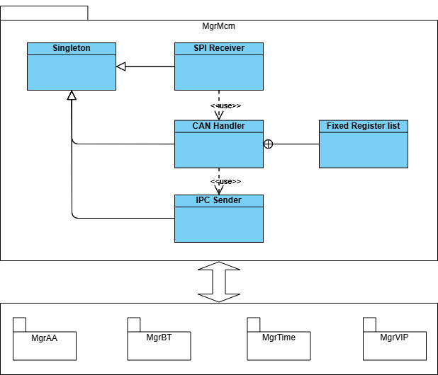
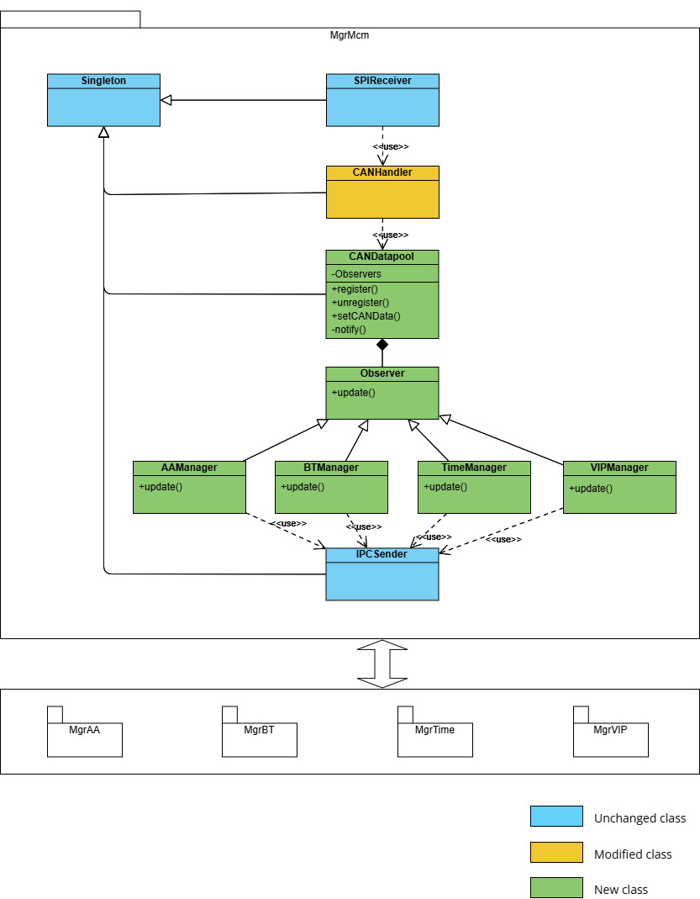
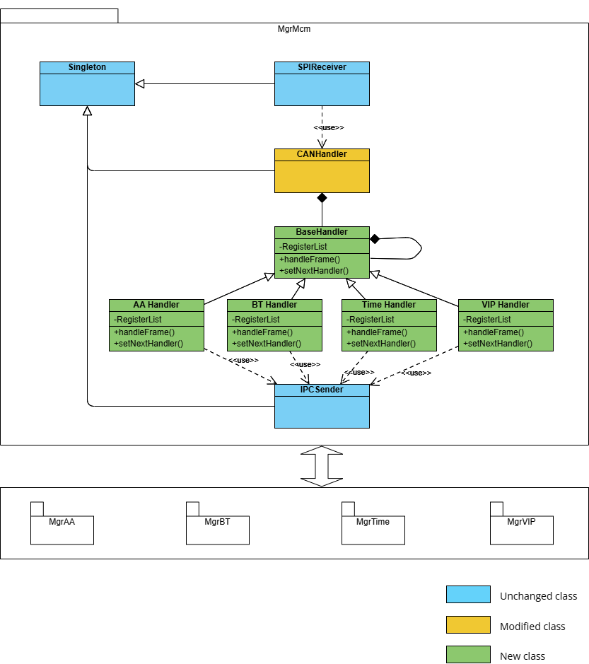

# Raw Slide Content

- Source file: FA_hoang.cao/Architecture improvement for CAN dispatching function of Micom Manager.pptx
- Total slides: 9

## Slide 1

Architecture improvement for
CAN dispatching function of Micom Manager

By: Cao Anh Hoang - LGEDV
Mentor: Mr. Sang Hun Lee

Image reference: slide_01_image_01.png

## Slide 2

 Project overview
 Problem identification
 Design proposals
 Design comparison & decision
 Q&A

Contents

## Slide 3

1. Project overview

GM AVN Info3.5 project

Micom Manager (MgrMcm) provides the communication between SoC managers and Micom.

Image reference: slide_03_image_01.png

## Slide 4

CAN dispatching function of MgrMcm.

1. Project overview

Image reference: slide_04_image_01.png

Receive CAN data from Micom
Parsing, do necessary conversion
Dispatch to registered managers

## Slide 5

Current design
SPIReceiver receive SPI messages from Micom.
CANHandler handle all the logic using a fixed register list.
CAN data is sent to other managers by IPCSender.
Problems
Difficult to modify/extend.
Difficult to maintain.
Non-reuse.
Project goals
Separate the handle logic for each managers (maintainability).
Make it easy and clear when modify/extend the function (modifiability/extensibility).
Consider reuse capacity for future projects (reuseability).

2. Problem identification

Image reference: slide_05_image_01.png

## Slide 6

 Proposal 1: Using Observer pattern

3. Design proposals

 Pros:
Open/close principle: new manager can be added without breaking current logic.
Single responsibility principle: all the logic related to a manager is moved into a separated class.
The managers can register/unregister the frame id to be received dynamically, don’t need to request changes to MgrMcm.
 Cons:
Need to modify all the manager’s source code to implement the register process.

Image reference: slide_06_image_01.png

## Slide 7

 Proposal 2: Using chain of responsibility pattern

3. Design proposals

 Pros:
Open/close principle: handler class of new manager can be added without breaking current logic.
Single responsibility principle: all the logic related to a manager is moved into a separated handler class.
Less-modification: don’t need to modify other managers than MgrMcm.
 Cons:
The handle code of the handler class can be duplicated if a frame id is received by many managers.
Each handler class still need to maintain a fixed register list.

Image reference: slide_07_image_01.png

## Slide 8

4. Design comparison & decision

### Table
| QA | Current design | Proposal 1 | Proposal 2 |
| Modifiability/ Extensibility | LOW Need to modify the switch-case handler of CANHandler class. => break the current logic. Need to maintain a fixed register list. | HIGH Each manager has its own class to implement the logic. The managers can register/unregister dynamically without MgrMcm’s Changes. Easy to modify/add new manager classes. | MEDIUM Separated logic into handler classes. Easy to modify/add new handler classes. But still need to maintain fixed register lists in handler classes. => Changes are required when other managers want to register/unregister |
| Maintainability | LOW Hard to understand and maintain because of complicated switch-case. | HIGH Use common design pattern. Easy to understand and maintain. | HIGH Use common design pattern. Easy to understand and maintain. |
| Reuseability | LOW Cannot reuse because of specific implementation. | HIGH Can be reused in other projects. | HIGH Can be reused in other projects. |

Proposal 1 is better based on the comparison.

## Slide 9

Image reference: slide_09_image_01.png

QnA

