# Raw Document Content

- Source file: FA_hoang2.nguyen_2024/[FA24][hoang2.nguyen]Architecture design for NGeCall supports maintenance and expansion_v1.3.docx

2024 FA Certification – Design Document

Architecture design for NGeCall supports maintenance and expansion

About this document

## Table
| Author | hoang2.nguyen |
| --- | --- |
| Target OEM | BMW-WAVE |
| Target module | NGeCall application |

Revision History

## Table
| Version | Release date | Contents | Author |
| --- | --- | --- | --- |
| 1.0 | 2024-07-30 | Initial release | hoang2.nguyen |
| 1.1 | 2024-08-19 | Added static design, state design | hoang2.nguyen |
| 1.2 | 2024-09-25 | Added architecture result, interaction design | hoang2.nguyen |
| 1.3 | 2024-09-30 | Moved non-functional requirements to separate section | hoang2.nguyen |

Related documents

## Table
| Document / Spec. Title | Version |
| --- | --- |
| WAVE SRS (Software Requirement Specifications) | v2.3 |
| WAVE SAD (Software Architectural Design) | v2.2 |

Abbreviations / Terms

## Table
| Abbreviation | Description |
| --- | --- |
| NGeCall | Next generation emergency call |
| PSAP | Public safety answering point |
| DiagManager | Diagnostics Manager |
| ConfigManager | Configuration Manager |
| eCallManager | Emergency call manager |

List of images

Figure 1: Context Diagram of NGeCall application	4

Figure 2: Context Diagram of NGeCall app (2)	5

Figure 3: Context Diagram of NGeCall application (3)	7

Figure 4: Current architecture design (left) and new architecture design (right) using Mediator pattern	9

Figure 5: The change of current architecture (left) and new architecture design using Mediator pattern (right)	10

Figure 6: Current architecture design (left) and new architecture design (right) using interface classes	11

Figure 7: The change of current architecture (left) and new architecture design using interface classes (right)	12

Figure 8: NGeCall's architecture design using interface classes	14

Figure 9: Static Design of NGeCall app	16

Figure 10: State Diagram of NGeCall app	17

Figure 11: Sequence Diagram of onCreate	19

Figure 12: Sequence Diagram of onBootComplete	20

Figure 13: Sequence Diagram of handle eCall trigger during idle	20

Figure 14: Sequence Diagram of handle eCall trigger during standby	21

Figure 15: Sequence Diagram of handle normal call disconnect	21

Figure 16: Sequence Diagram of handle abnormal call disconnect	22

Figure 17: Sequence Diagram of handle callback during standby state	22

Figure 18: Sequence Diagram of handle STEUERN_ECALL_TESTMODE	23

List of tables

Table 1: Non-functional requirements of NGeCall app	6

Table 2: Split eCallNGProcess based on functionality	8

Table 3: Rename classes based on functionality	8

Table 4: Compare two proposals by Quality Attributes	13

Table 5: Class descriptions of NGeCall app	17

Table 6: State description of NGeCall app	17

Table 7: Transition description of NGeCall app	18

Purpose

This document describes the current design of NGeCall app and its place in BMW-WAVE project, including Static Design, Dynamic Design and Algorithm Design.

This document analyzes the problems of current architecture design and proposes new design to solve these problems.

Background

Next generation emergency call - NGeCall app is a part of the eCall feature in BMW-WAVE project. Together with eCallManager and other eCall applications, NGeCall app makes sure that in any case of an accident, the customers are always well-supported with the best emergency call service.

Image reference: doc_image_001.png

Figure 1: Context Diagram of NGeCall application

Emergency call is a very basic feature in modern cars, and NGeCall app is supported in all of BMW’s projects. To adapt to new changes and requirements in the future, NGeCall app should be designed to be able to add new implementations without breaking the current implementations.

However, the current architecture design of NGeCall app does not support this well. This project will analyze in detail the weaknesses in the current architecture and propose some solutions to these problems.

1. Overview

1.1. Overall Descriptions

Image reference: doc_image_002.png

Figure 2: Context Diagram of NGeCall app (2)

NGeCall app is one of the applications in the Application layer of BMW-WAVE project. In the current architecture design, after receiving notifications from other services, they are forwarded to and handled by eCallNGProcess. With this architecture design, whenever we need to add a new feature, it has a risk of affecting the working features. Therefore, a new design is needed to reduce the coupling code, which will increase the Modifiability, Maintainability and Reusability of NGeCall app.

1.2. Functional Requirements of NGeCall app

The main functional requirements of NGeCall app consists of:

Collect data of the vehicle

Initiate calls via Telephony

Manage call status from Telephony

Support Diagnostics jobs

1.3. Non-functional requirements of NGeCall app

Besides the main functional requirements described in 1.2, NGeCall application also need to follow some non-functional requirements which correspond to quality attributes, such as:

## Table
| Scenario # | QA Scenario | Quality Attribute | Priority |
| --- | --- | --- | --- |
| 1 | NGeCall must support new regions in the future | Maintainability | High |
| 2 | NGeCall must be applied in future eCall projects: ICONICC, Motorrad-ICONICC | Reusability | High |
| 3 | NGeCall must support future changes in eCall standards | Modifiability | Mid |

Table 1: Non-functional requirements of NGeCall app

2. Architectural Analysis

2.1. Problem Identification

Image reference: doc_image_003.png

Figure 3: Context Diagram of NGeCall application (3)

After receiving the notifications from other services (for example, call state from TelephonyMgr), they are forwarded to and handled by eCallNGProcess.

This leads to eCallNGProcess has 2 problems:

High cyclomatic complexity:

#pmccabe -T eCallNGProcess.cpp

924     1166    5249    n/a     10997   Total

This class has over 200 functions and 10000 lines of code. Even a small change could impact the whole class, which lead to

→ Low Modifiability and Maintainability

It handles many different functionalities

→ Difficult to reuse in different projects

→ Low Reusability

When NGeCall app needs to expand to support another region with different requirements for each functionality, we would have to modify a lot of functions inside eCallNGProcess, which poses a risk of breaking working functionalities.

With this analysis, we should consider new architecture design to improve the Modifiability, Maintainability and Reusability of NGeCall app. In the scope of this project, I will focus on below solution for the above problem:

Split eCallNGProcess class into smaller classes and decide the communication method between new classes.

2.2. Architecture Design Proposals

In this section, we will consider two architecture design proposals and select one of them based on their Pros and Cons.

2.2.1. Proposal 1: Use Mediator pattern

First, I will split eCallNGProcess class into smaller classes, based on NGeCall’s functionalities:

## Table
| Old class | New class | Functionality |
| --- | --- | --- |
| eCallNGProcess | eCallNGProcess_State | Store NG eCall application’s states: App state, call state, power state, … |
| eCallNGProcess | eCallNGProcess_Trigger | Check incoming eCall trigger and current eCall state to decide how to handle the trigger |
| eCallNGProcess | eCallNGProcess_SelfTest | Handle self-test result |
| eCallNGProcess | eCallNGProcess_Timer | Manage timers |
| eCallNGProcess | eCallNGProcess_Diag | Handle diagnostics jobs |
| eCallNGProcess | eCallNGProcess_Call | Initiate call and handle call events: dialing, connecting, disconnecting, … |

Table 2: Split eCallNGProcess based on functionality

I also rename two other classes:

## Table
| Old class | New name | Functionality |
| --- | --- | --- |
| eCallAirbagData | eCallNGProcess_Data | Collect and prepare required data for calls |
| eCallNGLogManager | eCallNGProcess_Log | Create and update log files to NVM |

Table 3: Rename classes based on functionality

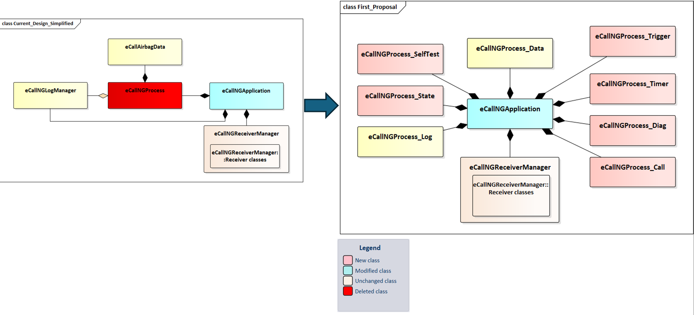
Image reference: doc_image_004.png

Figure 4: Current architecture design (left) and new architecture design (right) using Mediator pattern

eCallNGApplication is the mediator, responsible for creating all instances of the new classes and forwarding method calls between these instances.

Implement steps:

Split eCallNGProcess to smaller class based on NGeCall’s functionalities. These new classes need to accept eCallNGApplication as a parameter in their constructors.

eCallNGApplication is responsible for creating objects of the new classes.

When a class needs to call a method from another class, it notifies eCallNGApplication.

eCallNGApplication checks the notification and forwards the call to the responsible class.

Pros and Cons of the proposal:

Pros:

Protect Single Responsibility Principle: Each of the new classes only handles one functionality.

Increase Modifiability: When requirement changes, only the class that handles that functionality has to change to adapt for the new requirement.

Increase Maintainability: When expand NGeCall app to support a new region, only eCallNGApplication needs to be modified.

Cons:

eCallNGApplication needs to manage all objects and method calls for all supported regions. Overtime it can become a god-object

Benefit from using this proposal:

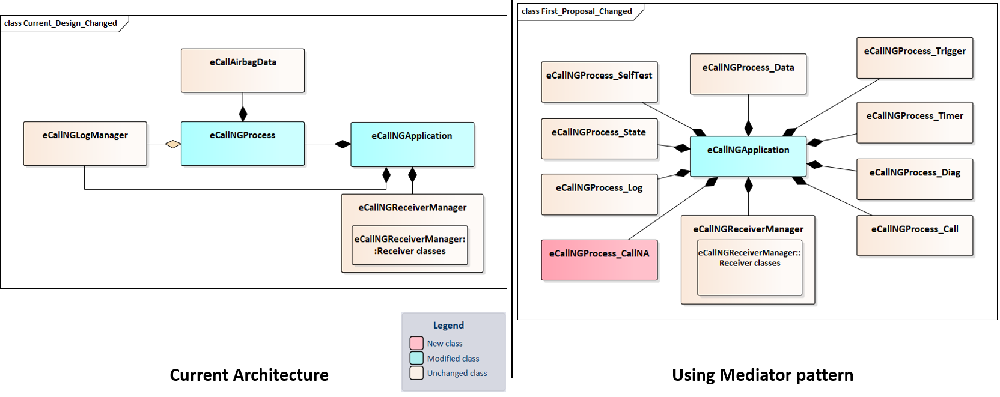
Image reference: doc_image_005.png

Figure 5: The change of current architecture (left) and new architecture design using Mediator pattern (right)

In current architecture, when NGeCall needs to support a new region:

eCallNGApplication is modified to read the region value.

eCallNGProcess needs to be modified a lot of its functions to check the region value and handle functionalities correctly.

With this proposal, when NGeCall needs to support a new region:

A new class specific to the new region’s functionalities and requirements is created.

eCallNGApplication is modified to read region value; create object for the new class; check region value each time a notification is received from the new classes.

With the Mediator approach, we can implement new region’s requirements without touching the working functionalities of old regions.

2.2.2. Proposal 2: Use interface classes

Like in proposal 1, first I split eCallNGProcess class into smaller classes, based on NGeCall’s functionalities.

Next, I extract the methods which these classes depend on each other into interface classes.

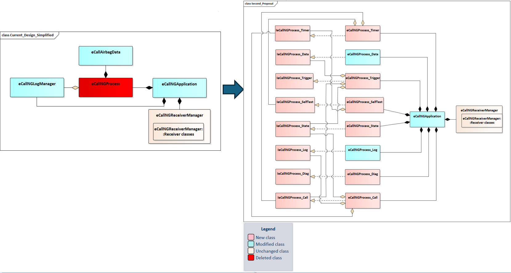
Image reference: doc_image_006.png

Figure 6: Current architecture design (left) and new architecture design (right) using interface classes

eCallNGApplication creates the instances of the new classes and acts as an objects pool.

These classes will get the pointers of their dependency classes from this pool.

When they want to call a method of a dependency class, they can call it directly.

Implement steps:

Split eCallNGProcess to smaller class based on NGeCall’s functionalities. These new classes need to accept eCallNGApplication as a parameter in their constructors.

With each class, extract the methods that other classes depend on into an interface

During app initialization, eCallNGApplication read the region value to create instances of the specific classes for that region.

Each created objects get the pointer of their dependency classes from eCallNGApplication.

Pros and Cons of the proposal:

Pros:

Protect Open/Closed Principle: By using polymorphism, new classes can be created via inheritance, leaving old classes unchanged.

Protect Single Responsibility Principle: Each of the new classes only handle one functionality.

Increase Modifiability: When requirement changes, only the class that handles that functionality has to change to adapt for the new requirement.

Increase Maintainability: When expand NGeCall to support a new region, only eCallNGApplication needs to be modified.

Cons:

Require higher effort to design and create interface classes and refactor other classes to work with the interfaces

Benefit from using interface classes:
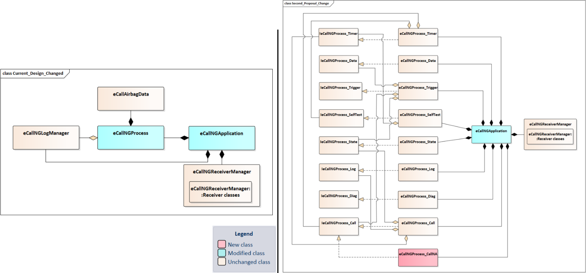
Image reference: doc_image_007.png

The required changes for the current architecture is the same as proposal 1.

With this proposal, when NGeCall needs to support a new region:

A new class specific to the new region’s functionalities and requirements is created.

eCallNGApplication is modified to read region value and create object for the new class.

2.3. Architecture Decision

For the identified problem with NGeCall application, I proposed a solution:

Split eCallNGProcess class into smaller classes and decide the communication method between new classes.

Now we will consider two proposals to deploy the solution:

Proposal 1: Use Mediator pattern.

Proposal 2: Use Interface classes.

Below table compares the pros and cons of two proposals by quality attributes:

## Table
| Proposal | Modifiability | Maintainability | Reusability |
| --- | --- | --- | --- |
| Proposal 1: Use Mediator pattern | High: When update requirement or fix issue, only one class needs to be modified | Medium: When expand NGeCall to support another region, the mediator needs to manage more objects and check region value every time it forwards method calls | High: All eCall applications share similar functionalities. Also, we have separated each functionality into one class, so this can be easily reused for future projects |
| Proposal 2: Using interface classes | High: When update requirement or fix issue, only one class needs to be modified | High: When expand NGeCall to support another region, the number of objects does not increase. Region value needs to be checked only once to initiate appropriate objects | High: All eCall applications share similar functionalities. Also, we have separated each functionality into one class, so this can be easily reused for future projects |

Table 4: Compare two proposals by Quality Attributes

From this table, we can see that both proposals have high Modifiability and Reusability, but proposal 2 has better Maintainability.

Beside the quality attributes, I have another decision point about supporting Unit Test: By using interface classes, proposal 2 can better support UT since we can easily write mock functions for abstract methods.

With this analysis, I decide to apply Proposal 2: Using interface classes.

3. Architecture Results

After applying the proposal, the class diagram of NGeCall application will become as follow:

Image reference: doc_image_008.png

Figure 8: NGeCall's architecture design using interface classes

Experimental Results:

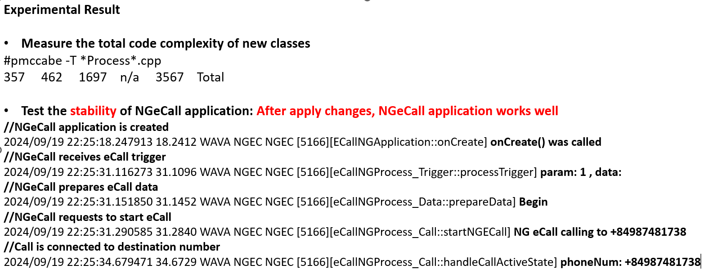
Image reference: doc_image_009.png

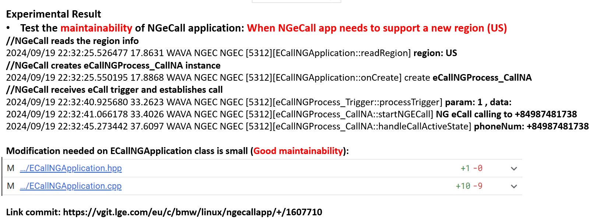
Image reference: doc_image_010.png

My plan:

Since NGeCall app is currently under development, I can apply this solution to it.

This solution is applicable for other eCall apps as well because they share a lot of same functionalities. Also with low Modifiability, it is easy to adapt for the requirement of specific eCall applications, so I can apply this solution for eCall apps in future projects.

4. Architecture Diagrams of NGeCall Application

4.1. Static Design

Class diagram of NGeCall Application after applying the solution:

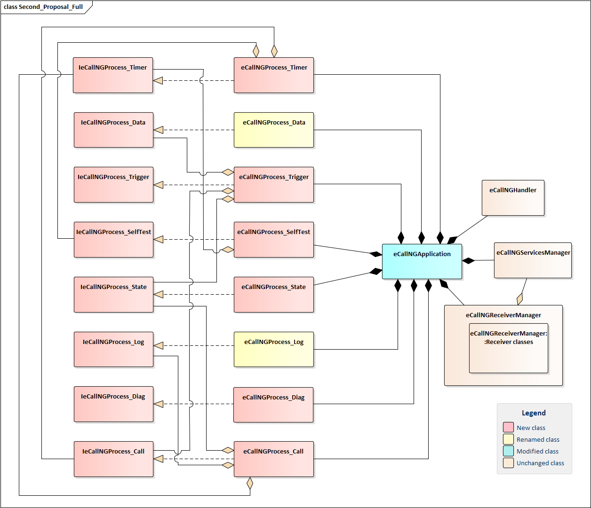
Image reference: doc_image_011.png

Figure 9: Static Design of NGeCall app

Class description of NGeCall Application:

## Table
| Class | Description |
| --- | --- |
| eCallNGApplication | Main class of NGeCall application |
| eCallNGHandler | Push messages to queue to handle them in correct order |
| eCallNGServicesManager | Interact with other services |
| eCallNGReceiverManager | Register and receive callbacks from other services |
| eCallNGProcess_Timer | Manage timers |
| eCallNGProcess_Data | Collect and prepare required data for calls |
| eCallNGProcess_Trigger | Check incoming eCall trigger and current eCall state to decide how to handle the trigger |
| eCallNGProcess_SelfTest | Handle self-test result |
| eCallNGProcess_State | Store NGeCall application’s states |
| eCallNGProcess_Log | Create and update log files to NVM |
| eCallNGProcess_Diag | Handle diagnostics jobs |
| eCallNGProcess_Call | Initiate calls and handle call events |

Table 5: Class descriptions of NGeCall app

4.2. Dynamic Design

4.2.1. State Design

NGeCall application works with following states:

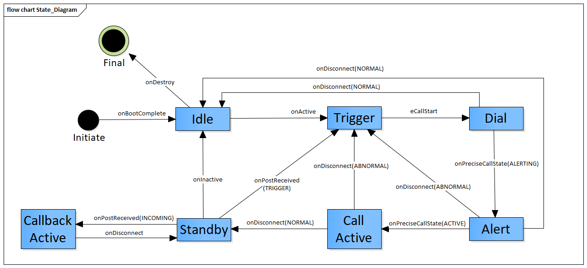
Image reference: doc_image_012.png

Figure 10: State Diagram of NGeCall app

State description:

## Table
| State | Description |
| --- | --- |
| Initiate | NGeCall is being initiated by Application Manager |
| Idle | There is no eCall trigger in progress |
| Trigger | Received an eCall trigger and initializing data for eCall |
| Dial | Start to request Telephony to make an eCall |
| Alert | eCall reached PSAP and started ringing |
| Call Active | Voice call is ready |
| Standby | After outgoing call ended, NGeCall application ready to accept incoming call |
| Callback Active | An incoming call is accepted |
| Final | Release resources to end the application |

Table 6: State description of NGeCall app

Transition Description:

## Table
| Current State | Event/Action | Next State | Description |
| --- | --- | --- | --- |
| Initiate | onBootCompleted | Idle | When all services and applications are ready, ApplicationManager notifies onBootCompleted. NGeCall application is ready to handle eCall triggers |
| Idle | onActive | Trigger | Received an eCall trigger via onActive and initializing data for eCall |
| Trigger | eCallStart | Dial | After initialized eCall data, NGeCall application send this data to Telephony and request start an eCall |
| Dial | onPreciseCallState (ALERTING) | Alert | Telephony notifies that the eCall reached PSAP and started ringing |
| Alert | onPreciseCallState (ACTIVE) | Call Active | Call is connected to PSAP |
| Call Active | onDisconnect (NORMAL) | Standby | Normal disconnect by user or PSAP |
| Standby | onPostReceived (INCOMING) | Callback Active | Incoming call is received during standby state, NGeCall must accept this call and change to Callback Active state |
| Callback Active | onDisconnect | Standby | Incoming call is finished |
| Standby | onInactive | Idle | eCall is finished and NGeCall returns to Idle state |
| Standby | onPostReceived (TRIGGER) | Trigger | New eCall trigger is received during standby state |
| Dial | onDisconnect (NORMAL) | Idle | User aborted eCall during dialing, NGeCall does not redial and go to Idle state |
| Alert | onDisconnect (NORMAL) | Idle | User aborted eCall during alerting, NGeCall does not redial and go to Idle state |
| Alert | onDisconnect (ABNORMAL) | Trigger | Abnormal disconnect during alerting, NGeCall handles redial |
| Call Active | onDisconnect (ABNORMAL) | Trigger | Abnormal disconnect during call active, NGeCall handles redial |
| Idle | onDestroy | Final | NGeCall releases resources before being destroyed |

Table 7: Transition description of NGeCall app

4.2.2. Interaction Design

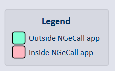
Image reference: doc_image_013.png

onCreate

When NGeCall app receives onCreate() from ApplicationManager

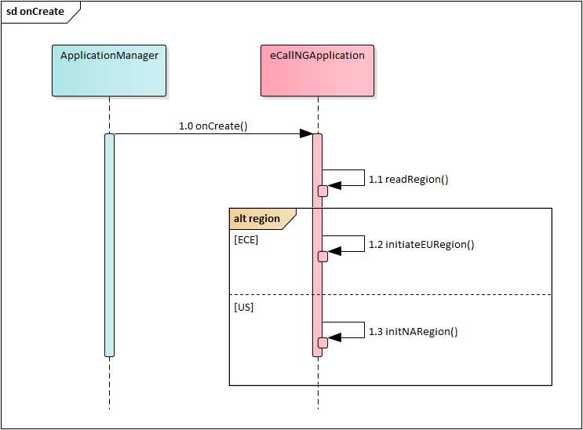
Image reference: doc_image_014.png

Figure : Sequence Diagram of onCreate

onBootComplete

When NGeCall app receives onSystemPostReceived() from SystemManager:

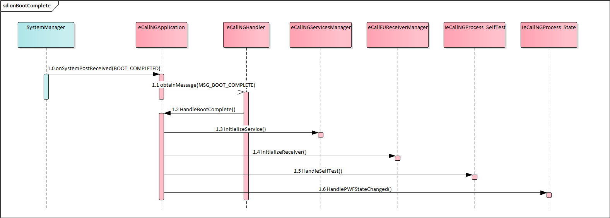
Image reference: doc_image_015.png

Figure 12: Sequence Diagram of onBootComplete

Handle eCall trigger during idle

When NGeCall app receives onActive() from ApplicationManager:

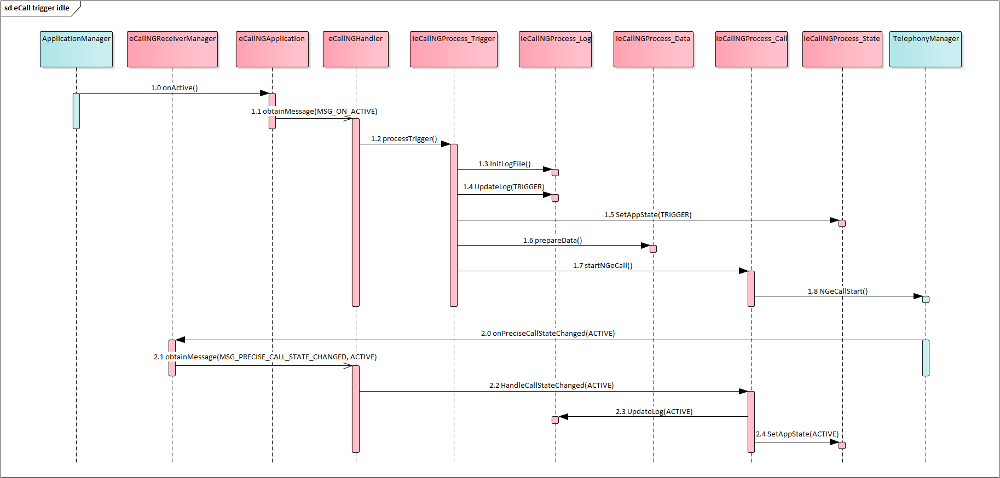
Image reference: doc_image_016.png

Figure 13: Sequence Diagram of handle eCall trigger during idle

Handle eCall trigger during standby

When NGeCall app receives onPostReceived() from ApplicationManager:

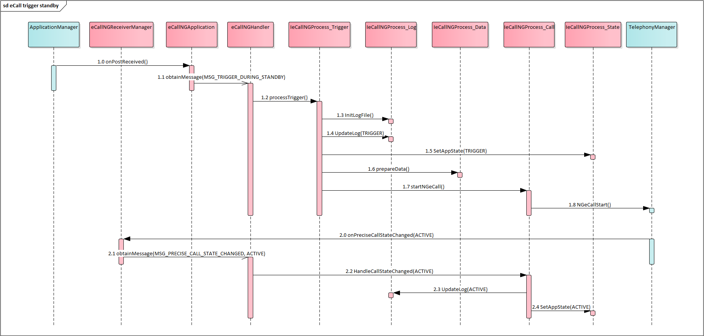
Image reference: doc_image_017.png

Figure 14: Sequence Diagram of handle eCall trigger during standby

Handle normal call disconnect

When NGeCall app receives onDisconnect from TelephonyManager with normal disconnect cause, NGeCall app goes to standby state:

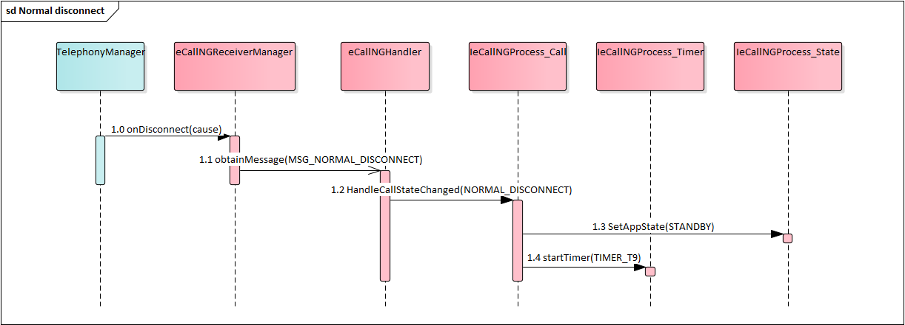
Image reference: doc_image_018.png

Figure 15: Sequence Diagram of handle normal call disconnect

Handle abnormal call disconnect

When NGeCall app receives onDisconnect from TelephonyManager with abnormal disconnect cause, NGeCall app attempts to redial:

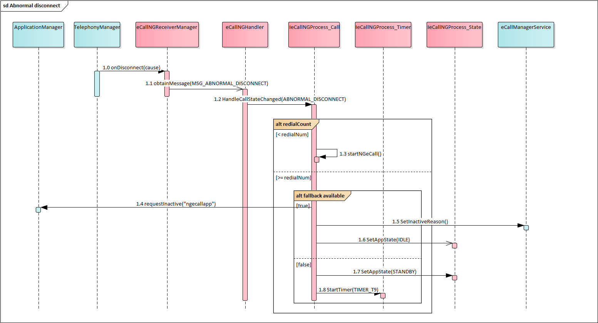
Image reference: doc_image_019.png

Figure 16: Sequence Diagram of handle abnormal call disconnect

Handle callback during standby state

When NGeCall app receives onPreciseCallStateChanged(INCOMING) from Telephony:

Image reference: doc_image_020.png

Figure 17: Sequence Diagram of handle callback during standby state

Handle STEUERN_ECALL_TESTMODE diagnostics job

When NGeCall app receives onReceived from DiagManager:

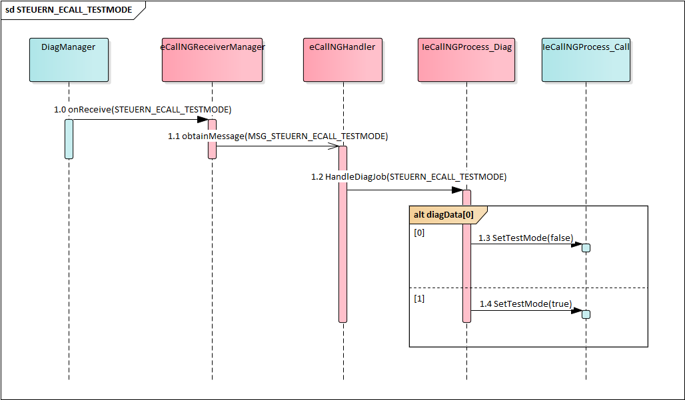
Image reference: doc_image_021.png

Figure 18: Sequence Diagram of handle STEUERN_ECALL_TESTMODE
