# Raw Slide Content

- Source file: FA_hoang2.nguyen_2024/[FA24][hoang2.nguyen]Architecture design for NGeCall supports maintenance and expansion_v1.3.pptx
- Total slides: 15

## Slide 1

FA 2024 Certification
Architecture design for NGeCall supports maintenance and expansion

Author: Hoang Huy Nguyen
Mentor: Sang Hyup Lee
Sep 19th, 2024

1

Image reference: slide_01_image_01.png

Image reference: slide_01_image_02.png

## Slide 2

Contents

2

Image reference: slide_02_image_01.png

Image reference: slide_02_image_02.png

Problem identification
Architecture Design Proposals & Comparison
Architecture Decision
Design Results
Q&A

## Slide 3

1. Problem Identification

3

Image reference: slide_03_image_01.png

Image reference: slide_03_image_02.png

Next generation emergency call (NGeCall) Application’s Overview

NGeCall App is responsible for collecting data and establishing emergency calls

Main functional requirements of NGeCall App:
Collect data of the vehicle
Initiate calls via Telephony
Manage call status from Telephony
Support Diagnostics jobs

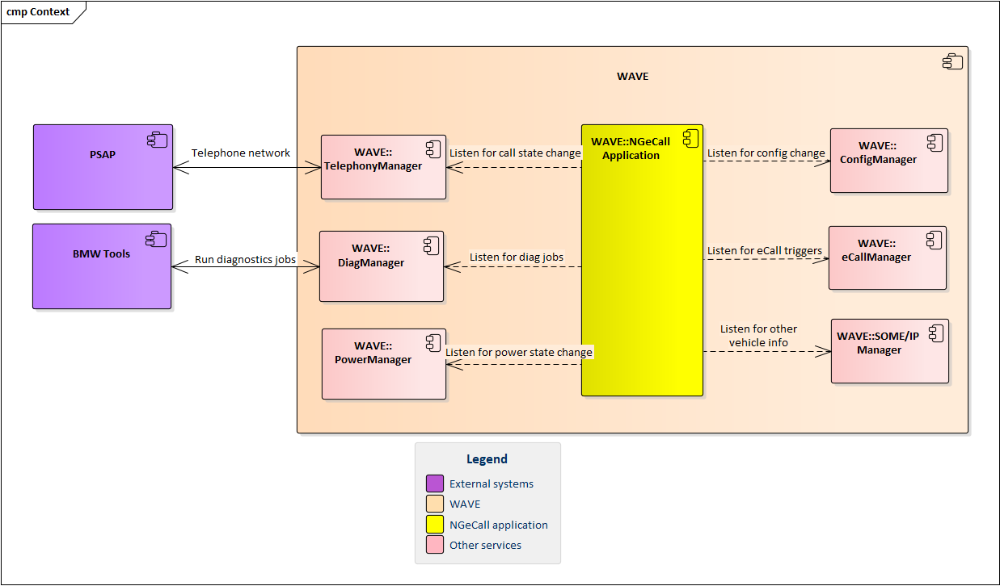
Image reference: slide_03_image_03.png

## Slide 4

1. Problem Identification

4

Image reference: slide_04_image_01.png

Image reference: slide_04_image_02.png

Next generation emergency call (NGeCall) Application’s Overview

Non-functional requirements of NGeCall App

### Table
| Scenario # | QA Scenario | Quality Attribute | Priority |
| 1 | NGeCall must support new regions in the future | Maintainability | High |
| 2 | NGeCall must be applied in future eCall projects: ICONICC, Motorrad-ICONICC | Reusability | High |
| 3 | NGeCall must support future changes in eCall standards | Modifiability | Medium |

## Slide 5

1. Problem Identification

5

Image reference: slide_05_image_01.png

Image reference: slide_05_image_02.png

Current architecture design problems

Problems:
High complexity
#pmccabe -T eCallNGProcess.cpp
924     1166    5249    n/a     10997   Total
→ Low Modifiability and Maintainability
Handle too many functionalities
→ Low Reusability

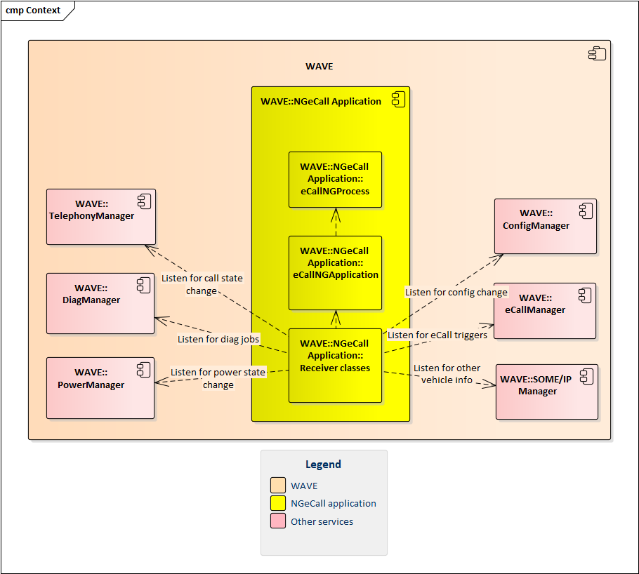
Image reference: slide_05_image_03.png

## Slide 6

1. Problem Identification

6

Image reference: slide_06_image_01.png

Image reference: slide_06_image_02.png

Purpose of making Architectural Decision:

1. Reduce the effort to modify and maintain NGeCall application
→ Increase Modifiability, Maintainability (most important)
2. Reduce the effort to apply NGeCall application to other projects
→ Increase Reusability

Split eCallNGProcess class into smaller classes and design communication method between them

Consider proposals for the improvement:

## Slide 7

2. Architect Design Proposals

7

Image reference: slide_07_image_01.png

Proposal 1: Use Mediator pattern

Use eCallNGApplication as the mediator

Pros:
Protect Single Responsibility Principle: Each of the new classes only handles one functionality of NGeCall app
Increase Modifiability: When requirement changes, only the class that handles that functionality has to change to adapt for the new requirement
Increase Maintainability: When expand NGeCall app to support a new region, only eCallNGApplication needs to be modified
Cons:
eCallNGApplication needs to manage all objects and method calls of every supported region. Overtime it can become a god-object

Image reference: slide_07_image_02.png

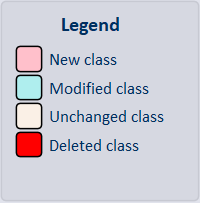
Image reference: slide_07_image_03.png

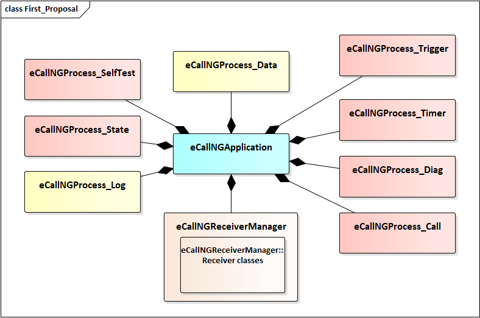
Image reference: slide_07_image_04.png

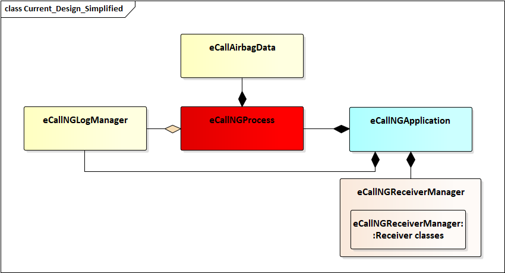
Image reference: slide_07_image_05.png

## Slide 8

2. Architect Design Proposals

8

Image reference: slide_08_image_01.png

Proposal 1: Use Mediator pattern – Benefit Illustration

When NGeCall needs to support a new region

Current Architecture

Using Mediator pattern

Image reference: slide_08_image_02.png

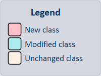
Image reference: slide_08_image_03.png

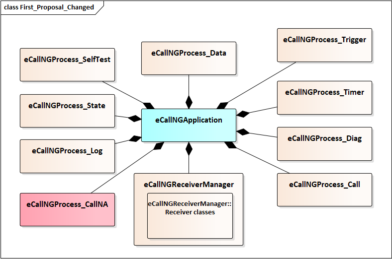
Image reference: slide_08_image_04.png

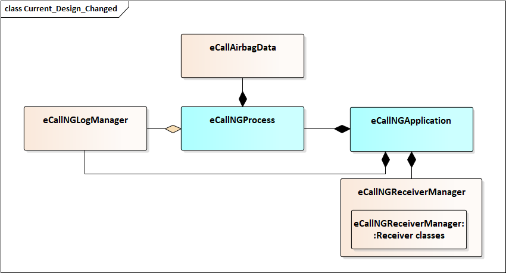
Image reference: slide_08_image_05.png

## Slide 9

2. Architect Design Proposals

9

Proposal 2: Use Interface classes

Pros:
Protect Open/Closed Principle: By using polymorphism, new classes can be created via inheritance, leaving old classes unchanged
Protect Single Responsibility Principle: Each of new classes only handle one functionality
Increase Modifiability: When requirement changes, only the class that handles that functionality has to change to adapt for the new requirement
Increase Maintainability: When expand NGeCall to support a new region, only eCallNGApplication needs to be modified
Cons:
Require higher effort to design and create interface classes and refactor other classes to work with the interfaces

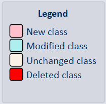
Image reference: slide_09_image_01.png

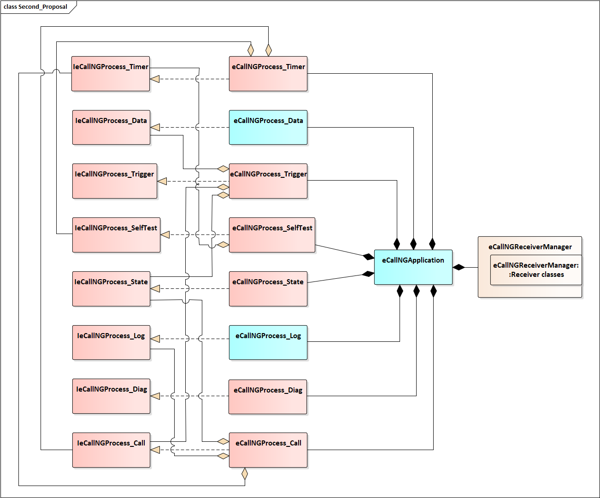
Image reference: slide_09_image_02.png

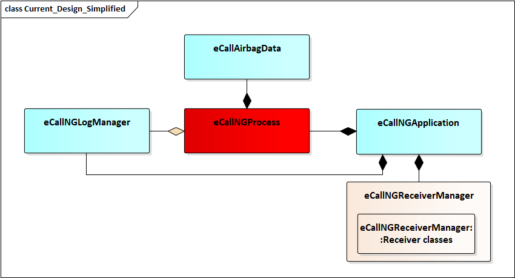
Image reference: slide_09_image_03.png

Image reference: slide_09_image_04.png

Image reference: slide_09_image_05.png

## Slide 10

Image reference: slide_10_image_01.png

Image reference: slide_10_image_02.png

2. Architect Design Proposals

10

Proposal 2: Use Interface classes – Benefit Illustration

When NGeCall needs to support a new region

Current Architecture

Using Interface class

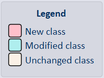
Image reference: slide_10_image_03.png

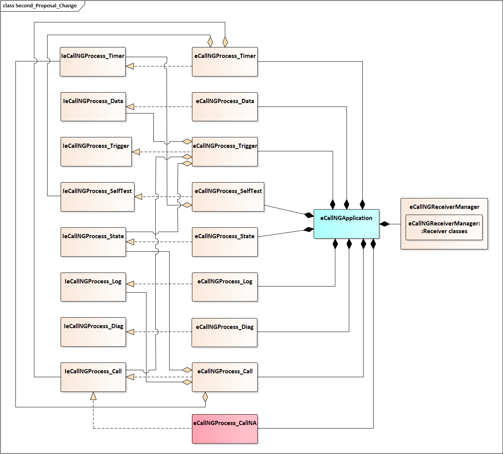
Image reference: slide_10_image_04.png

Image reference: slide_10_image_05.png

## Slide 11

3. Architecture Decision

11

Image reference: slide_11_image_01.png

Image reference: slide_11_image_02.png

Compare Design Proposals

### Table
| Proposal | Modifiability | Maintainability | Reusability |
| Proposal 1: Use Mediator pattern | High: When update requirement or fix issue, only one class needs to be modified | Medium: When expand NGeCall to support another region, the mediator needs to manage more objects and check region value every time it forwards method calls | High: All eCall applications share similar functionalities. Also, we have separated each functionality into one class, so this can be easily reused for future projects |
| Proposal 2: Use Interface classes |  | High: When expand NGeCall to support another region, the number of objects does not increase. Region value needs to be checked only once to initiate appropriate objects |  |

→ Decide to use Proposal 2: Use interface classes

Other decision point:
Support Unit-Testing: Proposal 2 can support Unit-Testing better

## Slide 12

4. Design Results

12

Class diagram of NGeCall application

Old Architecture

New Architecture

Image reference: slide_12_image_01.png

Image reference: slide_12_image_02.png

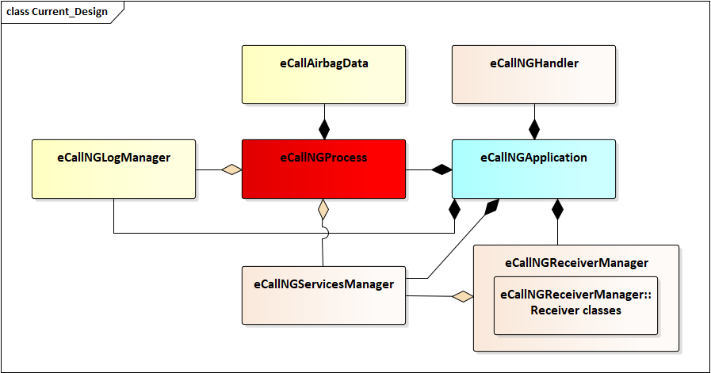
Image reference: slide_12_image_03.png

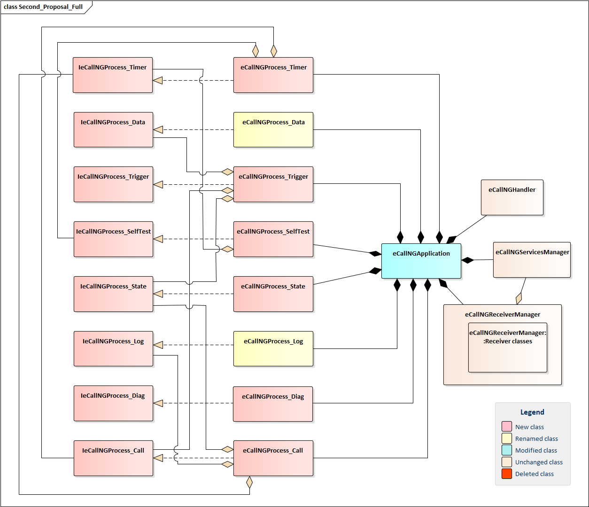
Image reference: slide_12_image_04.png

## Slide 13

4. Design Results

13

Image reference: slide_13_image_01.png

Image reference: slide_13_image_02.png

Experimental Result
Measure the total code complexity of new classes
#pmccabe -T *Process*.cpp
357     462     1697    n/a     3567    Total
Test the stability of NGeCall application: After apply changes, NGeCall application works well
//NGeCall application is created
2024/09/19 22:25:18.247913 18.2412 WAVA NGEC NGEC [5166][ECallNGApplication::onCreate] onCreate() was called
//NGeCall receives eCall trigger
2024/09/19 22:25:31.116273 31.1096 WAVA NGEC NGEC [5166][eCallNGProcess_Trigger::processTrigger] param: 1 , data:
//NGeCall prepares eCall data
2024/09/19 22:25:31.151850 31.1452 WAVA NGEC NGEC [5166][eCallNGProcess_Data::prepareData] Begin
//NGeCall requests to start eCall
2024/09/19 22:25:31.290585 31.2840 WAVA NGEC NGEC [5166][eCallNGProcess_Call::startNGECall] NG eCall calling to +84987481738
//Call is connected to destination number
2024/09/19 22:25:34.679471 34.6729 WAVA NGEC NGEC [5166][eCallNGProcess_Call::handleCallActiveState] phoneNum: +84987481738

## Slide 14

4. Design Results

14

Image reference: slide_14_image_01.png

Experimental Result
Test the maintainability of NGeCall application: When NGeCall app needs to support a new region (US)
//NGeCall reads the region info
2024/09/19 22:32:25.526477 17.8631 WAVA NGEC NGEC [5312][ECallNGApplication::readRegion] region: US
//NGeCall creates eCallNGProcess_CallNA instance
2024/09/19 22:32:25.550195 17.8868 WAVA NGEC NGEC [5312][ECallNGApplication::onCreate] create eCallNGProcess_CallNA
//NGeCall receives eCall trigger and establishes call
2024/09/19 22:32:40.925680 33.2623 WAVA NGEC NGEC [5312][eCallNGProcess_Trigger::processTrigger] param: 1 , data:
2024/09/19 22:32:41.066178 33.4026 WAVA NGEC NGEC [5312][eCallNGProcess_CallNA::startNGECall] NG eCall calling to +84987481738
2024/09/19 22:32:45.273442 37.6097 WAVA NGEC NGEC [5312][eCallNGProcess_CallNA::handleCallActiveState] phoneNum: +84987481738
Modification needed on ECallNGApplication class is small (Good maintainability):
Link commit: https://vgit.lge.com/eu/c/bmw/linux/ngecallapp/+/1607710

My plan:
Currently NGeCall application is under development, I will apply this solution to it.
This solution is applicable for other eCall applications.

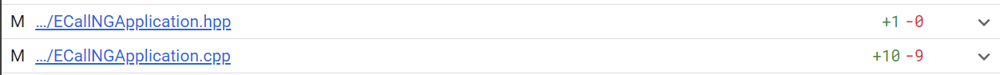
Image reference: slide_14_image_02.png

## Slide 15

Image reference: slide_15_image_01.png

Image reference: slide_15_image_02.png

Q&A
Thank you for listening!

15

