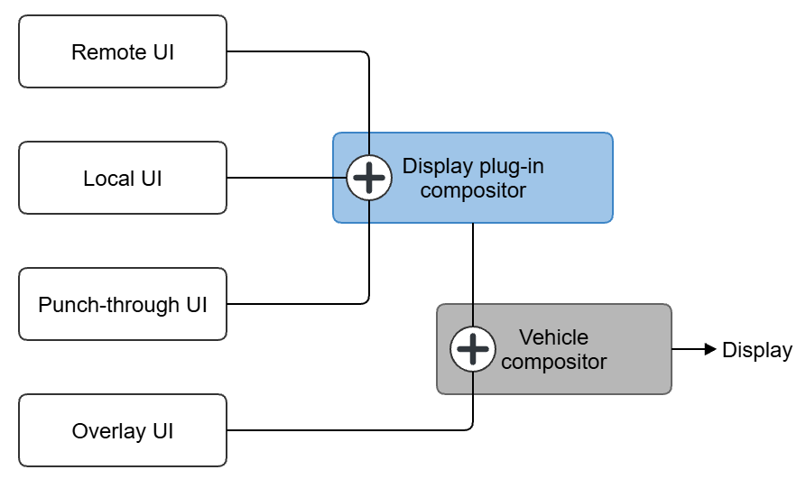
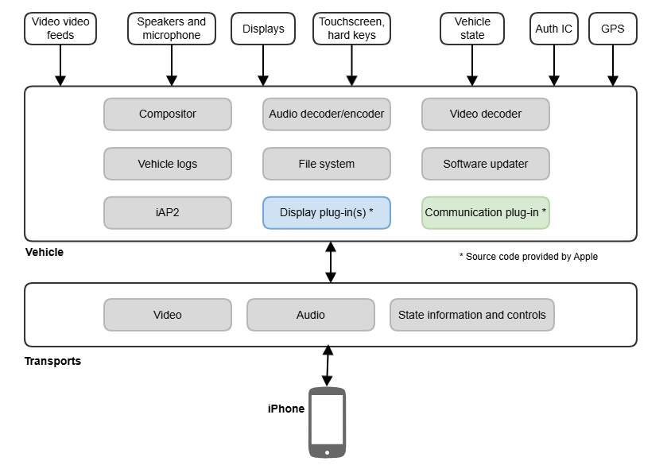
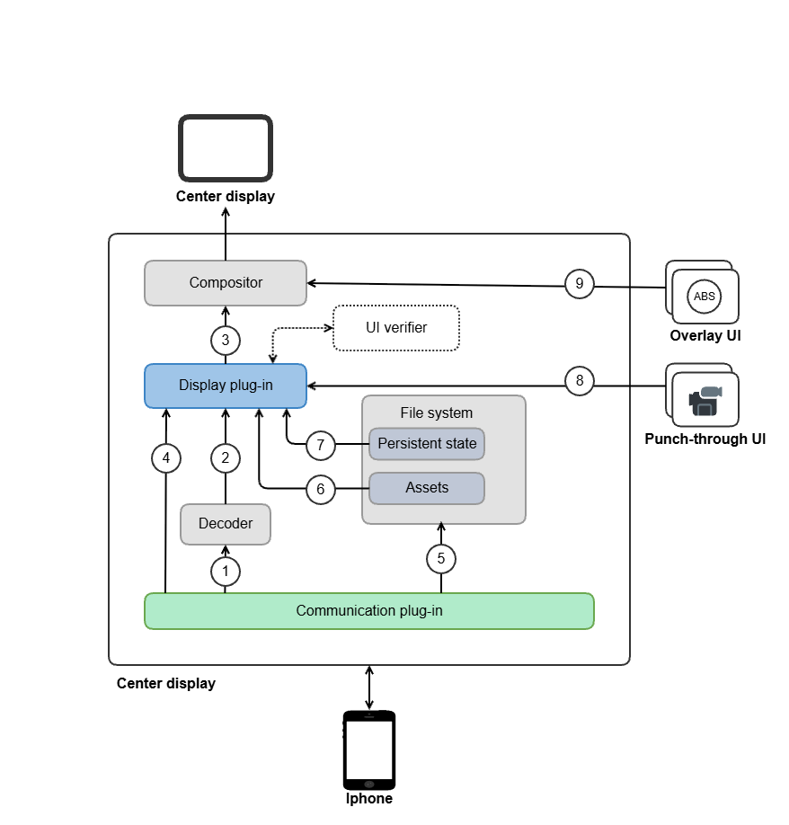
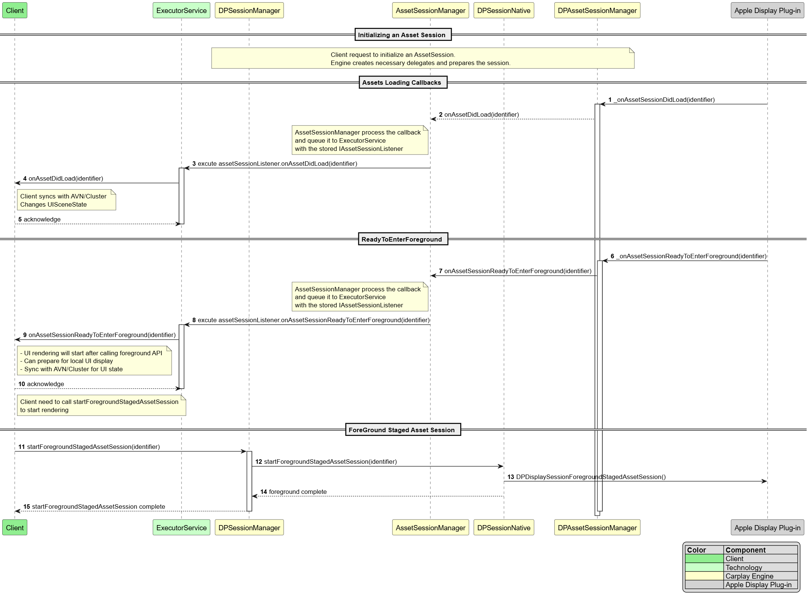
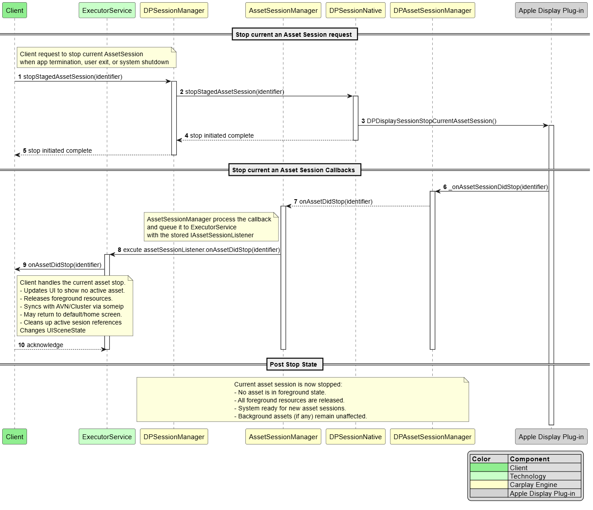
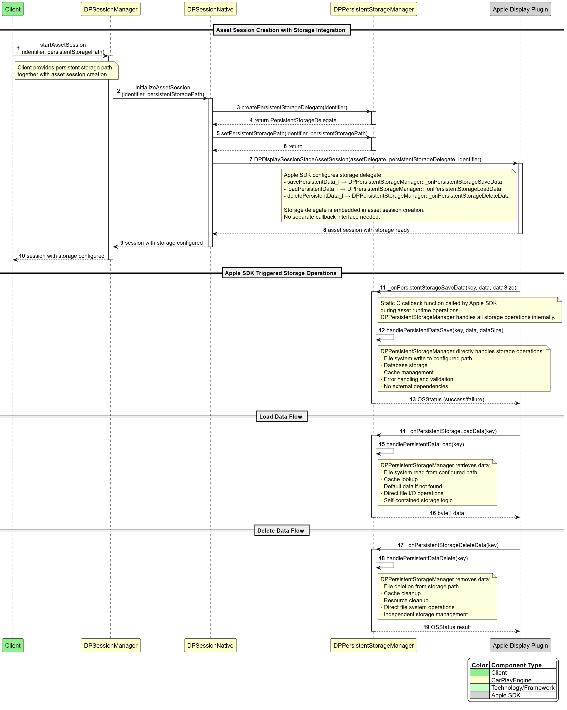

# Raw Document Content

- Source file: FA_huy3.le/Asset and Persistent storage management v0.5.docx

Design Asset and Persistent storage management on Carplay Engine on Carplay Ultra of Connect Wide project

About This Document

Document Information

## Table
| Issuing authority | Phone Projection Unit |
| --- | --- |
| Project | ConnectWide |
| Configuration ID | Carplay Ultra |
| Status of document | In progress |

Revision History

## Table
| Version | Date | Notes | Author | Reviewer |
| --- | --- | --- | --- | --- |
| 0.1 | 2025.08.01 | Initial Release | Huy Quang Le | Mr. Kim Tai Ho |
| 0.2 | 2025.08.20 | Update proposal design and the comparison. | Huy Quang Le | Mr. Kim Tai Ho |
| 0.3 | 2025.09.19 | Update proposal description, add sequence diagram | Huy Quang Le | Mr. Kim Tai Ho |
| 0.4 | 2025.09.24 | Update the description for sequence diagram | Huy Quang Le | Mr. Kim Tai Ho |
| 0.5 | 2025.09.25 | Update the description for QA | Huy Quang Le | Mr. Kim Tai Ho |

Purpose

This document specifies the software architectural design for the Asset and Persistent Storage for CarPlay Ultra.

This design document also serves as a guideline on how each software module should be implemented and how the internal module processes should interact with each other.

Scope

This document provides information on Assets/Persistent Storage management and outlines the functionalities of these classes to meet the requirements.

Audience

The software architect is responsible for assessing the software design.

Developers on CarPlay Engine team who will identify any inconsistencies between the design and the requirements.

Participants of the ConnectWide project who want to understand the asset/persistent storage manager’s architecture.

Related Documents

Next generation of CarPlay Developer Preview 8 for R1

Abbreviations/Terms

## Table
| Abbreviation | Description |
| --- | --- |
| OEM | Original Equipment Manufacturer |
| CP | Carplay |
| CP Engine | Carplay Engine |
| DP | Display |
| DP Plug-in | Display Plug-in |

## Table
| Terms | Description |
| --- | --- |
| Carplay Ultra | The next generation of Carplay |
| Client | In this document, Client stands for Carplay Client |
| Engine | In this document, Engine stands for Carplay Engine |
| Communication plug-in | The Communication plug-in is the primary interface to the iPhone and is responsible for data interfaces and UI streams. This source code was provided by Apple |
| Display-plugin | The Display plug-in is responsible for local rendering and compositing the Carplay Ultra UI to a display, communicating with the Communication plug-in, and subscribing to relevant vehicle state information. This source code was provided by Apple |
| Assets | Assets contain information needed by the local renderer to render Local UI with the correct look and feel for each vehicle in each supported theme. |
| Persistent Storage | For a seamless experience across ignition cycles, the next generation of CarPlay needs to store some state information. To achieve this, the vehicle must store and retrieve state information when requested |

List of Figures

Figure 1: Video Streams on Carplay Ultra	4

Figure 2: High-level overview of the Carplay Ultra architecture	5

Figure 3: Graphics architecture on Center Display of Carplay Ultra	6

Figure 4: Carplay Display Architecture on ConnectWide	8

Figure 5: Architecture Design Proposal 1, manage multiple Asset Sessions	11

Figure 6: Architecture design proposal 2, singleton pattern.	13

Figure 7: Architecture design proposal 2, singleton pattern.	17

Figure 8: Architecture design proposal 2, singleton pattern.	18

Figure 9: Handling Asset session callbacs	19

Figure 10: Stop an asset session	20

Figure 11: Initialize persistent storage and handle persistent storage callback	21

Figure 12: Initialize persistent storage and handle persistent storage callback.	23

List of Tables

Table 1: Functional Requirement	9

Table 2: Quality Attributes	9

Table 3: Comparison between architectural designs	16

Table 4: Current status of function implementation	22

Project Overview

Starting today, CarPlay Ultra, the next generation of CarPlay, is available with new Aston Martin vehicle orders in the U.S. and Canada, and will be available for existing models that feature the brand’s next-generation infotainment system through a software update in the coming weeks. CarPlay Ultra builds on the capabilities of CarPlay and provides the ultimate in-car experience by deeply integrating with the vehicle to deliver the best of iPhone and the best of the car. It provides information for all of the driver’s screens, including real-time content and gauges in the instrument cluster, while reflecting the automaker’s look and feel and offering drivers a customizable experience. Many other automakers around the world are working to bring CarPlay Ultra to drivers, including newly committed brands Hyundai, Kia, and Genesis.

CarPlay Ultra provides content for all the driver’s screens, including the instrument cluster, with dynamic and beautiful options for the speedometer, tachometer, fuel gauge, temperature gauge, and more, bringing a consistent look and feel to the entire driving experience.

The CarPlay Ultra UI is composed of content that originates from 4 different rendering sources.

Remote UI. Rendered by iPhone.

Local UI. Rendered by the Display plug-in local renderer that resides in the vehicle.

Punch-through UI. Rendered by the vehicle and composited in the next generation of CarPlay UI.

Overlay UI. Rendered by the vehicle as an overlay.

Image reference: doc_image_001.png

Figure 1: Video Streams on Carplay Ultra

To enhance the CarPlay user experience, CarPlay Ultra introduces a Local UI in addition to the Remote UI, which was the sole interface in legacy CarPlay. In this project, I will focus on the Local UI, specifically on designing the asset system and persistent storage management to support rendering of the Local UI.

Local UI is rendered by Carplay Ultra local renderer. The vehicle may have more than one display, such as the center display and cluster display. If the display supports Local UI, it has to have a Display plug-in. The local renderer is a rendering system included in each Display plug-in. In this project, I will work on the center display.

The local renderer makes use of assets provided by the iPhone to render UI elements that need to be responsive at all times. Assets are stored in the vehicle, so a full-time connection to an iPhone is not required. In the future, there may be updates to the Local UI, and in this case, new assets are transferred from the iPhone.

Assets contain information needed by the local renderer to render Local UI with the correct look and feel for each vehicle in each supported theme. New assets are created for each supported vehicle model(s) and include the following items.

Graphical elements

Theme definitions for each display

Lua scripts

Certificate chain for cryptographic validation

The vehicle is responsible for storing assets in its file system so they can be used when the iPhone is connected. This is why we need to manage assets. The Asset Management serves as a crucial module component that is responsible for managing Asset Sessions between the Vehicle and iPhone.

For a seamless experience across ignition cycles, the next generation of CarPlay needs to store some state information in persistent storage. In order to achieve this, the vehicle must store and retrieve state information when requested.

Project Description

System overview

Image reference: doc_image_002.png

Figure 2: High-level overview of the Carplay Ultra architecture

The Carplay Ultra builds on the existing CarPlay architecture. The diagram above is a high-level overview of the next generation of CarPlay system

The Display plug-in is responsible for local rendering and compositing the next generation of CarPlay UI to a display, communicating with the Communication plug-in, and subscribing to relevant vehicle state information.

This project manages Assets and Persistent Storage, I will focus on two components: the vehicle’s File System and the Display Plug-in, as highlighted in the red box of Figure 2. My design will enable the Display Plug-in to communicate with the File System and manage Asset Sessions to determine the appropriate timing for data access. This ensures compliance with requirements from both Apple and OEMs.

The Display plug-in contains a local renderer that utilizes assets supplied by the iPhone to render Local UI elements. Assets are stored in the vehicle so the Display plug-in can operate without a full-time connection to the iPhone.

Graphics architecture

Image reference: doc_image_003.png

Figure 3: Graphics architecture on Center Display of Carplay Ultra

UI stream (encoded): HEVC encoded Remote UI stream from iPhone with metadata

UI stream (decoded): Decoded Remote UI stream from iPhone with metadata

UI combined output: Composition of Remote UI, Local UI, and Punch-through data

UI sync: Synchronize Remote UI and Local UI

Asset storage: Asset transfer from iPhone to vehicle file system

Asset retrieval: Asset transfer from vehicle file system to Display plug-in

Persistent state storage: Store and retrieve Display plug-in state information in vehicle file system

Punch-through UI: UI streams with vehicle-rendered content

Overlay UI: Vehicle UI overlays

Each display screen (Center Display, Cluster Display) integrates with a Display Plugin, with the exception of the Head-Up Display (HUD). The Display Plugin accesses data from Assets (7) and Persistent State (6) to render the local user interface. This rendering process operates independently of the connected phone.

The vehicle stores both Assets and persistent states within its local file system. The Carplay Ultra acts as a bridge, enabling the Display Plugin to communicate with the video file system for data access.

Within each Display Session (Center Display, Cluster Display), multiple Asset Sessions may be created corresponding to phones currently connected and utilizing CarPlay Ultra. Each Asset Session includes an associated persistent storage component for storing and accessing necessary information related to that specific Asset Session to support local rendering operations.

Assets are initially transferred from the phone during the first connection and stored within the vehicle's file system. Additionally, Assets are updated when the phone contains newer Asset versions. Each Asset is stored with correspondence to both the display type (Cluster, Center display) and the connected phone.

CarPlay serves as the bridge between the Display Plugin and the file system of the vehicle, managing the access, persistent storage, and deletion of data within Assets and persistent storage for each Display Session.

Asset Operations: Tasks related to Assets, such as loading, staging, or foregrounding Assets, are closely tied to business logic and require additional information from other applications to determine the appropriate timing for invocation and processing.

Persistent State Operations: All operations involving the saving, loading, and deleting of persistent states, managed by the Display Plugin, which sends requests to the Vehicle. The Vehicle's responsibility is limited to providing the file path information for the persistent storage corresponding to the display type and phone that is running CarPlay Ultra for the Display Plugin at the time of starting the Asset Session. The Vehicle does not need to perform logic to determine when to perform operations related to persistent storage.

In this project, I will design about managing Assets Session and Persistent Storage of Center Display as steps 6 and 7 in the red box that I show on Figure 3.

Carplay Display Architecture on ConnectWide

Image reference: doc_image_004.emf

Figure 4: Carplay Display Architecture on ConnectWide

On the ConnectWide project, Carplay Ultra has 2 modules:

Carplay Client: is responsible for communicating with other modules (HMI, SDCM, native app…), to handle business logic.

Carplay Engine: is responsible for communicating with the iPhone and handling the common logic of Carplay Ultra. Carplay Engine is a bridge module between Carplay Client and iPhone. Carplay Engine has 3 layers:

Java layer: to communicate with Carplay Client

Native C++ layer: This layer handles JNI and communicates between the Java layer and the Native C layer.

Native C layer: This is Display Plug-in library, provided by Apple.

In this project, I will design Assets and Persistent storage on Java layer and Native C++ layer of the Carplay Engine module. Some new components will be added to implement Asset and Persistent storage management and integrate with the existing components.

Functional Requirement

The requirement summary is described as below:

Table 1: Functional Requirement

## Table
| ID | Title | Description |
| --- | --- | --- |
| FR.001 | Load the asset in the first time connection. | In the first time connection, after assets transfer and validation vehicle must load the asset for the connected device. |
| FR.002 | Load the asset in the reconnection of the device | In the reconnection, after the Display-plugin is initialized, the vehicle must load the asset that matches the iPhone that was last used in the File system. |
| FR.003 | Stage asset to render local UI | After loading the asset successfully, the vehicle must stage the asset to render the local UI. |
| FR.004 | Foreground the asset to proceed with frame local UI. | After staging the asset is successful, the vehicle must foreground the asset to proceed frame local UI. |
| FR.005 | Delete Asset | After the new asset has been loaded and stored for the current phone, the previous asset can be deleted. |
| FR.006 | Switch Assets when switching the connected iPhone | When the user switches Carplay Ultra to another phone, the vehicle should handle the switch to Asset also. |
| FR.007 | The vehicle must be able to store/load/delete state information | The vehicle must separately store data for each key provided by phone. Data must be persisted separately for each Display plug-in instance and for each paired iPhone. Data can be able to stored, loaded, and deleted when Display plug-in requests. |

Quality Attributes

Quality attributes, also known as non-functional requirements, are essential characteristics that focus on how well the system should perform its functions.

Table 2: Quality Attributes

## Table
| ID | Scenario | Quality Attribute | Priority |
| --- | --- | --- | --- |
| QA.001 | The vehicle must load and foreground the assets on all Display plug-ins within 100 ms. | Performance | High |
| QA.002 | When adding support for a new Apple requirement, modification to existing CarPlay Engine code shall not exceed 5% of LOC. | Reusability | Medium |
| QA.003 | For defect fixes or small feature changes (< 50 LOC), implementation time shall not exceed 2 person-hours. | Maintainability | Low |

In this project, performance-related Quality Assurance requirements (QA.001) will be prioritized due to CarPlay Ultra being the next generation of CarPlay. The primary objective of CarPlay Ultra is to maximize user experience by delivering an enhanced version of CarPlay. One of the key improvement strategies is to optimize performance to the fullest extent possible.

Apple mandates extremely fast processing times for all tasks within the CarPlay Ultra ecosystem. UI rendering represents one of the most critical tasks that directly impacts user experience quality. Therefore, the design must optimize each component to achieve optimal performance and successfully pass Apple's certification testing requirements.

About QA.002, to ensure better reusability, the CarPlay Engine shall be designed such that adding support for a new Apple requirement requires modifications to no more than 5% of the existing code base. By limiting the scope of changes and effort needed, we can enable faster adaptation of the engine to different platforms or clients, reduce the risk of regression, and maintain a cleaner separation of concerns across projects.

About QA.003, to ensure better maintainability, small feature changes or defect fixes involving fewer than 50 lines of code shall require no more than 2 person-hours for implementation. These measurable targets help control maintenance cost, reduce downtime, and ensure that the system remains scalable and sustainable over the long term.

Problems Identification

Two main problems require careful consideration and resolution in this design framework.

First problem: Reusability and Maintainability (QA.002 and QA.003). The CarPlay Engine serves as a module for handling Apple's common requirements. Therefore, it must maintain consistency to enable reusability across different projects, optimizing development time and costs for future CarPlay Ultra projects.

Second problem: Performance Requirements (QA.001). These represent Apple's mandated requirements that automotive manufacturers must achieve when integrating CarPlay Ultra, ensuring optimal user experience. CarPlay Ultra integration requires Apple-issued certification, making compliance with these performance standards mandatory.

To address these challenges based on Apple and OEM requirements, this analysis will examine the following key questions:

API Design: What APIs should be created in the Engine layer to enable Client communication with the Display Plug-in?

Callback Architecture: What callbacks should the Engine send to the Client to provide sufficient information from the Display plug-in for business logic processing?

Asset Session Callback Management: Should Asset Session callbacks be managed individually per Asset Session, or should a global callback approach with identifier-based Asset Session determination be implemented?

Persistent State Processing: Should persistent state handling occur at the Client or Engine layer? If handled at the Engine layer, should processing occur at the Java or Native C++ layer?

Questions 1 and 2: Since these components must meet identical Apple and OEM requirements across all proposed designs, detailed analysis of these aspects will not be covered in this document.

Questions 3 and 4: Comprehensive details addressing these design decisions will be presented in the proposed design alternatives below.

Architecture Design Proposal

Proposal 1 - Manage Assets Sessions on Carplay Engine

Image reference: doc_image_005.emf

Figure 5: Architecture Design Proposal 1, manage multiple Asset Sessions

The Java layer will be structured based on OOP principles, with AssetSessionManager as the primary component responsible for managing multiple AssetSession instances. To create an AssetSession, the CarPlay Client provides essential information such as an ID and a listener to receive events from Engine layers. Upon receiving callbacks from the Display Plug-in layer, the AssetSessionManager updates the corresponding AssetSession and forwards the results back to the Client.

In this design, the Java layer will be responsible for handling all asset and persistent storage management logics. The Native C++ layer will solely manage the communication bridge via JNI between the Java layer and the C layer. The Java classes will be designed following Object-Oriented Programming (OOP) principles, aligning with the architecture of ConnectWide, as the system is intended to run on the Android platform. Debugging and maintaining native C++ code is often more challenging than Java due to manual memory management, limited tooling, and platform-specific behavior. This approach facilitates easier code maintenance, as the core logic is centralized in the Java layer, which benefits from Android’s robust development tools and object-oriented design practices.

Each AssetSession integrates a PersistentStorageManager, which handles state-related operations (add, update, delete) and communicates with the C layer via JNI. This separation ensures that the Java layer manages all asset and storage logic, while the native C++ layer is limited to JNI bridging. Centralizing logic in Java improves encapsulation, leverages Android development tools, and aligns with OOP best practices, thereby simplifying debugging and long-term maintenance. This directly supports QA.003 (Maintainability) by ensuring that small changes (< 50 LOC) can be implemented within 2 person-hours and regression testing completes in under 2 hours.

From a performance perspective, the Engine manages AssetSessions internally and links them directly with Client-side sessions. This reduces communication overhead with the Display Plug-in and ensures fast response times, fulfilling QA.001 (Performance) with load and foreground operations consistently meeting the 100 ms requirement.

In terms of reusability, the design enables adaptation to new Apple requirements with less than 5% modification to the CarPlay Engine, addressing QA.002 (Reusability). Because the functions have been divided into objects, when there is a change request, the amount of code changed is also very little. However, a limitation remains: the Client also maintains its own AssetSession logic to support OEM-specific requirements. This overlap can result in duplicated responsibilities between Client and Engine, meaning changes may require updates to both sides. Such interdependency increases coupling and slightly reduces modular independence, which can constrain reusability in future CarPlay Ultra projects.

Advantages:

Performance: This proposal use AssetSession object to identify an asset session.  That make the communication between Client and Display plug-in seamlessly, so transfer the information is fast.

Reusability: Object-Oriented Design Enhancement Object-oriented design implementation in the Java layer significantly improves encapsulation and simplifies the overall system implementation approach.

Maintainability: Centralizing data processing within the Java layer facilitates easier project maintenance and reduces complexity in long-term system management.

Disadvantages:

The CarPlay Client serves as the primary layer responsible for Asset Session-related logic processing. When object creation and management operations are also performed within the Java layer of the CarPlay Engine, this architectural approach may result in duplicated logic implementation across system layers.

Proposal 2 - Singleton pattern to manage Asset Session Callbacks and Persistent state

Image reference: doc_image_006.emf

Figure 6: Architecture design proposal 2, singleton pattern.

This design is different from the previous approach by implementing the Singleton pattern within the CarPlay Engine. Rather than creating and managing individual Asset Sessions, the CP Engine maintains a single AssetSessionManager component and one PersistentStorageManager component for comprehensive AssetSession and persistent storage management.

The CP Client implements a single AssetSessionListener object instantiated upon Display Session creation. This AssetSessionListener is registered with the AssetSessionManager in the CP Engine to monitor events from the Display Plugin. The Java layer of the CP Engine creates a unified AssetSession Callback to capture events from the Display Plugin, processes them, and notifies the Client through the AssetSessionListener. Under this design, the CP Engine functions as a communication coordinator rather than a direct AssetSession manager, routing callbacks from the Display Plugin to the CP Client. To ensure accurate callback routing to the appropriate AssetSession on the Client side, both Client and Engine utilize AssetSession IDs for session identification and management.

Regarding persistent state, since the CP Engine does not directly manage AssetSessions and persistent state operations are controlled by the Display Plug-in independently of CP Client logic, client-level persistent state processing becomes unnecessary. The PersistentStorageManager component handles persistent state processing within the CP Engine's Native C++ layer. Native layer processing eliminates Java–C data conversion overhead during load/save operations, improving performance and simplifying code implementation.

The Singleton pattern manages AssetSession callbacks and persistent storage through a single shared instance. It uses Asset Session IDs to identify sessions, ensuring accurate reception, processing, and transmission of information to the Client. The AssetSession IDs are created on the Client side. This approach minimizes intermediate components in the Client–Display Plug-in communication flow and reduces the steps required for persistent state handling. The overall architecture aligns with the performance requirements of QA.001.

With this design proposal, logic duplication on the Client side is significantly reduced. The Engine primarily acts as a bridge, receiving data from both ends and identifying AssetSessions. This reduces dependency on both the Client and the Display Plug-in. When OEMs or Apple update their requirements, only a small portion of the Singleton components needs to be modified for the Engine to remain functional. This ensures that modifications stay within ≤5% of Engine code, thereby fulfilling the reusability goals of QA.002.

Simplifying the code in the Engine layer makes maintenance easier. By keeping only the logic handling and callback routing inside the Singleton objects, debugging and fixing issues become faster, which satisfies QA.003 (Maintainability). However, this approach also carries the common limits of the Singleton pattern. In particular, controlling safe data access across different threads is a key challenge in this design.

Advantages:

Performance: This proposal use singleton object to manage single callback and identify Asset session by assetSessionID.

Reusability: The Engine focuses solely on communication, reducing its complexity and dependence on Client.

Maintainability: Singleton pattern simplifies CP Engine integration with Display Plugin C code. Reduce exchange data components via JNI.

Disadvantages:

Handling data race conditions, this layered architecture increases the effort required for troubleshooting and maintaining system stability.

Handle Persistent Storage

In this session, I will focus on answering Question 4 from Section 2.6 – Problem Identification:

“Persistent State Processing: Should persistent state handling occur at the Client or Engine layer? If handled at the Engine layer, should processing occur at the Java or Native C++ layer?”

This analysis aims to provide a deeper understanding of the two design proposals.

First, we need to determine whether persistent storage should be handled at the Client or Engine module.

According to Apple's documentation on persistent state handling, the vehicle only processes actions such as adding, updating, or deleting states when explicitly requested by the Display Plug-in. This means that the timing of these events is entirely determined by the Display Plug-in and is not related to other logic flows. Therefore, handling persistent storage requests from the Display Plug-in is completely independent. To avoid unnecessary data transfer across multiple layers, processing these requests at the Engine layer is the most appropriate approach.

Second, we need to determine which layer within the Engine should handle persistent state processing.

In Design Proposal 1, persistent storage is handled at the Java layer. Following object-oriented design principles, each AssetSession is associated with its own PersistentStorage, which is modeled as an attribute of the AssetSession object. This design simplifies the management of persistent storage, as its lifecycle is tightly coupled with the corresponding AssetSession.

However, beside from the disadvantages mentioned in Section 3.1, handling persistent storage at the Java layer introduces additional complexity. It requires intermediate components to integrate with the native Display Plug-in, and the data exchange between Java and Native layers becomes more complicated.

In Design Proposal 2, persistent storage is handled at the C++ layer. Under the Singleton design, persistent storage is not directly attached to each AssetSession, which allows flexibility in choosing either the Java or C++ layer for implementation. To avoid the disadvantages associated with Java–Native integration, handling persistent storage in C++ is considered more suitable, as integration between C and C++ is generally simpler and more developer-friendly than with Java.

However, this approach also has its limitations. Since persistent storage is no longer tied to the lifecycle of an AssetSession, its lifecycle must be managed manually and synchronized with the lifecycle of the corresponding AssetSession.

Comparison and Architecture Decision

In this section, all designs are evaluated and compared using certain criteria. The analysis and advantages and disadvantages discussed in sections 3.1 and 3.2 is summarized in the table below. Based on these findings, the architecture decision was made to align the constraints and requirements at the beginning of this project.

Table 3: Comparison between architectural designs

## Table
| Criteria | Related QA | How to verify | Proposal 1: Manage Asset Sessions | Proposal 2: Singleton AssetManager |
| --- | --- | --- | --- | --- |
| Handle Loading Asset | Performance | The time from the start of AssetSession to when the Asset is loaded. | High performance (~100ms) | High performance (~100ms) |
| Component Reuse | Reusability | Measure % of Engine code modified and integration effort (target ≤5% code change) | Medium reusability (changes often propagate to both Client and Engine - Engine changes ≤5%) | High reusability (independence from Client logic - Engine changes ≤5%) |
| Maintaining Consistency | Maintainability | Measure code complexity by number of components in native layer, duplicated logic, and effort to debug (target ≤5 defects per release, <2 hours avg regression test). | High maintainability (Follow OOP principles, debugging via Android Studio) | Medium maintainability (thread-safety and native debugging increase complexity) |

Based on the comparative analysis presented above, each design approach demonstrates compliance with all three QA criteria (QA.001 – Compatibility, QA.002 – Reusability, QA.003 – Maintainability) while offering distinct strengths and trade-offs. The optimal choice ultimately depends on the project’s strategic priorities.

If the OEM prioritizes maintainability to reduce long-term costs—where later-stage maintenance can be handled without highly experienced personnel and new team members can quickly adapt—Design Approach 1 (“Manage AssetSession Objects on CarPlay Engine”) would be the preferred option. Its straightforward design simplifies onboarding and day-to-day maintenance.

If the OEM prioritizes reusability and scalability of the CarPlay Engine for future projects to optimize development efficiency, then Design Proposal 2 (“Singleton pattern to manage Asset Session Callbacks and Persistent State”) becomes the more suitable choice. This design minimizes dependency on OEM business logic handled on the Client side. Therefore, when the OEM requests changes, modifications in the Engine have minimal impact on the Client. As a result, it streamlines integration for new CarPlay Ultra functions or future projects while ensuring long-term cost efficiency.

Considering the current project objectives and the priority of QA.001, QA.002, and QA.003:

Proposal 2 - Singleton pattern for managing Asset Session Callbacks and Persistent Storage has been selected for the ConnectWide project’s CarPlay Engine implementation.

Detailed Architectural Design

Static Design

This is the static design based on proposal 2, using the singleton pattern to manage Asset Session Callbacks and Persistent state.

Image reference: doc_image_007.emf

Figure 7: Architecture design proposal 2, singleton pattern.

Dynamic Design

Sequence Initialization Asset Session, Loading, Foreground the Asset.

This sequence diagram demonstrates the asset session initialization workflow, starting from the client request and proceeding through the Engine layer to interface with the Display plug-in for executing asset loading, staging, and foregrounding operations.

Image reference: doc_image_008.png

Figure 8: Architecture design proposal 2, singleton pattern.

Step 1~4: Client set a listener to Engine to receive all Asset Session event from Engine

Step 5: Client call startAssetSession with asset session identifier and current persistent storage path.

Step 6~7: Engine create a callback to receive all Asset Session event from Display plug-in

Step 8: Java layer call initializeAssetSession from native layer with asset session identifier and current persistent storage path and the callback that was created from step 7.

Step 9~10: Create a persistentStorageDelegate to pass to Display plug-in to listen the event regarding persistant storage.

Step 11~12: Set persistentStoragePath.

Step 13~14: Create an assetSessionDelegate to pass to Display plug-in to listen the event regarding AssetSession.

Step 16~17: Complete initialization of AssetSession

Handling Asset Session callbacks

Image reference: doc_image_009.png

Figure 9: Handling Asset session callbacs

Step 1~2: Receive onAssetSessionDidLoad from Display plug-in

Step 3~5: Use asset session identifier to send the listener to Client by ServiceExcutor

Step 6~7: Receive onAssetSessionReadyToForeground from Display plug-in

Step 8~10: Use asset session identifier to send the listener to Client by ServiceExcutor

Step 11~13: Client call startForegroundStageAssetSession to Engine then Engine call to Display plug-in

Step 14~15: Start foreground complete. The Local UI frame will be produced

Stop an Asset Session

Image reference: doc_image_010.png

Figure 10: Stop an asset session

Step 1~2: Client call stop the Asset Session with identifier to Engine

Step 3: Engine call stop the Asset Session with that identifier to Display plug-in

Step 4~5: Stop Asset Session complete

Step 6~7: Receive onAssetSessionDidStop from Display plug-in

Step 8~10: Use asset session identifier to send the listener to Client by ServiceExcutor

Initialize persistent storage and handle persistent storage callback.

Image reference: doc_image_011.png

Figure 11: Initialize persistent storage and handle persistent storage callback

Step 1~2: Client call startAssetSession with assetID as identifier and persistent storage path.

Step 3~4: Engine set the current persistent storage path.

Step 5~6: Engine create persistent storage delegate to pass to Display-plugin to listen the event from Display-plugin

Step 7~8: Engine call DPDisplaySessionStageAssetSession to create an Asset Session and set persistent storage delegate to Engine.

Step 9~10: Complete start an Asset Session.

Step 11~13: Receive the save callback from Display plug-in with a key and data, then handle the save operation.

Step 14~16: Receive the load callback from Display plug-in with a key, then handle the load operation.

Step 17~19: Receive the delete callback from Display plug-in with a key, then handle the delete operation.

Verification Results

At this stage, design proposal 2 has been implemented in the CarPlay Engine module of the ConnectWide CarPlay Ultra project. However, some features have not yet been fully integrated by the Client, and certain modules are currently running with dummy code. As a result, some functionalities remain incomplete and the current performance metrics are not fully optimized.

Function complete:

Table 4: Current status of function implementation

## Table
| ID | Title | Status |
| --- | --- | --- |
| FR.001 | Load the asset in the first time connection. | Done |
| FR.002 | Load the asset in the reconnection of the device | Done |
| FR.003 | Stage asset to render local UI | Done |
| FR.004 | Foreground the asset to proceed with frame local UI. | Done |
| FR.005 | Delete Asset | In-progress |
| FR.006 | Switch Assets when switching the connected iPhone | In-progress |
| FR.007 | The vehicle must be able to store/load/delete state information | In-progress |

Measurement logs for execution time (logging is performed within the Display Plug-in provided by Apple) currently show a value of 125 ms, which is slightly higher than Apple’s requirement of 100 ms. In the future, once other modules are completed, official measurements will be taken and further code optimizations will be performed to meet Apple’s requirements.

Image reference: doc_image_012.png

Figure 12: Initialize persistent storage and handle persistent storage callback.

1: Start Asset Sesion

2: Prepare callbacks, delegate and send to Display plug-in

3: Asset session was loaded successfully

4: Foreground the Asset Session to product local UI frame.

Lessons Learned

In this chapter, I want to share the key lessons I’ve learned during my project. It feels like looking back at a journey—seeing what went well, what was challenging, and what helped me grow. These lessons will guide me in future projects, especially when it comes to system design and architecture.

Here’s what I’ve learned:

Design Matters: I realized that spending time on the design phase is really important. A good design from the start helps avoid problems later and makes the system more stable and easier to maintain.

Modular Design Is Helpful: Breaking the system into smaller, independent parts (modules) makes the code easier to manage, reuse, and update. Each module has a clear role, which helps keep things organized.

Follow Good Design Principles: I learned the value of using software design principles like SOLID. For example, the Open-Closed Principle helps make the system flexible and easier to extend. I also used design patterns like Strategy and Factory to handle complex logic in a clean way.

Understand Requirements Clearly: Taking time to understand and break down requirements helped me design better modules. It made the system easier to build and ensured each part had a clear purpose.

Think Before Deciding: I learned to ask questions, check assumptions, and look at problems from different angles. Using data and evidence to make decisions helped me solve problems more effectively.

Teamwork and Communication Matter: Working closely with my mentor and being open to feedback helped me improve my ideas. Good communication and being willing to adjust based on suggestions made a big difference.
