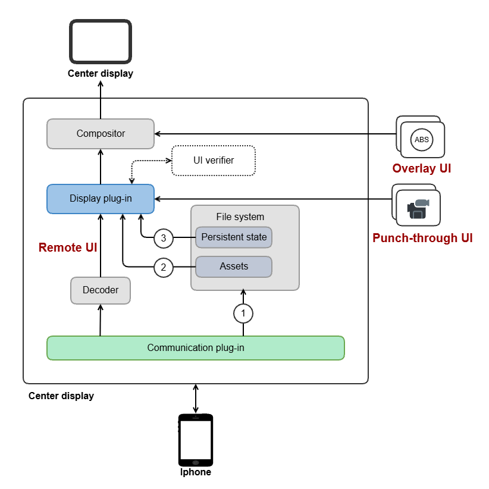
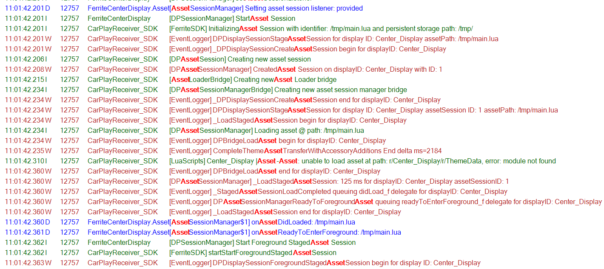
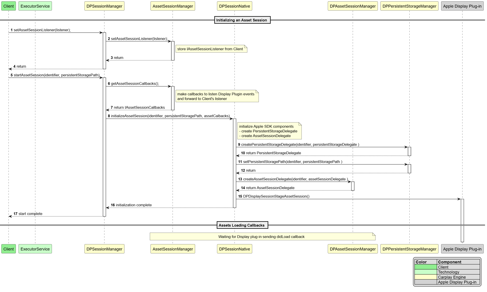
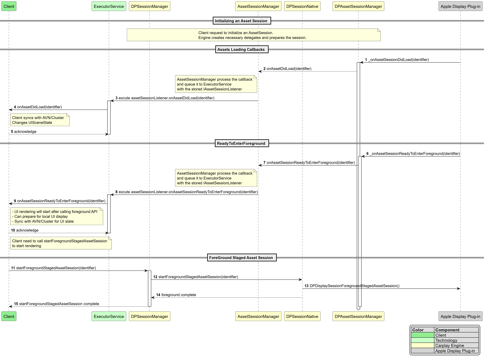
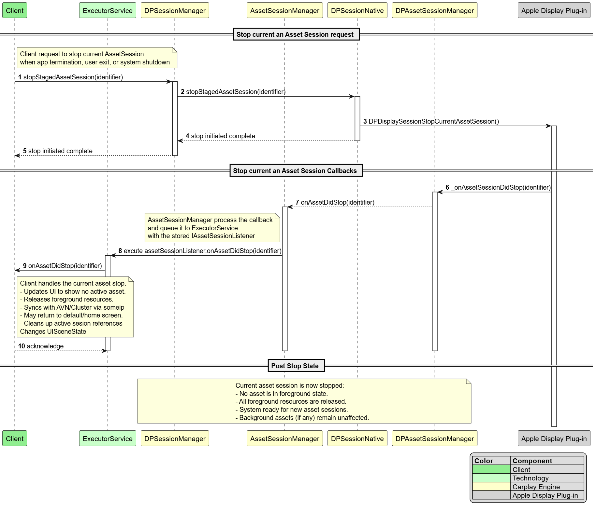
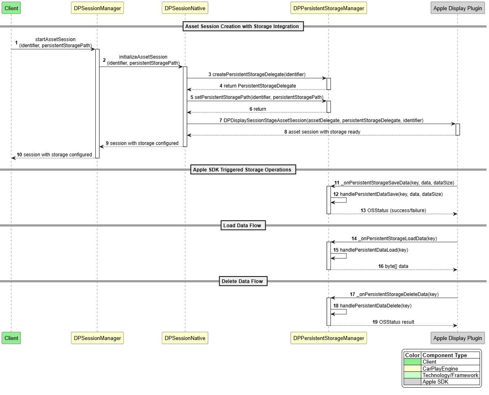

# Raw Slide Content

- Source file: FA_huy3.le/FA2025_huy3_le_version_2.pptx
- Total slides: 19

## Slide 1

Design Asset and Persistent Storage Management on Carplay Ultra

By Huy Quang Le
Mentor: Mr. Kim Tai Ho
Phone Projection Team
LGEDV

## Slide 2

Table Content
Project Overview.
Architecture Design Proposals.
Comparison and Architecture Decision.
Detailed Architecture Design.
Lesson Learned.
Q&A.

## Slide 3

Project Overview

Carplay UI is composed of content that includes 4 different rendering sources
Remote UI. Rendered by iPhone.
Local UI. Rendered by the Display plug-in local renderer that resides in the vehicle.
Punch-through UI. Rendered by the vehicle and composited in the next generation of CarPlay UI.
Overlay UI. Rendered by the vehicle as an overlay.

Image reference: slide_03_image_01.png

## Slide 4

Image reference: slide_04_image_01.png

Project Overview

Asset retrieval: Asset transfer from vehicle file system to Display plug-in.
Persistent state storage: Store and retrieve Vehicle state information in file system

Local-UI

## Slide 5

Functional Requirement

### Table
| ID | Title |
| FR.001 | Load the asset from File system to Display Plug-in. |
| FR.002 | Stage asset to render local UI. |
| FR.003 | Foreground the asset to procedure frame local UI. |
| FR.004 | Delete Asset when no longer needed. |
| FR.005 | Switch Assets when switching the connected iPhone. |
| FR.006 | Manage persistent storage operation on vehicle. |

## Slide 6

Quality Attributes

### Table
| ID | Scenario | Quality Attribute | Priority |
| QA.001 | The vehicle must load and foreground the assets on all Display plug-ins within 100 ms. | Performance | High |
| QA.002 | When adding support for a new Apple requirement, modification to existing CarPlay Engine code shall not exceed 5% of LOC. | Reusability | Medium |
| QA.003 | Maintainabilityfixes or small feature changes (< 50 LOC), implementation time shall not exceed 2 person-hours. | Reusability | Low |

## Slide 7

Image reference: slide_07_image_01.wmf

Carplay Engine Display Architecture.

## Slide 8

Image reference: slide_08_image_01.wmf

Architecture Design Proposal 1 – Manage multiple AssetSession

Pros:
Performance: identify session by object.
Reusability: organizing functionalities into objects, which improves code clarity, modularity.
Maintainability: Centralizing logic in Java simplifies maintenance
Cons:
Logic Duplication: Dependency on the Client persists.

## Slide 9

Image reference: slide_09_image_01.wmf

Architecture Design Proposal 2 – Manage single callback

Pros:
Performance: identify session by asset session ID.
Reusability: Simplifying engine code by manage single callback.
Maintainability: Reduce exchange data components via JNI
Cons:
Difficult to handle thread safe for global object.

## Slide 10

Comparison and Architecture Decision

### Table
| Criteria | Related QA | How to verify | Proposal 1: Manage Asset Sesions | Proposal 2: Singleton AssetManager |
| Handle Loading Asset | Performance | The time from start AssetSession to the Asset is loaded. | High performance (~100ms) | High performance (~100ms) |
| Component Reuse | Reusability | Measure % of Engine code modified and integration effort (target ≤5% code change) | Medium reusability (changes often propagate to both Client and Engine - Engine changes ≤5%) | High reusability (in-dependence with Client logic) |
| Maintaining Consistency | Maintainability | Measure code complexity by number of components in native layer, duplicated logic, and effort to debug (target ≤5 defects per release, <2 hours avg regression test). | High maintainability (Follow OOP principles, debugging via Android Studio) | Medium maintainability (thread-safety and native debugging increase complexity) |

Architecture decision: Proposal 2

## Slide 11

Image reference: slide_11_image_01.png

Result

## Slide 12

Current status of function implementation

### Table
| ID | Title | Status |
| FR.001 | Load the asset in the first time connection. | Done |
| FR.002 | Stage asset to render local UI | Done |
| FR.003 | Foreground the asset to proceed with frame local UI. | Done |
| FR.004 | Delete Asset | In-progress |
| FR.005 | Switch Assets when switching the connected iPhone | In-progress |
| FR.006 | The vehicle must be able to store/load/delete state information | In-progress |

## Slide 13

Q & A
Thank You

## Slide 14

Appendix: Detail Design – Class Diagram

Image reference: slide_14_image_01.wmf

## Slide 15

Appendix: Sequence Diagram – Initialize AssetSession

Image reference: slide_15_image_01.png

## Slide 16

Appendix: Sequence Diagram – Handle AssetSession Callbacks

Image reference: slide_16_image_01.png

## Slide 17

Appendix: Sequence Diagram – Stop AssetSession

Image reference: slide_17_image_01.png

## Slide 18

Appendix: Sequence Diagram – Handle Persistent Storage callback

Image reference: slide_18_image_01.png

## Slide 19

Appendix: Lessons Learned

Design Matters: I realized that spending time on the design phase is really important. A good design from the start helps avoid problems later and makes the system more stable and easier to maintain.
Modular Design Is Helpful: Breaking the system into smaller, independent parts (modules) makes the code easier to manage, reuse, and update. Each module has a clear role, which helps keep things organized.
Follow Good Design Principles: I learned the value of using software design principles like SOLID. For example, the Open-Closed Principle helps make the system flexible and easier to extend. I also used design patterns like Strategy and Factory to handle complex logic in a clean way.
Understand Requirements Clearly: Taking time to understand and break down requirements helped me design better modules. It made the system easier to build and ensured each part had a clear purpose.
Think Before Deciding: I learned to ask questions, check assumptions, and look at problems from different angles. Using data and evidence to make decisions helped me solve problems more effectively.
Teamwork and Communication Matter: Working closely with my mentor and being open to feedback helped me improve my ideas. Good communication and being willing to adjust based on suggestions made a big difference.

