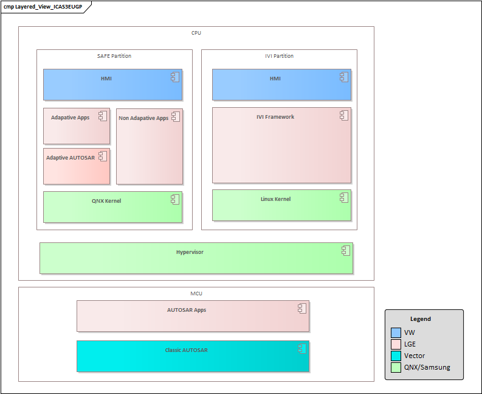
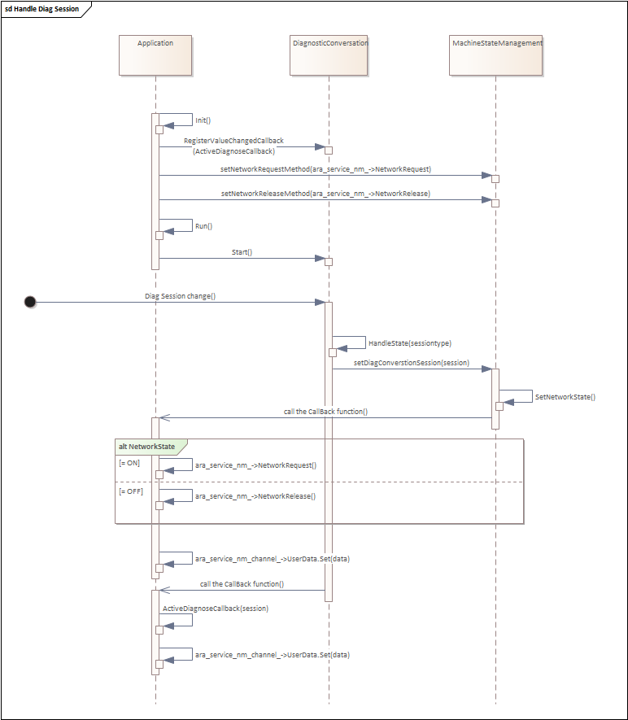
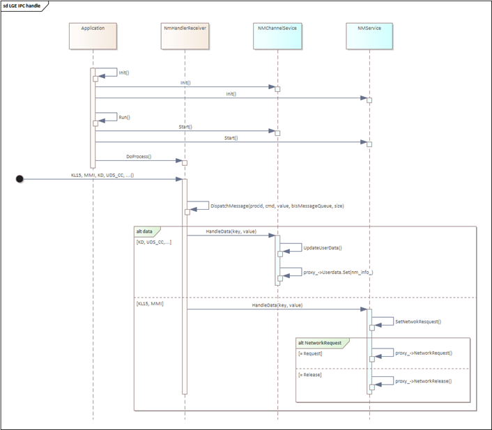
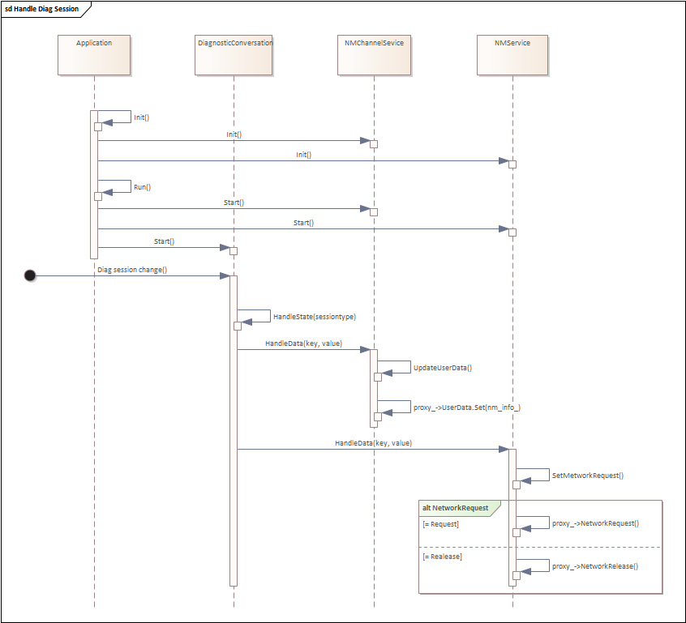
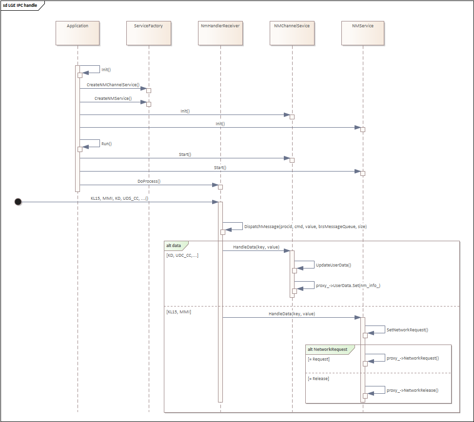
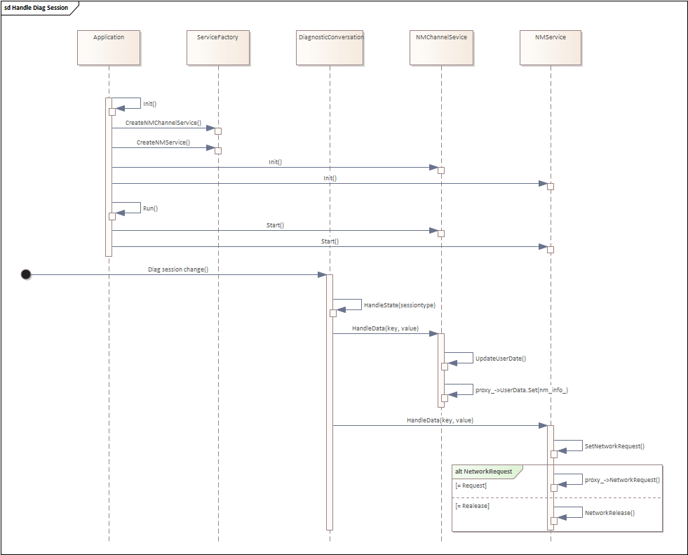
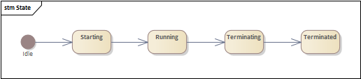
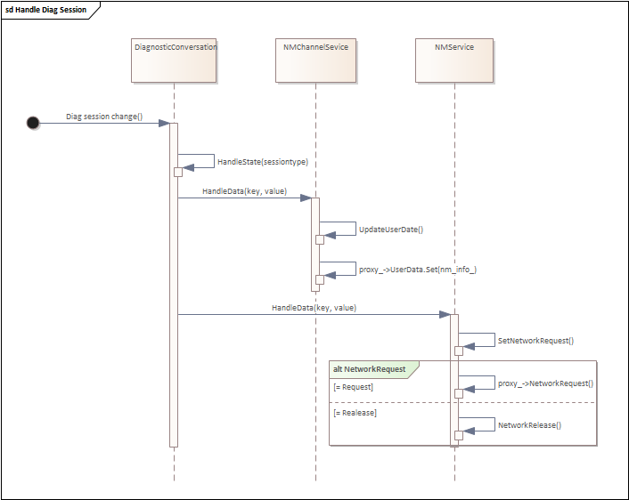
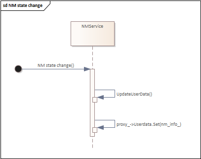

# Raw Document Content

- Source file: FA_Internal Design of Network Management Handler/FA_Improve Internal Design of Network Management Handler.docx

FA Certification task (Internal Design of Network Management Handler supports expanding features)

About This Document

Revision History

## Table
| Version | Date | Content of Change | Author | Approver |
| --- | --- | --- | --- | --- |
| 0.1 | 2024.07.15 | Initial Release | Chinh.nguyen |  |
| 1.0 | 2024.08.15 | Update proposals | Chinh.nguyen |  |
| 1.1 | 2024.08.28 | Update description of the problem and proposals | Chinh.nguyen |  |
| 1.2 | 2024.08.30 | Update description of the background, problem and proposals | Chinh.nguyen |  |
| 1.3 | 2024.09.18 | Update diagram | Chinh.nguyen |  |
| 1.4 | 2024.09.30 | Update Compare Design Proposals | Chinh.nguyen |  |

Related Documents

## Table
| Document / Spec. Title | Version | Spec. Number | Issuing Division |
| --- | --- | --- | --- |
| LAH.DUM.909.P_IP_Network_Management | V1.3 | V1.3 | VW Cockpit AUTOSAR Development Team |
| E3_1_1_UNECE_E3V_VLAN_Infotainment_KMatrix_Module | V15 | V15.03.01.07F_20230303_BAm_P02 | VW Cockpit AUTOSAR Development Team |

Abbreviations / Terms

## Table
| Abbreviation | Description |
| --- | --- |
| VM | Virtual Machine |
| EM | Execution Management |
| NM | Network Management |
| DM | Diagnostic Management |
| NMH | Network Management Handler |
| CPU | Central processing unit |
| MCU | Microcontroller Unit |
| ECU | Electronic Control Unit |
| PDU | Protocol Data Unit |
| LGE IPC | Inter-process communication library developed by LGE |
| QA | Quality Attribute |

List of images

Figure 1 ICAS3 EUGP architecture	6

Figure 2 NMH's interact overview	7

Figure 3 Current NMH static view	9

Figure 4 Current sequence handles signals received by LGE IPC	11

Figure 5 Current sequence handles diagnostic session	12

Figure 6  New NMH static view with Interface	14

Figure 7 Sequence handles signals received by LGE IPC with interface	16

Figure 8 Sequence handles diagnostic session with interface	17

Figure 9 New NMH static view with Factory pattern	18

Figure 10 Sequence handles signals received by LGE IPC with Factory pattern	21

Figure 11 Sequence handles diagnostic session with Factory pattern	22

Figure 12 Current NMH static view	24

Figure 13 New NMH static view when applied Factory pattern	25

Figure 14 NMH class diagram when applied Factory pattern	26

Figure 15 NMH state design	27

Figure 16 NMH boot up sequence	28

Figure 17 Sequence handles signals received by LGE IPC	29

Figure 18 Sequence handles diagnostic session change	30

Figure 19 Sequence handles NM state change	31

List of tables

Table 1 ICAS3 EUGP components	6

Table 2 Non-functional requirement	8

Table 3 Current class list	9

Table 4  New NMH class list with interface	15

Table 5 NMH class list with Factory pattern	19

Table 6 Compare design proposals	23

Table 7 NMH class list when applied Factory pattern	27

Table 8 Description of NMH states	27

Purpose

This document specifies the software detailed design for the Network Management Handler Application (NMH app) in VW Cockpit project. Including static design, dynamic design, and algorithm design.

This document identifies the class consisting of NMH app and describes the behaviors of those classes to accomplish the requirements upon them.

Project Background

The VW Cockpit project is a strategic initiative by Volkswagen (VW) aimed at integrating advanced digital technologies into the cockpit (interior) of their vehicles. This project is part of Volkswagen's broader push towards digital transformation and enhancing the user experience through innovative in-car technologies.

The Figure 1 is the architecture of ICAS3 EUGP:

Image reference: doc_image_001.png

Figure 1 ICAS3 EUGP architecture

ICAS3 has two processors, CPU and MCU. Software architecture has two Software partitions. SAFE partition and IVI partition run on the hypervisor Virtual Machine. Table 1 describes the components in project architecture.

## Table
| Level1 | Level2 | Level3 | Descriptions |
| --- | --- | --- | --- |
| CPU | SAFE Partition | HMI (SAFE) | - Safe partition HMI which is provided by VW |
| CPU | SAFE Partition | Adaptive Services | - Adaptive AUTOSAR Runtime Environment for Adaptive Application |
| CPU | SAFE Partition | Non-Adaptive Services | - Non-Adaptive AUTOSAR application |
| CPU | SAFE Partition | Adaptive AUTOSAR Platform | - Adaptive AUTOSAR framework - LARA (LG AutoSAR Adaptive) is used in Cockpit2022+. |
| CPU | SAFE Partition | QNX Kernel | - QNX kernel stack. - It is support Hypervisor VM. |
| CPU | IVI Partition | HMI (IVI) | - IVI partition HMI which is provided by VW |
| CPU | IVI Partition | IVI Framework | - Framework Services for IVI partition. - e.g., Media, Navigation etc. |
| CPU | IVI Partition | Linux Kernel | - IVI partition framework services run on the Linux kernel |
| CPU | Hypervisor | Hypervisor | - Red bend hypervisor |
| MCU | AUTOSAR Application | AUTOSAR Application | - AUTOSAR based applications |
| MCU | Classic AUTOSAR | Classic AUTOSAR | - Classic AUTOSAR framework |

Table 1 ICAS3 EUGP components

1: Network Management Handler Overview

1.1: Overall Descriptions.

Network Management Handler (NMH) application is one of the Adaptive AUTOSAR applications, it is located at SAFE partition in VW Cockpit project. Its main purpose is to control the network mode and update the Network Management PDU (NM PDU). NMH app will control the network mode based on the power mode signal. Besides, NMH app also collects some information about the network mode transition, the car wakes up reason, communication control, etc. to update into NM PDU.

Image reference: doc_image_002.png

Figure 2 NMH's interact overview

Figure 2 describes data flow in NMH's interaction with other applications. Power and wake-up reason information is sent from other ECUs to MCU via CAN, MCU forwards this information to MgrVCI in CPU via UART then these signals are sent to NMH via LGE IPC. Diagnostic data such as UDS communication control, KD bit is collected from DiagHandler via LGE IPC. DM will notify about session change to NMH via ara::diag API. NMH processes all this data to update NM PDU and request network mode change. NM PDU update and network mode change request will be done via NM services.

1.2: Functional Requirement of NMH app.

NMH application supports the following features:

Control network mode based on power state and diagnostic data.

Update content of NM PDU based on vehicle information.

1.3: Quality Attribute of NMH app.

In addition, from the view of developer, NMH application also need to follow quality attribute described in Table 2:

## Table
| Scenario # | QA Scenario | Quality Attribute | Priority |
| --- | --- | --- | --- |
| 1 | The application should have readability and understandability, with well-defined components and encapsulated functionality. | Maintainability | High |
| 2 | The application should be modular, break down into smaller and independent modules that perform specific function. | Modifiability | High |
| 3 | The application can be easily extended without impacting to other parts of the program. | Extensibility | Mid |

Table 2 Non-functional requirement

2:  Architectural Analysis.

2.1: Problem Identification.

To identify the problems, let's look at the current design of NMH in Figure 6 and description of each class in Table 3:

Image reference: doc_image_003.png

Figure 3 Current NMH static view

## Table
| Class/File | Jobs |
| --- | --- |
| Application (Application.cpp) | Find service to get proxy instances Subscribe and unsubscribe services Create service and handler instance Handle data to update NM PDU Request to change network mode |
| NmHandlerReceiver (nmh_receiver.cpp) | Receive message from other apps Call callbacks to Application to update NM PDU |
| DiagnosticConversation (Diagnostic_conversation.cpp) | Receive session change notification from Diagnostic Call a callback to Application to update NM PDU |
| MachineStateManagent (MachineStateManagement.cpp) | Handle KL15, MMI and Diagnostic session Call a callback to Application to change network mode |

Table 3 Current class list

The first drawback of the NMH's design is that multiple different tasks are performed in the “Application” class, which leads to complicated codes. It is responsible for initializing all the services and handlers of the application, including NmHandlerReceiver, DiagnosticConversation, MachineStateManagement, and finding services: NetworkManagementProxy, NmChannelProxy. Moreover, upon receiving messages from other applications, the “Application” class is under obligation of identifying which logical behavior needs to be done to update NM PDU data and NM mode.

Another drawback in NMH's design is the use of callback functions in the code. Current implementation of NMH includes multiple callback functions to transfer data between classes, which makes difficulty to track code.

To summarize, current design of NMH has some problems below:

Implementing multiple logics (initialize and subscribe service, handle data to update NM PDU) in class “Application”.

This makes the code more complex and harder to understand. It violates the Qualification Attribute (QA) 2 (refer to Table 2 above for more information).

If developers want to change the code, they need to read all logic in the class to determine what logic needs to be changed and whether the change affects other logic. Therefore, it also violates the QA3.

In future, if new services are added, “Application” class will become a big class. This makes the code become more complex and harder to understand, which defies the QA1.

Using multiple callback functions to pass data between classes.

This makes it difficult to track the execution flow of the code. So, developers will need to spend more time investigating the issue when an error occurs. Hence, the use of callback functions in NMH’sdesign violates the QA2.

Let’s check the following sequences of NMH source as example:

Image reference: doc_image_004.png

Figure 4 Current sequence handles signals received by LGE IPC

Image reference: doc_image_005.png

Figure 5 Current sequence handles diagnostic session

In the sequences described in Figure 4 and Figure 5, using callback function requires registration logic after object initialization. This makes initialization logic complex. The sequences also show non-linear execution flow, which makes the source code more difficult to understand and hard to debug if some issue occurs.

2.2: Architecture Design Proposals.

Based on my analysis above, I propose two approaches to improve the design of NMH. The purpose of my approaches is to simplify the class “Application” and remove the use of callback functions. Namely:

Split the logic of the Application class into smaller classes with specific functionality (e.g. each service's handler will be implemented in a separate file). This makes the code less complicated and compliant to the QA1 and QA3.

 Remove callback functions makes the code execution flow linear. It improves the maintainability of the application and meets the QA2.

In the first proposal, I separate the Application class’s logic into 2 classes: NMService and NMChannelService. The class NMService handles data to request change network mode whereas the class NMChannelService handles data to update NM PDU. I apply the interface to decouple the dependences between classes. It brings to developers a bigger room to further expand any class’s code with minimum risk of side effects on other classes.

Similar to the first proposal, the second proposal splits the class Application into two classes (NMService and NMChannelService), with the similar functionality. What makes it different to the proposal 1 is: instead of using interface, I use factory pattern to decouple the dependences between classes to widen the modifiability of the application.

I describe the proposal 1 and proposal 2 below:

Proposal 1: Separate different concerns and apply Interface

I propose a solution to split Application class into 2 classes, NMService and NMChannelService, with 2 different responsibilities for each:

•	NMService: finds the nm-service, handles data to update NM-mode based on the information of power state and diagnostic session received.

•	NMChannelService: finds the nm-channel-service, handles data to update NM-PDU based on the information power state and diagnostic data received, car-wakeup reason.

I use a common interface for both classes, so that only one class type is needed to initialize objects, which decreases the dependency between classes in the design. It also brings great capability to developers for further extend or modify the applications.

Figure 6 describes the classes and their relationship in our proposal 1.

Image reference: doc_image_006.png

Figure 6  New NMH static view with Interface

## Table
| Class/File | Jobs |
| --- | --- |
| Application (Application.cpp) | Find service to get proxy instances Subscribe and unsubscribe service Create service and handler instances |
| NmHandlerReceiver (nmh_receiver.cpp) | Receive message from other apps Forward data to NMService and NMChannelService |
| DiagnosticConversation (Diagnostic_conversation.cpp) | Receive session change notification from Diagnostic Forward data to NMService and NMChannelService |
| IService (IService.h) | Interface with a set of methods that implementing classes must provide. |
| NMService (nm_service.cpp) | Handle KL15, MMI and Diagnostic session Request to change network mode |
| NMChannelService (nm_channel_service.cpp) | Handle data to update NM PDU |

Table 4  New NMH class list with interface

Table 4 above describes the role of each class in the new design. You can see that the role of the Application is only to initialize the service instead of taking on both the initialization and logic roles to process the data.

* Steps implementing:

Split logic of Application class into two classes: NMService, NMChannelService. By this way the logic for NmChannelProxy and NetworkManagementProxy are implemented in separate file, Application class just takes care of creating services. This makes code easier to understand.

Defines a service interface (IService) with a set of methods that NMService, NMChannelService classes must implement to communicate with other classes.

Remove the callback functions by moving the references of the two classes NMChannelService and NMService into the NmHandlerReciver and DiagnosticConversation classes. Now if the NmHandlerReciver and DiagnosticConversation classes receive data from other applications, the handler function of each service will be called by its reference.

* Pros and Cons of the proposal:

Pros:

Improve readability: Reduce the number of lines of code in a file to under 500 lines. The logic for each service is implemented in a separate file. This makes code easier to understand.

Improve maintainability: Removing callback functions makes the execution flow linear so developer can easily investigate issue if errors occur.

Reduce coupling: Interface provides a way to define a contract without specifying the details implementation, so it helps reduce dependencies and makes code more modular and easier to change.

Cons:

Complexity: Using interfaces requires implementing them. So, it can lead to complex class hierarchies and proliferation of small classes. This makes the design become hard to use and complicate.

Implementation Requirements: Using interface can lead to a situation where classes are forced to implement methods that are not relevant to their core functionality.

Let's see the sequence of NMH after applying this design:

Image reference: doc_image_007.png

Figure 7 Sequence handles signals received by LGE IPC with interface

Image reference: doc_image_008.png

Figure 8 Sequence handles diagnostic session with interface

Proposal 2: Separate different concerns and apply Factory pattern

Similar to proposal 1, I split Application class into 2 classes: NMService, NMChannelService, with similar functionality.

Different from proposal 1, in proposal 2, I use Factory pattern to encapsulates and centralizes object creation logic. This means that changes to the initialization process (like changing how an object is created) don't affect the rest of application. This design make it easier to management and simplifies making modifications and makes it easier to manage.

Figure 9 describes the classes and their relationship in our proposal 2.

Image reference: doc_image_009.png

Figure 9 New NMH static view with Factory pattern

## Table
| Class/File | Jobs |
| --- | --- |
| Application (Application.cpp) | Create service and handler instances |
| NmHandlerReceiver (nmh_receiver.cpp) | Receive message from other apps Forward data to NMService and NMChannelService |
| DiagnosticConversation (Diagnostic_conversation.cpp) | Receive session change notification from Diagnostic Forward data to NMService and NMChannelService |
| NMService (nm_service.cpp) | Subscribe and unsubscribe service Handle KL15, MMI and Diagnostic session Request to change network mode |
| NMChannelService (nm_channel_service.cpp) | Subscribe and unsubscribe service Handle data to update NM PDU |
| ServiceFactory (service_factory.cpp) | Find service to get proxy instances Create NMService and NMChannelService instance |

Table 5 NMH class list with Factory pattern

Table 5 above describes the role of each class in the new design. You can see that the role of the Application is only to initialize the service instead of taking on both the initialization and logic roles to process the data.

* Steps implementing:

Split logic of Application class into two classes: NMService, NMChannelService. By this way the logic for NmChannelProxy and NetworkManagementProxy are implemented in separate file, Application class just takes care of creating services. This makes code easier to understand.

Defines a service interface (IService) with a set of methods that NMService, NMChannelService classes must implement to communicate with other classes.

Implement ServiceFactory class to manage the creation of services. All logic to create service object will be implemented in this class.

Remove the callback functions by moving the references of the two classes NMChannelService and NMService into the NmHandlerReciver and DiagnosticConversation classes. Now if the NmHandlerReciver and DiagnosticConversation classes receive data from other applications, the handler function of each service will be called by its reference.

* Pros and Cons of the proposal:

Pros:

Improve readability: Reduce the number of lines of code in a file to under 500 lines. The logic for each service is implemented in a separate file. This makes code easier to understand.

Improve maintainability: Removing callback functions makes the execution flow linear so developer can easily investigate issue if errors occur.

Single Responsibility Principle: Object creations are separated from the business logic, promoting a cleaner design.

Cons:

Complexity: Adding additional layers of abstraction, which can increase the complexity of the codebase.

Let's see the sequence of NMH after applying this design:

Image reference: doc_image_010.png

Figure 10 Sequence handles signals received by LGE IPC with Factory pattern

Image reference: doc_image_011.png

Figure 11 Sequence handles diagnostic session with Factory pattern

Compare Design Proposals.

Consider the table to see the comparison of the two above solutions:

## Table
| QA | Proposal 1 | Proposal 2 |
| --- | --- | --- |
| Maintainability | High: Separate between the abstraction and its implementations. | High: Separate between the abstraction and its implementations. Encapsulates and centralizes object creation logic. |
| Modifiability | High: Can modify implementations without modifying the existing client code. | High: Can modify factory methods without changing the client code. Centralizes object creation logic, which can make modifications easier and more contained. |
| Extensibility | High: Can add new implementations without modifying the existing client code. | High: Can add factory methods without changing the client code. |

Table 6 Compare design proposals

2.2: Architecture Decision.

Factors affecting design decision:

Separate different concerns into smaller classes, each class should have only one responsibility.

The one file must not exceed 500 lines.

Ensuring the execution flow of the code is linear, avoiding excessive branching.

From the comparison results in Table 6, both Proposal 1 and Proposal 2 can satisfy the above factors. However, the proposal 2 allows for more manageable code and promotes a cleaner architecture.

Decided as Proposal 2: Separate different concerns and apply Factory pattern.

2.3: Architecture Results.

By apply Proposal 2: Separate different concerns and apply Factory pattern the design of NMH app will be changed as follow:

Image reference: doc_image_012.png

Figure 12 Current NMH static view

Image reference: doc_image_013.png

Figure 13 New NMH static view when applied Factory pattern

3: Architecture Diagrams of NMH Application.

3.1: Static Design

The class design of the NMH App is described in Figure 14 with its descriptions in Table 7.

Image reference: doc_image_014.png

Figure 14 NMH class diagram when applied Factory pattern

## Table
| Class/File | Jobs |
| --- | --- |
| Application (Application.cpp) | Create service and handler instances |
| NmHandlerReceiver (nmh_receiver.cpp) | Receive message from other apps Forward data to NMService and NMChannelService |
| DiagnosticConversation (Diagnostic_conversation.cpp) | Receive session change notification from Diagnostic Forward data to NMService and NMChannelService |
| NMService (nm_service.cpp) | Subscribe and unsubscribe service Handle KL15, MMI and Diagnostic session Request to change network mode |
| NMChannelService (nm_channel_service.cpp) | Subscribe and unsubscribe service Handle data to update NM PDU |
| ServiceFactory (service_factory.cpp) | Find service to get proxy instances Create NMService and NMChannelService instance |
| AraComServiceFinder | This template class is used to find ara::com service. |

Table 7 NMH class list when applied Factory pattern

3.2: Dynamic Design.

3.2.1: State Design.

The NMH app shall work as the following states:

Image reference: doc_image_015.png

Figure 15 NMH state design

## Table
| State | Description |
| --- | --- |
| Idle | State before the process is created and resources are allocated. |
| Starting | State when the process is created and resources are allocated. NMH will initializes members. |
| Running | State after initializing members and report kRunning state to EM. |
| Terminating | State when EM send SIGTERM signal to NMH. |
| Terminated | State when process and resources are freed. |

Table 8 Description of NMH states

3.2.2: Interaction Design

Boot up:

When the process is created and scheduled.

Image reference: doc_image_016.png

Figure 16 NMH boot up sequence

LGE IPC handle:

When NMH app receives signal from DiagHandler (KD, UDS_CC, etc) and non-adaptive applications (KL15, MMI, car wakeup reason, etc).

Image reference: doc_image_017.png

Figure 17 Sequence handles signals received by LGE IPC

Handle diagnostic session:

When NMH app receives session change from DM.

Image reference: doc_image_018.png

Figure 18 Sequence handles diagnostic session change

NM state change:

When NMH receives NM state change from NM.

Image reference: doc_image_019.png

Figure 19 Sequence handles NM state change
