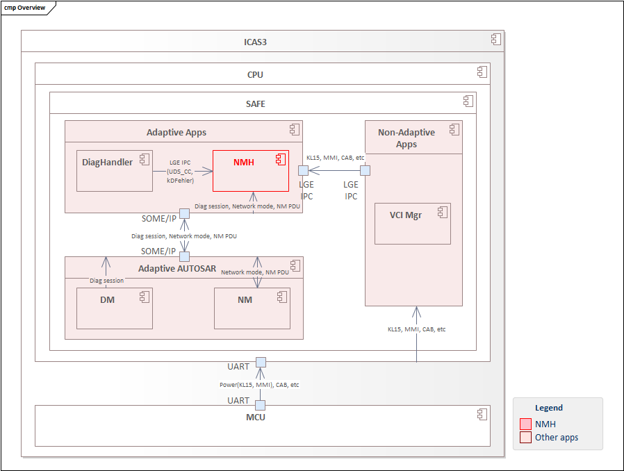
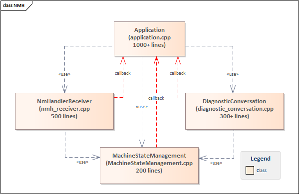
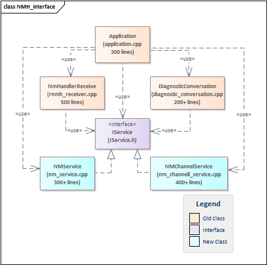
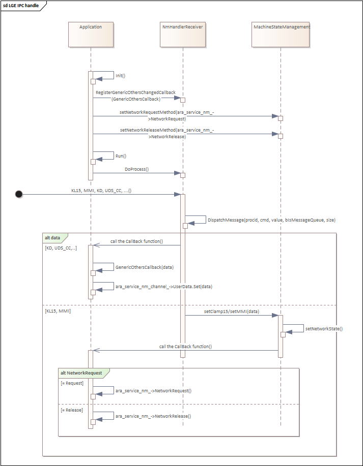
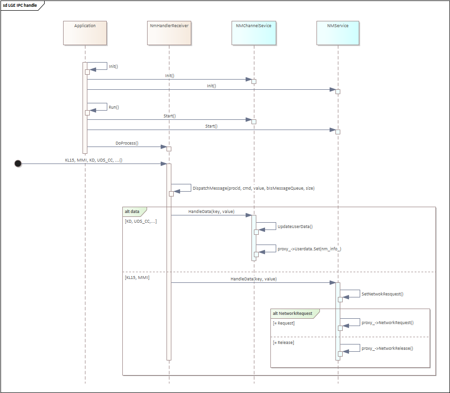
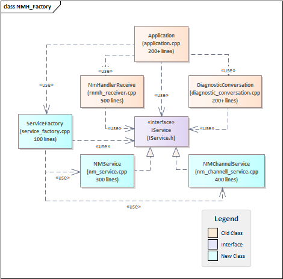
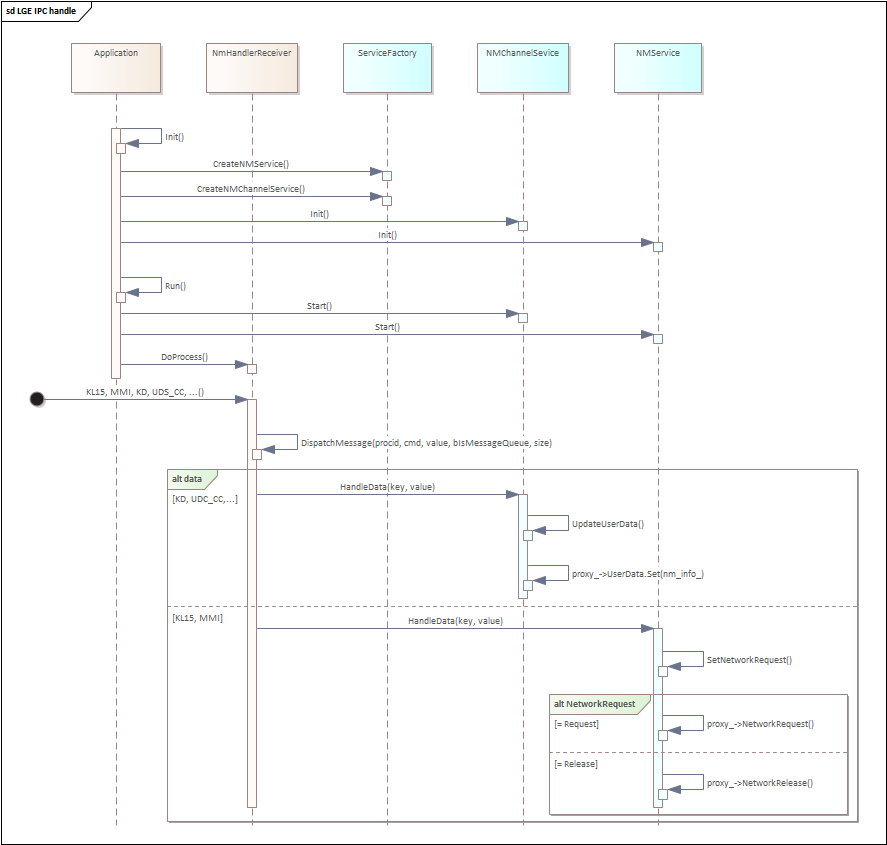
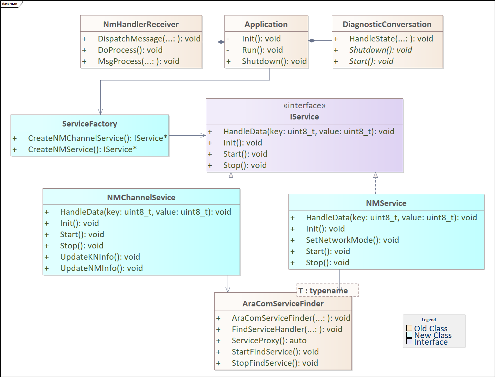
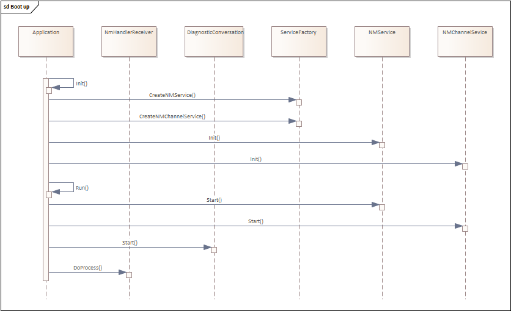
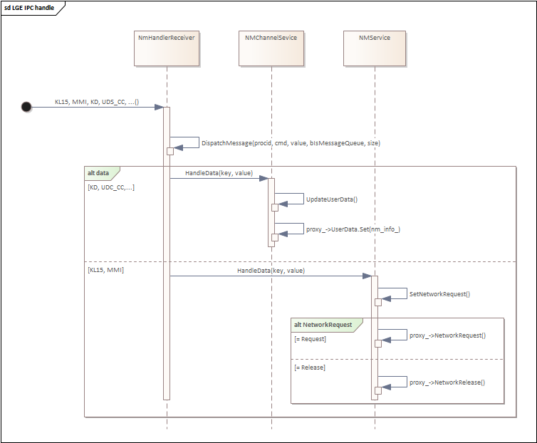

# Raw Slide Content

- Source file: FA_Internal Design of Network Management Handler/FA_Internal Design of Network Management Handler.pptx
- Total slides: 18

## Slide 1

Image reference: slide_01_image_01.png

Image reference: slide_01_image_02.png

FA 인증과제
Improve Internal Design of Network Management Handler
By chinh.nguyen
Supervised by eunhee.jeong
LGEDV
October 2024

## Slide 2

Image reference: slide_02_image_01.png

Image reference: slide_02_image_02.png

TABLE CONTENT

Overview
Problem Identification
Architecture Design Proposals & Comparison
Architecture Decision
Q&A

## Slide 3

Image reference: slide_03_image_01.png

Image reference: slide_03_image_02.png

1. Overview - Volkswagen(VW) Cockpit project

Volkswagen(VW) Cockpit project:
A strategic initiative by Volkswagen.
An integrating advanced digital technologies.
=> Enhancing user experience.

Image reference: slide_03_image_03.png

NMH

## Slide 4

Image reference: slide_04_image_01.png

Image reference: slide_04_image_02.png

1. Overview - Network Management Handler App (NMH app).

Functional Requirement:

Control network mode.
Update Network Management Payload Data Unit (NM PDU).

Image reference: slide_04_image_03.png

## Slide 5

Image reference: slide_05_image_01.png

Image reference: slide_05_image_02.png

1. Overview of NMH App.

Quality Attribute:

### Table
| Scenario # | Quality Attribute | Priority | QA Scenario |
| 1 | Maintainability | High | The application should have readability and understandability, with well-defined components and encapsulated functionality. |
| 2 | Modifiability | High | The application should be modular, break down into smaller and independent modules that perform specific function. |
| 3 | Extensibility | Mid | The application can be easily extended without impacting to other parts of the program. |

## Slide 6

Image reference: slide_06_image_01.png

Image reference: slide_06_image_02.png

2. Problem Identification

Current Architecture Design Problems

### Table
| File | Jobs |
| Application.cpp | Find service to get proxy instance Subscribe and unsubscribe service Create service and handler instances Handle data to update NM PDU Request to change network mode |
| nmh_receiver.cpp | Receive message from other apps Call callbacks to Application to update NM PDU |
| Diagnostic_conversation.cpp | Receive session change notification from Diagnostic Call a callback to Application to update NM PDU |
| MachineStateManagement.cpp | Handle KL15, MMI and Diagnostic session Call a callback to Application to change network mode |

Image reference: slide_06_image_03.png

Issue:
Implement multiple logic
Use multiple callback functions

## Slide 7

Image reference: slide_07_image_01.png

Image reference: slide_07_image_02.png

Architecture proposal 1: Separate different concerns and apply Interface.

Pros:
- Improved Readability: Separate logic into different files.
- Improved Maintainability: Removing callback functions creates a linear execution flow.
- Enhanced Extensibility and Modifiability: Defined contract without detailed implementation.
Cons:
Complexity: Adding an additional abstraction layer and requiring concrete implementations

3.1: Architecture Design Proposals

Image reference: slide_07_image_03.png

Image reference: slide_07_image_04.png

Issue:
Implement multiple logic
Use multiple callback functions

Separated logic to new class
Removed callback functions

## Slide 8

Image reference: slide_08_image_01.png

Image reference: slide_08_image_02.png

Architecture proposal 1: Separate different concerns and apply Interface.

3.1: Architecture Design Proposals

### Table
| File | Jobs |
| Application.cpp | Find service to get proxy instances Subscribe and unsubscribe service Create service and handler instances |
| nmh_receiver.cpp | Receive message from other apps Forward data to NMService and NMChannelService |
| Diagnostic_conversation.cpp | Receive session change notification from Diagnostic Forward data to NMService and NMChannelService |
| nm_service.cpp | Handle KL15, MMI and Diagnostic session Request to change network mode |
| nm_channel_service.cpp | Handle data to update NM PDU |

### Table
| File | Jobs |
| Application.cpp | Find service to get proxy instances Subscribe and unsubscribe services Create service and handler instance Handle data to update NM PDU Request to change network mode |
| nmh_receiver.cpp | Receive message from other apps Call callbacks to Application to update NM PDU |
| Diagnostic_conversation.cpp | Receive session change notification from Diagnostic Call a callback to Application to update NM PDU |
| MachineStateManagement.cpp | Handle KL15, MMI and Diagnostic session Call a callback to Application to change network mode |

List class of current design:

List class of proposal 1:

## Slide 9

Image reference: slide_09_image_01.png

Image reference: slide_09_image_02.png

Architecture proposal 1: Separate different concerns and apply Interface.

3.1: Architecture Design Proposals

Image reference: slide_09_image_03.png

Sequence of current design:

Sequence of proposal 1:

Image reference: slide_09_image_04.png

## Slide 10

Image reference: slide_10_image_01.png

Image reference: slide_10_image_02.png

Architecture proposal 2: Separate different concerns and apply Factory pattern.

3.1: Architecture Design Proposals

As-is

Image reference: slide_10_image_03.png

Image reference: slide_10_image_04.png

Pros:
Improve readability
Improve maintainability
Improve extensibility
Single Responsibility Principle
Cons:
Complexity

Separated logic to new class
Removed callback functions

Centralizes object creation logic

## Slide 11

Image reference: slide_11_image_01.png

Image reference: slide_11_image_02.png

Architecture proposal 2: Separate different concerns and apply Factory pattern.

3.1: Architecture Design Proposals

### Table
| File | Jobs |
| Application.cpp | Create service and handler instances |
| nmh_receiver.cpp | Receive message from other apps Forward data to NMService and NMChannelService |
| Diagnostic_conversation.cpp | Receive session change notification from Diagnostic Forward data to NMService and NMChannelService |
| nm_service.cpp | Subscribe and unsubscribe service Handle KL15, MMI and Diagnostic session Request to change network mode |
| nm_channel_service.cpp | Subscribe and unsubscribe service Handle data to update NM PDU |
| service_factory.cpp | Find service to get proxy instances Create NMService and NMChannelService instance |

### Table
| File | Jobs |
| Application.cpp | Find service to get proxy instances Subscribe and unsubscribe service Create service and handler instances |
| nmh_receiver.cpp | Receive message from other apps Forward data to NMService and NMChannelService |
| Diagnostic_conversation.cpp | Receive session change notification from Diagnostic Forward data to NMService and NMChannelService |
| nm_service.cpp | Handle KL15, MMI and Diagnostic session Request to change network mode |
| nm_channel_service.cpp | Handle data to update NM PDU |

List class of proposal 1:

List class of proposal 2:

## Slide 12

Image reference: slide_12_image_01.png

Image reference: slide_12_image_02.png

Architecture proposal 2: Separate different concerns and apply Factory pattern.

3.1: Architecture Design Proposals

List class of proposal 1:

List class of proposal 2:

Image reference: slide_12_image_03.png

Image reference: slide_12_image_04.png

## Slide 13

Image reference: slide_13_image_01.png

Image reference: slide_13_image_02.png

3.2: Compare Design Proposals

### Table
| Proposal 1: Using Interface | QA | Proposal 2: Using Factory |
| High: Separate between the abstraction and its implementations. | Maintainability | High: Separate between the abstraction and its implementations. Encapsulates and centralizes object creation logic |
| High: Can modify implementations without affecting the existing client code. | Modifiability | High: Can modify factory methods without affecting the client code. Centralizes object creation logic, which can make modifications easier and more contained. |
| High: Can add new implementations without modifying the existing client code. | Extensibility | High: Can add factory methods without changing the client code. |

Both proposals are good to improve NMH design but proposal 2 allows for more manageable code and promotes a cleaner architecture.
So, I decided to go with Proposal 2: Separate different concerns and apply Factory pattern

## Slide 14

Image reference: slide_14_image_01.png

Image reference: slide_14_image_02.png

4. Architecture Decision

Results:
Separate different concerns into smaller classes, each class should have only one responsibility.
The one file must not exceed 500 lines.
Remove callback function, ensure the execution flow of the code is linear, avoid excessive branching.

Image reference: slide_14_image_03.png

## Slide 15

Image reference: slide_15_image_01.png

Image reference: slide_15_image_02.png

5. Q&A

Q&A
Thank you for listening!

## Slide 16

Image reference: slide_16_image_01.png

Image reference: slide_16_image_02.png

Appendix

Boot up sequence:

Image reference: slide_16_image_03.png

## Slide 17

Image reference: slide_17_image_01.png

Image reference: slide_17_image_02.png

Appendix

LGEIPC handling sequence:

Image reference: slide_17_image_03.png

## Slide 18

Image reference: slide_18_image_01.png

Image reference: slide_18_image_02.png

Appendix

Diag Session handling sequence:

Image reference: slide_18_image_03.png

