# Raw Document Content

- Source file: FA_manh2.tran/[final]_[manh2.tran]_FA_2025_design_document_comment.docx

FA Program (Design of commonization for wifi manager)

About This Document

Document Information

## Table
| Issuing authority | Common |
| --- | --- |
| Status of document | In Progress |

Revision History

## Table
| Verion | Date | Comment | Author | Approver |
| --- | --- | --- | --- | --- |
| 0.1 | 2024.08.01 | Initial document | manh2.tran |  |
| 0.2 | 2025.09.01 | Update context diagram and architecture proposal | manh2.tran |  |
| 0.3 | 2025.09.19 | Update problem identifications, architect proposals, dynamic design and lesson learn | manh2.tran |  |

Purpose

This document specifies the software architectural design for the communization of wifi-manager.

This design document also serves as a guideline on how each software component in the system should be implemented and how the internal components/external processes should interact with each other.

Scope

This document describes the following about the wifi-manager service:

SW Architectural representation.

Audience

The software architect responsible for assessing the software design.

Participants of all projects who want to understand the wifi-manager service architecture.

Figures

Figure 1 User case view	6

Figure 2 Comparison of network attributes between station mode and access point mode	8

Figure 3 Demonstrate “scan” sequence of station mode	9

Figure 4 Demonstrate connect to network sequence of station mode	10

Figure 5 Class diagram of current design	13

Figure 6 Diagram demonstrating Chain-of-Responsibility principle	14

Figure 7 Diagram demonstrating how an event is processed in current design	15

Figure 8 Diagram demonstrating how an event is process in new design	16

Figure 9 Class diagram when applying Chain-of-Responsibility principle	18

Figure 10 class diagram when applying Chain-of-Responsibility + Abstract Factory design pattern	20

Figure 11 Basic controller	23

Figure 12 Class diagram of common station mode	24

Figure 13 Class diagram of VW Cockpit station mode	26

Figure 14 Sequence Diagram of use case connect to external AP	28

Tables

Table 1 Comparison about disabled station mode between VW Cockpit and BMW ICON	7

Table 2 quality attribute of wifi manager	12

Table 3 Design comparison	22

Table 4 common controller definition	25

Table 5 Cockpit controller definition	26

Acronyms and Abbreviations

## Table
| Abbreviation | Description |
| --- | --- |
| WPA | Wi-Fi Protected Access: a security protocol for wireless networks that uses stronger encryption than WEP, with versions for home (WPA-Personal) and business (WPA-Enterprise) use. |
| AP | Access Point: a device that allows wireless devices to connect to a wired network using Wi-Fi. It acts as a bridge between the wireless clients and the wired network, extending network coverage. |
| WLAN | Wireless local area network: network that connects devices wirelessly within a limited area, such as a home or office, using Wi-Fi. It allows devices to communicate without the need for physical cables. |
| IP | Internet Protocol: system that defines how devices are identified and how data is routed across a network. It assigns a unique address (IP address) to each device, allowing them to communicate with each other over the internet. |

1. Project Context

1.1. Project overview and background explanation

Modern electronic devices are increasingly equipped with Wi-Fi functionality, enabling them to either connect to external networks or receive connection requests from other devices. To support this capability, the Wi-Fi function has been standardized, and the widely used open-source library wpa-supplicant was developed to manage the operational states of Wi-Fi connections.

To ensure compatibility with the standardized Wi-Fi operations, chipset manufacturers provide drivers that integrate seamlessly with wpa-supplicant. However, it is important to note that wpa-supplicant is only offered as a third-party library, without direct adaptation for specific application use cases.

For this reason, an adaptive layer, referred to as the Wi-Fi Manager, must be developed. This layer is responsible for handling application requests, managing networks, and interacting with wpa-supplicant in a controlled manner. By introducing this Wi-Fi Manager, the system achieves a structured interface that bridges application-level logic with the underlying third-party Wi-Fi management library, ensuring better maintainability, flexibility, and integration across different platforms.

1.2. Function Requirements

1.2.1 Functional requirements

Image reference: doc_image_001.png

Figure 1 User case view

The diagram represents the use cases and functional requirements of the Wi-Fi service. At a functional level, the service must support enabling and disabling Station Mode, allowing the device to operate as a client and connect to existing Wi-Fi networks. Another key functional requirement is the ability to enable and disable Access Point Mode, enabling the device to provide hotspot functionality for other devices. In addition, the service includes the requirement to scan for available Wi-Fi networks, which helps discover surrounding access points. Finally, the service must allow the user to connect to or disconnect from a selected Wi-Fi network. Together, these use cases define the essential functional requirements for managing Wi-Fi connectivity.

1.2.2. Enable/Disable Station Mode

Station mode represents the Wi-Fi functionality that allows a device to connect to an external network (Access Point).

When referring to station mode, it always corresponds to a specific network interface. Each network interface can operate either as a station or as an access point, but not both simultaneously.

A station mode is considered “enabled” when all the following conditions are met:

The network interface is set to UP.

A wpa-supplicant daemon is started to monitor the specific network interface.

The Wi-Fi manager establishes a successful connection with the wpa-supplicant daemon to send requests.

The Wi-Fi manager successfully subscribes to the wpa-supplicant daemon to receive incoming events.

The Wi-Fi manager can process create/delete network commands.

While the definition of an “enabled” station mode remains consistent across projects, the interpretation of a “disabled” station mode may differ.

From experience with the VW Cockpit and BMW ICON projects, two distinct types of “disabled” states can be identified, as summarized in the table below:

## Table
| Property | VW Cockpit | BMW ICON |
| --- | --- | --- |
| A network interface is UP | √ | × |
| A wpa-supplicant daemon is started | √ | × |
| Wifi-manager connects to wpa-supplicant daemon | √ | × |
| Wifi-manager subscribes to wpa-supplicant daemon | √ | × |
| Wifi-manager processes create/delete network commands | × | × |

Table 1 Comparison about disabled station mode between VW Cockpit and BMW ICON

1.2.3. Enable/Disable Access Point Mode

Access Point Mode presents for Wi-Fi function that allows device to appear as an access point that allows other devices to make connection.

The same as station mode, the access point mode means the mode corresponding to a specific network interface. Once the interface behaves as an access point, it cannot behaves like a station, and vice versa.

Access point mode is marked “enabled” when all below properties are satisfied:

A network interface is UP.

A wpa-supplicant daemon is started to monitor the specific network interface.

wifi-manager connects to wpa-supplicant daemon successfully to send request

wifi-manager subscribes to wpa-supplicant daemon successfully to listen incoming events

wifi-manager processes create/delete network commands.

From what we have defined, there is no difference in properties between access point mode or station mode. Below picture will describe the difference.

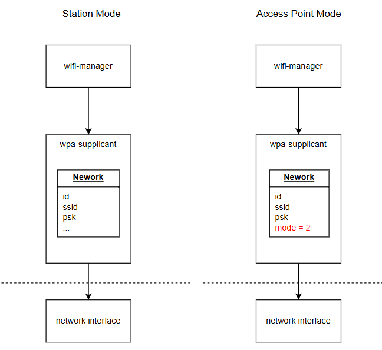
Image reference: doc_image_002.png

Figure 2 Comparison of network attributes between station mode and access point mode

The picture brings the basic idea about how to work with wpa-supplicant. Wifi-manager will send request to wpa-supplicant to generate a network, then send other requests to change network attributes like ssid, psk. Finally:

We can use network to perform station function.

Or we can change network mode = 2, to perform access point function.

1.2.4. Scan Wi-Fi networks

When station mode is enabled, the device should have ability to scan around APs (Access Point).

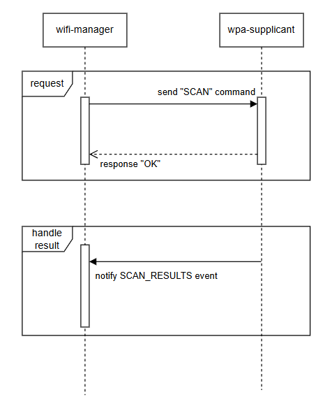
Image reference: doc_image_003.png

Figure 3 Demonstrate “scan” sequence of station mode

1.2.5. Connect/Disconnect a network

When station mode is enabled, the device should have ability to connect to an external access point.

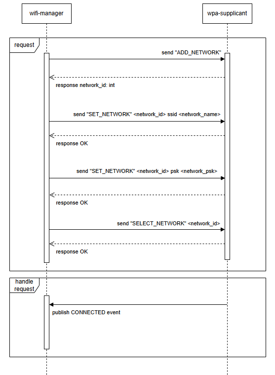
Image reference: doc_image_004.png

Figure 4 Demonstrate connect to network sequence of station mode

1.3 Problem Identifications

1.3.1 Scalability Issue

As the system evolves, the number of product or feature variants continues to grow. This expansion introduces a significant scalability challenge. In practice, each new variant often requires additional code, which increases the likelihood of duplication across different modules. Even small differences in implementation can accumulate over time, making the overall codebase more complex and harder to maintain. This not only raises development and maintenance costs but also reduces the ability to quickly extend the system with new functionality. Without addressing scalability concerns, long-term system growth will become inefficient and unsustainable.

1.3.2. Tightly Coupled Components

The current architecture exhibits a high degree of coupling between components. Many components are heavily dependent on one another, which reduces modularity and hinders independent development. When changes are required in one component, there is often a cascading effect on several other modules, leading to longer development cycles and increased testing effort. Tightly coupled components also reduce system flexibility, making it more difficult to adopt new technologies, refactor existing code, or scale specific parts of the system independently. This lack of modularity becomes a critical obstacle as the system grows in complexity.

1.3.3 Conclusion

To address these challenges, commonization is required across the system. Establishing common components and shared implementations will help reduce code duplication, minimize variations that cause inconsistent behavior, and decouple system modules for greater modularity. This approach will improve scalability, enhance maintainability, and enable faster adaptation to future requirements.

1.4. Quality Attributes

Based on the identified problems—namely scalability issues, inconsistent behavior, and tightly coupled components—the following quality attributes are defined as key non-functional requirements for the wifi-manager system. These attributes are intended to ensure that the design not only resolves current challenges but also supports long-term sustainability, maintainability, and adaptability.

## Table
| ID | Quality Attribute | Priority | Scenario |
| --- | --- | --- | --- |
| QA.001 | Reusability | High | Common logic across variants should be reused |
| QA.002 | Modifiability | High | Modification on a variant should not impact to other variants |
| QA.003 | Extensibility | High | Feature extensions for a specific variant should be implemented with minimal effort. |
| QA.004 | Maintainability | Medium | Fix in common logic should automatically benefit all variants without duplication of effort. |
| QA.005 | Testability | Medium | The design should be easy to write Unit Test |
| QA.006 | Performance | Medium | Delay between request and response should be low |

Table 2 quality attribute of wifi manager

QA.001 – Reusability (High Priority): To address code duplication and scalability concerns, common logic across different variants should be consolidated and reused. Reusability ensures that core functionalities are implemented once and shared across all modules, reducing redundancy and improving efficiency.

QA.002 – Modifiability (High Priority): Given the problems caused by tightly coupled components and inconsistent implementations, it is essential that modifications in one variant do not unintentionally affect others. High modifiability will allow developers to adapt or enhance a specific variant without introducing side effects elsewhere, thereby improving reliability and reducing regression risks.

QA.003 – Extensibility (High Priority): Scalability limitations also highlight the need for extensibility. New features or extensions required by a specific variant should be implemented with minimal effort. This attribute ensures that future requirements can be integrated smoothly without requiring widespread changes to the existing codebase.

QA.004 – Maintainability (Medium Priority): Tightly coupled components make system maintenance complex. Therefore, fixes or improvements made to shared logic should automatically propagate to all variants without requiring duplicated work. Enhanced maintainability reduces development overhead and simplifies long-term system evolution.

QA.005 – Testability (Medium Priority): Inconsistencies across variants have made it difficult to guarantee uniform quality. To mitigate this, the system design should facilitate easy unit testing. Improved testability ensures that common logic and variant-specific implementations can be validated quickly, thereby increasing confidence in system reliability and accelerating the testing process.

QA.006 – Performance (Medium Priority): The design should focus on the atomic of each event, so no event will take long time to be processed.

1.5. Idea for new design

1.5.1 Cons of current design

Image reference: doc_image_005.png

Figure 5 Class diagram of current design

The current design of the wifi-manager system demonstrates a highly interdependent architecture, where multiple components are tightly coupled with each other. This coupling is evident from the complex network of direct dependencies illustrated in the diagram.

High Degree of Coupling: Core components such as WifiManServer, StationController, and ApController are connected to multiple other modules. WifiManServer, in particular, aggregates responsibilities from various controllers and utilities (e.g., StationController, ApController, WifiInjector, CountryCode), making it a central dependency hub.

Propagation of Change: Because of these tight couplings, a modification in one component often requires corresponding updates in multiple dependent modules. For instance, changes to WifiNative may propagate across StationController, WifiScanner, CountryCode, and ApController. This increases the risk of unintended side effects and regression issues.

Reduced Maintainability and Testability: The high interconnectivity complicates unit testing, as individual components cannot be easily isolated from their dependencies. Maintenance costs are also increased since developers need to understand a large portion of the system to implement changes safely.

1.5.2 New design bases on Chain-of-Responsibility design pattern

To overcome these issues, a decoupled architecture is proposed based on the Chain-of-Responsibility principle.

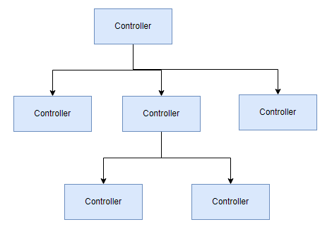
Image reference: doc_image_006.png

Figure 6 Diagram demonstrating Chain-of-Responsibility principle

In this approach:

Controllers are organized in a chain where each component handles requests relevant to its responsibility and passes along unhandled requests to the next controller.

A controller has minimal or no knowledge about the internal details of other controllers. This reduces direct dependencies and promotes loose coupling.

The responsibility distribution is more balanced, eliminating the bottleneck of a single central component.

1.5.3 How an event is processed in current design

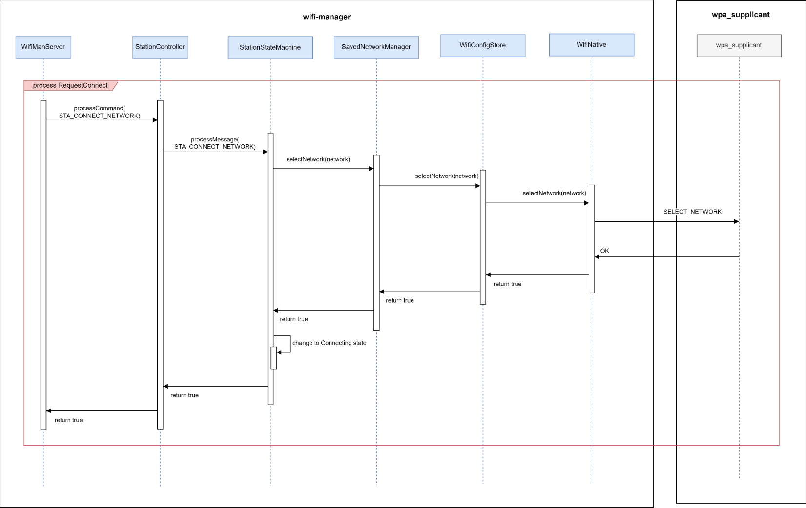
Image reference: doc_image_007.png

Figure 7 Diagram demonstrating how an event is processed in current design

In the current design, event processing relies on direct references between components. Each module explicitly depends on the next one in order to delegate the task. This creates a tightly coupled flow, where every step must know exactly which component to call.

Event Processing Flow:

WifiManServer starts the process by obtaining a reference to StationController in order to handle STA_CONNECT_NETWORK message. The message then be processed by order : WifiManServer -> StationController ->StationStateMachine -> SavedNetworkManager -> WifiConfigStore ->WifiNative -> wpa_supplicant

The responses are returned in reverse order: from wpa_supplicant → WifiNative → WifiConfigStore → SavedNetworkManager → StationStateMachine → StationController → WifiManServer.

Cons:

Direct Dependencies: Each component explicitly calls the next one, creating strong coupling.

Sequential Response Handling: Responses must follow the reverse path of the original requests.

Limited Flexibility: Any change in the sequence or the addition of a new component requires modifications across multiple modules.

This design ensures that requests and responses are processed in a strict order, but at the cost of flexibility and maintainability due to the heavy inter-dependency between modules.

1.5.4 How new design will process an event

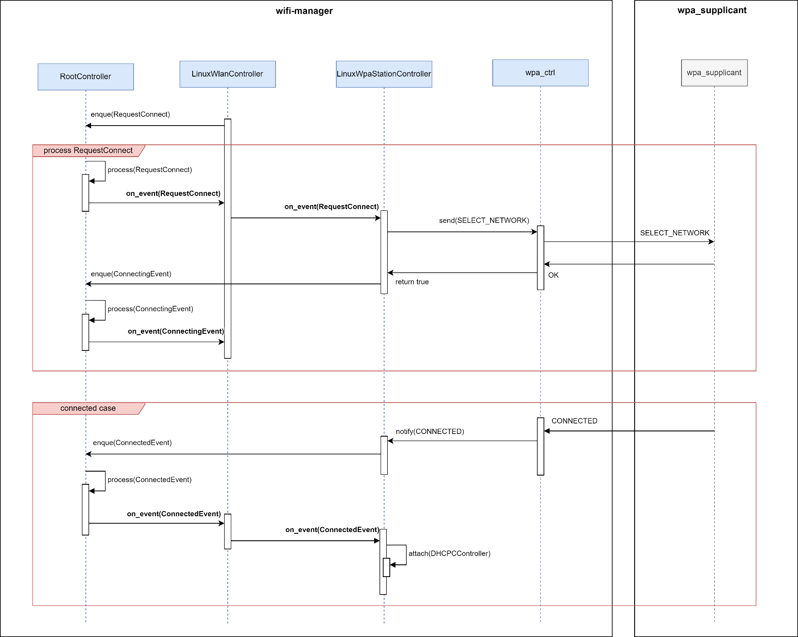
Image reference: doc_image_008.png

Figure 8 Diagram demonstrating how an event is process in new design

The new design introduces an event-driven mechanism where controllers communicate indirectly through a RootController. Instead of directly invoking each other, controllers generate and propagate events. This approach aligns with the Chain-of-Responsibility principle, enabling a loosely coupled interaction model.

Event Creation and Propagation

A controller generates an event and posts it to the RootController.

The RootController propagates this event sequentially through the chain of sub-controllers.

The event is passed through sub-controllers in top-down, from parent to children.

Every controller can override on_event method to capture and handle the event.

Advantages of the New Event-Driven Flow

Loose Coupling: Controllers no longer need direct references to one another, reducing interdependencies.

Flexibility: New controllers or event types can be added without significant modifications to the existing chain.

Clarity of Responsibility: Each controller is responsible for processing only specific events, improving modularity.

Improved Maintainability: Changes in event handling logic are localized within the relevant controller.

This mechanism ensures that the system remains scalable, maintainable, and extensible, while still enabling controllers to collaborate effectively through an event-driven chain managed by the RootController.

2. Architecture alternatives to solve the problem

2.1 Architecture Design Proposal 1 : Chain-of-Responsibility + Singleton Design Pattern

Image reference: doc_image_009.png

Figure 9 Class diagram when applying Chain-of-Responsibility principle

In this diagram, the flow of messages between controllers can be seen as a chain, where each controller has the responsibility to handle specific types of messages or events. The controllers are organized in a parent-child structure, and messages are passed through the chain from one controller to another until the appropriate controller handles it. This is characteristic of the Chain of Responsibility pattern.

Here’s how it aligns with the pattern:

RootController is the entry point and can propagate messages to its child controllers (like WlanServiceController, NicController, etc.). It manages a queue of messages and passes them along to the appropriate controller in the chain.

WlanServiceController, NicController, WpaController, WpaStationController, and WpaAccessPointController are each responsible for handling specific types of messages related to network management (e.g., Wi-Fi connection, IP configuration, WPA events, etc.).

The pattern is implemented through the method on_listen(Message), which is likely responsible for processing the incoming message. The controller can either handle the message or pass it along the chain (to its child controllers) until one of them processes it. This is what the diagram suggests when showing controllers with message handling methods like on_nic_to_station(), on_scan(), on_connect(), etc.

The addChild and removeChild methods show that child controllers can be added or removed dynamically, ensuring that the chain of responsibility remains flexible.

Chain of Responsibility allows each controller to process or forward the message to another controller in the chain. The controllers work together to ensure that the right message is handled by the right component (e.g., WpaController for WPA-related events or NicController for IP-related messages). The flow of messages follows a chain, with each controller either handling the message or passing it on to the next in line.

2.2 Architecture Design Proposal 2: Chain-of-Responsibility + Abstract Factory Design Pattern

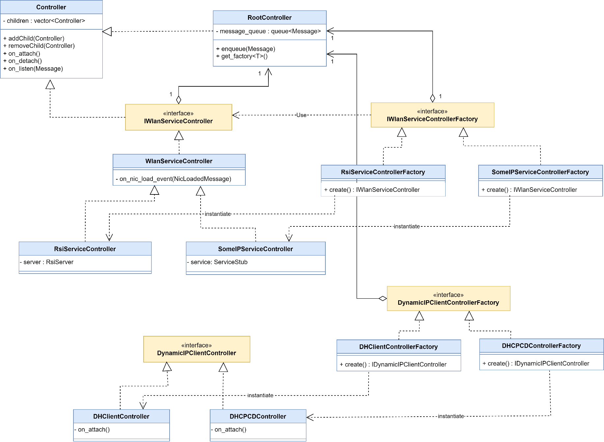
Image reference: doc_image_010.png

Figure 10 class diagram when applying Chain-of-Responsibility + Abstract Factory design pattern

The updated diagram introduces the Abstract Factory design pattern alongside the Chain of Responsibility pattern. The addition of the factory pattern enhances the flexibility and modularity of the system, making it easier to create and manage different types of controllers dynamically.

The RootController has been updated to include the get_factory<T>() method. This method retrieves the appropriate factory interface, allowing it to dynamically instantiate and manage different types of controllers based on the needs of the system. This change integrates the Abstract Factory pattern, which provides an interface for creating families of related or dependent objects without specifying their concrete classes. It allows the system to handle different types of network services or IP clients without tightly coupling the controller creation logic to the specific implementation.

The diagram introduces two main factory interfaces:

IWanServiceControllerFactory: This interface is designed to create IWanServiceController objects. The factory interfaces decouple the instantiation process, allowing RootController to instantiate different IWanServiceController implementations, such as RsiServiceController or SomeIPServiceController, depending on the network requirements.

IDynamicIPClientControllerFactory: This interface creates instances of IDynamicIPClientController objects. This abstraction enables dynamic creation of IP client controllers like DHClientController and DHCPCCDController.

Service-Specific Controllers and Their Factories

RsiServiceController: This controller is responsible for managing network services related to RsiServer, with the server attribute indicating its dependency on the RsiServer service.

SomeIPServiceController: This controller is linked to a service represented by ServiceStub, suggesting that it handles some specific IP services, and it is instantiated via SomeIPServiceControllerFactory.

Each service controller is created through the respective factory, such as RsiServiceControllerFactory or SomeIPServiceControllerFactory, further abstracting the instantiation logic.

Dynamic IP Client Controllers and Their Factories

DHClientController and DHCPCCDController: These controllers handle dynamic IP client functionalities. They are managed by their respective factory interfaces, DHClientControllerFactory and DHCPCCDControllerFactory. These controllers implement the IDynamicIPClientController interface, which defines methods like on_attach() to handle dynamic IP assignments, ensuring that IP client management is flexible and can support different IP allocation mechanisms.

This proposal combines Chain of Responsibility and Abstract Factory design patterns to improve the system’s modularity and flexibility. The Chain of Responsibility pattern is used to manage message propagation across different controllers, while the Abstract Factory pattern ensures that the correct type of controller is created dynamically based on the system’s requirements. This dual-pattern approach allows the system to efficiently manage various network services and IP client controllers without hardcoding dependencies, promoting scalability and ease of maintenance.

3. Comparison and Decision

## Table
| No | Quality Attributes | Scenarios | Proposal 1 | Proposal 2 |
| --- | --- | --- | --- | --- |
| QA.001 | Reusability | Common logic across variants should be reused | High. Each controller is designed for a specialized task, making it reusable across multiple variants | High. Each controller is designed for a specialized task, making it reusable across multiple variants |
| QA.002 | Modifiability | Modification on a variant should not impact to other variants | Medium. A modification for one variant my impact other variants if it is made on a shared controller | Medium. The factory pattern can help reduce number of controllers shared across variants, however there will still be some shared controllers to optimize reuse |
| QA.003 | Maintainability | Fix in common logic should automatically benefit all variants without duplication of effort. | Medium. Some sequences depend on certain controllers, and managing them in depth is not necessarily easy | Medium. Some sequences depend on certain controllers, and managing them in depth is not necessarily easy |
| QA.004 | Extensibility | Feature extensions for a specific variant should be implemented with minimal effort. | Medium. Add new feature, controller may impact to shared controller across variants | High. The factory pattern helps ensure that modifications and feature configurations do not affect the logic of parent controller |
| QA.005 | Testability | The design should be easy to write Unit Test | Low. Global state and hidden dependencies make the system harder to test | Medium. Dependencies can be mocked easily |
| QA.006 | Performance | Delay between request and response should be low | Medium. design atomic event to communicate with external module asynchronously so latency should be low | Medium. design atomic event to communicate with external module asynchronously so latency should be low |

Table 3 Design comparison

Overall, Proposal 2 demonstrates a stronger design with improvements in extensibility and testability while maintaining the same level of modifiability, reusability, and maintainability as Proposal 1. The adoption of the factory pattern provides better flexibility for future growth and simplifies testing, making Proposal 2 more favorable in terms of long-term maintainability and scalability.

4. Detailed Architecture Design

4.1 Static Design

4.1.1 Basic Controller

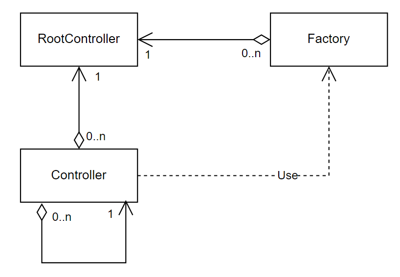
Image reference: doc_image_011.png

Figure 11 Basic controller

The diagram illustrates a controller-based architecture, where a RootController serves as the central entry point, delegating responsibilities to multiple sub-controllers. Each controller is specialized in managing a particular function, while object creation is abstracted into a Factory component. This design promotes a clear separation of concerns, reduces coupling between layers, and enables flexible orchestration of system components. By organizing logic into hierarchical controllers, the system achieves better structure, scalability, and adaptability compared to a monolithic or library-based approach.

Modifiability: The modular separation between the RootController, sub-controllers, and the Factory allows changes to be implemented in isolation. For instance, modifying the way objects are instantiated only affects the Factory without requiring modifications to the controllers. This reduces the risk and cost of updates, making the system highly adaptable to new requirements.

Reusability: Controllers are designed with focused responsibilities and minimal dependencies. As a result, they can be reused across different projects or subsystems with little or no modification. The Factory further contributes to reusability by encapsulating object creation logic in a standardized way, which can be applied in multiple contexts.

Maintainability: The architecture enforces high cohesion and clear separation of concerns, which makes the system easier to understand, troubleshoot, and maintain. Problems can be localized to specific controllers or the Factory, reducing debugging complexity. Consistency in controller design patterns improves maintainability across the system’s lifecycle.

Extensibility: The design supports straightforward extension by adding new controllers or enhancing existing ones without disrupting the existing structure. Since each controller operates independently, the system can evolve naturally with minimal refactoring. This provides long-term flexibility to accommodate future requirements and growth.

4.1.2. Class Diagram of common station mode

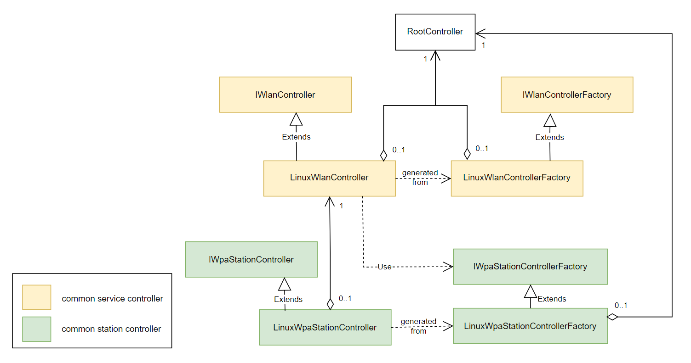
Image reference: doc_image_012.png

Figure 12 Class diagram of common station mode

The diagram illustrates a controller–factory design that organizes WLAN and WPA control logic into clear abstraction layers. At the core, interfaces define the expected behavior of controllers, while concrete Linux-based implementations provide the actual functionality. Factories are responsible for instantiating these controllers, ensuring loose coupling and easier substitution of implementations. The RootController acts as the top-level coordinator, managing the lifecycle and interaction of the underlying controllers.

This separation of concerns supports modularity, enhances testability, and allows the design to be extended to different platforms or environments without major architectural changes.

## Table
| Controller / Factory | Meaning |
| --- | --- |
| RootController | Top-level coordinator and entry point; owns and orchestrates concrete controllers (e.g., WLAN and WPA station controllers). |
| IWlanController | Interface defining generic WLAN service |
| LinuxWlanController | Concrete implementation of IwlanController, process events to expand station or access point functions |
| IwlanControllerFactory | Interface for creating IwlanController instances; abstracts construction details from callers. |
| LinuxWlanControllerFactory | Factory that instantiates LinuxWlanController |
| IwpaStationController | Interface specifying station-mode WPA control (configure network, connect/disconnect, event handling). |
| LinuxWpaStationController | Concrete station controller for Linux wpa_supplicant; implements IwpaStationController. |
| IwpaStationControllerFactory | Interface for creating station-mode WPA controllers; standardizes how instances are produced. |
| LinuxWpaStationControllerFactory | Factory that builds LinuxWpaStationController objects |

Table 4 common controller definition

4.1.3. Class diagram of VW Cockpit station mode

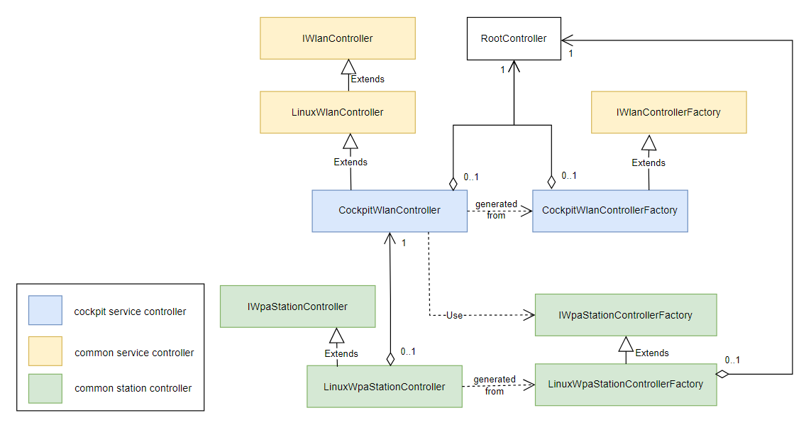
Image reference: doc_image_013.png

Figure 13 Class diagram of VW Cockpit station mode

This diagram extends the previous controller–factory architecture by introducing a new abstraction layer called CockpitWlanController and its associated CockpitWlanControllerFactory.

Key Extensions Compared to the Previous Diagram:

## Table
| Controller / Factory | Meaning |
| --- | --- |
| CockpitWlanController | Inherits from LinuxWlanController, meaning it still provides Linux-specific WLAN control but with cockpit-related logic or extensions on top. Acts as the concrete controller instance owned by RootController. |
| CockpitWlanControllerFactory | Factory responsible for generating CockpitWlanController instances. Extends from IWlanControllerFactory, just like the LinuxWlanControllerFactory in the earlier design, but tailored for cockpit-specific controllers. |

Table 5 Cockpit controller definition

The relationship between CockpitWlanController and LinuxWpaStationController remains similar to the earlier diagram, where it uses the WPA station functionality for network management.

The WPA-related hierarchy (IWpaStationController, LinuxWpaStationController, and their factory) is unchanged.

This extension demonstrates how the design can be adapted for new contexts (e.g., cockpit systems) without disrupting the core architecture. By layering CockpitWlanController on top of LinuxWlanController, the design maintains separation of concerns, allowing cockpit-specific functionality to be added while reusing the existing Linux WLAN logic. This enhances extensibility and reusability, showing the scalability of the controller–factory pattern.

Figure 08. VW Cockpit class diagram inherits from common class diagram

4.2 Dynamic Design

4.2.1 Dynamic Design of use case Connect to external AP

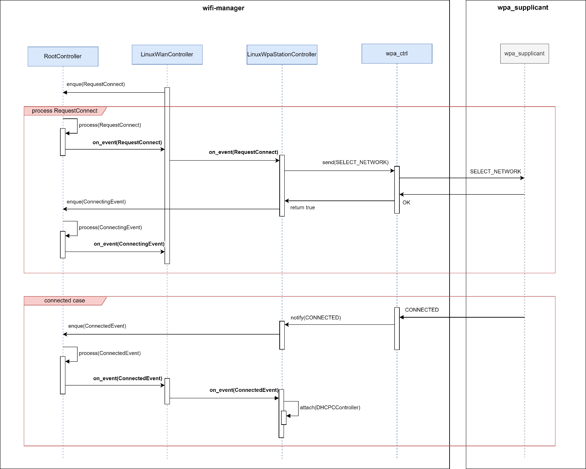
Image reference: doc_image_014.png

Figure 14 Sequence Diagram of use case connect to external AP

Above sequence diagram shows how use case connect to external AP is implemented.

Firstly, LinuxWlanController will post a RequestConnect to RootController. This request includes information of external AP such as ssid, psk, security type …

Then, RootController will propagate RequestConnect to sub-controllers, this request will pass through several controllers until it reaches LinuxWpaStationController.

LinuxWpaStationController then:

Post ConnectingEvent to RootController

Use data from RequestConnect to communicate with wpa_supplicant through wpa_ctrl interface.

RootController, after received ConnectingEvent will propagate this event to sub-controllers, this event then reach LinuxWlanController. At this point, it can publish CONNECTING state to subscribers.

After connection is established successfully, wpa_supplicant will send CONNECTED message to wifi-manager through wpa_ctrl interface. Then, LinuxWpaStationController will post a ConnectedEvent to RootController.

RootController again propagate ConnectedEvent to sub-controllers:

LinuxWlanController will handle ConnectedEvent, now it can publish CONNECTED state to subscribers.

LinuxWpaStationController will handle ConnectedEvent also, DHCPCDController now can be created and attached as child of LinuxWpaStationController, it means we can fork a dhcpcd process to handle ip address for specific interface (wlan0 for example).

5. Verification results

5.1 Perform wifi functions through command lines

Scan network using interface wlan0

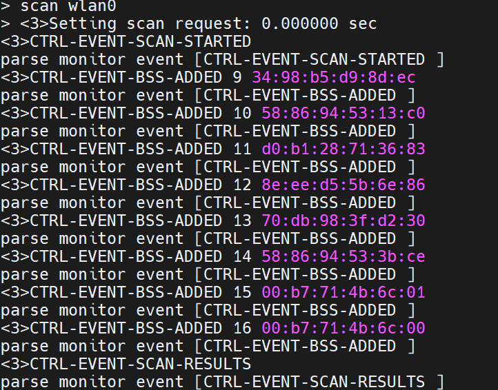
Image reference: doc_image_015.png

show scan results of interface wlan0

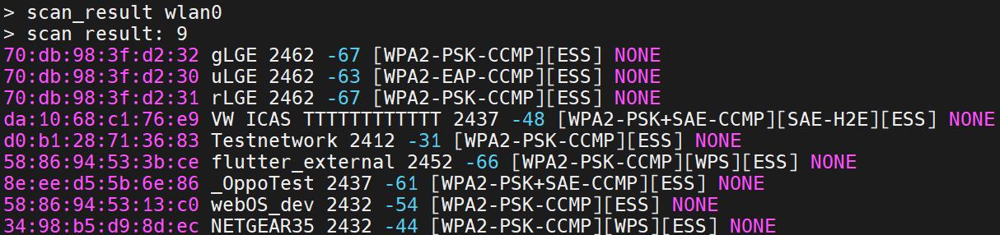
Image reference: doc_image_016.png

connect to network ssid=Testnetwork, psk=11112222 using wlan0

Image reference: doc_image_017.png

disconnect network wlan0

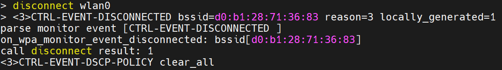
Image reference: doc_image_018.png

5.2 Replace VW Cockpit wlanmgr

5.2.1 Access Point Mode

- get network information

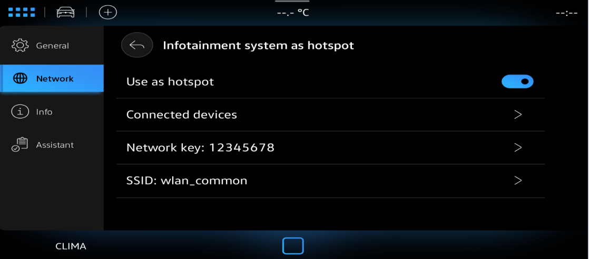
Image reference: doc_image_019.png

get connected devices

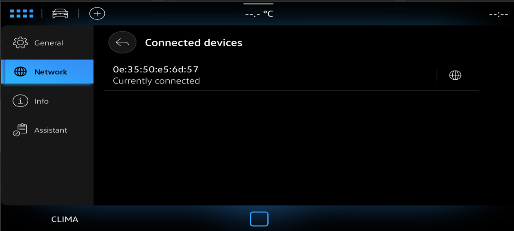
Image reference: doc_image_020.png

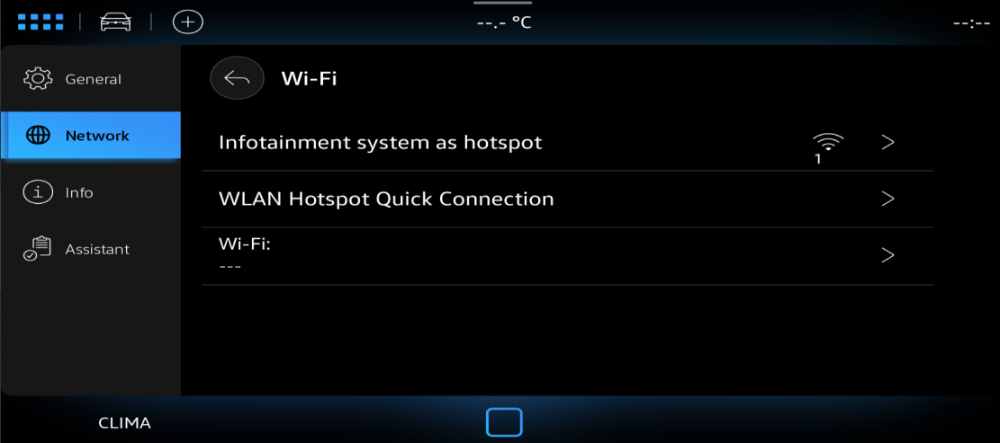
Image reference: doc_image_021.png

5.2.2 Station Mode

- scan networks

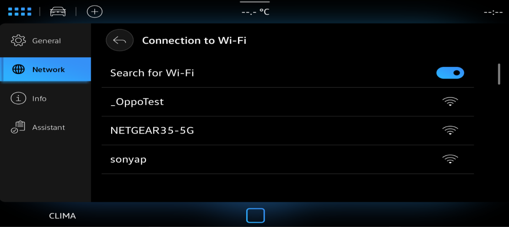
Image reference: doc_image_022.png

connect to external AP

Image reference: doc_image_023.png

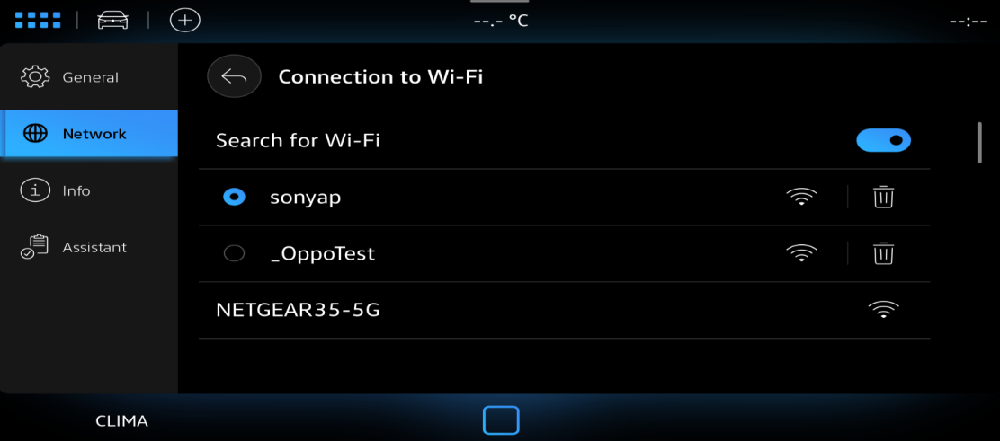
Image reference: doc_image_024.png

6. Lesson Learn

6.1 Positive lesson

	After this project, I realized several key lessons from adopting the Chain-of-Responsibility pattern:

Reduced tight coupling: controllers know less or don’t know about others at all. This makes the system easier to change and extend.

Improved flexibility and extensibility: Adding or modifying behavior only requires creating a new controller or adjusting the chain configuration.

Cleaner separation of concerns : Each controller has a focused responsibility, leading to clearer, more maintainable code.

Better testability: Controllers can be tested in isolation, without setting up the entire chain.

6.2 Challenges and trade-offs

	At the same time, there were also challenges:

Possible performance overhead: A request might travel through many controllers before being processed. So number of controllers should be a point to consider during design process.
