# Raw Slide Content

- Source file: FA_manh2.tran/[final]_[manh2.tran]_FA_2025_wlan_commonization.pptx
- Total slides: 19

## Slide 1

Design of commonization for wifi manager

By manh2.tran
Supervised by joon.namkoong
LGEDV Vehicle Network Team
September 2025

## Slide 2

Table of contents

Overview & Problem Identifications
Quality Attributes
Architecture Design Proposals
Comparison & Decision
Q&A

## Slide 3

Overview

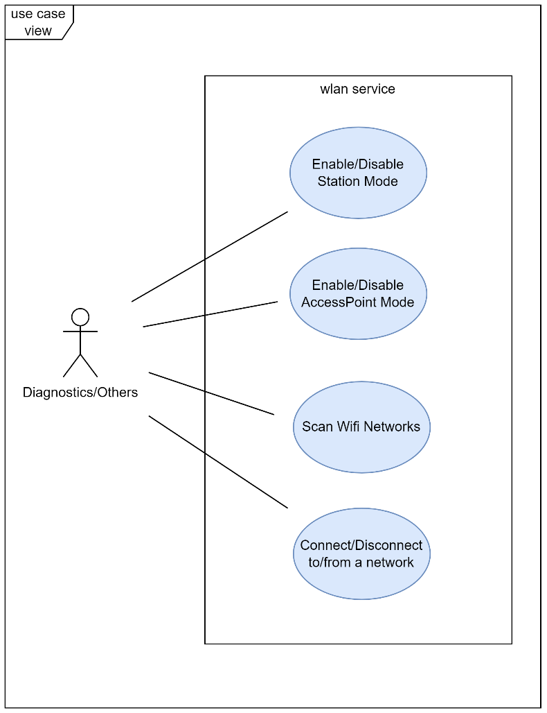
Image reference: slide_03_image_01.png

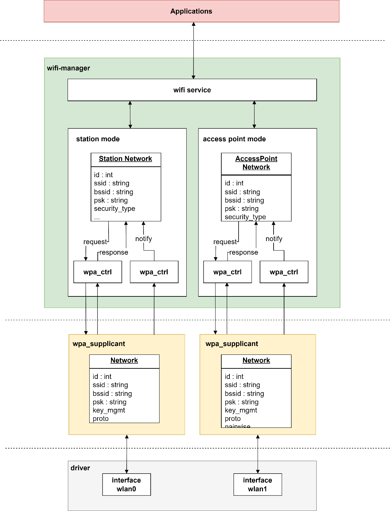
Image reference: slide_03_image_02.png

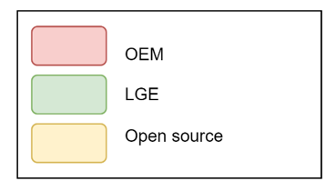
Image reference: slide_03_image_03.png

3 /19

## Slide 4

Problem Identifications

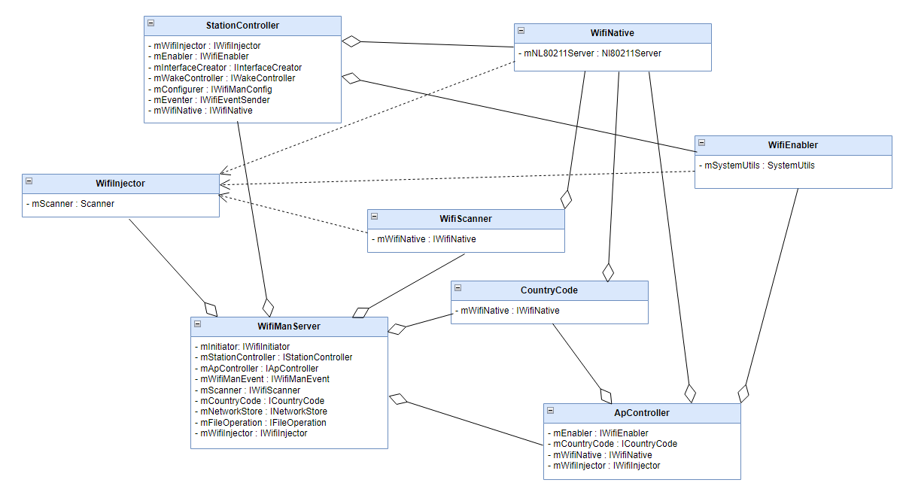
Image reference: slide_04_image_01.png

Components heavily dependent on each other
Scalability Issue when adding new features

4 /19

## Slide 5

Quality Attributes

### Table
| ID | Quality Attribute | Priority | Scenario |
| QA.001 | Reusability | High | Common logic across variants should be reused |
| QA.002 | Modifiability | High | Modification on a variant should not impact to other variants |
| QA.003 | Extensibility | High | Feature extensions for a specific variant should be implemented with minimal effort. |
| QA.004 | Maintainability | Medium | Fix in common logic should automatically benefit all variants without duplication of effort. |
| QA.005 | Testability | Medium | The design should be easy to write Unit Test |
| QA.006 | Performance | Medium | Delay between request and response should be low |

Based on the identified problems, wifi-manager should follow non-functional requirements described below

5 /19

## Slide 6

Idea

There is no design without dependencies
New idea aims to have better decoupled design

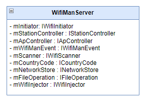
Image reference: slide_06_image_01.png

Current Design
Classes depend tightly to others

New Design
Design will base on Chain-of-Responsibility principle
A controller knows less or doesn’t know about others at all

Image reference: slide_06_image_02.png

6 /19

## Slide 7

Idea – Current Design

How an event is processed in current design

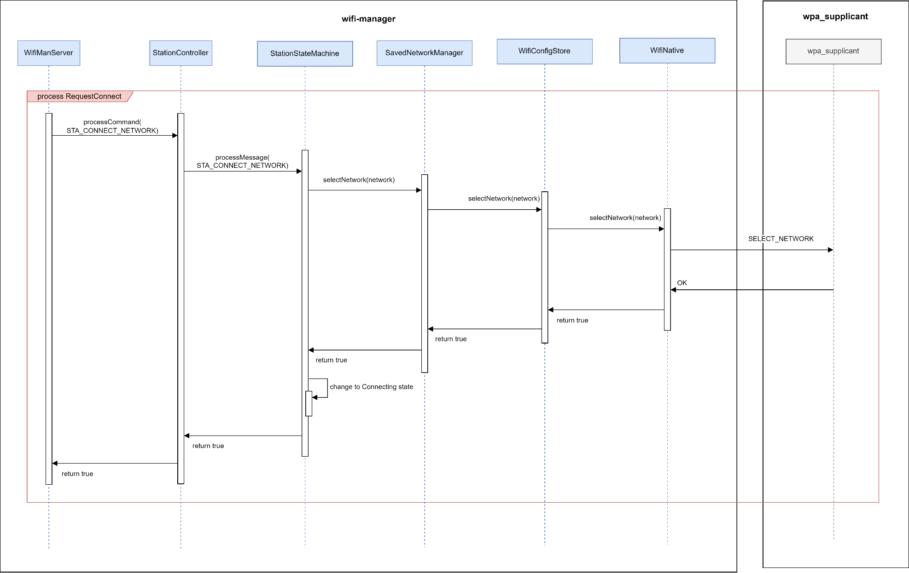
Image reference: slide_07_image_01.png

7 /19

## Slide 8

Idea – New Design

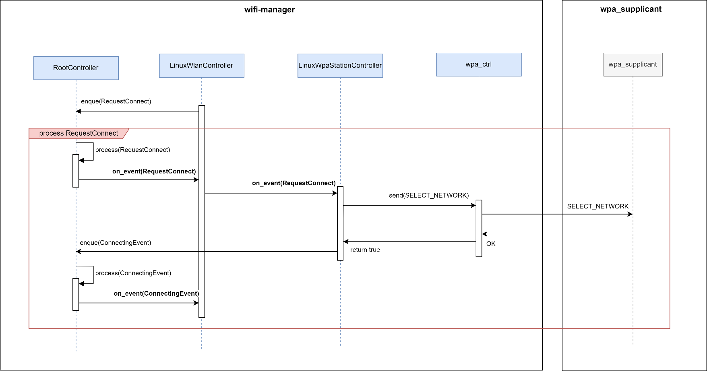
Image reference: slide_08_image_01.png

How new design will process an event

Modifiability
Easier to change or extend logic
Isolated modifications reduce side effects
Maintainability
Simpler debugging and tracing

8 /19

## Slide 9

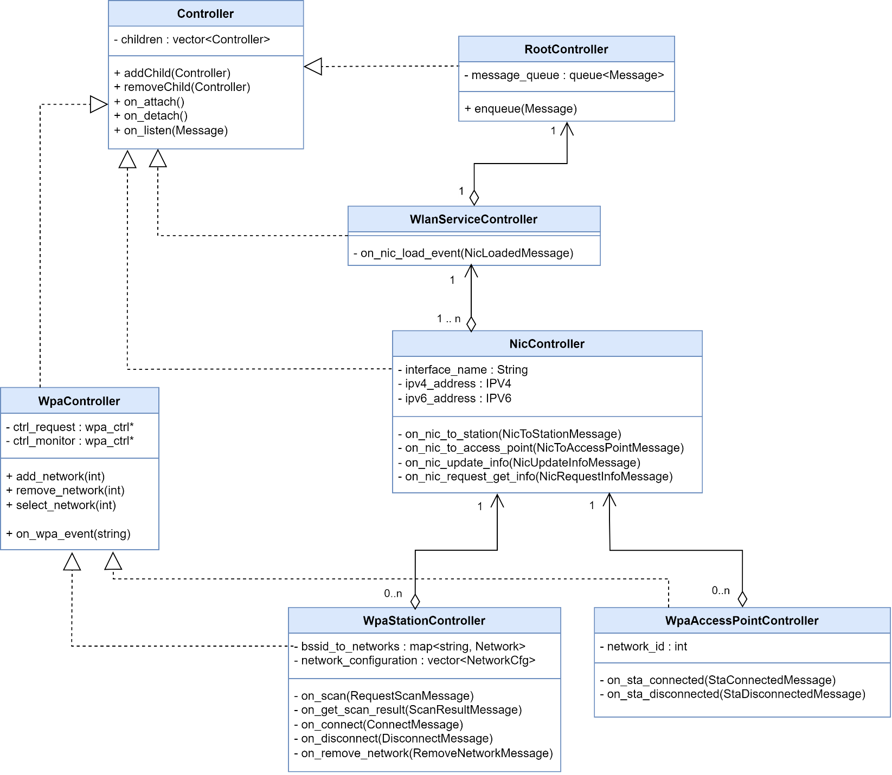
Image reference: slide_09_image_01.png

Proposal 1: Chain-of-Responsibility + Singleton design pattern

Class diagram

- WpaController will handle communication with wpa_supplicant

WpaStationController will handle station mode message

WpaAccessPointController will handle access point mode message

NicController will handle IP-related message for specific interface

RootController will propagate message to sub controllers

WlanService Controller will handle communication with Application

1

2

3

4

5

6

9 /19

## Slide 10

Proposal 1: Chain-of-Responsibility + Singleton design pattern

Pros
Reusability
Improved code reuse by decoupling request senders and handlers
Modifiability
Easier to change or extend logic
Isolated modifications reduce side effects
Maintainability
Simpler debugging and tracing

Cons
Performance
High traversal cost: requests may pass through many nodes before being handled
Testability
Singletons are not unit-test friendly
Global state and hidden dependencies make the system harder to test

10 /19

## Slide 11

Proposal 2: Chain-of-Responsibility + Abstract Factory design pattern

Class diagram

Image reference: slide_11_image_01.png

1

RootController now has get_factory<T> method to retrieve factory interface

2

A factory interface is designed to create a controller interface

11 /19

## Slide 12

Proposal 2: Chain-of-Responsibility + Abstract Factory design pattern

Pros
Inherits benefits from Proposal 1
Extensibility
Decouples object creation from usage
Testability
Unit-Test friendly
Dependencies can be mocked easily

Cons
Maintainability
Multiple factories, interfaces can make the codebase harder to understand and maintain

12 /19

## Slide 13

Comparison and Decision

From this comparison, Proposal 2 is selected because it offers stronger extensibility and better testability.

### Table
| No | Quality Attributes | Proposal 1 | Proposal 2 |
| QA.001 | Reusability | High. Each controller is designed for a specialized task, making it reusable across multiple variants | High. Each controller is designed for a specialized task, making it reusable across multiple variants |
| QA.002 | Modifiability | Medium. A modification for one variant my impact other variants if it is made on a shared controller | Medium. The factory pattern can help reduce number of controllers shared across variants, however there will still be some shared controllers to optimize reuse |
| QA.003 | Maintainability | Medium. Some sequences depend on certain controllers, and managing them in depth is not necessarily easy | Medium. Some sequences depend on certain controllers, and managing them in depth is not necessarily easy |
| QA.004 | Extensibility | Medium. Add new feature, controller may impact to shared controller across variants | High. The factory pattern helps ensure that modifications and feature configurations do not affect the logic of parent controller |
| QA.005 | Testability | Low. Global state and hidden dependencies make the system harder to test | Medium. Dependencies can be mocked easily |
| QA.006 | Performance | Medium. design atomic event to communicate with external module asynchronously so latency should be low | Medium. design atomic event to communicate with external module asynchronously so latency should be low |

13 /19

## Slide 14

Thank you!
Q&A

## Slide 15

APPENDIX 01 : VERIFICATION RESULT

connect to network ssid=Testnetwork, psk=11112222 using wlan0

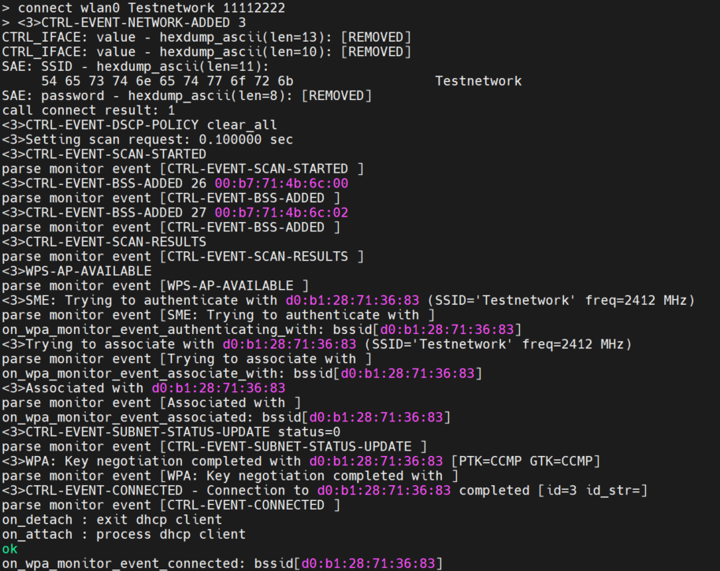
Image reference: slide_15_image_01.png

Image reference: slide_15_image_02.png

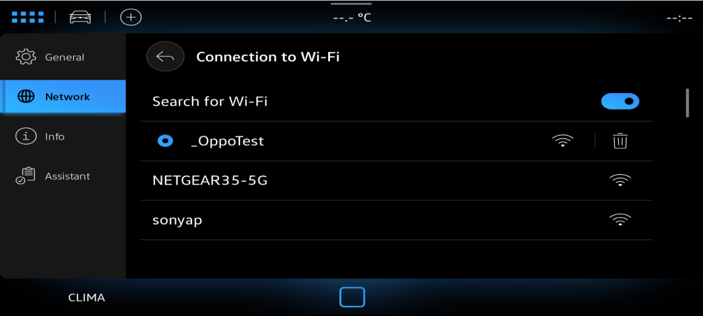
Image reference: slide_15_image_03.png

Run cli command

Integrate into VW Cockpit project

15 /19

## Slide 16

APPENDIX 02: Sequence Diagram of use case Connect to external AP

16 /19

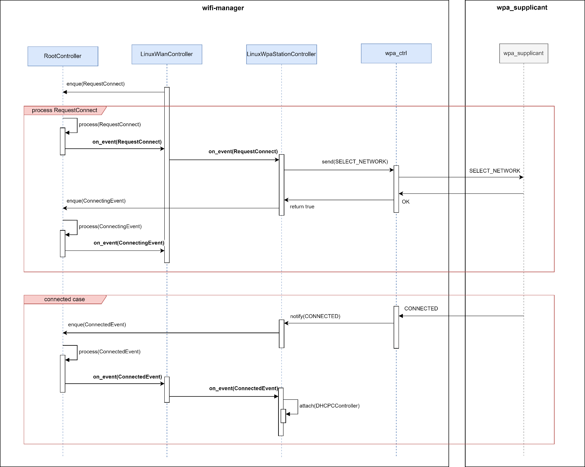
Image reference: slide_16_image_01.png

## Slide 17

APPENDIX 03: Chain-of-Responsibility + Singleton design pattern

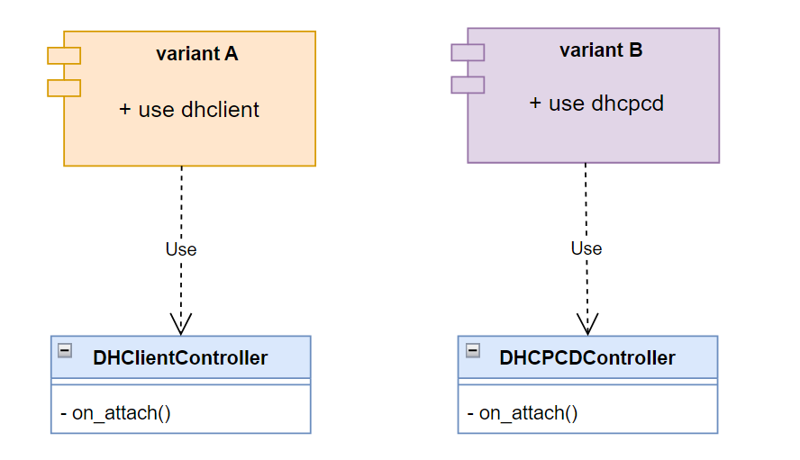
Image reference: slide_17_image_01.png

Variant A will use dhclient to manage station IP address

Variant B will use dhcpcd to manage station IP address

void WpaStationController::onConnected()
{
    #if defined(USE_DHCLIENT)
    addController(new DhclientController(m_interface));
    #elif defined(USE_DHCPCD)
    addController(new DhcpcdController(m_interface));
    #endif
}

Has to modify logic of WpaStationController to adapt with variant requirement

void WpaStationDHClientController::onConnected()
{
    addController(new DhclientController(m_interface));
}

void WpaStationDHCPCDController::onConnected()
{
    addController(new DhcpcdController(m_interface));
}

Has to duplicate WpaStationController source code for each variant or increase abstraction level

1

2

3

4

OR

Cons Example

17 /19

## Slide 18

APPENDIX 04: Chain-of-Responsibility + Abstract Factory design pattern

Image reference: slide_18_image_01.png

Variant A will use dhclient to manage station IP address

Variant B will use dhcpcd to manage station IP address

Change in use of dhclient or dhcpcd does not impact to WpaStationController logic

1

2

3

void WpaStationController::onConnected()
{
    auto root = getRootController();
    auto factory =
           root->get_factory<IDynamicIPClientControllerFactory>();
    auto controller = factory->create_controller(m_interface);
    addController(controller);
}

Pros Example

18 /19

## Slide 19

APPENDIX 05 : Unit-Test friendly

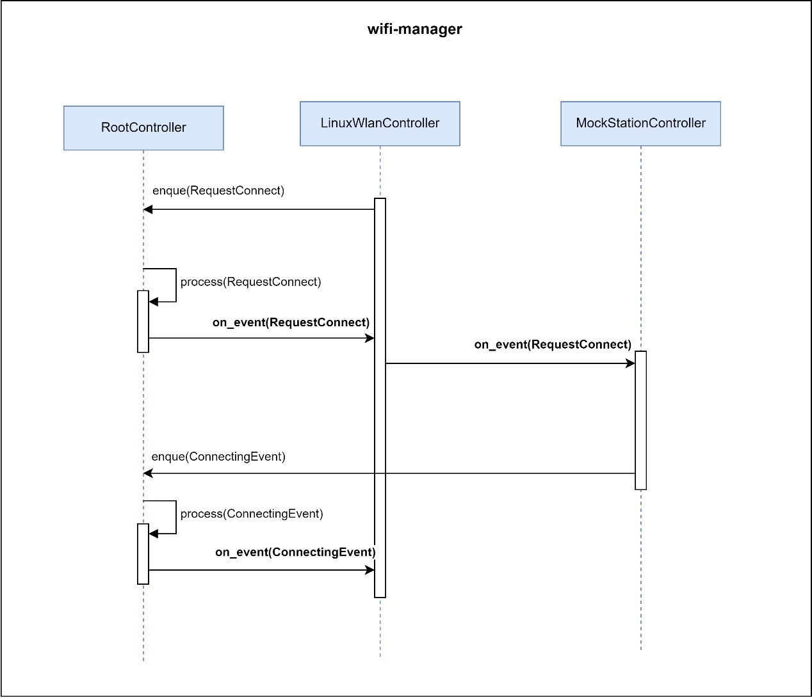
Image reference: slide_19_image_01.png

It is convenient to provide a replacement mock controller for the controller that depends on 3rd party library which is difficult to mock.

19 /19

