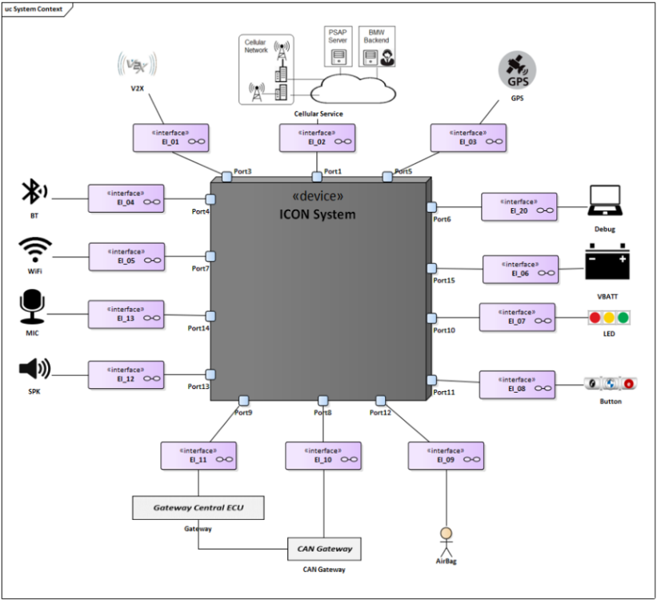
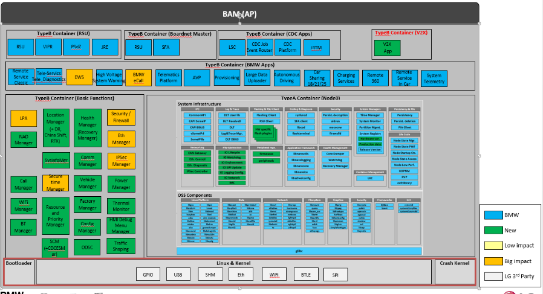
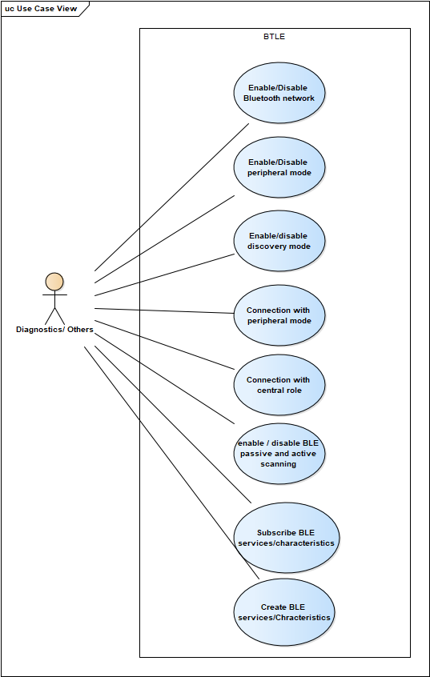
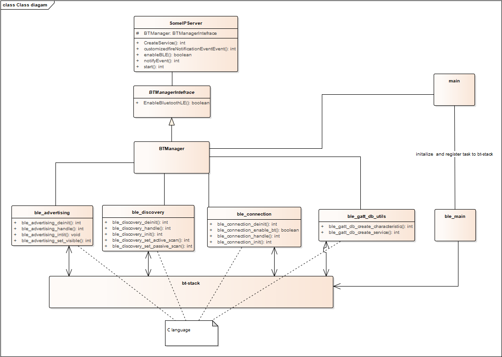
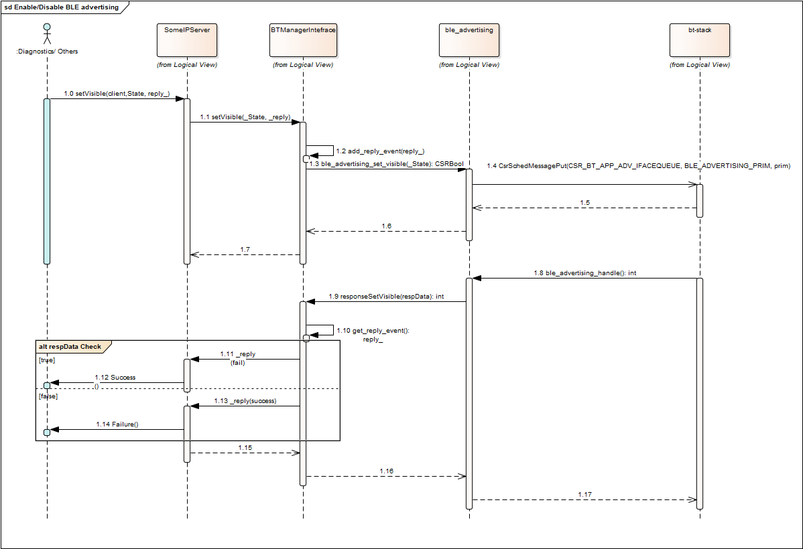

# Raw Document Content

- Source file: FA_Ngo Van Nhan/FA_Ngo Van Nhan/FA_ICONICC_BT_Manager_Design_v1.03.docx

LGE ICONIC

Bluetooth Manager

Notice:

Information contained in this document is classified LG Confidential Proprietary. No person outside the LG Group shall have access to the information contained in this document unless business needs dictate, otherwise. It is the responsibility of the person knowing the information contained in this document to ensure confidentiality of information contained in it and securing unauthorized access to this document at all times

About This Document

Revision History

## Table
| Verion | Date | Comment | Author | Approver |
| --- | --- | --- | --- | --- |
| 1.01 | 2022.07.27 | Initliaze document template, update 1.Introduction, 2. System Overview | Nhan.ngo |  |
| 1.02 | 2022.07.28 | Initialize 3.1 Functional Requirement | Nhan.ngo |  |
| 1.03 | 2022.07.29 | Initliaze 4.1,4.2, 4.3.1 section | Nhan.ngo |  |
|  |  |  |  |  |
|  |  |  |  |  |

Table of Contents

Table of Contents	2

List Figures	4

Tables	5

1	Introduction	6

1.1	Introduction	6

1.2	Purpose	6

1.3	Scope	6

1.4	Audience	6

1.5	Acronyms and Abbreviations	7

1.6	Related Documents	8

2	System Overview	9

2.1	Overview	9

2.1.1	Overview about supported connection in ICON system	9

2.1.2	BT Manager involving	10

3	Project Architectural Driver	11

3.1	Functional Requirement	11

3.1.1	Enable/disable BT network	11

3.1.2	Enable/disable peripheral mode	11

3.1.3	Enable/disable discovery mode	12

3.1.4	Connection with peripheral mode	12

3.1.5	Connection with central mode	12

3.1.6	Enable/disable BLE passive, active scaning and advertising	12

3.1.7	Subscribe BLE services/characteristics	12

3.1.8	Create BLE services/chracteristics	12

3.2	Contraint	12

4	Software design	13

4.1	Software Architect Design	13

4.2	External Interfaces	14

4.2.1	SOME/IP introduction	14

4.2.2	Protocol specification	14

4.3	Software Detail Design	15

4.3.1	Modules and Responsibility	15

4.3.2	Internal Interfaces	16

4.3.2.1	SOME/IP request to bt-stack	16

4.3.2.2	BT-stack reponse result	16

4.3.3	Static design	17

4.3.4	Dynamic Design	19

4.3.5	Algorithm Design	22

4.4	Failure mode	22

List Figures

Figure 1 Overview about ICON system connection	9

Figure 2 BT Manager involve to system	10

Figure 3 Use case diagram	11

Figure 4 Software Architect	13

Figure 5 Internal software components	15

Figure 6 Software class diagram	17

Tables

Table 1 Component list	13

Table 2 Software component description	15

Introduction

Introduction

Bluetooth Low Enegy is once type of Bluetooth connection in vehicle, that using low power than Bluetooth Classic, BT Manager is once service in vehicle that provide method to control various profile and connection. BT manager receives data from application and deliver is to host and maintains the Bluetooth interface.

Purpose

This document describe the BT manager functionality and design that is mainly responsible for control Bluetooth connection and profile. That perform operations from other module, and deliver it to host and maintains the Bluetooth interface

Scope

This document describes the BT manager system architect and high-level design include internal and external software.

Audience

Software architect who will evaluate the design of the software

Software developer who will implement software

Other developers who need to interact with this software

Acronyms and Abbreviations

## Table
| Abbreviation | Description |
| --- | --- |
| N.A | Not available |
| BT | Bluetooth |
| BTLE | Bluetooth Low Enegy |
| BLE services | Data transfer via BLE is structure data; service is a collection of data, and associated behaviors to accomplish a particular function or feature of a device or portions of a device. [5] |
| BLE characteristics | A characteristic is a value used in a service along with properties and configuration information about how the value is access and information about how the value is displayed or represented. A characteristic definition contains a characteristic declaration, characteristic properties, and a value. It may also contain descriptors that describe the value or permit configuration of the server with respect to the characteristic value. [5] |
| TBD | To be defined |
| SOME/IP | Scalable service-Oriented MiddlewarE over IP |

Related Documents

[1] LGE_BMW_ICONICC_WiFi_BT_V01, Nov.25th, 2021

[2] Overview Bluetooth LE_ver04

[3] LGE_BMW_ICONICC_Node0Bringup_V03 Nov.23rd, 2021

[4] BLE services, characteristics uuid

[5] https://www.bluetooth.org/DocMan/handlers/DownloadDoc.ashx?doc_id=521059

[6] AUTOSAR_PRS_SOMEIPProtocol.pdf

System Overview

Overview

Overview about supported connection in ICON system

ICON system support BT connection to communication with user deivce, any device support BTLE and allowed to can make a connection

Image reference: doc_image_001.png

Figure 1 Overview about ICON system connection

BT Manager involving

BT manager is one component in type B Contaitner, that working as a service. Using provided API by Node0 to interative with other component.

BT manager involved in system, interactive with other module via SOME/IP.

BT manager received request from diagnostic and handle maintain Bluetooth connection

BT manager subscribe to other service, wait event notify and handle it (TBD)

Image reference: doc_image_002.png

Figure 2 BT Manager involve to system

Project Architectural Driver

Functional Requirement

Image reference: doc_image_003.png

Figure 3 Use case diagram

Enable/disable BT network

Precondition: Bluetooth is working normally and command can be enter

Action: Received the request to active / de-active BT network

Expected: BT network should be active or de-actived

Input data: Command for active/de-active bluetooth network

Output data: Response result success/failure

Enable/disable peripheral mode

Precondition: Bluetooth is working normally and command can be enter

Action: Received the request to active / de-active peripheral mode

Expected: peripheral mode will be active / de-active

Input data: Command for active/de-active peripheral mode

Output data: Response result success/failure

Enable/disable discovery mode

Precondition: Bluetooth is working normally and command can be enter

Action: Received the request to active / de-active discovery mode

Expected: discovery mode will be active / de-active

Input data: Command for active/de-active discovery mode

Output data: Response result success/failure

Connection with peripheral mode

TBD

Connection with central mode

TBD

Enable/disable BLE passive, active scaning and advertising

Precondition: Bluetooth is working normally and command can be enter

Action: Received the request to active / de-active passive, active scaning and advertising

Expected: passive, active scaning and advertising mode will be active / de-active

Input data: Command and argument for active/de-active passive, active scaning and advertising

Output data: Response result success/failure

Subscribe BLE services/characteristics

Precondition: Bluetooth is working normally and command can be enter

Action: Received the request to subscribe about BLE chracteristics/ services

Expected: The unit request subscribe will be received a notification if the value of characteristics/ services changed

Input data: Command for subscribe BLE characteristics/ services and uuid of that

Output data: Response result success/failure, response data change will be notify

Create BLE services/chracteristics

Precondition: Bluetooth is working normally and command can be enter

Action: Received the request to create new BLE services/ characteristics

Expected: services or characteristics will be create

Input data:  command create services/chracteristics with uuid of that

Output data: Response result success/failure

Quality Attributes

Performance: BT Manager interactive via SOME/IP, so that need adaptive timeout of message, if response time over limitation, response timeout package will be sent to requester

Contraint

Const 1: Every request must have response. Success or fail response will be sent

Software design

Software Architect Design

Image reference: doc_image_004.png

Figure 4 Software Architect

Table 1 Component list

## Table
| Component Name | Description |
| --- | --- |
| User Remote Device | The device that support connection via BTLE and allowed connect to ICON System can establish |
| BT Stack | Library provide by chip vendor (Quanlcom) That support api to control and connect Bluetooth |
| BT Manager | The software need to develop, that working as a service: Received request to control BTLE connection Allow make connection |
| Car Sharing & Other | The component that have some information BT manager need to listening, when it change, BT Manager need apply it to BT configuration |
| Diagnostics & Other | Which component will make request to BT Manager via SomeIP |
|  |  |
|  |  |
|  |  |

External Interfaces

BT manager communication with other module in ICONICC system SOME/IP

SOME/IP introduction

This protocol specification specifies the format, message sequences and semantics of the AUTOSAR Protocol "Scalable service-Oriented MiddlewarE over IP (SOME/IP)".

SOME/IP is an automotive/embedded communication protocol, which supports remote procedure calls, event notifications and the underlying serialization/wire format. The only valid abbreviation is SOME/IP. Other abbreviations (e.g. Some/IP) are wrong and shall not be used. [6]

Protocol specification

SOME/IP provides service oriented communication over a network. It is based on service definitions that list the functionality that the service provides. A service can consist of combinations of zero or multiple events, methods and fields.

Events provide data that are sent cyclically or on change from the provider to the subscriber.

Methods provide the possibility to the sbscriber to issue remote procedure calls, which are executed on provider side.

Fields are combinations of one or more of the following three:

• The notifier, which sends data on change from the provider to the subscribers

• The getter, which can be called by the subscriber to explicitely query the provider for the value

• The setter, which can be called by the subscriber when it wants to change the value on provider side

The major difference between the notifier of a field and an event is that events are only sent on change, the notifier of a filed additionally sends the data directly after subscription.

Software Detail Design

Modules and Responsibility

Image reference: doc_image_005.png

Figure 5 Internal software components

Table 2 Software component description

## Table
| Modules | Descriptions |
| --- | --- |
| SOMEIP Server | The server will always available to receive request form other service and forward it to BT manager, all API will explode fllow format defined by OEM |
| BTManager | Provide API for someip can communication with core service. And handle reponse data from cor service, |
| Discovery | The module handle feature relate to requirement relate to discovery: configureation for passive scaning, active scaning, discovery |
| Advertising | The module handle feature relate to requirement about advertising: Advertising, peripheral mode, visiable configuration |
| Connection | The module handle when 2 device estable connection |
| GATT DB | The module will handle about configureation for characteristic and services: Provide service, characteristics information for request subscribe and provide api to create new services, characteristics |
| Utils | Provide common API: logs, common function |
| BT-Stack | Library for higher layer can working with BT chip, that provide like C language API |

Internal Interfaces

There are 2 side working process

Task request form external component via SOME/IP

Task event result from bt-stack when response request result by asychornus

SOME/IP request to bt-stack

TBD

BT-stack reponse result

TBD

Static design

Image reference: doc_image_006.png

Figure 6 Software class diagram

Dynamic Design

Intitalize and register bt-stack task

TBD

Enable/disable BTLE feature

TBD

Enable/disable peripheral mode

Image reference: doc_image_007.png

Figure 7 Sequence diagram enable/disable advertising

## Table
| Function name | description |
| --- | --- |
| TBD | TBD |
|  |  |
|  |  |
|  |  |
|  |  |
|  |  |

Enable/disable discovery mode

TBD

Connection with peripheral mode

TBD

Connection with central mode

TBD

Enable/disable BLE passive, active scaning

TBD

Subscribe BLE services/characteristics

TBD

Create BLE services/characteristics

TBD

Algorithm Design

TBD

Failure mode

TBD
