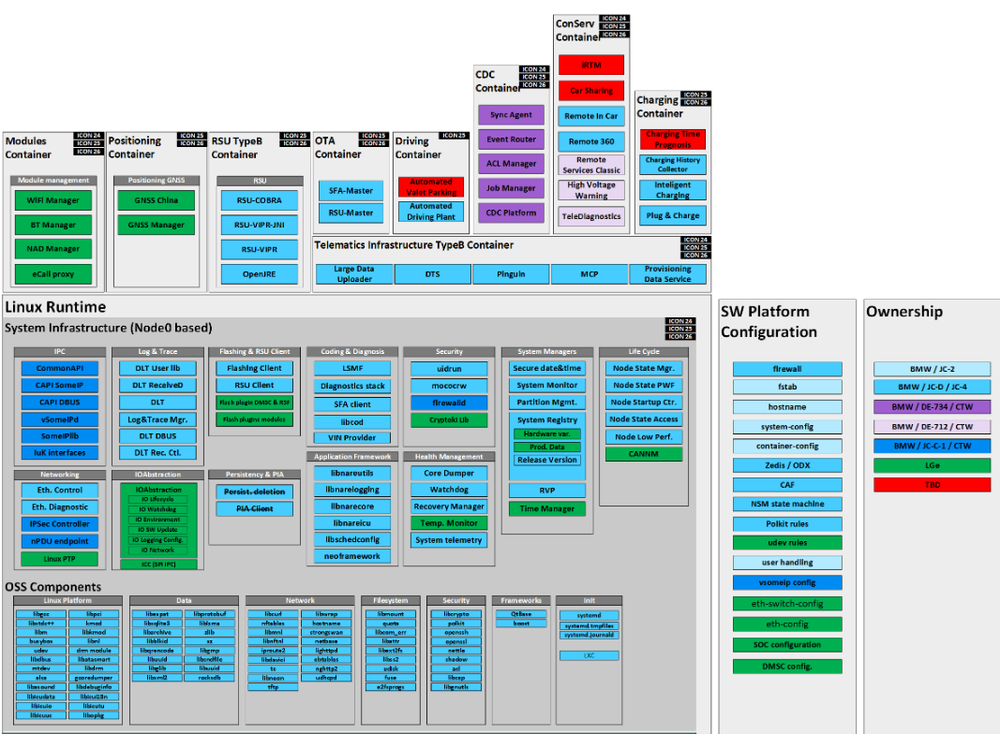
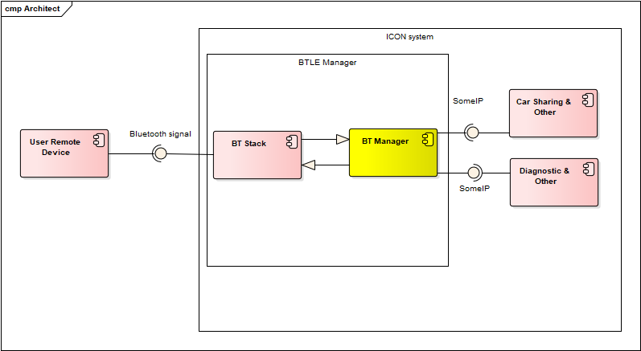
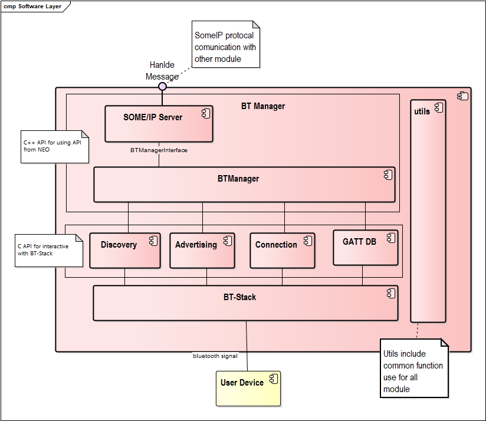

# Raw Slide Content

- Source file: FA_Ngo Van Nhan/FA_Ngo Van Nhan/LGE BMW_ICONICC_BT_Manager.pptx
- Total slides: 10

## Slide 1

Image reference: slide_01_image_01.png

BMW ICON - BT Manager

July 28th, 2022

## Slide 2

 AGENDAS

Project Introduction
Functional Requirements
Software Architecture Design
Software Internal Design

## Slide 3

1. Project Introduction

BT

 System Architecture

Image reference: slide_03_image_01.png

EI_04: This interface define for BT which need connect
Between ICON BLE and external devices supported BLE

## Slide 4

2. Project Introduction

BT

ICON System Architect design

Image reference: slide_04_image_01.png

## Slide 5

Image reference: slide_05_image_01.png

2. Functional Requirements

Basic Features:
Configuration for discovery, advertising, BLE
Establish connection
User interface
Create and subscribe to characteristics and services
Configuration for scanning mode

## Slide 6

BT manager involved in system, intact with other module via Some IP.
    BT manager received request from diagnostic to maintain Bluetooth connection
    BT manager subscribe to other service, wait event notify and handle it (TBD)
BT manager intact with peripheral device via Bluetooth connection

Image reference: slide_06_image_01.png

2.Software Architecture

## Slide 7

3. Software Internal Design

BT

BT manager component

Image reference: slide_07_image_01.png

## Slide 8

3. Functionality and architecture

BT

BT manager component
SOME/IP server:  SOME/IP from common APIs of Neo SDK
BTManager: Handle for functions of BT manager APIs
Discovery: Handle the features relate to discovery service
Advertising: Handle the features relate to advertise and peripheral mode
Connection: Handle the features incoming/outgoing connection
GATTDB: Handle register GattId, create service, characteristic, descriptors and saving in DB
Utils: Handle common functions and logs
Bt-Stack: APIs and library of Synergy

## Slide 9

3. Software Internal Design

BT

Class diagram

Image reference: slide_09_image_01.png

## Slide 10

3. Software Internal Design

BT

Image reference: slide_10_image_01.png

Enable BLE advertising sequence diagram

