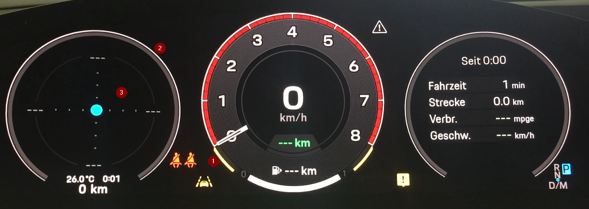
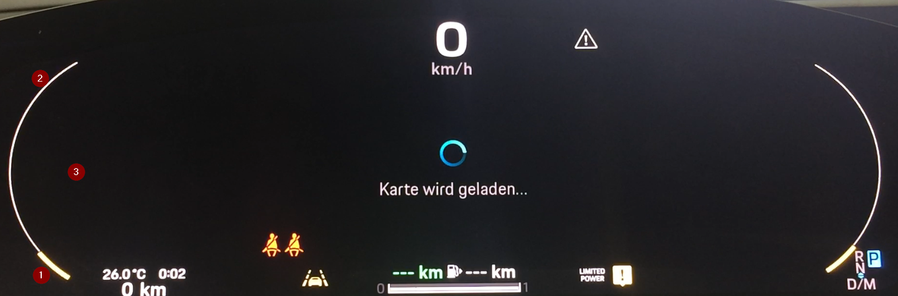
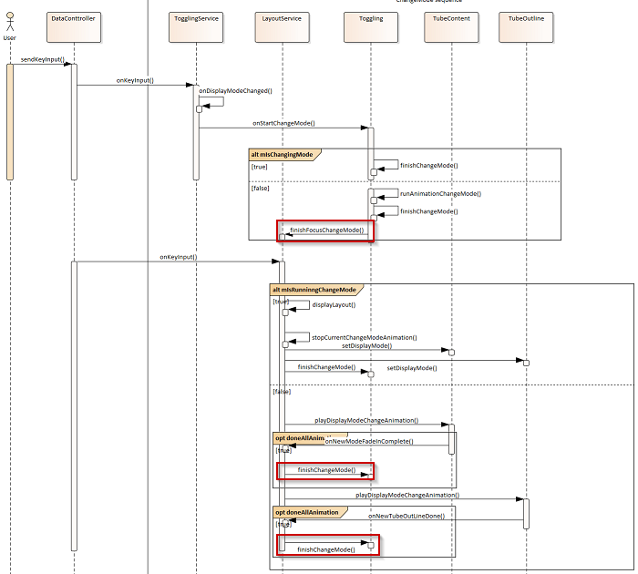
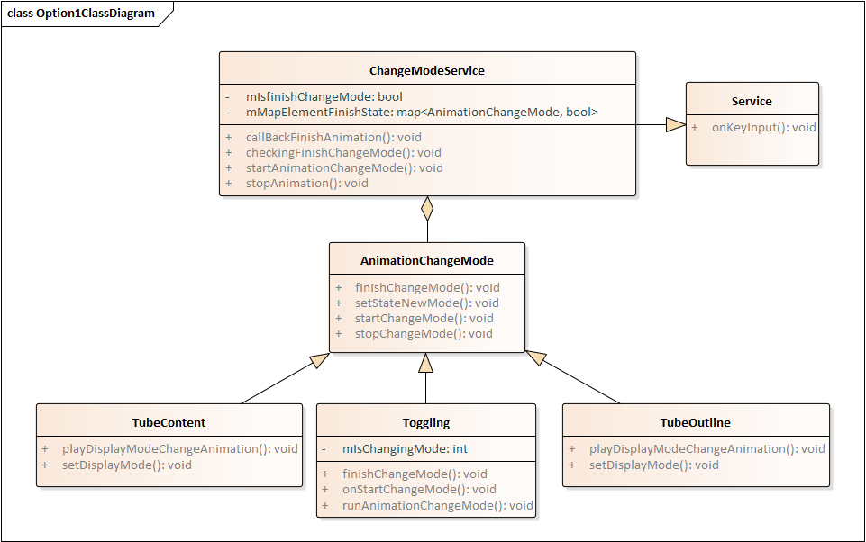
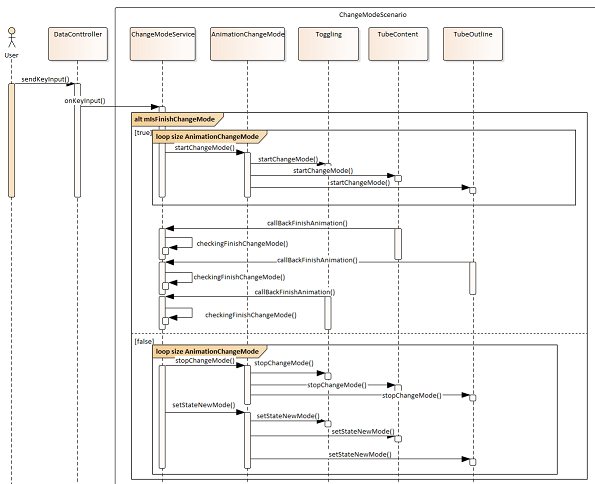
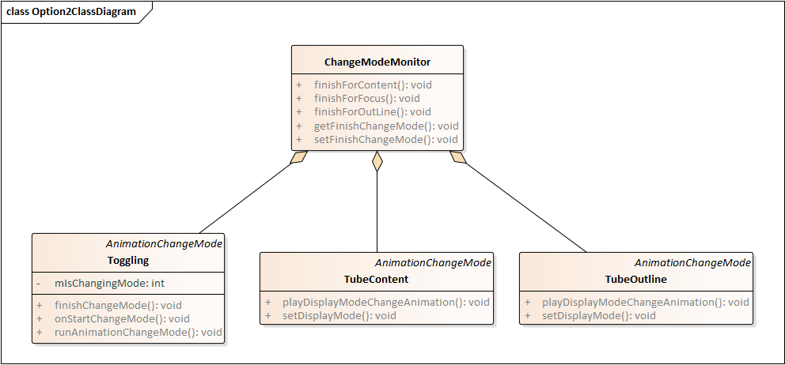
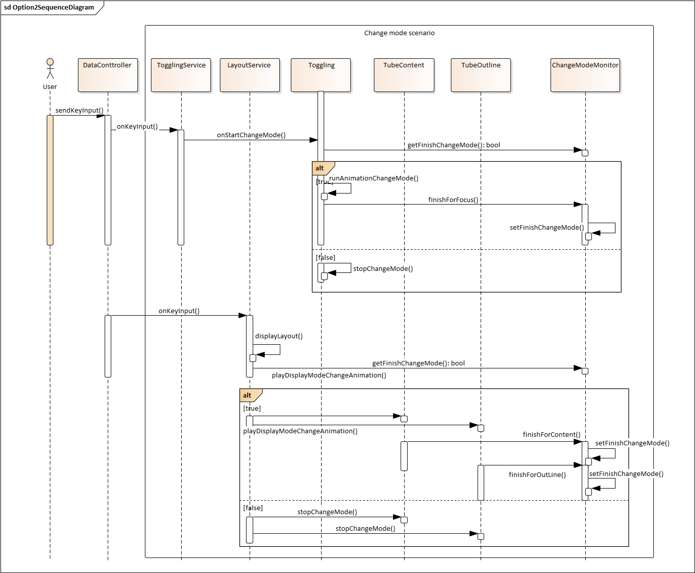

# Raw Slide Content

- Source file: FA_Nguyen Dinh Chuong/FA_Nguyen Dinh Chuong/FA_2022_Change_mode_sequence_improvement_Chuong.nguyen_Ver_1.0.pptx
- Total slides: 11

## Slide 1

FA 2022
Change Mode Sequence Improvement

By Chuong.nguyen
Supervise by By.kim
LG Vehicle Solution Development Center Vietnam
02- Aug- 2022

Image reference: slide_01_image_01.png

LGE Internal Use Only

1

## Slide 2

Table content

Image reference: slide_02_image_01.png

Comparison between proposals

4

Problem explain

Architecture design proposals

1

2

3

4

Apply result

5

Q&A

LGE Internal Use Only

2

## Slide 3

Problem explain

Image reference: slide_03_image_01.png

Explain change mode sequence

Image reference: slide_03_image_02.png

Image reference: slide_03_image_03.png

(1) Toggling  (2) Tube Layout  (3) Tube Content

LGE Internal Use Only

3

OEM Detail Requirement

- Fast change mode
One of elements not finish animation but user have another action to change to new mode (C). In this case all running animation must stop and SW must display the UI of new mode (C) without animation.

- Normal change mode
All elements (toggling, tube layout, tube content) finish run animation from mode (A) to (B) before user have action to change to another mode (from mode (B) to mode (C))

- Change mode concept
When user action change from mode (A) to mode (B) after that change from mode (B) to mode (C). The Element must update display UI by running animation depend on each mode

## Slide 4

Problem explain

Image reference: slide_04_image_01.png

Current design
Make services to listen event from user
Job of each service:
1- Run animation change mode of item
2- Notify to other when finish change mode
3- Check change mode sequence finish or not

LGE Internal Use Only

4

Problem
1- Module need depend on each others
2- Difficult to extension the system
3- Difficult to maintain the sequence

Image reference: slide_04_image_02.png

Target for new architect
1- Module doesn’t depend on each other any mode
2- Can easier extension the system (logic, design, line of code)

## Slide 5

Architecture design proposals

Image reference: slide_05_image_01.png

Proposal 1: Common change mode Architect

LGE Internal Use Only

5

Image reference: slide_05_image_02.png

Image reference: slide_05_image_03.png

## Slide 6

Architecture design proposals

Image reference: slide_06_image_01.png

Proposal 1: Common change mode Architect

LGE Internal Use Only

6

Pros:
1- Easier to extension the system
-> When new element joins the sequence, only need inherit common class and implement follow API
2- Don’t have depend between the element
-> Easier to maintain, fixing bug
Cons:
1- New service is created, many code will update when compare with current implement

## Slide 7

Architecture design proposals

Image reference: slide_07_image_01.png

Proposal 2: Monitor change mode Architect

LGE Internal Use Only

7

Image reference: slide_07_image_02.png

Image reference: slide_07_image_03.png

## Slide 8

Architecture design proposals

Image reference: slide_08_image_01.png

Proposal 2: Monitor change mode Architect

LGE Internal Use Only

8

Pros:
1- Easier to update from current logic
2- Don’t have depend between the element, they only know ChangModeMonitor
Cons:
1- All elements need depend on ChangModeMonitor class
-> When many elements join to the sequence,  the logic of class ChangModeMonitor will be more complex and more difficult to maintain.

## Slide 9

Compare between proposals

Image reference: slide_09_image_01.png

LGE Internal Use Only

9

### Table
|  | CCA | MCA |
| Easier to extension |  |  |
| Easier to developer new implement |  |  |
| Little code update from current implement |  |  |
| Elements don’t depend each other |  |  |

CCA: Common Change mode Architecture
MCA: Monitor Change mode Architecture
        : Mean will be better

Decision: Base on above compare , The Proposal 1 is chosen for Improve change mode sequence.
It is better than Proposal 2 not only extend in future but also for maintain system.

## Slide 10

Apply result

Image reference: slide_10_image_01.png

LGE Internal Use Only

10

This will be update later when finish implement

## Slide 11

Image reference: slide_11_image_01.png

LGE Internal Use Only

11

Q&A
Thank you for listening

