# Raw Document Content

- Source file: FA_nguyen2.nguyen/Common Factory Service Design for AVN Virtualization Projects_Final.docx

Image reference: doc_image_001.jpeg

LGE DV

FA Design Document:

Common Factory Service Design for AVN Virtualization Projects

Nguyen2.nguyen

Supervised by Ahn.Woosuk

2025.08.04

Revision History

## Table
| Version | Date | Comment | Author | Reviewer |
| --- | --- | --- | --- | --- |
| 1.0 | 2025-08-04 | Initial release | Nguyen2.nguyen | Ahn.Woosuk |
| 1.1 | 2025-08-29 | Update quality attributes, experimental results | Nguyen2.nguyen | Ahn.Woosuk |
| 1.2 | 2025-09-21 | Functional requirements added | Nguyen2.nguyen | Ahn.Woosuk |

## Table
| Abbreviation | Definition |
| --- | --- |
| DID | Data Identifier |
| FS | Factory Service |
| HAL | Hardware Abstraction Layer |
| PC | Production Computer |
| SOA | Service-Oriented Architecture |
| UPH | Units per Hour |
| VHAL | Vehicle Hardware Abstraction Layer |
| VM | Virtual Machine |

Table of Contents

1	Introduction	1

1.1	Purpose	1

1.2	Scope	1

1.3	Audience	1

2	Project Context	2

2.1	Background Explanation	2

2.2	Factory Service Overview	3

3	Problem Identification	5

3.1	Architect of AVN projects that use virtulization platform	5

3.1.1	Hypervisor Architecture	5

3.1.2	Container Architecture	6

3.2	Current Factory Service design	7

3.3	The Problem	9

3.4	Quality Attributes	10

4	Architecture Design Proposals: Design 1 – Android AIDL and Inter VM Communication	11

4.1	Software Architecture	11

4.2	Component Diagram	12

4.3	Class Diagram	13

4.4	Sequence Diagram	15

5	Architecture Design Proposals: Design 2 – Service Oriented Architecture	17

5.1	Software Architecture	17

5.2	Component Diagram	19

5.3	Class Diagram	20

5.4	Sequence Diagram	23

5.5	Core and Variant Strategy	25

5.6	Logging Strategy	26

5.7	Factory Server - First Boot Strategy	27

5.7.1	Boot sequence	27

5.7.2	Factory Server – First Boot Strategy	28

6	Design comparison	29

7	Experimental result	30

List of Figures

Figure 1 Factory Line map	2

Figure 2 Factory Inspection process	2

Figure 3 Inspection environment	3

Figure 4 Architecture of AVN projects using hypervisor	5

Figure 5 Architecture of AVN projects using container	6

Figure 6 Current Factory Service design	7

Figure 7 Problem of Current Factory Service Design	9

Figure 8 Android AIDL and Inter VM Communication Design	11

Figure 9 Component Diagram of Factory Service	12

Figure 10 Class Diagram for Android AIDL Service proposal	13

Figure 11 Sequence Diagram for Android AIDL Service proposal	15

Figure 12 Factory Service Proposal Context Diagram	17

Figure 13 Component Diagram of Factory Service SOA proposal	19

Figure 14 Class Diagram for Factory Service SOA proposal	20

Figure 15 Design of TaskManager	21

Figure 16 Sequence Diagram of how Factory Service (Host) handle test request	23

Figure 17 Sequence Diagram of how Factory Service (Client) handle test request	24

Figure 18 Design of Core and Variant parts	25

Figure 19 Logging Strategy in Factory Service Architecture	26

Figure 20 Boot Sequence in Virtualization Projects	27

Figure 21 Factory Server - First Boot Strategy	28

List of Tables

Table 1 Functional Requirements	10

Table 2 Quality Attributes	10

Table 3 Constraints	10

Table 4 Design comparsion	29

Table 5 Experimental result	30

Introduction

Purpose

This is design document that specifies the software architecture design for Commonlization Factory Service for AVN projects using virtualization platforms.

Scope

This document covers for Factory Service.

This document applies to the GM GVM MY24/27, HKMC Connect Wide, BMW RSE27 projects.

Audience

The target audience of this document is:

Software architect

Component developer

Project Context

Background Explanation

Factory Service Introduction:

The Factory Service (FS) is a service or an aggregation of servsices designed for line testing in the factory.

After being assembled, all products have to be inspected to ensure there is no defects before shipment.

Image reference: doc_image_002.png

Figure 1 Factory Line map

Inspection test have several Stations. Each station will perform some test items.

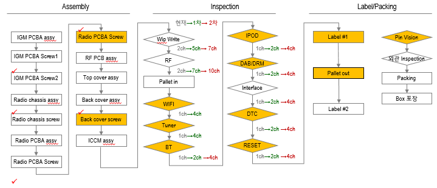
Image reference: doc_image_003.png

Figure 2 Factory Inspection process

Factory Service Overview

Factory Service has below basic functions:

Communicates with test tool with 2 mandatory connections interface: UART and TCP.

Received test command from test tool with a predefined protocol.

Communicates with others services to execute the test and respond the result to test tool.

Write production information (Serial Number, DID …) and Key provision into product.

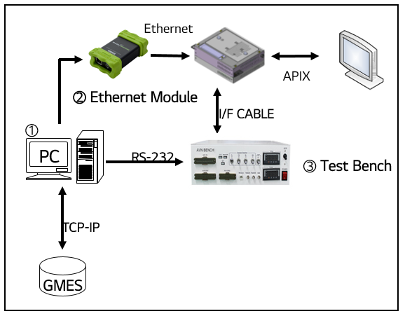
Image reference: doc_image_004.png

Figure 3 Inspection environment

AVN product:

This is the device or product that has been assembled and is now ready for testing

It has an Ethernet or UART interface, which allows it to communicate with the PC for receiving test request.

The product also connected with other external equipment via test bench.

Test Bench:

The test bench is a specialized piece of equipment designed for testing the product and it also supplies power to the device.

It has various input/output ports, signal generators, and measurement instruments to thoroughly evaluate the product's performance and functionality.

The test bench acts as an intermediary between the product and the PC, allowing the PC to control and monitor the testing process.

Inspnection PC:

The personal computer is used as the control and monitoring center for the testing setup.

PC runs Inspection tool for sending serveral test commands to device, and connecting to GMES system to store/get information for device product.

GMES:

GMES is a software application running on the PC that allows the user to control and monitor the testing process.

GMES system has various features, such as test automation, data logging, save history, real-time visualization, and reporting the testing workflow.

Problem Identification

Architect of AVN projects that use virtulization platform

Currently, in AVN Virtualization projects, the Hypervisor (HKMC Connect Wide) and Container Architect (BMW RSE27, GM GVM MY24/27) are utilized. Each architecture has its own advantages and aligns with the OEM requirements effectively.

Hypervisor Architecture

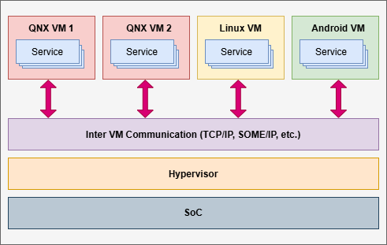
Image reference: doc_image_005.png

Figure 4 Architecture of AVN projects using hypervisor

Today, the trend in AVN projects is moving toward Service-Oriented Architecture (SOA). In this approach, centralized compute units are deployed with a hypervisor that hosts multiple virtual machine (VM) instances, each running its own operating system such as QNX, Linux, or Android. On top of these VMs, services are encapsulated and managed independently, enabling modularity and reuse across projects.

To enable collaboration between these virtualized environments, an inter-VM communication layer is used, typically based on standardized protocols such as TCP/IP and SOME/IP. This ensures that services in different VMs can interact seamlessly, regardless of the underlying OS. The hypervisor provides strong isolation between VMs while still allowing efficient sharing of hardware resources on the SoC.

Overall, this architecture enhances flexibility, scalability, and reusability across AVN projects, while supporting the integration of heterogeneous systems into a unified software platform.

Container Architecture

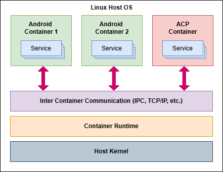
Image reference: doc_image_006.png

Figure 5 Architecture of AVN projects using container

Alongside hypervisor-based architectures, container architecture represents another form of virtualization — OS-level virtualization — which complements hardware-level virtualization. Unlike hypervisors that virtualize entire machines with separate kernels, containers provide lightweight isolation while sharing the same host kernel. This enables faster startup, lower overhead, and more efficient use of hardware resources.

In AVN projects, containerization is widely adopted in platforms such as BMW RSE27 and GM GVM MY24/27. As shown in the figure, a Linux Host OS with a shared kernel runs multiple containers through an LXC-based runtime. Each container — such as Android or ACP — encapsulates its own applications and services. Inter-Container Communication (ICC), using IPC or TCP/IP, enables services in different containers to interact seamlessly while maintaining isolation.s

This approach improves deployment speed, scalability, and modularity. Services can be packaged and updated independently, supporting faster development cycles, efficient resource utilization, and simplified maintenance, while ensuring compatibility with existing service frameworks.

Current Factory Service design

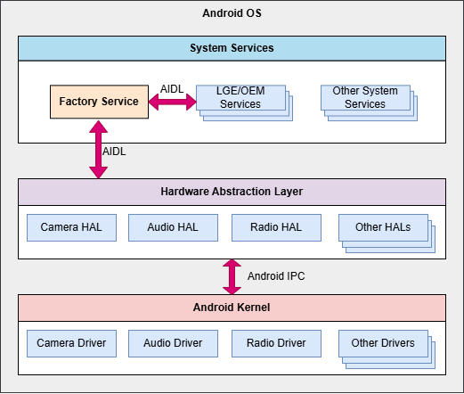
Image reference: doc_image_007.png

Figure 6 Current Factory Service design

In current AVN projects that use virtualization, Android has been selected as the primary operating system for user interaction. Android provides a rich framework, extensive middleware, and well-established APIs, making it a natural choice for running many LGE/OEM services. As a result, most system-level and vendor-specific services are deployed on Android OS, which is also why the Factory Service is designed to run within this environment in many current projects.

In the current design, Factory Service is implemented as an Android system service and deployed alongside other OEM and system services. It communicates with these services via Android Interface Definition Language (AIDL), enabling structured inter-process communication (IPC) and seamless integration with the broader Android service framework. This design ensures that Factory Service can easily access vendor-specific APIs and coordinate with other components already integrated into the Android ecosystem.

For hardware-level interactions, Factory Service connects with the Android Hardware Abstraction Layer (HAL). Through AIDL, it invokes HAL APIs that correspond to specific subsystems such as Camera, Audio, and Radio. The HAL acts as an intermediary, translating these API calls into lower-level driver operations at the kernel level. For example, when a test request is received from the Inspection Tool, Factory Service calls the relevant HAL API, the HAL then communicates with the underlying hardware drivers, and the result is propagated back through the HAL to Factory Service.

This layered design offers several advantages. By running on Android, Factory Service can leverage the existing Android service model, IPC mechanisms, and security framework, reducing development effort and ensuring consistency with other AVN services. The HAL-based approach abstracts hardware differences, allowing the same Factory Service logic to work across different platforms and chipsets with minimal modification. Furthermore, the modular separation between Factory Service, HALs, and kernel drivers makes it easier to maintain, extend, and validate the system. Ultimately, this design supports efficient testing, robust integration with OEM services, and strong compatibility with the Android-based virtualization platform used in AVN projects today.

The Problem

Currently, many AVN projects (e.g., HKMC Connect Wide, BMW RSE27, GM GVM MY27) adopt a virtualization platform where multiple VMs (QNX, Linux, Android) coexist on top of a hypervisor/container. In these environments, testing features and services are no longer limited to Android; they are distributed across different VMs/Containers.

Image reference: doc_image_008.png

Figure 7 Problem of Current Factory Service Design

In the existing design, Factory Service is deployed only inside the Android VM. This creates several limitations:

Restricted scope → Factory Service can only directly access services and HALs inside Android.

Limited reusability → The current design cannot be easily applied to projects where services under test reside in non-Android VMs.

Therefore, a new Factory Service design is required.

Quality Attributes

Here is the Functional Requirements, Quality Attributes and the Constrains that I’ve selected for the project:

Table 1 Functional Requirements

## Table
| Scenario# | Functional Requirement |
| --- | --- |
| FR-01 | The Factory Service shall communicate with other LGE/OEM services across VMs and Containers. It receives verification requests via inter-VM protocols such as TCP/SOME-IP, processes them, and returns the results. If communication fails, the service shall send an error response and record the failure in logs in detail. |
| FR-02 | The Factory Service shall accept test requests from the Inspection Tool as commands delivered via TCP socket or UART in the Standard Protocol format. The service shall execute each command and return the result in the same format. Malformed or unsupported requests shall be rejected with an error response, and the incident shall be logged. |
| FR-03 | The Factory Service shall execute predefined test cases such as Wi-Fi, Bluetooth, Display, etc. Each test command is identified by a unique ID (e.g., 0x130001 – Enable Wi-Fi), executed, and the result with a timestamp is returned. If a test fails due to subsystem issues, the service shall log the error, mark the test as failed, and return the result to the Inspection Tool. |
| FR-04 | The Factory Service shall detect errors and centralize logs from all test activities. Execution results and events are collected through the logging API and stored in FactoryLog.txt. |

Table 2 Quality Attributes

## Table
| Scenario# | Quality Attribute Scenario | Quality Attribute | Priority |
| --- | --- | --- | --- |
| QA-01 | The Factory Service shall be designed for high reusability, allowing approximately 40–60% of its codebase to be reused in future projects without major changes. | Reusability | High |
| QA-02 | The Factory Service shall support stable and reliable communication with other services across VMs/Containers, with a target availability of 99.99% during operation. | Interoperability | High |
| QA-03 | The Factory Service shall be fully compatible with virtualization platforms and capable of running on different operating systems, including Android, QNX, and Linux. | Compatibility | High |
| QA-04 | The Factory Service shall process large data volumes concurrently while remaining stable, ensuring most requests complete within 20 ms under expected load (excluding test logic execution). | Performance | Medium |

Table 3 Constraints

## Table
| Scenario# | Constraints | Type |
| --- | --- | --- |
| CO-01 | Factory Service should follow Coding Convention (STATIC, CERT-CPP, CERT-JAVA, MISRA-CPP) and AI Code Review. | Technical Constraint |
| CO-02 | The protocol for communication between the Inspection Tool/Services and Factory Service must be flexible to adapt to the different requirements of each project. | Technical Constraint |

Architecture Design Proposals: Design 1 – Android AIDL and Inter VM Communication

Software Architecture

Image reference: doc_image_009.png

Figure 8 Android AIDL and Inter VM Communication Design

Overview

Factory Service is reused from current Factory Service on Android.

Factory Service connects with Android Hardware Abstraction Layer (HAL) to perform testing hardware via AIDL, similar to the previous design.

In addition, Factory Service can connect with LGE services on other VMs via Inter VM Communication mechanism to execute test features.

Pros

Reusability

This architecture can be reused in other AVN virtualization projects where Android runs as Host or a VM, with different hardware and pheripherals.

Factory Service can reuse a lot of exisiting Android’s APIs for testing.

Interoperability

Use direct AIDL between Android HAL and the hardware interfaces for efficient and fast communication

Use Inter VM Communication to communicate with services on other VMs to perform features testing.

Performance

Factory Service communicates with LGE Services on other VMs through the network stack, ensuring fast and reliable data exchange.

Cons

The features that need to be tested on VMs are too complex or lack supported APIs from LGE services.

Component Diagram

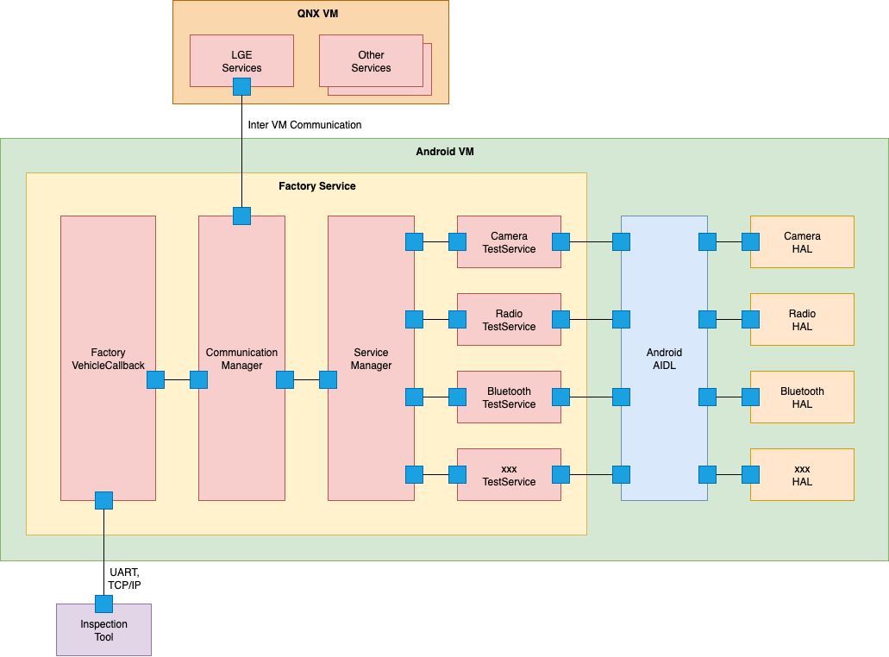
Image reference: doc_image_010.png

Figure 9 Component Diagram of Factory Service

Overview:

FactoryVehicleCallback is responsible for receiving PROP_FACTORY_COMMAND message from VHAL (Vehicle Hardware Abstraction Layer) and transfering it to CommunicationManager.

CommunicationManager is responsible for validating, parsing the raw message into FactoryMessage and then transfering the message to ServiceManager. It also manages the connection between FactoryService and LGEServices on other VMs.

ServiceManager is responsible for managing services. Each service has the capability to register/unregister with ServiceManager.

xxxTestService contains the logic test of a feature.

Overall Interaction:

ServiceManager acts as a middle-man, transferring message to other components.

xxxTestService collaborates with Android HALs to perform testing.

The CommunicationManager connects with LGE Services on other VMs through a network (Inter VM Communication) to perform testing the features located on outside Android VM.

Class Diagram

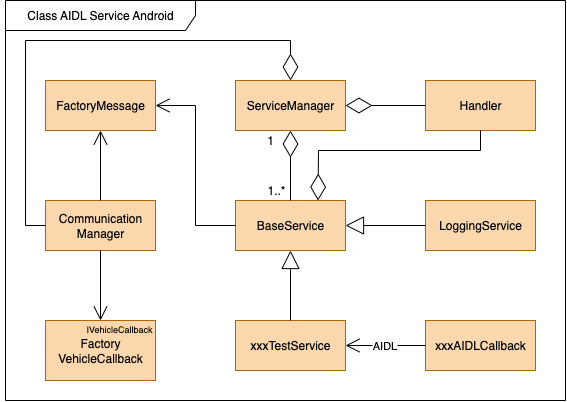
Image reference: doc_image_011.png

Figure 10 Class Diagram for Android AIDL Service proposal

The class diagram for the proposal of direct integration using the Android AIDL service outlines the structure and interaction of various components in Proposal 1 design:

ServiceManager

The central class manages all services in the system.

It registers, starts, and stops services, and provides an interface for other components to access and communicate with these services.

It acts as a point of communication between the BaseService and other service classes, helping to manage their lifecycle.

Handler

This is Android Handler allows sending and processing Message and Runnable objects associated with a thread’s MessageQueue.

BaseService

The base class from which other services inherits common functionalities.

It provides a generic structure and essential functions that other specialized services can use. This may include initializing the service, starting or stopping the service, and communication protocols.

It acts as a parent class for the xxxTestService, providing them with a standardized interface and common behaviors.

CommunicationManager

Manages the communication with external entities (such as the PC, test tools, or other services).

Handles sending and receiving data, likely implementing UART or TCP/IP protocols as needed. This ensures the proper exchange of commands and responses between the test tools and the Factory Service.

Works closely with ServiceManager to transfer message to the xxxTestService.

xxxTestService

Represents a specific testing service in the system.

Implements various testing functions (e.g., hardware diagnostics, functionality checks) defined by the factory’s requirements.

Inherits common functionalities from BaseService and works in coordination with external services to execute specific test commands.

LoggingService

Provides logging feature for all components in Factory Service.

Uses Android Log mechanism to write log.

Can export log into a text file for further analysis.

IVehicleCallback (FactorycmdVehicleCallBack)

Provides a callback interface for VHAL (Vehicle HAL) service.

Defines the methods for receiving and processing vehicle-specific data or commands in response to interactions with the MCU (Microcontroller Unit).

Works with the CommunicationManager to handle callbacks and processes data sent by the VHAL (Vehicle HAL) service, ensuring proper execution of vehicle-related tests.

xxxAIDLCallback

It’s a placeholder callback class for handling various AIDL service responses.

This class processes responses from different AIDL services (e.g., Diagnosis, ConfigHub) and forwards them to the appropriate handlers or components for further processing.

It acts as a communication bridge between xxxTestService and various AIDL services, handles callbacks and responses to the commands sent out.

Sequence Diagram

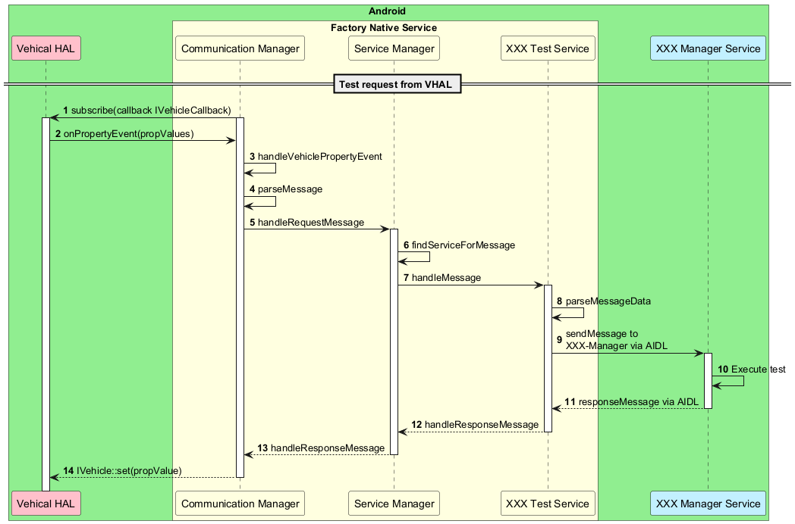
Image reference: doc_image_012.png

Figure 11 Sequence Diagram for Android AIDL Service proposal

Step description:

CommunicationManager subscribes to Vehicle HAL with propId: PROP_FACTORY_COMMAND. This ID is defined for Factory Micom message in system.

When Vehicle HAL broadcasts events, CommunicationManager will listen and verify with propId. If CommunicationManager verifies a valid event, it will start calling handleVehiclePropertyEvent method.

In handleVehiclePropertyEvent method, it will verify if it’s a valid Factory message or not. If it is a valid message, it will pack the message into Factory Message, then transfer it to Communication Manager.

Communication Manager receives request, then verifies if it’s a valid Factory Message or not. If it is a valid message, it will be sent to Service Manager.

Service Manager receives message, it will find the xxx Test Service that want to receive this message and send to it.

Request message will be pushed into a queue in MessageQueue of xxx Test Service.

xxx Test Service gets the Factory Message from MessageQueue and handles it.

xxx Test Service sends test request to XXX-Manager Service via AIDL.

XXX-Manager Service excutes the test.

After getting the result from a method based on command, it will call responseMessage method in XXX Test Service.

The XX Test Service handles the received message and transforms it to Factory Message.

In postMessage method in Service Manage, the command will be parsed, then the message will be pushed into an InternalService queue to wait sending result.

In InternalService queue, when a message result pushed to it, it will call handleMessage method. The parseResult method in Communication Manager will be called.

In responseResultToVhal, the IVehicle::set will be called to response result to Vehicle HAL. This will send result to Micom.

Architecture Design Proposals: Design 2 – Service Oriented Architecture

Software Architecture

The second design proposal introduces Factory Service in Service-Oriented Architecture (SOA). This approach connects multiple Factory Services to manage test requests more effectively.

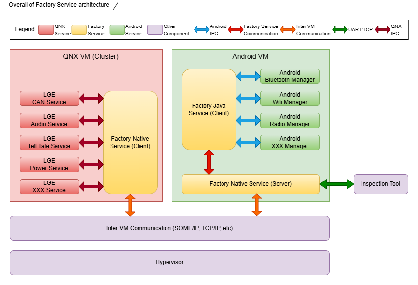
Image reference: doc_image_013.png

Figure 12 Factory Service Proposal Context Diagram

Overview

There are multiple Factory Services spread across Virtual Machines.

One Factory Service acts as Host and others are clients.

All the Factory Services are connected together and connect with other LGE Services on all VMs to perform feature testing.

Here’s a detailed breakdown of each component in the design:

Factory Native Service (Factory Host/Client):

Is a native C++ service and support to build on all platforms (QNX, Linux, Android)

Can be:

Factory Host: in charge of handling test requests, forward them to other Factory Clients, return test result, control life cycle of Factory Clients.

Factory Client: in charge of handling test requests from Factory Host.

Connect with other LGE/OEM services to perform testing.

Factory Java Service (Factory Client):

Work on Android platform only and always be a client.

In charge of testing special features likes: HDMI, Display, Graphics User Interface’s realted features, etc.

Reuse existing Android’s API for testing user features.

Connect with LGE Car Services to perform testing.

Pros

Reusability

The source code of Factory Service is splited into Core and Variant parts:

Core part includes common components, which can be reused across projects (protocol, default values, etc.).

Variant part includes logic tests specific to a project.

When applying to a new project, only the Variant part needed to be implemented while the Core part can be reused.

Compatibility

The Factory Service can be built and deployed on any platforms: QNX, Andoird, Linux.

Can be applied to all projects use virtualization/container platforms.

Interoperability

Factory Service supports many type of connections: D-Bus, Serial, TCP/IP, SOME/IP, etc. depend on the architect of project.

Factory Service has auto-reconnect mechanism when the connection is lost.

Factory Service can also connect to other services to perform testing and support many connection types.

Performance

Use multiple threads to handle concurrent requests.

Use thread sleep conditions to reduce CPU usage when idle, only waking when receiving requests.

Communicate with LGE Services on other VMs through the network stack, ensuring fast and reliable data exchange.

Cons

Challenging to trace logging information because distributed Factory Services, but this can be resolved by centralizing logs from all Factory Clients to the Factory Server.

Component Diagram

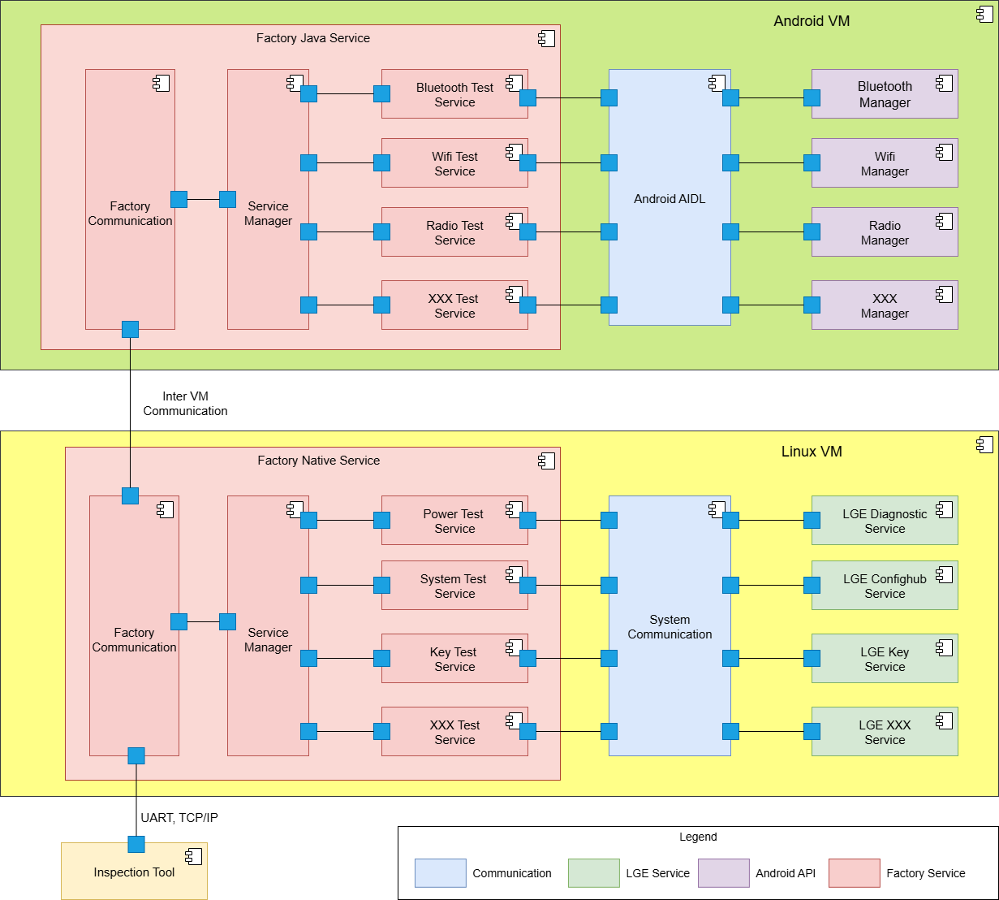
Image reference: doc_image_014.png

Figure 13 Component Diagram of Factory Service SOA proposal

Overview:

Service Manager is responsible for managing services. Each service has the capability to register/unregister with Service Manager.

A XXX Test Service can register the types of messages it wants to receive with Service Manager

Factory Communication is responsible for handle incoming/outcoming messages, it’s also inchare of parsing message and send it to Service Manager. It supports many type of connection likes: UART, TCP/IP, SOME/IP, D-Bus, etc depends on the need of project.

XXX Test Service can broadcast messages to other services through Service Manager

XXX Test service calls to API of LGE XXX Service to perform testing.

Overall Interaction:

The ServiceManager acts as the main controller, managing services, transfering message between services.

The FactoryCommunication uses the IConnection interface to support different communication methods (TCP/IP, Uart, D-Bus, SOME/IP), facilitating data exchange with external systems and other Factory Services.

The xxxTestService will connect with other LGE/OEM/System services to execute specific test operations.

Class Diagram

Image reference: doc_image_015.png

Figure 14 Class Diagram for Factory Service SOA proposal

The class diagram for design proposal 2, shows the structure and interactions of the system's various components. Here's a detailed breakdown of each class and its role in the system:

ServiceManager

Role: Manages the lifecycle of services within the system. Each service has the capability to register/unregister with ServiceManager.

Function: Acts as the central controller for starting, stopping, and managing services, transfer message to services. It ensures the proper coordination and execution of different services.

A service can broadcast messages to other services through ServiceManager.

TaskManager

Role: Handles message concurrently using multi threads.

Function: Has a message queue and a group of pre-initialized threads that are sleeping when the message queue is empty. When a message is pushed to the queue, it will wake up all the sleeping threads to handle the message queue until it is empty again.

Interaction: Links with the ServiceManager and BaseService to improve the message handling capability to prevent the “bottleneck” issue.

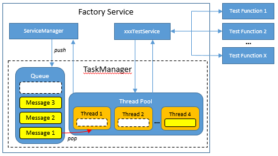
Image reference: doc_image_016.png

Figure 15 Design of TaskManager

BaseService

Role: Serves as the base class for all other services in the system.

Function: Provides common functionalities and an interface that xxxTestService can use. This class sets the foundation for reusability and consistency in service implementation.

Interaction: Inherited by xxxTestService, giving them common behaviors and structures for interacting within the system.

FactoryCommunication

Role: Manages communication of Factory Service.

Function: Uses an interface (IConnection) to handle different types of connections, such as TCP/IP, Serial, SOME/IP, D-Bus. This class abstracts the details of communication, allowing the system to connect with external services more flexible.

Interaction: Works with IConnection to support different connection types.

IConnection

Role: Defines a common interface for different connection types.

Function: Provides a standardized API for communication modules, allowing for various implementations (e.g., TCP/IP, Serial,D-Bus, SOME/IP). This interface supports flexibility in choosing different communication methods.

Interaction: Implemented by TCP/IP, Serial, D-Bus, SOME/IP classes to handle specific types of communication with the system.

TCP/IP, Serial, SOME/IP and D-Bus

Role: Implement specific types of connections.

Function: TCP/IP handles communication over a TCP/IP network, while Serial manages communication over a Serial port (UART) interface.

Interaction: They both implement the IConnection interface, providing concrete implementations for the CommunicationManager to use in managing external communications.

xxxTestService

Role: Represents a specialized test service within the system.

Function: Implements specific testing functionalities defined by the common API. It executes tests for different modules, interacting with the xxxLgeService to perform necessary operations.

Interaction: Inherits from BaseService. It interacts with xxxLgeService to handle specific testing services.

Pros:

Reusability:

The source code is divided into Core and Variant parts to maximize code reuse:

Core part includes common components, which can be reused across projects (protocol, default values, how factory can handle request/response, etc.).

Variant part includes logic tests specific to a project (Radio test, Wifi Test, etc.).

Streamlined Communication:

This design does not depend on any specific communication mechanisms to increase the flexibility.

The format used for communicate between Factory Host and Factory Clients is JSON format, so that it’s very flexible.

Modularity:

By implementing a base service (BaseService) and common interfaces (IConnection), this design enables modular development and integration of various services and communication methods.

Flexibility and Extensibility:

The use of the IConnection interface allows adding new types of connections (e.g., additional communication protocols) without modifying existing services. Similarly, the xxxTestService can be extended or replaced to accommodate new testing requirements.

This design proposal aims to provide interoperability, reusable, and compatibility architecture for managing communication and test services within the factory system. It achieves this through the SOA architecture, modular class structures, and interfaces that support various connection types and testing operations.

Sequence Diagram

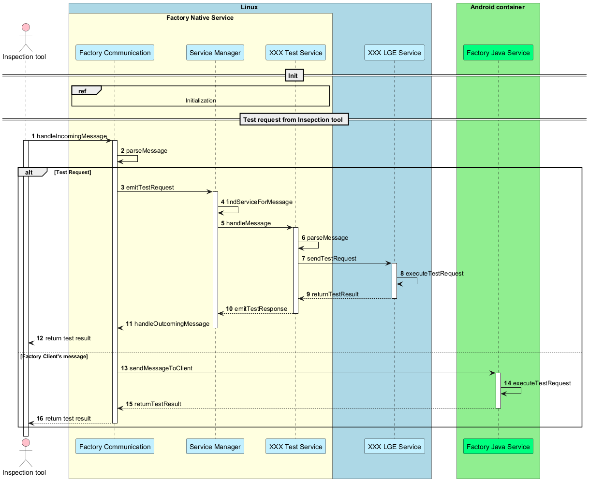
Image reference: doc_image_017.png

Figure 16 Sequence Diagram of how Factory Service (Host) handle test request

Step Description:

Inspection tool sends test request to Factory Service (Host) via TCP/IP, UART.

The Factory Communication receives the request and checks if the message can be handled by the Factory Service (Host). It then parses the message into a Factory Message and sends it to the Service Manager. If the message does not belong to the Factory Service (Host), it will be forwarded to the Factory Clients for handling.

Service Manager receives the message (example MessageID = 1) and find which XXX Test Services registered to the message (MessageID = 1) and send the message to its.

XXX Test Service receives the message and execute the test logic by calling XXX LGE Service.

XXX LGE Service execute the test request and return the result to XXX Test Service.

XXX Test Service returns the result to Service Manager.

Service Manager returns the result to Factory Communication.

Factory Communication parse the message to standard protocol format and return to the Inspection tool.

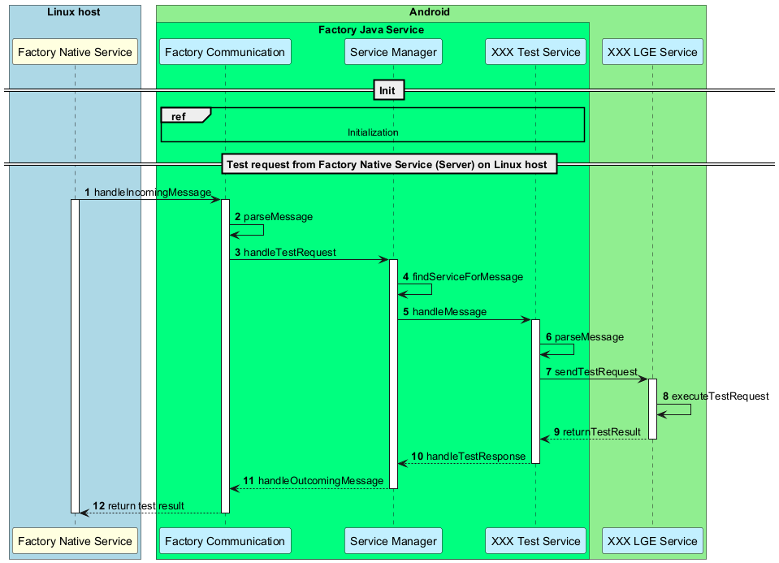
Image reference: doc_image_018.png

Figure 17 Sequence Diagram of how Factory Service (Client) handle test request

Factory Service (Server) sends test request to Factory Service (Client) via Inter VM Communication (TCP/IP, D-Bus, SOME/IP, etc).

Factory Communication receives the request and parses it to Factory Message with a unique ID and send to Service Manager.

Service Manager receives the message and find the XXX Test Services that registered to receive this MessageID before and send to its.

XXX Test Service receives the message and cooperates with other LGE/System services to execute the test request.

When finished, XXX Test Servcie returns the result to Service Manager.

Service Manager returns the result to Factory Communication.

Factory Communication receives the message and parses it to Factory JSON format and send to Factory Host.

Core and Variant Strategy

Image reference: doc_image_019.png

Figure 18 Design of Core and Variant parts

The Factory Service architecture separates the implementation into Core parts and Variant parts to maximize code reuse across multiple projects.

Each Project provides its own Variant part (C++ or Java), which contains project-specific logic.

The Core part (C++) is common and shared across all projects, ensuring reusability and consistency.

Both Core and Variant parts are compiled together to produce Factory Service binaries.

The resulting outputs are:

Factory Native Service (Server) and Factory Native Service (Client) for C++ components.

Factory Java Service (Client) for Java-based components.

The services are then deployed across different virtualization environments:

QNX VM (for safety-critical functions).

Linux VM (for native service execution).

Android VM (for Java-based services).

This design allows high code reuse, modularity, and cross-platform compatibility.

Logging Strategy

Unlike the previous design, logging in a distributed system is challenging because services run on different platforms. In the Factory Service, logging is a critical capability, since analyzing logs allows issues to be detected and resolved before products are shipped to customers. Therefore, the design must provide strong support for efficient logging and log analysis.

Image reference: doc_image_020.png

Figure 19 Logging Strategy in Factory Service Architecture

In this example, multiple Factory Clients run on different virtual machines (VM2, VM3) while a Factory Server runs on VM1. Each client generates logs during factory tests and sends them as Logging Requests to the server.

Factory Message: Logging is standardized as a message with a reserved command_id 16777214 (0xFFFFFE).

The data field contains the log payload in byte array format (e.g., [0x48, 0x65, 0x6C, 0x6C, 0x6F] for "Hello").

Each log entry includes metadata such as result and timestamp for traceability.

Factory Server: Collects these logging messages from all clients, processes them, and writes the entries into a central log file (FactoryLog.txt).

This approach provides:

Centralization → all logs stored in one place, easy to analyze.

Traceability → each log tied to a command_id and timestamp.

Scalability → new clients can be added without changing the logging design.

Factory Server - First Boot Strategy

In production, a key metric is UPH (Units per Hour), which measures how many products can be produced in one hour—the higher, the better. The design of the Factory Service has a direct impact on this metric. A major challenge in virtualization is the long boot time, since multiple operating systems must start simultaneously, making the process slower compared to traditional AVN projects that run on a single OS. Therefore, an efficient solution is required to minimize boot time and maximize UPH, because in production, time is money.

Boot sequence

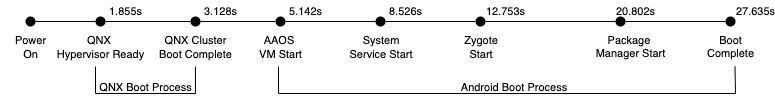
Image reference: doc_image_021.png

Figure 20 Boot Sequence in Virtualization Projects

The system begins at Power On, followed by the initialization of the QNX Hypervisor at 1.855 seconds. Once the hypervisor is ready, the QNX Cluster VM completes its boot sequence at 3.128 seconds, enabling core services in that environment.

At 5.142 seconds, the Android Automotive OS (AAOS) VM begins its startup. The Android boot process then progresses through several phases:

System Services start at 8.526 seconds, initializing key framework components.

Zygote starts at 12.753 seconds, bringing up the Java runtime environment.

The Package Manager begins execution at 20.802 seconds, handling application and service registration.

Finally, the system reaches Boot Complete at 27.635 seconds, with all major services operational.

Factory Server – First Boot Strategy

Image reference: doc_image_022.png

Figure 21 Factory Server - First Boot Strategy

The Factory Service operates as a distributed system across multiple VMs but provides a single, unified testing workflow.

Factory Native Server Start (2.424s) – The server initializes first on QNX, becoming the central hub for all test and logging requests.

Early Tests (3.265s – 5.802s) – Cluster HMI and essential functions are validated immediately.

Factory Native Client Start (8.622s) – Native clients in Android connect to the server, enabling broader test coverage.

OEM Key Provisioning & Extended Tests (13.853s – 18.604s) – Secure provisioning and subsystem validation continue.

Factory Java Client Start (24.113s) – The testing framework extends into Android Java-based services.

Final Functional Tests (30.884s) – Connectivity modules (Radio, Bluetooth, Wi-Fi) are verified.

Key Advantages

Even though services are distributed across QNX, Linux, and Android VMs, the Factory Service behaves like one unified testing system.

Testing begins as soon as QNX is ready, while other VMs are still booting.

This concurrency shortens overall test time, maximizes UPH (Units Per Hour), and ensures consistent results across platforms.

Design comparison

Table 4 Design comparsion

## Table
| QA | Priority | Design 1: Android AIDL and Inter VM Communication | Design 2: Service Oriented Architecture Design |
| --- | --- | --- | --- |
| Reusability | High | Medium When starting a new project or upgrading the Android OS, this design requires porting the existing code to align with the architecture. | High The architecture is divided into Core and Variant parts to maximize code reuse. Only the Variant part needs to be implemented when applying to a new project. |
| Interoperability | High | High Use inter-VM communication to interact with other services on different VMs to execute test features, enhancing the flexibility of communication and expanding the scope of the Factory Service. | High Use inter-VM communication to interact with other services on different VMs to execute test features, enhancing the flexibility of communication and expanding the scope of the Factory Service. |
| Compatibility | High | Medium Depend too much on Android and only suitable for projects that have supported APIs for testing on VMs. | High Can be deployed on any Operating System (OS). Can implement very complex test features that do not have supported APIs. |
| Performance | Medium | Medium Communication with services on other VMs through the network stack enables low latency and high performance. | Medium Communication with services on other VMs through the network stack enables low latency and high performance. Support concurrent testing to enhance the performance. |

Final decision: Design 2: Service Oriented Architecture Design

Experimental result

Table 5 Experimental result

## Table
| QA | QA Scenario | Tatic | Validation Method | Experimental Result | Experimental Result | Experimental Result | Experimental Result | Experimental Result |
| --- | --- | --- | --- | --- | --- | --- | --- | --- |
| QA-1 Reusability | The Factory Service achieves a high level of reusability, enabling approximately 40–60% of the code to be reused in future projects. | - Separate the source code into Core and Variant parts. - Only the Variant part need to be modified when applying to a new project. | Lines of code (LOC) can be reused when applied to a new project. - Core Reuse Ratio (CRR) CRR x 100 (Total LOC = Core + Variant) - Variant Share (VS) VS x 100 | - Factory Java Services CRR x 100 50.1% VS x 100 49.9% - Factory Native Service CRR x 100 53.7% VS x 100 46.3% | - Factory Java Services CRR x 100 50.1% VS x 100 49.9% - Factory Native Service CRR x 100 53.7% VS x 100 46.3% | - Factory Java Services CRR x 100 50.1% VS x 100 49.9% - Factory Native Service CRR x 100 53.7% VS x 100 46.3% | - Factory Java Services CRR x 100 50.1% VS x 100 49.9% - Factory Native Service CRR x 100 53.7% VS x 100 46.3% | - Factory Java Services CRR x 100 50.1% VS x 100 49.9% - Factory Native Service CRR x 100 53.7% VS x 100 46.3% |
| QA-2 Interoperability | The Factory Service must support flexible and reliable communication with other services, maintaining availability of 99.99% during operation. | Using network communication protocols (TCP, SOME/IP) to connect with services on other VMs, ensuring reliable and fast communication. | FS shall ensure reliable communication with other LGE services across VMs by successfully completing 1,000 test calls, verifying that request and response payloads are intact, ordered, and consistent, with no missing or corrupted data. Reliability x 100 | Project | Project | Project | HKMC Connect Wide | HKMC Connect Wide |
| QA-2 Interoperability | The Factory Service must support flexible and reliable communication with other services, maintaining availability of 99.99% during operation. | Using network communication protocols (TCP, SOME/IP) to connect with services on other VMs, ensuring reliable and fast communication. | FS shall ensure reliable communication with other LGE services across VMs by successfully completing 1,000 test calls, verifying that request and response payloads are intact, ordered, and consistent, with no missing or corrupted data. Reliability x 100 | Total calls | Total calls | Total calls | 1000 | 1000 |
| QA-2 Interoperability | The Factory Service must support flexible and reliable communication with other services, maintaining availability of 99.99% during operation. | Using network communication protocols (TCP, SOME/IP) to connect with services on other VMs, ensuring reliable and fast communication. | FS shall ensure reliable communication with other LGE services across VMs by successfully completing 1,000 test calls, verifying that request and response payloads are intact, ordered, and consistent, with no missing or corrupted data. Reliability x 100 | Success | Success | Success | 1000 | 1000 |
| QA-2 Interoperability | The Factory Service must support flexible and reliable communication with other services, maintaining availability of 99.99% during operation. | Using network communication protocols (TCP, SOME/IP) to connect with services on other VMs, ensuring reliable and fast communication. | FS shall ensure reliable communication with other LGE services across VMs by successfully completing 1,000 test calls, verifying that request and response payloads are intact, ordered, and consistent, with no missing or corrupted data. Reliability x 100 | Failures | Failures | Failures | 0 | 0 |
| QA-2 Interoperability | The Factory Service must support flexible and reliable communication with other services, maintaining availability of 99.99% during operation. | Using network communication protocols (TCP, SOME/IP) to connect with services on other VMs, ensuring reliable and fast communication. | FS shall ensure reliable communication with other LGE services across VMs by successfully completing 1,000 test calls, verifying that request and response payloads are intact, ordered, and consistent, with no missing or corrupted data. Reliability x 100 | Reliability = 100% | Reliability = 100% | Reliability = 100% | Reliability = 100% | Reliability = 100% |
| QA-3 Compatibility | The Factory Service should be fully compatible with projects deployed on a Virtualization Platform, and must be able to build and run on different operating systems, including Android, QNX, and Linux. | - Factory Service (C++) for QNX, Linux. - Factory Service (Java) for Android. | Build the Factory Service and deploy it across projects that run on different virtualization architectures (hypervisor, container). | Project | HKMC Connect Wide | HKMC Connect Wide | HKMC Connect Wide | BMW RSE27 |
| QA-3 Compatibility | The Factory Service should be fully compatible with projects deployed on a Virtualization Platform, and must be able to build and run on different operating systems, including Android, QNX, and Linux. | - Factory Service (C++) for QNX, Linux. - Factory Service (Java) for Android. | Build the Factory Service and deploy it across projects that run on different virtualization architectures (hypervisor, container). | Architect | Hypervisor | Hypervisor | Hypervisor | LXC container |
| QA-3 Compatibility | The Factory Service should be fully compatible with projects deployed on a Virtualization Platform, and must be able to build and run on different operating systems, including Android, QNX, and Linux. | - Factory Service (C++) for QNX, Linux. - Factory Service (Java) for Android. | Build the Factory Service and deploy it across projects that run on different virtualization architectures (hypervisor, container). | Result | Can be deployed | Can be deployed | Can be deployed | Can be deployed |
| QA-4 Performance | The Factory Service shall process large data volumes concurrently, ensuring stable operation with response times below 20ms in almost cases. | Design FS as multithreaded application to enhance the performance. | Execute 100 parallel test requests across all VMs. Each request performs no processing and simply returns a “pass” result to the inspection tool. During the test, CPU usage, RAM usage, and request latency shall be measured, where latency = t_response – t_request | Average Latency | Average Latency | 6.039ms | 6.039ms | 6.039ms |
| QA-4 Performance | The Factory Service shall process large data volumes concurrently, ensuring stable operation with response times below 20ms in almost cases. | Design FS as multithreaded application to enhance the performance. | Execute 100 parallel test requests across all VMs. Each request performs no processing and simply returns a “pass” result to the inspection tool. During the test, CPU usage, RAM usage, and request latency shall be measured, where latency = t_response – t_request | Max CPU Usage | Max CPU Usage | 0.5% | 0.5% | 0.5% |
| QA-4 Performance | The Factory Service shall process large data volumes concurrently, ensuring stable operation with response times below 20ms in almost cases. | Design FS as multithreaded application to enhance the performance. | Execute 100 parallel test requests across all VMs. Each request performs no processing and simply returns a “pass” result to the inspection tool. During the test, CPU usage, RAM usage, and request latency shall be measured, where latency = t_response – t_request | Max RAM Usage | Max RAM Usage | 0.3% | 0.3% | 0.3% |
| QA-4 Performance | The Factory Service shall process large data volumes concurrently, ensuring stable operation with response times below 20ms in almost cases. | Design FS as multithreaded application to enhance the performance. | Execute 100 parallel test requests across all VMs. Each request performs no processing and simply returns a “pass” result to the inspection tool. During the test, CPU usage, RAM usage, and request latency shall be measured, where latency = t_response – t_request | Request Success: 100% | Request Success: 100% | Request Success: 100% | Request Success: 100% | Request Success: 100% |

After evaluation and testing, this design has been chosen as the final option for BMW RSE27 and HKMC Connect Wide.
