# Raw Slide Content

- Source file: FA_nguyen2.nguyen/Common Factory Service Design for AVN Virtualization Projects_Final.pptx
- Total slides: 18

## Slide 1

Common Factory Service Design for AVN Virtualization Projects

NGUYEN DUONG NGUYEN
Supervised by Ahn.Woosuk
LGEDV - Factory Inspection SW Team

Image reference: slide_01_image_01.png

## Slide 2

TABLE OF CONTENT

2

2

Comparison & Decision

4

Detail Design

5

Problem Identification

Q&A

6

Architecture Design Proposals

3

1

Background

## Slide 3

3

Background

Factory Service (FS) is the service that designed for line test in the factory.
After assembly, all products must be inspected to ensure there are free of defects before shipment

Image reference: slide_03_image_01.png

Image reference: slide_03_image_02.png

Assembly
17m

Inspection
28m

Label/Pin vision/Packing
8m

Image reference: slide_03_image_03.png

Image reference: slide_03_image_04.png

Inspection environment

Test Request/
Response

PC

③ Ethernet Module

Test Request/
Response

①

Image reference: slide_03_image_05.wmf

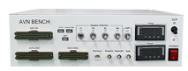
Image reference: slide_03_image_06.png

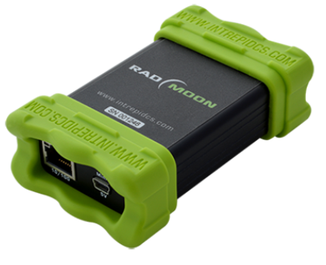
Image reference: slide_03_image_07.png

Ethernet

② Test Bench

APIX

Image reference: slide_03_image_08.png

Inspection tool

Basic Functions of Factory Service

Communicate with inspection tool using: UART or TCP.
Execute the test request and respond the result to inspection tool in a predefined protocol format

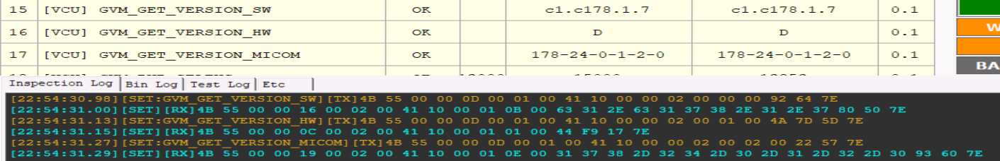
Image reference: slide_03_image_09.png

Standard protocol

## Slide 4

4

Problem Identification

Current Design

Overall Design of AVN Virtualization Project

Current Design of Factory Service in AVN projects

Centralized compute units and a hypervisor that run multiple virtual machine instances.
Services on VMs connected together over a network (Inter VM Communication).

Use AIDL to call APIs from Android Hardware Abstraction Layer (HAL) for feature testing.
Designed as Native Service (C++) to run on Android OS only.

Image reference: slide_04_image_01.png

Image reference: slide_04_image_02.png

## Slide 5

5

Problem Identification

The Problem of Current Design

The current design of Factory Service is intended to run on Android only.
If the features that need to be tested at LGE VH Factory are located across Virtual Machines.
 The current design can not be applied.

Problem

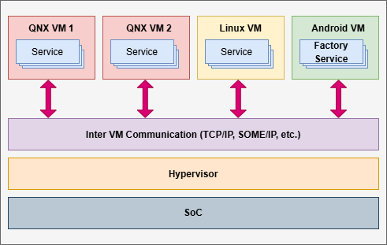
Image reference: slide_05_image_01.png

New features need to be inspected

Scope of the
Factory Service

## Slide 6

Quality Attributes

6

### Table
| # | QA Scenario | Quality Attribute | Priority |
| QA.01 | The Factory Service shall be designed for high reusability, allowing approximately 40–60% of its codebase to be reused in future projects without major changes. | Reusability | High |
| QA.02 | The Factory Service shall support stable and reliable communication with other services across VMs/Containers, with a target availability of 99.99% during operation. | Interoperability | High |
| QA.03 | The Factory Service shall be fully compatible with virtualization platforms and capable of running on different operating systems, including Android, QNX, and Linux. | Compatibility | High |
| QA.04 | The Factory Service shall process large data volumes concurrently while remaining stable, ensuring most requests complete within 20ms under expected load (excluding test logic execution). | Performance | Medium |

Problem Identification

## Slide 7

Functional Requirements

7

### Table
| # | QA Scenario |
| FR.01 | The Factory Service shall communicate with other LGE/OEM services across VMs and Containers. It receives verification requests via inter-VM protocols such as TCP/SOME-IP, processes them, and returns the results. If communication fails, the service shall send an error response and record the failure in logs in detail. |
| FR.02 | The Factory Service shall accept test requests from the Inspection Tool as commands delivered via TCP socket or UART in the Standard Protocol format. The service shall execute each command and return the result in the same format. Malformed or unsupported requests shall be rejected with an error response, and the incident shall be logged. |
| FR.03 | The Factory Service shall execute predefined test cases such as Wi-Fi, Bluetooth, Display, etc. Each test command is identified by a unique ID (e.g., 0x130001 – Enable Wi-Fi), executed, and the result with a timestamp is returned. If a test fails due to subsystem issues, the service shall log the error, mark the test as failed, and return the result to the Inspection Tool. |
| FR.04 | The Factory Service shall detect errors and centralize logs from all test activities. Execution results and events are collected through the logging API and stored in FactoryLog.txt. |

Problem Identification

Constraints

### Table
| # | Constraints | Type |
| CO.01 | Factory Service should follow Coding Convention (STATIC, CERT-CPP, CERT-JAVA, MISRA-CPP) and AI Code Review | Technical Constraint |
| CO.02 | The protocol for communication between the Inspection Tool/Services and Factory Service must be flexible to adapt to the different requirements of each project | Technical Constraint |

## Slide 8

8

Architecture Design Proposals

Design 1: Android AIDL and Inter VM Communication

Reuse the Factory Service from existing AVN projects on Android.
Use AIDL to call APIs from the Android Hardware Abstraction Layer (HAL) for testing.
Connect with other LGE services on other VM over a network.

Pros
Reusability:
Reuse the source code of Factory Service on Android to enhance reusability for new projects.
Interoperability:
Use Inter VM Communication to interact with other LGE services for testing, enhancing the flexibility of communication.
Performance:
Fast and reliable communication is achieved by connecting with LGE services on other VMs through the network stack.

Cons
This design shows its weakness if features on other VMs are too complicated or unsupported by LGE services.

QA.02: Interoperability
QA.04: Performance

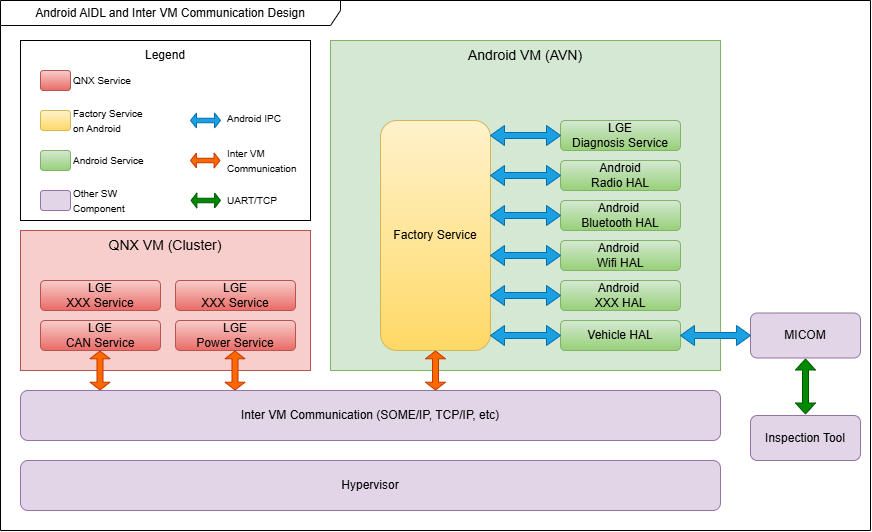
Image reference: slide_08_image_01.png

The design

QA.01: Reusability

The Architect of Design 1

## Slide 9

9

Architecture Design Proposals

Design 2: Service-Oriented Architecture Design

Factory Service has two types:
Factory Native Service is a C++ service that:
Can be built for QNX, Android, Linux.
Act as Factory Server or Factory Client.
Factory Java Service is a Java service that:
Only used on Android and acts as Factory Client.
Use Android’s APIs to execute test features.
Factory Services are  located across VMs and connected together through a network.
Factory Server receives test requests and forwards them to Factory Clients.

Pros
Reusability:
Split into Core and Variant parts for better reusability:
Core part includes common components, which can be reused across projects (protocol, default values, etc.).
Variant part includes logic tests specific to a project.
Compatibility:
Does not depend on any specific platform.
Interoperability:
Use Inter VM Communication to interact with other LGE services for testing, enhancing the flexibility of communication.
Performance:
Fast and reliable communication is achieved by connecting with LGE services on other VMs through the network

The design

Image reference: slide_09_image_01.png

QA.01: Reusability
QA.03: Compatibility

QA.02: Interoperability
QA.04: Performance

Cons
Log tracing is difficult in distributed services, but this can be resolved by centralizing logs from all Factory Clients to the Factory Server.

The Architect of Design 2

## Slide 10

Design Comparison

### Table
| QA | Priority | Design 1: Android AIDL and Inter VM Communication | Design 2: Service-Oriented Architecture Design |
| Reusability | High | Medium When starting a new project or upgrading the Android OS, this design requires porting the existing code to align with the architecture. | High The architecture is divided into Core and Variant parts to maximize code reuse. Only the Variant part needs to be implemented when applying to a new project. |
| Interoperability | High | High Use inter-VM communication to interact with other services on different VMs to execute test features, enhancing the flexibility of communication and extending the scope of Factory Service. | High Use inter-VM communication to interact with other services on different VMs to execute test features, enhancing the flexibility of communication and extending the scope of Factory Service. |
| Compatibility | High | Medium Depend too much on Android and only suitable for projects that have supported APIs for testing on VMs. | High Can be deployed on any Operating System (OS). Can implement very complex test features that do not have supported APIs. |
| Performance | Medium | Medium Communication with services on other VMs through the network stack enables low latency and high performance. | Medium Communication with services on other VMs through the network stack enables low latency and high performance. Support concurrent testing to enhance the performance. |

Final Decision: Design 2 Service-Oriented Architecture Design

10

## Slide 11

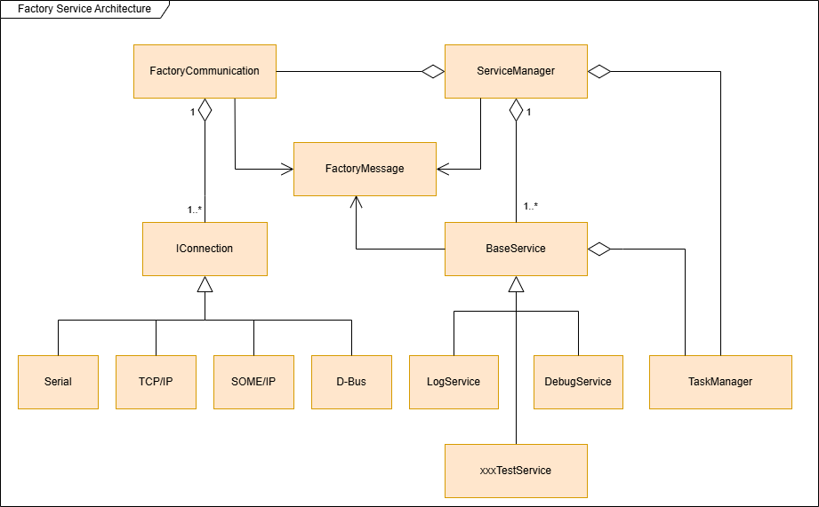
Image reference: slide_11_image_01.png

11

Detail Design of Design 2 – Static View

QA.01: Reusability
Core part (Reused across projects)

Variant part
(Specific test logic for a project)

The thread pool will manage a group of pre-initialized threads, allowing them to be reused for executing multiple tasks concurrently.
When new test message is received, FS will enqueue the message to a queue.
This queue work as a buffer, hold the pending tasks until the work threads are ready to execute them.
All the threads are asleep when idle (i.e., when the queue is empty) and only wake up when a message has been pushed to the queue.
 Prevent bottlenecks and improve FS performance.

The design of TaskManager class

Class diagram of Factory Service

The design of TaskManager class

QA.04: Performance

Queue

Message 1

Message 2

Message 3

Thread Pool

Thread 1

…

Factory Service

Thread 2

Thread 4

ServiceManager

push

xxxTestService

Test Function 2

Test Function 1

Test Function X

…

TaskManager

pop

Strategy
Pattern

Singleton
Pattern

## Slide 12

12

Detail Design of Design 2 – Sequence Diagram

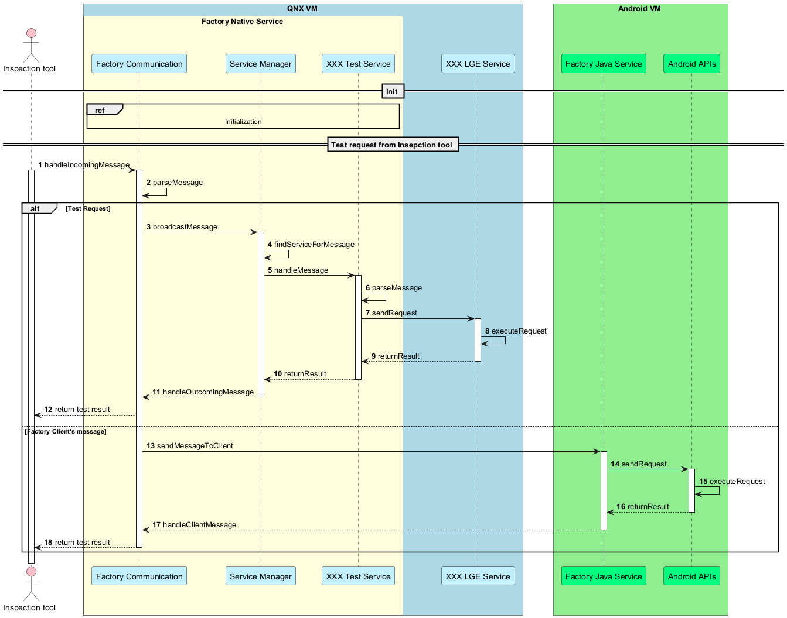
Image reference: slide_12_image_01.png

Sequence diagram of the Factory Service when receiving a request from the Inspection Tool

## Slide 13

Experimental Result

13

## Slide 14

Q&A

Thank you for listening

14

## Slide 15

Appendix

15

## Slide 16

16

Core and Variant Strategy

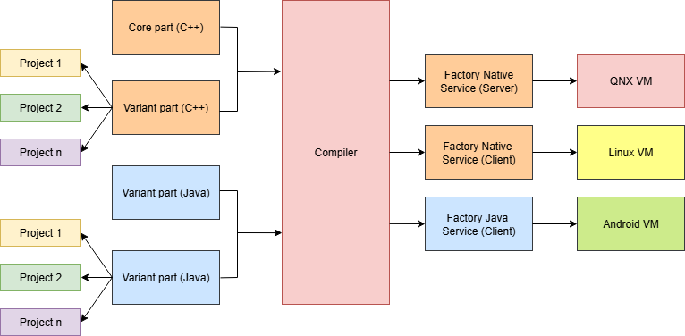
Image reference: slide_16_image_01.png

Design of Core and Variant part

Source code of Factory Java Service and Factory Native Service is divided into Core and Variant parts.
The Core part includes common components that can be reused across projects.
The Variant part contains logic test specific to a project.
The Core part can be built separately from  the Variant part.
     This design allows high code reuse, modularity, and cross-platform compatibility.

The design

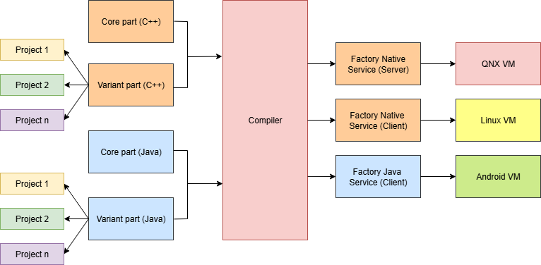
Image reference: slide_16_image_02.png

## Slide 17

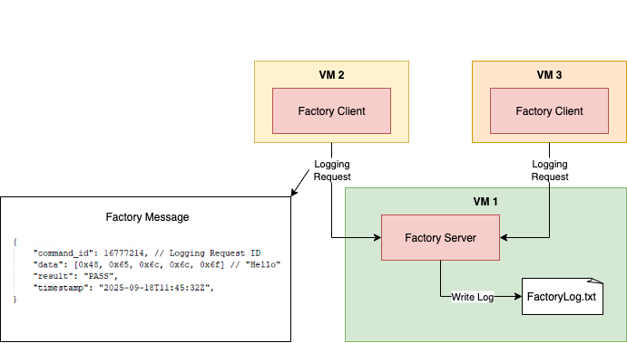
Image reference: slide_17_image_01.png

17

Logging Strategy

Logging Strategy in Factory Service Architecture

During testing, each Factory Client sends its logs to the Factory Server.
Factory Server centralizes the logs and writes them to FactoryLog.txt for further analysis.
Factory Service uses JSON format for transferring.
Each request has an Unique ID, data, result and timestamp.

The design

Pros
Centralization
       → All logs stored in one place, easy to analyze.
Traceability
      → Each log tied to an Unique ID and timestamp.
Scalability
     → New clients can be added without changing the logging design.

## Slide 18

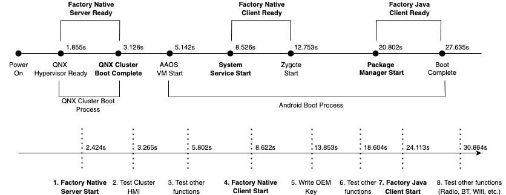
Image reference: slide_18_image_01.png

18

Factory Server – First Boot Strategy

The Factory Native Server boots first and enables early testing while waiting for other Factory Clients to start.
Once tests on Factory Native Server are completed, the Factory Clients on other VMs boot up and become available to test additional functions.
     This concurrency shortens overall test time, maximizes UPH (Units Per Hour), and ensures consistent results across platforms.

The design

Factory Server – First Boot Strategy

