# Raw Document Content

- Source file: FA_Si.Nguyen_V2Xmgr_Commonization/FA_Software_Design_Document_V2Xmgr_v1.0.docx

FA Project: Design of Commonization for V2X Manager for telematic projects

Software Design Document

Table of contents

1.	About this Document	4

1.1	Document Information	4

1.2	Revision History	4

1.3	Purpose	5

1.4	Scope	5

1.5	Related Documents	5

1.6	Abbreviations / Terms	5

2.	Project Context	6

2.1	Project Overview	6

2.2	Background Explanation	6

3.	Architectural Driver	8

3.1	Problem Description	8

3.1.1	Missing the Commonization	8

3.1.2	Bottleneck Problem	8

3.2	Functional Requirements and Quality Attributes	10

3.2.1	Functional Requirements	10

3.2.2	Quality Attributes	10

3.3	System Context Diagram	11

4.	Architectural Alternatives	12

4.1	Tiger service with multi-threading	12

4.2	V2XMgr services with LGVF (LG Vision Framework)	14

4.3	Split V2X Manager service into multiple Tiger services	16

5.	Architectural Diagram	18

5.1	Tiger service with multi-threading	18

5.1.1	Static view	18

5.1.2	Dynamic View	21

5.1.3	Interfaces Design	21

5.2	V2XMgr services with LGVF (LG Vision Framework)	24

5.2.1	Static view	24

5.2.1.1	V2xTigerProxyService	25

5.2.1.2	V2xConfigService	27

5.2.1.3	V2xDiagService	28

5.2.1.4	V2xSecurityService	30

5.2.1.5	V2xStateService	32

5.2.1.6	V2xStackProxyService	34

5.2.2	Dynamic View	36

5.2.2.1	V2xTigerProxyService	36

5.2.2.2	V2xConfigService	38

5.2.2.3	V2xDiagService	40

5.2.2.4	V2xSecurityService	43

5.2.2.5	V2xStateService	44

5.2.2.6	V2xStackProxyService	46

5.2.3	Interfaces Design	47

5.3	Split V2X Manager service into multiple Tiger services	51

5.3.1	Static view	51

5.3.1.1	V2xLocationService	52

5.3.1.2	V2xConfigService	53

5.3.1.3	V2xDiagService	54

5.3.1.4	V2xSecurityService	56

5.3.1.5	V2xStateService	57

5.3.1.6	V2xVehicleDataService	58

5.3.2	Dynamic view	60

5.3.2.1	V2xLocationService	60

5.3.2.2	V2xConfigService	61

5.3.2.3	V2xDiagService	62

5.3.2.4	V2xSecurityService	63

5.3.2.5	V2xStateService	64

5.3.2.6	V2xVehicleDataService	65

5.3.3	Interfaces Design	65

6.	Comparison between the alternatives	68

7.	Architectural decision and rationale	69

8.	How to verify Final architecture design	70

8.1	Verify throughput of the design	70

8.2	Implementation of design in VCM project	71

9.	Conclusion	75

About this Document

Document Information

## Table
| Document Title | FA Project : Design of Commonization for V2X Manager for telematic projects |
| --- | --- |
| Issuing Authority | Name: Nguyen Van Si |
| Configuration ID | T.B.D |
| Status of Document | In Progress |

Revision History

## Table
| Document Version | Date | Content of Change | Author | Approver | Reviewer |
| --- | --- | --- | --- | --- | --- |
| 0.1 | 2025-8-11 | Initial Release | Nguyen Van Si | Seungchul Yi | Seungchul Yi |
| 0.2 | 2025-8-27 | - Updated description for “8.1 Class diagram” - Updated “8.3 Interfaces Design” - Updated Performance test for “8.4 Implementation and Comparison with the original design” - Updated “1. About this Document” - Updated “3.2 Functional Requirements and Quality Attributes” - Updated “9 Conclusion” | Nguyen Van Si | Seungchul Yi | Seungchul Yi |
| 0.3 | 2025-9-9 | - Updated “Functional Requirements” table and “Quality Attributes” table - Moved Class diagrams and Sequence diagrams to “5. Architectural Diagram” for “5.2 LGVF (LG Vision Framework) with V2Xmgr sub-services” - Added Class diagrams and Sequence diagrams for “5.1 Tiger service with multi-threading” and “5.3 Split V2X Manager service into multiple Tiger services” - Updated “6. Comparison between the alternatives” - Added “8.2 Implementation of design in VCM project” | Nguyen Van Si | Seungchul Yi | Seungchul Yi |
| 1.0 | 2025-9-25 | - Updated “6. Comparison between the alternatives” - Finalize the document | Nguyen Van Si | Seungchul Yi | Seungchul Yi |

Purpose

This document specifies the software architecture design for the V2X manager service in JLR-VCM Project.

Scope

This document covers for the design for V2X manager service include below content:

Overview

Architectural Drivers (Functional Requirement, Quality Attribute, Constraint)

SW Architectural Representations

Architectural Alternatives

Architectural Decision

Architecture Diagram

Related Documents

[1]	EVAC_V2X SRD

[2]	[SAD-30397538] V2X Service

[3]	VCM_V2X_Requirements

Abbreviations / Terms

## Table
| Abbreviation | Description |
| --- | --- |
| VCM | Vehicle Connectivity module |
| TCUA | Telematics Control Unit Application |
| HAL | Hardware Abstraction Layer |
| CP | Communication processor |
| AP | Application processor |
| LGVF | LG Vision Framework |
| CMS stack | Commsignia Stack |
| SCMS | Security Credential Management System |
| PKI | Public key infrastructure |
| V2X | Vehicle-to-Everything |
| LDM | Local Dynamic Map |
| ECU | Electronic Control Unit |

Project Context

Project Overview

The VCM (Vehicle Connectivity Module) project is a comprehensive automotive connectivity solution developed in partnership between LG Electronics and Jaguar Land Rover (JLR), integrated with TCUA (Telematics Control Unit Application).

The VCM project encompasses a wide range of vehicle connectivity features built on embedded Linux platform, running on SA515M and SA2150P processors with MCU integration.

LGE takes almost full responsibility for the VCM software platform, including HAL, middleware components, and application framework running on Linux OS.

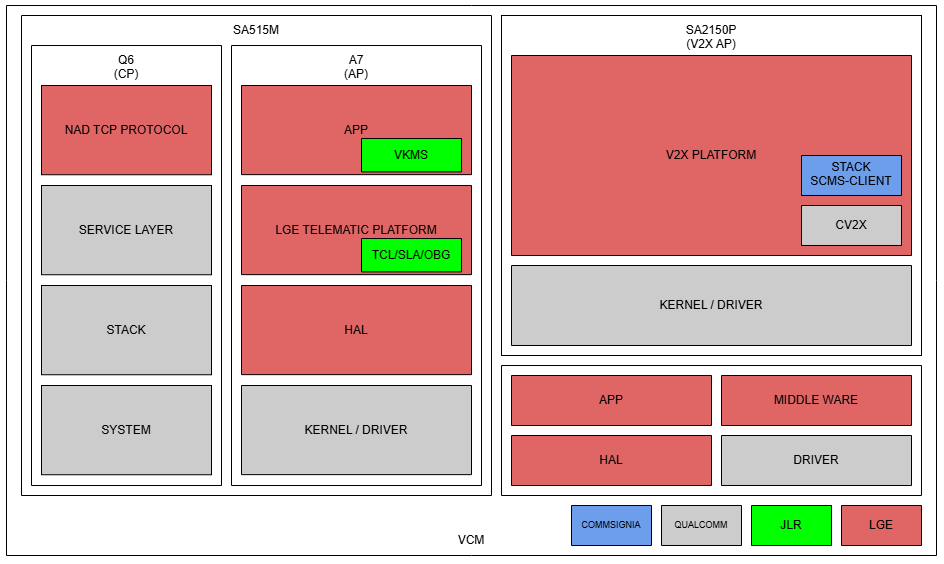
Image reference: doc_image_001.png

Figure 1: JLR-VCM overview concept

Background Explanation

V2X, or Vehicle-to-Everything, is a technology that allows vehicles to communicate with other vehicles, infrastructure, and pedestrians using wireless networks, improving road safety and efficiency.

V2X Manager (the yellow box in the below picture) is a service within the V2X platform in V2X AP (SA2150P). V2X Manager is responsible for functions such as receiving data from other services, processing it, and forwarding the data to third-party engines.

V2X Manager is the wrapper service to receive, process data from Config Manager, Location Manager, Diagnostic Manager, SomeIP Manager,… and forward this data to V2X Stack to broadcast the V2X message over CV2X module. In addition, V2X Manager also receives V2X messages from the V2X Stack and forwards them to the V2X application.

Image reference: doc_image_002.png

Figure 2: JLR-VCM SW Architecture (Overall)

Architectural Driver

Problem Description

Missing the Commonization

In the future, the V2X Manager service will be present in many projects. However, there is currently no common design of the V2X Manager that allows for the reuse of common parts and minimizes effort when implementing the V2X Manager in new projects. Therefore, we need a design for the commonization of V2X Manager within JLR-VCM that can be reused for future projects.

Bottleneck Problem

The original V2X Manager design was inherited from the V2X Manager in the BMW project, with V2X Manager implemented as a Tiger service to communicate with other services following the Tiger Platform architecture as the diagram below.

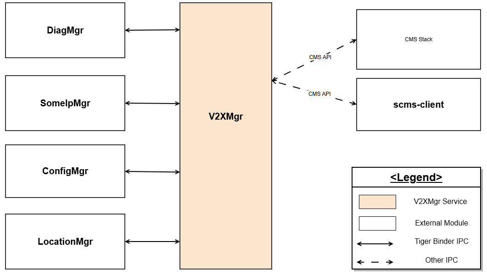
Image reference: doc_image_003.png

Figure 3: Overview structure of V2X communication

This design is the typical Tiger service pattern with Binder IPC communication, where multiple Tiger services (Location manager service, Diagnostic manager service, and Config manager service, SomeIP manager service,...) communicate with V2X Manager service through Binder IPC.

Image reference: doc_image_004.png

Figure 4: Flow of data between other services with V2X service

Binder will allocate a thread for communicating by using thread pool resource. The number of threads in the thread pool is defined in source (typically around 4~8). sendMessage() function applied mutex to prevent conflicts during message sending.

Image reference: doc_image_005.png

Figure 5: SomeIP Data Processing in V2X Manager Sequence

However, this architecture caused significant response time issues due to the design limitations. When receiving messages from other services, the V2X Manager had to handle them one by one through a message queue managed by a single Looper thread (The RED box in Figure 5). This single-threaded processing mechanism created a critical bottleneck, as all incoming messages from Location, Diagnostic, Config, and SomeIP services were queued in First-In-First-Out method, regardless of their priority or urgency.

The sequential processing approach led to substantial delays, especially under high message loads. Each message must wait for all preceding messages to complete processing before being handled, causing cumulative delays that can range from milliseconds to several seconds.

This performance issue is problematic for V2X applications, which require real-time or near-real-time processing capabilities to meet safety-critical timing requirements. Emergency V2X messages that should be processed within 10-50ms for collision avoidance scenarios become delayed by lower-priority configuration or power management messages already in the queue.

Functional Requirements and Quality Attributes

Functional Requirements

## Table
| FR ID | Description |
| --- | --- |
| FR#1 | VCM shall be capable of receiving the data that forms a V2X message from another ECU. For example; vehicle speed, triggers, path prediction, sensor data, high precision position. |
| FR#2 | VCM shall be capable of sending LDM (Local Dynamic Map) V2X objects over Ethernet to other ECUs in a protocol/market agnostic way (object type message, like vehicle, traffic light, pedestrian, etc). Message format to be defined during the development of the project. |
| FR#3 | VCM shall be capable of supporting the reception of non-standard (JLR Bespoke) V2X messages and send the data to another ECU. |

Quality Attributes

## Table
| QA ID | Description | Quality Attributes | Priority |
| --- | --- | --- | --- |
| QA#1 | The design should have minimum 20MB/s throughput. | Performance | High |
| QA#2 | The design should have the common part to reuse in the new projects. | Reusability | Medium |
| QA#3 | The solution should be designed in a way that ensures the system applying it is easy to maintain. | Maintainability | Low |

System Context Diagram

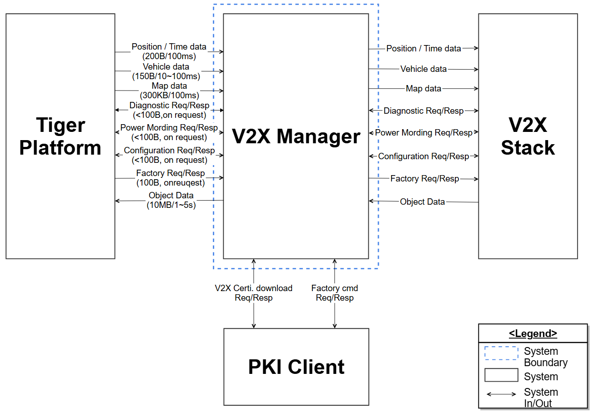
Image reference: doc_image_006.png

Figure 6: System Context Diagram

## Table
| Module | Role |
| --- | --- |
| V2X Manager | Receive data from other tiger services to process and update to V2X Stack. Receive the data/signal from V2X stack to forward to other tiger services. Receive and process to download certificate. |
| Tiger Platform | Included the tiger services communicate with V2X Manager. |
| V2X Stack | The V2X engine to process data and control CV2X module |
| PKI client | Manages digital certificates, process to request the certificates |

Architectural Alternatives

Tiger service with multi-threading

This alternative architecture takes a less-changed approach to the current design. We will add the new handlers run on the new threads. The Main thread will forward the messages to process on the new handler threads thus the bottleneck will be resolved.

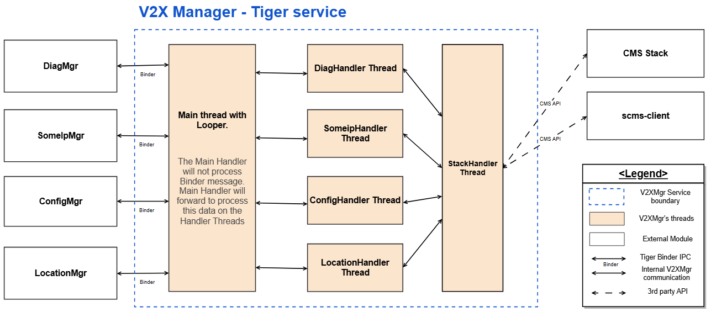
Image reference: doc_image_007.png

Figure 7: Tiger service with multi-threading concept

## Table
| Module | Role |
| --- | --- |
| DiagMgr | Tiger service to receive the update from V2Xmgr to update Diagnostic data |
| SomeipMgr | Tiger service to forward vehicle data to V2Xmgr and receive the data from V2Xmgr and forward to other components like OBG and CCCM module |
| ConfigMgr | Tiger service to send the config to V2Xmgr |
| LocationMgr | Tiger service to location data to V2Xmgr |
| Main thread | Main thread responsible for tiger interface (LocationMgr, DiagMgr, SomeIpMgr...). Forward data to other handler thread to process data. |
| Location handler thread | Location handler thread is responsible for the location data processing and update the Stack handler. |
| Config handler thread | Config handler thread is responsible for the provisioning/configuration for V2XManager and external modules (CMS stack and SCMS-Client) |
| Someip handler thread | Someip handler thread is responsible for vehicle data (from CCCM) processing. |
| Diag Handler thread | Diag Handler thread is responsible for the function of processing the diagnostic command when each service cannot directly process the diagnostic command, process the diag data from DiagMgr and CMS Stack to start the diagnostic function |
| Stack handler thread | Stack handler thread is responsible for stack interface (Commsignia, Cohda...), providing certificate-related functions, such as v2x certificate download and status check. Stack handler thread control and transfer navigation signal, vehicle signal, stack enable, disable, etc. according to the 3'rd Party Stack. |
| CMS Stack | V2X engine to receive data from V2Xmgr and control the CV2X module |
| SCMS-client | Manage the certificate for V2X communication |

Image reference: doc_image_008.png

Figure 8: The sequence diagram of the fixed issue with multi-threading alternative

In this example sequence diagram, V2xmgrSomeipHandler and V2xmgStackHandler have been separated into two new threads. So, the Main thread, after forwarding data to the V2xmgrSomeipHandler thread (in the green box), can return to continue processing the messages in the Looper's message queue to forward it to other Handler threads. This will reduce the waiting time of the messages in the queue and solve the bottleneck problem.

V2XMgr services with LGVF (LG Vision Framework)

LGVF is a message-driven service framework developed by LG for automotive applications. LGVF is capable of managing services. It can be applied to V2Xmgr design to divide V2Xmgr blocks into subservices and initialize, start, pause, stop these subservices. LGVF framework also has a service on/off mechanism through configuration in xml file, which can be applied to configure many different projects. Thereby increasing the reusability of the design.

Alternative architecture with the design consisting of sub-services, there will be a service that receives messages from other Tiger services and forward them to the corresponding service without processing them, thus solving the bottleneck in the old design.

LGVF can be deployed in either Tiger platform, Linux or Windows so this solution can be reused in many future projects.

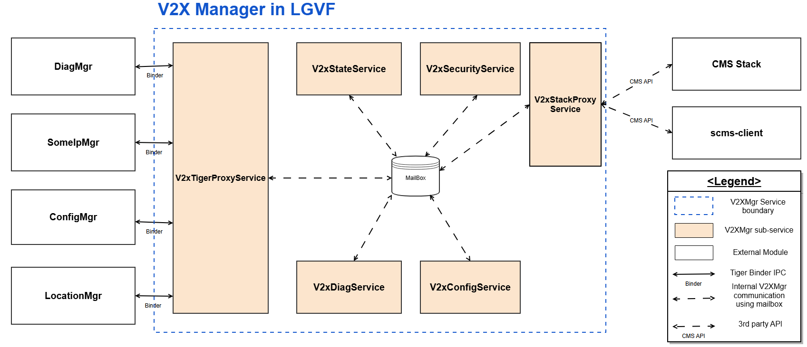
Image reference: doc_image_009.png

Figure 9: V2XMgr services with LGVF concept

## Table
| Module | Role |
| --- | --- |
| V2xTigerProxyService | V2xTigerProxyService is responsible for tiger interface (LocationMgr, DiagMgr, SomeIpMgr...). V2xTigerProxyService will transfer data to other V2X Service. |
| V2xConfigService | V2xConfigService is responsible for the provisioning/configuration for V2XManager and external modules |
| V2xDiagService | V2xDiagService is responsible for the function of processing the diagnostic command when each service cannot directly process the diagnostic command. |
| V2xSecurityService | V2xSecurityService is responsible for providing certificate-related functions, such as v2x certificate download and status check. |
| V2xStateService | V2xStateService is responsible for managing V2X Manager and managing external modules according to LifeCycle. |
| V2xStackProxyService | V2xStackProxyService is responsible for stack interface (Commsignia, Cohda...). V2xStackProxyService control and transfer navigation signal, vehicle signal, stack enable, disable, etc. according to each 3'rd Party Stack. Responsible for the location data forwarding to the V2X Stack. |
| DiagMgr | Tiger service to receive the update from V2Xmgr to update Diagnostic data |
| SomeipMgr | Tiger service to forward vehicle data to V2Xmgr and receive the data from V2Xmgr and forward to other components like OBG and CCCM module |
| ConfigMgr | Tiger service to send the config to V2Xmgr |
| LocationMgr | Tiger service to location data to V2Xmgr |
| CMS Stack | V2X engine to receive data from V2Xmgr and control the CV2X module |
| SCMS-client | Manage the certificate for V2X communication |

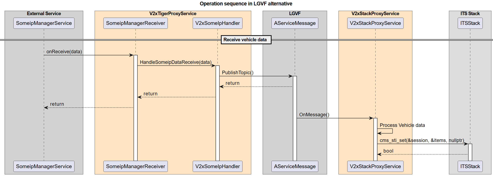
Image reference: doc_image_010.png

Figure 10: The sequence diagram of the fixed issue with V2XMgr services with LGVF alternative

In this example sequence diagram, the V2xTigerProxyService will receive and forward data message by public data to Mailbox (the green box), the responsible service will continue process this data and the V2xTigerProxyService can back to forward the other messages to other V2X services. This solution will reduce the waiting time of the messages in the queue and solve the bottleneck problem.

Split V2X Manager service into multiple Tiger services

This alternative architecture requires creating additional Tiger services for V2Xmgr to communicate directly with the existing Tiger services to receive data and send this message to the CMS Stack.

This design requires new Tiger services for V2Xmgr to split up the receiving of messages from multiple Tiger services, thereby reducing the bottleneck in the original design.

Image reference: doc_image_011.png

Figure 11: Split V2X Manager service into Multiple Tiger services concept

## Table
| Module | Role |
| --- | --- |
| V2xLocationService | V2xLocationService is responsible for receive location data and update to Stack |
| V2xConfigService | V2xConfigService is responsible for the provisioning/configuration for V2XManager and external modules |
| V2xStateService | V2xStateService is responsible for managing V2X Manager service and CMS Stack. |
| V2xDiagService | V2xDiagService is responsible for the function of processing the diagnostic data and forward to CMS Stack and V2xStateService |
| V2xSecurityService | V2xSecurityService is responsible for providing certificate-related functions, such as v2x certificate download and status check. |
| V2xVehicleDataService | V2xVehicleDataService is responsible for receive vehicle data from CCCM via SomeIP service and update to CMS Stack |
| DiagMgr | Tiger service to receive the update from V2Xmgr to update Diagnostic data |
| SomeipMgr | Tiger service to forward vehicle data to V2Xmgr and receive the data from V2Xmgr and forward to other components like OBG and CCCM module |
| ConfigMgr | Tiger service to send the config to V2Xmgr |
| PowerMgr | Tiger service to send the power config/state to V2Xmgr |
| LocationMgr | Tiger service to location data to V2Xmgr |
| CMS Stack | V2X engine to receive data from V2Xmgr and control the CV2X module |
| SCMS-client | Manage the certificate for V2X communication |

Image reference: doc_image_012.png

Figure 12: The sequence diagram of the fixed issue in Multi Tiger services alternative

In this example sequence diagram, the V2xVehicleDataService will receive the data from SomeIPMgr service and processing in on another thread before set to Stack (in the green box). So, there is no bottleneck for other data from other services.

Architectural Diagram

Tiger service with multi-threading

Static view

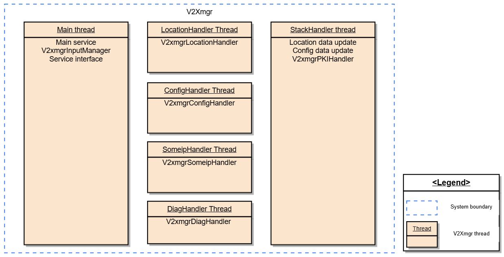
Image reference: doc_image_013.png

Figure 13: Tiger service with multi-threading module view

Module Define:

## Table
| Module | Role |
| --- | --- |
| Main thread | Main thread responsible for tiger interface (LocationMgr, DiagMgr, SomeIpMgr...). Forward data to other handler thread to process data. |
| Location handler thread | Location handler thread is responsible for the location data processing and update the Stack handler. |
| Config handler thread | Config handler thread is responsible for the provisioning/configuration for V2XManager and external modules (CMS stack and SCMS-Client) |
| Someip handler thread | Someip handler thread is responsible for vehicle data (from CCCM) processing. |
| Diag Handler thread | Diag Handler thread is responsible for the function of processing the diagnostic command when each service cannot directly process the diagnostic command, process the diag data from DiagMgr and CMS Stack to start the diagnostic function |
| Stack handler thread | Stack handler thread is responsible for stack interface (Commsignia, Cohda...), providing certificate-related functions, such as v2x certificate download and status check. Stack handler thread control and transfer navigation signal, vehicle signal, stack enable, disable, etc. according to the 3'rd Party Stack. |

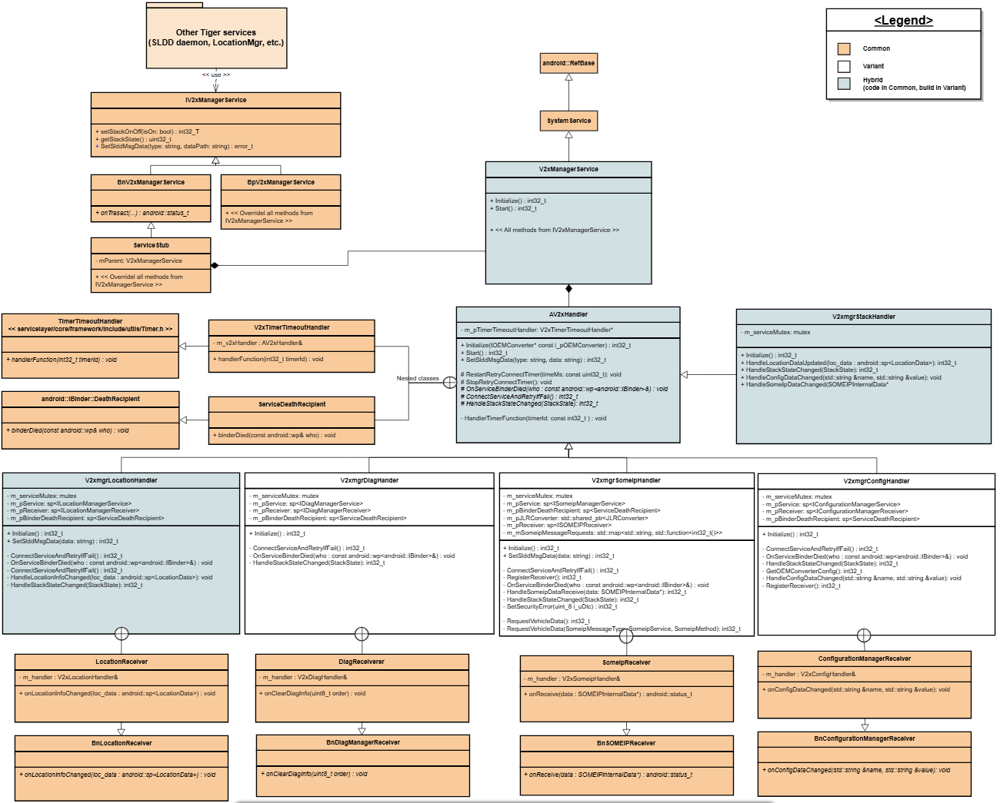
Image reference: doc_image_014.png

Figure 14: V2xManagerService class diagram

## Table
| Class | Description |
| --- | --- |
| IV2xManagerService | Interface base service class for V2X Manager services, provides methods for HSM, enrollment, and stack state management, ... |
| BnV2xManagerService | Binder native implementation of IV2xManagerService, overrides all interface methods, handles onTransact for IPC. |
| BpV2xManagerService | Binder proxy implementation of IV2xManagerService, overrides all interface methods for client-side IPC. |
| ServiceStub | Stub class holding a reference to the parent V2xManagerService, overrides all interface methods for service-side IPC. |
| V2xManagerService | Main V2X Manager service implementation, inherits from android::RefBase and SystemService, manages worker threads and exposes service methods. |
| AV2xHandler | Base worker thread class for V2xManagerService, handles timer events, retry logic, and service connection management. |
| V2xLocationHandler | Worker thread for location updates, manages service and receiver references, handles location. |
| V2xDiagHandler | Worker thread for diagnostic updates, manages service and receiver references, handles diagnostic and stack change events. |
| V2xSecurityHandler | Worker thread for security events, manages service and receiver references, handles security and stack change events. |
| V2xConfigHandler | Worker thread for configuration updates, manages service and receiver references, handles configuration. |
| V2xmgrStackHandler | Worker thread that communicates with the ITS stack, handles stack API calls and processes stack events for V2xManagerService, such as: update location data, update config data,... |
| LocationReceiver | Implements location receiver logic, holds reference to worker thread, handles location info changes. |
| DiagReceiver | Implements diagnostic receiver logic, holds reference to worker thread, handles diagnostic info changes. |
| SomeipReceiver | Implements SOMEIP receiver logic, holds reference to worker thread, handles SOMEIP data changes. |
| ConfigManagerReceiver | Implements configuration manager receiver logic, holds reference to worker thread, handles configuration data changes. |
| BnLocationReceiver | Binder native implementation for location receiver, handles onLocationInfoChanged for IPC. |
| BnDiagReceiver | Binder native implementation for diagnostic receiver, handles onClearDiagInfo for IPC. |
| BnSomeipReceiver | Binder native implementation for SOMEIP receiver, handles onReceive for IPC. |
| BnConfigManagerReceiver | Binder native implementation for configuration manager receiver, handles onConfigDataChanged for IPC. |
| TimerTimeoutHandler | Base handler class for timer timeouts, provides handleFunction for timer events. |
| V2xTimerTimeoutHandler | Specialized timer timeout handler for V2X, holds reference to V2xHandler, overrides handleFunction. |
| android::IBinder::DeathRecipient | Android base class for binder death notifications. |
| ServiceDeathRecipient | Handles binder death events for the service, inherits from android::IBinder::DeathRecipient. |

Dynamic View

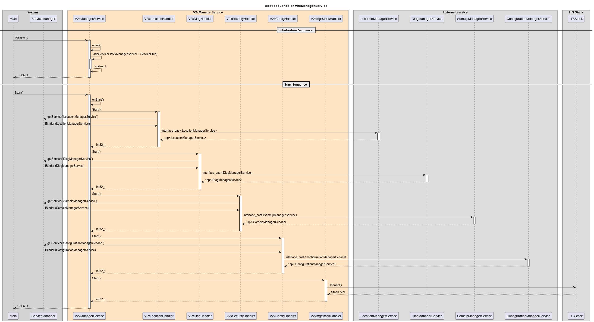
Image reference: doc_image_015.png

Figure 15: Boot sequence of V2xManagerService

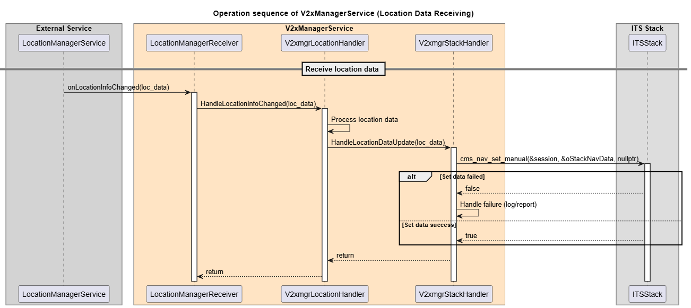
Image reference: doc_image_016.png

Figure 16: Operation sequence of V2xManagerService (Location Data Receiving)

Interfaces Design

V2xManagerService Interface:

## Table
| sendStackState | sendStackState |
| --- | --- |
| Syntax | int32_t setStackOnOff(bool isOn) |
| Desciption | Sets stack state (on or off) in the V2xStateService |
| Parameter | bool |
| Return | int32_t |

## Table
| getStackState | getStackState |
| --- | --- |
| Syntax | uint32_t getStackState |
| Desciption | Retrieves the current stack state from the V2xStateService |
| Parameter | N/A |
| Return | uint32_t |

## Table
| SetSlddMsgData | SetSlddMsgData |
| --- | --- |
| Syntax | error_t SetSlddMsgData(const std::string& i_sType, const std::vector<std::string>& i_data) |
| Desciption | Set data for config, diag, someip handler,... |
| Parameter | string, vector<std::string> |
| Return | error_t |

Common Callback/Recevier Interfaces

## Table
| onLocationInfoChanged | onLocationInfoChanged |
| --- | --- |
| Syntax | void onLocationInfoChanged(const android::sp<LocationData> data) |
| Desciption | This function is a callback that is invoked by the LocationManagerService whenever new location information is available. |
| Parameter | android::sp<LocationData> |
| Return | N/A |

## Table
| onConfigDataChanged | onConfigDataChanged |
| --- | --- |
| Syntax | void onConfigDataChanged(std::string& name, std::string& value) |
| Desciption | This callback function is invoked by the ConfigurationManagerService whenever the configuration data is updated, providing the updated name and value. |
| Parameter | string, string |
| Return | N/A |

## Table
| onClearDiagInfo | onClearDiagInfo |
| --- | --- |
| Syntax | void onClearDiagInfo(const uint8_t order) |
| Desciption | This callback function is invoked by the DiagManagerService when a request to clear diagnostic information is received. |
| Parameter | uint8_t |
| Return | N/A |

## Table
| onReceive | onReceive |
| --- | --- |
| Syntax | android::status_t onReceive(lge::someipmgr::SOMEIPInternalData* const i_pData) |
| Desciption | This callback function is invoked by the SomeipManagerService whenever a new SOMEIP message is received, passing the message data to the handler for processing. |
| Parameter | lge::someipmgr::SOMEIPInternalData |
| Return | android::status_t |

V2XMgr services with LGVF (LG Vision Framework)

Static view

Image reference: doc_image_017.png

Figure 17: V2XMgr services with LGVF module view

Module Define:

## Table
| Module | Role |
| --- | --- |
| V2xTigerProxyService | V2xTigerProxyService is responsible for tiger interface (LocationMgr, DiagMgr, SomeIpMgr...). V2xTigerProxyService will transfer data to other V2X Service. |
| V2xConfigService | V2xConfigService is responsible for the provisioning/configuration for V2XManager and external modules |
| V2xDiagService | V2xDiagService is responsible for the function of processing the diagnostic command when each service cannot directly process the diagnostic command. |
| V2xSecurityService | V2xSecurityService is responsible for providing certificate-related functions, such as v2x certificate download and status check. |
| V2xStateService | V2xStateService is responsible for managing V2X Manager and managing external modules according to LifeCycle. |
| V2xStackProxyService | V2xStackProxyService is responsible for stack interface (Commsignia, Cohda...). V2xStackProxyService control and transfer navigation signal, vehicle signal, stack enable, disable, etc. according to each 3'rd Party Stack. Responsible for the location data forwarding to the V2X Stack. (Location data need to update to stack without any processing step. So, there is no V2xLocationService to reduce the resource.) |

V2xTigerProxyService

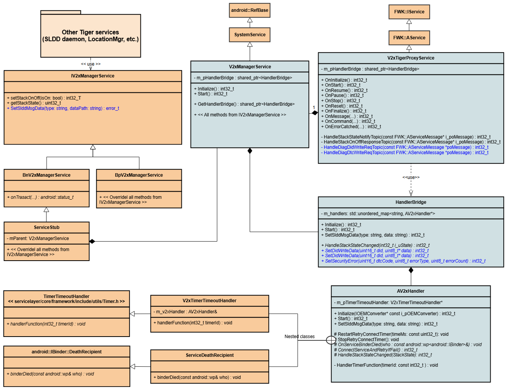
Image reference: doc_image_018.png

Image reference: doc_image_019.png

Figure 18: V2xTigerProxyService class diagram

## Table
| Class | Description |
| --- | --- |
| FWK::IService | Interface base service class of LGVF |
| FWK::AService | Abstract base service class of LGVF |
| V2xTigerProxyService | Main proxy service that routes messages with external services. Inherits from FWK::AService. Manages service lifecycle (initialize, start, stop, finalize). Integrates with LGVF framework to communicate with internal V2X services |
| V2xManagerService | Core V2X manager handling actual V2X business logic and operations |
| IV2xManagerService | Defines the public API contract for the V2X Manager Service |
| HandlerBridge | Bridge pattern implementation translating between common layer and Tiger-Binder call |
| AV2xHandler | Abstract class defines a common interface for V2X message handlers (V2xLocationHandler, V2xDiagHander, V2xSomeipHandler, V2xConfigHandler, …) |
| V2xTimerTimeoutHandler | Handle timer timeout function of the parent AV2xHandler class, which then handles retry logic for V2X service connections. |
| TimerTimeoutHandler | Handling timer timeout events, allowing different timeout behaviors |
| ServiceDeathRecipient | Monitor and handle death of V2X-related Android services (LocationService, SomeipService, DiagService, ConfigService) |
| android::IBinder::DeathRecipient | Android base class handles Binder service die |
| BnV2xManagerService | Inherits from android::BnInterface<IV2xManagerService> to receives and processes remote calls |
| BpV2xManagerService | Inherits from android::BnInterface< IV2xManagerService> to marshals calls and sends them to server |
| ServiceStub | ServiceStub refers to the complete client-server communication infrastructure |

V2xConfigService

Image reference: doc_image_020.png
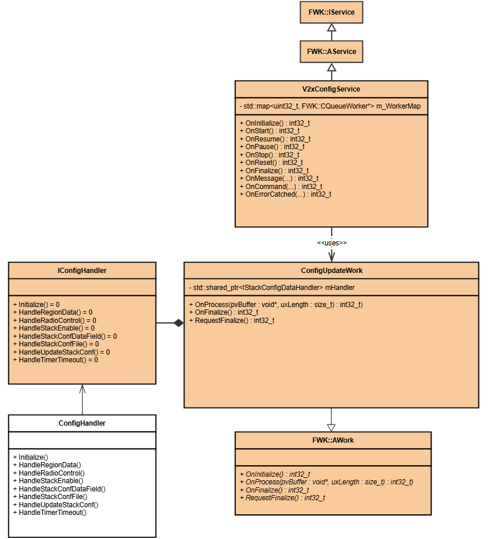
Image reference: doc_image_021.png

Figure 19: V2xConfigService class diagram

## Table
| Class | Description |
| --- | --- |
| FWK::IService | Interface base service class of LGVF |
| FWK::AService | Abstract base service class of LGVF |
| FWK::AWork | Abstract base class for worker threads in the LGVF’s work processing system. |
| V2xConfigService | Main configuration management service class, inherits from FWK::AService, will handles all configuration requests from ConfigManager service |
| ConfigUpdateWork | Worker for processing configuration update messages |
| IConfigHandler | Interface for configuration management handlers |
| ConfigHandler | JLR variant-specific configuration control handler |

V2xDiagService

Image reference: doc_image_022.png
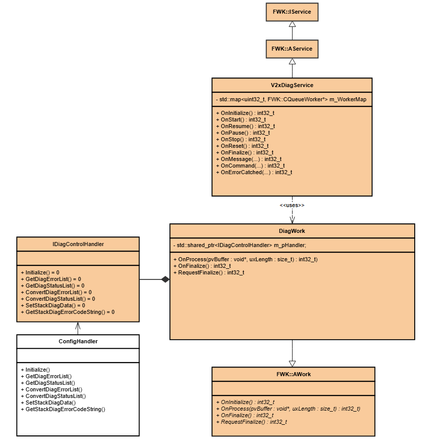
Image reference: doc_image_023.png

Figure 20: V2xDiagService class diagram

## Table
| Class | Description |
| --- | --- |
| IService | Interface base service class of LGVF |
| AService | Abstract base service class of LGVF |
| FWK::AWork | Abstract base class for worker threads in the LGVF’s work processing system. |
| V2xDiagService | Main diagnostics management service class, inherits from FWK::AService, will handles all requests from DiagManager service and Stack service |
| DiagWork | Worker for processing diagnostic messages and logic |
| IDiagControlHandler | Abstract interface for diagnostic handler implementations |
| DiagControlHandler | Core diagnostic logic implementation |

V2xSecurityService

Image reference: doc_image_024.png

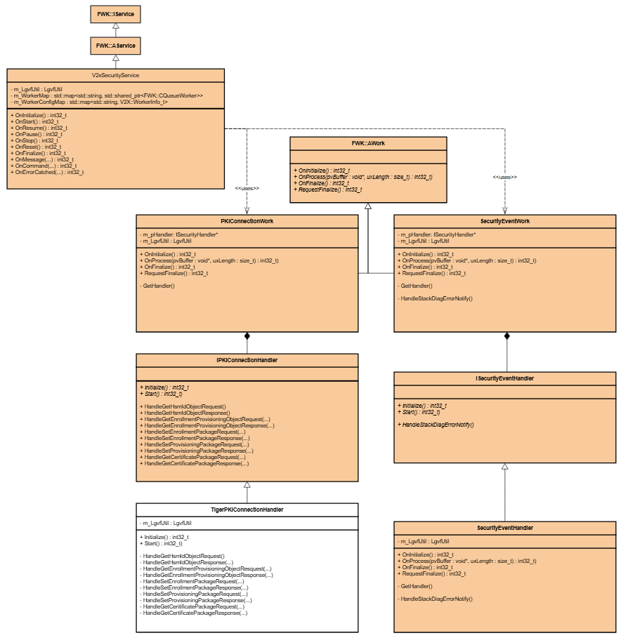
Image reference: doc_image_025.png

Figure 21: V2xSecurityService class diagram

## Table
| Class | Description |
| --- | --- |
| IService | Interface base service class of LGVF |
| AService | Abstract base service class of LGVF |
| FWK::AWork | Abstract base class for worker threads in the LGVF’s work processing system. |
| V2xSecurityService | Main service class that inherits from FWK::AService, Manages security-related operations for V2X communication |
| SecurityEventWork | Worker thread that processes security event-related messages. Processes stack diagnostic notifications and converts them to security events. Routes diagnostic events to appropriate security event handlers |
| ISecurityEventHandler | Abstract interface for handling security events |
| SecurityEventHandler | Converts stack diagnostic notifications to security events. |
| PKIConnectionWork | Worker thread that handles PKI (Public Key Infrastructure) operations. Processes certificate and enrollment-related requests/responses. |
| IPKIConnectionHandler | Abstract interface for PKI connection operations |
| TigerPKIConnectionHandler | Tiger platform-specific PKI connection handler. It will be build on Variant side |

V2xStateService

Image reference: doc_image_026.png
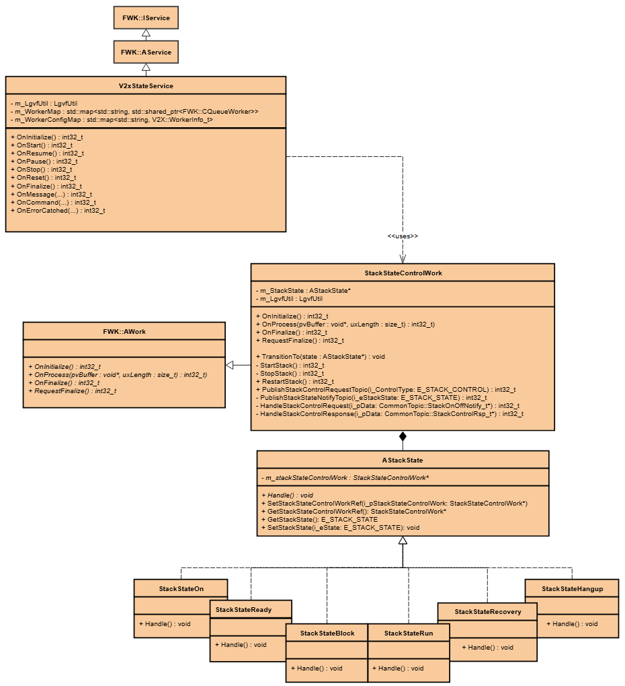
Image reference: doc_image_027.png

Figure 22: V2xStateService class diagram

## Table
| Class | Description |
| --- | --- |
| IService | Interface base service class of LGVF |
| AService | Abstract base service class of LGVF |
| FWK::AWork | Abstract base class for worker threads in the LGVF’s work processing system. |
| V2xStateService | Main service class that manages V2X stack state operations. Inherits from FWK::AService. |
| StackStateControlWork | Worker thread that handles stack state control operations. |
| AStackState | Abstract base class for all V2X stack states |
| StackOffState | Handles operations when V2X stack is turned off Status: Stack process is off. Action: V2xmgr now waits for start event. |
| StackOnState | Handles operations when V2X stack is actively running Status: Stack process is started. Action: V2xmgr will connect to Stack (more correctly, connect to Stack remote APIs). |
| StackInitState | Handles stack initialization and startup procedures Status: default when V2Xmgr initially Action: V2xmgr will prepare the initial data and check the stack state. |
| StackStateBlock | Represents a "BLOCK" state where the V2X stack is blocked/restricted Status: V2X message transmission is disabled Action: V2xmgr will not transmit any message. |
| StackStateHangup | Represents a "HANGUP" state indicating stack connection issues Status: Stack is stuck due to error, or Stack connection is disconnected. Action: V2xmgr will retry connection with Stack. |
| StackStateReady | Represents a "READY" state where stack is prepared but not receive any ON request. Status: Stack connection is established. Action: V2xmgr will check if V2X message transmission is enabled or not. |
| StackStateRecovery | Represents a "RECOVERY" state for error recovery operations Status: Stack has critical issues, or the working flow has failure. Action: V2xmgr will restart Stack process. |
| StackStateRun | Represents the "RUN" state where the V2X stack is actively running Status: V2X message transmission is enabled. Action: V2xmgr will transmit messages normally. |

V2xStackProxyService

Image reference: doc_image_028.png
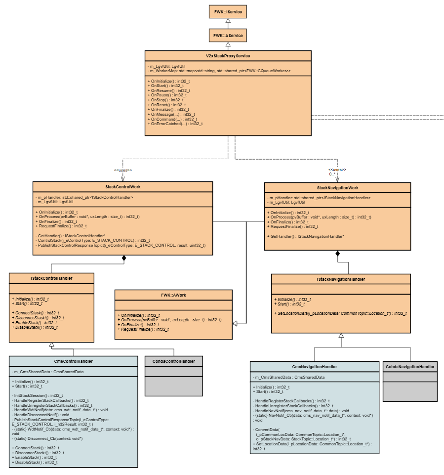
Image reference: doc_image_029.png

Figure 23: V2xStackProxyService class diagram (Part 1 - with StackControlWork and StackNavigationWork)

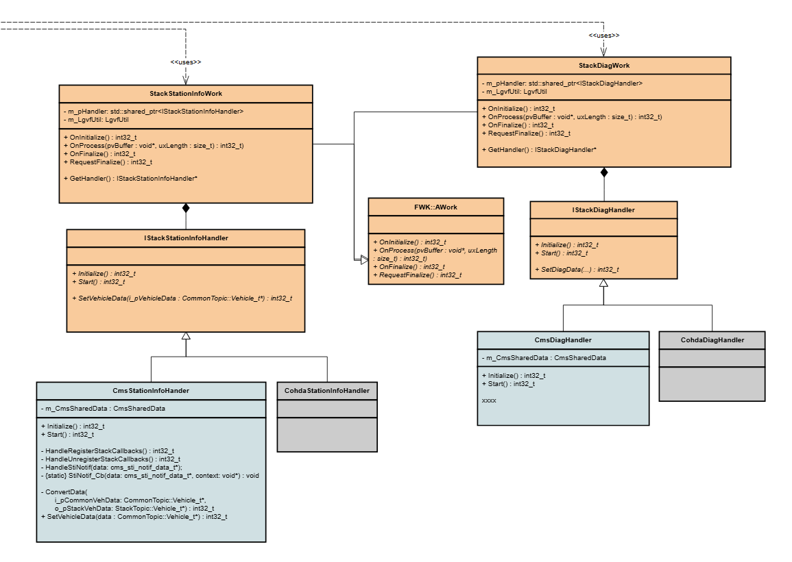
Image reference: doc_image_030.png

Figure 24: V2xStackProxyService class diagram (Part 2 - with ssStackStationInfoWork and StackDiagWork)

## Table
| Class | Description |
| --- | --- |
| IService | Interface base service class of LGVF |
| AService | Abstract base service class of LGVF |
| FWK::AWork | Abstract base class for worker threads in the LGVF’s work processing system. |
| V2xStackProxyService | Main service class that acts as a proxy between the V2X stack and other services inherits from FWK::AService to handles message routing between V2X stack and other components |
| StackControlWork | Worker thread that handles stack control operations |
| IStackControlHandler | Abstract interface for stack control operations |
| CmsControlHandler | Implementation of stack control for CMS Stack in VCM project |
| StackDiagWork | Worker thread that handles stack diagnostic operations |
| IStackDiagHandler | Abstract interface for stack diagnostic operations |
| CmsDiagHandler | Handles diagnostic operations for CMS stack in VCM project |
| StackNavigationWork | Worker thread that handles navigation data to send to stack |
| IStackNavigationHandler | Abstract interface for navigation data handlingss |
| CmsNavigationHandler | Handles navigation data for CMS stack |
| StackStationInfoWork | Worker thread that handles station information to send to stack |
| IStackStationInfoHandler | Abstract interface for station information handling |
| CmsStationInfoHandler | Handles station information for CMS stack |

Dynamic View

V2xTigerProxyService

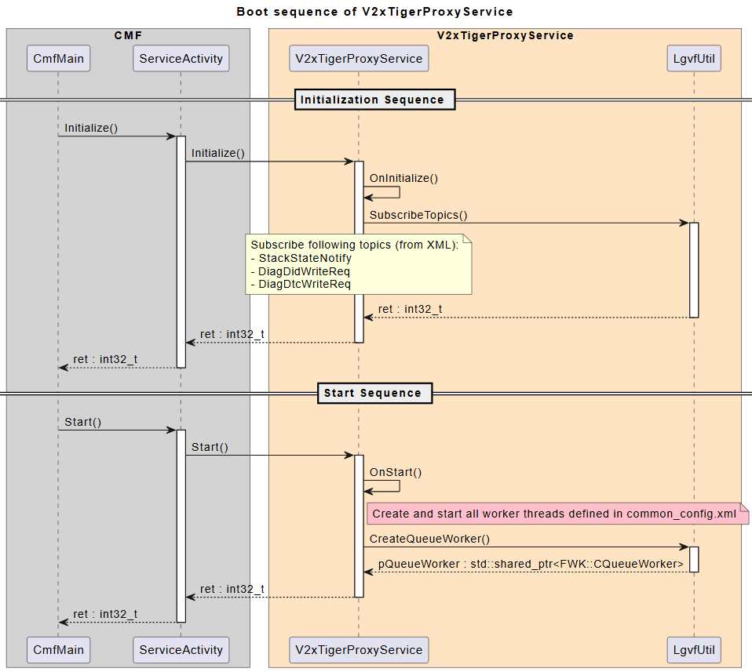
Image reference: doc_image_031.png

Figure 25: Boot sequence of V2xTigerProxyService

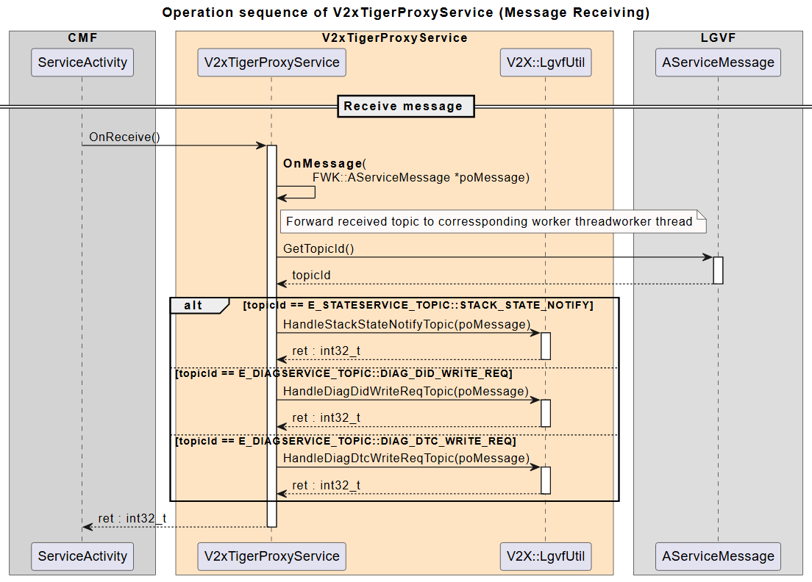
Image reference: doc_image_032.png

Figure 26: Operation sequence of V2xTigerProxyService (Message Receiving)

V2xConfigService

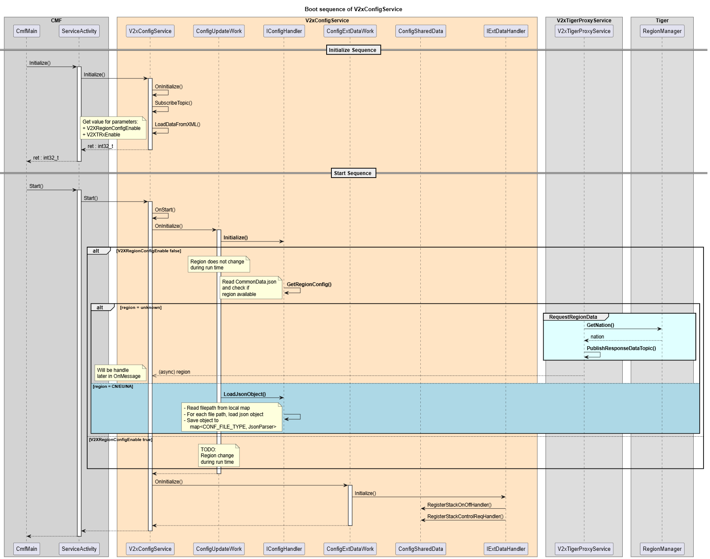
Image reference: doc_image_033.png

Figure 27: Boot sequence of V2xConfigService

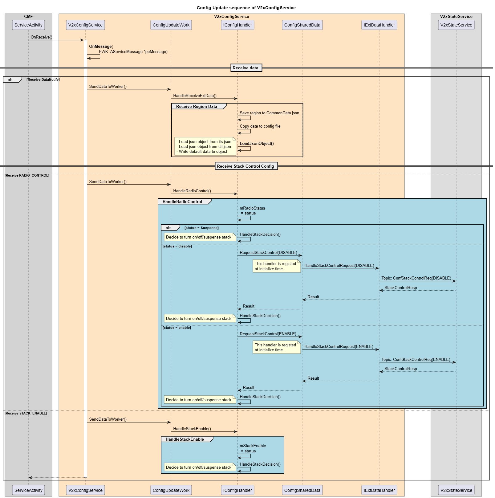
Image reference: doc_image_034.png

Figure 28: Config Update sequence of V2xConfigService

V2xDiagService

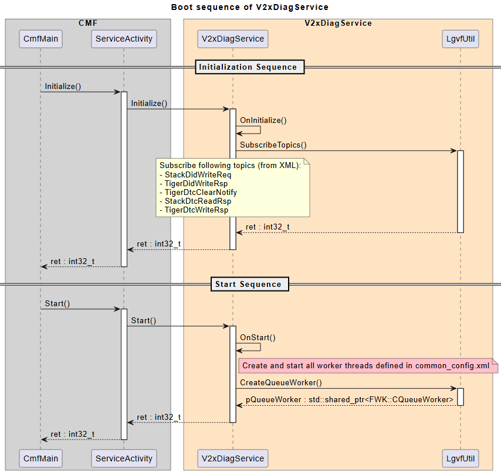
Image reference: doc_image_035.png

Figure 29: Boot sequence of V2xDiagService

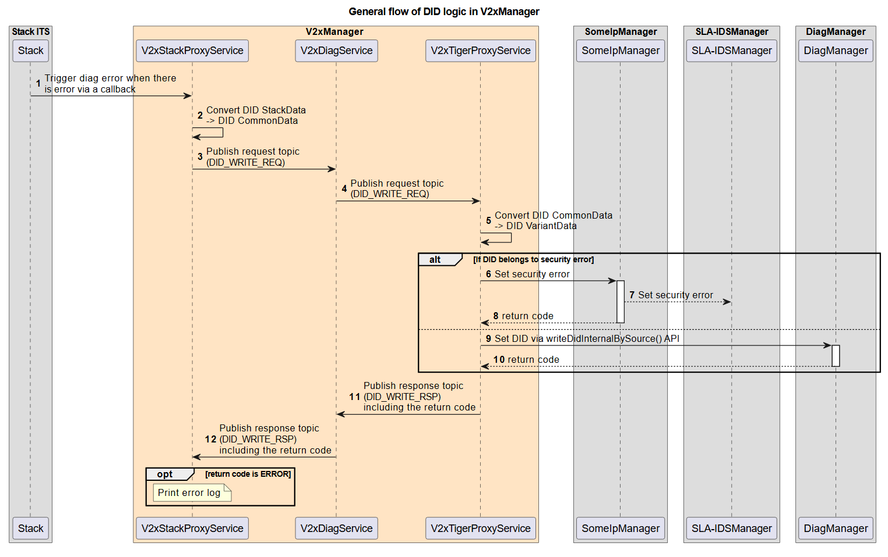
Image reference: doc_image_036.png

Figure 30: Stack triggers diag error sequence in V2xDiagService

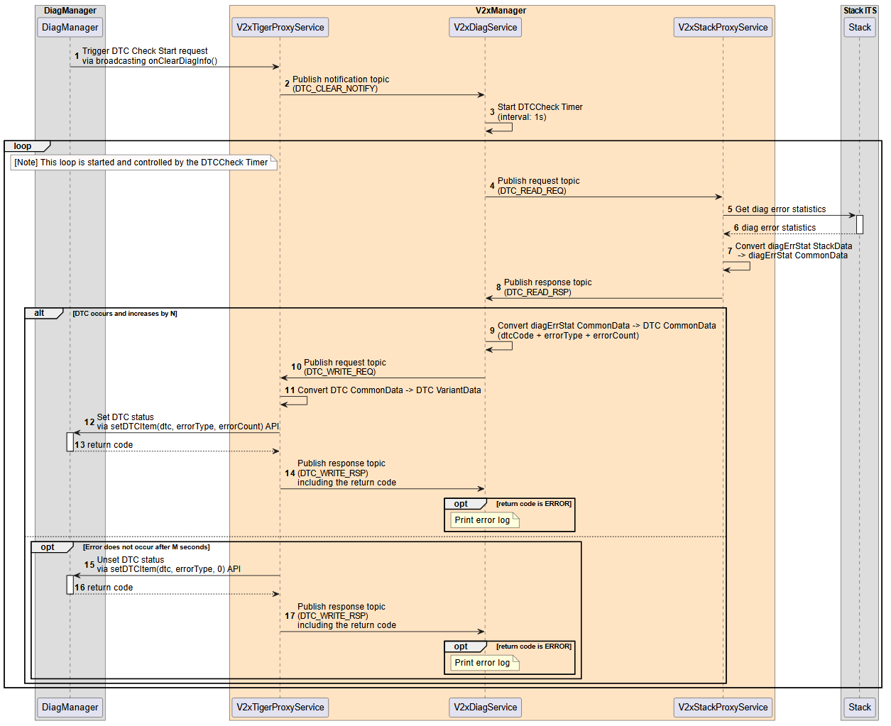
Image reference: doc_image_037.png

Figure 31: DiagManager requests DTC check sequence in V2xDiagService

V2xSecurityService

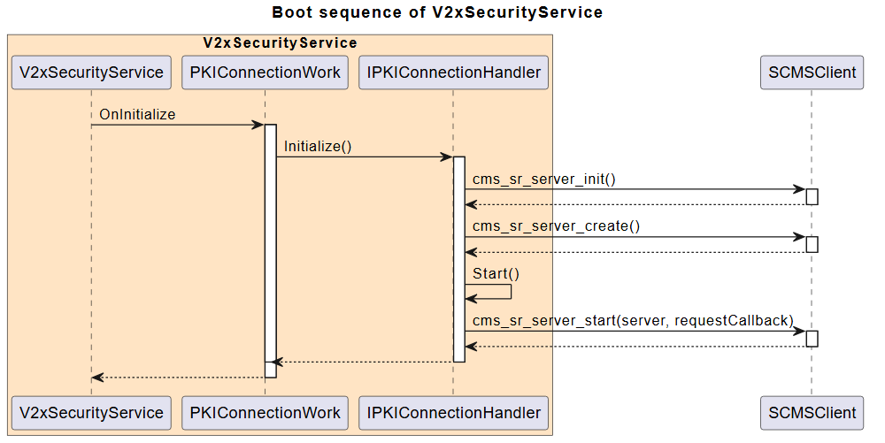
Image reference: doc_image_038.png

Figure 32: Boot sequence of V2xSecurityService

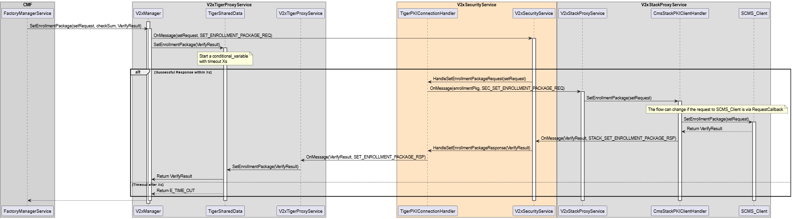
Image reference: doc_image_039.png

Figure 33: Set Enrollment Provisioning Package sequence in V2xSecurityService

V2xStateService

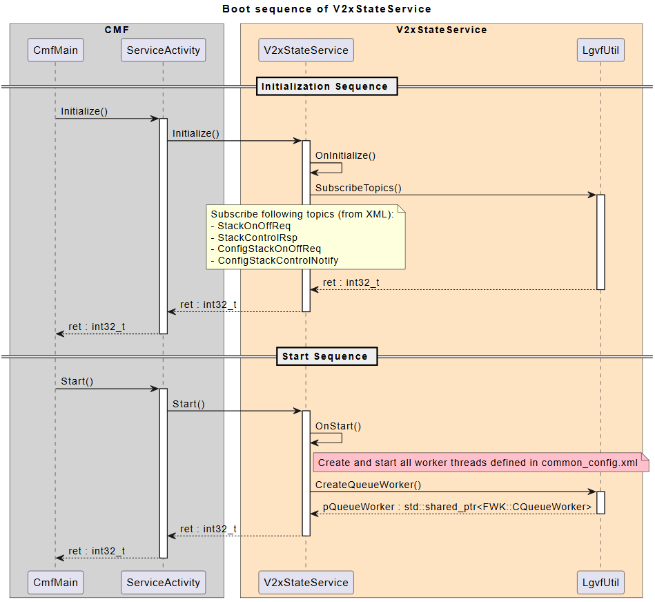
Image reference: doc_image_040.png

Figure 34: Boot Sequence of V2xStateService

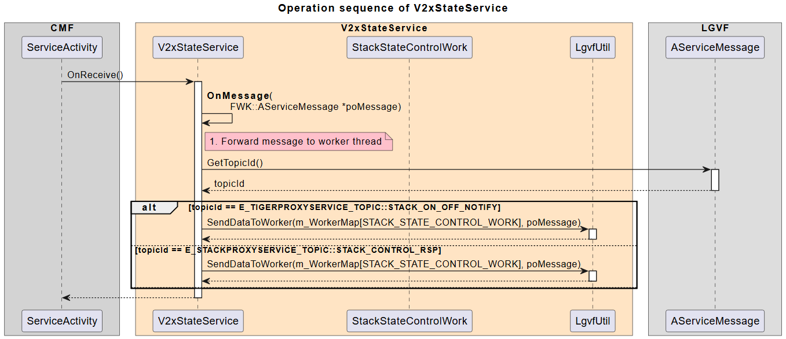
Image reference: doc_image_041.png

Figure 35: Operation sequence of V2xStateService

V2xStackProxyService

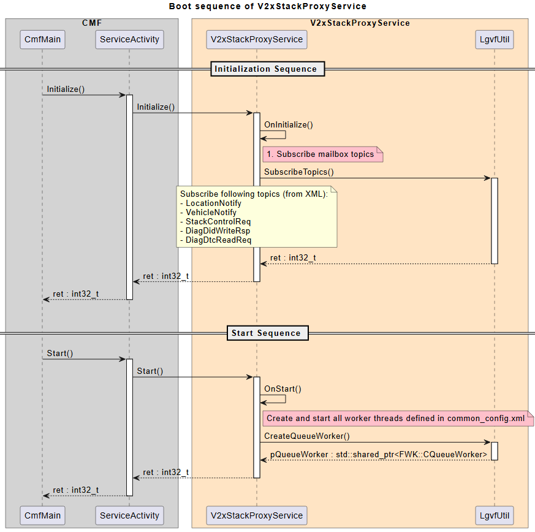
Image reference: doc_image_042.png

Figure 36: Boot sequence of V2xStackProxyService

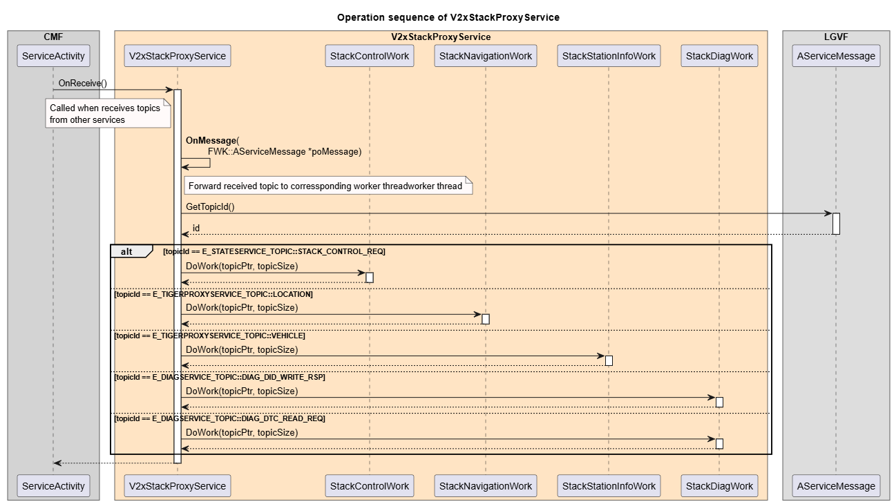
Image reference: doc_image_043.png

Figure 37: Operation sequence of V2xStackProxyService

Interfaces Design

V2xManagerService Interface:

## Table
| GetHsmIdObject | GetHsmIdObject |
| --- | --- |
| Syntax | error_t GetHsmIdObject(std::string& o_sHsmId) |
| Desciption | Retrieves the unique HSM identifier object managed by the V2xManagerService. |
| Parameter | string |
| Return | error_t |

## Table
| GetEnrollmentProvisioningObject | GetEnrollmentProvisioningObject |
| --- | --- |
| Syntax | error_t GetEnrollmentProvisioningObject(std::string& o_sEnrollmentProvisoning) |
| Desciption | Retrieves the enrollment provisioning object managed by the V2xManagerService. |
| Parameter | string |
| Return | error_t |

## Table
| SetEnrollmentPackage | SetEnrollmentPackage |
| --- | --- |
| Syntax | error_t SetEnrollmentPackage(const V2X::SetEnrollmentPackageConfig_t& config) |
| Desciption | Receives and processes an enrollment package, updating the internal data of the V2xManagerService as required. |
| Parameter | V2X::SetEnrollmentPackageConfig_t |
| Return | error_t |

LocationManagerService Interface:

## Table
| registerReceiver | registerReceiver |
| --- | --- |
| Syntax | error_t registerReceiver(android::sp<ILocationReceiver> receiver, int32_t mask) |
| Desciption | Registers a receiver to receive location information from the LocationManagerService. |
| Parameter | android::sp<ILocationReceiver>, int32_t |
| Return | error_t |

## Table
| unregisterReceiver | unregisterReceiver |
| --- | --- |
| Syntax | error_t unregisterReceiver(android::sp<ILocationReceiver> receiver) |
| Desciption | Unregisters the receiver from the LocationManagerService to stop receiving location updates. |
| Parameter | android::sp<ILocationReceiver> |
| Return | error_t |

## Table
| onLocationInfoChanged | onLocationInfoChanged |
| --- | --- |
| Syntax | void onLocationInfoChanged(const android::sp<LocationData> data) |
| Desciption | This function is a callback that is invoked by the LocationManagerService whenever new location information is available. |
| Parameter | android::sp<LocationData> |
| Return | N/A |

ConfigManagerService Interface:

## Table
| registerReceiver | registerReceiver |
| --- | --- |
| Syntax | error_t registerReceiver(const DataFrom sourceType, const std::string& name, android::sp<IConfigurationManagerReceiver>& receiver) |
| Desciption | Registers a receiver with the ConfigurationManagerService to receive notifications when configuration data changes. |
| Parameter | DataFrom , string, android::sp<IConfigurationManagerReceiver> |
| Return | error_t |

## Table
| onConfigDataChanged | onConfigDataChanged |
| --- | --- |
| Syntax | void onConfigDataChanged(std::string& name, std::string& value) |
| Desciption | This callback function is invoked by the ConfigurationManagerService whenever the configuration data is updated, providing the updated name and value. |
| Parameter | string, string |
| Return | N/A |

## Table
| getConfigData | getConfigData |
| --- | --- |
| Syntax | ConfigResult getConfigData(const DataFrom sourceType, const std::string& name, std::string& value) |
| Desciption | Retrieves the current configuration data from the ConfigurationManagerService for the specified configuration item. |
| Parameter | DataFrom, string, string |
| Return | ConfigResult |

DiagManagerService Interface:

## Table
| registerDiagReceiver | registerDiagReceiver |
| --- | --- |
| Syntax | error_t registerDiagReceiver(android::sp<IDiagManagerReceiver>& receiver, uint64_t mask, uint32_t item) |
| Desciption | Registers a receiver with the DiagManagerService to receive diagnostic notifications and updates. |
| Parameter | android::sp<IDiagManagerReceiver>, uint64_t, uint32_t |
| Return | error_t |

## Table
| unregisterDiagReceiver | unregisterDiagReceiver |
| --- | --- |
| Syntax | error_t unregisterDiagReceiver( const android::sp<IDiagManagerReceiver>& receiver) |
| Desciption | Unregisters the receiver from the DiagManagerService to stop receiving diagnostic notifications. |
| Parameter | android::sp<IDiagManagerReceiver> |
| Return | error_t |

## Table
| writeDidInternalBySource | writeDidInternalBySource |
| --- | --- |
| Syntax | uint8_t writeDidInternalBySource(uint8_t source, uint16_t did, uint64_t mask, android::sp<Buffer>& didData) |
| Desciption | Writes a Diagnostic Identifier (DID) value to the DiagManagerService from a specified input source. |
| Parameter | uint8_t, uint16_t , uint64_t , android::sp<Buffer> |
| Return | uint8_t |

## Table
| setDtcItem | setDtcItem |
| --- | --- |
| Syntax | error_t setDtcItem(uint16_t dtcIndex, uint8_t faultType, int8_t faultCount)) |
| Desciption | Sets the DTC item in the DiagManagerService, specifying the DTC index, fault type, fault count, and mask. |
| Parameter | uint16_t , uint8_t , int8_t |
| Return | uint8_t |

## Table
| onClearDiagInfo | onClearDiagInfo |
| --- | --- |
| Syntax | void onClearDiagInfo(const uint8_t order) |
| Desciption | This callback function is invoked by the DiagManagerService when a request to clear diagnostic information is received. |
| Parameter | uint8_t |
| Return | N/A |

RegionManagerService Interface:

## Table
| getNation | getNation |
| --- | --- |
| Syntax | error_t getNation(uint8_t& nation) |
| Desciption | Retrieves the current nation/region information from the RegionManagerService. |
| Parameter | uint8_t |
| Return | error_t |

SomeipManagerService Interface:

## Table
| registerReceiverWithAppId | registerReceiverWithAppId |
| --- | --- |
| Syntax | error_t registerReceiverWithAppId(android::sp<ISOMEIPReceiver>& _receiver, lge::someipmgr::ESomeipService& _serviceToRegister, lge::someipmgr::EApplicationID& _applicationId) |
| Desciption | Registers a receiver with the SomeipManagerService to receive SOMEIP messages for the specified service and application ID. |
| Parameter | android::sp<ISOMEIPReceiver>, lge::someipmgr::ESomeipService, lge::someipmgr::EApplicationID |
| Return | error_t |

## Table
| onReceive | onReceive |
| --- | --- |
| Syntax | android::status_t onReceive(lge::someipmgr::SOMEIPInternalData* const i_pData) |
| Desciption | This callback function is invoked by the SomeipManagerService whenever a new SOMEIP message is received, passing the message data to the handler for processing. |
| Parameter | lge::someipmgr::SOMEIPInternalData |
| Return | android::status_t |

## Table
| sendToSomeipMgr | sendToSomeipMgr |
| --- | --- |
| Syntax | error_t sendToSomeipMgr(lge::someipmgr::SOMEIPInternalData* data) |
| Desciption | Sends a SOMEIP message or request to the SomeipManagerService. |
| Parameter | lge::someipmgr::SOMEIPInternalData |
| Return | error_t |

Split V2X Manager service into multiple Tiger services

Static view

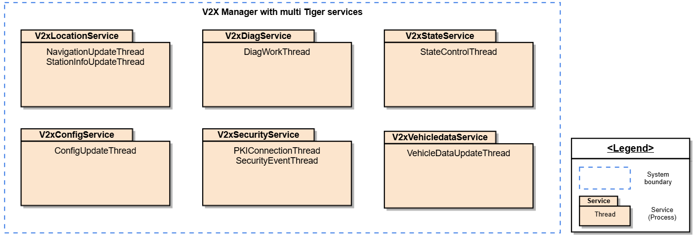
Image reference: doc_image_044.png

Figure 38: V2X Manager service with Multi Tiger services module view

## Table
| Module | Role |
| --- | --- |
| V2xLocationService | V2xLocationService is responsible for receive location data and update to Stack |
| V2xConfigService | V2xConfigService is responsible for the provisioning/configuration for V2XManager and external modules |
| V2xStateService | V2xStateService is responsible for managing V2X Manager service and CMS Stack. |
| V2xDiagService | V2xDiagService is responsible for the function of processing the diagnostic data and forward to CMS Stack and V2xStateService |
| V2xSecurityService | V2xSecurityService is responsible for providing certificate-related functions, such as v2x certificate download and status check. |
| V2xVehicleDataService | V2xVehicleDataService is responsible for receive vehicle data from CCCM via SomeIP service and update to CMS Stack |

V2xLocationService

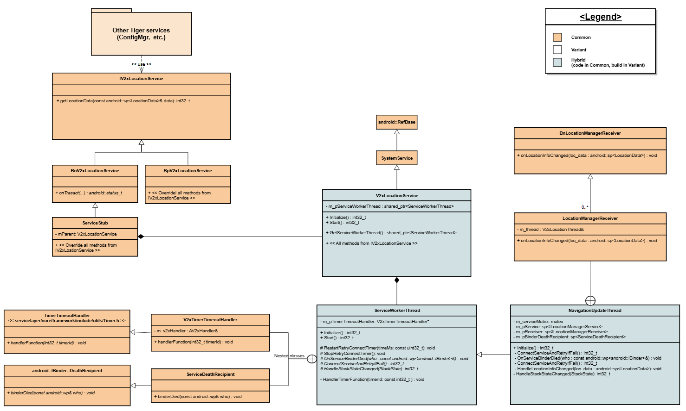
Image reference: doc_image_045.png

Figure 39: V2xLocationService class diagram

## Table
| Class | Description |
| --- | --- |
| IV2xLocationService | Interface base service class for V2X location services, provides method to get location data |
| BnV2xLocationService | Binder native implementation of IV2xLocationService, overrides all interface methods, handles onTransact for IPC. |
| BpV2xLocationService | Binder proxy implementation of IV2xLocationService, overrides all interface methods for client-side IPC. |
| ServiceStub | Stub class holding a reference to the parent V2xLocationService, overrides all interface methods for service-side IPC. |
| V2xLocationService | Main V2X location service implementation, inherits from android::RefBase and system service, manages worker thread and exposes service methods. |
| ServiceWorkerThread | Worker thread class for V2xLocationService, handles timer events, retry logic, and service connection management. |
| BnLocationManagerReceiver | Binder native implementation for location manager receiver, handles onLocationInfoChanged for IPC. |
| LocationManagerReceiver | Implements location manager receiver logic, holds reference to worker thread, handles location info changes. |
| NavigationUpdateThread | Worker thread for navigation updates, manages service and receiver references, handles location and stack change events. |
| TimerTimeoutHandler | Base handler class for timer timeouts, provides handleFunction for timer events. |
| V2xTimerTimeoutHandler | Specialized timer timeout handler for V2X, holds reference to V2xHandler, overrides handleFunction. |
| android::IBinder::DeathRecipient | Android base class for binder death notifications. |
| ServiceDeathRecipient | Handles binder death events for the service, inherits from android::IBinder::DeathRecipient. |

V2xConfigService

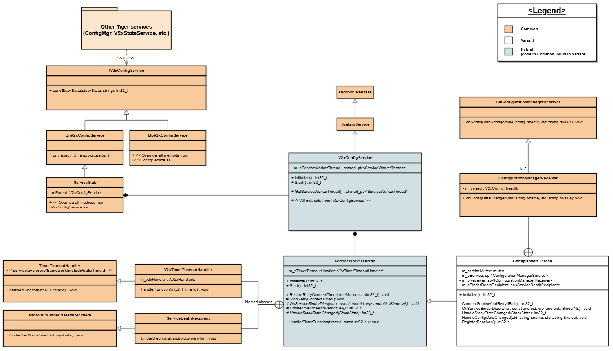
Image reference: doc_image_046.png

Figure 40: V2xConfigService class diagram

## Table
| Class | Description |
| --- | --- |
| IV2xConfigService | Interface base service class for V2X configuration services, provides method to send stack state. |
| BnV2xConfigService | Binder native implementation of IV2xConfigService, overrides all interface methods, handles onTransact for IPC. |
| BpV2xConfigService | Binder proxy implementation of IV2xConfigService, overrides all interface methods for client-side IPC. |
| ServiceStub | Stub class holding a reference to the parent V2xConfigService, overrides all interface methods for service-side IPC. |
| V2xConfigService | Main V2X configuration service implementation, inherits from android::RefBase and system service, manages worker thread and exposes service methods. |
| ServiceWorkerThread | Worker thread class for V2xConfigService, handles timer events, retry logic, and service connection management. |
| BnConfigurationManagerReceiver | Binder native implementation for configuration manager receiver, handles onConfigDataChanged for IPC. |
| ConfigurationManagerReceiver | Implements configuration manager receiver logic, holds reference to worker thread, handles configuration data changes. |
| ConfigUpdateThread | Worker thread for configuration updates, manages service and receiver references, handles stack state and configuration data change events, and receiver registration. |
| TimerTimeoutHandler | Base handler class for timer timeouts, provides handleFunction for timer events. |
| V2xTimerTimeoutHandler | Specialized timer timeout handler for V2X, holds reference to V2xHandler, overrides handleFunction. |
| android::IBinder::DeathRecipient | Android base class for binder death notifications. |
| ServiceDeathRecipient | Handles binder death events for the service, inherits from android::IBinder::DeathRecipient. |

V2xDiagService

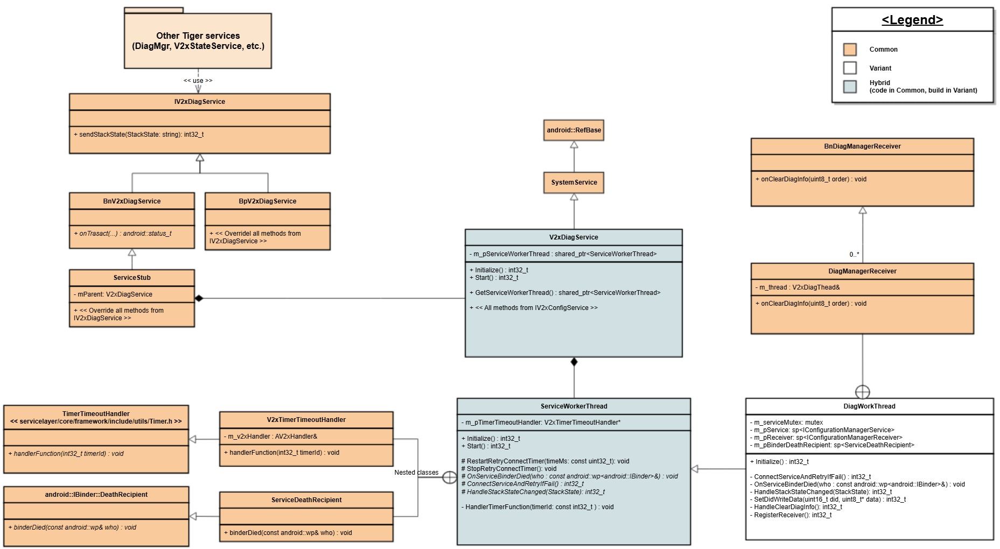
Image reference: doc_image_047.png

Figure 41: V2xDiagService class diagram

## Table
| Class | Description |
| --- | --- |
| IV2xDiagService | Interface base service class for V2X diagnostic services, provides method to send stack state. |
| BnV2xDiagService | Binder native implementation of IV2xDiagService, overrides all interface methods, handles onTransact for IPC.. |
| BpV2xDiagService | Binder proxy implementation of IV2xDiagService, overrides all interface methods for client-side IPC. |
| ServiceStub | Stub class holding a reference to the parent V2xDiagService, overrides all interface methods for service-side IPC. |
| V2xDiagService | Main V2X diagnostic service implementation, inherits from android::RefBase and system service, manages worker thread and exposes service methods. |
| ServiceWorkerThread | Worker thread class for V2xDiagService, handles timer events, retry logic, and service connection management. |
| BnDiagManagerReceiver | Binder native implementation for diagnostic manager receiver, handles onClearDiagInfo for IPC. |
| DiagManagerReceiver | Implements diagnostic manager receiver logic, holds reference to worker thread, handles clear diagnostic info events. |
| DiagWorkThread | Worker thread for diagnostic processing, manages receiver references, handles stack state changes, diagnostic info, and receiver registration. |
| TimerTimeoutHandler | Base handler class for timer timeouts, provides handleFunction for timer events. |
| V2xTimerTimeoutHandler | Specialized timer timeout handler for V2X, holds reference to V2xHandler, overrides handleFunction. |
| android::IBinder::DeathRecipient | Android base class for binder death notifications. |
| ServiceDeathRecipient | Handles binder death events for the service, inherits from android::IBinder::DeathRecipient. |

V2xSecurityService

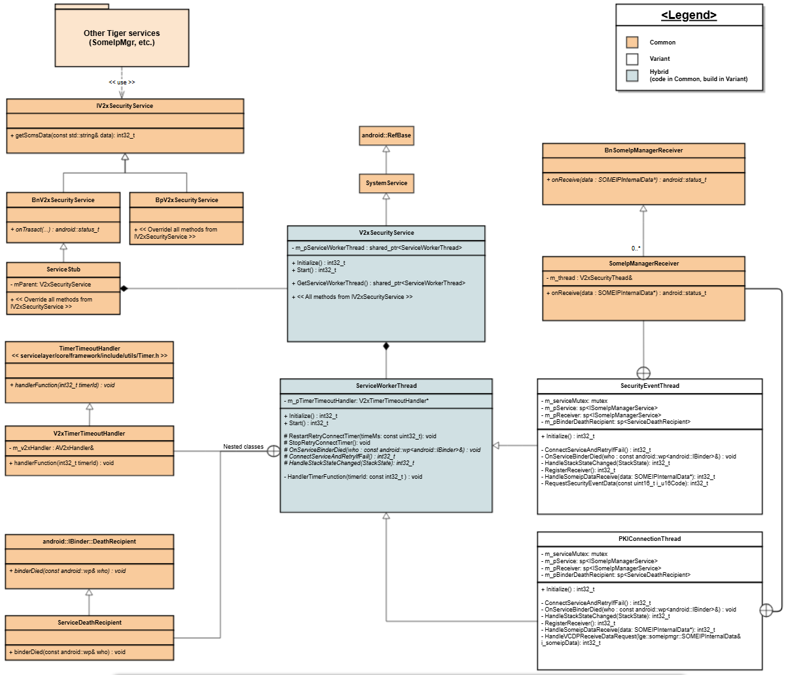
Image reference: doc_image_048.png

Figure 42: V2xSecurityService class diagram

## Table
| Class | Description |
| --- | --- |
| IV2xSecurityService | Interface base service class for V2X security services, provides method to get CMS data. |
| BnV2xSecurityService | Binder native implementation of IV2xSecurityService, overrides all interface methods, handles onTransact for IPC. |
| BpV2xSecurityService | Binder proxy implementation of IV2xSecurityService, overrides all interface methods for client-side IPC. |
| ServiceStub | Stub class holding a reference to the parent V2xSecurityService, overrides all interface methods for service-side IPC. |
| V2xSecurityService | Main V2X security service implementation, inherits from android::RefBase and system service, manages worker thread and exposes service methods. |
| ServiceWorkerThread | Worker thread class for V2xSecurityService, handles timer events, retry logic, and service connection management. |
| BnSomeipManagerReceiver | Binder native implementation for SOMEIP manager receiver, handles onReceive for IPC. |
| SomeipManagerReceiver | Implements SOMEIP manager receiver logic, holds reference to worker thread, handles received SOMEIP data. |
| SecurityEventThread | Worker thread for security events, manages service and receiver references, handles stack state changes, SOMEIP data reception, and event requests. |
| PKIConnectionThread | Worker thread for PKI connection, manages service and receiver references, handles SOMEIP data, stack state changes, and PKI event requests. |
| TimerTimeoutHandler | Base handler class for timer timeouts, provides handleFunction for timer events. |
| V2xTimerTimeoutHandler | Specialized timer timeout handler for V2X, holds reference to V2xHandler, overrides handleFunction. |
| android::IBinder::DeathRecipient | Android base class for binder death notifications. |

V2xStateService

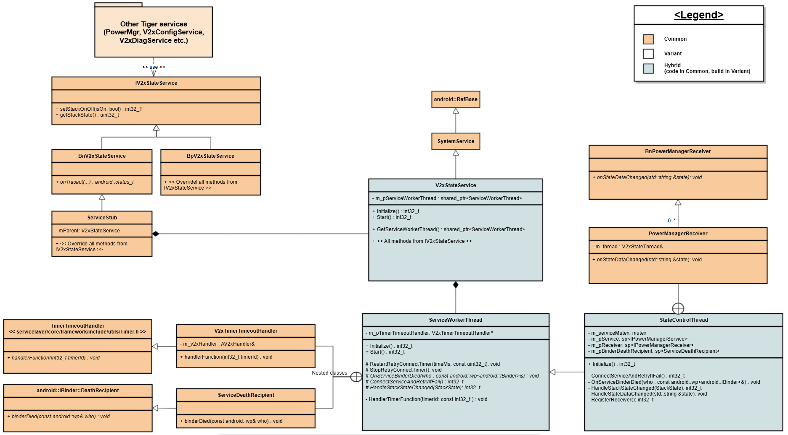
Image reference: doc_image_049.png

Figure 43: V2xStateService class diagram

## Table
| Class | Description |
| --- | --- |
| IV2xStateService | IInterface base service class for V2X state services, provides methods to set and get stack state. |
| BnV2xStateService | Binder native implementation of IV2xStateService, overrides all interface methods, handles onTransact for IPC. |
| BpV2xStateService | Binder proxy implementation of IV2xStateService, overrides all interface methods for client-side IPC. |
| ServiceStub | Stub class holding a reference to the parent V2xStateService, overrides all interface methods for service-side IPC. |
| V2xStateService | Main V2X state service implementation, inherits from android::RefBase and system service, manages worker thread and exposes service methods.. |
| ServiceWorkerThread | Worker thread class for V2xStateService, handles timer events, retry logic, and service connection management. |
| BnPowerManagerReceiver | Binder native implementation for power manager receiver, handles onStateDataChanged for IPC. |
| PowerManagerReceiver | Implements power manager receiver logic, holds reference to worker thread, handles state data changes. |
| StateControlThread | Worker thread for state control, manages service and receiver references, handles stack state and state data change events, and receiver registration. |
| TimerTimeoutHandler | Base handler class for timer timeouts, provides handleFunction for timer events. |
| V2xTimerTimeoutHandler | Specialized timer timeout handler for V2X, holds reference to V2xHandler, overrides handleFunction. |
| android::IBinder::DeathRecipient | Android base class for binder death notifications. |
| ServiceDeathRecipient | Handles binder death events for the service, inherits from android::IBinder::DeathRecipient. |

V2xVehicleDataService

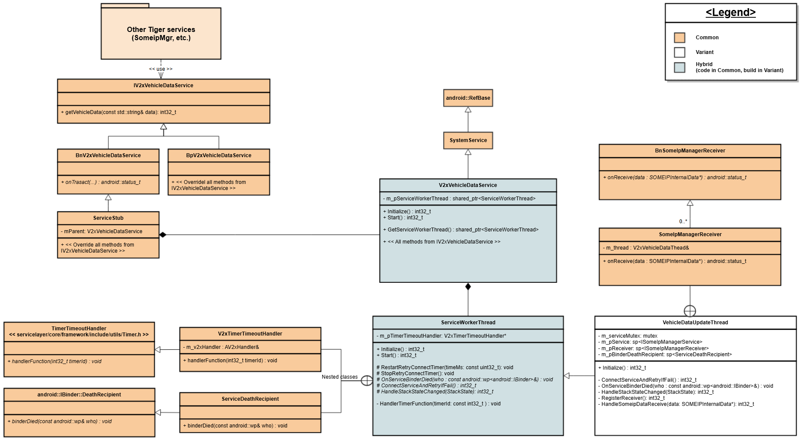
Image reference: doc_image_050.png

Figure 44: V2xVehicleDataService class diagram

## Table
| Class | Description |
| --- | --- |
| IV2xVehicleDataService | Interface base service class for V2X vehicle data services, provides method to get vehicle data. |
| BnV2xVehicleDataService | Binder native implementation of IV2xVehicleDataService, overrides all interface methods, handles onTransact for IPC. |
| BpV2xVehicleDataService | Binder proxy implementation of IV2xVehicleDataService, overrides all interface methods for client-side IPC. |
| ServiceStub | Stub class holding a reference to the parent V2xVehicleDataService, overrides all interface methods for service-side IPC. |
| V2xVehicleDataService | Main V2X vehicle data service implementation, inherits from android::RefBase and system service, manages worker thread and exposes service methods. |
| ServiceWorkerThread | Worker thread class for V2xVehicleDataService, handles timer events, retry logic, and service connection management. |
| BnSomeipManagerReceiver | Binder native implementation for SOMEIP manager receiver, handles onReceive for IPC. |
| SomeipManagerReceiver | Implements SOMEIP manager receiver logic, holds reference to worker thread, handles received SOMEIP data. |
| VehicleDataUpdateThread | Worker thread for vehicle data updates, manages service and receiver references, handles stack state changes, SOMEIP data reception, and receiver registration. |
| TimerTimeoutHandler | Base handler class for timer timeouts, provides handleFunction for timer events. |
| V2xTimerTimeoutHandler | Specialized timer timeout handler for V2X, holds reference to V2xHandler, overrides handleFunction. |
| android::IBinder::DeathRecipient | Android base class for binder death notifications. |
| ServiceDeathRecipient | Handles binder death events for the service, inherits from android::IBinder::DeathRecipient. |

Dynamic view

V2xLocationService

Image reference: doc_image_051.png

Figure 45: Boot sequence of V2xLocationService

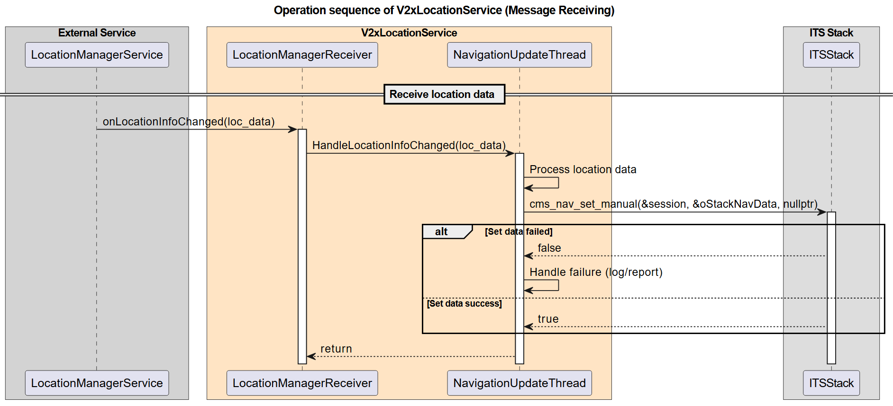
Image reference: doc_image_052.png

Figure 46: Operation sequence of V2xLocationService (Message Receiving)

V2xConfigService

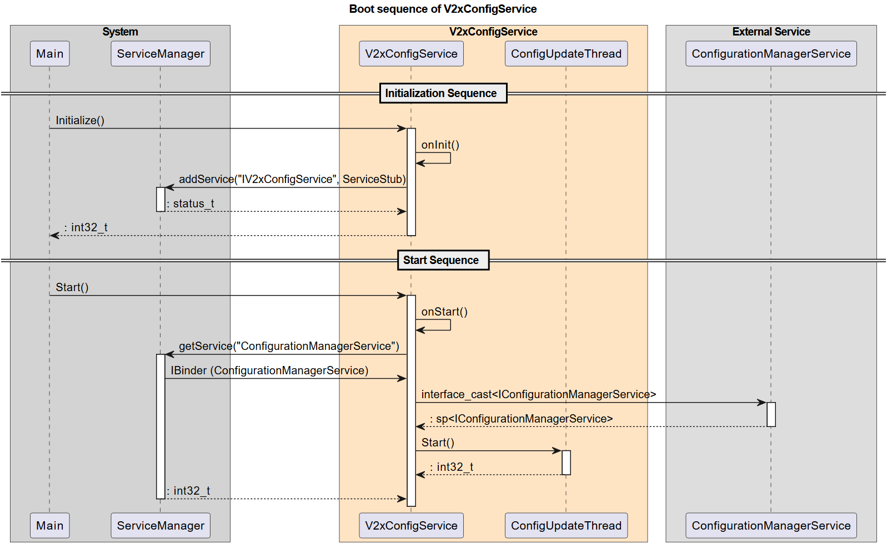
Image reference: doc_image_053.png

Figure 47: Boot sequence of V2xConfigService

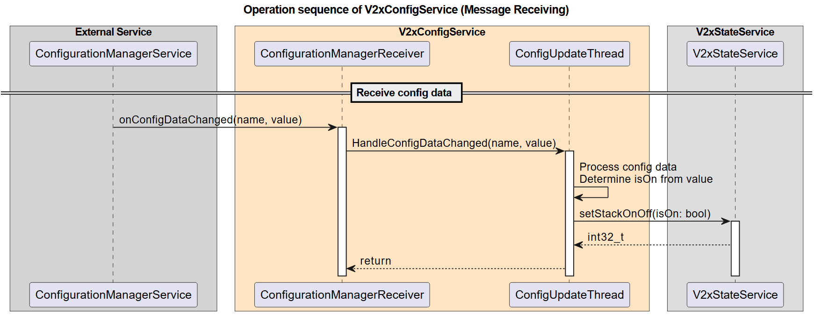
Image reference: doc_image_054.png

Figure 48: Operation sequence of V2xConfigService (Message Receiving)

V2xDiagService

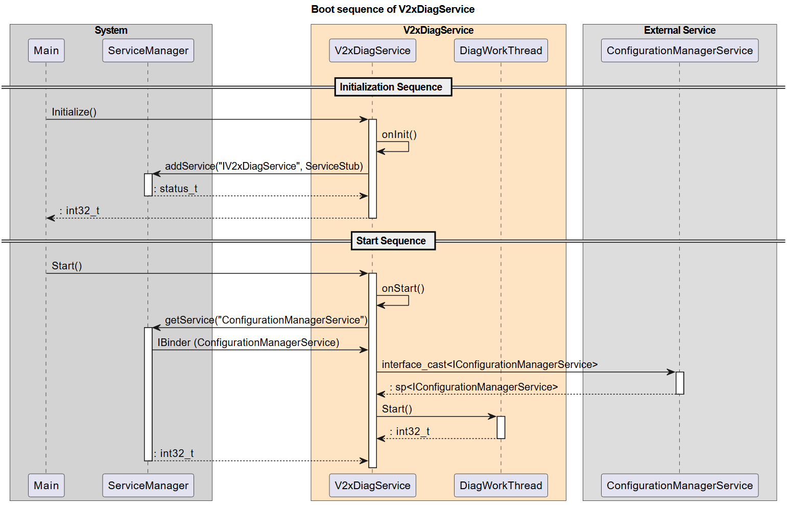
Image reference: doc_image_055.png

Figure 49: Boot sequence of V2xDiagService

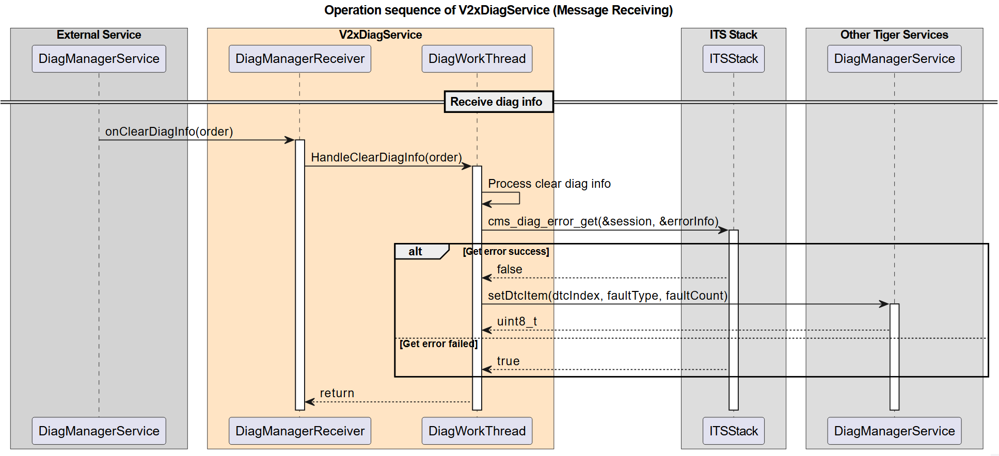
Image reference: doc_image_056.png

Figure 50: Operation sequence of V2xDiagService (Message Receiving)

V2xSecurityService

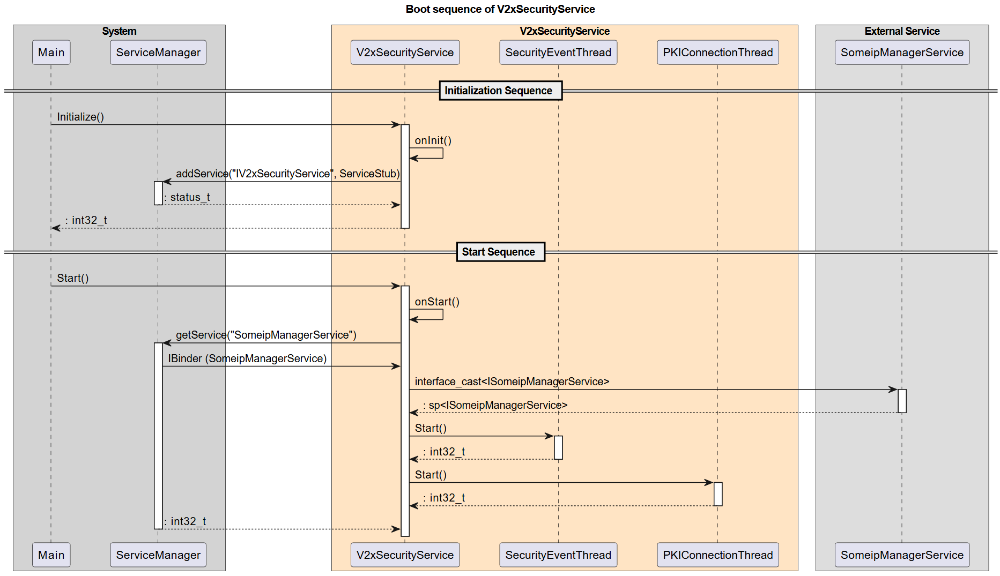
Image reference: doc_image_057.png

Figure 51: Boot sequence of V2xSecurityService

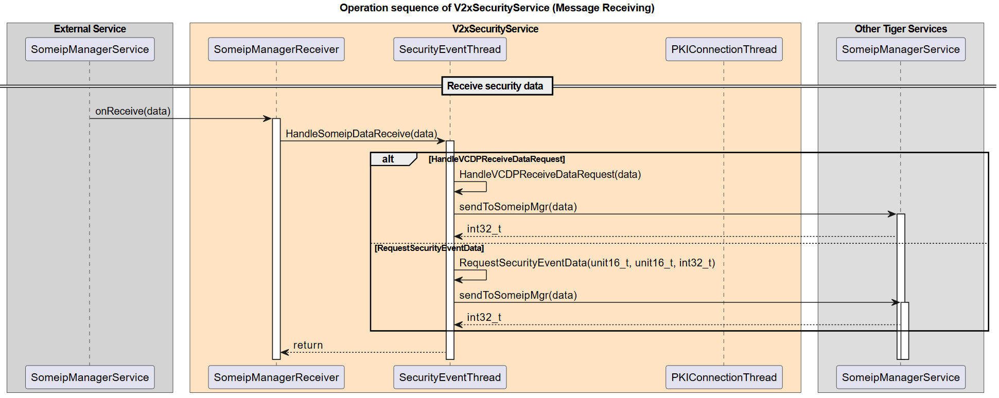
Image reference: doc_image_058.png

Figure 52: Operation sequence of V2xSecurityService (Message Receiving)

V2xStateService

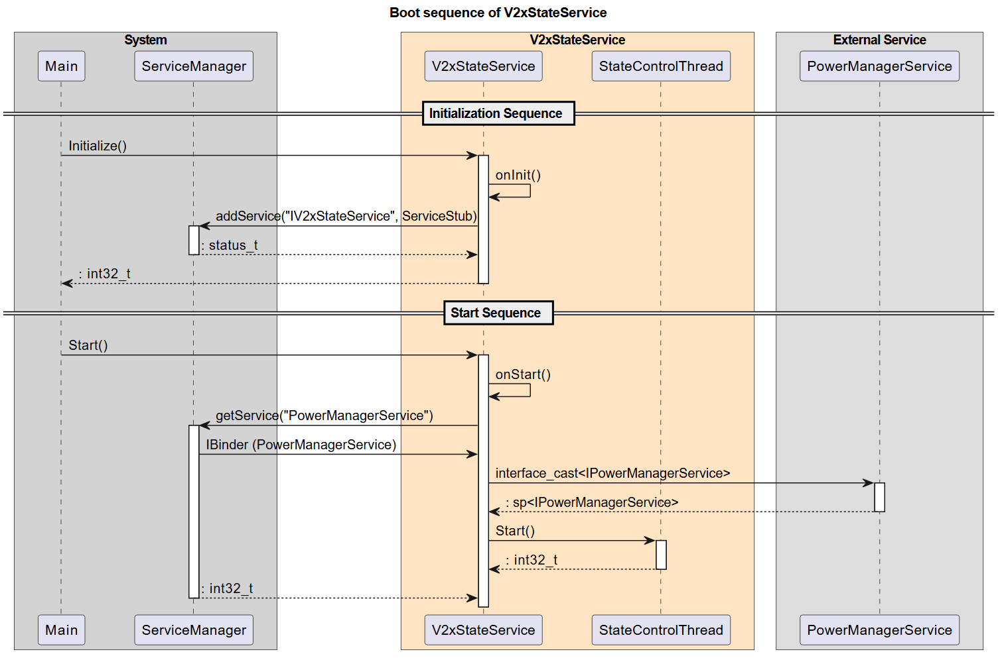
Image reference: doc_image_059.png

Figure 53: Boot sequence of V2xStateService

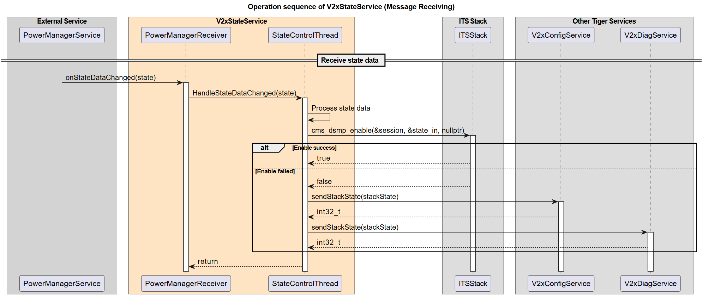
Image reference: doc_image_060.png

Figure 54: Operation sequence of V2xStateService (Message Receiving)

V2xVehicleDataService

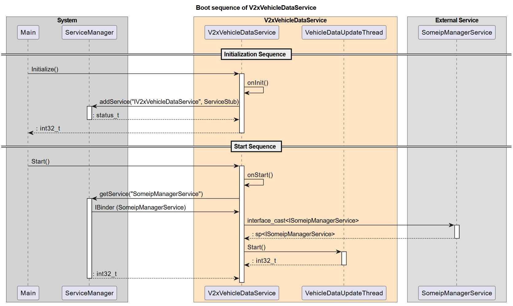
Image reference: doc_image_061.png

Figure 55: Boot sequence of V2xVehicleDataService

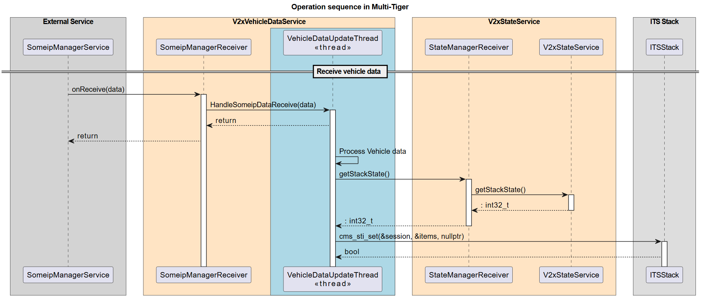
Image reference: doc_image_062.png

Figure 56: Operation sequence of V2xVehicleDataService (Message Receiving)

Interfaces Design

V2xLocationService Interface:

## Table
| getLocationData | getLocationData |
| --- | --- |
| Syntax | int32_t getLocationData(const android::sp<LocationData>& data) |
| Description | Retrieves the current location data from the V2xLocationService. |
| Parameter | N/A |
| Return | int32_t |

V2xConfigService Interface:

## Table
| sendStackState | sendStackState |
| --- | --- |
| Syntax | int32_t sendStackState(const std::string& stackState) |
| Description | Sends the current stack state to the V2xConfigService. |
| Parameter | string |
| Return | int32_t |

V2xStateService Interface:

## Table
| sendStackState | sendStackState |
| --- | --- |
| Syntax | int32_t setStackOnOff(bool isOn) |
| Description | Sets stack state (on or off) in the V2xStateService |
| Parameter | bool |
| Return | int32_t |

## Table
| getStackState | getStackState |
| --- | --- |
| Syntax | uint32_t getStackState |
| Description | Retrieves the current stack state from the V2xStateService |
| Parameter | N/A |
| Return | uint32_t |

V2xDiagService Interface:

## Table
| sendStackState | sendStackState |
| --- | --- |
| Syntax | int32_t sendStackState(const std::string& stackState) |
| Description | Sends the current stack state to the V2xDiagService. |
| Parameter | string |
| Return | int32_t |

V2xVehicleDataService Interface:

## Table
| getVehicleData | getVehicleData |
| --- | --- |
| Syntax | int32_t getVehicleData(const std::string& data) |
| Description | Retrieves the current vehicle data from V2xVehicleDataService |
| Parameter | N/A |
| Return | int32_t |

V2xSecurity Interface:

## Table
| getScmsData | getScmsData |
| --- | --- |
| Syntax | int32_t getScmsData(const std::string& data) |
| Description | Retrieves the current SCMS data from V2xSecurityService |
| Parameter | string |
| Return | int32_t |

Common Callback/Recevier Interface:

## Table
| onLocationInfoChanged | onLocationInfoChanged |
| --- | --- |
| Syntax | void onLocationInfoChanged(const android::sp<LocationData> data) |
| Desciption | This function is a callback that is invoked by the LocationManagerService whenever new location information is available. |
| Parameter | android::sp<LocationData> |
| Return | N/A |

## Table
| onConfigDataChanged | onConfigDataChanged |
| --- | --- |
| Syntax | void onConfigDataChanged(std::string& name, std::string& value) |
| Desciption | This callback function is invoked by the ConfigurationManagerService whenever the configuration data is updated, providing the updated name and value. |
| Parameter | string, string |
| Return | N/A |

## Table
| onClearDiagInfo | onClearDiagInfo |
| --- | --- |
| Syntax | void onClearDiagInfo(const uint8_t order) |
| Desciption | This callback function is invoked by the DiagManagerService when a request to clear diagnostic information is received. |
| Parameter | uint8_t |
| Return | N/A |

## Table
| onReceive | onReceive |
| --- | --- |
| Syntax | android::status_t onReceive(lge::someipmgr::SOMEIPInternalData* const i_pData) |
| Desciption | This callback function is invoked by the SomeipManagerService whenever a new SOMEIP message is received, passing the message data to the handler for processing. |
| Parameter | lge::someipmgr::SOMEIPInternalData |
| Return | android::status_t |

Comparison between the alternatives

The cells highlighted in green are the alternatives that are met the Quality Attributes.

## Table
| Quality Attributes | Comparison item | Tiger service with multi-threading | V2XMgr services with LGVF | Split V2X Manager service into multiple Tiger services |
| --- | --- | --- | --- | --- |
| Performance | Increase throughput | Yes Using more threads to process data helps reduce bottlenecks in the main thread and increase performance, but when adding too many threads, it will be difficult to control and process synchronously. | Yes Using LGVF to create new processes makes processing incoming messages from external Manager services faster, resulting in improved performance. Separating sub-services for V2Xmgr also makes synchronization management easier by V2xStateService. | Yes Create the new tiger services to process for 1 or two incoming data sources will resolve the bottleneck. However, in case process power, diag and config request will have some delay because of the need for synchronization |
| Performance | RAM consumption | Low Don't require more RAM for the new service. | Medium RAM consumption will increase for the new process. | Medium RAM consumption will increase for the new process. |
| Performance | CPU consumption | Low Don't require more CPU for the new service. | Low Don't require more CPU for the new service while the logic that needs process data does not increase | Low Don't require more CPU for the new service while the logic that needs process data does not increase |
| Reusability | Easy to reuse | Yes Build on tiger service core-variant format. | Yes Build on core-variant folder format. Additional, LGVF can deploy on Linux, Windows and the target device so this design can apply for Tiger or non-Tiger platform. | No The services are divided so small. All off the services need to connect direct to V2X Stack |
| Maintainability | Easy to maintain | No The code might become harder to read and understand, especially for new developers, as more threads may have to be added during development to execute new functions. | Yes The process of reading, understanding and editing code will be easier because the source has been divided into corresponding modules in the service folder. Editing the logic of a service will only need to focus on a single folder in it. | Yes The process of reading, understanding and editing code will be easier because the source has been divided into corresponding modules in the service with the design and requirement for each service. |

Architectural decision and rationale

Tiger service with multi-threading architecture can resolve the bottleneck issue, this alternative don't require more RAM and CPU, and adapt the reusability QA, but this alternative is too hard for the new member to maintain.

The service separation architecture by using V2XMgr services with LGVF approach enhances performance by ensuring the data should be processed outside looper thread. It also improves reusability and scalability by using LGVF that built into core-variant part and easy to configure with XML file. This alternative increases maintainability by creating a more modular codebase and clear for developers. However, this alternative will require more RAM for the new services.

Splitting the V2X Manager service into multiple Tiger architecture services can resolve the performance issue and reduce maintenance time. However, this alternative splits V2Xmgr into small Tiger service. So, it will require more RAM and CPU for the new services and clear requirements for each service. Then it is also not suitable for reuse for future projects.

From the comparison table and the priority for each QA (Performance > Reusability > Maintainability). We can focus to resolve the bottleneck issue and the communization for V2Xmgr to select the alternative.

Although V2Xmgr with LGVF alternative requires more RAM, this alternative meets 3 main QAs. Then V2Xmgr with LGVF is the more advantageous alternative for this situation.

For the above reasons, we will choose the V2Xmgr with LGVF alternative to improve the V2Xmgr design.

How to verify Final architecture design

Verify throughput of the design

The testing concept is reproducing the issue that need to be resolved. SenderService will send 1000 messages, each message has 100kb of data. ReceiverService will receive that message from Binder and process that data in 2 cases:

- Original design: handle message as "print the first 10kb"

- New design with LGVF: publish message to other LGVF service to handle print task.

The test result:

- Original design: average throughput is 15.93 (MB/s)

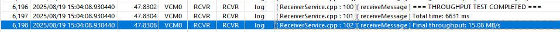
Image reference: doc_image_063.png

Figure 57: Log of the Test 10 for Original design

- New design with LGVF: average throughput is 92.00 (MB/s)

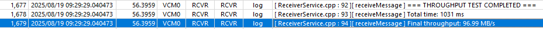
Image reference: doc_image_064.png

Figure 58: Log of the Test 10 for New design with LGVF

## Table
|  | Original design | New design with LGVF |
| --- | --- | --- |
| Sequence diagram of the test | Figure 59: Sequence diagram of the test in Original design | Figure 60: Sequence diagram of the test in new design with LGVF |
| Test results |  |  |

With the above test result, New design with LGVF can process 6 times faster than original design and can meet the throughput requirement needed for V2Xmgr.

Implementation of design in VCM project

Folder structure

The core folder included all of the common source (the file is store and build in core folder) and the hybrid source (the file is store in core folder and build in variant)

## Table
| Core | variant |
| --- | --- |
| ├── core │ ├── src │ │ ├── oem │ │ │ └── IOEMConverter.h │ │ ├── service │ │ │ ├── ConfigService │ │ │ │ ├── AConfigFileHandler.cpp │ │ │ │ ├── AConfigFileHandler.h │ │ │ │ ├── ConfigUpdateWork.cpp │ │ │ │ ├── ConfigUpdateWork.h │ │ │ │ ├── IConfigControlHandler.h │ │ │ │ ├── V2xConfigService.cpp │ │ │ │ └── V2xConfigService.h │ │ │ ├── DiagService │ │ │ │ ├── DiagControlHandler.cpp │ │ │ │ ├── DiagControlHandler.h │ │ │ │ ├── DiagControlWork.cpp │ │ │ │ ├── DiagControlWork.h │ │ │ │ ├── IDiagControlHandler.h │ │ │ │ ├── V2xDiagService.cpp │ │ │ │ └── V2xDiagService.h │ │ │ ├── SecurityService │ │ │ │ ├── IPKIConnectionHandler.h │ │ │ │ ├── PKIConnectionWork.cpp │ │ │ │ ├── PKIConnectionWork.h │ │ │ │ ├── … │ │ │ │ ├── V2xSecurityService.cpp │ │ │ │ └── V2xSecurityService.h │ │ │ ├── StackProxyService │ │ │ │ ├── StackControlWork.cpp │ │ │ │ ├── StackControlWork.h │ │ │ │ ├── … │ │ │ │ ├── V2xStackProxyService.cpp │ │ │ │ └── V2xStackProxyService.h │ │ │ ├── StateService │ │ │ │ ├── StackStateControlWork.cpp │ │ │ │ ├── StackStateControlWork.h │ │ │ │ ├── V2xStateService.cpp │ │ │ │ └── V2xStateService.h │ │ │ └── TigerProxyService │ │ │ ├── V2xTigerProxyService.cpp │ │ │ └── V2xTigerProxyService.h │ │ ├── stack │ │ │ ├── AStackState.cpp │ │ │ ├── AStackState.h │ │ │ ├── cms │ │ │ │ ├── CmsAdapterDef.h │ │ │ │ ├── CmsControlHandler.cpp │ │ │ │ ├── CmsControlHandler.h │ │ │ │ ├── … │ │ │ ├── IStackDiagHandler.h │ │ │ ├── IStackNavigationHandler.h │ │ │ ├── IStackPKIClientHandler.h │ │ │ ├── IStackStationInfoHandler.h │ │ │ ├── StackDef.h │ │ │ ├── StackStateBlock.cpp │ │ │ ├── StackStateBlock.h │ │ │ ├── … │ │ ├── Tiger │ │ │ ├── AV2xHandler.cpp │ │ │ ├── AV2xHandler.h │ │ │ ├── HandlerBridge.cpp │ │ │ ├── HandlerBridge.h │ │ │ ├── interface │ │ │ │ ├── include │ │ │ │ │ └── services │ │ │ │ │ └── V2xManagerService │ │ │ │ │ ├── IV2xManagerService.h │ │ │ │ │ └── SecurityDef.h │ │ │ │ ├── IV2xManagerService.cpp │ │ │ ├── TigerSharedData.cpp │ │ │ ├── TigerSharedData.h │ │ │ ├── V2xHandlerBuffer.h │ │ │ ├── V2xManagerService.cpp │ │ │ └── V2xManagerService.h │ │ ├── topics │ │ │ ├── ConfigTopic.h │ │ │ ├── DiagTopic.h │ │ │ ├── LocationTopic.h │ │ │ ├── SecurityTopic.h │ │ │ ├── StackStateTopic.h │ │ │ ├── TopicId.h │ │ │ └── VehicleTopic.h │ │ └── util │ │ ├── CommonDb.cpp │ │ ├── CommonDb.h │ │ ├── Error.h │ │ ├── … | └── variant ├── JLR │ ├── config │ │ ├── common_config.xml │ │ ├── ConfigServiceConfig.xml │ │ ├── DiagServiceConfig.xml │ │ ├── ItsConfig.xml │ │ ├── SecurityServiceConfig.xml │ │ ├── StackProxyServiceConfig.xml │ │ ├── StateServiceConfig.xml │ │ ├── TigerProxyServiceConfig.xml │ │ └── V2xCffAdapterConfig.xml │ ├── oem │ │ ├── JLRConverter.cpp │ │ └── JLRConverter.h │ ├── security │ │ ├── IssScmsProviderHandler.cpp │ │ ├── IssScmsProviderHandler.h │ │ ├── VCMPKIConnectionHandler.cpp │ │ └── VCMPKIConnectionHandler.h │ ├── service │ │ └── ConfigService │ │ ├── CffConfigFileHandler.cpp │ │ ├── CffConfigFileHandler.h │ │ ├── ConfigControlHandler.cpp │ │ ├── ConfigControlHandler.h │ │ ├── ItsConfigFileHandler.cpp │ │ └── ItsConfigFileHandler.h │ └── Tiger │ ├── V2xConfigHandler.cpp │ ├── V2xConfigHandler.h │ ├── V2xDiagHandler.cpp │ ├── V2xDiagHandler.h │ ├── V2xLocationHandler.cpp │ ├── V2xLocationHandler.h │ ├── V2xRegionHandler.cpp │ ├── V2xRegionHandler.h │ ├── V2xSomeipHandler.cpp │ └── V2xSomeipHandler.h └── lgvf |

We will add the ExecStart command to lgvf.service file. So, V2Xmgr services will start and manage by LGVF framework (lgvfmain) in VCM board.

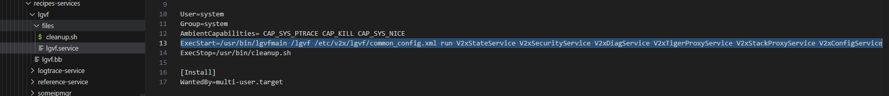
Image reference: doc_image_065.png

Figure 61: Snapshot of the ExecStart command in lgvf.service file

When VCM board booting-up, lgvfmain will start the V2Xmgr services. We can check the running process by command “ps -ef”.

Image reference: doc_image_066.png

Figure 62: Screenshot output when run command “ps -ef” on VCM board

We also can check the booting-up log or operation log by using DLT viewer.

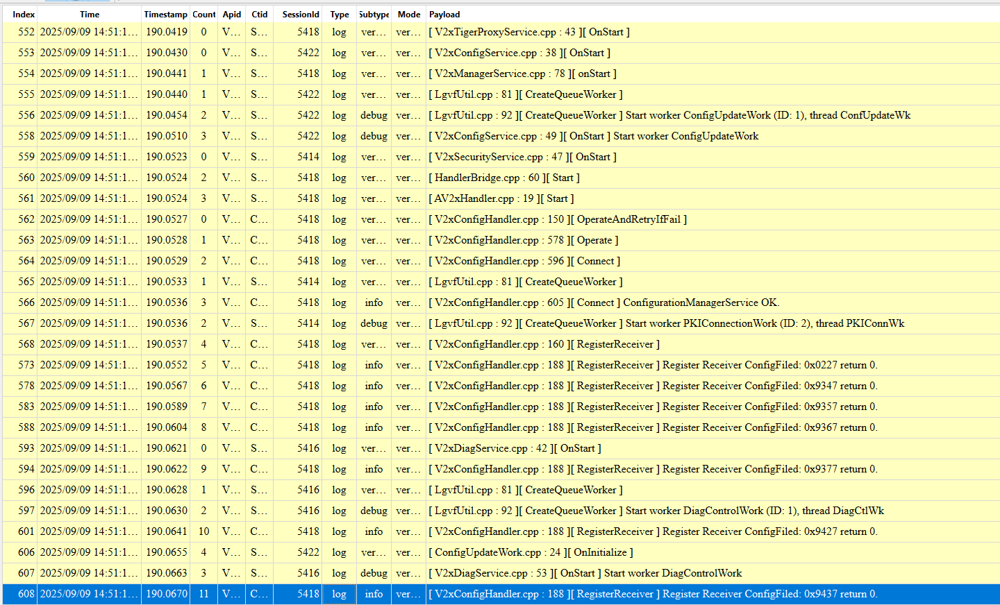
Image reference: doc_image_067.png

Figure 63: Snapshot of the V2Xmgr services log in DLT viewer

Conclusion

- From the implementation and test results above, we can see that the time to receive messages of LGVF design is 6 times faster than the time to execute the process on looper thread. With Throughput of 92MB/s, it completely meets the need to receive multiple data sources at the same time as mentioned in QA#1. In addition, allowing to add new LGVF services by config also makes it easier to reuse and scale this design. This helps reduce costs and effort during the implement phase.

- In the future, it is necessary to design details for V2xStateService to be able to fix potential errors of controlling stack state easily for each OEM.
