# Raw Slide Content

- Source file: FA_Si.Nguyen_V2Xmgr_Commonization/V2Xmgr_Commonization_v1.0.pptx
- Total slides: 31

## Slide 1

Image reference: slide_01_image_01.png

LGE Internal Use Only

Nguyen Van Si

Supervised by Mr. Seung Chul Yi (seungchul.yi)

Function Architect
Design of Commonization for
V2X Manager for telematic projects

1

## Slide 2

Image reference: slide_02_image_01.png

LGE Internal Use Only

Contents

Problem identification
Requirements
Alternatives proposal
Alternatives comparison
Architecture Design
Alternative Verification

2

## Slide 3

1. Problem identification

LGE Internal Use Only

V2XMgr service

3

- V2X Manager is the wrapper service to receive, process data from other services,… and forward this data to V2X Stack .
- V2X Manager also receives V2X messages from the V2X Stack and forwards them to the V2X application and other services.

V2XMgr in JLR-VCM project

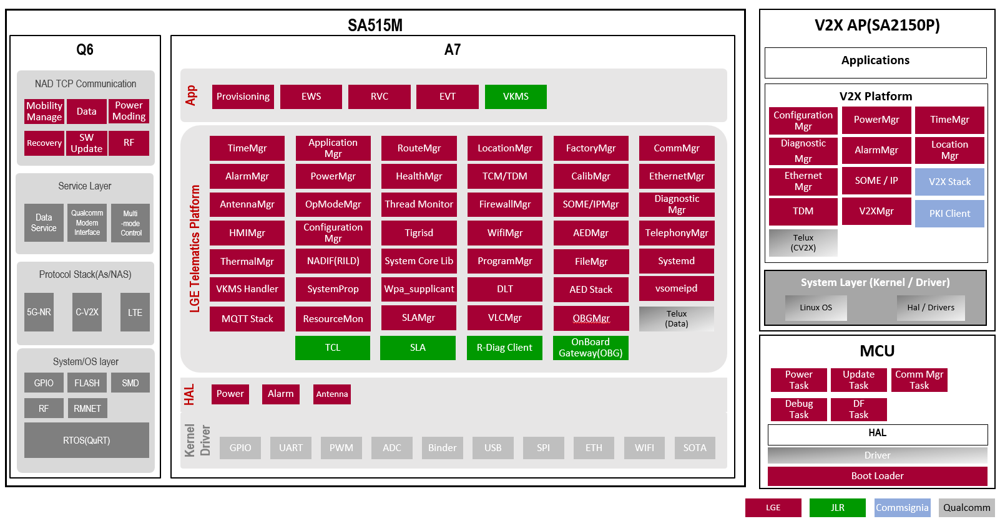
Image reference: slide_03_image_01.png

## Slide 4

1. Problem identification

LGE Internal Use Only

Problem #1: Missing the Commonization

-  No common design of V2X Manager that allows for the reuse of common parts and minimizes effort when implementing the V2X Manager in new projects.

Limitation:
Reusability
Maintainability
Performance

4

Problem #2: Bottleneck Problem

Multi Tiger services send messages to V2XMgr via Binder and store those message to a message queue.
Using Looper thread (single thread) to process the input data from the message queue.

Image reference: slide_04_image_01.png

## Slide 5

2. Requirements

LGE Internal Use Only

5

Functional requirements

### Table
| FR ID | Description |
| FR#1 | VCM shall be capable of receiving the data that forms a V2X message from another ECU. For example; vehicle speed, triggers, path prediction, sensor data, high precision position. |
| FR#2 | VCM shall be capable of sending LDM (Local Dynamic Map) V2X objects over Ethernet to other ECUs in a protocol/market agnostic way (object type message, like vehicle, traffic light, pedestrian, etc). Message format to be defined during the development of the project. |
| FR#3 | VCM shall be capable of supporting the reception of non-standard (JLR Bespoke) V2X messages and send the data to another ECU. |

## Slide 6

2. Requirements

LGE Internal Use Only

6

Quality Attributes

### Table
| QA ID | Description | Quality Attributes | Priority |
| QA#1 | The design should have minimum 20MB/s throughput. | Performance | High |
| QA#2 | The design should have the common part to reuse in the new projects. | Reusability | Medium |
| QA#3 | The solution should be designed in a way that ensures the system applying it is easy to maintain. | Maintainability | Low |

## Slide 7

3. Alternatives proposal

LGE Internal Use Only

Alternative 1: Tiger service with multi-threading

Image reference: slide_07_image_01.png

Pros:
Resolve bottleneck issue
Don't require more RAM
Don't require more CPU
Reusability
Cons:
Maintainability: harder to maintain with a big source code

7

## Slide 8

3. Alternatives proposal

LGE Internal Use Only

Alternative 2: V2XMgr services with LGVF

Pros:
Resolve bottleneck issue
Don't require more CPU
Reusability
Maintainability
Cons:
Require more RAM

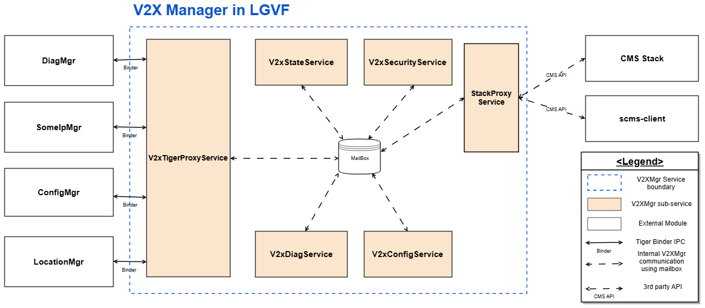
Image reference: slide_08_image_01.png

8

## Slide 9

3. Alternatives proposal

LGE Internal Use Only

Alternative 3: V2X Manager service into multiple Tiger services

Pros:
Resolve bottleneck issue
Don't require more CPU
Maintainability
Cons:
Require more RAM
Reusability: The services are divided so small and all off the services need to connect direct to V2X Stack

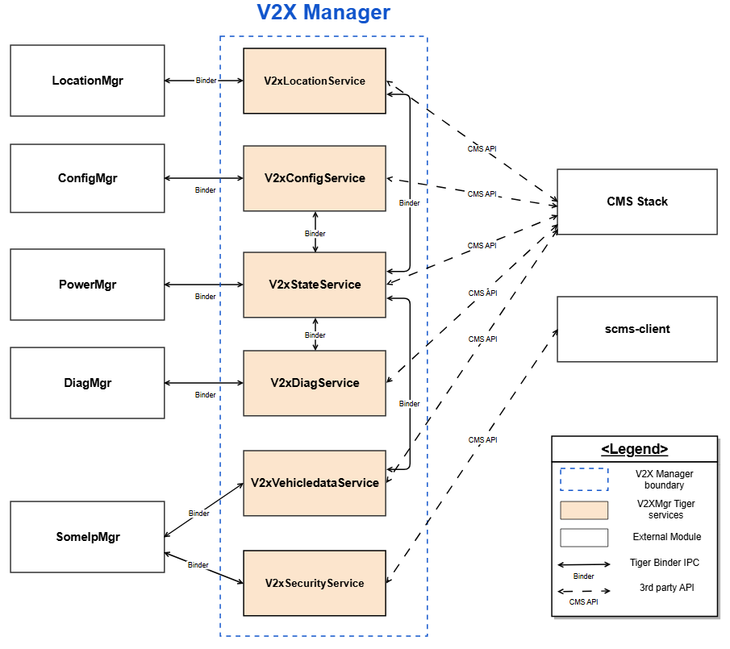
Image reference: slide_09_image_01.png

9

## Slide 10

4. Alternatives comparison

LGE Internal Use Only

10

=> Alternative 2: V2XMgr services with LGVF is better

### Table
| Quality Attributes | Comparison item | Tiger service with multi-threading | V2XMgr services with LGVF | Split V2X Manager service into multiple Tiger services |
| Performance | Increase throughput | Yes | Yes | Yes |
|  | RAM consumption | Low | Medium | Medium |
|  | CPU consumption | Low | Low | Low |
| Reusability | Easy to reuse | Yes | Yes | No |
| Maintainability | Easy to maintain | No | Yes | Yes |

Image reference: slide_10_image_01.png

Image reference: slide_10_image_02.png

Image reference: slide_10_image_03.png

Image reference: slide_10_image_04.png

Image reference: slide_10_image_05.png

Image reference: slide_10_image_06.png

Image reference: slide_10_image_07.png

Image reference: slide_10_image_08.png

Image reference: slide_10_image_09.png

Image reference: slide_10_image_10.png

Image reference: slide_10_image_11.png

## Slide 11

5. Architect design

LGE Internal Use Only

11

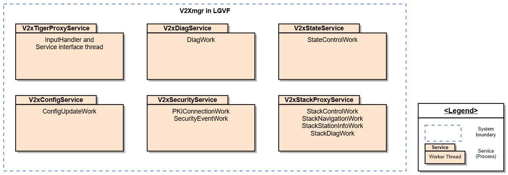
Image reference: slide_11_image_01.png

V2XMgr services with LGVF module view

## Slide 12

6. Alternative Verification

LGE Internal Use Only

12

Scenario: Process 1000 of 100kb length data messages (100MB)

Performance (throughput)

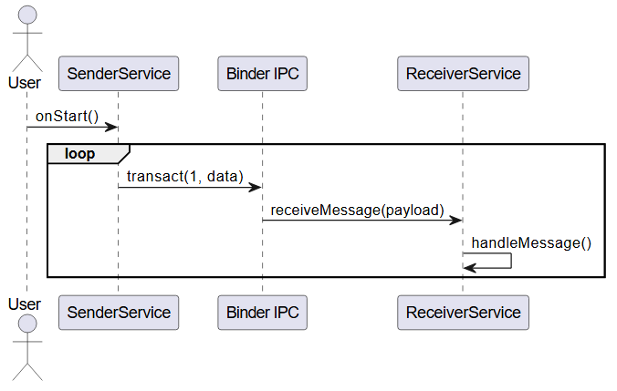
Image reference: slide_12_image_01.png

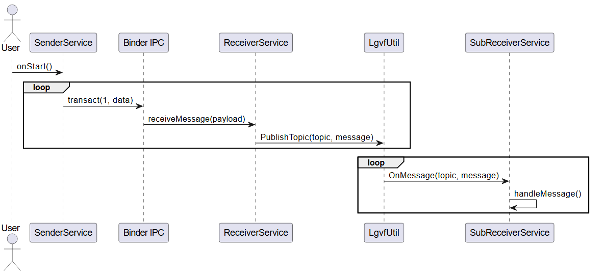
Image reference: slide_12_image_02.png

Old design Sequence diagram

New design Sequence diagram

## Slide 13

6. Alternative Verification

LGE Internal Use Only

13

Scenario: Process 1000 of 100kb length data messages (100MB)

Performance (throughput)

Old design test result

New design test result

### Table
| Mesurement Method | Total Time (ms) | Throughput (MB/s) |
| Test 1 | 6106 | 16.38 |
| Test 2 | 6438 | 15.53 |
| Test 3 | 6650 | 15.04 |
| Test 4 | 6259 | 15.98 |
| Test 5 | 5806 | 17.22 |
| Test 6 | 6045 | 16.54 |
| Test 7 | 5823 | 17.17 |
| Test 8 | 6625 | 15.09 |
| Test 9 | 6530 | 15.31 |
| Test 10 | 6631 | 15.08 |
| Average | 6291.30 | 15.93 |

### Table
| Mesurement Method | Total Time (ms) | Throughput (MB/s) |
| Test 1 | 1006 | 99.4 |
| Test 2 | 1046 | 95.6 |
| Test 3 | 1134 | 88.18 |
| Test 4 | 1082 | 92.42 |
| Test 5 | 1057 | 94.61 |
| Test 6 | 1144 | 87.41 |
| Test 7 | 1135 | 88.11 |
| Test 8 | 1081 | 92.51 |
| Test 9 | 1180 | 84.75 |
| Test 10 | 1031 | 96.99 |
| Average | 1089.60 | 92.00 |

=> New design with LGVF can process 6 times faster than original design

## Slide 14

6. Alternative Verification

LGE Internal Use Only

14

Scenario: Implement V2XMgr in a new project

Reusability

=> Decrease 5.5 MM (45%) implementation effort

### Table
| Old Design |  |  | New design with LGVF |  |  |
| Steps | Complexity | Estimated Time | Steps | Complexity | Estimated Time |
| 1. Implement the basic V2X functions (as the standard functions, V2X LifeCycle,…) | Medium | 2 MM | 1. Porting Common part (included standard functions, V2X LifeCycle,…) | Low | 0.5 MM |
| 2. Implement the OEM requirements | HIGH | 10 MM | 2. Porting Variant part and update the logic as the OEM requirements | Medium | 6 MM |

## Slide 15

6. Alternative Verification

LGE Internal Use Only

15

Scenario: Bug fixing in case control V2X Stack on/off is wrong

Maintainability

=> Decrease 4h (66%) implementation effort

### Table
| Old Design |  |  | New design with LGVF |  |  |
| Steps | Complexity | Estimated Time | Steps | Complexity | Estimated Time |
| 1. Read all V2XMgr source code to identify the code block need to be update | Medium | 4h | 1. Read the V2xStateService and V2xStackProxyService to identify the code block need to be update | Low | 1h |
| 2. Update the code to fix the bug and make sure there is no side effect the existing code | Low | 2h | 2. Update the code to fix the bug and make sure there is no side effect the existing code | Low | 1h |

## Slide 16

Image reference: slide_16_image_01.png

16

## Slide 17

Appendix

17

## Slide 18

Problem #2: Bottleneck Problem

LGE Internal Use Only

18

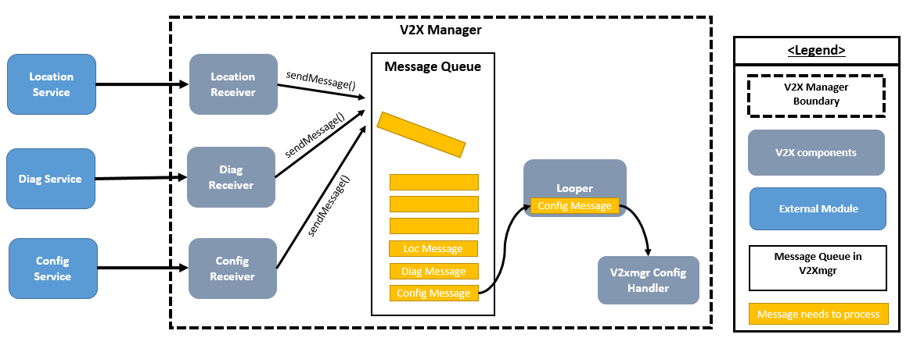
Image reference: slide_18_image_01.png

Flow of data between other services with V2X service

## Slide 19

Problem #2: Bottleneck Problem

LGE Internal Use Only

19

Problem example Sequence diagram

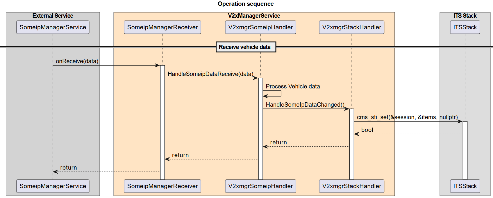
Image reference: slide_19_image_01.png

## Slide 20

System Context Diagram

LGE Internal Use Only

20

System Context Diagram

Image reference: slide_20_image_01.png

## Slide 21

3. Alternatives proposal

LGE Internal Use Only

Alternative 3: V2X Manager service into multiple Tiger services

Pros:
Resolve bottleneck issue
Don't require more CPU
Maintainability
Cons:
Require more RAM
Reusability: The services are divided so small and all off the services need to connect direct to V2X Stack

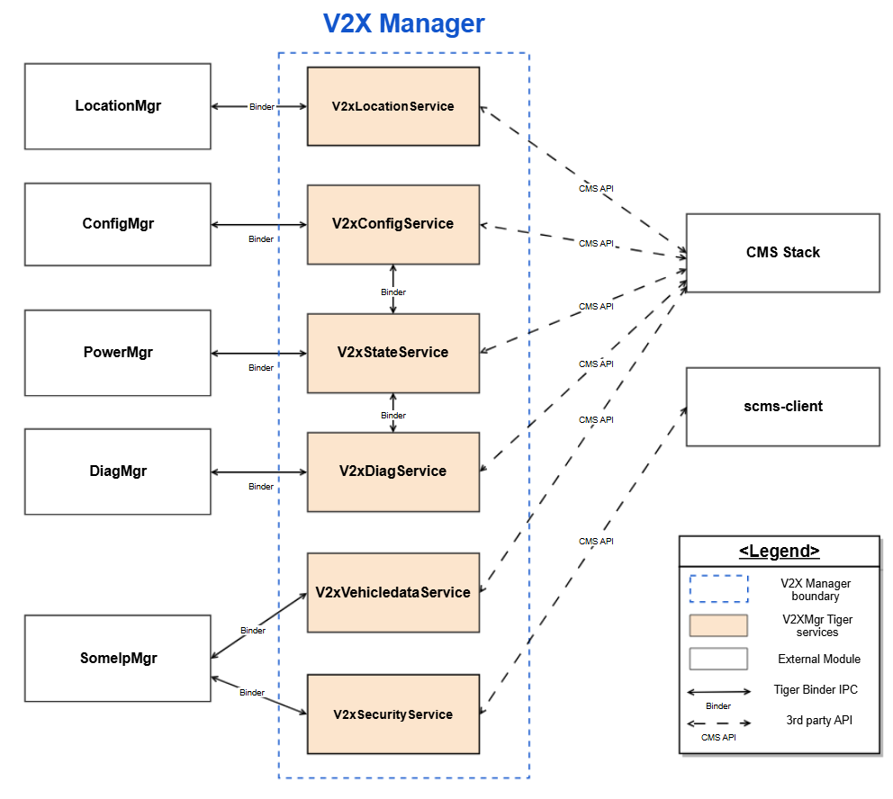
Image reference: slide_21_image_01.png

21

## Slide 22

22

3. Alternatives proposal (UPDATED)

LGE Internal Use Only

Alternative 3: V2X Manager service into multiple Tiger services

Pros:
Resolve bottleneck issue
Don't require more CPU
Maintainability
Cons:
Require more RAM
Reusability: The services are divided so small and all off the services need to connect direct to V2X Stack

Image reference: slide_22_image_01.png

Image reference: slide_22_image_02.png

22

## Slide 23

Problem Sequence diagrams with Alternatives

LGE Internal Use Only

23

The sequence diagram of the fixed issue with multi-threading alternative

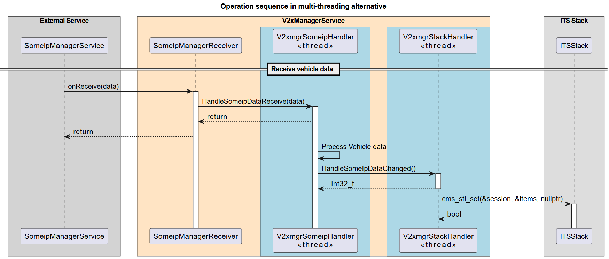
Image reference: slide_23_image_01.png

## Slide 24

Problem Sequence diagrams with Alternatives

LGE Internal Use Only

24

The sequence diagram of the fixed issue with V2XMgr services with LGVF alternative

Image reference: slide_24_image_01.png

## Slide 25

Problem Sequence diagrams with Alternatives

LGE Internal Use Only

25

The sequence diagram of the fixed issue in Multi Tiger services alternative

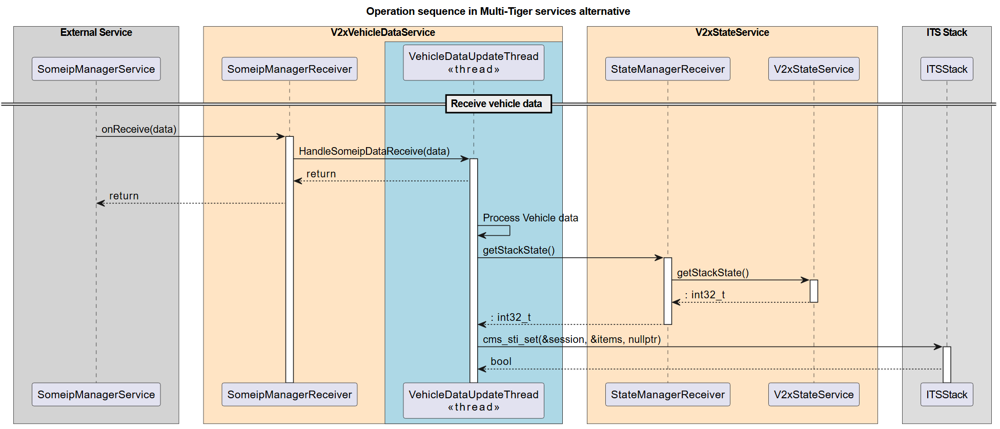
Image reference: slide_25_image_01.png

## Slide 26

V2xTigerProxyService Class diagram

LGE Internal Use Only

26

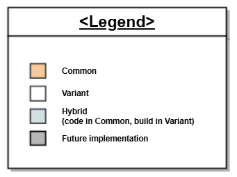
Image reference: slide_26_image_01.png

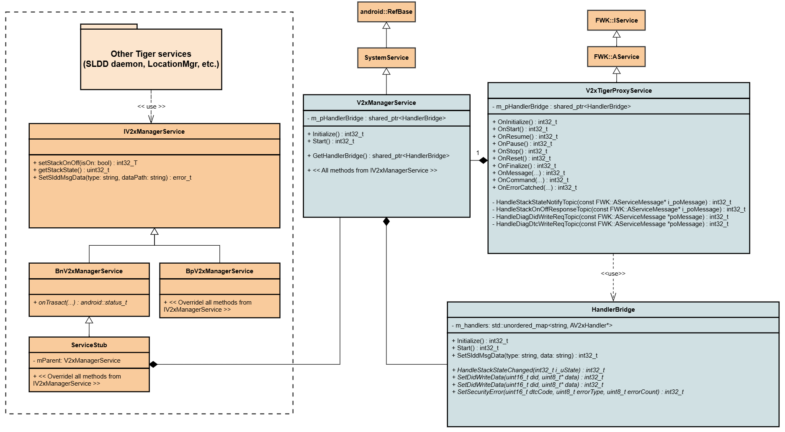
Image reference: slide_26_image_02.png

## Slide 27

V2xConfigService Class diagram

LGE Internal Use Only

27

Image reference: slide_27_image_01.png

Image reference: slide_27_image_02.png

## Slide 28

V2xStackProxyService Class diagram

LGE Internal Use Only

28

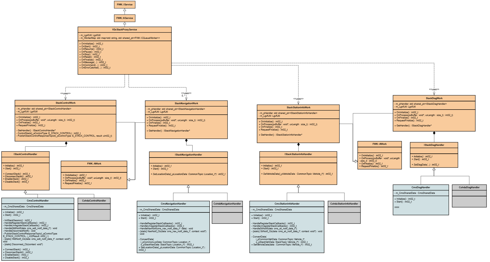
Image reference: slide_28_image_01.png

Image reference: slide_28_image_02.png

28

## Slide 29

Verify throughput of the design

LGE Internal Use Only

29

Log of the Test 10 for Original design

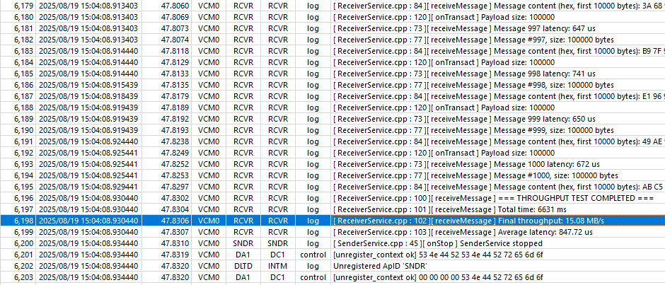
Image reference: slide_29_image_01.png

## Slide 30

Verify throughput of the design

LGE Internal Use Only

30

Log of the Test 10 for New LGVF design

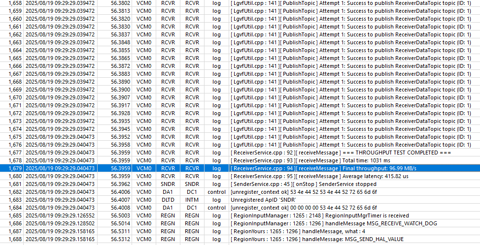
Image reference: slide_30_image_01.png

## Slide 31

Verify new design running on VCM project

LGE Internal Use Only

31

Screenshot output when run command “ps -ef” on VCM board

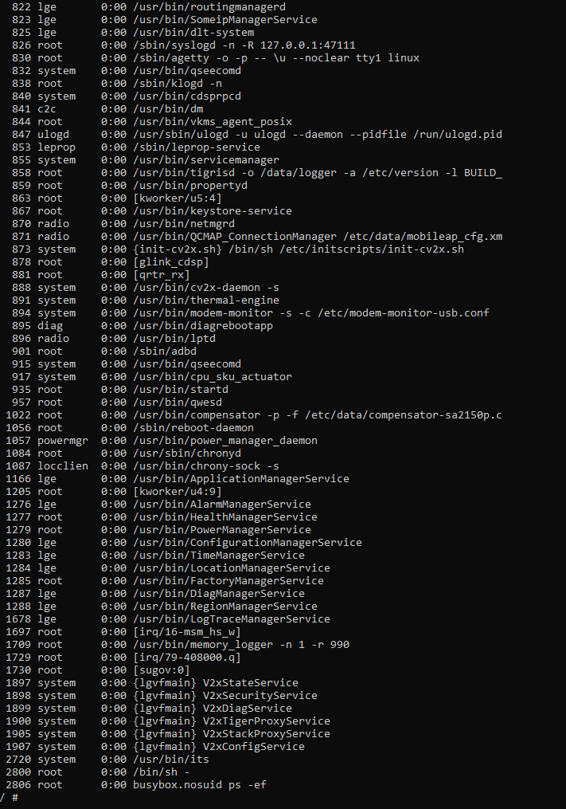
Image reference: slide_31_image_01.png

