# Raw Document Content

- Source file: FA_thai.le/thai.le/FA_thai.le_Design_Document_Improvement the Factory Service design for commonization across Renault Nissan Project V3.0.docx

Image reference: doc_image_001.jpeg

LGE VS

FA Design Document:

Improvement the Factory Service design for commonization across Renault Nissan Project

Thai.le

Supervised by Eunhee.jeong

2024.09.30

Revision History

## Table
| Version | Date | Comment | Author | Reviewer |
| --- | --- | --- | --- | --- |
| 1.0 | 2024-08-15 | First draft | Thai.le | eunhee.jeong |
| 2.0 | 2024-09-20 | 2nd version | Thai.le | eunhee.jeong |
| 3.0 | 2024-09-30 | 3rd version | Thai.le | eunhee.jeong |

Table of Contents

1	Introduction	1

1.1	Purpose	1

1.2	Scope	1

1.3	Audience	1

2	Project Context	2

2.1	Background Explanation	2

Factory Service Overview	3

3	Problem Identification	5

3.1	Factory Software base on FactoryOS (V1.0)	5

3.2	Current Factory Software base on FactoryOS Container (V2.0)	6

3.3	Quality Attributes	9

4	Architecture Design Proposals: Design 1 - Direct Integration using Android HIDL Service	10

4.1	Static View	10

4.2	Class Diagram	12

4.3	Sequence Diagram	14

5	Architecture Design Proposals: Design 2 – Using Common API	16

5.1	SW Architecture of Factory Service	16

5.2	Component Diagram	18

5.3	Common API Introduction	19

5.4	Class Diagram	21

5.5	Sequence Diagram	25

6	Design compare	26

7	Design Tactic and Experimental Result	28

7.1	Design Tactic and Experimental Result	28

7.2	Common API Detail Design (Tactic Applied)	29

Figures

Figure 1 Factory Line map	2

Figure 2 Inspection Station	2

Figure 3 System Context	3

Figure 4 FactoryOS 1.0 boot mode	5

Figure 5 FactoryOS 2.0 SW architecture	6

Figure 6 FactoryOS 2.0 Context Diagram	7

Figure 7 Android HIDL Service Context Diagram	10

Figure 8 Class Diagram for Android HIDL Service proposal	12

Figure 9 Sequence Diagram for Android HIDL Service proposal	14

Figure 10 Common API Proposal Context Diagram	16

Figure 11 Component Diagram for CommonAPI proposal	18

Figure 12 CommonAPI Introduction	19

Figure 13 Class Diagram for CommonAPI proposal	21

Figure 14 Sequence Diagram for CommonAPI proposal	25

Figure 15 Class Diagram for CommonAPI proposal applied tactic	29

Tables

Table 1 Quality Attributes	9

Table 2 Constraints	9

Table 3 Design compare	27

Table 4 Design Tactic and Experimental Result	28

Introduction

Purpose

This is design document that specifies the software architecture design for Commonlization Factory Service for Renault Nissan Project.

Scope

This document covers for Factory Service.

This document applies Renault/Nissan Project.

Audience

The target audience of this document is:

Software architect, Component developer

Project Context

Background Explanation

Factory Service Introduction:

Factory Service (FS) is the service made for line test in the factory.

After being assembled, all products have to be inspected to ensure there is no defects before shipment

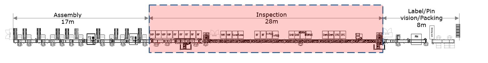
Image reference: doc_image_002.png

Figure 1 Factory Line map

Inspection test have several Station. Each station will perform some test item.

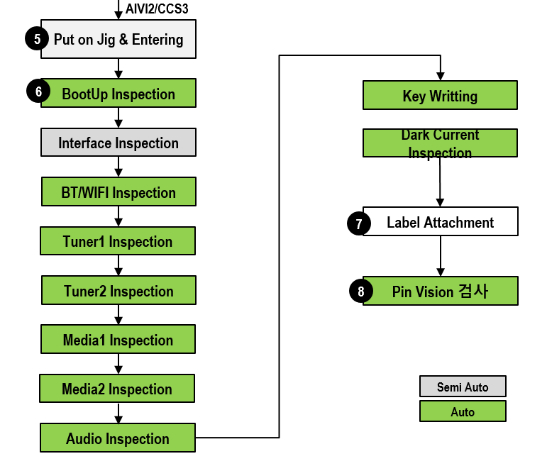
Image reference: doc_image_003.png

Figure 2 Inspection Station

Factory Service Overview

Factory Service have below basic functions:

Communicates with test tool with 2 mandatory connections interface: UART and TCP.

Received test command from test tool with a predefined protocol.

Communicates with others services to execute the test and respond the result to test tool.

Write production information (Serial Number, DID …) and Key provision into product.

Image reference: doc_image_004.png

Figure 3 System Context

AVN product:

This is the device or product that has been assembled and is now ready for testing.

It has an Ethernet or UART interface, which allows it to communicate with the PC for receiving test request.

The product also connect with other external equipment via test bench.

Test Bench:

The test bench is a specialized piece of equipment designed for testing the product and it also supplies power to the device.

It has various input/output ports, signal generators, and measurement instruments to thoroughly evaluate the product's performance and functionality.

The test bench acts as an intermediary between the product and the PC, allowing the PC to control and monitor the testing process.

PC:

The personal computer is used as the control and monitoring center for the testing setup.

PC runs Inspection tool for send serveral test command to device, and connect to GMES system to store/get information for device product

GMES:

GMES is a software application running on the PC that allows the user to control and monitor the testing process.

GMES system has various features, such as test automation, data logging, save history, real-time visualization, and reporting the testing workflow.

Problem Identification

Factory Software base on FactoryOS (V1.0)

When the AIVI2 Project started, a total of three variants were presented. (Renault AIVI2, Nissan, CHINA)
Renault AIVI2 and Nissan User mode are developed by LG based on AndroidOS and produced by LG Vietnam Production Corporation.
In the case of CHINA User mode, it is developed in China based on AliOS and produced by LG Vietnam Production Corporation.

In order to produce the three shared HW, it was necessary to produce a separate SW.
Therefore, we designed a new type of Factory SW based on Linux Base in the form of MiniOS (FactoryOS).

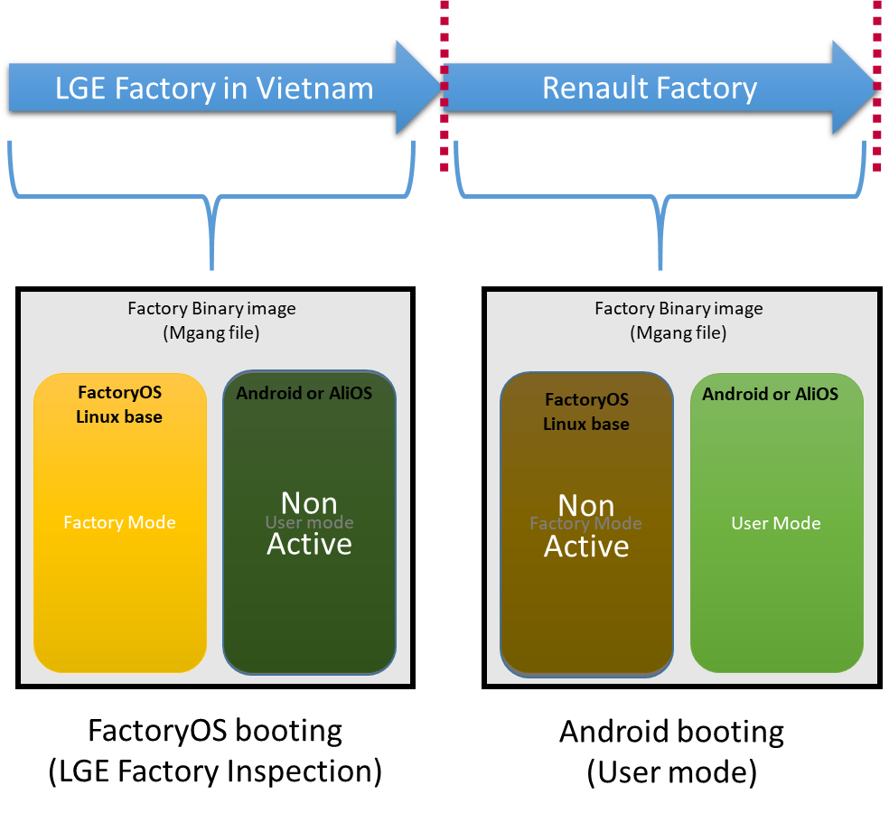
Image reference: doc_image_005.png

Figure 4 FactoryOS 1.0 boot mode

In LGE Factory in Vietnam:

FactoryOS is active, FactoryOS running to test Inspection function

In Renault/Nissan Factory:

After LGE Factory Inspection, FactoryOS was removed. User mode based on Android is active.

FactoryOS 1.0 Problem:

Duplicate effort when modification/extend functions for both FactoryOS and Android.

Due to the lack of experience with Kernel drivers and the BSP layer, it is difficult for the Factory SW team members to maintain the FactoryOS

Current Factory Software base on FactoryOS Container (V2.0)

In current project Renault/Nissan CCS:

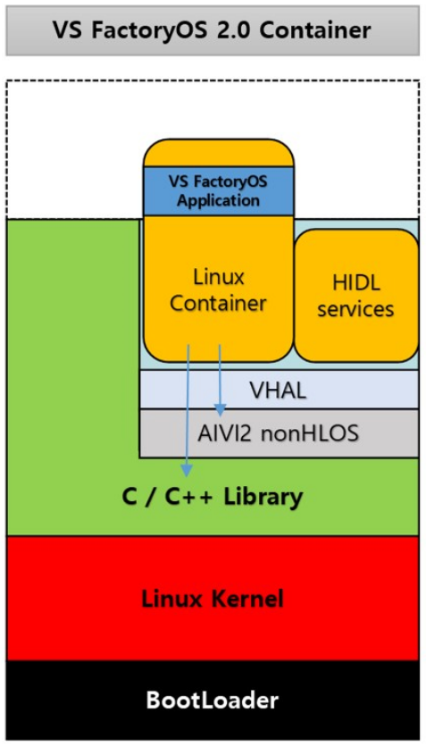
Image reference: doc_image_006.png

Figure 5 FactoryOS 2.0 SW architecture

In Factory OS 2.0: Android OS is host and FactoryOS runs on container

The aim is to remove Host OS- dependent, regardless the host is Android based or Linux/QnX based and reuse FactoryOS base on Linux.

Android and Linux Container using same Library, Linux Kernel and Bootloader layer with Android host OS

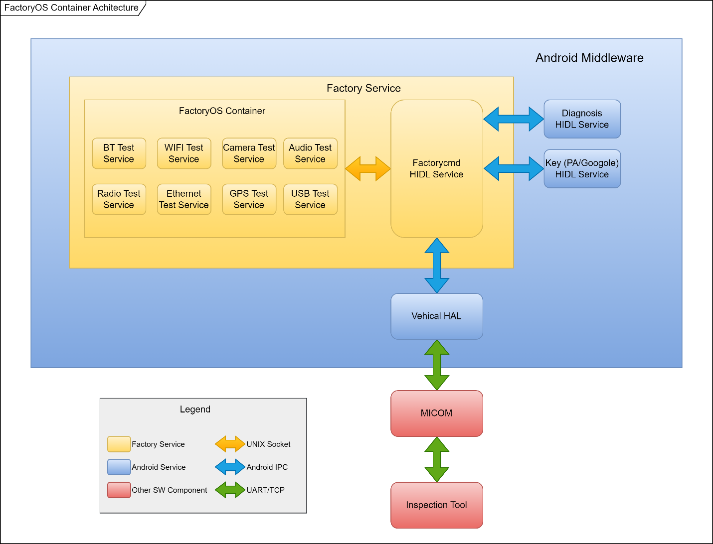
Image reference: doc_image_007.png

Figure 6 FactoryOS 2.0 Context Diagram

In above diagram:

FactoryOS Container:

Base on Linux, need bootup after Android host bootup complete

Factorycmd (HIDL) Service:

This service is responsible for receiving test commands from the MCU through the Vehicle HAL HIDL service.

The Factorycmd service acts as an intermediary, forwarding the test commands to the FactoryOS container for execution via socket IPC.

Diagnosis (HIDL) Service:

This service is responsible for write production information (Serial Number, DID, WipID …) into product.

Key Google/PA (HIDL) Service:

This service is responsible for execute Key Provision function (Google Key, PA Key …) into product.

VHAL (HIDL) Service:

This service is part of the VHAL, which provides a standardized interface for accessing hardware-specific features and functionality.

VHAL (HIDL) Service is used to communicate with the MCU and receive the test commands.

MCU:

The MCU is the microcontroller responsible for communicate with Inspection PC via UART protocol.

FactoryOS Container 2.0 problem:

Increased Complexity and Maintenance:

Maintaining and managing two separate environments are more complex compared to a unified platform.

Debugging, troubleshooting when having issue and updating the system more complex.

Performance:

Sequential Boot Process: In the current design, the Android OS must fully boot first, followed by the bootup of the FactoryOS container. This sequential bootup increases bootup time then leading decrease UPH (Unit Per Hour) in Production line.

Reliability:

We met a Critical issue Critical issue in FCT Production Line about container create fail in 1st booting then container could not start in next booting.

We need to re-flash the whole SW image for 5-7 samples per week.

Platform independence:

FactoryOS is tightly coupled with the Linux OS and has specific hardware dependencies.

Quality Attributes

Table 1 Quality Attributes

## Table
| Scenario# | Quality Attribute Scenario | Quality Attribute | Priority |
| --- | --- | --- | --- |
| QA-01 | FS must have fast boot time. | Performance | High |
| QA-02 | After system corrupt or suddenly power off, FS must be able to recover, data in FS will not lost. | Reliability | High |
| QA-03 | FS should be compatibility with different platforms (hardware and operating systems). | Platform Independence | High |
| QA-04 | After apply this commonlization design, FS should be available for reusing source code for new project without modify. | Reusability | Medium |

Table 2 Constraints

## Table
| Scenario# | Constraints | Type |
| --- | --- | --- |
| CO-01 | FS should follow LGEDV Coding Convention, defect 0 with 24 most violated issues. http://collab.lge.com/main/display/DCVCC/LGEDV+Coding+Convention. | Technical Constraint |
| CO-02 | FS should call API from other test module (service) | Technical Constraint |
| CO-03 | FS should be compatibility with different platforms (hardware and operating systems). | Business Constraint |

Architecture Design Proposals: Design 1 - Direct Integration using Android HIDL Service

Static View

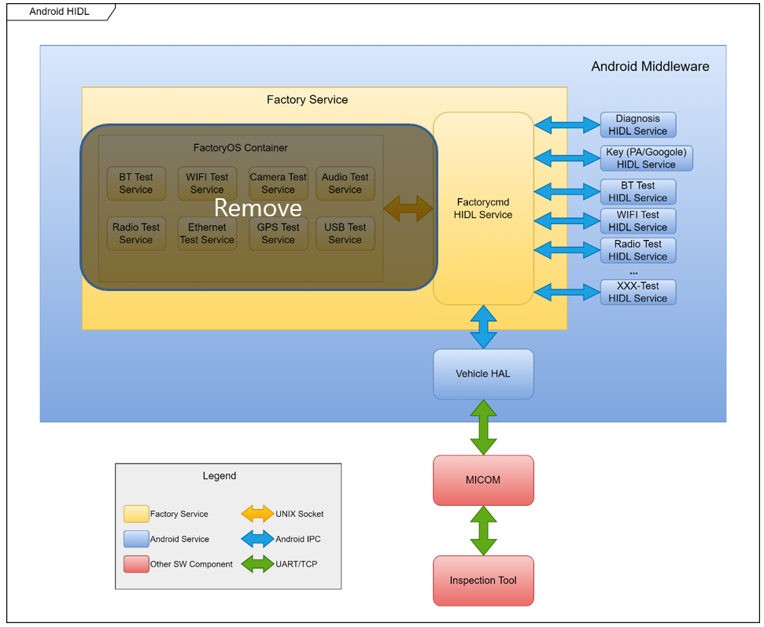
Image reference: doc_image_008.png

Figure 7 Android HIDL Service Context Diagram

Replace FactoryOS Container and instead of calling Direct Android HIDL Service:

Remove the separate FactoryOS container and directly integrate the factory service into the Android system using HIDL (Hardware Abstraction Layer).

This design would streamline the architecture by eliminating the need for a separate Linux container, reducing complexity, and improving system maintainability.

Implement Factorycmd HIDL Service:

Develop a Factorycmd service directly within the Android HIDL layer, which will handle receiving test commands from the MCU via UART or other interfaces.

This service will interact with VHAL (Vehicle HAL) services to communicate with the hardware (MCU) and execute testing commands.

Pros:

Streamlined Communication:

Remove the socket-based communication between the FactoryOS container and the Android host, simplifying the data flow.

Use direct IPC (Inter-Process Communication) between Android HIDL services and the hardware interfaces for efficient and fast communication.

Improved Boot Time:

By eliminating the separate FactoryOS container and integrating all factory services within the Android HIDL layer, the boot time can be significantly reduced.

The system will no longer need to wait for the FactoryOS container to boot up after the Android host, meeting the performance requirement.

Enhanced Reliability:

With the container removed, potential container-related failures (such as container creation failure) are avoided, enhancing system reliability.

HIDL services, being native to the Android framework, provide a more stable environment for executing critical test commands.

Cos:

Limited Reusability Outside Android:

While the source code may be reusable within the Android environment, Android-specific APIs (HIDL) may reduce the reusability of Factory Service components in non-Android environments. Code modification should be required when transitioning to different project.

Android Platform Dependency:

Dependency on the Android operating system. If the Factory Service needs to be ported to non-Android platforms (such as Linux or QNX), significant modifications might be required, limiting overall platform independence.

Class Diagram

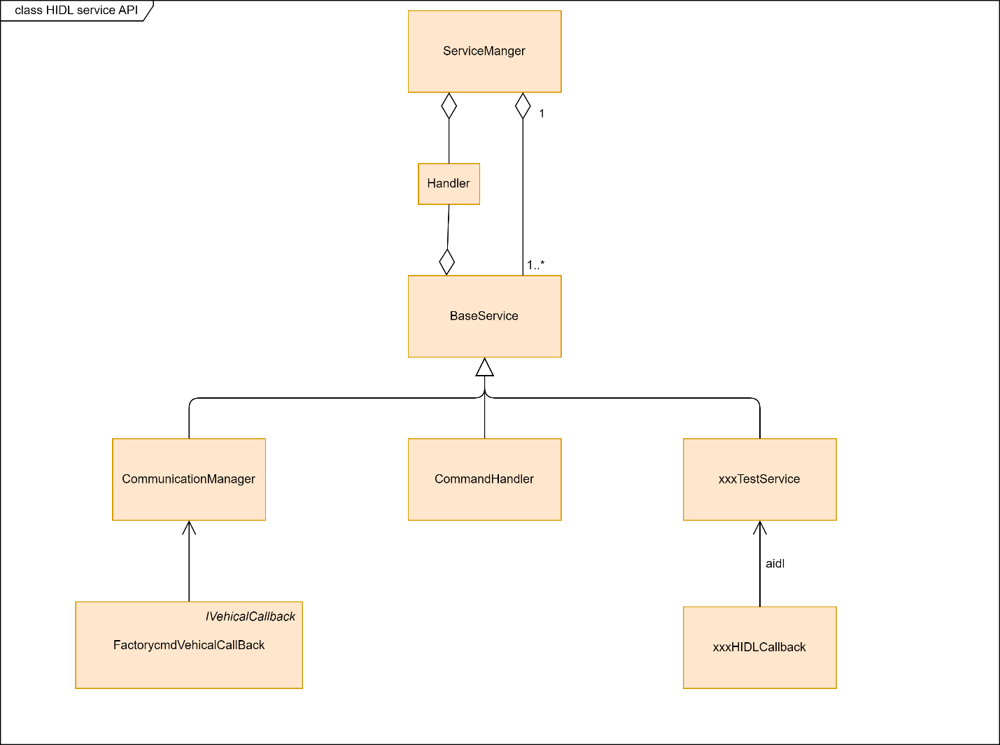
Image reference: doc_image_009.png

Figure 8 Class Diagram for Android HIDL Service proposal

The class diagram for the proposal of direct integration using the Android HIDL service outlines the structure and interaction of various components in Proposal 1 design:

ServiceManager:

The central class that manages all services in the system.

It registers, starts, and stops services, and provides an interface for other components to access and communicate with these services.

Acts as a point of communication between the BaseService and other service classes, helping to manage their lifecycle.

Handler:

Handles events and actions within the HIDL service API.

Acts as a middleman to pass commands or responses between different components, ensuring that the data flow follows the necessary protocols and procedures.

Often used in conjunction with the CommandHandler to execute various actions requested by external tools or services.

BaseService:

The base class from which other services inherit common functionalities.

Provides a generic structure and essential functions that other specialized services can use. This may include initializing the service, starting or stopping the service, and communication protocols.

Acts as a parent class for the CommunicationManager, CommandHandler, and xxxTestService, providing them with a standardized interface and common behaviors.

CommunicationManager:

Manages the communication with external entities (such as the PC, test tools, or other services).

Handles sending and receiving data, likely implementing UART or TCP/IP protocols as needed. This ensures the proper exchange of commands and responses between the test tools and the Factory Service.

Works closely with BaseService to use the standardized communication protocols and interfaces provided.

xxxTestService

Represents a specific testing service in the system.

Implements various testing functions (e.g., hardware diagnostics, functionality checks) defined by the factory’s requirements.

Inherits common functionalities from BaseService and works in coordination with CommandHandler to execute specific test commands.

I/VehicalCallback (FactorycmdVehicalCallBack)

Provides a callback interface for VHAL (Vehicle HAL) service.

Defines the methods for receiving and processing vehicle-specific data or commands in response to interactions with the MCU (Microcontroller Unit).

Works with the CommunicationManager to handle callbacks and processes data sent by the VHAL (Vehicle HAL) service, ensuring proper execution of vehicle-related tests.

xxxHIDLCallback

A placeholder callback class for handling various HIDL service responses.

This class processes responses from different HIDL services (e.g., Diagnosis, ConfigHub) and forwards them to the appropriate handlers or components for further processing.

Acts as a communication bridge between CommandHandler and various HIDL services, handling callbacks and responses to the commands sent out.

Sequence Diagram

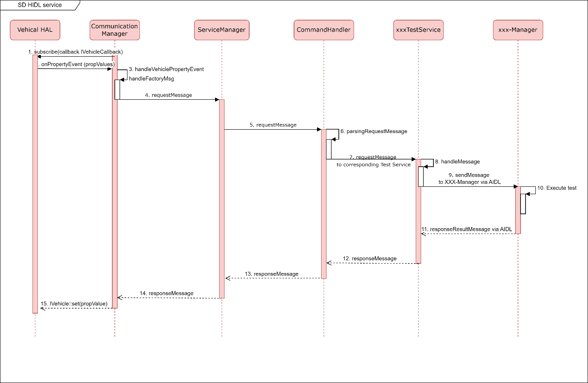
Image reference: doc_image_010.png

Figure 9 Sequence Diagram for Android HIDL Service proposal

Step Description:

CommunicationManager subscribes to Vehicle HAL with 2 propId: PROP_FACTORY_TOOL and PROP_FACTORY_COMMAND. FactoryBase will listen all events and filter with those 2 propId.

When Vehicle HAL broadcasts events, CommunicationManager will listen and verify with propId. If CommunicationManager verifies a valid event, it will start call handleVehiclePropertyEvent method.

In handleVehiclePropertyEvent method, it verify it a valid Factory Micom message or not. If it is a valid message, call checkRevMsg to check FACTORY_MSG or not, then call handleFactoryMsg.

Communication Manager receive request, then verify it a valid Factory Micom message or not. If it is a valid message, it will be sent to Service Manager.Service Manager receive message, then send it to Command Handler…

Service Manager receive message, then send it to Command Handler.

Command Handler parse message request.

Command Handler send request message to corresponding xxx Test Service base on message type. Request message will be push into a queue in HandlerThread.

xxx Test Service receive request

xxx Test Service send test request to XXX-Manager via AIDL.

XXX-Manager excute the test.

After get the result from a method based on command, it will call responseResult method in Command Handler.

The responseResult method in CommandHandler

In postMessage method in Service Manage, the command will be parsing, then the message will push into an InternalService queue to wait sending result.

In InternalService queue, when a message result pushed to it, it will call handleMessage method. The parseResult method in Communication Manager will be called.

In responseResultToVhal, the IVehicle::set will be called to response result to Vehicle HAL. This will send result to Micom.

Architecture Design Proposals: Design 2 – Using Common API

SW Architecture of Factory Service

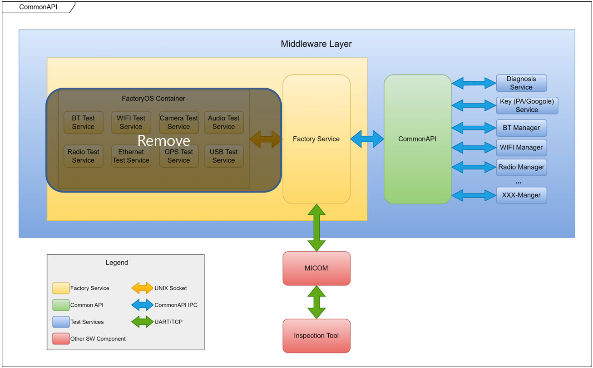
Image reference: doc_image_011.png

Figure 10 Common API Proposal Context Diagram

The second design proposal introduces a more modular and layered architecture by using a common API within a middleware framework to facilitate interactions between hardware, services, and applications.

Overview:

Remove the separate FactoryOS container.

The main objective of this design is to use a unified middleware layer that abstracts hardware interactions and provides a standardized communication interface between different modules and services.

It enhances flexibility, compatibility, and reusability by providing a common API for all services, thus simplifying the communication process.

Here’s a detailed breakdown of each component in the design:

Middleware Layer:

CommonAPI:

Role: A standardized communication framework within the GenIVI project.

Function: Provides a uniform interface for the Factory Service to interact with the different hardware-related test modules (e.g., Bluetooth, WiFi, Camera, USB). It abstracts the complexities of hardware communication, allowing the middleware to seamlessly execute commands and retrieve data from various services.

Interaction: Serves as the bridge between the Factory Service and the individual test modules, facilitating standardized data exchange.

Factory Service:

The Factory Service is the central control module within the middleware. It receives commands from the PC and call API to XXX-Manager to executes them using the Test Modules.

It uses a protocol, like SOME/IP (Scalable service-Oriented MiddlewarE over IP), to communicate with other services in the middleware layer. This protocol is designed for efficient communication in automotive and factory environments.

XXX-Manager (Test Modules):

A collection of services (e.g., BT, WIFI, Camera, USB, Audio, CAN, Radio, Ethernet, GPS) that represent various hardware components and functions to be tested.

These modules provide specialized functions and use the common API provided by the middleware to execute commands. For example, the Camera service would handle tests specific to the camera hardware, while the WIFI service would perform network-related tests.

Component Diagram

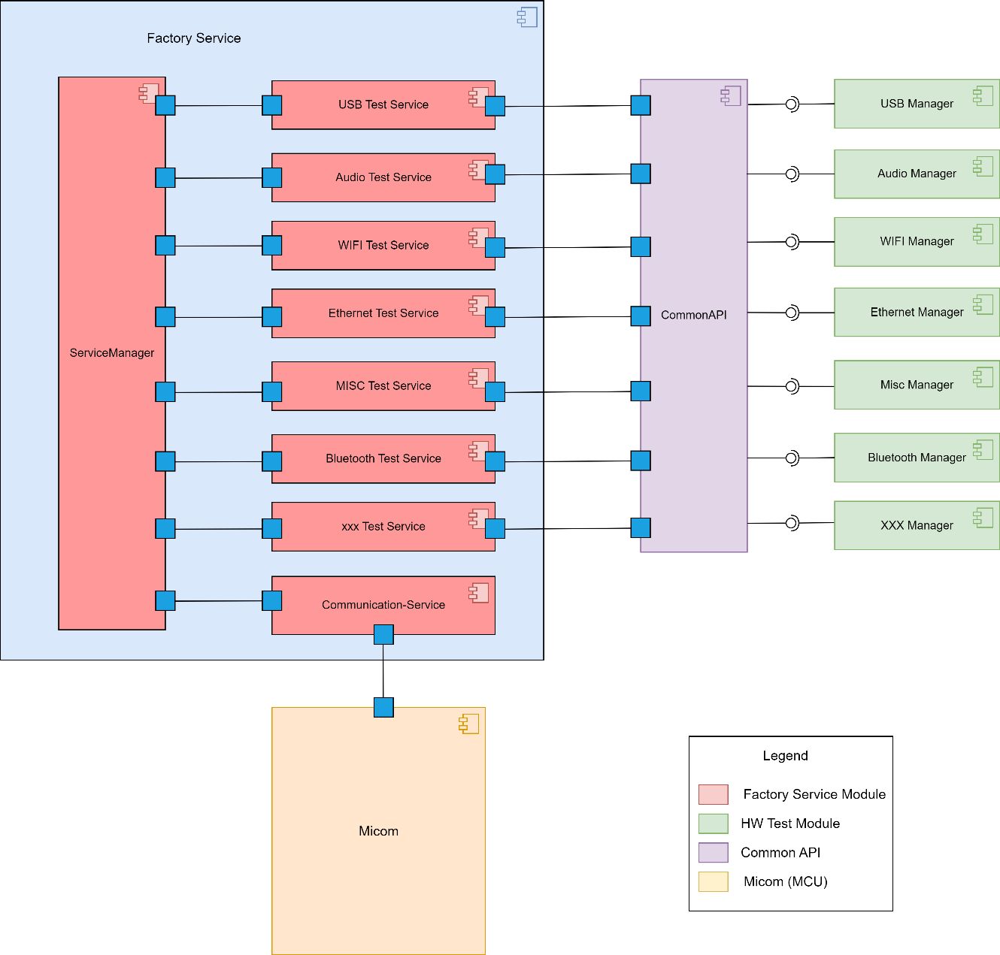
Image reference: doc_image_012.png

Figure 11 Component Diagram for CommonAPI proposal

Service Manager is responsible for managing services. Each service has the capability to register/unregister with Service Manager

A Factory Test Service can register the types of messages it wants to receive with Service Manager

A Test Service can broadcast messages to other services through Service Manager

Communication Manager is responsible for managing connection with the MCU (Micom) via TCP/UART protocol and handling test requests/responses

Command Handler Service is responsible for parsing/formatting commands follow Protocol before forwarding it to the specified Test Service or Communication Manager

Test services call to API of XXX-managers that source was generated by Common API

Common API Introduction

Image reference: doc_image_013.png

Figure 12 CommonAPI Introduction

CommonAPI is a middleware framework developed within the GenIVI Alliance project to facilitate communication between software components in automotive infotainment systems. It provides a standardized interface, enabling seamless integration, interoperability, and compatibility between different applications and services. CommonAPI is platform-independent and supports multiple programming languages, which makes it adaptable to various automotive platforms.

The diagram illustrates the interaction between a Client and a Server using an Interface that defines the required and provided methods, attributes, and broadcasts. This setup showcases how CommonAPI standardizes communication and promotes compatibility.

Key Benefits of CommonAPI:

1. Standardized Interface

CommonAPI provides a unified communication framework by defining a standard Interface for interaction between clients and servers. This interface includes methods (functions to call), attributes (data to be accessed), and broadcasts (notifications or events).

This standardized communication method simplifies integration and reduces errors. Developers do not need to build custom communication mechanisms for each module. Instead, they use predefined interfaces that provide consistent interactions between software components. This ensures that new components can be added seamlessly, as they only need to conform to the existing standard.

2. Reduced Development Time

With a standard interface and communication protocols, CommonAPI allows developers to focus on implementing specific functionalities rather than creating custom communication logic. It provides ready-to-use templates and code-generation tools to implement the client-server interaction based on the defined interfaces.

This significantly cuts down the development time, as the reusable templates and a common framework streamline the process of adding new services or components. The consistency of the interface also reduces the time spent on testing and debugging communication issues, further accelerating the overall development cycle.

3. Platform Independence

CommonAPI is designed to work across various operating systems (e.g: Android, Linux, QNX) and supports multiple programming languages (e.g: C, C++, Java). It abstracts hardware-specific details, enabling the same interface and communication methods to be used on different hardware and software platforms.

This platform independence means that the same codebase can be reused across different automotive systems without modification. It allows manufacturers to switch between different hardware platforms or integrate new components without needing to overhaul the existing communication infrastructure.

4. Improved System Stability

By providing a standardized interface, CommonAPI ensures consistent and reliable communication between software components. It includes built-in error handling, serialization, and state management mechanisms that help maintain the integrity of data exchanged between clients and servers.

Class Diagram

Image reference: doc_image_014.png

Figure 13 Class Diagram for CommonAPI proposal

The class diagram for design proposal 2, which uses a common API, shows the structure and interactions of the system's various components. Here's a detailed breakdown of each class and its role in the system:

ServiceManager

Role: Manages the lifecycle of services within the system. Each service has the capability to register/unregister with ServiceManager.

Function: It acts as the central controller for starting, stopping, and managing services. It ensures the proper coordination and execution of different services.

A service can broadcast messages to other services through ServiceManager.

Handler

Role: Acts as the intermediary for processing and handling commands or events.

Function: It handles the processing of requests from the ServiceManager and relays them to the appropriate services (e.g., CommandHandler, xxxTestService). The Handler ensures smooth communication and command execution within the system.

Interaction: Linked with the ServiceManager to support command handling across multiple BaseService instances.

BaseService

Role: Serves as the base class for all other services in the system.

Function: Provides common functionalities and an interface that other services (like CommunicationManager, CommandHandler, and xxxTestService) can use. This class sets the foundation for reusability and consistency in service implementation.

Interaction: Inherited by CommunicationManager, CommandHandler, and xxxTestService, giving them common behaviors and structures for interacting within the system.

CommunicationManager

Role: Manages communication with external tools, hardware components, or devices.

Function: Uses an interface (IConnection) to handle different types of connections, such as TCP/IP or UART. This class abstracts the details of communication, allowing the system to connect with external devices using a standard API.

Interaction: Works with IConnection to support different connection types (TcpServer, Uart). Inherits basic service behaviors from BaseService.

IConnection

Role: Defines a common interface for different connection types.

Function: It provides a standardized API for communication modules, allowing for various implementations (e.g., TcpServer, Uart). This interface supports flexibility in choosing different communication methods.

Interaction: Implemented by TcpServer and Uart classes to handle specific types of communication with the system.

TcpServer and Uart

Role: Implement specific types of connections.

Function: TcpServer handles communication over a TCP/IP network, while Uart manages communication over a UART (Universal Asynchronous Receiver/Transmitter) interface.

Interaction: They both implement the IConnection interface, providing concrete implementations for the CommunicationManager to use in managing external communications.

CommandHandler

Role: parsing/formatting commands before forwarding it to the specified xxxTestService.

Interaction: Inherits from BaseService and works closely with CommunicationManager to handle incoming commands.

xxxTestService

Role: Represents a specialized test service within the system.

Function: Implements specific testing functionalities defined by the common API. It executes tests for different modules, interacting with the XXX-Manager to perform necessary operations.

Interaction: Inherits from BaseService and generates code via the Common API. It interacts with XXX-Manager to handle specific testing services.

XXX-Manager

Role: execute specific testing operations then respond test result to FS.

Function: Works alongside xxxTestService to execute test operations as part of the system's functionalities.

Interaction: Collaborates with xxxTestService, using the common API-generated code to perform hardware-specific or test-specific operations.

Overall Interaction:

The ServiceManager acts as the main controller, managing services using the Handler.

The BaseService serves as a parent class, providing a common structure for the specialized services: CommunicationManager, CommandHandler, and xxxTestService.

The CommunicationManager uses the IConnection interface to support different communication methods (TcpServer, Uart), facilitating data exchange with external systems.

The CommandHandler processes commands, interacting with xxxTestService to carry out testing functions.

The xxxTestService uses the Common API to generate code to call API from XXX-Manager to execute specific test operations.

Pros:

Streamlined Communication:

Remove the socket-based communication between the FactoryOS container and the Android host, simplifying the data flow.

This design uses a common API to streamline communication and interaction between different components. This allows for a unified way to handle various communication methods and services.

Improved Boot Time:

By eliminating the separate FactoryOS container, the system will no longer need to wait for the FactoryOS container to boot up after the Android host, meeting the performance requirement.

Enhanced Reliability:

With the container removed, potential container-related failures (such as container creation failure) are avoided, enhancing system reliability.

Modularity:

By implementing a base service (BaseService) and common interfaces (IConnection), this design enables modular development and integration of various services and communication methods.

Flexibility and Extensibility:

The use of the IConnection interface allows adding new types of connections (e.g., additional communication protocols) without modifying existing services. Similarly, the xxxTestService and XXX-Manager can be extended or replaced to accommodate new testing requirements.

This design proposal aims to provide a reliable, reusable, and platform independence architecture for managing communication and test services within the factory system. It achieves this through the use of common APIs, modular class structures, and interfaces that support various connection types and testing operations.

Sequence Diagram

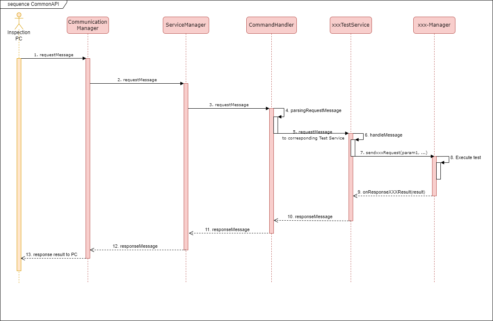
Image reference: doc_image_015.png

Figure 14 Sequence Diagram for CommonAPI proposal

Step Description:

Inspection PC send request for test about xxx item.

Communication Manager receive request via TCP/UART, then verify it a valid Factory Micom message or not. If it is a valid message, it will be sent to Service Manager.

Service Manager receive message, then send it to Command Handler.

Command Handler parse message request.

Command Handler send request message to corresponding xxx Test Service base on message type. Request message will be push into a queue in HandlerThread.

When a command message pushed to HandlerThread queue, handleMessage in xxxTestService will be call.

xxxTestService call to corresponding API of XXX-Manager.

XXX-Manager execute the test.

Then respond the test result back to xxxTestService.

xxxTestService respond message to Command Handler.

Command Handler respond message to Service Manager.

Service Manager respond message to Communication Manager.

Communication Manager respond test result to PC.

Design compare

Different between 2 designs:

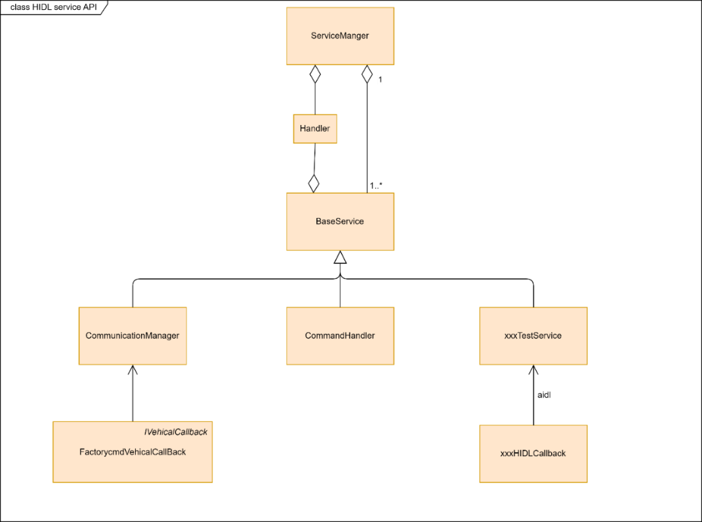
Image reference: doc_image_016.png

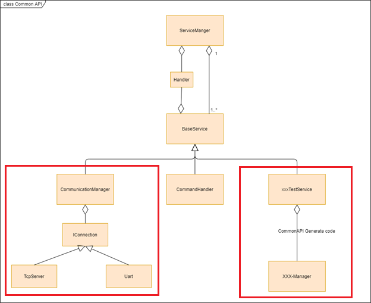
Image reference: doc_image_017.png

Table 3 Design compare

## Table
| QA | Priority | Design 1: Android HIDL Service Approach | Design 2: Common API Approach | Remark |
| --- | --- | --- | --- | --- |
| Performance | High | High. FS complete bootup: 12s in Android | High. FS complete bootup: 12s in Android | FS must have fast boot time. |
| Reliability | High | High. FS can recover, data is not lost | High. FS can recover, data is not lost | After a system corruption or sudden power off, the FS must be able to recover and ensure that data in the FS is not lost. |
| Platform Independence | High | Low. The HIDL service via AIDL is more tightly coupled to the Android platform, which limit its ability to be ported to other platforms. | High. Suitable for different hardware or operating systems. Better suited for multi-platform and non-Android environments, making it more portable. | FS should be compatibility with different platforms (hardware and operating systems). |
| Reusability | Medium | Low. Limited reusability as it is designed specifically for Android's IPC mechanisms, reducing its applicability outside the Android ecosystem. | High. Code generated through CommonAPI can be reused across multiple projects and systems without changing the FS part. | After apply this commonlization design, FS should be available for reusing source code for new project without modify. |

Final decision: Design 2 Common API approach

Design Tactic and Experimental Result

Design Tactic and Experimental Result

Table 4 Design Tactic and Experimental Result

## Table
| QA | QA Scenario | Tactic | Validation Method | Experimental Result | Experimental Result |
| --- | --- | --- | --- | --- | --- |
| QA-1 Performance | FS must have fast boot time. | Remove FactoryOS container. | Calculate booting time | Old FS | CommonAPI FS |
| QA-1 Performance | FS must have fast boot time. | Remove FactoryOS container. | Calculate booting time | 1st boot: 80s Normal: 20s | 1st boot: 45s Normal: 12s |
| QA-2 Reliability | After a system corruption or sudden power off, the FS must be able to recover and ensure that data in the FS is not lost. | Remove FactoryOS container. | Suddenly power off in 1st bootup. | Old FS | CommonAPI FS |
| QA-2 Reliability | After a system corruption or sudden power off, the FS must be able to recover and ensure that data in the FS is not lost. | Remove FactoryOS container. | Suddenly power off in 1st bootup. | Data was lost. Container could not start | Data not lost. FS restart normally |
| QA-3 Platform Independence | FS should be compatibility with different platforms (hardware and operating systems). | Use CommonAPI. Abtract Connection. | Porting FS to Renault CDC then build. | FS is compatible and build success. | FS is compatible and build success. |
| QA-4 Reusability | After apply this commonization design, FS should be available for reusing source code for new project without modify. | Use CommonAPI. | Reuse Nissan CDC source code to Renault CDC project. | FS code can be reuse without much re-implementation. | FS code can be reuse without much re-implementation. |

Common API Detail Design (Tactic Applied)

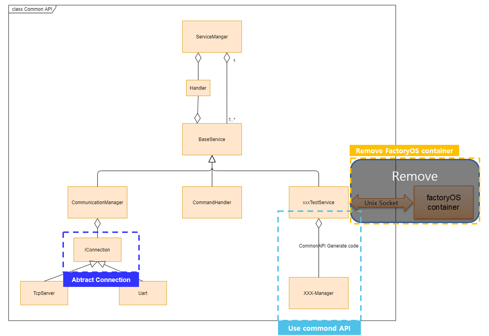
Image reference: doc_image_018.png

Figure 15 Class Diagram for CommonAPI proposal applied tactic
