# Raw Slide Content

- Source file: FA_thai.le/thai.le/Improvement the Factory Service design for commonization V2.0.pptx
- Total slides: 16

## Slide 1

Image reference: slide_01_image_01.png

Improvement the Factory Service design for commonization

LE PHUC THAI
Supervised by Eunhee.jeong
LGEDV - Factory SW Team

## Slide 2

TABLE OF CONTENT

2

2

Comparison & Decision

4

Detail Design

5

Problem Identification

Q&A

6

Architecture Design Proposals

3

1

Background

## Slide 3

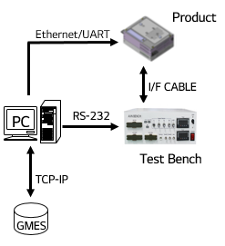
Image reference: slide_03_image_01.png

3

Background

Factory Service (FS) is the service that designed for line test in the factory.
After assembly, all products must be inspected to ensure there are free of defects before shipment

Basic Functions

Communicates with test tool with 2 mandatory connections interface: UART and TCP.
Received test command from test tool with a predefined protocol.
Communicates with others services to execute the test and respond the result to test tool.

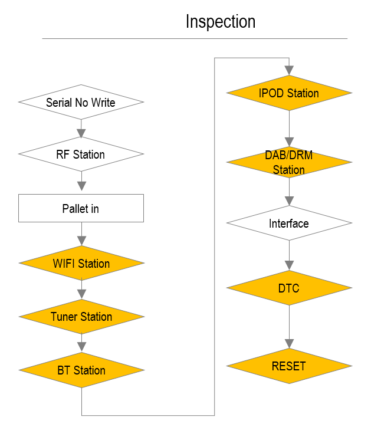
Image reference: slide_03_image_02.png

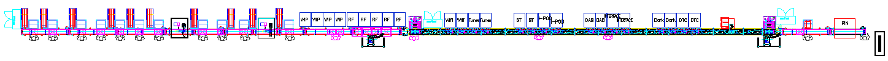
Image reference: slide_03_image_03.png

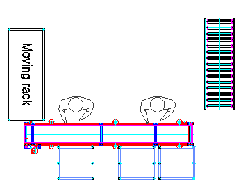
Image reference: slide_03_image_04.png

Assembly
17m

Inspection
28m

Label/Pin vision/Packing
8m

Image reference: slide_03_image_05.png

Image reference: slide_03_image_06.png

## Slide 4

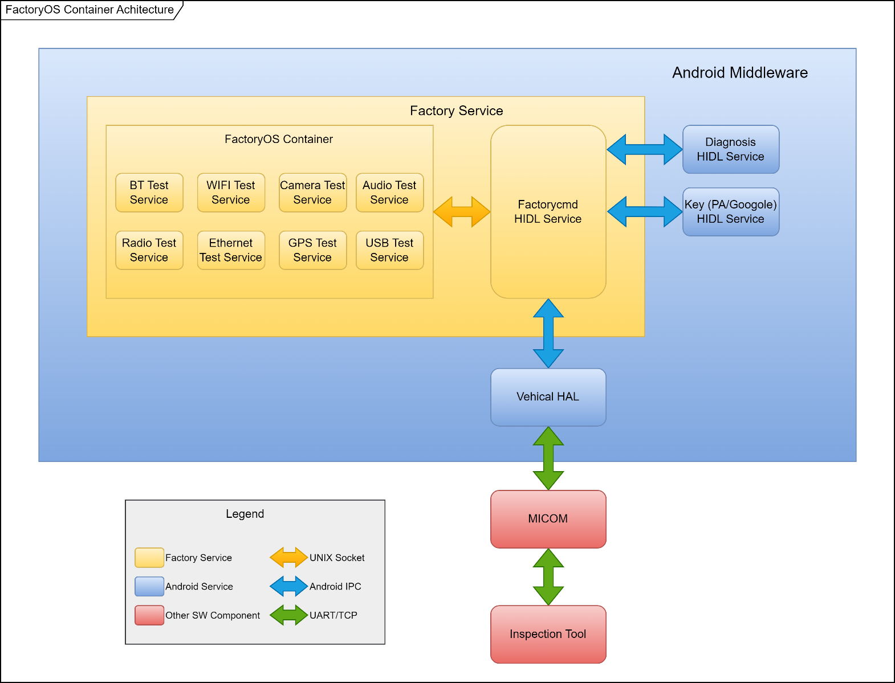
Image reference: slide_04_image_01.png

4

Problem Identification

Current design

FactoryOS Container problem:

Android OS is host.
FactoryOS (base on Linux) runs as container.
FactoryOS Container:
Include test services that execute the test command then response the result.

Performance:
Android host must bootup first, FactoryOS container start after that
Increase booting time then decrease UPH (Unit Per Hour).
Reliability:
Critical issue in FCT Production Line, need to re-flash whole SW image:
Container create fail.
Container could not start in next boot.
Platform independence:
FactoryOS is tight coupling with Linux OS and hardware-specific dependencies
Reusability:
It is difficult to reuse the FactoryOS container

## Slide 5

Quality Attribute

Constraints

### Table
| # | Constraints | Type |
| CO.01 | FS should call API from other test module (service). | Technical Constraint |
| CO.02 | FS should follow LGEDV Coding Convention, defect 0 with 24 most violated issues. http://collab.lge.com/main/display/DCVCC/LGEDV+Coding+Convention. | Technical Constraint |
| CO.03 | The standard protocol for communication between test tool and FS will not be modified after applying this Commonization design. | Business Constraint |

5

### Table
| # | QA Scenario | Quality Attribute | Priority |
| QA.01 | FS must have fast boot time. | Performance | High |
| QA.02 | After system corrupt or suddenly power off, FS must be able to recover, data in FS won’t be lost. | Reliability | High |
| QA.03 | FS should be compatibility with different platforms (hardware and operating systems). | Platform Independence | High |
| QA.04 | After apply this commonlization design, FS should be available for reusing source code for new project without modify. | Reusability | Medium |

Problem Identification

## Slide 6

6

Architecture Design Proposals

Design 1: Direct call API from Android HIDL Service

Design 1: Android HIDL Approach

Remove FactoryOS container
FS call API directly from other Android HIDL services to execute the test command.

pros:
Performance: Simplified architecture and direct communication.
 Improve booting time.
Reliability: can avoid critical issue about container create fail.

cons:
Tightly coupled to the Android platform.

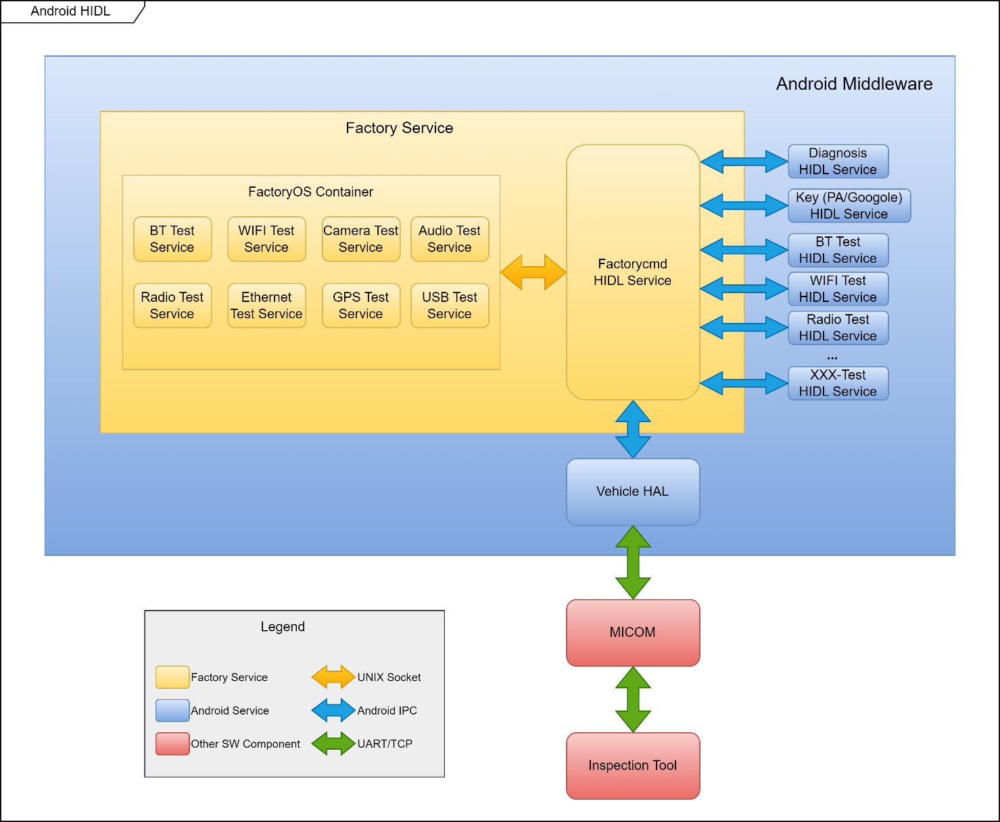
Image reference: slide_06_image_01.png

Remove

QA.01: Performance
QA.02: Reliability

QA.01:
Performance

## Slide 7

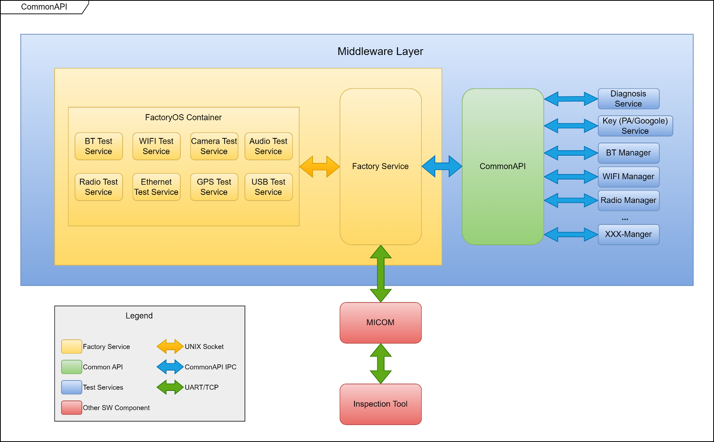
Image reference: slide_07_image_01.png

7

Design 2: Common API Approach

Remove FactoryOS container.
FS call API from other test module via CommonAPI to execute the test command.

pros:
Performance: Simplified architecture
 improve booting time.
Reliability: can avoid critical issue about container create fail.
Platform independence: supports multiple operating systems and programming languages
Reusability: standardized modular design easy reusability of code across projects.

Remove

QA.01: Performance
QA.02: Reliability

QA.03: Platform independence
QA.04: Reusability

Architecture Design Proposals

Design 2: Using CommonAPI

## Slide 8

Design Comparison

### Table
| QA | Priority | Design 1: Android HIDL Approach | Design 2: Common API Approach |
| Performance | High | High. FS complete bootup: 12s in Android. | High. FS complete bootup: 12s in Android Platform. |
| Reliability | High | High. FS can recover, FS data won’t be lost. | High. FS can recover, FS data won’t be lost. |
| Platform Independence | High | Low. The Android HIDL service is more tightly coupled to the Android platform, which limit its ability to be ported to other platforms. | High. Suitable for different hardware or operating systems. Better suited for multi-platform and non-Android environments, making it more portable. |
| Reusability | Medium | Low. Limited reusability as it is designed specifically for Android's IPC mechanisms, reducing its applicability outside the Android ecosystem. | High. Code generated through CommonAPI can be reused across multiple projects and systems without changing the FS part. |

Final Decision: Design 2 Common API approach

8

## Slide 9

9

Common API Detail Design

Image reference: slide_09_image_01.png

factoryOS
container

Unix Socket

Remove

## Slide 10

10

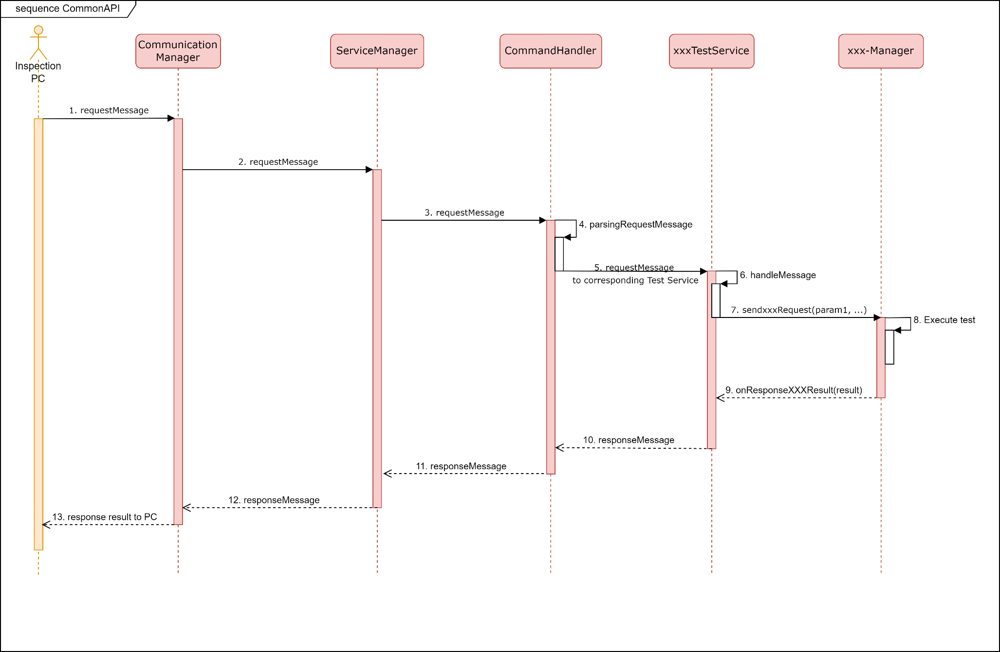
Image reference: slide_10_image_01.png

Common API Detail Design

## Slide 11

### Table
| QA | QA Scenario | Tactic | Validation Method | Experimental Result |  |
| QA-1 Performance | FS must have fast boot time. | Remove FactoryOS container. | Calculate booting time | Old FS | CommonAPI FS |
|  |  |  |  | 1st boot: 80s Normal: 20s | 1st boot: 45s Normal: 12s |
| QA-2 Reliability | After a system corruption or sudden power off, the FS must be able to recover and ensure that data in the FS is not lost. | Remove FactoryOS container. | Suddenly power off in 1st bootup. | Old FS | CommonAPI FS |
|  |  |  |  | FS Data was lost. Container could not create | FS Data NOT lost. FS restart normally |
| QA-3 Platform Independence | FS should be compatibility with different platforms (hardware and operating systems). | Use CommonAPI. Abtract Connection. | Porting FS to Renault CDC then build. | FS is compatible and build success. |  |
| QA-4 Reusability | After apply this commonization design, FS should be available for reusing source code for new project without modify. | Use CommonAPI. | Reuse Nissan CDC source code to Renault CDC project. | FS code can be reuse without much re-implementation. |  |

Common API- Design Tactic and Experimental Result

11

## Slide 12

12

Common API Detail Design (Tactic applied)

Image reference: slide_12_image_01.png

factoryOS
container

Unix Socket

Remove

Abtract Connection

Remove FactoryOS container

Use commond API

## Slide 13

Q&A

Thank you for listening

13

## Slide 14

Appendix

15

## Slide 15

15

15

Common API Introduction

Introduce about common API
CommonAPI is a middleware framework developed within the GenIVI Alliance project.
It provides a standardized interface for communication between software components in automotive infotainment systems.
Enables seamless integration, interoperability, and compatibility among different applications and services.
Platform-independent and supports multiple programming languages.

Key Benefits of CommonAPI
Standardized Interface
Reduced Development Time
Platform Independence
Improved System Stability
Interoperability and Compatibility

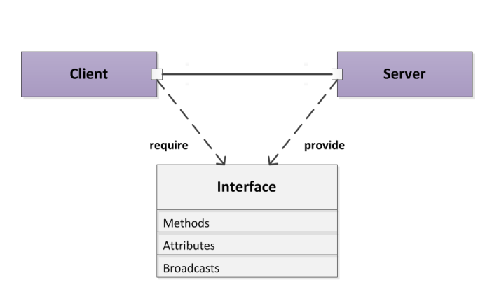
Image reference: slide_15_image_01.png

## Slide 16

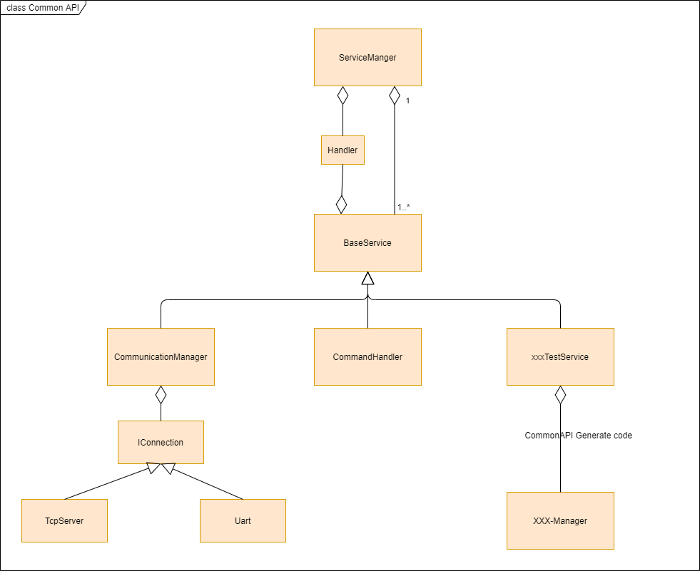
Image reference: slide_16_image_01.png

Design Comparison

Scope of change

Legend

16

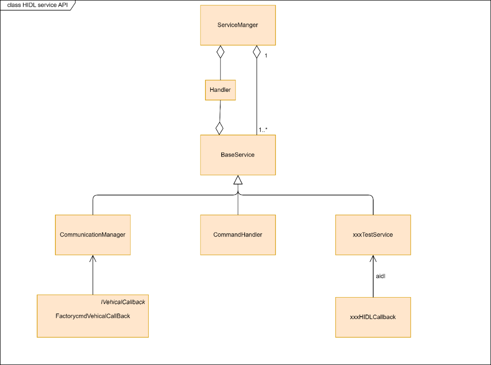
Image reference: slide_16_image_02.png

