# Raw Document Content

- Source file: FA_thai.pham_Final_20250924/FA_thai,pham_Final_20250924/FA_thai.pham_Final_20250924.docx

[25 FA] Improvement design of Sport Chrono module in Porsche E3PA Cluster

Document Information

## Table
| Document Title | Software design specification |
| --- | --- |
| Project | Porsche Cluster HMI |
| Issuing Authority | Porsche |
| Author | Pham Dong Thai (thai.pham) |
| Status of Document | In-progress |

Revision History

## Table
| Version | Date | Content of Change | Author | Reviewer |
| --- | --- | --- | --- | --- |
| 0.1 | 2025/07/30 | Initialization | Thai.pham | Ahn.Woosuk |
| 0.2 | 2025/09/05 | - Update section 1.3 Related documents - Update section 1.4 Abbreviations and terms. - Section 3.1: Update QA: Add IDs, update description - Section 3.2, 3.3: Add IDs for functional requirement and problem - Section 3.3, 4.1, 4.2: add traceability tables for quality attributes and proposal design | Thai.pham | Ahn.Woosuk |
| 0.3 | 2025/09/20 | - Remove functional requirements - Update QA-3 from “functional suitability” to “Performance” - Section 5: Update QA, separate comparison table and add explanation for the point - Section 6: Update new final design: Static and dynamic view - Section 7: Update “Improvement plan” | Thai.pham |  |

List of images

Figure 1 Sport Chrono page (Basic screen) in Tachometer screen	8

Figure 2 Screen transitions through the operation Sport Chrono	9

Figure 3 State transitions through the operation Sport Chrono	10

Figure 4 Current design of Sport Chrono	13

Figure 5 Class diagram state proposal 1	15

Figure 6 Sequence diagram state proposal 1	15

Figure 7 Class diagram state proposal 2	16

Figure 8 Sequence diagram state proposal 2	17

Figure 9 Class diagram data proposal 1	18

Figure 10 Sequence diagram data proposal 1	19

Figure 11 Class diagram data proposal 2	20

Figure 12 Sequence diagram data proposal 2	21

Figure 13 Class diagram of final solution	24

Figure 14 Example sequence diagram of final solution	27

List of tables

Table 1 Key quality attributes	11

Table 2 Number of issues by category of Sport Chrono	12

Table 3 Problem of current design	12

Table 4 Traceability of quality attribute and proposal design	13

Table 5 Traceability for problem without state usage	14

Table 6 Traceability for problem of data exchange	17

Table 7 Score range for each quality attribute	22

Table 8 Design proposals comparison for problem without state usage	22

Table 9 Design proposals comparison for problem of data exchange	23

Introduction

Purpose

This document specifies the software detailed design for improvement of Sport Chrono module in Porsche E3PA Cluster, including static design, dynamic design.

This document identifies the most effective way to design the Sport Chrono module and describes how to implement it to satisfy requirements.

Audience

The readers of this article are as follows:

Software Architect

Customer

Developer

Project Leader

Project Manager

Test Engineer

Related documents

## Table
| Document / Spec. Title | Version | Issuing Division |
| --- | --- | --- |
| UI2020+_IC_Spec_v840.pdf | 840 | OEM |
| FB Sport Chrono | 1.54 | OEM |

Abbreviations and terms

## Table
| Abbreviation | Description |
| --- | --- |
| Area B | The left display area in the Tachometer screen. It can shows: Speedometer, Traffic sign recognition, etc. |
| Area C | The center display area in the Tachometer screen. It shows RPM, Gear number, digital speed, etc. |
| Area D | The right display area in the Tachometer screen. It can shows: Trip, Sport schrono, Media, etc. |
| BAP | Bedien- und Anzeige-Protokoll. An operating and display protocol for Porsche car. |
| BC Page | A sub-screen is displayed only in an area B or area D. |
| HMIApp | Human Machine Interface Application |
| IC | Instrument cluster |
| QA | Quality attribute |
| RB_LONGPRESS | Long press on the right back button |
| RB_PRESS | Short press on the right back button |
| REQ | Requirement |
| RW_DOWN | Right wheel down |
| RW_PRESS | Short press on the right wheel |
| RW_UP | Right wheel up |
| SAD | Software Architectural Design |
| UI | User interface |

Project context

This section presents project overview and background explanation.

Overview

Sport Chrono function is a part of Sport Chrono package. Sport Chrono function includes a stopwatch and lap timer. This allows drivers to record their lap times on a racetrack, providing real-time feedback on their performance.

Additionally, the system can store multiple lap times, allowing drivers to compare their performance across different sessions. This function is particularly useful for drivers who want to monitor their progress and improve their driving skills.

Background

Sport Chrono function locates in the area D of the 3-area screen such as Tachometer screen (From the left to right is area B, area C, area D).

Driver can use up/down button on the drive wheel to select the Sport Chrono page in area D.

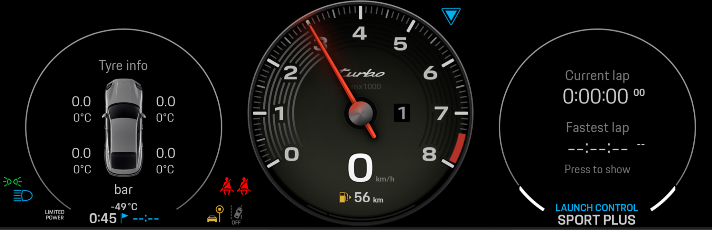
Image reference: doc_image_001.png

(From the left to right is area B, area C, area D)

Figure 1 Sport Chrono page (Basic screen) in Tachometer screen

The Sport Chrono function can be one of two main states:

Basescreen: Indication of the current time, the best lap and the info how to activate the menu functions.

Activescreen: The Sport Chrono options are displayed and the appliance of the chrono is possible.

The state basescreen has two sub-states:

Active lap timer: Time below “current time” is running.

De-active lap timer: Time below “current time” is not running. If the timer was stopped before, then here the stopped lap time is displayed otherwise the reset time “0:00:00 00” should be indicated.

The state activescreen has five sub-states:

Deactivated: Here it is possible to start the chrono lap timer.

Countdown: Here is a countdown of five seconds displayed.

Activated: Chrono lap timer is running and it is possible to stop it, to set an interim marker or to start a new lap.

Interim time: Here the current time is stopped and displayed for 3 seconds. In the background the chrono is still running. After this 3 seconds this state changes automatically to the state “activated”.

Stopped: Chrono Lap timer is stopped and it is possible to reset the timer or to continue the measure.

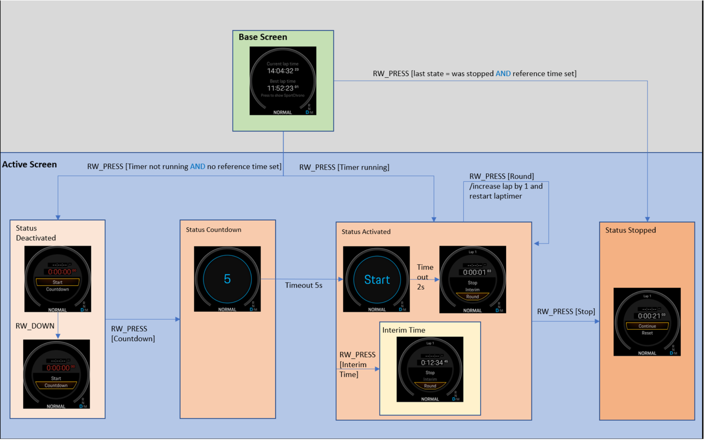
Image reference: doc_image_002.png

Figure 2 Screen transitions through the operation Sport Chrono

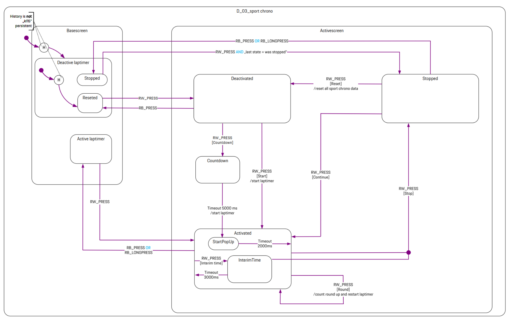
Image reference: doc_image_003.png

Figure 3 State transitions through the operation Sport Chrono

Problem definition

This section presents quality attributes and the problem to be solved.

Quality attribute

Key quality attributes that the design specification must satisfy:

Table 1 Key quality attributes

## Table
| ID | Quality Attribute | Priority | Description |
| --- | --- | --- | --- |
| QA-1 | Maintainability | High | The software must not include issue of crash, black screen, freeze, un-controlled, wrong warning icon, wrong warning message. The software should have 0 issue before mass production. |
| QA-2 | Modifiability | Medium | The customer requests about 15 upgrades per year for the system, and the Sport Chrono feature must be upgradable. |
| QA-3 | Performance | Low | Startup time must be smaller than 2.5s. The usage of resource for ROM, RAM and CPU is not exceeded 70%. |

The project goal is to achieve zero issues, and due to frequent personnel changes, maintainability is the most important with high priority. The priority of modifiability is medium because the Sport Chrono must be upgradable. And this feature does not require so much resource for graphic animation so the performance has the lowest priority.

Problem identification

Table below summarizes the number of issues by category of Sport Chrono in project E3PA since October 2024.

Table 2 Number of issues by category of Sport Chrono

## Table
| No | Issue type | Number of issues | Percentage % |
| --- | --- | --- | --- |
| 1 | Wrong BC page list of area D | 18 | 29.51 |
| 2 | Wrong screen of Sport Chrono | 17 | 27.87 |
| 3 | Wrong UI focus position | 14 | 22.95 |
| 4 | Others | 12 | 19.67 |

As shown in the table above, the most frequent issue is the wrong list BC page of area D, followed by wrong Sport Chrono screen and focus issue. The wrong BC Page list, wrong screen and wrong focus issues continue to reappear despite multiple fixes.

So the review of the current design of Sport Chrono is conducted with a focus on maintainability and modifiability.

The review result identifies some problems of the design as in the below table.

Table 3 Problem of current design

## Table
| ID | Problem description | Related QAs |
| --- | --- | --- |
| PROB-1 | SportChronoService is overloaded with responsibilities (event distribution, data management, state management, UI coordination). | QA-1 |
| PROB-2 | Manage state of the screens via many different status variables: isCloseSCAct, isLoadNode, isPressStop, isPopupActive, etc. | QA-1, QA-2 |
| PROB-3 | The logic for handling focus and menu management is not centralized and is spread over various classes: SportChronoService, SCBasicScreenActivity, SCDeactivatedScreenActivity, SCActivatedScreenActivity, SCStopScreenActivity. | QA-1, QA-3 |
| PROB-4 | Use of many static variables (bapSignal, bestTimeSignal, mChronoData) to exchange information between classes. | QA-1, QA-2, QA-3 |

The four problems can be separated into two main problems: without state usage (PROB-1, 2, 3) and data exchange (PROB-4).

With the current design, it is difficult to fix issues completely and ensure there are no side effects. It's also challenging to add new features or modify existing ones.

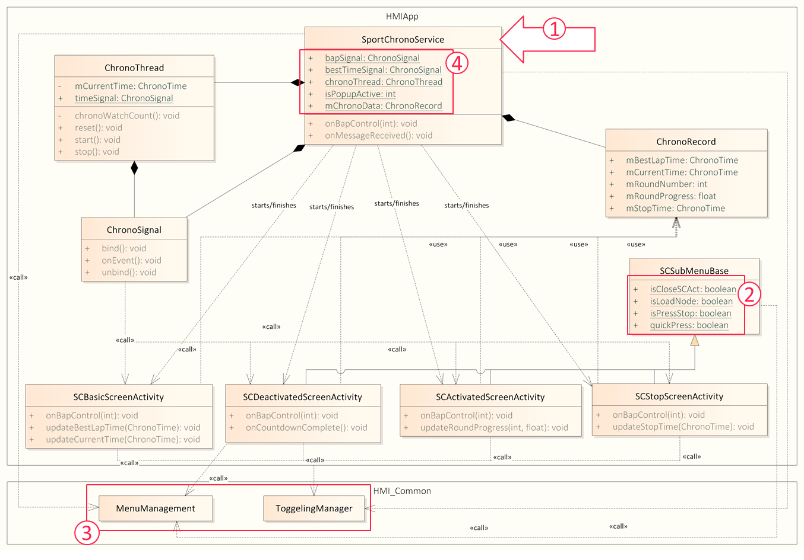
Image reference: doc_image_004.png

Figure 4 Current design of Sport Chrono

To satisfy the QA-1, QA-2 and QA-3 and resolve the PROB-1, PROB-2, PROB-3, propose the design 1: Using a center state manager and design 2: Using state pattern (alternative design).

To satisfy the QA-1, QA-3 and resolve the PROB-4, propose the design 1: Separated managers for data and event and design 2: Central manager for data and event (alternative design). Both design uses observer pattern for registration and event/data distribution.

Table 4 Traceability of quality attribute and proposal design

## Table
| QA | Problem | Problem | Proposal design |
| --- | --- | --- | --- |
| QA-1, QA-2, QA-3 | PROB-1, PROB-2, PROB-3 | Problem without state usage | Proposal 1: Using a center state manager |
| QA-1, QA-2, QA-3 | PROB-1, PROB-2, PROB-3 | Problem without state usage | Proposal 2: Using state pattern (Alternative design) |
| QA-1, QA-3 | PROB-4 | Problem of data exchange | Proposal 1: Separated managers for data and event |
| QA-1, QA-3 | PROB-4 | Problem of data exchange | Proposal 2: Central manager for both data and event (Alternative design) |

Design solution

This section provides proposals to solve the problems.

Solution for problem without state usage (PROB-1, 2, 3)

To satisfy the QA-1, QA-2 and QA-3, propose the design 1: Using a center state manager and design 2: Using state pattern (alternative design).

Table 5 Traceability for problem without state usage

## Table
| Satisfied QAs | Problems | Proposed design | Remark |
| --- | --- | --- | --- |
| QA-1 QA-2 QA-3 | PROB-1 PROB-2 PROB-3 | Proposal 1: Using a center state manager |  |
| QA-1 QA-2 QA-3 | PROB-1 PROB-2 PROB-3 | Proposal 2: Using state pattern | Alternative design |

Main ideas:

Several states will be defined in the design.

Each state represents a particular screen condition.

A state is identified by the previous state and the input from driver.

By using states, the logic of focus and menu management can be moved into 2 specified classes.

Proposal 1: Using a center state manager

Role of classes:

SportChronoService:

Central controller for the Sport Chrono feature.

Owns an instance of SCStateManager (mStateManager).

Handles timer updates, incoming messages, and publishes BAP events.

Delegates state management to SCStateManager.

SCStateManger:

Maintains the current state (mCurrentState).

Handles BAP events and updates the state accordingly.

Controls transitions (start/finish) between different screen activities.

SCMenuManagement: Updates menu state based on current activity/state.

SCFocusManager: Updates UI focus based on current activity/state.

Class diagram

Image reference: doc_image_005.png
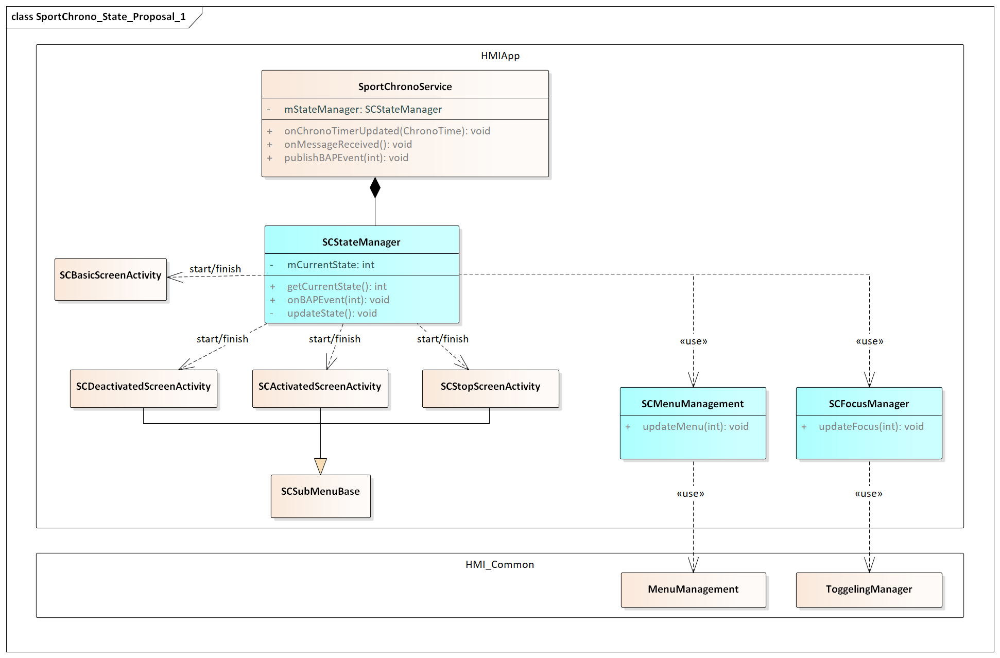
Image reference: doc_image_006.png

Figure 5 Class diagram state proposal 1

Sequence of operations

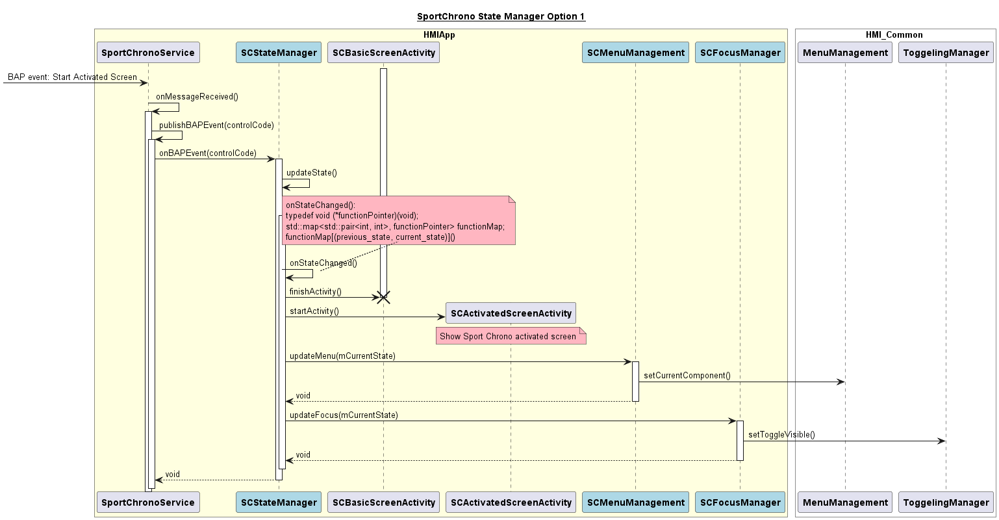
Image reference: doc_image_007.png

Figure 6 Sequence diagram state proposal 1

Advantages

Centralized state logic simplifies debugging and updating state transitions.

Re-use logic of screens change in SportChronoService

Ensuring better modularity and easier maintenance

Disadvantages

SCStateManager may become overly complex as more states and transitions are added.

If a new state is added, have to update logic in SCStateManger: new state definition, all logic to change between states and new state and handler functions.

Proposal 2: Using state pattern

Role of classes:

SCStateContext: Maintain a reference to the current state. Call the state’s methods instead of implementing its own behavior. Allow state transition.

SCScreenState, SCBasicState, SCActivatedState, etc: Encapsulates behavior associated a specific context state. Trigger transitions to other states

SCMenuManagement: Responsible for managing all logic related to menu management

SCFocusManager: Handle all focus-related logic

Class diagram

Image reference: doc_image_008.png
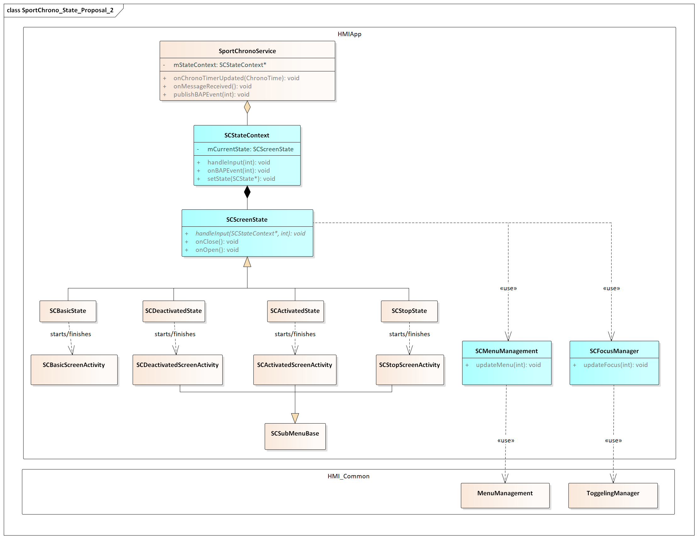
Image reference: doc_image_009.png

Figure 7 Class diagram state proposal 2

Sequence of operations

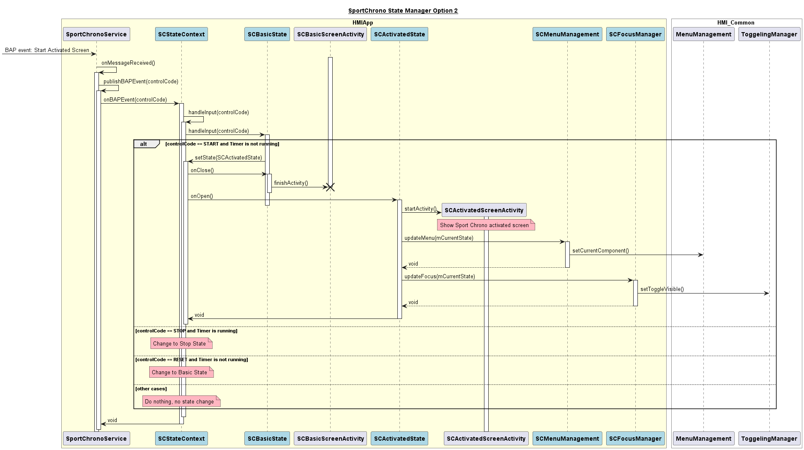
Image reference: doc_image_010.png

Figure 8 Sequence diagram state proposal 2

Advantages

Add new state without changing the SCStateContext class

Cleanly separates state-specific behavior into individual classes.

Each state encapsulates its own logic, making it easy to extend or modify.

Disadvantages

More classes and indirection compared to a simple state manager.

If a new state is added, have to update logic in all related state.

Not re-use logic of screens change in SportChronoService

Solution for problem of data exchange (PROB-4)

To satisfy the QA-1 and QA-3, propose the design 1: Separated managers for data and event and design 2: Central manager for data and event (alternative design). Both design uses observer pattern for registration and event/data distribution.

Table 6 Traceability for problem of data exchange

## Table
| Satisfied QAs | Problems | Proposed Design | Remark |
| --- | --- | --- | --- |
| QA-1 QA-3 | PROB-4 | Proposal 1: Separated managers for data and event |  |
| QA-1 QA-3 | PROB-4 | Proposal 2: Central manager for data and event | Alternative design |

Main idea:

Use observer pattern for decoupling event/data producers and consumers.

Proposal 1: Separated managers

The design proposal: using separated managers for data and event.

Role of classes:

ChronoDataManager: Update chrono data record based on value received In SportChronoService and publish chrono data to observer

ChronoEventManager: Publish chrono event and BAP control event to observer when SportChronoService receives these events.

IBapControlObserver: Notified of BAP (button/actuator panel) events.

IChronoDataObserver: Notified of chrono data updates.

IChronoEventObserver: Notified of chrono-related events.

IChronoTimerObserver: Notified of timer updates from ChronoThread.

Class diagram

Image reference: doc_image_011.png
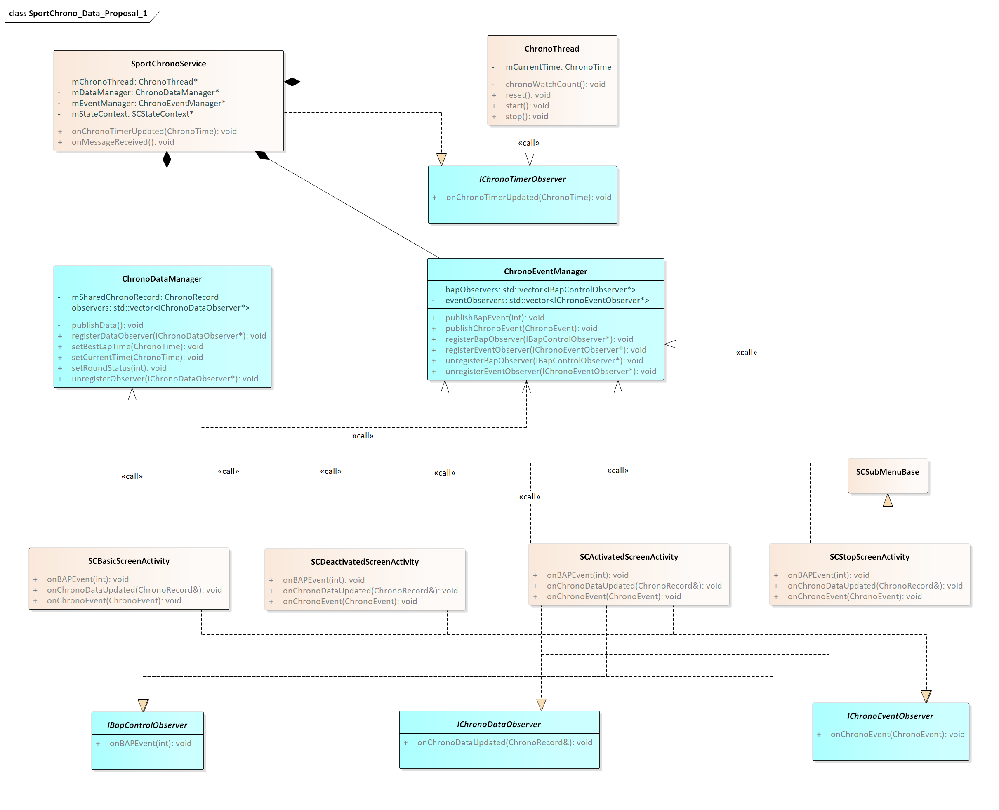
Image reference: doc_image_012.png

Figure 9 Class diagram data proposal 1

Sequence of operations

The sequence diagram below as an example describes how the BAP event and chrono time are handled and sent between ChronoThread, SportChronoService and SCBasicScreenActivity.

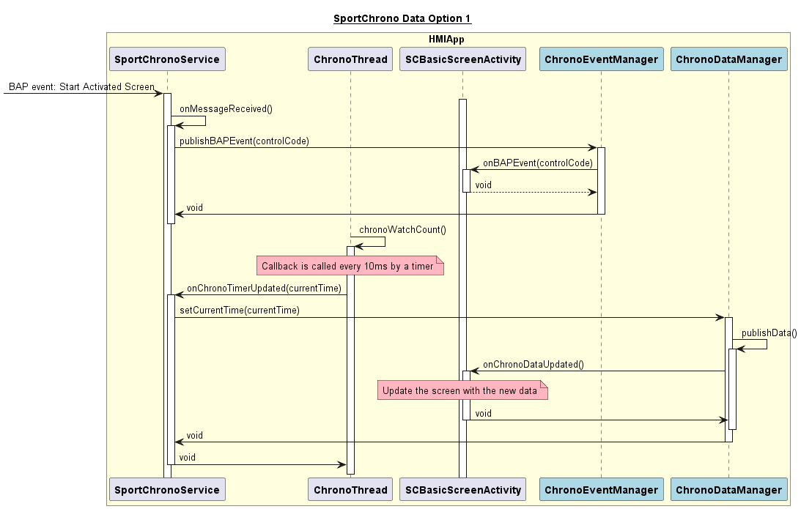
Image reference: doc_image_013.png

Figure 10 Sequence diagram data proposal 1

Advantages

SportChronoService acts as a gateway to receive the event, data from other module.

ChronoThread acts as a lap timer and can be replaced easily if system changes.

ChronoDataManager and ChronoEventManager are separated, creating cleaner responsibilities.

Each observer type has its own manager, reducing complexity in the main service.

Each manager class has a focused, well-defined purpose.

New observer types can be added with minimal impact

Disadvantages

Additional manager classes increase the overall system complexity.

Additional managers mean more code to write, test, and maintain.

Changes to manager interfaces may require updates across multiple components.

Proposal 2: Central manager

The design proposal: using a central manager for data and event.

Role of classes:

SportChronoService: the core controller, manage the data, and event flow for the Sport Chrono feature. Key Responsibilities:

Receives and processes messages/events (onMessageReceived).

Publishes events and data updates to registered observers.

Registers observers for BAP, data, and event notifications.

IBapControlObserver: Notified of BAP (button/actuator panel) events.

IChronoDataObserver: Notified of chrono data updates.

IChronoEventObserver: Notified of chrono-related events.

IChronoTimerObserver: Notified of timer updates from ChronoThread.

Class diagram

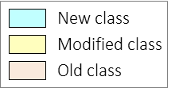
Image reference: doc_image_014.png
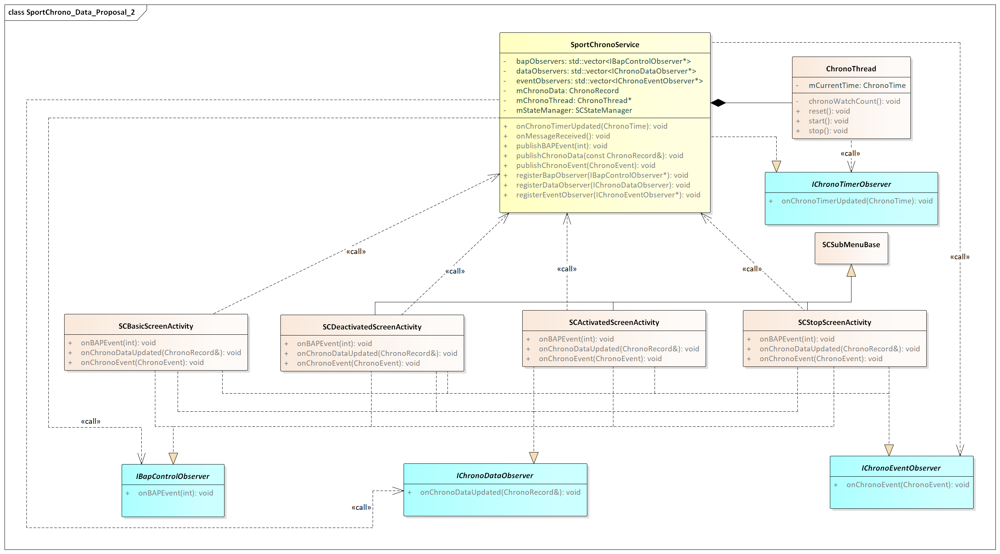
Image reference: doc_image_015.png

Figure 11 Class diagram data proposal 2

Sequence of operations

The sequence diagram below as an example describes how the BAP event and chrono time are handled and sent between ChronoThread, SportChronoService and SCBasicScreenActivity.

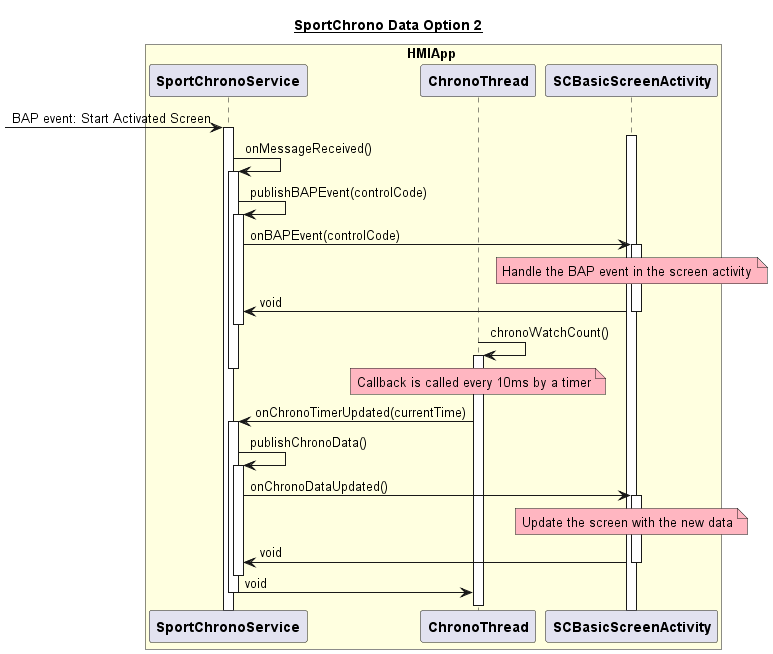
Image reference: doc_image_016.png

Figure 12 Sequence diagram data proposal 2

Advantages

New UI screens or observers can be added by implementing the relevant observer interfaces and registering with SportChronoService without affecting other classes.

Common logic is centralized, reducing code duplication.

ChronoThread acts as a lap timer and can be replaced easily if system changes.

Disadvantages

SportChronoService handles many responsibilities (event dispatch, timer management, etc.), making the system difficult to maintain and extend.

The current design may require modifying the central service and all related classes to support new observer types or events, rather than allowing for plug-and-play extensibility.

Comparison and decision

This section compares current design architecture with two proposal designs according to quality attribute criteria.

Firstly, we define score range for each quality attribute and the priority in the following table.

Table 7 Score range for each quality attribute

## Table
| ID | Quality attribute | Score range | Priority |
| --- | --- | --- | --- |
| QA-1 | Maintainability | 1 (Low) -> 3 (High) | High |
| QA-2 | Modifiability | 1 (Low) -> 3 (High) | Medium |
| QA-3 | Performance | 1 (Low) -> 3 (High) | Low |

The below tables show the final result of comparison for current design, proposal 1 and proposal 2 for problems without state usage and problem of data exchange.

Table 8 Design proposals comparison for problem without state usage

## Table
| Quality attribute | Priority | Without state usage (PROB-1, 2, 3) | Without state usage (PROB-1, 2, 3) | Without state usage (PROB-1, 2, 3) |
| --- | --- | --- | --- | --- |
| Quality attribute | Priority | Current | Proposal 1 Center State Manager | Proposal 2 State Pattern |
| Maintainability | High | (1) Hard to maintain and understand the system | (2) Simple for small systems. Hard to maintain in case of large number of state. | (3) Clear separation Easy to maintain |
| Modifiability | Medium | (1) Hard to add new function or update existed logic | (2) Requires editing the central state manger. Risk of side effect and hard to extend. | (3) Localized changes, easy to add/modify states |
| Performance | Low | (3) Low memory | (3) Low memory, efficient for few states | (1) Higher memory due to multiple state objects |
| Final decision | Final decision |  |  | Selected |

Table 9 Design proposals comparison for problem of data exchange

## Table
| Quality attribute | Priority | Data exchange (PROB-4) | Data exchange (PROB-4) | Data exchange (PROB-4) |
| --- | --- | --- | --- | --- |
| Quality attribute | Priority | Current | Proposal 1 Separated managers | Proposal 2 Central manager |
| Maintainability | High | (1) Hard to maintain and understand the system | (3) Modular, clear separation, localized logic | (2) Risk of service bloat, less separation |
| Modifiability | Medium | (1) Hard to add new function or update existed logic | (3) Easy to extend, minimal impact | (2) Centralized changes, risk of side effects |
| Performance | Low | (3) Low memory | (1) Higher memory due to extra manager objects | (2) Lower memory as compared with proposal 1 |
| Final decision | Final decision |  | Selected |  |

Decision:

In conclusion, Proposal 2: Using state pattern and Proposal 1: Separated managers are the most suitable designs based on quality attributes for problem of state usage and problem of data exchange respectively.

Implementation and verification

This section shows implementation and defines verification criteria that can determine success and failure of the proposed solutions and ensure that they meet the specified requirements.

Implementation

Static view

Image reference: doc_image_017.png

Image reference: doc_image_018.png

Figure 13 Class diagram of final solution

Role of each class:

## Table
| Class | Responsibility |
| --- | --- |
| SportChronoService | Central class for the Sport Chrono feature. Holds pointers to: ChronoThread (timing logic) ChronoDataManager (data distribution) ChronoEventManager (event distribution) SCStateManager (UI state management) Handles timer updates and incoming messages, delegates to managers. |
| ChronoThread | Handles timekeeping for the chronometer. Maintains the current time. Provides methods to start, stop, and reset the timer. Notifies IChronoTimerObserver of timer updates. |
| IChronoTimerObserver | Interface for receiving timer updates from ChronoThread. |
| ChronoDataManager | Manages chrono data (e.g., lap times, progress). Holds a shared ChronoRecord. Maintains a list of IChronoDataObserver observers. Publishes data updates and manages observer registration. |
| ChronoEventManager | Manages chrono events (e.g., start, stop, round, interim). Maintains lists of IBapControlObserver and IChronoEventObserver. Publishes events and manages observer registration. |
| SCStateContext | Implements the State pattern context, holds the current SCScreenState. |
| SCScreenState | Abstract base class for all UI states, defines interface for handling input, open/close, etc. |
| SCBasicState, SCDeactivatedState, SCActivatedState, SCStopState | Implement state-specific logic and transitions. Each state starts/finishes its corresponding screen activity. |
| SCMenuManagement | Updates the menu based on the current state/activity. Uses the global MenuManagement from HMI_Common. |
| SCFocusManager | Updates UI focus based on the current state/activity. Uses the global TogglingManager from HMI_Common. |
| SCSubMenuBase | Abstract base class for all Sport Chrono screen activities which have sub-menu Provides shared UI logic. |
| SCBasicScreenActivity, SCDeactivatedScreenActivity, SCActivatedScreenActivity, SCStopScreenActivity | Concrete UI activity classes for different Sport Chrono screens. Each implements observer interfaces to receive chrono data, and chrono events. Responsible for updating the UI based on received events/data. |
| IBapControlObserver | Interface for receiving BAP (button) control events. |
| IChronoDataObserver | Interface for receiving chrono data updates. |
| IChronoEventObserver | Interface for receiving chrono event notifications. |
| MenuManagement (HMI_Common) | Global menu manager used by SCMenuManagement. |
| TogglingManager (HMI_Common) | Global focus/toggling manager used by SCFocusManager. |

Dynamic view

The sequence diagram illustrates how the BAP event and chrono time are handled and sent between ChronoThread, SportChronoService, ChronoEventManager, ChronoDataManager, SCStateContext, SCBasicState, SCActivatedState. It aslo shows basically how the SCStateContext manages state and starts/finishes SCBasicScreenActivty and SCActivatedScreenActivity.

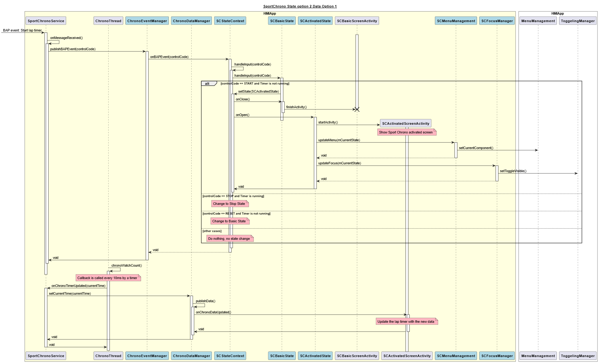
Image reference: doc_image_019.png

Figure 14 Example sequence diagram of final solution

Verification

With the new design of Sport Chrono:

Data, event, and state are handled by dedicated classes.

UI logic is separated from business logic.

New observers, screens, or events can be added with minimal impact on existing code.

Managers make it easy to register/unregister new components.

Changes to data/event handling or state logic are localized to specific classes.

Clear interfaces and responsibilities.

Analysis:

Adding a New Sport Chrono Screen

Steps:

Create a new activity class (e.g., SCNewScreenActivity) inheriting from SCSubMenuBase.

Implement the necessary observer interfaces (IChronoDataObserver, IChronoEventObserver) as needed.

Register the new activity with the appropriate managers (ChronoDataManager, ChronoEventManager).

Create new state class in inheriting from SCScreenState (e.g., SCNewState). This class will start/finish new activity class (e.g., SCNewScreenActivity)

Update SCStateContext to handle input events for new state and other states class which be changed because of new state class.

If needed, update SCMenuManagement and SCFocusManager to support the new screen.

Impact:

Minimal changes to existing code due to modular design.

Only the state manager and managers need to be aware of the new screen.

Chrono Record Change (e.g., new data field)

Steps:

Add the new field to ChronoRecord.

Update ChronoDataManager to handle the new field

Update observer interfaces and their implementations in activities to process the new data.

Update UI activities to display or react to the new data as needed.

Impact:

Changes are localized to the data manager, record, and relevant observers.

No need to modify unrelated components.

Conclusion

Conclusion:

This new architecture is modular, extensible, and maintainable. Adding new screens or changing data is straightforward and localized. The main trade-off is increased complexity and the need for careful observer management.

Future Plans:

The new architecture of Sport Chrono feature will be implemented in the E3PA Porsche Project in the beginning of 2026. Then, it can also be applied to J1PA Porsche Project.
