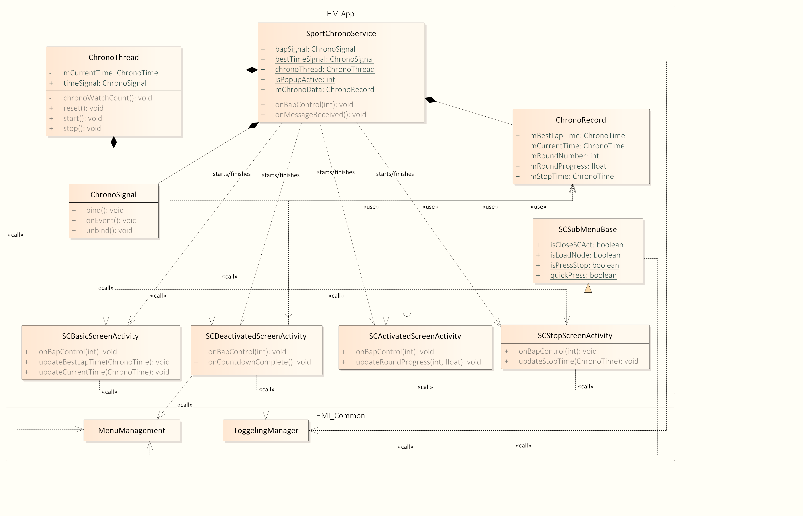
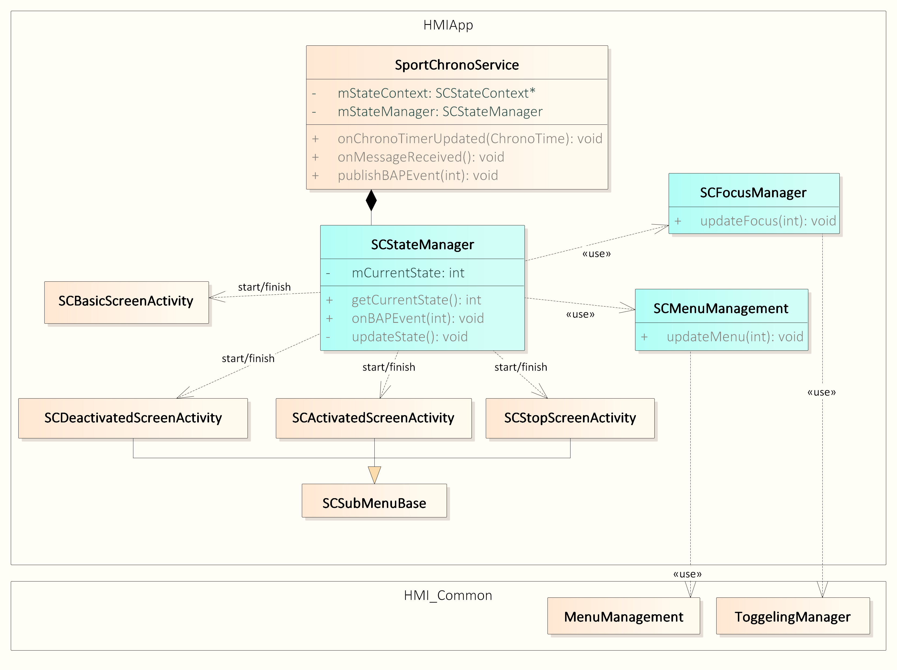
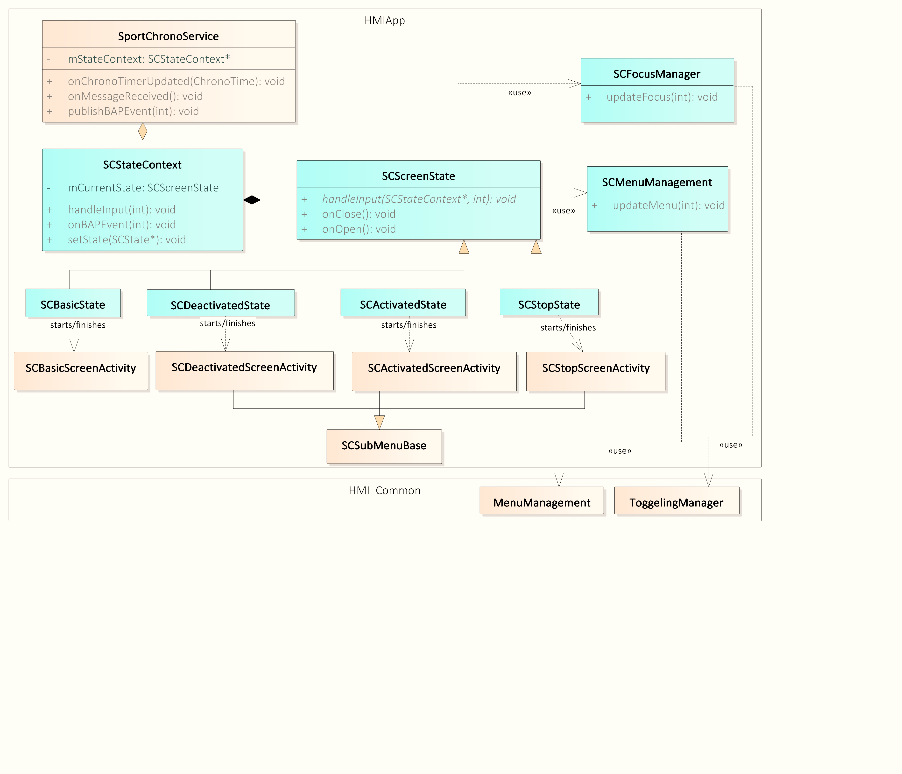
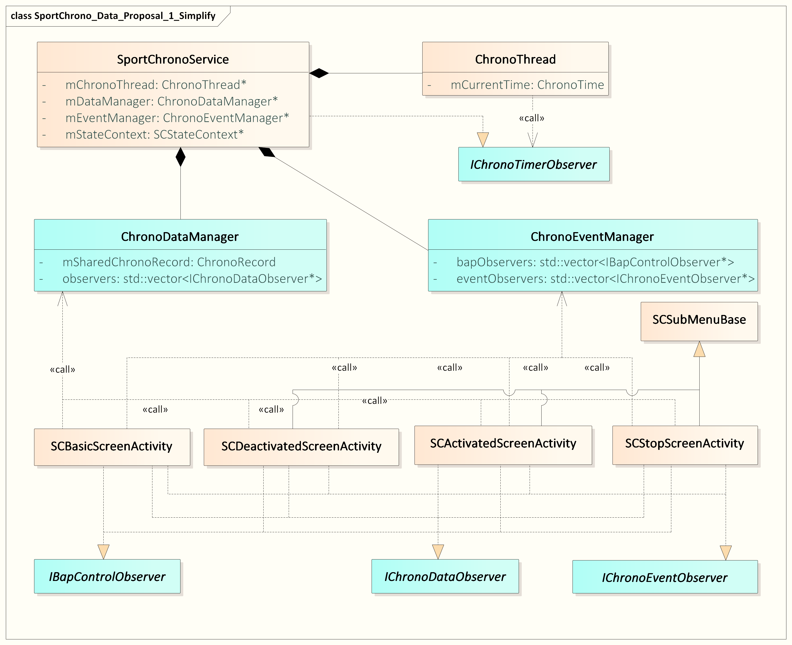
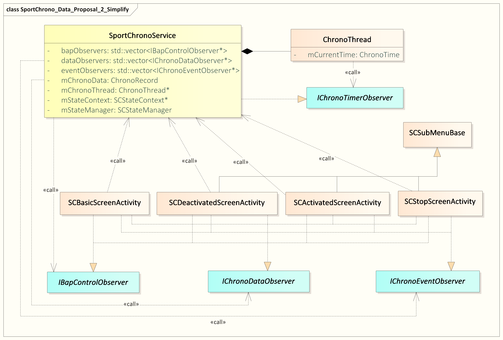
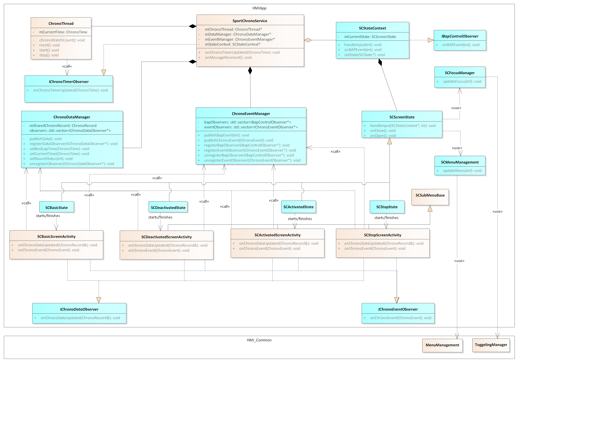
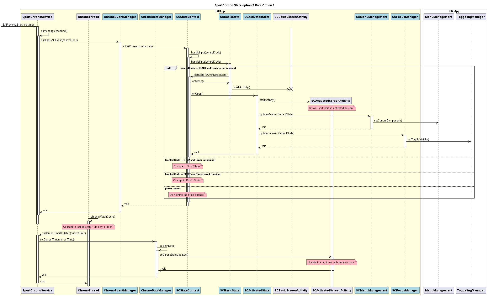

# Raw Slide Content

- Source file: FA_thai.pham_Final_20250924/FA_thai,pham_Final_20250924/FA_thai.pham_Final_20250924.pptx
- Total slides: 20

## Slide 1

[25 FA] Improvement design of Sport Chrono module in Porsche E3PA Cluster

Author: Pham Dong Thai
Mentor: Ahn Woosuk

## Slide 2

Table of Content

Overview
Quality attribute
Problem identification
Design traceability
Design solutions and Comparison
Conclusion

1

Image reference: slide_02_image_01.png

## Slide 3

Overview

Image reference: slide_03_image_01.png

The Sport Chrono feature has a stopwatch and timer. This helps drivers keep track of their lap times on a race.
The system saves several lap times, so drivers can compare how they did in different sessions.

2

## Slide 4

Quality attribute

3

### Table
| ID | Quality Attribute | Priority | Description |
| QA-1 | Maintainability | High | The software must not include issue of crash, black screen, freeze, un-controlled, wrong warning icon, wrong warning message. The software should have 0 issue before mass production. |
| QA-2 | Modifiability | Medium | The customer requests about 15 upgrades per year for the system. And the Sport Chrono feature must be upgradable. |
| QA-3 | Performance | Low | Startup time must be smaller than 2.5s. The usage of resource for ROM, RAM and CPU is not exceeded 70%. |

## Slide 5

Problem identification

### Table
| No | Issue type | Number of issue | Percentage % |
| 1 | Wrong page list | 18 | 29.51 |
| 2 | Wrong screen | 17 | 27.87 |
| 3 | Wrong UI focus position | 14 | 22.95 |
| 4 | Others | 12 | 19.67 |
|  | Total | 61 | 100 |

The number of issues by category of sport chrono in project E3PA since October 2024.

Design review is conducted with a focus on 3 quality attributes

4

### Table
| Quality Attribute | Score range | Priority |
| Maintainability | 1 (Low) -> 3 (High) | High |
| Modifiability | 1 (Low) -> 3 (High) | Medium |
| Performance | 1 (Low) -> 3 (High) | Low |

The wrong page list, wrong screen and wrong focus issues continue to reappear despite multiple fixes.

## Slide 6

Image reference: slide_06_image_01.png

Problem identification: Current class diagram

Manage screens via status variables

Many classes handle focus and menu management.

Use static variables to exchange information

The service is overloaded

4

1

2

3

1

4

2

3

2 Main Problems

WITHOUT STATE USAGE &
DATA EXCHANGE

5

The design problems make it difficult to maintain and upgrade feature.

## Slide 7

6

### Table
| Quality attribute | Problem | Proposal design |
| QA-1, QA-2, QA-3 | Problem without state usage | Proposal 1: Using a center state manager |
|  |  | Proposal 2: Using state pattern |
| QA-1, QA-3 | Problem of data exchange | Proposal 1: Separated managers for data and event |
|  |  | Proposal 2: Central manager for both data and event |

Design traceability

## Slide 8

7

Design solution for
Without State Usage

## Slide 9

Design solution: Problem without state usage

Proposal 1: Using a center state manager

Pros
Easy to locate and update state logic.
Re-use logic in the service
Fewer class to manage
Cons
Difficult to maintain in case of large number of states.
Risk of bugs in unrelated states due to shared logic.

New class

Old class

8

Image reference: slide_09_image_01.png

## Slide 10

Design solution: Problem without state usage

Proposal 2: Using state pattern

Pros
Each state has its own class
Easy to add or modify state
Cons
More classes to manage
Not re-use logic in the service class

New class

Old class

9

Image reference: slide_10_image_01.png

## Slide 11

Design solution: Comparison

Final decision: Proposal 2 – Using state pattern is selected.

10

Note: 1 (Low) -> 3 (High)

### Table
| Quality attribute | Priority | Proposal 1: Center state manager | Proposal 2: State pattern |
| Maintainability | High | (2) Simple for small systems Hard to maintain in case of large state number | (3) Clear separation Easy to maintain |
| Modifiability | Medium | (2) Requires editing the central state manger. Risk of side effect and hard to extend. | (3) Localized changes, easy to add/modify states |
| Performance | Low | (3) Low memory, efficient for few states | (1) Higher memory due to multiple state objects |

## Slide 12

11

Design solution for
Data Exchange

## Slide 13

Design solution: Problem of data exchange

Proposal 1: Separated managers for data and event

Pros
Service as gateway for events and data
Separate data and event manager
Easy to localize and debug
Easy to extend/modify with small impact
Observer pattern
Cons
More classes increase system complexity
More classes means more code to write, test and maintain

New class

Old class

12

Image reference: slide_13_image_01.png

## Slide 14

Design solution: Problem of data exchange

Proposal 2: Central manager for both data and event

Pros
Centralized logic: Reduces code duplication
New UI screens or observers can be added easily
Observer pattern
Cons
Large service make it harder to maintain.
Risk of side effect

13

Image reference: slide_14_image_01.png

New class

Modified class

Old class

## Slide 15

Design solution: Comparison

Final decision: Proposal 1 - Separated managers for data and event is selected.

14

Note: 1 (Low) -> 3 (High)

### Table
| Quality attribute | Priority | Proposal 1 Separated managers | Proposal 2 Central manager |
| Maintainability | High | (3) Modular, clear separation, localized logic | (2) Risk of service bloat, less separation |
| Modifiability | Medium | (3) Easy to extend with minimal impact | (2) Centralized changes, risk of side effects |
| Performance | Low | (1) Higher memory due to more manager objects | (2) Lower memory |

## Slide 16

Conclusisacaccon

Future plan
Apply new architecture to E3PA Porsche Project then J1PA Porsche Project.

Conclusion
Final solution: using state pattern & separated managers for data and event
New architecture: easy to change, add to and fix

15

Activity

Activity

Activity

Service

Activity

Activity

Activity

State context

Data
Manager

Event
Manager

State

State

State

Service

## Slide 17

16

THANK YOU

Q&A

## Slide 18

APPENDIX

17

## Slide 19

Final design: Static view

18

Image reference: slide_19_image_01.png

New class

Old class

## Slide 20

Final design: Dynamic view

19

Image reference: slide_20_image_01.png

