# Raw Document Content

- Source file: FA_thuong.le/Documents v5.5 - Final Submission - thuong.le/FA_BMW_RSE27_Bluetooth_Settings_thuong.le_v5.5.docx

New design for synchronizing “Bluetooth remote device information” in RSE Applications (BMW RSE27)

About This Document

Document Information

## Table
| Document Title | SW Design |
| --- | --- |
| Project | BMW RSE27 |
| Author | Le Trung Thuong (thuong.le@lge.com) |
| Status of Document | In progress |

Revision History

## Table
| Version | Date | Content of Change | Author | Reviewer |
| --- | --- | --- | --- | --- |
| 01 | 2025.09.17 | Initial Release | thuong.le | sanghyup.lee |
| 02 | 2025.09.20 | Change layout Add verification | thuong.le | sanghyup.lee |
| 03 | 2025.09.29 | Edit diagram of proposal, update functional requirements |  |  |

List of Images

Figure 1 Overview of BMW RSE system on the actual vehicle	4

Figure 2 System architecture design	4

Figure 3 Context diagram of the overall software	5

Figure 4 Use case diagram	6

Figure 5 UI application running on 2 Android screens	7

Figure 6 Component diagram of Proposal 1	8

Figure 7 Component diagram of Proposal 2	10

Figure 8 Component diagram of Proposal 2 (Failover mode)	11

Figure 9 Sequense diagram app startup	12

Figure 10 Diagram of GetConnectedStatus action implement by Proposal 1	13

Figure 11 Execution time	13

Figure 12 Diagram of GetConnectedStatus action implement by Proposal 2	13

Figure 13 Execution time	14

Figure 14 Class diagram of Application for Proposal 2	15

Figure 15 Sequence Diagram	16

Figure 16 Verification for Proposal 2	17

List of Tables

Table 1 Key Quality Attributes for design	7

Table 2 Device Aggregation Example	8

Table 3 Analysis based on Quality Attributes for Proposal 1	9

Table 4 Quality Attribute comparision	12

Table 5 Advantages & Disadvantages Summary	14

Table 6 Description of Proposal 2's Class Diagram	16

Introduction

Overview

In the RSE (Rear Seat Entertainment) project, the Bluetooth Remote Controller Management Management (Bluetooth Settings) system collects and manages remote controller devices across dual-display architecture to provide synchronized and consistent device information as reliable and accurate as possible.

The Bluetooth Remote Controller Management system can provide remote controller status, battery information, and connection state data to both display systems and other services in the RSE system.

Purpose

This document provides design information of the Bluetooth Remote Controller Management (Bluetooth Settings) system in the RSE project.

Scope

In the RSE project, the Bluetooth Remote Controller Management Management (Bluetooth Settings) is an HMI (Human Machine Interface) Android application that interacts with Bluetooth functionality through the Android Framework's BluetoothAdapter API. This document focuses exclusively on the Android application layer and does not cover lower-level Bluetooth stack implementations or hardware details.

Audience

Software architect who will evaluate the design of the software

Software developer who will implement software

Other developers who need to interact with this software

System Overview

Overview of BMW RSE system on the actual vehicle

There are two independent user screen running on android platform.

And there is one remote device which only can connect with one user screen in the certain time.

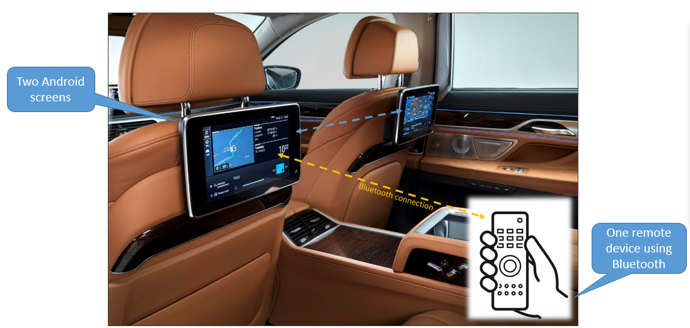
Image reference: doc_image_001.png

Figure 1 Overview of BMW RSE system on the actual vehicle

System architecture design

RSE system contains one main CPU in the center which install Android OS to run RSE android applications.

There’re two independence BT chipsets which linked with two independence RSE user screen.

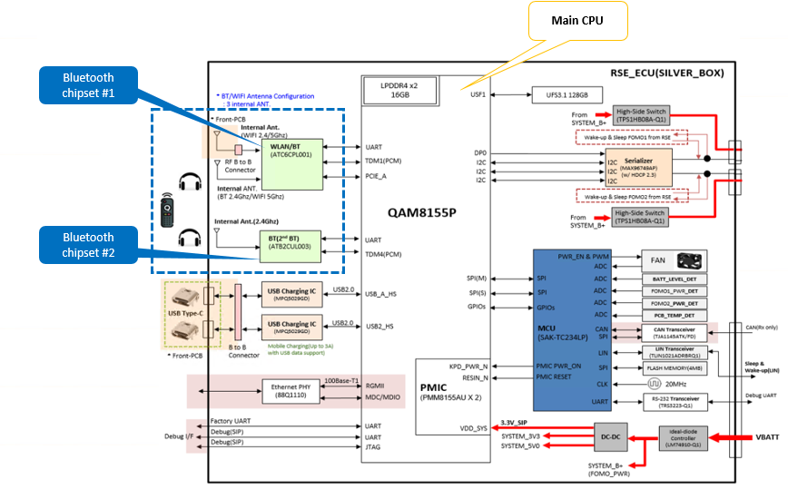
Image reference: doc_image_002.png

Figure 2 System architecture design

Context diagram of the overall software in the BMW RSE27

Each HMI application runs on both Android screens.

The Bluetooth Settings app runs as two separate processes, with one process per screen.

Similarly, the Bluetooth system service runs as two processes to communicate with the two Bluetooth chipsets.

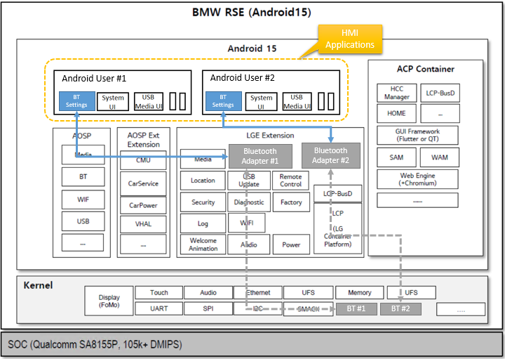
Image reference: doc_image_003.png

Figure 3 Context diagram of the overall software

Architectural Drivers

Problem Identification

Functional Requirements

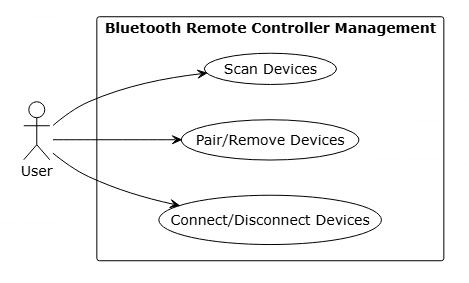
Image reference: doc_image_004.png

Figure 4 Use case diagram

We need to create a Settings application to manage Bluetooth connection for Remote Device with above functional requirements.

The remote device information displayed on the two screens must be the same.

Actions (connect, remove, pair) from any display must be reflected on the other display.

Precondition:

Android with multi-users (2 users with 2 screen) with independent Bluetooth chipsets.

Only 1ea built-in remote controller device.

Constrain:

The maximum number of remote devices that can be paired is 5.

The system only allows one remote device to connect at a certain time.

Action: Clients will scan, pair/remove/connect/disconnect Bluetooth remote controller device.

Expected:

The remote device information displayed on the two screens must be the same.

Actions (connect, remove, pair) from any display must be reflected on the other display.

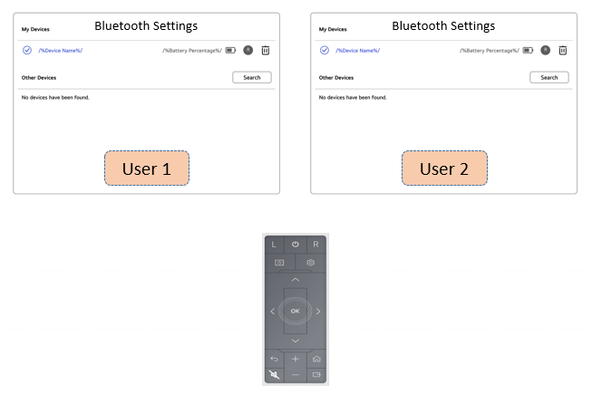
Image reference: doc_image_005.png

Figure 5 UI application running on 2 Android screens

As illustrated in the picture, the application operates on two Android screens to manage RemoteController devices, displaying essential device information and status. The system enforces that only one screen (either Screen 1 or Screen 2) can establish a Bluetooth connection with the RemoteController at any given moment. Once a successful connection is established, the RemoteController device gains control capability over both displays, allowing users to seamlessly switch control between Screen 1 and Screen 2.

Quality attributes

## Table
| Quality Attribute | Priority | QA Scenario |
| --- | --- | --- |
| Reliability | High | The information about the remote controller (name, battery level) needs to be synchronized exactly between the 2 screens. |
| Availability | High | Remote works even if one Bluetooth chipset fails. |
| Performance | Medium | System response time for users needs to be kept as small as possible (Our target: button press response < 100ms). |
| Maintainability | Medium | The structure and logic inside application need to be simple to understand and modify. |

Table 1 Key Quality Attributes for design

Architectural Design

Proposal 1: IPC Service Architecture (Dual Adapter)

The core concept of the Shared Adapter Architecture is to provide a unified view of all paired Bluetooth devices across both Android users, creating a seamless user experience regardless of which display the user interacts with.

Device Aggregation Example

The following table illustrates how devices from different Android users are combined into a single unified list:

## Table
| Paired Devices (BluetoothAdapter of Android user 1) | Paired Devices (BluetoothAdapter of Android user 2) | Bluetooth Settings App (Both screens) |
| --- | --- | --- |
| Remote Controller A | Remote Controller B | Remote Controller A |
| Remote Controller B |  | Remote Controller B |
|  |  | Remote Controller C |

Table 2 Device Aggregation Example

The main benefits of this idea:

Consistent User Experience: Both screens show the same complete list of devices from both BluetoothAdapter

Device Accessibility: Users can interact with any device from either display

Centralized Management: No need to switch between users to access different devices

Simplified UX: Single interface for all remote controller management

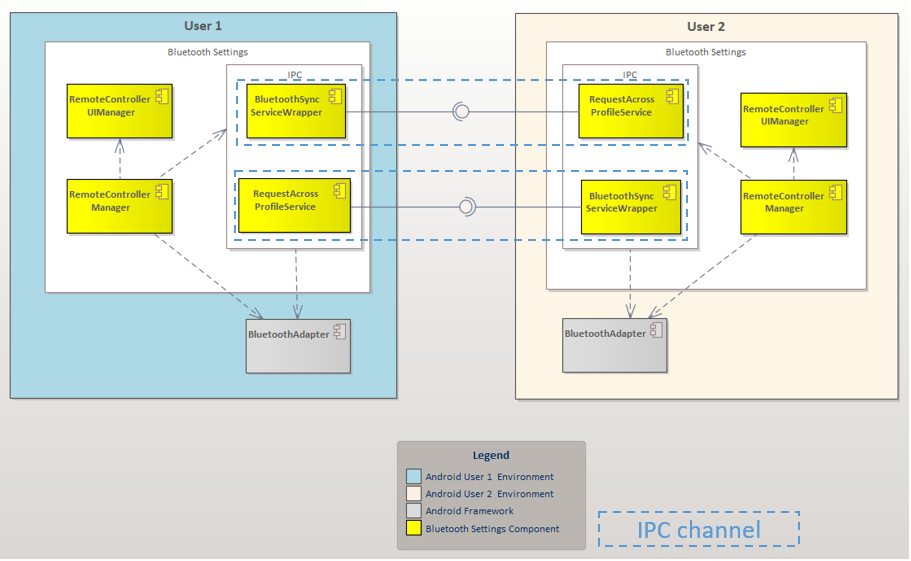
Image reference: doc_image_006.PNG

Figure 6 Component diagram of Proposal 1

Use 2 independent Bluetooth Adapters with bidirectional IPC service for data synchronization. Each Bluetooth Settings app running on different Android users (User 1 and User 2) uses its own Bluetooth Adapter and receives broadcast events from its respective user context. Both users run BluetoothSyncService and each user's BluetoothSyncServiceWrapper binds to the other user's service for cross-user communication.

Connection Setup:

User 1 Application:

Runs BluetoothSyncService locally

Uses BluetoothSyncServiceWrapper to bind to User 2's BluetoothSyncService

User 2 Application:

Runs BluetoothSyncService locally

Uses BluetoothSyncServiceWrapper to bind to User 1's BluetoothSyncService

Data Sync Flow:

When User 1's adapter detects remote controller changes → User 1 sends update to User 2's service

When User 2's adapter detects remote controller changes → User 2 sends update to User 1's service

Both services maintain local device cache and broadcast updates to their bound clients

## Table
| Quality Attribute | Analysis |
| --- | --- |
| Reliability | Challenges: Manual synchronization between services introduces potential for data conflicts, race conditions, and inconsistent states between displays Benefits: Independent adapters provide isolation from hardware-level failures Risk: IPC communication failures could result in desynchronized device states |
| Availability | High Strengths: True hardware redundancy with dual Bluetooth chipsets ensures continued operation if one adapter fails Resilience: Complete fault isolation between User 1 and User 2 adapters |
| Performance | Overhead: 10-50ms IPC latency for cross-user communication affects responsiveness Bottleneck: Service binding and message passing introduces delays in device state updates Impact: Noticeable delay in UI synchronization between displays during device connections/disconnections |
| Maintainability | Complexity: Multi-process architecture requires specialized knowledge for development and debugging Debugging: Difficult to trace issues across process boundaries |

Table 3 Analysis based on Quality Attributes for Proposal 1

Advantages:

Maximum resource utilization: Uses both Bluetooth chipsets

Independent operation: Each Bluetooth works independently

Full control: Can customize synchronization logic as needed

Disadvantages:

Complex implementation: IPC synchronization with many edge cases

Performance overhead: 10-50ms IPC latency affects button response and sync timing

Proposal 2: Shared Adapter Architecture

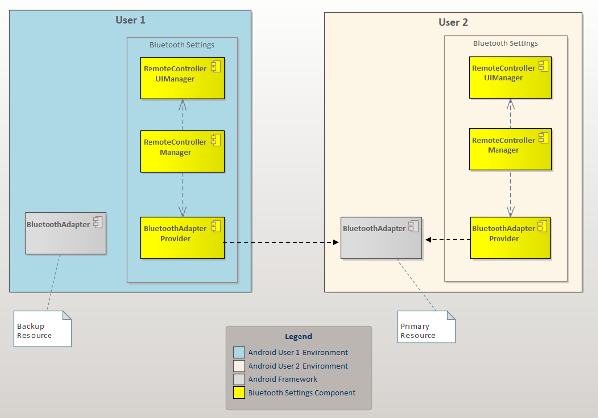
Image reference: doc_image_007.png

Figure 7 Component diagram of Proposal 2

The main idea of Proposal 2:

Use only 1 Bluetooth Adapter (default is BluetoothAdapter of Android User 2) for both Bluetooth Settings applications. Both apps receive broadcast events from User 2 Context, ensuring synchronized event handling.

Single Connection: Remote controller connects to shared BT Adapter 2

Visibility: Both Bluetooth Settings applications see the same device since they share the adapter

Management: Any action (connect/disconnect/remove) from either Bluetooth Settings app affects the same connection

Event Broadcasting: BT Adapter 2 sends broadcast events to User 2 Context, which both applications receive

Framework Dependency Consideration: However, this approach presents one notable consideration: it requires framework modifications since AOSP does not provide this functionality by default. We have discussed the technical feasibility with the Framework team, and they have confirmed their agreement to implement the necessary changes.

Mutual exclusion concerns: The Framework team has validated that mutual exclusion concerns regarding simultaneous Bluetooth chipset access by multiple applications are adequately handled through existing framework-level synchronization mechanisms. No additional application-level protection is required.

Advantages

Perfect synchronization: Single source of truth guarantees exact info sync between screens, no conflicts

High performance: Direct adapter access achieves <100ms button response

Universal visibility: Remote controller visible on both displays simultaneously, automatic sync

Disadvantages

Framework dependency: Need to discuss with the framework team about feasibility and API availability.

Underused resources : Only use 1 of 2 Bluetooth chipsets

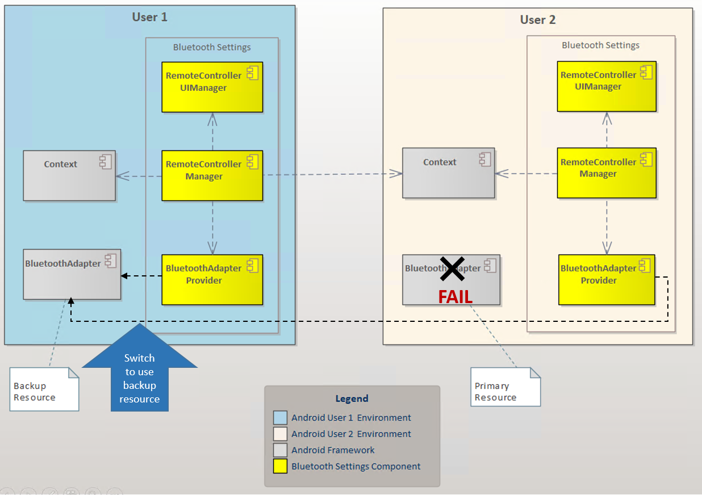
Image reference: doc_image_008.png

Figure 8 Component diagram of Proposal 2 (Failover mode)

Single Point of Failure Concern: Proposal 2 has one notable limitation - it relies on only one BluetoothAdapter as the primary adapter. This raises the question: what happens when the primary BluetoothAdapter encounters an error or fails?

Failover Solution: We will implement a health check mechanism that verifies the primary BluetoothAdapter status upon application startup. If the primary adapter is detected as faulty or unavailable, the system will automatically switch to the backup BluetoothAdapter. This approach ensures system stability and continuous operation unless both BluetoothAdapters fail simultaneously.

The sequence diagram below illustrates the application startup process and the intelligent BluetoothAdapter selection mechanism that ensures optimal system reliability.

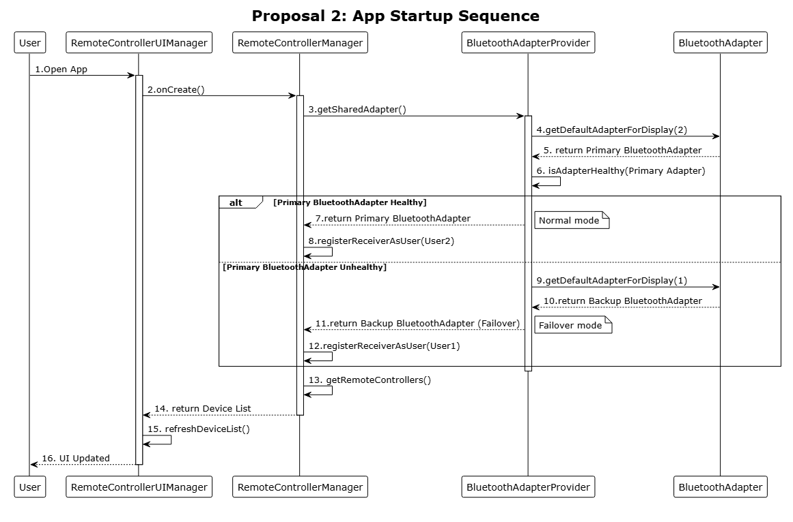
Image reference: doc_image_009.png

Figure 9 Sequense diagram app startup

Design decisions

## Table
| Quality Attribute | Priority | Proposal 1 (IPC Service) | Proposal 2 (Shared Adapter) |
| --- | --- | --- | --- |
| Reliability | High | Medium IPC sync conflicts possible | High Single source, guaranteed consistency |
| Availability | High | High Hardware redundancy, dual chipsets | High Switch to backup BluetoothAdapter if primary fail |
| Performance | Medium | Medium 10-50ms IPC latency | High Direct access, <100ms button response |
| Maintainability | Medium | Medium Complex IPC architecture | Medium Requires framework modifications and API provision |

Table 4 Quality Attribute comparision

Implementation Comparison: I developed prototype implementations of a simple "Get Connected Status" action using both architectural proposals. The diagram above illustrates the step-by-step execution flow and provides a performance comparison of action execution times between Proposal 1 and Proposal 2.

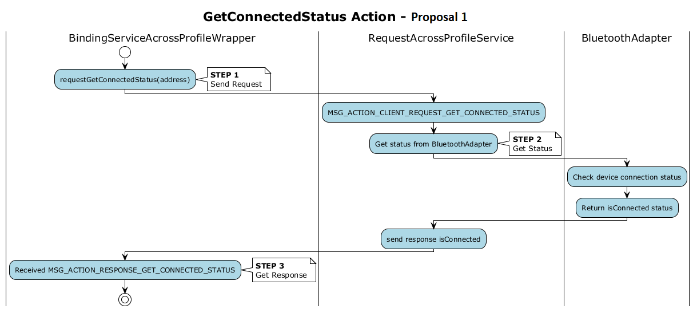
Image reference: doc_image_010.png

Figure 10 Diagram of GetConnectedStatus action implement by Proposal 1

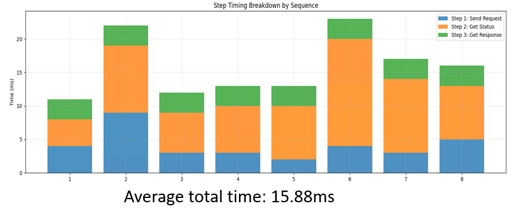
Image reference: doc_image_011.png

Figure 11 Execution time

The diagram above shows the implementation and timing for the "GetConnectedStatus" operation using Proposal 1. The average execution time for this task is 15.88ms, which includes additional overhead for sending requests and receiving responses through IPC communication.

Image reference: doc_image_012.png

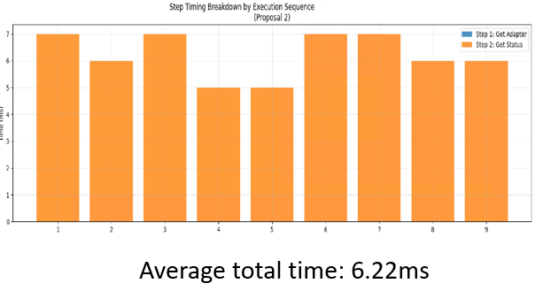
Image reference: doc_image_013.png

Figure 13 Execution time

For Proposal 2, the GetConnectedStatus operation executes significantly faster, with Step 1 (getAdapter) requiring virtually no execution time.

Performance Analysis: Comparative testing of GetConnectedStatus action execution reveals that Proposal 2 achieves significantly faster response times than Proposal 1 (6.22ms vs 15.88ms). Both architectural approaches meet the performance requirements and maintain responsive user interaction without introducing perceptible delays.

Key Decision Factors:

• Reliability vs Availability: Shared Adapter guarantees sync consistency, IPC Service offers hardware redundancy but with sync complexity risks.

Android Bluetooth Framework automatically handles mutual exclusion when multiple apps access the same Bluetooth chipset simultaneously.

• Balanced Trade-offs: Despite underutilizing system resources (only 1 of 2 adapters used) and requiring framework modifications, the better reliability, performance, and maintainability benefits justify this single-adapter approach for dual-display remote controller management.

## Table
| Key Factor | Proposal 1 (IPC Service) | Proposal 2 (Shared Adapter) |
| --- | --- | --- |
| Implementation | ❌ Complex - IPC synchronization, edge cases, conflict handling | ✅ Normal - Need to discussion with Framework side to modification |
| Performance | ❌ Overhead - 10-50ms IPC latency affects button response | ✅ Direct - No latency, optimal for real-time interaction |
| Data Sync | ❌ Manual - Custom sync between adapters, potential conflicts | ✅ Automatic - Single source of truth, guaranteed consistency |
| Framework Dependency | ✅ Independent - No specific API dependency | ❌ Dependent - Need to request framework to provide api |
| Resource Usage | ✅ Full - Uses both Bluetooth chipsets | ❌ Half - Only 1 of 2 adapters used |

Table 5 Advantages & Disadvantages Summary

After evaluating all aspects, I have decided to select Proposal 2 for implementation in my application.

✅ Selected Proposal: Proposal 2 (Shared Adapter)

Architecture Design of Chosen Proposal (Proposal 2)

Class Diagram

Image reference: doc_image_014.png

Description:

## Table
| Module | Description |
| --- | --- |
| BluetoothSetting Activity | Main activity that serves as the primary Android component for creating the application |
| RemoteControllerUIManager | Handles the logic for displaying UI elements to the user |
| RemoteControllerInfo | Model to save information of Bluetooth Remote Controller |
| RemoteControllerAdapter | Handle logic update and draw list of devices |
| RemoteControllerManager | Handle main logic |
| CurrentUserBluetoothReceiver | Receiver will receive events from Context of Current Android User and handle |
| CrossUserBluetoothReceiver | Receiver will receive events from Context of Another Android User and handle |
| BluetoothAdapterProvider | Handles BluetoothAdapter switching when needed and ensures the correct BluetoothAdapter is provided |
| BluetoothAdapter | The framework-provided module for interacting with the Bluetooth chipset |

Table 6 Description of Proposal 2's Class Diagram

Sequence Diagram for Connect Remote Device
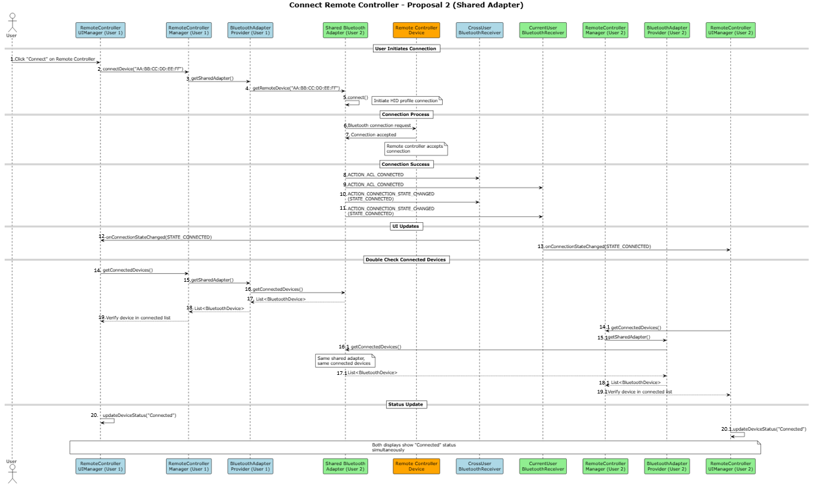
Image reference: doc_image_015.png

Description:

1. User click to connect with Remote Controller

2. UIManager request connectDevice to RemoteControllerManager

3. RemoteControllerManager get BluetoothAdapter

4. BluetoothAdapter will get RemoteDevice

5. When have RemoteDevice, will request connect via Bluetooth

6. BluetoothAdapter will send request connect via Bluetooth to RemoteController

7. BluetoothRemoteController send accept connection

8. Send ACL_CONNECTED event to Other User

9. Send ACL_CONNECTED event to Current User

10. Send STATE_CONNECTED event to Other User

11. Send STATE_CONNECTED event to Current User

12. Receiver will notice to UIManager to update UI in User 1

12. Receiver will notice to UIManager to update UI in User 2

14-15-16-17-18-19. UIManager in User1 will get connected devices from BluetoothAdapter to double check

14.1-15.1-16.1-17.1-18.1-19.1. UIManager in User2 will get connected devices from BluetoothAdapter to double check

20. UIManager in Android User 1 show connected status to user (client)

20.1. UIManager in Android User 2 show connected status to user (client)

Verification

This is a video to apply Proposal 2 in the actual project: BMW RSE27.
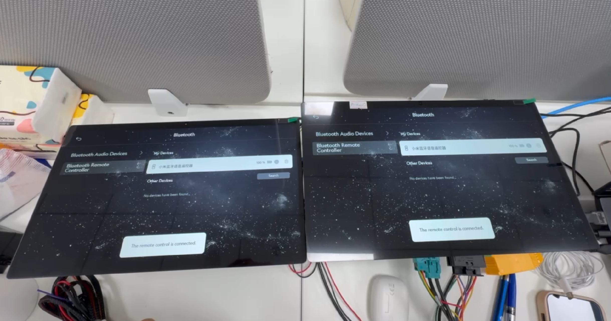
Image reference: doc_image_016.png

The application is currently being deployed and undergoing FIT testing. While there are still some minor bugs to resolve, overall it's working well according to the design specifications. The system demonstrates good performance and meets the expected functionality requirements during the testing phase.
